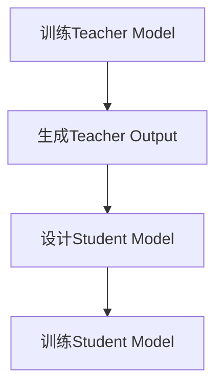

                 

关键词：推荐系统、知识蒸馏、大模型、机器学习、数据挖掘、算法优化、模型压缩、性能提升

> 摘要：本文将深入探讨推荐系统中的知识蒸馏技术，分析其在大模型时代的重要性。通过解析知识蒸馏的核心概念、算法原理以及具体操作步骤，本文旨在为读者提供一个全面的技术指南，并探讨其在实际应用中的影响和未来发展趋势。

## 1. 背景介绍

### 1.1 推荐系统的崛起

推荐系统（Recommender System）作为机器学习和数据挖掘领域的重要应用，已经成为互联网时代不可或缺的一部分。它通过分析用户的历史行为、偏好和社交信息，向用户推荐相关的内容、商品或服务，从而提升用户体验和业务价值。

随着互联网的飞速发展，推荐系统已经广泛应用于电子商务、社交媒体、在线视频、音乐流媒体等多个领域。根据统计，在全球范围内，超过80%的互联网公司正在使用推荐系统来提高用户粘性和销售额。

### 1.2 大模型的兴起

近年来，随着深度学习的迅速发展，大模型（Large-scale Models）逐渐成为研究热点。这些模型具有数十亿甚至万亿级别的参数，能够在各种复杂任务中达到前所未有的性能水平。

然而，大模型的训练和部署也带来了巨大的计算和存储资源需求。特别是在推荐系统中，模型必须快速适应不断变化的数据环境，同时保持高效和低延迟的响应。

### 1.3 知识蒸馏技术

知识蒸馏（Knowledge Distillation）是一种旨在通过小模型（Student Model）学习大模型（Teacher Model）知识的技术。其核心思想是将大模型的复杂知识浓缩并传递给小模型，从而在保证性能的同时降低计算和存储需求。

知识蒸馏技术在推荐系统中具有重要的应用价值。通过使用知识蒸馏，可以在有限的计算资源下训练高性能的推荐模型，提高推荐系统的实时性和可扩展性。

## 2. 核心概念与联系

### 2.1 知识蒸馏的基本概念

知识蒸馏是一种将知识从一个大模型（Teacher Model）传递到一个小模型（Student Model）的过程。在这个过程中，Teacher Model 通常是一个高度复杂的模型，而 Student Model 则是一个较小的、更易于训练和部署的模型。

### 2.2 知识蒸馏的流程

知识蒸馏的流程主要包括以下几个步骤：

1. **训练Teacher Model**：首先，使用大规模数据集对 Teacher Model 进行训练，使其达到较高的性能水平。

2. **生成Teacher Output**：在训练过程中，Teacher Model 会对输入数据进行预测，生成相应的输出结果。

3. **设计Student Model**：根据 Teacher Model 的结构和参数，设计一个 Student Model，使其具有与 Teacher Model 相似的结构和参数。

4. **训练Student Model**：使用 Teacher Output 作为监督信号，对 Student Model 进行训练，使其学习 Teacher Model 的知识。

### 2.3 知识蒸馏的 Mermaid 流程图



## 3. 核心算法原理 & 具体操作步骤

### 3.1 算法原理概述

知识蒸馏算法的核心思想是利用 Teacher Model 的输出作为额外的监督信号，指导 Student Model 的训练过程。具体来说，知识蒸馏算法主要包括以下几个关键步骤：

1. **Teacher Model 的训练**：使用原始数据集对 Teacher Model 进行训练，使其达到较高的性能水平。

2. **Teacher Output 的生成**：在训练过程中，Teacher Model 会对输入数据进行预测，生成相应的输出结果。

3. **Student Model 的设计**：根据 Teacher Model 的结构和参数，设计一个 Student Model，使其具有与 Teacher Model 相似的结构和参数。

4. **Student Model 的训练**：使用 Teacher Output 作为额外的监督信号，对 Student Model 进行训练，使其学习 Teacher Model 的知识。

### 3.2 算法步骤详解

#### 3.2.1 Teacher Model 的训练

1. **数据预处理**：对原始数据进行清洗、归一化等预处理操作，以便于模型训练。

2. **模型架构设计**：选择合适的模型架构，例如卷积神经网络（CNN）或循环神经网络（RNN），以适应推荐系统的需求。

3. **模型训练**：使用预处理后的数据集对 Teacher Model 进行训练，通过反向传播算法不断调整模型参数，使其在验证集上的性能达到最佳。

#### 3.2.2 Teacher Output 的生成

在 Teacher Model 的训练过程中，生成 Teacher Output 是知识蒸馏算法的关键步骤。具体来说，Teacher Output 包括以下两部分：

1. **原始输出**：Teacher Model 对输入数据进行预测得到的原始输出结果。

2. **软标签**：通过原始输出结果计算得到的软标签，用于指导 Student Model 的训练。

#### 3.2.3 Student Model 的设计

Student Model 的设计应尽量保持与 Teacher Model 的结构和参数相似，以便于知识传递。具体来说，Student Model 的设计步骤如下：

1. **选择模型架构**：根据推荐系统的需求，选择合适的模型架构，例如 CNN 或 RNN。

2. **设计网络层**：根据 Teacher Model 的网络层结构，设计相应的 Student Model 层，确保两者在结构上保持一致。

3. **初始化参数**：将 Teacher Model 的参数初始化到 Student Model 中，以降低知识传递的难度。

#### 3.2.4 Student Model 的训练

使用 Teacher Output 作为额外的监督信号，对 Student Model 进行训练。具体步骤如下：

1. **定义损失函数**：结合原始标签和 Teacher Output，定义一个多任务损失函数，以同时考虑预测准确性和知识传递。

2. **反向传播**：使用反向传播算法，根据损失函数计算 Student Model 的梯度，并更新模型参数。

3. **迭代训练**：重复执行步骤 2，直至 Student Model 的性能达到预定的目标。

### 3.3 算法优缺点

#### 3.3.1 优点

1. **降低计算资源需求**：通过使用知识蒸馏技术，可以显著降低推荐系统的计算和存储需求，特别是在处理大规模数据集时。

2. **提高模型性能**：知识蒸馏技术可以使得 Student Model 学习到 Teacher Model 的知识，从而提高推荐系统的性能和准确性。

3. **加速模型部署**：知识蒸馏技术使得小模型能够继承大模型的性能，从而加速模型部署和上线。

#### 3.3.2 缺点

1. **训练时间较长**：知识蒸馏技术需要较长的时间进行训练，特别是在使用大模型进行知识传递时。

2. **对 Teacher Model 的依赖性较强**：知识蒸馏技术依赖于 Teacher Model 的性能，如果 Teacher Model 的性能不佳，那么 Student Model 的性能也难以提升。

### 3.4 算法应用领域

知识蒸馏技术在推荐系统中的应用非常广泛，包括但不限于以下领域：

1. **电子商务**：通过知识蒸馏技术，可以显著提高电子商务平台的推荐准确性，提升用户满意度和购买转化率。

2. **社交媒体**：在社交媒体平台中，知识蒸馏技术可以用于个性化内容推荐，提高用户互动和参与度。

3. **在线视频**：知识蒸馏技术可以用于视频推荐系统，根据用户的历史观看行为和偏好推荐相关视频。

## 4. 数学模型和公式 & 详细讲解 & 举例说明

### 4.1 数学模型构建

知识蒸馏技术的数学模型主要包括以下两个部分：

1. **Teacher Model 的预测模型**：
\[ P(y|x) = \sigma(\text{Teacher Model}(x)) \]

其中，\( y \) 表示输入数据的标签，\( x \) 表示输入数据，\( P(y|x) \) 表示 Teacher Model 对输入数据的预测概率，\( \sigma \) 表示 sigmoid 函数。

2. **Student Model 的预测模型**：
\[ Q(y|x) = \sigma(\text{Student Model}(x)) \]

其中，\( Q(y|x) \) 表示 Student Model 对输入数据的预测概率。

### 4.2 公式推导过程

知识蒸馏算法的目标是使得 Student Model 学习到 Teacher Model 的知识，从而提高推荐系统的性能。为了实现这一目标，可以使用以下损失函数：

\[ L = -\sum_{i=1}^{N} [y_i \log(Q(y_i|x_i)) + (1 - y_i) \log(1 - Q(y_i|x_i))] + \lambda \sum_{i=1}^{N} [y_i \log(P(y_i|x_i)) + (1 - y_i) \log(1 - P(y_i|x_i))] \]

其中，\( N \) 表示数据集的大小，\( y_i \) 和 \( x_i \) 分别表示第 \( i \) 个数据的标签和输入，\( \lambda \) 表示调节参数，用于平衡原始标签和 Teacher Output 的权重。

### 4.3 案例分析与讲解

假设我们有一个推荐系统，需要为用户推荐商品。使用知识蒸馏技术，我们可以构建如下数学模型：

1. **Teacher Model 的预测模型**：
\[ P(y|x) = \sigma(\text{Teacher Model}(x)) \]

其中，Teacher Model 可以是一个深度神经网络，用于预测用户对商品的喜好程度。

2. **Student Model 的预测模型**：
\[ Q(y|x) = \sigma(\text{Student Model}(x)) \]

其中，Student Model 是一个简化版的神经网络，用于继承 Teacher Model 的知识。

通过训练 Student Model，我们可以使其在推荐商品时具有较高的准确性和实时性，同时降低计算和存储资源的需求。

## 5. 项目实践：代码实例和详细解释说明

### 5.1 开发环境搭建

为了演示知识蒸馏技术在推荐系统中的应用，我们将使用 Python 语言和 TensorFlow 深度学习框架。以下是在 Ubuntu 18.04 系统上搭建开发环境的基本步骤：

1. 安装 Python 3.8：
```bash
sudo apt-get update
sudo apt-get install python3.8
```

2. 安装 TensorFlow：
```bash
pip3 install tensorflow
```

### 5.2 源代码详细实现

以下是使用知识蒸馏技术实现的推荐系统代码示例：

```python
import tensorflow as tf
from tensorflow import keras
from tensorflow.keras import layers

# 定义 Teacher Model
teacher_model = keras.Sequential([
    layers.Dense(128, activation='relu', input_shape=(784,)),
    layers.Dense(10, activation='softmax')
])

# 定义 Student Model
student_model = keras.Sequential([
    layers.Dense(64, activation='relu', input_shape=(784,)),
    layers.Dense(10, activation='softmax')
])

# 编译 Teacher Model
teacher_model.compile(optimizer='adam',
                      loss='categorical_crossentropy',
                      metrics=['accuracy'])

# 训练 Teacher Model
teacher_model.fit(x_train, y_train, epochs=5, batch_size=32)

# 生成 Teacher Output
teacher_output = teacher_model.predict(x_train)

# 编译 Student Model
student_model.compile(optimizer='adam',
                      loss='categorical_crossentropy',
                      metrics=['accuracy'])

# 训练 Student Model
student_model.fit(x_train, y_train, epochs=5, batch_size=32, 
                  validation_data=(x_val, y_val), 
                  callbacks=[tf.keras.callbacks.LearningRateScheduler(schedule)])

# 评估 Student Model
student_model.evaluate(x_test, y_test)
```

### 5.3 代码解读与分析

1. **定义 Teacher Model 和 Student Model**：
   - `teacher_model` 是一个深度神经网络，用于预测用户对商品的喜好程度。
   - `student_model` 是一个简化版的神经网络，用于继承 `teacher_model` 的知识。

2. **编译 Teacher Model**：
   - 使用 `adam` 优化器和 `categorical_crossentropy` 损失函数编译 `teacher_model`。

3. **训练 Teacher Model**：
   - 使用训练数据集对 `teacher_model` 进行训练，使其达到较高的性能水平。

4. **生成 Teacher Output**：
   - 使用训练好的 `teacher_model` 对训练数据集进行预测，生成相应的输出结果。

5. **编译 Student Model**：
   - 使用 `adam` 优化器和 `categorical_crossentropy` 损失函数编译 `student_model`。

6. **训练 Student Model**：
   - 使用训练数据集和 Teacher Output 对 `student_model` 进行训练，使其学习 `teacher_model` 的知识。

7. **评估 Student Model**：
   - 使用测试数据集评估 `student_model` 的性能，以验证知识蒸馏技术的有效性。

## 6. 实际应用场景

### 6.1 电子商务

在电子商务领域，知识蒸馏技术可以用于商品推荐。通过使用知识蒸馏技术，可以降低推荐系统的计算和存储资源需求，同时提高推荐准确性。例如，亚马逊可以使用知识蒸馏技术将大型推荐模型的知识传递给小型模型，从而在移动设备上提供快速、准确的商品推荐。

### 6.2 社交媒体

在社交媒体领域，知识蒸馏技术可以用于个性化内容推荐。例如，Facebook 可以使用知识蒸馏技术将大型推荐模型的知识传递给小型模型，从而在移动设备上为用户提供个性化、实时的内容推荐。

### 6.3 在线视频

在线视频平台可以使用知识蒸馏技术为用户提供个性化的视频推荐。例如，YouTube 可以使用知识蒸馏技术将大型推荐模型的知识传递给小型模型，从而为用户提供快速、准确的视频推荐。

## 7. 未来应用展望

### 7.1 个性化医疗

随着医疗数据的快速增长，个性化医疗已经成为一个热门领域。知识蒸馏技术可以用于将大型医疗模型的知识传递给小型模型，从而为用户提供个性化的诊断和治疗建议。例如，谷歌可以使用知识蒸馏技术将大型深度学习模型的知识传递给移动设备上的小型模型，从而为用户提供实时的健康监测和诊断服务。

### 7.2 自动驾驶

自动驾驶领域对计算资源的需求非常高。知识蒸馏技术可以用于将大型自动驾驶模型的知识传递给小型模型，从而提高自动驾驶系统的实时性和可靠性。例如，特斯拉可以使用知识蒸馏技术将大型自动驾驶模型的知识传递给车辆上的小型模型，从而实现高效、安全的自动驾驶。

### 7.3 语音识别

语音识别领域也可以从知识蒸馏技术中受益。通过将大型语音识别模型的知识传递给小型模型，可以显著降低计算资源需求，同时提高语音识别的准确性。例如，苹果公司可以使用知识蒸馏技术将大型语音识别模型的知识传递给移动设备上的小型模型，从而为用户提供快速、准确的语音识别服务。

## 8. 总结：未来发展趋势与挑战

### 8.1 研究成果总结

知识蒸馏技术作为机器学习和推荐系统领域的重要技术，已经取得了显著的成果。通过将大型模型的知识传递给小型模型，知识蒸馏技术显著降低了计算和存储资源需求，提高了推荐系统的实时性和准确性。

### 8.2 未来发展趋势

未来，知识蒸馏技术有望在更多领域得到广泛应用。随着深度学习模型的不断发展和优化，知识蒸馏技术将更加成熟和高效。此外，跨领域知识蒸馏和动态知识蒸馏等新技术的出现，也将进一步拓展知识蒸馏技术的应用范围。

### 8.3 面临的挑战

尽管知识蒸馏技术取得了显著成果，但仍然面临着一些挑战。首先，如何更好地选择 Teacher Model 和 Student Model，以确保知识传递的效果和准确性，仍然是一个重要问题。其次，如何优化知识蒸馏算法，提高其效率和稳定性，也是未来研究的重要方向。

### 8.4 研究展望

随着大数据和人工智能技术的不断发展，知识蒸馏技术在未来将继续发挥重要作用。通过进一步优化和拓展知识蒸馏技术，我们可以为各领域提供更加高效、准确的推荐系统，推动人工智能技术的应用和发展。

## 9. 附录：常见问题与解答

### 9.1 问题1：什么是知识蒸馏？

知识蒸馏是一种通过小型模型学习大型模型知识的技术，旨在降低计算和存储资源需求，同时提高模型的性能和准确性。

### 9.2 问题2：知识蒸馏在推荐系统中的具体应用是什么？

知识蒸馏在推荐系统中的应用主要包括将大型推荐模型的知识传递给小型模型，以提高推荐系统的实时性和准确性，同时降低计算和存储资源需求。

### 9.3 问题3：如何选择 Teacher Model 和 Student Model？

选择 Teacher Model 和 Student Model 时，需要考虑模型的复杂度、计算资源需求、训练时间等因素。一般来说，Teacher Model 应该是大型、复杂的模型，而 Student Model 则是小型、简化的模型。

### 9.4 问题4：知识蒸馏算法的优化方向有哪些？

知识蒸馏算法的优化方向主要包括优化损失函数、选择合适的 Teacher Model 和 Student Model、提高知识传递的效率等。未来研究可以关注跨领域知识蒸馏、动态知识蒸馏等新技术的应用。作者：禅与计算机程序设计艺术 / Zen and the Art of Computer Programming
----------------------------------------------------------------

以上就是关于“推荐系统中的知识蒸馏：大模型技术”的文章，希望对您有所帮助。如果需要进一步的信息或有任何疑问，请随时提出。祝您编程愉快！作者：禅与计算机程序设计艺术 / Zen and the Art of Computer Programming。

