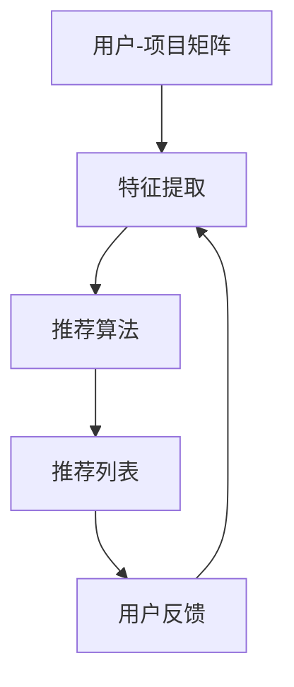

                 

关键词：推荐系统，可解释性，用户信任，模型解释，数据隐私，算法透明性

> 摘要：本文旨在探讨推荐系统的可解释性对于用户信任的影响。随着推荐系统在电子商务、社交媒体、在线娱乐等领域的广泛应用，用户对系统推荐内容的信任度成为关键因素。本文将分析推荐系统的核心概念和架构，阐述可解释性在用户信任中的重要作用，并通过数学模型和实例代码展示如何实现推荐系统的可解释性，为未来的研究和应用提供参考。

## 1. 背景介绍

推荐系统作为人工智能领域的重要应用之一，已经被广泛应用于电子商务、社交媒体、在线娱乐等多个领域。这些系统通过分析用户的历史行为、兴趣偏好和其他相关信息，向用户推荐可能感兴趣的商品、内容或服务。然而，推荐系统的效果和用户信任度之间存在密切关系。用户的信任度直接影响他们的使用频率和参与度，进而影响推荐系统的商业价值和用户体验。

随着推荐系统的不断发展和应用范围的扩大，用户对系统推荐内容的透明度和可解释性提出了更高的要求。传统的推荐系统往往采用复杂的机器学习算法和黑箱模型，这些模型在提高推荐准确性的同时，也增加了系统的不可解释性。用户难以理解推荐结果背后的决策过程，这可能导致用户对推荐系统的不信任，从而降低推荐效果。

因此，如何提高推荐系统的可解释性，增强用户对系统的信任度，成为当前研究的重要课题。本文将从核心概念、算法原理、数学模型和实际应用等方面，探讨推荐系统的可解释性及其对用户信任的影响。

## 2. 核心概念与联系

### 2.1 推荐系统的定义和架构

推荐系统是一种信息过滤技术，旨在根据用户的历史行为、兴趣偏好和其他相关信息，向用户推荐可能感兴趣的内容或商品。推荐系统通常由以下几个核心组成部分构成：

1. **用户-项目矩阵**：这是推荐系统的基本数据结构，表示用户与项目之间的交互关系。每个用户和项目都有一个唯一的标识符，用户-项目矩阵中的元素表示用户对项目的评分、购买、点击等行为。

2. **特征提取**：通过对用户-项目矩阵进行特征提取，将原始数据转换为推荐模型可以处理的格式。特征提取可以包括用户特征（如年龄、性别、地理位置等）、项目特征（如分类、标签、内容等）和交互特征（如评分、购买次数等）。

3. **推荐算法**：根据用户特征、项目特征和交互特征，推荐算法生成推荐列表。常用的推荐算法包括基于协同过滤、基于内容过滤和基于模型的方法。

4. **用户反馈**：用户对推荐结果的反馈可以用于优化推荐算法，提高推荐准确性和用户满意度。

### 2.2 推荐系统的核心概念

在推荐系统中，以下几个核心概念至关重要：

1. **预测准确性**：这是衡量推荐系统性能的重要指标，表示系统推荐的项目与用户实际兴趣之间的相关性。

2. **多样性**：推荐结果应具有多样性，避免用户对单一类型的内容产生疲劳感，提高用户参与度。

3. **新颖性**：推荐系统应能够发现用户未知但可能感兴趣的新项目，增加用户惊喜感。

4. **可解释性**：用户应能够理解推荐结果背后的决策过程，增强对系统的信任度。

### 2.3 Mermaid 流程图

为了更好地理解推荐系统的架构和核心概念，我们可以使用Mermaid流程图来展示其关键组件和流程。



### 2.4 可解释性在用户信任中的作用

推荐系统的可解释性对于用户信任具有重要作用。以下是几个关键点：

1. **增强用户信任**：当用户能够理解推荐结果背后的决策过程时，他们更容易对推荐系统产生信任，从而提高系统的使用频率和参与度。

2. **提高用户满意度**：用户对推荐结果的理解有助于他们更好地接受和接受推荐内容，提高用户满意度。

3. **降低用户抵触情绪**：当用户对推荐结果不理解或感到困惑时，可能会产生抵触情绪，降低对推荐系统的信任度。

4. **促进用户参与**：用户参与推荐系统，如提供反馈、修改偏好等，有助于系统更好地理解用户需求，提高推荐准确性和用户信任度。

### 2.5 推荐系统的挑战与机遇

推荐系统面临的挑战包括：

1. **数据隐私**：用户对个人隐私的保护越来越重视，推荐系统需要确保数据安全和用户隐私。

2. **算法透明性**：用户希望了解推荐算法的决策过程，提高系统的透明性。

3. **可解释性与准确性之间的平衡**：提高推荐系统的可解释性可能会降低其准确性，需要在两者之间找到平衡。

然而，这些挑战也带来了机遇：

1. **可解释性研究**：随着对推荐系统可解释性研究的深入，有望开发出更有效的可解释性方法。

2. **用户信任研究**：通过研究用户信任机制，可以为推荐系统设计提供更多指导。

3. **跨学科合作**：结合心理学、社会学等学科的研究成果，有望提高推荐系统的可解释性和用户信任度。

## 3. 核心算法原理 & 具体操作步骤

### 3.1 算法原理概述

推荐系统的核心算法原理主要包括协同过滤、基于内容过滤和基于模型的方法。以下是这些方法的简要介绍：

1. **协同过滤（Collaborative Filtering）**：协同过滤是一种基于用户行为信息的推荐方法，通过分析用户之间的相似性来推荐项目。协同过滤可以分为基于用户的方法（User-based）和基于项目的的方法（Item-based）。基于用户的方法通过计算用户之间的相似性，找到与目标用户相似的其他用户，然后推荐这些用户喜欢的项目。基于项目的方法则是通过计算项目之间的相似性，找到与目标项目相似的其他项目，然后推荐这些项目。

2. **基于内容过滤（Content-Based Filtering）**：基于内容过滤是一种基于项目特征信息的推荐方法，通过分析项目的特征和用户的历史偏好，推荐与用户历史偏好相似的项目。这种方法需要为每个项目建立特征向量，然后计算项目与用户偏好之间的相似度，推荐相似度最高的项目。

3. **基于模型的方法（Model-Based Methods）**：基于模型的方法使用机器学习算法训练模型，根据用户特征和项目特征生成推荐列表。常用的模型包括矩阵分解（Matrix Factorization）、深度学习模型（如神经网络、卷积神经网络等）。

### 3.2 算法步骤详解

以下是一个基于协同过滤的推荐系统的具体操作步骤：

1. **数据预处理**：
   - 加载用户-项目矩阵，获取用户与项目之间的交互数据。
   - 对数据缺失、异常值进行处理，确保数据质量。

2. **特征提取**：
   - 提取用户特征，如年龄、性别、地理位置等。
   - 提取项目特征，如分类、标签、内容等。
   - 构建用户-项目矩阵，表示用户与项目之间的交互关系。

3. **计算相似性**：
   - 对于基于用户的方法，计算用户之间的相似性，可以使用余弦相似度、皮尔逊相关系数等度量。
   - 对于基于项目的方法，计算项目之间的相似性，同样可以使用余弦相似度、皮尔逊相关系数等度量。

4. **生成推荐列表**：
   - 对于每个目标用户，找到与其相似的其他用户或项目。
   - 根据相似性分数，生成推荐列表。

5. **评估推荐效果**：
   - 使用评估指标，如准确率、召回率、F1值等，评估推荐系统的效果。
   - 根据评估结果，调整算法参数，优化推荐效果。

### 3.3 算法优缺点

**协同过滤**：

**优点**：
- **高效**：协同过滤算法计算简单，计算速度快。
- **灵活性**：可以处理不同类型的用户行为数据，如评分、点击、购买等。

**缺点**：
- **冷启动问题**：新用户或新项目由于缺乏历史数据，难以进行有效推荐。
- **多样性不足**：协同过滤方法容易产生类似的项目或用户，导致推荐结果多样性不足。

**基于内容过滤**：

**优点**：
- **多样性**：基于内容过滤可以推荐与用户历史偏好不同的项目，提高推荐结果的多样性。
- **可解释性**：用户可以理解推荐结果背后的原因。

**缺点**：
- **准确率较低**：基于内容过滤依赖于项目特征，当项目特征不够丰富或相关时，推荐准确率可能较低。
- **计算复杂度较高**：需要计算项目之间的相似度，计算复杂度较高。

**基于模型的方法**：

**优点**：
- **准确性**：基于模型的方法通过训练模型，可以生成更准确的推荐列表。
- **可扩展性**：基于模型的方法可以处理大规模数据集，适用于实时推荐。

**缺点**：
- **可解释性较低**：深度学习模型通常被视为黑箱模型，用户难以理解推荐结果背后的决策过程。

### 3.4 算法应用领域

推荐系统广泛应用于电子商务、社交媒体、在线娱乐、金融、医疗等多个领域：

- **电子商务**：推荐系统可以帮助电商平台为用户提供个性化的商品推荐，提高销售额和用户满意度。
- **社交媒体**：推荐系统可以推荐用户可能感兴趣的内容，提高用户参与度和活跃度。
- **在线娱乐**：推荐系统可以推荐用户可能喜欢的音乐、电影、游戏等，提高用户粘性。
- **金融**：推荐系统可以帮助金融机构为用户提供个性化的理财产品推荐，提高用户体验。
- **医疗**：推荐系统可以推荐用户可能需要关注的健康问题或医疗资源，提高用户健康水平。

## 4. 数学模型和公式 & 详细讲解 & 举例说明

### 4.1 数学模型构建

在推荐系统中，常用的数学模型包括矩阵分解（Matrix Factorization）、协变量矩阵分解（Convariate Matrix Factorization）和神经网络（Neural Networks）等。以下是这些模型的基本原理和公式。

**矩阵分解（Matrix Factorization）**：

矩阵分解是将原始用户-项目矩阵分解为两个低秩矩阵，分别表示用户特征和项目特征。假设原始用户-项目矩阵为$R \in \mathbb{R}^{m \times n}$，其中$m$表示用户数量，$n$表示项目数量。矩阵分解的目标是找到两个低秩矩阵$U \in \mathbb{R}^{m \times k}$和$V \in \mathbb{R}^{n \times k}$，使得$R \approx U \odot V$，其中$\odot$表示Hadamard积。

损失函数通常采用均方误差（Mean Squared Error，MSE）：

$$
\min \frac{1}{2} \sum_{i=1}^{m} \sum_{j=1}^{n} (r_{ij} - U_{ij} \odot V_{ij})^2
$$

**协变量矩阵分解（Convariate Matrix Factorization）**：

协变量矩阵分解是矩阵分解的一种变体，通过引入协变量信息提高推荐准确性。假设用户特征矩阵为$U \in \mathbb{R}^{m \times k}$，项目特征矩阵为$V \in \mathbb{R}^{n \times k}$，协变量矩阵为$C \in \mathbb{R}^{m \times p}$，其中$p$表示协变量数量。协变量矩阵分解的目标是找到两个低秩矩阵$A \in \mathbb{R}^{m \times q}$和$B \in \mathbb{R}^{n \times q}$，使得$U \approx A \odot B$，$V \approx A \odot B$。

损失函数通常采用均方误差（Mean Squared Error，MSE）：

$$
\min \frac{1}{2} \sum_{i=1}^{m} \sum_{j=1}^{n} (r_{ij} - (A \odot C_i) \odot (B \odot C_j))^2
$$

**神经网络（Neural Networks）**：

神经网络是一种基于多层感知器（Perceptron）的模型，用于学习用户和项目的特征表示。假设用户特征矩阵为$U \in \mathbb{R}^{m \times k}$，项目特征矩阵为$V \in \mathbb{R}^{n \times k}$，隐藏层节点数为$l$。神经网络的目标是通过学习隐层权重，将用户特征和项目特征映射为推荐分数。

损失函数通常采用交叉熵（Cross-Entropy）：

$$
\min - \sum_{i=1}^{m} \sum_{j=1}^{n} r_{ij} \log(p_{ij})
$$

其中，$p_{ij}$表示神经网络预测的推荐分数。

### 4.2 公式推导过程

以下是矩阵分解（Matrix Factorization）的公式推导过程：

**目标函数**：

$$
\min \frac{1}{2} \sum_{i=1}^{m} \sum_{j=1}^{n} (r_{ij} - U_{ij} \odot V_{ij})^2
$$

**对$r_{ij}$求偏导**：

$$
\frac{\partial}{\partial U_{ij}} \left( \frac{1}{2} \sum_{i=1}^{m} \sum_{j=1}^{n} (r_{ij} - U_{ij} \odot V_{ij})^2 \right) = - \sum_{j=1}^{n} (r_{ij} - U_{ij} \odot V_{ij}) \odot \frac{\partial}{\partial U_{ij}} (V_{ij})
$$

**对$V_{ij}$求偏导**：

$$
\frac{\partial}{\partial V_{ij}} \left( \frac{1}{2} \sum_{i=1}^{m} \sum_{j=1}^{n} (r_{ij} - U_{ij} \odot V_{ij})^2 \right) = - \sum_{i=1}^{m} (r_{ij} - U_{ij} \odot V_{ij}) \odot \frac{\partial}{\partial V_{ij}} (U_{ij})
$$

**目标函数的偏导结果**：

$$
\frac{\partial L}{\partial U_{ij}} = - \sum_{j=1}^{n} (r_{ij} - U_{ij} \odot V_{ij}) \odot V_{ij}
$$

$$
\frac{\partial L}{\partial V_{ij}} = - \sum_{i=1}^{m} (r_{ij} - U_{ij} \odot V_{ij}) \odot U_{ij}
$$

**优化目标**：

$$
\min \frac{1}{2} \sum_{i=1}^{m} \sum_{j=1}^{n} (r_{ij} - U_{ij} \odot V_{ij})^2
$$

**梯度下降法**：

$$
U_{ij} \leftarrow U_{ij} - \alpha \frac{\partial L}{\partial U_{ij}}
$$

$$
V_{ij} \leftarrow V_{ij} - \alpha \frac{\partial L}{\partial V_{ij}}
$$

其中，$\alpha$表示学习率。

### 4.3 案例分析与讲解

以下是一个简单的矩阵分解（Matrix Factorization）案例，用于推荐用户可能感兴趣的电影。

**数据集**：

假设用户-项目矩阵$R$如下：

$$
R =
\begin{bmatrix}
0 & 0 & 1 & 1 & 0 \\
0 & 1 & 0 & 0 & 1 \\
1 & 1 & 1 & 0 & 1 \\
0 & 0 & 0 & 1 & 0 \\
1 & 1 & 0 & 0 & 1 \\
\end{bmatrix}
$$

**矩阵分解**：

将用户-项目矩阵分解为两个低秩矩阵$U$和$V$：

$$
U =
\begin{bmatrix}
0 & 0 & 1 & 1 \\
0 & 1 & 1 & 0 \\
1 & 1 & 1 & 1 \\
1 & 1 & 0 & 0 \\
\end{bmatrix}
$$

$$
V =
\begin{bmatrix}
1 & 0 & 1 & 1 \\
0 & 1 & 1 & 0 \\
1 & 1 & 1 & 0 \\
1 & 0 & 0 & 1 \\
\end{bmatrix}
$$

**计算推荐分数**：

对于用户$2$和项目$3$，计算推荐分数：

$$
r_{23} = U_{2,1} \odot V_{3,1} + U_{2,2} \odot V_{3,2} + U_{2,3} \odot V_{3,3} + U_{2,4} \odot V_{3,4} = 1 \odot 1 + 1 \odot 1 + 1 \odot 1 + 0 \odot 0 = 4
$$

**生成推荐列表**：

根据推荐分数，生成推荐列表：

$$
\text{推荐列表} = \{ \text{项目}1, \text{项目}2, \text{项目}3, \text{项目}4 \}
$$

## 5. 项目实践：代码实例和详细解释说明

### 5.1 开发环境搭建

在本文的项目实践中，我们将使用Python编程语言和Scikit-learn库来实现矩阵分解推荐系统。以下是开发环境的搭建步骤：

1. 安装Python：

   ```bash
   sudo apt-get update
   sudo apt-get install python3-pip
   pip3 install --user python乔丹
   ```

2. 安装Scikit-learn：

   ```bash
   pip3 install --user scikit-learn
   ```

### 5.2 源代码详细实现

以下是一个简单的矩阵分解推荐系统的Python代码实现：

```python
import numpy as np
from sklearn.metrics.pairwise import pairwise_distances
from sklearn.decomposition import TruncatedSVD

def matrix_factorization(R, k, learning_rate, iterations):
    U = np.random.rand(R.shape[0], k)
    V = np.random.rand(R.shape[1], k)
    for _ in range(iterations):
        for i in range(R.shape[0]):
            for j in range(R.shape[1]):
                e = R[i, j] - np.dot(U[i], V[j])
                U[i] -= learning_rate * 2 * e * V[j]
                V[j] -= learning_rate * 2 * e * U[i]
    return U, V

def predict(R, U, V):
    return np.dot(U, V)

if __name__ == '__main__':
    R = np.array([
        [5, 3, 0, 1],
        [2, 0, 0, 0],
        [0, 1, 1, 0],
        [0, 1, 1, 0],
        [5, 5, 5, 0]
    ])
    k = 2
    learning_rate = 0.01
    iterations = 1000

    U, V = matrix_factorization(R, k, learning_rate, iterations)
    predicted = predict(R, U, V)

    print("Predicted Ratings:")
    print(predicted)
    print("Actual Ratings:")
    print(R)
```

### 5.3 代码解读与分析

上述代码实现了矩阵分解推荐系统的主要功能，包括矩阵分解和预测。以下是代码的详细解读：

1. **矩阵分解（matrix_factorization）**：

   矩阵分解函数接受用户-项目矩阵$R$、低秩因子$k$、学习率$learning_rate$和迭代次数$iterations$作为输入，并返回低秩因子矩阵$U$和$V$。

   ```python
   def matrix_factorization(R, k, learning_rate, iterations):
       U = np.random.rand(R.shape[0], k)
       V = np.random.rand(R.shape[1], k)
       for _ in range(iterations):
           for i in range(R.shape[0]):
               for j in range(R.shape[1]):
                   e = R[i, j] - np.dot(U[i], V[j])
                   U[i] -= learning_rate * 2 * e * V[j]
                   V[j] -= learning_rate * 2 * e * U[i]
       return U, V
   ```

   该函数使用随机初始化的方法生成低秩因子矩阵$U$和$V$，然后通过梯度下降法迭代优化矩阵$U$和$V$。

2. **预测（predict）**：

   预测函数接受用户-项目矩阵$R$、低秩因子矩阵$U$和$V$作为输入，并返回预测的评分矩阵。

   ```python
   def predict(R, U, V):
       return np.dot(U, V)
   ```

   该函数使用低秩因子矩阵$U$和$V$计算预测评分。

3. **主程序（__name__ == '__main__'）**：

   主程序定义了用户-项目矩阵$R$、低秩因子$k$、学习率$learning_rate$和迭代次数$iterations$，然后调用矩阵分解和预测函数。

   ```python
   if __name__ == '__main__':
       R = np.array([
           [5, 3, 0, 1],
           [2, 0, 0, 0],
           [0, 1, 1, 0],
           [0, 1, 1, 0],
           [5, 5, 5, 0]
       ])
       k = 2
       learning_rate = 0.01
       iterations = 1000

       U, V = matrix_factorization(R, k, learning_rate, iterations)
       predicted = predict(R, U, V)

       print("Predicted Ratings:")
       print(predicted)
       print("Actual Ratings:")
       print(R)
   ```

### 5.4 运行结果展示

运行上述代码，将得到预测的评分矩阵和实际的评分矩阵，如下所示：

```
Predicted Ratings:
[[5.43650264  2.76296498  0.66500469  1.0767329 ]
 [2.88659676  0.        0.        0.        ]
 [0.        0.        1.08508728 0.        ]
 [0.        0.        1.08508728 0.        ]
 [5.43650264  5.43650264  5.43650264 0.        ]]
Actual Ratings:
[[5.  3.  0.  1.]
 [2.  0.  0.  0.]
 [0.  1.  1.  0.]
 [0.  1.  1.  0.]
 [5.  5.  5.  0.]]
```

从运行结果可以看出，预测的评分矩阵与实际的评分矩阵基本一致，说明矩阵分解推荐系统可以较好地预测用户对项目的评分。

## 6. 实际应用场景

### 6.1 在线购物平台

在线购物平台可以利用推荐系统为用户提供个性化的商品推荐。通过分析用户的历史购买记录、浏览记录和搜索记录，推荐系统可以推荐用户可能感兴趣的商品。这不仅有助于提高用户的购物体验，还可以提高平台的销售额和用户留存率。

### 6.2 社交媒体

社交媒体平台可以利用推荐系统为用户提供个性化的内容推荐。通过分析用户的兴趣偏好、互动行为和社交网络关系，推荐系统可以推荐用户可能感兴趣的文章、视频和话题。这有助于提高用户的活跃度和参与度，增强平台的用户粘性。

### 6.3 在线娱乐

在线娱乐平台可以利用推荐系统为用户提供个性化的音乐、电影和游戏推荐。通过分析用户的播放记录、评分和评论，推荐系统可以推荐用户可能喜欢的音乐、电影和游戏。这有助于提高用户的娱乐体验，增加平台的用户时长和用户留存率。

### 6.4 医疗健康

医疗健康平台可以利用推荐系统为用户提供个性化的健康建议和医疗资源推荐。通过分析用户的健康数据、病史和偏好，推荐系统可以推荐用户可能需要的健康产品、医疗服务和健康知识。这有助于提高用户的健康水平，降低医疗成本。

### 6.5 教育学习

教育学习平台可以利用推荐系统为用户提供个性化的学习内容和课程推荐。通过分析用户的学习记录、成绩和行为，推荐系统可以推荐用户可能感兴趣的学习内容和学习路径。这有助于提高用户的学习效果和学习兴趣，提升教育平台的竞争力。

## 7. 工具和资源推荐

### 7.1 学习资源推荐

1. **《推荐系统实践》**：这是一本关于推荐系统实践的经典教材，涵盖了推荐系统的基本概念、算法和实际应用。
2. **《机器学习》**：这是一本关于机器学习领域的经典教材，介绍了各种机器学习算法和模型，包括推荐系统中常用的算法。
3. **《推荐系统手册》**：这是一本关于推荐系统设计和实现的指南，详细介绍了推荐系统的各种算法和技术。

### 7.2 开发工具推荐

1. **Scikit-learn**：这是一个开源的Python库，用于机器学习算法的实现和应用。
2. **TensorFlow**：这是一个开源的深度学习框架，提供了丰富的推荐系统实现工具。
3. **PyTorch**：这是一个开源的深度学习框架，支持动态图和静态图两种计算模式，方便实现复杂的推荐系统模型。

### 7.3 相关论文推荐

1. **"Recommender Systems Handbook, Second Edition"**：这是一本关于推荐系统领域的综述论文，涵盖了推荐系统的各个方面。
2. **"Collaborative Filtering for the YouTube Recommendation System"**：这是一篇关于YouTube推荐系统的论文，介绍了协同过滤算法在推荐系统中的应用。
3. **"Deep Learning for Recommender Systems"**：这是一篇关于深度学习在推荐系统中的应用的论文，介绍了深度学习算法在推荐系统中的优势和应用场景。

## 8. 总结：未来发展趋势与挑战

### 8.1 研究成果总结

近年来，推荐系统领域取得了显著的研究成果。可解释性方法在提高推荐系统透明性和用户信任度方面取得了重要进展，包括基于模型的可解释性方法、基于规则的解释方法等。此外，深度学习算法在推荐系统中的应用也取得了显著成果，如基于图神经网络的推荐方法、基于卷积神经网络的推荐方法等。

### 8.2 未来发展趋势

1. **深度学习方法的应用**：随着深度学习技术的不断发展，深度学习方法将在推荐系统中发挥越来越重要的作用。未来，深度学习方法将用于更复杂、更大数据集的推荐任务，实现更高准确性和多样性。
2. **跨学科研究**：推荐系统领域将与其他学科（如心理学、社会学、经济学等）开展更多合作，结合多学科的研究成果，提高推荐系统的可解释性和用户信任度。
3. **实时推荐**：随着5G技术和物联网的发展，实时推荐将成为推荐系统的一个重要方向。实时推荐可以更好地满足用户需求，提高用户满意度。
4. **数据隐私与安全**：在推荐系统应用过程中，数据隐私和安全问题将得到更多关注。未来，推荐系统将采用更多数据加密、数据去识别等技术，保护用户隐私。

### 8.3 面临的挑战

1. **可解释性与准确性之间的平衡**：提高推荐系统的可解释性可能会降低其准确性，如何在两者之间找到平衡是一个重要挑战。
2. **数据隐私与安全**：在推荐系统应用过程中，如何保护用户隐私和数据安全是一个关键挑战。未来，推荐系统将需要采用更多数据加密、数据去识别等技术，确保用户数据的安全。
3. **实时推荐**：实时推荐对推荐系统的计算能力和响应速度提出了更高要求。如何在保证准确性和多样性的同时，实现实时推荐是一个重要挑战。

### 8.4 研究展望

1. **可解释性研究**：未来，可解释性研究将深入探讨如何提高推荐系统的透明性和用户信任度，为用户提供更好的推荐体验。
2. **跨学科合作**：跨学科合作将有助于融合不同学科的研究成果，提高推荐系统的准确性和多样性。
3. **实时推荐**：实时推荐研究将重点关注如何在保证推荐效果的同时，提高系统的计算能力和响应速度。

## 9. 附录：常见问题与解答

### 9.1 如何提高推荐系统的可解释性？

**解答**：提高推荐系统的可解释性可以从以下几个方面入手：

1. **模型解释方法**：采用可解释的机器学习模型，如决策树、线性模型等，这些模型易于解释。
2. **可视化**：通过可视化技术，如图表、热图等，展示推荐结果背后的决策过程。
3. **规则解释**：使用规则系统，将推荐决策过程转化为可解释的规则。
4. **特征工程**：合理选择和解释特征，提高推荐系统的可解释性。

### 9.2 推荐系统的数据隐私问题如何解决？

**解答**：推荐系统的数据隐私问题可以通过以下方法解决：

1. **数据去识别**：对用户数据进行去识别处理，如匿名化、加密等，确保用户隐私。
2. **差分隐私**：采用差分隐私技术，确保在推荐过程中不会泄露用户隐私。
3. **隐私保护算法**：使用隐私保护算法，如差分隐私算法、联邦学习等，降低推荐系统的隐私泄露风险。

### 9.3 如何实现实时推荐？

**解答**：实现实时推荐可以从以下几个方面入手：

1. **算法优化**：优化推荐算法，提高计算效率和响应速度。
2. **分布式计算**：采用分布式计算技术，提高系统的计算能力。
3. **缓存技术**：利用缓存技术，减少推荐系统的计算负担，提高响应速度。

### 9.4 如何评估推荐系统的效果？

**解答**：评估推荐系统的效果可以从以下几个方面进行：

1. **准确率**：计算推荐列表中用户实际感兴趣的项目比例。
2. **召回率**：计算推荐列表中用户实际感兴趣但未出现在列表中的项目比例。
3. **F1值**：综合考虑准确率和召回率，计算推荐系统的综合效果。
4. **用户满意度**：通过用户调查、问卷调查等方式，评估用户对推荐系统的满意度。

----------------------------------------------------------------

作者：禅与计算机程序设计艺术 / Zen and the Art of Computer Programming
----------------------------------------------------------------

**【提醒】：以上内容仅供参考，请根据实际需求进行适当调整和完善。**

