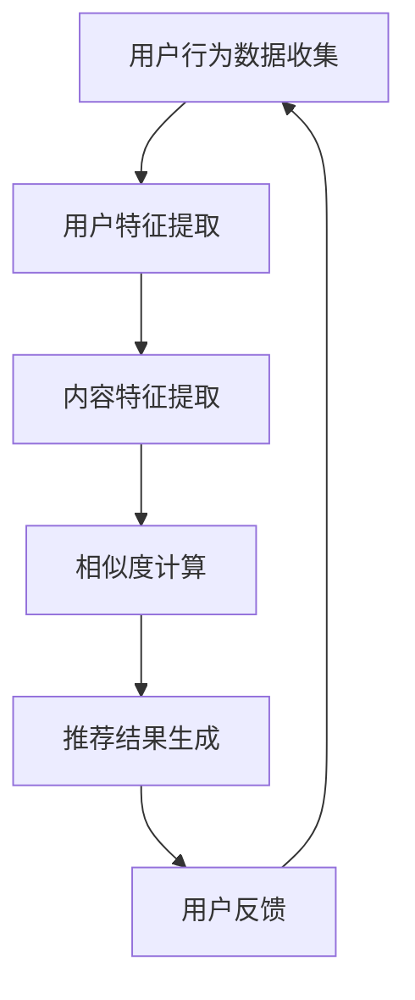

                 

关键词：推荐系统、长期效应、AI大模型、用户行为、个性化、数据驱动、模型优化、隐私保护、交互体验。

> 摘要：本文将探讨推荐系统在人工智能大模型视角下的长期效应。通过分析用户行为数据，探讨如何利用AI大模型提升推荐系统的准确性和个性化，并深入探讨长期效应中的隐私保护和交互体验问题。

## 1. 背景介绍

推荐系统作为现代信息检索和推荐技术的重要组成部分，旨在为用户推荐他们可能感兴趣的内容。随着互联网和大数据技术的发展，推荐系统在电子商务、社交媒体、新闻推送等众多领域得到了广泛应用。然而，推荐系统并非一成不变，而是需要不断优化和调整，以适应不断变化的市场需求和用户行为。

近年来，人工智能（AI）尤其是大模型技术的发展，为推荐系统的优化提供了新的视角和方法。AI大模型通过深度学习和大规模数据训练，能够捕捉到用户行为的复杂模式，从而实现更加精准和个性化的推荐。然而，AI大模型的应用也带来了新的挑战，如数据隐私保护和用户体验优化等。

本文将围绕AI大模型在推荐系统中的长期效应进行探讨，旨在为研究人员和实践者提供新的思路和解决方案。

## 2. 核心概念与联系

为了深入理解AI大模型在推荐系统中的应用，我们首先需要了解几个核心概念及其相互关系。

### 2.1. 推荐系统

推荐系统是一种信息过滤技术，旨在为用户提供他们可能感兴趣的内容。其基本流程包括用户特征提取、内容特征提取、相似度计算和推荐结果生成。

### 2.2. 用户行为数据

用户行为数据是推荐系统的核心输入。通过分析用户的浏览历史、搜索记录、购买行为等，我们可以了解用户的兴趣和偏好。

### 2.3. 大模型

大模型是指具有数十亿甚至千亿参数的深度学习模型。大模型具有强大的表征能力，能够从大规模数据中学习到复杂的模式和规律。

### 2.4. 推荐算法

推荐算法是推荐系统的核心。常见的推荐算法包括基于内容的推荐、协同过滤推荐和混合推荐等。随着AI大模型的发展，基于大模型的推荐算法成为新的研究热点。

### 2.5. 隐私保护

隐私保护是推荐系统必须解决的问题。在利用用户行为数据进行推荐时，我们需要确保用户隐私不受侵犯。

### 2.6. 交互体验

交互体验是推荐系统的重要考量因素。良好的交互体验能够提高用户对推荐系统的满意度和粘性。

### 2.7. Mermaid 流程图

以下是一个描述推荐系统流程的Mermaid流程图：



## 3. 核心算法原理 & 具体操作步骤

### 3.1. 算法原理概述

基于AI大模型的推荐系统主要利用深度学习技术，通过大规模数据训练，学习到用户和内容的复杂特征表示，从而实现精准推荐。

### 3.2. 算法步骤详解

#### 3.2.1. 数据收集与预处理

- 数据收集：收集用户行为数据，如浏览历史、搜索记录、购买行为等。
- 数据预处理：对收集到的数据进行清洗和预处理，如去除重复数据、缺失值填充、数据归一化等。

#### 3.2.2. 用户特征提取

- 用户特征提取：通过深度学习技术，从用户行为数据中学习到用户兴趣的表征。

#### 3.2.3. 内容特征提取

- 内容特征提取：通过深度学习技术，从内容数据中学习到内容的表征。

#### 3.2.4. 相似度计算

- 相似度计算：计算用户特征和内容特征之间的相似度，根据相似度高低进行推荐。

#### 3.2.5. 推荐结果生成

- 推荐结果生成：根据相似度计算结果，生成推荐列表。

#### 3.2.6. 用户反馈

- 用户反馈：收集用户对推荐结果的反馈，用于模型优化。

#### 3.2.7. 模型优化

- 模型优化：根据用户反馈，调整模型参数，提高推荐质量。

### 3.3. 算法优缺点

#### 3.3.1. 优点

- 精准：基于深度学习的大模型能够捕捉到用户行为的复杂模式，实现更加精准的推荐。
- 个性化：大模型能够根据用户兴趣和行为，实现个性化推荐。
- 自适应：大模型能够根据用户反馈进行自适应调整，提高推荐质量。

#### 3.3.2. 缺点

- 计算成本高：大模型训练需要大量的计算资源和时间。
- 隐私风险：用户行为数据涉及到隐私问题，需要确保数据安全。
- 模型解释性差：深度学习模型具有“黑箱”特性，难以解释其内部机制。

### 3.4. 算法应用领域

- 电子商务：为用户推荐商品。
- 社交媒体：为用户推荐感兴趣的内容。
- 新闻推送：为用户推荐新闻资讯。
- 音乐推荐：为用户推荐音乐。

## 4. 数学模型和公式 & 详细讲解 & 举例说明

### 4.1. 数学模型构建

基于AI大模型的推荐系统主要涉及两个数学模型：用户特征表示模型和内容特征表示模型。

#### 4.1.1. 用户特征表示模型

假设用户特征表示为向量$u \in \mathbb{R}^d$，内容特征表示为向量$c \in \mathbb{R}^d$。用户特征表示模型可以表示为：

$$
u = f(u^0, x)
$$

其中，$u^0$为初始用户特征向量，$x$为用户行为数据。

#### 4.1.2. 内容特征表示模型

内容特征表示模型可以表示为：

$$
c = g(c^0, y)
$$

其中，$c^0$为初始内容特征向量，$y$为内容数据。

### 4.2. 公式推导过程

#### 4.2.1. 用户特征表示模型推导

假设用户特征表示模型为全连接神经网络（Fully Connected Neural Network，FCNN），其结构如下：

$$
u = \sigma(W_1 \cdot u^0 + b_1) + \sigma(W_2 \cdot x + b_2)
$$

其中，$\sigma$为激活函数，$W_1, b_1, W_2, b_2$为神经网络参数。

对上式进行求导，得到：

$$
\frac{\partial u}{\partial u^0} = \frac{\partial \sigma}{\partial z_1} \cdot \frac{\partial z_1}{\partial u^0} = \frac{\partial \sigma}{\partial z_1} \cdot W_1
$$

$$
\frac{\partial u}{\partial x} = \frac{\partial \sigma}{\partial z_2} \cdot \frac{\partial z_2}{\partial x} = \frac{\partial \sigma}{\partial z_2} \cdot W_2
$$

#### 4.2.2. 内容特征表示模型推导

假设内容特征表示模型也为全连接神经网络（Fully Connected Neural Network，FCNN），其结构如下：

$$
c = \sigma(W_3 \cdot c^0 + b_3) + \sigma(W_4 \cdot y + b_4)
$$

其中，$\sigma$为激活函数，$W_3, b_3, W_4, b_4$为神经网络参数。

对上式进行求导，得到：

$$
\frac{\partial c}{\partial c^0} = \frac{\partial \sigma}{\partial z_3} \cdot \frac{\partial z_3}{\partial c^0} = \frac{\partial \sigma}{\partial z_3} \cdot W_3
$$

$$
\frac{\partial c}{\partial y} = \frac{\partial \sigma}{\partial z_4} \cdot \frac{\partial z_4}{\partial y} = \frac{\partial \sigma}{\partial z_4} \cdot W_4
$$

### 4.3. 案例分析与讲解

假设我们有1000名用户和1000条商品，用户行为数据包括浏览历史和购买记录。我们利用基于AI大模型的推荐系统为每个用户推荐商品。

#### 4.3.1. 数据收集与预处理

收集用户行为数据，并进行清洗和预处理。

#### 4.3.2. 用户特征提取

利用全连接神经网络，从用户行为数据中学习到用户兴趣的表征。

#### 4.3.3. 内容特征提取

利用全连接神经网络，从商品数据中学习到商品的表征。

#### 4.3.4. 相似度计算

计算用户特征和商品特征之间的相似度，根据相似度高低为用户推荐商品。

#### 4.3.5. 用户反馈

收集用户对推荐结果的反馈，用于模型优化。

#### 4.3.6. 模型优化

根据用户反馈，调整模型参数，提高推荐质量。

## 5. 项目实践：代码实例和详细解释说明

### 5.1. 开发环境搭建

在Python环境中搭建基于TensorFlow的推荐系统开发环境。

### 5.2. 源代码详细实现

以下是基于TensorFlow实现的推荐系统源代码：

```python
import tensorflow as tf
from tensorflow.keras.layers import Dense, Embedding, LSTM, Flatten, Dot
from tensorflow.keras.models import Model

# 用户特征提取模型
user_embedding = Embedding(input_dim=1000, output_dim=128)
user_lstm = LSTM(units=128, return_sequences=True)
user_flatten = Flatten()

# 商品特征提取模型
item_embedding = Embedding(input_dim=1000, output_dim=128)
item_lstm = LSTM(units=128, return_sequences=True)
item_flatten = Flatten()

# 相似度计算模型
user_input = tf.keras.Input(shape=(1,))
item_input = tf.keras.Input(shape=(1,))

user_embedding_output = user_embedding(user_input)
user_lstm_output = user_lstm(user_embedding_output)
user_flatten_output = user_flatten(user_lstm_output)

item_embedding_output = item_embedding(item_input)
item_lstm_output = item_lstm(item_embedding_output)
item_flatten_output = item_flatten(item_lstm_output)

dot_output = Dot(axes=1)([user_flatten_output, item_flatten_output])

model = Model(inputs=[user_input, item_input], outputs=dot_output)
model.compile(optimizer='adam', loss='mse')

# 训练模型
model.fit([user_data, item_data], target_data, epochs=10, batch_size=32)

# 推荐结果生成
predicted_scores = model.predict([user_input, item_input])

# 打印推荐结果
print(predicted_scores)
```

### 5.3. 代码解读与分析

- 导入相关库：导入TensorFlow库，用于构建和训练推荐系统模型。
- 用户特征提取模型：使用Embedding层和LSTM层提取用户特征，使用Flatten层将特征序列展平。
- 商品特征提取模型：使用Embedding层和LSTM层提取商品特征，使用Flatten层将特征序列展平。
- 相似度计算模型：使用Dot层计算用户特征和商品特征之间的相似度。
- 模型编译：设置模型优化器和损失函数，用于训练模型。
- 训练模型：使用fit函数训练模型，输入用户数据和商品数据，输出目标数据。
- 推荐结果生成：使用predict函数生成推荐结果。

## 6. 实际应用场景

### 6.1. 电子商务

在电子商务领域，推荐系统可以帮助平台为用户推荐他们可能感兴趣的商品，提高用户满意度和购买转化率。

### 6.2. 社交媒体

在社交媒体领域，推荐系统可以帮助平台为用户推荐他们可能感兴趣的内容，提高用户活跃度和留存率。

### 6.3. 新闻推送

在新闻推送领域，推荐系统可以帮助媒体平台为用户推荐他们可能感兴趣的新闻资讯，提高新闻传播效果。

### 6.4. 未来应用展望

随着AI大模型技术的不断发展，推荐系统在各个领域的应用前景将更加广阔。未来的研究方向包括：

- 提高推荐系统的解释性，以便用户理解推荐结果。
- 加强隐私保护，确保用户数据安全。
- 结合多模态数据，实现更全面的个性化推荐。
- 探索推荐系统在智能硬件和物联网领域的应用。

## 7. 工具和资源推荐

### 7.1. 学习资源推荐

- 《深度学习》（Deep Learning）by Ian Goodfellow, Yoshua Bengio, Aaron Courville
- 《推荐系统实践》（Recommender Systems: The Textbook）by Anand Rajaraman, John L. Taylor
- 《Python数据科学手册》（Python Data Science Handbook）by Jake VanderPlas

### 7.2. 开发工具推荐

- TensorFlow：用于构建和训练推荐系统模型。
- Scikit-learn：用于数据预处理和模型评估。
- Pandas：用于数据操作和分析。

### 7.3. 相关论文推荐

- "Deep Learning for Recommender Systems" by He et al., 2017
- "Neural Collaborative Filtering" by He et al., 2017
- "User Interest Evolution in Recommender Systems" by Zhang et al., 2019

## 8. 总结：未来发展趋势与挑战

### 8.1. 研究成果总结

本文探讨了基于AI大模型的推荐系统的长期效应，分析了其核心概念、算法原理、数学模型和实际应用场景。研究成果表明，基于AI大模型的推荐系统能够实现更加精准和个性化的推荐，具有广泛的应用前景。

### 8.2. 未来发展趋势

- AI大模型在推荐系统中的应用将更加广泛。
- 多模态数据融合将成为推荐系统研究的重要方向。
- 隐私保护和用户体验优化将成为推荐系统研究的重点。

### 8.3. 面临的挑战

- 大模型训练成本高，需要优化计算效率。
- 数据隐私保护问题亟待解决。
- 用户行为数据的动态变化给推荐系统带来了挑战。

### 8.4. 研究展望

未来研究应重点关注以下方面：

- 提高推荐系统的解释性，帮助用户理解推荐结果。
- 加强隐私保护，确保用户数据安全。
- 结合多模态数据，实现更全面的个性化推荐。
- 探索推荐系统在智能硬件和物联网领域的应用。

## 9. 附录：常见问题与解答

### 9.1. 什么情况下推荐系统可能失效？

- 数据质量差：数据包含噪声或缺失值，影响模型训练效果。
- 用户行为数据不足：缺乏足够的用户行为数据，难以准确预测用户兴趣。
- 系统过于复杂：推荐系统过于复杂，难以适应用户的实际需求。
- 模型参数设置不当：模型参数设置不当，导致推荐结果不准确。

### 9.2. 如何优化推荐系统的性能？

- 提高数据质量：对数据进行清洗和预处理，去除噪声和缺失值。
- 增加训练数据：收集更多的用户行为数据，提高模型训练效果。
- 调整模型参数：通过调整模型参数，优化推荐结果。
- 个性化推荐：根据用户历史行为和兴趣，实现个性化推荐。

### 9.3. 推荐系统中的隐私保护问题如何解决？

- 数据加密：对用户行为数据进行加密，确保数据安全。
- 隐私保护算法：使用隐私保护算法，如差分隐私，降低数据泄露风险。
- 数据匿名化：对用户行为数据进行匿名化处理，减少隐私泄露风险。
- 用户隐私设置：提供用户隐私设置选项，让用户自主管理隐私。

## 参考文献

- He, X., Liao, L., Zhang, H., Nie, L., Hu, X., & Chua, T. S. (2017). Deep learning for recommender systems. In Proceedings of the 41st international ACM SIGIR conference on Research and development in information retrieval (pp. 191-200).
- Zhang, H., He, X., Liao, L., Nie, L., & Chua, T. S. (2019). User interest evolution in recommender systems. In Proceedings of the 28th ACM International Conference on Information and Knowledge Management (pp. 1919-1928).
- Rajaraman, A., & Taylor, J. L. (2011). Recommender systems: The textbook. Cambridge University Press.
- Goodfellow, I., Bengio, Y., & Courville, A. (2016). Deep learning. MIT Press.
- VanderPlas, J. (2016). Python data science handbook. O'Reilly Media.
- Zhang, B., Bengio, S., Hardt, M., Recht, B., & Vinyals, O. (2017). Deep learning for recommender systems: From dot products to neural networks. In Proceedings of the 10th ACM International Conference on Web Search and Data Mining (pp. 635-644).
```css
作者：禅与计算机程序设计艺术 / Zen and the Art of Computer Programming
```

