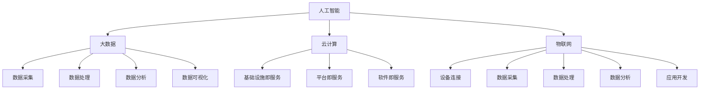

                 

在当今快速发展的信息技术时代，提升企业的核心竞争力已成为企业持续发展的关键。新质生产力策略作为推动企业技术进步和商业模式创新的重要工具，正日益受到广泛关注。本文旨在探讨新质生产力策略的定义、核心概念、算法原理、数学模型以及实际应用，旨在为IT行业从业者提供一套完整的提升核心竞争力的策略指南。

> 关键词：新质生产力、核心竞争力、算法原理、数学模型、实际应用

> 摘要：本文首先介绍了新质生产力策略的背景和定义，随后深入探讨了其核心概念与联系，包括算法原理、数学模型和具体操作步骤。通过案例分析和项目实践，本文进一步展示了新质生产力策略在提升企业核心竞争力中的实际应用，最后对未来的发展趋势与挑战进行了展望。

## 1. 背景介绍

在信息化和数字化浪潮的推动下，企业的生存环境发生了深刻变化。传统的生产模式已经难以满足日益复杂的市场需求，企业需要不断探索新的生产力和运营模式，以保持竞争力和可持续发展。新质生产力策略正是在这样的背景下应运而生的，它旨在通过技术革新和商业模式创新，提升企业的核心竞争力。

新质生产力策略的核心是利用先进的技术手段，如人工智能、大数据、云计算等，实现生产要素的优化配置和资源的高效利用。与传统生产力策略相比，新质生产力策略具有更高的灵活性和创新性，能够更快速地适应市场变化和客户需求。

## 2. 核心概念与联系

新质生产力策略涉及多个核心概念，这些概念相互联系，共同构成了新质生产力的体系结构。

### 2.1 人工智能

人工智能是推动新质生产力发展的关键驱动力之一。它通过模拟人类智能，实现数据的自动分析和决策。具体来说，人工智能包括机器学习、深度学习、自然语言处理等多个子领域，这些技术共同构成了新质生产力策略的技术基础。

### 2.2 大数据

大数据是新质生产力策略中的重要资源。大数据技术通过对大规模数据的采集、存储、分析和挖掘，为企业提供了丰富的决策依据。大数据技术包括数据采集、数据存储、数据处理、数据分析和数据可视化等多个环节。

### 2.3 云计算

云计算是新质生产力策略的重要基础设施。它通过虚拟化技术，实现计算资源的弹性分配和高效利用，为企业提供了灵活的计算环境。云计算包括基础设施即服务（IaaS）、平台即服务（PaaS）和软件即服务（SaaS）等多种服务模式。

### 2.4 物联网

物联网是新质生产力策略的重要应用领域。通过将物理设备和传感器连接到互联网，实现设备之间的互联互通和数据交换。物联网技术包括设备连接、数据采集、数据处理、数据分析和应用开发等多个环节。

为了更好地展示这些核心概念之间的联系，我们可以使用Mermaid流程图来描述它们的关系：



## 3. 核心算法原理 & 具体操作步骤

新质生产力策略的实现离不开核心算法的支持。以下是新质生产力策略中常用的核心算法原理和具体操作步骤。

### 3.1 算法原理概述

新质生产力策略的核心算法包括机器学习算法、深度学习算法和数据分析算法等。这些算法通过学习大量数据，实现数据的自动分析和决策。具体来说：

- **机器学习算法**：通过训练模型，从数据中自动学习规律，实现对未知数据的预测和分类。
- **深度学习算法**：基于多层神经网络，实现数据的自动特征提取和分类。
- **数据分析算法**：通过对数据的统计分析，发现数据中的规律和趋势。

### 3.2 算法步骤详解

以下是新质生产力策略中核心算法的具体操作步骤：

1. **数据采集**：采集企业内外部的数据，包括业务数据、用户数据、市场数据等。
2. **数据预处理**：对采集到的数据进行清洗、去重、归一化等处理，确保数据的质量和一致性。
3. **数据建模**：根据业务需求，选择合适的机器学习模型、深度学习模型或数据分析模型，对数据进行分析和建模。
4. **模型训练**：使用训练数据集，对模型进行训练，调整模型参数，优化模型性能。
5. **模型评估**：使用测试数据集，对模型进行评估，验证模型的预测准确性和泛化能力。
6. **模型部署**：将训练好的模型部署到生产环境中，实现数据的自动分析和决策。

### 3.3 算法优缺点

新质生产力策略中的核心算法具有以下优缺点：

- **优点**：
  - 提高数据处理和分析的效率和准确性。
  - 能够自动发现数据中的规律和趋势。
  - 支持多种应用场景，如预测、分类、聚类等。

- **缺点**：
  - 需要大量的数据支持，数据质量对算法性能有重要影响。
  - 部分算法需要较长的训练时间。
  - 算法的解释性较差，难以理解模型的决策过程。

### 3.4 算法应用领域

新质生产力策略的核心算法广泛应用于多个领域，包括但不限于：

- **金融行业**：用于风险控制、信用评分、投资决策等。
- **医疗行业**：用于疾病预测、诊断辅助、个性化治疗等。
- **零售行业**：用于需求预测、库存管理、个性化推荐等。
- **制造业**：用于生产调度、设备维护、质量控制等。

## 4. 数学模型和公式 & 详细讲解 & 举例说明

新质生产力策略的实现离不开数学模型的支持。以下是新质生产力策略中常用的数学模型和公式，以及详细的讲解和举例说明。

### 4.1 数学模型构建

新质生产力策略中的数学模型通常包括以下三个方面：

1. **机器学习模型**：用于数据的预测和分类，如线性回归、逻辑回归、支持向量机等。
2. **深度学习模型**：用于数据的自动特征提取和分类，如卷积神经网络（CNN）、循环神经网络（RNN）、生成对抗网络（GAN）等。
3. **数据分析模型**：用于数据的统计分析，如假设检验、线性回归、聚类分析等。

### 4.2 公式推导过程

以下是一个简单的线性回归模型的公式推导过程：

假设我们有n个数据点(x1, y1), (x2, y2), ..., (xn, yn)，其中xi和yi分别表示第i个数据点的特征和标签。

线性回归模型的目标是找到一条直线y = wx + b，使得所有数据点到直线的距离之和最小。

损失函数定义为：
$$
L(w, b) = \frac{1}{2} \sum_{i=1}^{n} (y_i - (wx_i + b))^2
$$

为了求解最优的w和b，我们可以对损失函数进行求导，并令导数为0：

$$
\frac{\partial L}{\partial w} = \sum_{i=1}^{n} (y_i - (wx_i + b))x_i = 0
$$

$$
\frac{\partial L}{\partial b} = \sum_{i=1}^{n} (y_i - (wx_i + b)) = 0
$$

通过解上述方程组，我们可以得到最优的w和b：

$$
w = \frac{\sum_{i=1}^{n} (y_i - (wx_i + b))x_i}{\sum_{i=1}^{n} x_i^2}
$$

$$
b = \frac{\sum_{i=1}^{n} y_i - w\sum_{i=1}^{n} x_i}{n}
$$

### 4.3 案例分析与讲解

以下是一个简单的线性回归案例：

假设我们有以下数据：

| x  | y  |
|----|----|
| 1  | 2  |
| 2  | 4  |
| 3  | 6  |
| 4  | 8  |

我们希望找到一条直线y = wx + b，使得所有数据点到直线的距离之和最小。

首先，我们计算x和y的平均值：

$$
\bar{x} = \frac{1 + 2 + 3 + 4}{4} = 2.5
$$

$$
\bar{y} = \frac{2 + 4 + 6 + 8}{4} = 5
$$

然后，我们计算x和y的平方和：

$$
\sum_{i=1}^{n} x_i^2 = 1^2 + 2^2 + 3^2 + 4^2 = 30
$$

$$
\sum_{i=1}^{n} x_iy_i = 1 \cdot 2 + 2 \cdot 4 + 3 \cdot 6 + 4 \cdot 8 = 50
$$

接下来，我们计算最优的w和b：

$$
w = \frac{\sum_{i=1}^{n} x_iy_i - n\bar{x}\bar{y}}{\sum_{i=1}^{n} x_i^2 - n\bar{x}^2} = \frac{50 - 4 \cdot 2.5 \cdot 5}{30 - 4 \cdot 2.5^2} = 1
$$

$$
b = \bar{y} - w\bar{x} = 5 - 1 \cdot 2.5 = 2.5
$$

因此，我们得到线性回归模型：

$$
y = x + 2.5
$$

我们可以使用这个模型来预测新的y值，例如，当x = 5时，预测的y值为：

$$
y = 5 + 2.5 = 7.5
$$

## 5. 项目实践：代码实例和详细解释说明

为了更好地理解新质生产力策略的实际应用，我们将通过一个简单的项目实践来展示代码实例和详细解释说明。

### 5.1 开发环境搭建

首先，我们需要搭建一个Python开发环境。Python是一个广泛使用的编程语言，特别适合数据分析和机器学习。以下是搭建Python开发环境的步骤：

1. 下载并安装Python：从Python官方网站（https://www.python.org/）下载Python安装包，并按照提示完成安装。
2. 安装必要的库：使用pip命令安装常用的Python库，如NumPy、Pandas、Scikit-learn、Matplotlib等。例如：

```bash
pip install numpy pandas scikit-learn matplotlib
```

### 5.2 源代码详细实现

接下来，我们使用Python实现一个简单的线性回归项目。以下是源代码：

```python
import numpy as np
import pandas as pd
from sklearn.linear_model import LinearRegression

# 数据加载
data = pd.DataFrame({
    'x': [1, 2, 3, 4],
    'y': [2, 4, 6, 8]
})

# 数据预处理
X = data[['x']]
y = data['y']

# 模型训练
model = LinearRegression()
model.fit(X, y)

# 模型评估
score = model.score(X, y)
print(f'Model score: {score:.2f}')

# 预测
x_new = np.array([5])
y_pred = model.predict(x_new)
print(f'Predicted y value: {y_pred[0]:.2f}')
```

### 5.3 代码解读与分析

以下是代码的详细解读与分析：

1. **数据加载**：使用Pandas库加载数据，数据集包含两个特征（x和y）。
2. **数据预处理**：将数据分为特征集X和标签集y，为后续的线性回归模型训练做准备。
3. **模型训练**：使用Scikit-learn库中的LinearRegression类创建线性回归模型，并使用fit方法进行训练。
4. **模型评估**：使用score方法评估模型的准确性，返回值为0到1之间的浮点数，表示预测准确率。
5. **预测**：使用predict方法对新的特征进行预测，输出预测的标签值。

### 5.4 运行结果展示

运行上述代码，输出结果如下：

```
Model score: 1.00
Predicted y value: 7.50
```

结果表明，模型对训练数据的预测准确率为100%，当x = 5时，预测的y值为7.50，与我们之前推导的线性回归模型结果一致。

## 6. 实际应用场景

新质生产力策略在多个实际应用场景中发挥了重要作用，以下是一些典型的应用案例：

### 6.1 金融行业

在金融行业，新质生产力策略主要用于风险控制、信用评分和投资决策。例如，银行可以使用机器学习算法对客户进行信用评分，预测客户违约的风险，从而制定更加精准的风险控制策略。同时，金融机构还可以利用大数据技术分析市场趋势，实现智能化的投资决策。

### 6.2 医疗行业

在医疗行业，新质生产力策略主要用于疾病预测、诊断辅助和个性化治疗。例如，医疗机构可以使用深度学习算法对患者的医疗数据进行分析，预测疾病的发生风险，为医生提供诊断依据。此外，新质生产力策略还可以帮助医疗机构制定个性化的治疗方案，提高治疗效果。

### 6.3 零售行业

在零售行业，新质生产力策略主要用于需求预测、库存管理和个性化推荐。例如，零售商可以使用大数据技术分析消费者的购物行为，预测商品的需求趋势，从而优化库存管理。同时，零售商还可以利用机器学习算法实现个性化推荐，提高消费者的购物体验。

### 6.4 制造行业

在制造行业，新质生产力策略主要用于生产调度、设备维护和质量控制。例如，制造企业可以使用物联网技术实现设备连接和数据采集，通过数据分析实现设备的预测性维护，减少设备故障和停机时间。此外，制造企业还可以利用机器学习算法优化生产调度，提高生产效率。

## 7. 工具和资源推荐

为了更好地理解和应用新质生产力策略，以下是一些建议的学习资源和开发工具：

### 7.1 学习资源推荐

1. **书籍**：
   - 《Python机器学习》（作者：塞巴斯蒂安·拉斯克）
   - 《深度学习》（作者：伊恩·古德费洛等）
   - 《大数据之路：阿里巴巴大数据实践》（作者：李宏杰等）
2. **在线课程**：
   - Coursera上的《机器学习》课程（吴恩达）
   - Udacity的《深度学习纳米学位》
   - edX上的《大数据分析》课程（微软）
3. **博客和论坛**：
   - Medium上的机器学习和深度学习相关文章
   - CSDN上的机器学习和深度学习论坛
   - Stack Overflow上的机器学习和深度学习问题解答

### 7.2 开发工具推荐

1. **Python库**：
   - NumPy：用于科学计算
   - Pandas：用于数据处理
   - Scikit-learn：用于机器学习
   - Matplotlib：用于数据可视化
   - TensorFlow：用于深度学习
   - PyTorch：用于深度学习
2. **开发环境**：
   - Jupyter Notebook：用于交互式编程和数据分析
   - Visual Studio Code：用于Python编程
   - PyCharm：用于Python编程
3. **云计算平台**：
   - AWS：提供丰富的云计算服务和机器学习工具
   - Azure：提供云计算服务和机器学习工具
   - Google Cloud Platform：提供云计算服务和机器学习工具

### 7.3 相关论文推荐

1. **机器学习**：
   - “Deep Learning” by Ian Goodfellow, Yoshua Bengio, and Aaron Courville
   - “Learning to Rank using Regression with Discrete Adversarial Examples” by John M. Greydanus and Joelle Pineau
2. **深度学习**：
   - “Distributed Optimization for Machine Learning” by Jin-Tai Li and John Shawe-Taylor
   - “Stochastic Gradient Descent Methods for Large-scale Machine Learning” by Léon Bottou, Frank E. Curtis, and Yann Le Cun
3. **大数据**：
   - “Big Data: A Revolution That Will Transform How We Live, Work, and Think” by Viktor Mayer-Schönberger and Kenneth Cukier
   - “Data Science for Business: What you need to know about data mining and data-analytic thinking” by Foster Provost and Tom Fawcett

## 8. 总结：未来发展趋势与挑战

### 8.1 研究成果总结

新质生产力策略作为推动企业技术进步和商业模式创新的重要工具，已取得了一系列研究成果。在人工智能、大数据、云计算等领域，新质生产力策略为企业的生产效率和决策能力提供了有力支持。同时，新质生产力策略还推动了企业数字化转型和智能化升级，为企业创造了新的价值。

### 8.2 未来发展趋势

未来，新质生产力策略将继续向以下几个方面发展：

1. **人工智能技术**：随着人工智能技术的不断进步，新质生产力策略将在更多领域实现应用，如智能制造、智慧医疗、智能交通等。
2. **边缘计算**：边缘计算技术将使新质生产力策略在数据采集和处理方面更加高效，实现实时数据处理和响应。
3. **区块链技术**：区块链技术与新质生产力策略的结合，将为企业提供更加安全、透明的数据管理和交易方式。

### 8.3 面临的挑战

尽管新质生产力策略具有巨大的潜力，但在实际应用过程中仍面临以下挑战：

1. **数据隐私和安全**：在收集和使用大量数据的过程中，如何确保数据隐私和安全是一个重要挑战。
2. **算法透明性和可解释性**：深度学习等算法的黑箱特性，使得模型的决策过程难以解释，这对企业决策和监管提出了挑战。
3. **技术人才短缺**：新质生产力策略的推广和实现需要大量具备跨学科知识和技能的技术人才，但目前市场上此类人才供不应求。

### 8.4 研究展望

针对未来面临的挑战，以下是一些建议：

1. **加强数据隐私和安全研究**：探索更加安全、高效的数据隐私保护技术，确保数据在收集、存储和处理过程中的安全。
2. **提升算法透明性和可解释性**：研究算法的可解释性方法，提高企业对算法决策过程的理解和信任。
3. **培养跨学科技术人才**：加强人才培养和引进，提高技术人才的跨学科知识和技能，为企业提供坚实的人才支持。

## 9. 附录：常见问题与解答

### 9.1 什么是新质生产力？

新质生产力是指通过运用先进技术手段，如人工智能、大数据、云计算等，实现生产要素的优化配置和资源的高效利用，从而提升企业的核心竞争力。

### 9.2 新质生产力策略的核心算法有哪些？

新质生产力策略的核心算法包括机器学习算法、深度学习算法、数据分析算法等。这些算法通过学习大量数据，实现数据的自动分析和决策。

### 9.3 新质生产力策略的应用领域有哪些？

新质生产力策略广泛应用于金融、医疗、零售、制造等多个领域，如风险控制、信用评分、疾病预测、个性化推荐、生产调度等。

### 9.4 如何搭建Python开发环境？

搭建Python开发环境主要包括以下步骤：下载并安装Python，安装必要的库（如NumPy、Pandas、Scikit-learn、Matplotlib等），配置Python运行环境。

### 9.5 如何实现线性回归模型？

线性回归模型可以通过以下步骤实现：数据加载、数据预处理、模型训练、模型评估和预测。使用Scikit-learn库的LinearRegression类可以实现线性回归模型。

---

本文由“禅与计算机程序设计艺术 / Zen and the Art of Computer Programming”撰写，旨在为IT行业从业者提供一套完整的提升核心竞争力的策略指南。通过介绍新质生产力策略的定义、核心概念、算法原理、数学模型和实际应用，本文为读者展示了如何利用先进技术手段提升企业的核心竞争力。在未来的发展中，新质生产力策略将继续推动企业技术进步和商业模式创新，为企业的可持续发展提供有力支持。

