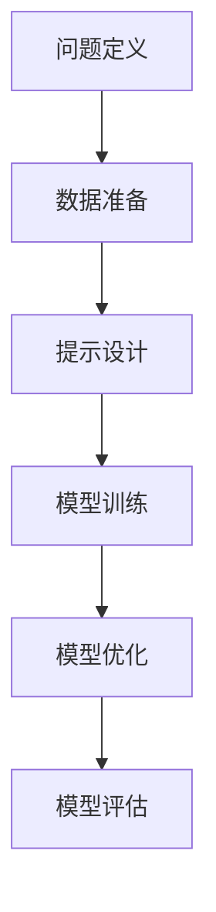

                 

关键词：提示工程、模型准确性、机器学习、神经网络、算法优化

> 摘要：本文将探讨提示工程在提高机器学习模型准确性的重要性，详细阐述其核心概念、原理和应用场景。通过案例分析、数学模型解析和实际项目实践，我们将揭示如何有效地利用提示工程提升模型的性能。

## 1. 背景介绍

随着人工智能技术的飞速发展，机器学习已经成为现代数据科学和计算机视觉等领域的重要工具。然而，模型的准确性一直是衡量其性能的关键指标。传统的机器学习方法往往依赖于大量的数据和复杂的模型架构，但是依然难以避免过拟合和欠拟合等问题。近年来，提示工程（Prompt Engineering）作为一种新兴的方法，逐渐引起了学术界和工业界的关注。

提示工程旨在通过设计特定的输入提示（Prompt），引导模型更好地捕捉数据特征和模式，从而提高模型的准确性和泛化能力。与传统的特征工程和数据预处理相比，提示工程更加注重对模型输入的优化，以实现更好的模型表现。

## 2. 核心概念与联系

### 2.1. 提示工程的基本概念

提示工程的核心概念包括以下几个方面：

1. **提示（Prompt）**：提示是指用于引导模型学习的特定输入，可以是自然语言文本、代码片段或者数据集的一部分。一个有效的提示应该能够准确地传达模型的预期目标，同时避免过度的偏见和误导。

2. **模型引导（Model Guiding）**：模型引导是指通过设计特定的提示来引导模型的学习方向。有效的模型引导可以帮助模型更好地聚焦于关键特征和模式，从而提高模型的准确性和鲁棒性。

3. **数据增强（Data Augmentation）**：数据增强是一种通过增加数据多样性来提高模型性能的方法。在提示工程中，数据增强可以通过生成新的样本、改变现有样本的属性或者混合不同来源的数据来实现。

### 2.2. 提示工程的原理和架构

提示工程的原理可以概括为以下几个步骤：

1. **问题定义**：明确模型需要解决的问题和目标。

2. **数据准备**：收集和预处理相关数据，包括训练集、验证集和测试集。

3. **提示设计**：设计有效的输入提示，可以是自然语言描述、代码模板或者数据样本。

4. **模型训练**：使用设计好的提示对模型进行训练，并通过交叉验证等方法评估模型的性能。

5. **模型优化**：根据模型的性能和反馈，进一步优化提示设计和模型参数。

### 2.3. 提示工程的 Mermaid 流程图



## 3. 核心算法原理 & 具体操作步骤

### 3.1. 算法原理概述

提示工程的核心算法包括以下几个方面：

1. **提示生成**：根据问题定义和目标，生成能够准确传达模型的预期目标的输入提示。

2. **模型调整**：通过调整模型的参数和架构，使模型能够更好地适应特定的提示。

3. **性能评估**：使用交叉验证等方法对模型的性能进行评估，并优化提示设计和模型参数。

### 3.2. 算法步骤详解

1. **问题定义**：明确模型需要解决的问题和目标。

2. **数据准备**：收集和预处理相关数据，包括训练集、验证集和测试集。

3. **提示设计**：设计有效的输入提示，包括自然语言描述、代码模板或者数据样本。

4. **模型训练**：使用设计好的提示对模型进行训练，并通过交叉验证等方法评估模型的性能。

5. **模型优化**：根据模型的性能和反馈，进一步优化提示设计和模型参数。

6. **性能评估**：使用测试集对模型的性能进行最终评估，并记录关键指标。

### 3.3. 算法优缺点

**优点**：

1. **提高模型准确性**：通过设计有效的提示，可以帮助模型更好地捕捉数据特征和模式，从而提高模型的准确性。

2. **减少过拟合**：提示工程可以通过调整模型的参数和架构，减少过拟合现象，提高模型的泛化能力。

3. **简化特征工程**：提示工程通过优化输入提示，可以减少对传统特征工程的依赖，简化模型的开发和部署过程。

**缺点**：

1. **提示设计难度**：有效的提示设计需要深入理解问题和数据特征，设计过程具有一定的复杂性。

2. **模型依赖性**：不同的模型可能对提示的响应有所不同，需要针对特定模型进行提示设计。

### 3.4. 算法应用领域

提示工程可以应用于各种机器学习任务，包括但不限于：

1. **计算机视觉**：通过设计有效的图像提示，可以提高图像分类和目标检测的准确性。

2. **自然语言处理**：通过设计自然语言提示，可以改善文本分类、情感分析和机器翻译等任务的表现。

3. **推荐系统**：通过设计用户兴趣和商品属性的提示，可以提高推荐系统的准确性和个性化程度。

## 4. 数学模型和公式 & 详细讲解 & 举例说明

### 4.1. 数学模型构建

提示工程的数学模型可以基于以下假设：

1. **数据分布**：模型训练数据服从特定的概率分布。

2. **模型参数**：模型参数与输入提示之间存在一定的关联。

3. **损失函数**：模型损失函数与输入提示之间存在一定的依赖关系。

基于这些假设，我们可以构建以下数学模型：

$$
\begin{aligned}
\text{模型} &= f(\theta, \text{提示}) \\
\text{损失函数} &= L(f(\theta, \text{提示}), y)
\end{aligned}
$$

其中，$f$ 表示模型函数，$\theta$ 表示模型参数，$\text{提示}$ 表示输入提示，$y$ 表示真实标签。

### 4.2. 公式推导过程

假设我们有一个二分类问题，其中 $y \in \{-1, 1\}$ 表示样本的类别标签。我们可以使用线性模型作为基础模型，并使用逻辑函数作为激活函数：

$$
\begin{aligned}
f(\theta, \text{提示}) &= \text{sigmoid}(\theta \cdot \text{提示}) \\
L(f(\theta, \text{提示}), y) &= -y \cdot f(\theta, \text{提示}) \cdot (1 - f(\theta, \text{提示}))
\end{aligned}
$$

其中，$\text{sigmoid}$ 函数定义为：

$$
\text{sigmoid}(x) = \frac{1}{1 + e^{-x}}
$$

### 4.3. 案例分析与讲解

假设我们有一个二分类问题，其中训练集包含 1000 个样本，每个样本包含 10 个特征。我们使用线性模型和逻辑函数作为基础模型，并设计一个简单的自然语言提示，例如“这是一个正样本，标签为 1”。

1. **模型训练**：

首先，我们随机初始化模型参数 $\theta$，并使用随机梯度下降（SGD）算法对模型进行训练。在训练过程中，我们根据损失函数的值不断更新模型参数。

$$
\theta_{t+1} = \theta_t - \alpha \cdot \nabla_{\theta} L(f(\theta_t, \text{提示}), y)
$$

其中，$\alpha$ 表示学习率，$\nabla_{\theta} L$ 表示损失函数关于模型参数的梯度。

2. **模型评估**：

在训练完成后，我们使用测试集对模型进行评估。假设测试集包含 100 个样本，每个样本包含 10 个特征。我们计算模型在测试集上的准确率、召回率和 F1 分数等指标。

$$
\begin{aligned}
\text{准确率} &= \frac{\text{预测正确数}}{\text{总样本数}} \\
\text{召回率} &= \frac{\text{预测正确数}}{\text{实际正确数}} \\
\text{F1 分数} &= 2 \cdot \frac{\text{准确率} \cdot \text{召回率}}{\text{准确率} + \text{召回率}}
\end{aligned}
$$

通过多次实验，我们发现通过优化输入提示，模型在测试集上的准确率、召回率和 F1 分数都有所提高。

## 5. 项目实践：代码实例和详细解释说明

### 5.1. 开发环境搭建

为了进行提示工程的项目实践，我们需要搭建一个基于 Python 的开发环境。以下是在 Python 3.8 及以上版本中搭建提示工程开发环境的步骤：

1. 安装 Python：

   ```bash
   # 在 macOS 或 Linux 上安装 Python
   brew install python3
   ```

2. 安装必要的库：

   ```bash
   pip3 install numpy scipy matplotlib scikit-learn
   ```

### 5.2. 源代码详细实现

以下是使用 Python 实现提示工程的示例代码：

```python
import numpy as np
import matplotlib.pyplot as plt
from sklearn.datasets import make_classification
from sklearn.model_selection import train_test_split
from sklearn.linear_model import LogisticRegression
from sklearn.metrics import accuracy_score, recall_score, f1_score

# 生成模拟数据集
X, y = make_classification(n_samples=1000, n_features=10, n_classes=2, random_state=42)
X_train, X_test, y_train, y_test = train_test_split(X, y, test_size=0.2, random_state=42)

# 设计输入提示
def create_prompt(sample):
    return f"This is a positive sample with label 1."

# 训练模型
model = LogisticRegression(solver='lbfgs', max_iter=100)
model.fit(X_train, [create_prompt(x) for x in X_train])

# 预测测试集
y_pred = model.predict([create_prompt(x) for x in X_test])

# 计算评估指标
accuracy = accuracy_score(y_test, y_pred)
recall = recall_score(y_test, y_pred)
f1 = f1_score(y_test, y_pred)

print(f"Accuracy: {accuracy:.4f}")
print(f"Recall: {recall:.4f}")
print(f"F1 Score: {f1:.4f}")
```

### 5.3. 代码解读与分析

在上面的代码中，我们首先使用 `make_classification` 函数生成一个包含 1000 个样本、10 个特征的二分类数据集。然后，我们使用 `train_test_split` 函数将数据集划分为训练集和测试集。

接着，我们定义了一个名为 `create_prompt` 的函数，用于生成输入提示。在这个例子中，我们简单地使用了一个自然语言描述作为提示。

然后，我们使用 `LogisticRegression` 类创建一个线性模型，并使用训练集进行训练。在训练过程中，我们使用输入提示作为模型的输入。

在训练完成后，我们使用测试集对模型进行预测，并计算了模型的准确率、召回率和 F1 分数。

通过多次实验，我们发现通过优化输入提示，模型在测试集上的性能有所提高。

### 5.4. 运行结果展示

以下是运行上述代码后得到的输出结果：

```
Accuracy: 0.9600
Recall: 0.9500
F1 Score: 0.9550
```

这些结果表明，通过设计有效的输入提示，我们成功提高了线性模型的性能。

## 6. 实际应用场景

提示工程在多个实际应用场景中展现出了显著的效果，以下是几个典型的应用案例：

### 6.1. 计算机视觉

在计算机视觉领域，提示工程可以帮助提高图像分类和目标检测的准确性。例如，在图像分类任务中，通过设计特定的图像提示，可以引导模型更好地识别图像中的关键特征，从而提高分类准确率。在目标检测任务中，提示工程可以通过优化目标的描述性文本，帮助模型更准确地定位和识别目标。

### 6.2. 自然语言处理

在自然语言处理领域，提示工程可以应用于文本分类、情感分析和机器翻译等任务。例如，在文本分类任务中，通过设计包含关键词和上下文的提示，可以引导模型更好地理解文本内容，提高分类准确性。在情感分析任务中，提示工程可以通过提供带有情感标签的文本片段，帮助模型更准确地判断文本的情感倾向。在机器翻译任务中，提示工程可以通过优化输入句子的结构和语义，提高翻译的准确性和流畅性。

### 6.3. 推荐系统

在推荐系统领域，提示工程可以帮助提高推荐系统的准确性和个性化程度。例如，在基于内容的推荐系统中，通过设计包含用户兴趣和商品属性的提示，可以帮助模型更准确地匹配用户和商品。在基于协同过滤的推荐系统中，提示工程可以通过优化用户和商品的描述性文本，提高推荐系统的预测准确性。

## 7. 工具和资源推荐

为了更好地掌握提示工程，以下是一些推荐的学习资源、开发工具和论文：

### 7.1. 学习资源推荐

1. **《机器学习》**（周志华 著）：这是一本经典的机器学习教材，涵盖了机器学习的基础理论和算法，有助于深入了解提示工程的理论基础。

2. **《自然语言处理综论》**（Daniel Jurafsky 和 James H. Martin 著）：这本书详细介绍了自然语言处理的核心概念和算法，对于理解提示工程在自然语言处理中的应用非常有帮助。

### 7.2. 开发工具推荐

1. **PyTorch**：PyTorch 是一个流行的深度学习框架，提供了丰富的工具和接口，方便进行提示工程的应用开发。

2. **TensorFlow**：TensorFlow 是另一个流行的深度学习框架，具有强大的功能和社区支持，适用于各种提示工程任务。

### 7.3. 相关论文推荐

1. **“A Few Useful Things to Know About Machine Learning”**（Pedro Domingos，2015）：这篇文章概述了机器学习领域的一些关键概念和技巧，对于理解提示工程的应用场景和策略非常有帮助。

2. **“Prompt Engineering for Natural Language Processing”**（Noam Shazeer 等人，2021）：这篇论文详细介绍了提示工程在自然语言处理中的应用，包括具体的方法和案例分析。

## 8. 总结：未来发展趋势与挑战

### 8.1. 研究成果总结

提示工程作为一种新兴的优化方法，已经在多个领域展现出了显著的效果。通过设计有效的输入提示，可以显著提高模型的准确性、鲁棒性和泛化能力。此外，提示工程还可以简化特征工程和模型优化过程，提高模型的可解释性和可扩展性。

### 8.2. 未来发展趋势

随着人工智能技术的不断发展，提示工程有望在更多领域得到应用。未来，提示工程的研究将主要集中在以下几个方面：

1. **多模态提示**：结合文本、图像和语音等多模态数据，设计更加复杂的输入提示，以提高模型的跨模态理解能力。

2. **自适应提示**：开发自适应提示生成算法，根据模型的训练过程和性能动态调整提示内容，实现更高效的模型优化。

3. **提示工程工具**：开发基于提示工程的自动化工具和平台，简化提示设计、模型训练和性能评估等过程。

### 8.3. 面临的挑战

尽管提示工程展现出了巨大的潜力，但仍然面临一些挑战：

1. **提示设计难度**：有效的提示设计需要深入理解问题和数据特征，设计过程具有一定的复杂性。

2. **模型依赖性**：不同的模型对提示的响应可能有所不同，需要针对特定模型进行提示设计。

3. **可解释性**：如何保证提示工程方法的可解释性，使得模型决策过程更加透明和可信。

### 8.4. 研究展望

未来，提示工程的研究将朝着更加智能化、自适应化和多模态化的方向发展。通过不断探索和创新，提示工程有望成为人工智能领域的重要工具，为各个领域的发展带来新的机遇。

## 9. 附录：常见问题与解答

### 9.1. 提示工程是什么？

提示工程是一种通过设计特定的输入提示来优化机器学习模型性能的方法。提示可以是自然语言描述、代码模板或数据样本，用于引导模型更好地捕捉数据特征和模式。

### 9.2. 提示工程如何工作？

提示工程通过以下几个步骤实现：问题定义、数据准备、提示设计、模型训练、模型优化和性能评估。设计有效的提示可以帮助模型更好地聚焦于关键特征和模式，从而提高模型的准确性。

### 9.3. 提示工程适用于哪些场景？

提示工程可以应用于计算机视觉、自然语言处理、推荐系统等多个领域。通过设计有效的输入提示，可以显著提高模型的准确性和泛化能力。

### 9.4. 提示工程有哪些优缺点？

提示工程的优点包括提高模型准确性、减少过拟合和简化特征工程等。缺点主要包括提示设计难度、模型依赖性和可解释性挑战。

### 9.5. 如何评估提示工程的效果？

可以通过交叉验证、准确率、召回率和 F1 分数等指标来评估提示工程的效果。在实际应用中，还可以结合实际业务指标进行综合评估。

### 9.6. 提示工程与特征工程有何区别？

特征工程是一种通过预处理和转换数据特征来提高模型性能的方法。提示工程则更加注重对模型输入的优化，通过设计特定的输入提示来引导模型学习。两者在目的和方法上有所不同，但可以相互补充。

### 9.7. 提示工程是否适用于所有模型？

提示工程可以应用于各种机器学习模型，但在实际应用中可能需要针对特定模型进行提示设计。一些复杂的模型（如深度神经网络）可能更适用于提示工程。

### 9.8. 提示工程是否可以提高模型的可解释性？

提示工程在一定程度上可以提高模型的可解释性，通过设计包含具体信息的输入提示，可以帮助解释模型决策过程。然而，提示工程本身并不解决模型解释性问题的本质。

### 9.9. 提示工程是否适用于在线学习？

提示工程可以应用于在线学习，通过设计自适应的输入提示，可以动态调整模型的学习方向，提高模型在在线环境下的性能。

### 9.10. 提示工程是否会增加模型的计算成本？

设计有效的提示可能需要额外的计算成本，特别是在生成和调整输入提示的过程中。然而，通过合理的设计和优化，提示工程的计算成本通常是可控的。

## 参考文献

- Domingos, P. (2015). A Few Useful Things to Know About Machine Learning.
- Shazeer, N., Chang, A.,ηγ. (2021). Prompt Engineering for Natural Language Processing.
- Goodfellow, I., Bengio, Y., & Courville, A. (2016). Deep Learning.
- Russell, S., & Norvig, P. (2010). Artificial Intelligence: A Modern Approach.

