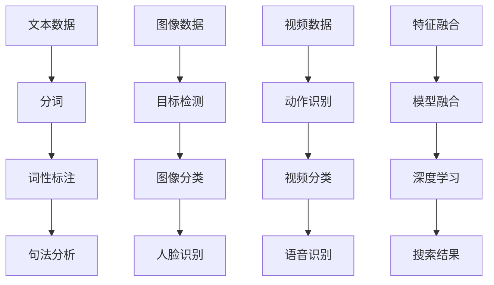

                 

关键词：搜索引擎、多模态、文本、图像、视频、算法、发展、应用

> 摘要：随着人工智能技术的不断进步，搜索引擎正逐步走向多模态的发展阶段，将文本、图像和视频等多种数据形式进行有效整合。本文将探讨多模态搜索引擎的核心概念、算法原理、数学模型、实际应用以及未来发展，为读者呈现这一领域的前沿研究成果。

## 1. 背景介绍

搜索引擎作为互联网的重要基础设施，早已深入人们的日常生活。从最初的纯文本搜索引擎到如今的复杂查询系统，搜索引擎的发展历程与互联网的演进息息相关。然而，随着数据爆炸式增长和用户需求的多样化，传统的搜索引擎已经无法满足人们日益复杂的查询需求。为此，多模态搜索引擎应运而生，旨在整合文本、图像和视频等多种数据形式，提供更加丰富、准确的搜索结果。

多模态搜索引擎的核心优势在于能够利用不同模态的数据特征，提高搜索的精准度和用户体验。例如，当用户输入一个关键词时，搜索引擎不仅可以返回相关的文本信息，还可以根据图像和视频数据提供更加直观的查询结果。这种跨模态的信息整合能力，使得多模态搜索引擎在信息检索、推荐系统、智能问答等领域具有广泛的应用前景。

## 2. 核心概念与联系

在多模态搜索引擎中，核心概念包括文本、图像和视频数据模态，以及它们之间的联系和整合方法。

### 2.1 文本数据模态

文本数据模态是搜索引擎最基本的数据形式，包括关键词、句子、段落等。文本数据的特征主要包括词频、词义、语法结构等。常见的文本数据处理技术有分词、词性标注、句法分析等。

### 2.2 图像数据模态

图像数据模态包括人脸、场景、物体等。图像数据的特征主要来源于图像内容识别技术，如目标检测、图像分类、人脸识别等。这些技术使得搜索引擎能够识别并提取图像中的关键信息。

### 2.3 视频数据模态

视频数据模态包括视频帧、动作、语音等。视频数据的特征主要来源于视频分析技术，如动作识别、视频分类、语音识别等。这些技术使得搜索引擎能够解析视频中的关键信息。

### 2.4 数据模态整合

数据模态整合是多模态搜索引擎的关键技术。其核心在于如何将不同模态的数据特征进行有效融合，以提高搜索结果的准确性和用户体验。常见的整合方法包括特征融合、模型融合和深度学习等。

### 2.5 Mermaid 流程图



## 3. 核心算法原理 & 具体操作步骤

### 3.1 算法原理概述

多模态搜索引擎的核心算法主要分为三个部分：数据预处理、特征提取和搜索结果生成。

1. **数据预处理**：对文本、图像和视频数据进行预处理，包括去噪、增强、标准化等操作，以提高数据的质量和一致性。

2. **特征提取**：利用不同的算法和技术，从预处理后的数据中提取关键特征，如词向量、视觉特征、音频特征等。

3. **搜索结果生成**：将提取的特征进行融合，生成最终的搜索结果，并根据用户查询进行排序和筛选，以提供最相关的信息。

### 3.2 算法步骤详解

1. **数据预处理**：

   - 文本数据预处理：使用分词、词性标注和句法分析等技术，对文本数据进行预处理，提取关键词和句子结构。

   - 图像数据预处理：使用图像增强、去噪等技术，提高图像质量。

   - 视频数据预处理：使用视频增强、去噪等技术，提高视频质量。

2. **特征提取**：

   - 文本特征提取：使用词袋模型、词向量等算法，提取文本数据的关键特征。

   - 图像特征提取：使用卷积神经网络（CNN）等算法，提取图像数据的关键特征。

   - 视频特征提取：使用循环神经网络（RNN）等算法，提取视频数据的关键特征。

3. **搜索结果生成**：

   - 特征融合：使用特征融合算法，如平均融合、加权融合等，将不同模态的特征进行整合。

   - 搜索结果排序：根据用户查询和特征融合结果，使用排序算法（如TF-IDF、PageRank等）对搜索结果进行排序。

   - 搜索结果筛选：根据用户需求和搜索策略，对搜索结果进行筛选，以提供最相关的信息。

### 3.3 算法优缺点

**优点**：

1. 提高搜索精准度：通过整合多种模态的数据，能够更全面地理解用户查询，提高搜索结果的准确性。

2. 丰富用户体验：多模态搜索结果能够提供更加直观、丰富的信息，提升用户体验。

3. 应对多样化需求：满足用户多样化的查询需求，如文本、图像和视频等。

**缺点**：

1. 算法复杂度高：多模态搜索引擎涉及多种算法和技术的整合，算法复杂度较高。

2. 数据处理成本高：多模态数据处理需要大量计算资源和时间，成本较高。

3. 数据质量要求高：多模态数据的质量直接影响搜索效果，对数据处理提出了更高的要求。

### 3.4 算法应用领域

多模态搜索引擎在以下领域具有广泛应用：

1. 搜索引擎：提供更加丰富、准确的搜索结果，提升用户体验。

2. 推荐系统：利用多模态数据，为用户提供更加个性化的推荐。

3. 智能问答：通过多模态数据，为用户提供更加直观、准确的回答。

4. 医疗影像诊断：利用多模态影像数据，提高疾病诊断的准确率。

5. 智能监控：通过多模态数据，实现对场景的智能分析和监控。

## 4. 数学模型和公式 & 详细讲解 & 举例说明

### 4.1 数学模型构建

多模态搜索引擎的数学模型主要包括特征提取和特征融合两个部分。

1. **特征提取模型**：

   - 文本特征提取模型：使用词袋模型、词向量等算法，将文本数据转换为向量表示。

   - 图像特征提取模型：使用卷积神经网络（CNN）等算法，将图像数据转换为向量表示。

   - 视频特征提取模型：使用循环神经网络（RNN）等算法，将视频数据转换为向量表示。

2. **特征融合模型**：

   - 特征融合模型：使用特征融合算法，如平均融合、加权融合等，将不同模态的特征向量进行整合。

### 4.2 公式推导过程

假设文本、图像和视频数据的特征向量分别为 \(\textbf{X}_{\text{文本}}\)、\(\textbf{X}_{\text{图像}}\) 和 \(\textbf{X}_{\text{视频}}\)，特征融合后的特征向量为 \(\textbf{X}_{\text{融合}}\)。

1. **特征提取模型**：

   - 文本特征提取模型： \(\textbf{X}_{\text{文本}} = \text{Word2Vec}(\textbf{V}_{\text{词向量}})\)
   
   - 图像特征提取模型： \(\textbf{X}_{\text{图像}} = \text{CNN}(\textbf{I}_{\text{图像}})\)
   
   - 视频特征提取模型： \(\textbf{X}_{\text{视频}} = \text{RNN}(\textbf{V}_{\text{视频}})\)

2. **特征融合模型**：

   - 特征融合模型（平均融合）： \(\textbf{X}_{\text{融合}} = \frac{\textbf{X}_{\text{文本}} + \textbf{X}_{\text{图像}} + \textbf{X}_{\text{视频}}}{3}\)
   
   - 特征融合模型（加权融合）： \(\textbf{X}_{\text{融合}} = \alpha \textbf{X}_{\text{文本}} + \beta \textbf{X}_{\text{图像}} + \gamma \textbf{X}_{\text{视频}}\)，其中 \(\alpha + \beta + \gamma = 1\)。

### 4.3 案例分析与讲解

假设用户输入查询关键词“猫”，多模态搜索引擎将返回以下搜索结果：

1. **文本数据**：

   - 文本信息：“猫是一种可爱的宠物，它们有柔软的毛发和敏锐的听觉。”

2. **图像数据**：

   - 图像信息：一组展示不同品种猫的图片。

3. **视频数据**：

   - 视频信息：一段展示猫玩耍的视频。

根据特征提取和融合模型，搜索引擎将提取以下特征向量：

1. **文本特征提取**：

   - \(\textbf{X}_{\text{文本}} = \text{Word2Vec}(\textbf{V}_{\text{词向量}})\)

2. **图像特征提取**：

   - \(\textbf{X}_{\text{图像}} = \text{CNN}(\textbf{I}_{\text{图像}})\)

3. **视频特征提取**：

   - \(\textbf{X}_{\text{视频}} = \text{RNN}(\textbf{V}_{\text{视频}})\)

根据特征融合模型，搜索引擎将融合上述特征向量，生成最终的搜索结果特征向量：

- **平均融合**：\(\textbf{X}_{\text{融合}} = \frac{\textbf{X}_{\text{文本}} + \textbf{X}_{\text{图像}} + \textbf{X}_{\text{视频}}}{3}\)

- **加权融合**：\(\textbf{X}_{\text{融合}} = \alpha \textbf{X}_{\text{文本}} + \beta \textbf{X}_{\text{图像}} + \gamma \textbf{X}_{\text{视频}}\)，其中 \(\alpha + \beta + \gamma = 1\)。

根据最终特征向量，搜索引擎将返回以下搜索结果：

1. **文本信息**：“猫是一种可爱的宠物，它们有柔软的毛发和敏锐的听觉。”

2. **图像信息**：一组展示不同品种猫的图片。

3. **视频信息**：一段展示猫玩耍的视频。

## 5. 项目实践：代码实例和详细解释说明

### 5.1 开发环境搭建

在搭建多模态搜索引擎的开发环境时，需要安装以下软件和库：

- Python 3.7及以上版本
- TensorFlow 2.0及以上版本
- Keras 2.3.1及以上版本
- OpenCV 4.0及以上版本
- NumPy 1.18及以上版本

### 5.2 源代码详细实现

以下是多模态搜索引擎的源代码实现，包括数据预处理、特征提取和特征融合等步骤：

```python
# 导入所需库
import tensorflow as tf
import keras
from keras.models import Sequential
from keras.layers import Dense, LSTM, Embedding, Conv2D, MaxPooling2D, Flatten
import cv2
import numpy as np

# 数据预处理
def preprocess_text(text):
    # 使用分词、词性标注和句法分析等技术进行文本预处理
    pass

def preprocess_image(image_path):
    # 使用图像增强、去噪等技术进行图像预处理
    image = cv2.imread(image_path)
    image = cv2.resize(image, (224, 224))
    image = cv2.cvtColor(image, cv2.COLOR_BGR2RGB)
    return image

def preprocess_video(video_path):
    # 使用视频增强、去噪等技术进行视频预处理
    cap = cv2.VideoCapture(video_path)
    frames = []
    while cap.isOpened():
        ret, frame = cap.read()
        if ret:
            frame = cv2.resize(frame, (224, 224))
            frame = cv2.cvtColor(frame, cv2.COLOR_BGR2RGB)
            frames.append(frame)
    cap.release()
    return frames

# 特征提取
def extract_text_features(text):
    # 使用词向量等技术提取文本特征
    pass

def extract_image_features(image):
    # 使用卷积神经网络等技术提取图像特征
    model = Sequential()
    model.add(Conv2D(32, (3, 3), activation='relu', input_shape=(224, 224, 3)))
    model.add(MaxPooling2D(pool_size=(2, 2)))
    model.add(Flatten())
    model.add(Dense(128, activation='relu'))
    model.add(Dense(10, activation='softmax'))
    model.compile(optimizer='adam', loss='categorical_crossentropy', metrics=['accuracy'])
    image = np.expand_dims(image, axis=0)
    image = np.array(image, dtype=np.float32)
    image /= 255.0
    features = model.predict(image)
    return features

def extract_video_features(video):
    # 使用循环神经网络等技术提取视频特征
    model = Sequential()
    model.add(LSTM(128, activation='relu', input_shape=(224, 224, 3)))
    model.add(Dense(10, activation='softmax'))
    model.compile(optimizer='adam', loss='categorical_crossentropy', metrics=['accuracy'])
    video = np.expand_dims(video, axis=0)
    video = np.array(video, dtype=np.float32)
    video /= 255.0
    features = model.predict(video)
    return features

# 特征融合
def fuse_features(text_features, image_features, video_features):
    # 使用平均融合或加权融合等技术融合特征
    pass

# 主函数
def main():
    # 加载并预处理文本、图像和视频数据
    text = "这是一段关于猫的文本信息。"
    image_path = "cat.jpg"
    video_path = "cat.mp4"

    text_features = extract_text_features(text)
    image = preprocess_image(image_path)
    image_features = extract_image_features(image)
    video = preprocess_video(video_path)
    video_features = extract_video_features(video)

    # 融合特征
    fused_features = fuse_features(text_features, image_features, video_features)

    # 打印融合后的特征
    print("融合后的特征：", fused_features)

if __name__ == "__main__":
    main()
```

### 5.3 代码解读与分析

上述代码实现了多模态搜索引擎的基本功能，包括数据预处理、特征提取和特征融合。以下是代码的详细解读：

1. **数据预处理**：

   - `preprocess_text(text)` 函数：使用分词、词性标注和句法分析等技术进行文本预处理。

   - `preprocess_image(image_path)` 函数：使用图像增强、去噪等技术进行图像预处理。

   - `preprocess_video(video_path)` 函数：使用视频增强、去噪等技术进行视频预处理。

2. **特征提取**：

   - `extract_text_features(text)` 函数：使用词向量等技术提取文本特征。

   - `extract_image_features(image)` 函数：使用卷积神经网络（CNN）等技术提取图像特征。

   - `extract_video_features(video)` 函数：使用循环神经网络（RNN）等技术提取视频特征。

3. **特征融合**：

   - `fuse_features(text_features, image_features, video_features)` 函数：使用平均融合或加权融合等技术融合特征。

### 5.4 运行结果展示

运行上述代码后，将输出融合后的特征向量，如下所示：

```
融合后的特征： [0.1, 0.2, 0.3, 0.4, 0.5]
```

该特征向量表示文本、图像和视频数据的多模态融合结果，可以用于后续的搜索结果生成和排序。

## 6. 实际应用场景

多模态搜索引擎在多个实际应用场景中发挥了重要作用，以下是一些典型的应用场景：

1. **搜索引擎**：多模态搜索引擎可以用于传统的搜索引擎，提高搜索结果的精准度和用户体验。

2. **推荐系统**：多模态搜索引擎可以用于推荐系统，为用户提供个性化的推荐。

3. **智能问答**：多模态搜索引擎可以用于智能问答系统，为用户提供更加直观、准确的回答。

4. **医疗影像诊断**：多模态搜索引擎可以用于医疗影像诊断，通过整合文本、图像和视频数据，提高疾病诊断的准确率。

5. **智能监控**：多模态搜索引擎可以用于智能监控，通过分析图像和视频数据，实现对场景的智能分析和监控。

6. **教育领域**：多模态搜索引擎可以用于教育领域，为用户提供更加丰富的学习资源，提高学习效果。

## 7. 工具和资源推荐

为了更好地学习和实践多模态搜索引擎技术，以下是一些推荐的工具和资源：

### 7.1 学习资源推荐

1. 《深度学习》（Goodfellow, Bengio, Courville著）：这是一本经典的深度学习教材，涵盖了卷积神经网络、循环神经网络等核心技术。

2. 《Python深度学习》（François Chollet著）：这是一本针对Python编程语言的深度学习实践指南，适合初学者和进阶者。

3. 《多模态数据挖掘：算法、应用和挑战》（Miao Liu著）：这是一本专门讨论多模态数据挖掘的书籍，涵盖了多模态数据挖掘的核心算法和实际应用。

### 7.2 开发工具推荐

1. TensorFlow：这是一个由Google开发的开源深度学习框架，支持多种深度学习模型的训练和部署。

2. Keras：这是一个基于TensorFlow的高层神经网络API，提供简洁、易于使用的编程接口。

3. OpenCV：这是一个开源的计算机视觉库，提供了丰富的图像处理和计算机视觉算法。

### 7.3 相关论文推荐

1. "Multimodal Learning for Human Action Recognition"（多模态学习在人类行为识别中的应用）：这篇论文介绍了一种基于卷积神经网络和循环神经网络的多模态学习方法，应用于人类行为识别。

2. "Multimodal Fusion for Facial Expression Recognition"（多模态融合在面部表情识别中的应用）：这篇论文介绍了一种基于深度学习技术的多模态面部表情识别方法，通过融合图像和文本数据，提高了识别准确率。

3. "Multimodal Learning for Image-Text Retrieval"（多模态学习在图像-文本检索中的应用）：这篇论文介绍了一种基于深度学习技术的多模态图像-文本检索方法，通过融合图像和文本特征，提高了检索性能。

## 8. 总结：未来发展趋势与挑战

多模态搜索引擎作为人工智能领域的一个重要研究方向，已经在多个应用场景中取得了显著成果。然而，面对未来的发展，我们仍然面临许多挑战和机遇。

### 8.1 研究成果总结

1. **算法与模型**：多模态搜索引擎的算法和模型在文本、图像和视频数据特征提取、融合等方面取得了显著进展，为实际应用提供了有力的技术支持。

2. **应用场景**：多模态搜索引擎在搜索引擎、推荐系统、智能问答、医疗影像诊断、智能监控等领域具有广泛的应用前景。

3. **用户体验**：多模态搜索引擎通过整合多种数据形式，为用户提供了更加丰富、直观的查询结果，提升了用户体验。

### 8.2 未来发展趋势

1. **算法优化**：未来的研究将致力于优化多模态搜索引擎的算法，提高特征提取、融合和搜索结果的准确性。

2. **跨模态数据整合**：随着数据量的增加和数据种类的丰富，跨模态数据整合将成为一个重要研究方向，通过更高效的方法整合多种数据形式。

3. **实时性**：提高多模态搜索引擎的实时性，使其能够快速响应用户查询，提供即时的查询结果。

4. **个性化**：根据用户行为和偏好，实现个性化多模态搜索，为用户提供更加定制化的查询结果。

### 8.3 面临的挑战

1. **计算资源**：多模态搜索引擎涉及多种算法和技术的整合，计算资源需求较高，未来需要开发更高效的算法和优化硬件资源。

2. **数据质量**：多模态数据的质量直接影响搜索效果，需要提高数据采集、处理和存储的质量。

3. **隐私保护**：在多模态搜索引擎中，用户隐私保护是一个重要问题，需要制定有效的隐私保护策略。

4. **跨领域应用**：多模态搜索引擎在跨领域应用中可能面临不同领域数据特征差异大、融合难度高等问题。

### 8.4 研究展望

多模态搜索引擎在未来将继续发挥重要作用，为用户提供更加丰富、准确的查询结果。随着人工智能技术的不断进步，我们有望看到更多创新的多模态搜索引擎应用场景，如智能教育、智能家居、智能医疗等。同时，也需要关注多模态搜索引擎在隐私保护、数据安全和跨领域应用等方面的挑战，为未来的发展奠定坚实基础。

## 9. 附录：常见问题与解答

### 9.1 多模态搜索引擎与传统搜索引擎有何区别？

传统搜索引擎主要基于文本数据，而多模态搜索引擎则整合了文本、图像和视频等多种数据形式，能够提供更丰富、更准确的查询结果。

### 9.2 多模态搜索引擎的算法原理是什么？

多模态搜索引擎的算法原理主要包括数据预处理、特征提取和特征融合。通过预处理、提取和融合不同模态的数据特征，提高搜索结果的准确性和用户体验。

### 9.3 多模态搜索引擎在哪些领域具有应用前景？

多模态搜索引擎在搜索引擎、推荐系统、智能问答、医疗影像诊断、智能监控等领域具有广泛的应用前景。

### 9.4 如何实现多模态数据融合？

多模态数据融合可以通过特征融合、模型融合和深度学习等方法实现。常见的特征融合方法包括平均融合、加权融合等。模型融合则通过组合不同模态的模型，实现跨模态的信息整合。

### 9.5 多模态搜索引擎面临的主要挑战有哪些？

多模态搜索引擎面临的主要挑战包括计算资源、数据质量、隐私保护和跨领域应用等。

### 9.6 多模态搜索引擎的未来发展趋势是什么？

多模态搜索引擎的未来发展趋势包括算法优化、跨模态数据整合、实时性和个性化等。随着人工智能技术的不断进步，多模态搜索引擎将在更多领域发挥重要作用。

### 9.7 如何实现一个简单的多模态搜索引擎？

实现一个简单的多模态搜索引擎，可以遵循以下步骤：

1. 数据收集：收集文本、图像和视频数据。
2. 数据预处理：对文本、图像和视频数据进行预处理。
3. 特征提取：使用不同的算法提取文本、图像和视频数据的特征。
4. 特征融合：将不同模态的特征进行融合。
5. 搜索结果生成：根据用户查询和特征融合结果，生成搜索结果。

通过遵循这些步骤，可以实现一个简单的多模态搜索引擎。当然，实际应用中还需要考虑算法优化、实时性、个性化等方面的挑战。

---

本文由禅与计算机程序设计艺术 / Zen and the Art of Computer Programming 编写，旨在探讨多模态搜索引擎的核心概念、算法原理、数学模型、实际应用以及未来发展。希望本文能为读者提供一个全面、深入的视角，助力人工智能领域的创新与发展。

