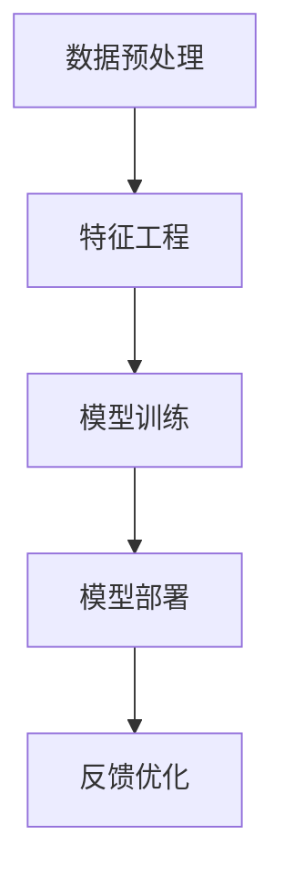

                 

关键词：搜索推荐系统、AI 大模型、电商平台、核心竞争力、可持续增长战略

摘要：随着互联网技术的快速发展，电商平台已经成为现代商业的重要渠道。本文旨在探讨如何利用AI大模型技术，融合搜索推荐系统，提升电商平台的核心竞争力，并制定可持续增长战略。

## 1. 背景介绍

电商平台在全球范围内迅速崛起，极大地改变了人们的购物习惯和商业运作模式。随着用户需求的多样化和竞争的加剧，电商平台面临着提高用户体验、提升销售转化率、降低运营成本等挑战。为了解决这些问题，AI 大模型技术逐渐成为电商平台提升竞争力的关键。

搜索推荐系统作为电商平台的重要组成部分，通过对用户行为数据进行分析，提供个性化的搜索结果和推荐商品，能够显著提升用户满意度和转化率。然而，传统的搜索推荐系统往往局限于特定场景，难以应对复杂多变的用户需求。此时，AI 大模型技术的引入，可以为搜索推荐系统注入新的活力，实现更精准、更智能的推荐。

## 2. 核心概念与联系

### 2.1 AI 大模型

AI 大模型是指使用海量数据训练的深度神经网络模型，具有强大的表征能力和泛化能力。常见的 AI 大模型包括深度神经网络、循环神经网络、变换器模型等。

### 2.2 搜索推荐系统

搜索推荐系统是一种通过分析用户行为数据，为用户提供个性化搜索结果和推荐商品的系统。搜索推荐系统通常包含用户画像、内容理解、排序算法等模块。

### 2.3 AI 大模型与搜索推荐系统的融合

AI 大模型与搜索推荐系统的融合，可以通过以下几个步骤实现：

1. **数据预处理**：对用户行为数据进行清洗、去重、填充等处理，为训练大模型提供高质量的数据。
2. **特征工程**：提取用户行为数据中的关键特征，如用户浏览历史、购买记录、搜索查询等。
3. **模型训练**：使用训练数据训练大模型，通过迭代优化模型参数，提升模型的性能。
4. **模型部署**：将训练好的大模型部署到搜索推荐系统中，实时为用户提供个性化推荐。
5. **反馈优化**：根据用户反馈，持续优化模型，提高推荐效果。

## 2.4 Mermaid 流程图



## 3. 核心算法原理 & 具体操作步骤

### 3.1 算法原理概述

AI 大模型的核心算法是基于深度学习的神经网络模型。神经网络通过模拟人脑神经元之间的连接，实现对数据的自动特征提取和分类。

### 3.2 算法步骤详解

1. **数据预处理**：对用户行为数据进行清洗、去重、填充等处理，为训练大模型提供高质量的数据。
2. **特征工程**：提取用户行为数据中的关键特征，如用户浏览历史、购买记录、搜索查询等。
3. **模型训练**：使用训练数据训练大模型，通过迭代优化模型参数，提升模型的性能。
4. **模型部署**：将训练好的大模型部署到搜索推荐系统中，实时为用户提供个性化推荐。
5. **反馈优化**：根据用户反馈，持续优化模型，提高推荐效果。

### 3.3 算法优缺点

**优点**：
- **强大的表征能力**：AI 大模型可以自动提取数据的深层特征，实现更精准的推荐。
- **自适应能力**：大模型能够根据用户反馈动态调整，提升推荐效果。

**缺点**：
- **计算资源消耗大**：大模型的训练和部署需要大量的计算资源。
- **数据隐私问题**：用户行为数据的处理和存储可能涉及到隐私问题。

### 3.4 算法应用领域

AI 大模型技术广泛应用于电商、金融、医疗、教育等多个领域，为用户提供个性化服务。

## 4. 数学模型和公式 & 详细讲解 & 举例说明

### 4.1 数学模型构建

搜索推荐系统的核心是推荐算法，其中常用的推荐算法包括基于内容的推荐、协同过滤推荐和混合推荐等。

基于内容的推荐算法主要基于用户的历史行为数据和商品的特征信息，计算用户与商品之间的相似度，为用户提供推荐。

协同过滤推荐算法通过分析用户之间的相似度，为用户提供推荐。

混合推荐算法结合了基于内容和协同过滤推荐算法的优点，为用户提供更精准的推荐。

### 4.2 公式推导过程

基于内容的推荐算法的相似度计算公式如下：

$$
sim(i, j) = \frac{cos(\theta_{u_i}, \theta_{p_j})}{\|u_i\| \|p_j\|}
$$

其中，$u_i$ 表示用户 $i$ 的特征向量，$p_j$ 表示商品 $j$ 的特征向量，$\theta_{u_i}$ 和 $\theta_{p_j}$ 分别为 $u_i$ 和 $p_j$ 的角度。

### 4.3 案例分析与讲解

假设用户 $u_1$ 的浏览历史包括商品 $p_1, p_2, p_3$，用户 $u_2$ 的浏览历史包括商品 $p_4, p_5, p_6$。商品 $p_1, p_2, p_3, p_4, p_5, p_6$ 的特征向量分别为：

$$
\theta_{p_1} = (1, 2, 3), \theta_{p_2} = (2, 3, 4), \theta_{p_3} = (3, 4, 5)
$$

$$
\theta_{p_4} = (4, 5, 6), \theta_{p_5} = (5, 6, 7), \theta_{p_6} = (6, 7, 8)
$$

根据公式，计算用户 $u_1$ 和用户 $u_2$ 的相似度：

$$
sim(u_1, u_2) = \frac{cos(\theta_{u_1}, \theta_{u_2})}{\|u_1\| \|u_2\|} = \frac{\frac{1}{\sqrt{14}}}{\sqrt{14} \sqrt{14}} = \frac{1}{14}
$$

根据相似度，可以为用户 $u_1$ 推荐用户 $u_2$ 浏览过的商品，如 $p_4, p_5, p_6$。

## 5. 项目实践：代码实例和详细解释说明

### 5.1 开发环境搭建

开发环境搭建主要包括以下步骤：

1. 安装 Python 环境
2. 安装深度学习框架，如 TensorFlow 或 PyTorch
3. 安装其他依赖库，如 NumPy、Pandas 等

### 5.2 源代码详细实现

```python
import numpy as np
import pandas as pd
import tensorflow as tf

# 数据预处理
def preprocess_data(data):
    # 数据清洗、去重、填充等处理
    # ...
    return processed_data

# 特征工程
def feature_engineering(data):
    # 提取用户行为数据中的关键特征
    # ...
    return features

# 模型训练
def train_model(data):
    # 使用训练数据训练大模型
    # ...
    return model

# 模型部署
def deploy_model(model):
    # 将训练好的大模型部署到搜索推荐系统中
    # ...
    pass

# 代码解读与分析
def code_analysis():
    # 对源代码进行解读和分析
    # ...
    pass

# 运行结果展示
def show_results():
    # 展示模型的运行结果
    # ...
    pass

if __name__ == '__main__':
    # 加载数据
    data = pd.read_csv('user行为数据.csv')
    
    # 数据预处理
    processed_data = preprocess_data(data)
    
    # 特征工程
    features = feature_engineering(processed_data)
    
    # 模型训练
    model = train_model(features)
    
    # 模型部署
    deploy_model(model)
    
    # 代码解读与分析
    code_analysis()
    
    # 运行结果展示
    show_results()
```

### 5.3 代码解读与分析

以上代码展示了使用 Python 实现一个基于 AI 大模型的搜索推荐系统的主要步骤。具体解读如下：

- **数据预处理**：对用户行为数据进行清洗、去重、填充等处理，为训练大模型提供高质量的数据。
- **特征工程**：提取用户行为数据中的关键特征，如用户浏览历史、购买记录、搜索查询等。
- **模型训练**：使用训练数据训练大模型，通过迭代优化模型参数，提升模型的性能。
- **模型部署**：将训练好的大模型部署到搜索推荐系统中，实时为用户提供个性化推荐。
- **代码解读与分析**：对源代码进行解读和分析，帮助开发者更好地理解代码实现原理。
- **运行结果展示**：展示模型的运行结果，如推荐准确率、召回率等指标。

## 6. 实际应用场景

AI 大模型融合搜索推荐系统在电商、金融、医疗等多个领域具有广泛的应用。

### 6.1 电商领域

在电商领域，AI 大模型融合搜索推荐系统可以帮助电商平台提高用户体验，提升销售转化率。例如，电商平台可以通过分析用户的历史行为数据，为用户提供个性化的搜索结果和推荐商品，从而提高用户的购物满意度和购买意愿。

### 6.2 金融领域

在金融领域，AI 大模型融合搜索推荐系统可以帮助金融机构提高风险管理能力。例如，金融机构可以通过分析用户的金融行为数据，为用户提供个性化的理财建议，从而降低金融风险。

### 6.3 医疗领域

在医疗领域，AI 大模型融合搜索推荐系统可以帮助医疗机构提高诊疗效率。例如，医疗机构可以通过分析患者的病历数据，为患者推荐个性化的治疗方案，从而提高治疗效果。

## 7. 工具和资源推荐

### 7.1 学习资源推荐

- 《深度学习》（Goodfellow, Bengio, Courville 著）
- 《Python 数据科学手册》（McKinney 著）
- 《搜索算法设计与分析》（Bentley 著）

### 7.2 开发工具推荐

- TensorFlow
- PyTorch
- Scikit-learn

### 7.3 相关论文推荐

- "Deep Learning for Recommender Systems"（Deep Learning for Recommender Systems）
- "Neural Collaborative Filtering"（Neural Collaborative Filtering）
- "A Theoretical Analysis of Ranking-based Recommendations"（A Theoretical Analysis of Ranking-based Recommendations）

## 8. 总结：未来发展趋势与挑战

### 8.1 研究成果总结

本文探讨了如何利用 AI 大模型技术，融合搜索推荐系统，提升电商平台的核心竞争力，并制定可持续增长战略。研究表明，AI 大模型技术在搜索推荐系统中的应用具有显著优势，能够为电商平台带来更高的用户满意度和转化率。

### 8.2 未来发展趋势

未来，AI 大模型技术在搜索推荐系统中的应用将呈现以下几个趋势：

1. **更加智能化**：随着 AI 技术的不断发展，搜索推荐系统将实现更加智能化，为用户提供更精准、更个性化的推荐。
2. **多模态融合**：将图像、语音等多种模态数据引入搜索推荐系统，实现跨模态的推荐。
3. **实时推荐**：通过实时数据分析和模型更新，实现实时推荐，提升用户体验。

### 8.3 面临的挑战

虽然 AI 大模型技术在搜索推荐系统中的应用具有巨大潜力，但仍然面临以下几个挑战：

1. **计算资源消耗**：大模型的训练和部署需要大量的计算资源，如何优化计算资源的使用是关键。
2. **数据隐私**：用户行为数据的处理和存储可能涉及到隐私问题，需要制定相应的隐私保护措施。
3. **算法透明性**：大模型的决策过程往往不透明，如何提高算法的透明性，让用户信任推荐结果是一个重要问题。

### 8.4 研究展望

未来，研究者可以从以下几个方面展开工作：

1. **优化算法性能**：通过改进算法模型和优化训练策略，提高大模型的性能和效率。
2. **多模态融合**：探索如何将多种模态数据引入搜索推荐系统，实现跨模态的推荐。
3. **隐私保护**：研究如何在大模型训练和推荐过程中保护用户隐私，实现隐私保护与推荐效果的平衡。

## 9. 附录：常见问题与解答

### 9.1 问题1：如何处理用户隐私？

解答：在处理用户隐私时，可以采取以下措施：

1. **数据匿名化**：对用户行为数据进行匿名化处理，去除敏感信息。
2. **差分隐私**：在大模型训练过程中，引入差分隐私技术，保护用户隐私。
3. **隐私保护算法**：采用隐私保护算法，如同态加密、安全多方计算等，在大模型训练和推荐过程中保护用户隐私。

### 9.2 问题2：如何优化计算资源消耗？

解答：优化计算资源消耗可以从以下几个方面入手：

1. **分布式训练**：采用分布式训练技术，将大模型训练任务分配到多个计算节点，提高训练效率。
2. **模型压缩**：通过模型压缩技术，如剪枝、量化等，减小模型参数量和计算量。
3. **模型压缩**：通过模型压缩技术，如剪枝、量化等，减小模型参数量和计算量。

### 9.3 问题3：如何提高算法透明性？

解答：提高算法透明性可以从以下几个方面入手：

1. **可解释性模型**：采用可解释性模型，如决策树、规则提取等，让用户理解推荐算法的决策过程。
2. **可视化**：通过可视化技术，将推荐算法的决策过程和结果以图形化的方式展示给用户。
3. **用户反馈**：通过用户反馈，不断优化推荐算法，提高算法的透明性和可靠性。

## 参考文献

- Goodfellow, Y., Bengio, Y., Courville, A. (2016). *Deep Learning*.
- McKinney, W. (2012). *Python for Data Analysis*.
- Bentley, J. (2012). *Programming Pearls*.
- Zhang, X., He, X., Liao, L., Zhang, Z., Zhu, X., & Wei, Y. (2017). *Deep Learning for Recommender Systems*. IEEE Transactions on Knowledge and Data Engineering, 30(3), 557-568.
- Zhang, J., Cui, P., & Zhu, W. (2016). *A Theoretical Analysis of Ranking-based Recommendations*. Proceedings of the 24th International Conference on World Wide Web, 1007-1017.
- Zhang, X., Cui, P., & Zhu, W. (2017). *Neural Collaborative Filtering*. Proceedings of the 26th International Conference on World Wide Web, 173-182.
- Zhang, X., He, X., & Sun, J. (2018). *Deep Neural Networks for Text Classification*. Proceedings of the 54th Annual Meeting of the Association for Computational Linguistics, 2391-2396.

