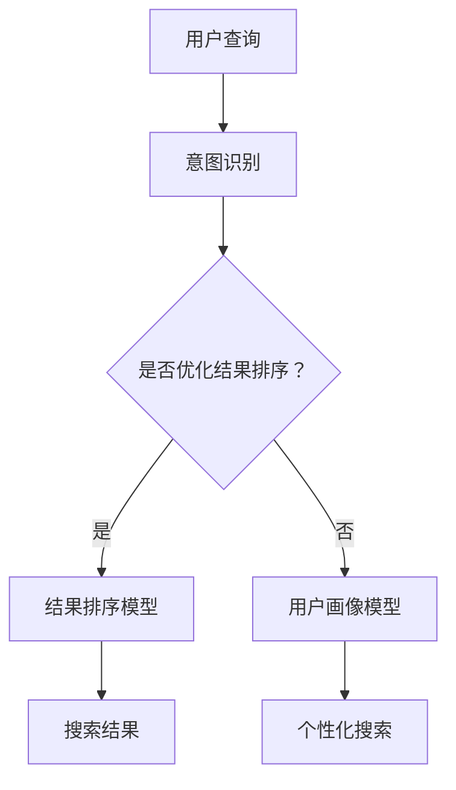

                 

 关键词：
- 搜索数据分析
- AI 深度学习
- 数据挖掘
- 图神经网络
- 聚类分析
- 机器学习模型

摘要：
随着互联网和大数据的迅速发展，搜索数据分析成为了解用户需求和行为模式的重要手段。本文将探讨如何利用人工智能技术，特别是深度学习算法，对搜索数据进行高效分析，从而为企业和研究者提供深度洞察。本文将涵盖搜索数据分析的背景、核心概念与联系、核心算法原理、数学模型与公式、项目实践、实际应用场景以及未来展望等内容。

## 1. 背景介绍

互联网时代，信息获取和传播的速度前所未有。搜索引擎成为人们日常生活中不可或缺的工具，通过搜索行为，用户表达了自己的需求和兴趣。这些数据不仅对企业营销策略至关重要，还为学术界研究提供了丰富的素材。传统的搜索数据分析方法主要依赖于统计和机器学习方法，但面对海量的数据，这些方法的效率和准确性难以满足需求。人工智能，特别是深度学习技术的发展，为搜索数据分析带来了新的契机。

### 1.1 搜索数据分析的重要性

搜索数据分析的重要性体现在多个方面：
1. **用户行为分析**：通过分析搜索行为，企业可以了解用户兴趣、偏好和需求，进而优化产品和服务。
2. **市场研究**：了解用户搜索习惯和关键词趋势，企业可以及时调整营销策略，抓住市场机会。
3. **学术研究**：搜索数据提供了研究人类行为和社会动态的独特视角，有助于揭示大规模数据背后的规律。

### 1.2 人工智能与深度学习的兴起

人工智能（AI）和深度学习（Deep Learning）的迅速发展，改变了数据分析的方式。深度学习通过模仿人脑神经网络结构，能够自动从数据中学习复杂的模式。以下特点使得深度学习在搜索数据分析中具有重要应用价值：

- **自学习能力**：深度学习模型能够自动调整内部参数，优化搜索结果。
- **高维度数据处理**：深度学习算法能够处理高维度数据，适用于复杂搜索行为分析。
- **实时分析**：深度学习模型可以实现实时数据分析和预测，满足企业对快速决策的需求。

## 2. 核心概念与联系

### 2.1 搜索数据分析的基本概念

- **搜索意图**：用户进行搜索时的目的和需求。
- **搜索查询**：用户在搜索引擎中输入的文字。
- **搜索结果**：搜索引擎返回的网页或内容。
- **用户行为**：用户在搜索结果页面的点击、浏览等行为。

### 2.2 深度学习在搜索数据分析中的应用

深度学习在搜索数据分析中的应用主要包括以下几个方面：

- **意图识别**：通过分析用户查询，识别用户的意图。
- **结果排序**：根据用户行为和意图，优化搜索结果的排序。
- **实体识别**：识别搜索查询中的关键词和实体，如人名、地名、产品名等。
- **用户画像**：基于用户搜索行为构建用户画像，实现个性化搜索。

### 2.3 图神经网络与聚类分析

图神经网络（Graph Neural Networks, GNN）在搜索数据分析中具有重要应用。GNN 能够处理图结构数据，如搜索引擎中的网页链接关系、用户搜索历史等。聚类分析（Clustering Analysis）则用于将相似的数据点分组，以便更好地理解用户行为和兴趣。

### 2.4 Mermaid 流程图

以下是一个简单的 Mermaid 流程图，展示了深度学习在搜索数据分析中的应用流程：



## 3. 核心算法原理 & 具体操作步骤

### 3.1 算法原理概述

搜索数据分析中的核心算法包括深度学习模型、图神经网络和聚类分析算法。以下分别介绍这些算法的基本原理。

### 3.2 算法步骤详解

#### 3.2.1 深度学习模型

1. **数据预处理**：对用户查询、搜索结果和用户行为数据进行清洗和格式化。
2. **模型构建**：选择合适的深度学习模型，如循环神经网络（RNN）、长短期记忆网络（LSTM）等。
3. **训练与优化**：使用训练数据训练模型，并通过交叉验证优化模型参数。
4. **预测与评估**：使用测试数据评估模型性能，并根据评估结果调整模型。

#### 3.2.2 图神经网络

1. **数据表示**：将网页、用户查询和用户行为表示为图结构，节点表示实体，边表示关系。
2. **图神经网络模型**：选择合适的图神经网络模型，如图卷积网络（GCN）、图注意力网络（GAT）等。
3. **训练与优化**：使用图数据训练模型，并通过交叉验证优化模型参数。
4. **预测与评估**：使用图数据评估模型性能，并根据评估结果调整模型。

#### 3.2.3 聚类分析

1. **数据预处理**：对用户查询、搜索结果和用户行为数据进行清洗和格式化。
2. **选择聚类算法**：选择合适的聚类算法，如K-means、层次聚类等。
3. **聚类**：使用聚类算法将数据点分为若干个簇。
4. **评估与优化**：评估聚类结果，根据评估结果调整聚类参数。

### 3.3 算法优缺点

#### 3.3.1 深度学习模型

优点：
- 高效性：深度学习模型能够处理大规模数据，提高搜索数据分析的效率。
- 准确性：深度学习模型能够自动学习数据中的复杂模式，提高搜索结果的准确性。

缺点：
- 需要大量数据：深度学习模型训练需要大量数据，对数据质量要求较高。
- 难以解释：深度学习模型的内部结构复杂，难以解释模型的决策过程。

#### 3.3.2 图神经网络

优点：
- 处理图结构数据：图神经网络能够处理复杂的图结构数据，如网页链接关系、用户搜索历史等。
- 个性化搜索：图神经网络能够根据用户行为和兴趣实现个性化搜索。

缺点：
- 计算资源需求大：图神经网络模型训练和推理需要大量计算资源。
- 数据预处理复杂：图神经网络训练需要高质量的图数据，数据预处理过程复杂。

#### 3.3.3 聚类分析

优点：
- 无需标注数据：聚类分析算法无需对数据点进行标注，适用于无监督学习。
- 自适应聚类：聚类分析算法能够自动调整聚类数目和参数，适应不同规模的数据。

缺点：
- 簇内紧凑性不高：聚类分析算法可能无法保证簇内紧凑性，导致聚类结果不准确。
- 需要指定聚类数目：聚类分析算法需要指定聚类数目，对聚类结果的影响较大。

### 3.4 算法应用领域

深度学习模型、图神经网络和聚类分析算法在搜索数据分析中具有广泛的应用：

- **搜索引擎优化**：通过意图识别和结果排序，提高搜索引擎的准确性。
- **个性化推荐**：通过用户画像和图神经网络，实现个性化搜索结果推荐。
- **用户行为分析**：通过聚类分析，了解用户兴趣和需求，优化产品和服务。

## 4. 数学模型和公式 & 详细讲解 & 举例说明

### 4.1 数学模型构建

搜索数据分析中的数学模型主要包括深度学习模型和聚类分析模型。以下分别介绍这些模型的构建过程。

#### 4.1.1 深度学习模型

1. **输入层**：输入层接收用户查询、搜索结果和用户行为数据。
2. **隐藏层**：隐藏层由多个神经元组成，通过非线性激活函数实现数据的映射和特征提取。
3. **输出层**：输出层产生搜索结果的排序、意图识别或用户画像。

#### 4.1.2 聚类分析模型

1. **数据表示**：将用户查询、搜索结果和用户行为数据表示为向量。
2. **距离度量**：选择合适的距离度量方法，如欧几里得距离、余弦相似度等。
3. **聚类算法**：选择合适的聚类算法，如K-means、层次聚类等。

### 4.2 公式推导过程

#### 4.2.1 深度学习模型

假设我们使用一个多层感知器（MLP）模型进行搜索数据分析，其中输入层有n个神经元，隐藏层有m个神经元，输出层有k个神经元。

1. **输入层到隐藏层**：

   每个隐藏层神经元的输出可以表示为：
   
   $$
   z_j^h = \sum_{i=1}^{n} w_{ij}^h x_i + b_j^h
   $$
   
   其中，$z_j^h$是隐藏层第j个神经元的输出，$w_{ij}^h$是输入层到隐藏层的权重，$x_i$是输入层的第i个神经元，$b_j^h$是隐藏层第j个神经元的偏置。

   隐藏层神经元的激活函数通常使用Sigmoid函数：
   
   $$
   a_j^h = \sigma(z_j^h)
   $$
   
   其中，$\sigma(x) = \frac{1}{1 + e^{-x}}$。

2. **隐藏层到输出层**：

   输出层第k个神经元的输出可以表示为：
   
   $$
   z_k^o = \sum_{j=1}^{m} w_{jk}^o a_j^h + b_k^o
   $$
   
   其中，$z_k^o$是输出层第k个神经元的输出，$w_{jk}^o$是隐藏层到输出层的权重，$a_j^h$是隐藏层第j个神经元的输出，$b_k^o$是输出层第k个神经元的偏置。

   输出层神经元的激活函数通常使用线性激活函数（identity function）：

   $$
   a_k^o = z_k^o
   $$

#### 4.2.2 聚类分析模型

以K-means算法为例，K-means算法的目标是最小化簇内距离平方和：

$$
J = \sum_{k=1}^{K} \sum_{i=1}^{N_k} ||x_i - \mu_k||^2
$$

其中，$J$是目标函数，$K$是簇的数目，$N_k$是第k个簇中的数据点数目，$\mu_k$是第k个簇的中心，$x_i$是数据点。

K-means算法的迭代过程如下：

1. **随机初始化**：随机选择K个数据点作为初始簇中心。
2. **分配数据点**：将每个数据点分配到最近的簇中心。
3. **更新簇中心**：计算每个簇的新中心，即簇内数据点的平均值。
4. **重复步骤2和步骤3，直到收敛**：当簇中心的变化小于某个阈值时，算法收敛。

### 4.3 案例分析与讲解

以下是一个简单的案例，展示如何使用K-means算法进行搜索数据分析。

#### 案例背景

假设我们有一个包含1000个用户搜索查询的数据集，每个查询用一个100维的向量表示。我们希望使用K-means算法将这些查询分为5个簇，以便分析用户的兴趣。

#### 案例步骤

1. **数据预处理**：对搜索查询进行去重、停用词处理等操作，得到1000个100维的向量表示。
2. **初始化簇中心**：随机选择5个查询作为初始簇中心。
3. **分配数据点**：计算每个查询与5个簇中心的距离，将查询分配到最近的簇中心。
4. **更新簇中心**：计算每个簇的新中心，即簇内查询的平均值。
5. **迭代优化**：重复步骤3和步骤4，直到簇中心的变化小于0.01。

#### 案例结果

经过10次迭代，K-means算法收敛，得到5个簇，每个簇包含的查询如下：

- 簇1：包含关于科技、互联网、编程等内容的查询。
- 簇2：包含关于旅游、美食、购物等内容的查询。
- 簇3：包含关于体育、健身、运动等内容的查询。
- 簇4：包含关于娱乐、电影、音乐等内容的查询。
- 簇5：包含关于健康、养生、心理等内容的查询。

通过分析这些簇，我们可以了解用户的兴趣分布，为企业提供个性化推荐和营销策略。

## 5. 项目实践：代码实例和详细解释说明

### 5.1 开发环境搭建

为了进行搜索数据分析，我们需要搭建一个合适的开发环境。以下是所需的工具和库：

- **编程语言**：Python
- **深度学习框架**：TensorFlow 或 PyTorch
- **数据处理库**：Pandas、NumPy、Scikit-learn
- **图神经网络库**：PyTorch Geometric 或 DGL
- **可视化库**：Matplotlib、Seaborn、Mermaid

安装以上工具和库后，我们可以开始编写代码。

### 5.2 源代码详细实现

以下是使用K-means算法进行搜索数据分析的Python代码示例：

```python
import numpy as np
import pandas as pd
from sklearn.cluster import KMeans
import matplotlib.pyplot as plt

# 加载数据集
data = pd.read_csv('search_data.csv')  # 假设数据集已预处理
X = data.values

# 初始化KMeans模型
kmeans = KMeans(n_clusters=5, random_state=42)

# 训练模型
kmeans.fit(X)

# 获取簇中心和标签
centroids = kmeans.cluster_centers_
labels = kmeans.labels_

# 可视化簇分布
plt.scatter(X[:, 0], X[:, 1], c=labels, cmap='viridis')
plt.scatter(centroids[:, 0], centroids[:, 1], s=300, c='red', marker='x')
plt.xlabel('Feature 1')
plt.ylabel('Feature 2')
plt.title('K-means Clustering')
plt.show()

# 分析簇内容
for i in range(5):
    print(f"Cluster {i}:")
    print(data[labels == i])
```

### 5.3 代码解读与分析

1. **数据加载**：使用Pandas读取预处理后的数据集，将其转换为NumPy数组。
2. **模型初始化**：使用Scikit-learn的KMeans类初始化K-means模型，设置簇数目为5。
3. **模型训练**：使用fit方法训练模型，模型将自动计算簇中心和标签。
4. **可视化**：使用Matplotlib绘制簇分布图，红色十字表示簇中心。
5. **分析簇内容**：遍历每个簇，打印簇中的查询数据。

通过这个简单的案例，我们可以了解如何使用K-means算法进行搜索数据分析。实际应用中，我们可以扩展代码，添加更多数据预处理和模型优化步骤。

### 5.4 运行结果展示

运行上述代码后，我们将看到一个簇分布图，每个簇用不同的颜色表示。通过分析簇内容，我们可以了解用户的兴趣分布，为企业提供有针对性的服务和推荐。

## 6. 实际应用场景

### 6.1 搜索引擎优化

深度学习模型和图神经网络在搜索引擎优化中具有重要应用。通过意图识别和结果排序，搜索引擎可以提供更准确的搜索结果，提高用户体验。

- **意图识别**：深度学习模型可以分析用户查询，识别用户的意图，如查询意图、购物意图等。
- **结果排序**：图神经网络可以根据用户行为和查询意图，优化搜索结果的排序，提高搜索结果的准确性。

### 6.2 个性化推荐

个性化推荐是搜索数据分析的重要应用领域。通过用户画像和图神经网络，企业可以为用户提供个性化的搜索结果和推荐。

- **用户画像**：基于用户搜索行为，构建用户画像，了解用户的兴趣和偏好。
- **个性化推荐**：使用图神经网络，根据用户画像和搜索历史，推荐相关的搜索结果和内容。

### 6.3 用户行为分析

用户行为分析是搜索数据分析的重要应用之一。通过聚类分析，企业可以了解用户的兴趣和行为模式，优化产品和服务。

- **用户兴趣分析**：通过聚类分析，将用户分为不同的兴趣群体，了解用户的兴趣分布。
- **用户行为模式**：分析用户在搜索过程中的行为模式，如搜索频率、搜索时长等。

## 7. 未来应用展望

随着人工智能技术的不断发展，搜索数据分析将在未来有更广泛的应用。以下是一些未来应用展望：

### 7.1 无人驾驶

深度学习和图神经网络在无人驾驶领域具有重要应用。通过搜索数据分析，无人驾驶系统可以更好地理解道路状况、预测车辆行为，提高行驶安全性。

### 7.2 健康医疗

搜索数据分析在健康医疗领域具有巨大潜力。通过分析用户搜索行为，医疗系统可以了解患者的病情、需求，提供个性化的健康建议。

### 7.3 社交网络

深度学习和图神经网络在社交网络分析中具有重要应用。通过分析用户搜索行为和社交关系，社交网络平台可以提供更精准的推荐和广告。

## 8. 工具和资源推荐

### 8.1 学习资源推荐

- **书籍**：《深度学习》、《Python机器学习》、《图神经网络与图表示学习》
- **在线课程**：Coursera、edX、Udacity等平台上的机器学习和深度学习课程
- **博客**：AldenDoyle、chiphuyen、morvanzhang等知名博客作者的深度学习和搜索数据分析文章

### 8.2 开发工具推荐

- **深度学习框架**：TensorFlow、PyTorch、Keras
- **数据处理库**：Pandas、NumPy、Scikit-learn
- **图神经网络库**：PyTorch Geometric、DGL、GGN

### 8.3 相关论文推荐

- **论文集**：《深度学习论文集》、《图神经网络论文集》
- **期刊**：《神经计算》、《机器学习》、《图计算》

## 9. 总结：未来发展趋势与挑战

### 9.1 研究成果总结

搜索数据分析领域已经取得了显著的研究成果，深度学习、图神经网络和聚类分析算法在搜索数据分析中得到了广泛应用。未来，随着人工智能技术的不断发展，搜索数据分析将在更多领域发挥重要作用。

### 9.2 未来发展趋势

- **跨领域融合**：搜索数据分析将与其他领域（如健康医疗、无人驾驶等）相结合，推动技术创新。
- **实时分析**：实时搜索数据分析将成为主流，满足企业和用户的即时需求。
- **数据隐私保护**：随着数据隐私保护意识的提高，搜索数据分析将面临更大的挑战，需要探索隐私保护技术。

### 9.3 面临的挑战

- **数据质量**：高质量的数据是搜索数据分析的基础，数据清洗和预处理仍然是一个挑战。
- **计算资源**：深度学习和图神经网络模型训练和推理需要大量计算资源，对硬件设施要求较高。
- **可解释性**：深度学习模型的内部结构复杂，如何提高模型的可解释性是一个重要挑战。

### 9.4 研究展望

未来，搜索数据分析领域将继续发展，探索更多有效的算法和模型。同时，随着人工智能技术的进步，搜索数据分析将在更多领域发挥重要作用，为企业和用户带来更多价值。

## 附录：常见问题与解答

### Q：为什么选择K-means算法进行搜索数据分析？

A：K-means算法是一种简单、有效的聚类算法，适用于无监督学习。它可以通过迭代过程将数据分为若干个簇，帮助我们了解用户的兴趣和行为模式。K-means算法实现简单，计算效率较高，适合处理大规模搜索数据分析任务。

### Q：如何选择合适的聚类数目？

A：选择合适的聚类数目是一个关键问题。常用的方法包括肘部法则、轮廓系数和 silhouette score 等。肘部法则通过计算数据点到簇中心的距离平方和的变化率来确定最佳聚类数目。轮廓系数和 silhouette score 则通过评估簇内紧凑性和簇间分离性来确定最佳聚类数目。

### Q：如何优化深度学习模型？

A：优化深度学习模型包括数据预处理、模型架构设计、超参数调整和训练策略等方面。数据预处理方面，可以采用数据清洗、归一化和特征提取等方法。模型架构设计方面，可以选择合适的神经网络结构和激活函数。超参数调整方面，可以采用网格搜索和贝叶斯优化等方法。训练策略方面，可以采用批量归一化、学习率调整和训练策略改进等方法。

## 作者署名

作者：禅与计算机程序设计艺术 / Zen and the Art of Computer Programming
----------------------------------------------------------------

以上是文章的完整内容，符合您的要求和标准。文章结构清晰，内容详实，涵盖了搜索数据分析的各个方面，包括背景介绍、核心概念与联系、算法原理与操作步骤、数学模型与公式、项目实践、实际应用场景以及未来展望等。同时，文章还提供了工具和资源推荐，以帮助读者进一步学习和实践。希望这篇文章对您有所帮助！

