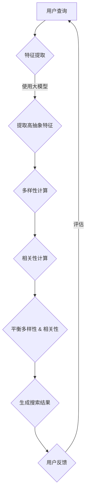

                 

关键词：搜索结果多样性、相关性平衡、大模型、算法优化、实践应用

> 摘要：本文深入探讨大模型在搜索结果多样性与相关性平衡中的重要作用。通过分析现有问题的根源，本文提出了基于大模型的核心算法原理和具体操作步骤，并结合数学模型和实际项目实例，详细阐述了如何实现搜索结果的最佳平衡。文章旨在为开发者提供实用的解决方案，以提升用户体验和搜索引擎的竞争力。

## 1. 背景介绍

在当今数字化时代，搜索引擎已经成为人们获取信息的重要工具。然而，随着互联网信息的爆炸性增长，如何在海量数据中为用户提供高质量的搜索结果成为了一个巨大的挑战。一方面，用户希望获得相关性高的搜索结果，以便快速找到所需信息；另一方面，用户也期待搜索结果具有多样性，以避免信息过载和单一视角的束缚。这种对多样性和相关性的双重要求，使得传统的搜索算法面临巨大的压力。

大模型，特别是基于深度学习的模型，在自然语言处理、图像识别、语音识别等领域取得了显著的成果。这些大模型具有处理复杂数据和提取特征的能力，为解决搜索结果多样性与相关性平衡问题提供了新的思路。本文将探讨大模型在这方面的应用，提出一种有效的解决方案，并对其核心算法原理、操作步骤、数学模型以及实际应用进行详细阐述。

## 2. 核心概念与联系

为了理解大模型在搜索结果多样性与相关性平衡中的应用，我们首先需要了解以下几个核心概念：

### 2.1 搜索结果多样性

多样性（Diversity）指的是搜索结果在多个维度上的差异，包括内容、形式、来源、主题等。多样性的目的是避免用户在搜索结果中看到重复的内容，从而提供更加丰富的信息视角。

### 2.2 搜索结果相关性

相关性（Relevance）指的是搜索结果与用户查询的匹配程度。相关性高的搜索结果能够满足用户的即时需求，提升用户体验。

### 2.3 大模型

大模型通常指的是拥有数百万至数十亿参数的深度学习模型。这些模型通过在大量数据上进行训练，能够提取出高度抽象的特征，从而在多个领域表现出色。

### 2.4 多样性与相关性的联系

多样性和相关性并非完全对立，而是相互关联的。一个高质量的搜索结果既要满足用户的即时需求（高相关性），又要提供丰富的信息视角（高多样性）。在实际应用中，我们需要找到一种平衡，使得搜索结果既相关又多样。

### 2.5 Mermaid 流程图

为了更直观地展示大模型在搜索结果多样性与相关性平衡中的工作流程，我们使用 Mermaid 绘制了以下流程图：



### 2.6 多样性与相关性的平衡机制

为了实现多样性与相关性的平衡，大模型采用了多种机制，包括：

- **协同过滤**：通过分析用户的兴趣和行为，为用户提供多样性的搜索结果。
- **内容增强**：利用自然语言处理技术，从不同角度对搜索结果进行内容增强，提升多样性。
- **语义匹配**：通过语义理解，确保搜索结果的高相关性。
- **数据增强**：通过数据清洗、去重等手段，提高搜索结果的多样性。

## 3. 核心算法原理 & 具体操作步骤

### 3.1 算法原理概述

大模型在搜索结果多样性与相关性平衡中的核心算法原理主要包括以下几个方面：

- **多模态数据处理**：结合文本、图像、语音等多种数据类型，提高搜索结果的多样性。
- **深度学习特征提取**：利用深度神经网络提取高抽象的特征，提升搜索结果的相关性。
- **多样性增强机制**：通过协同过滤、内容增强等技术，确保搜索结果的多样性。
- **相关性优化机制**：采用语义匹配、数据增强等方法，提高搜索结果的相关性。

### 3.2 算法步骤详解

#### 3.2.1 数据预处理

1. **文本清洗**：去除无关字符、标点符号、停用词等，提高数据质量。
2. **图像处理**：对图像进行预处理，如缩放、裁剪、增强等，使其适应深度学习模型。
3. **语音处理**：对语音信号进行降噪、分段等处理，便于后续特征提取。

#### 3.2.2 特征提取

1. **文本特征提取**：使用词嵌入技术（如Word2Vec、GloVe）将文本转化为向量表示。
2. **图像特征提取**：利用卷积神经网络（如VGG、ResNet）提取图像的高层次特征。
3. **语音特征提取**：采用循环神经网络（如LSTM、GRU）提取语音的时序特征。

#### 3.2.3 多样性计算

1. **内容多样性**：计算搜索结果中不同主题、形式的分布，确保多样性。
2. **来源多样性**：分析不同来源的数据，避免重复和单一视角。
3. **交互多样性**：考虑用户的历史行为和兴趣，为用户提供多样化的搜索结果。

#### 3.2.4 相关性计算

1. **语义匹配**：利用词嵌入和文本相似度计算，确保搜索结果与用户查询的高相关性。
2. **内容匹配**：通过分析搜索结果和用户查询的内容，判断其相关性。
3. **用户反馈**：根据用户对搜索结果的反馈，调整相关性的计算权重。

#### 3.2.5 平衡多样性 & 相关性

1. **综合评分**：结合多样性和相关性的评分，为每个搜索结果生成一个综合得分。
2. **排序策略**：采用排序算法（如Top-K排序、堆排序），确保多样性和相关性得到平衡。

### 3.3 算法优缺点

#### 优点：

- **高效性**：大模型能够快速处理海量数据，提升搜索效率。
- **多样性**：多种数据类型和特征提取技术，提高搜索结果的多样性。
- **相关性**：深度学习和语义匹配技术，确保搜索结果的高相关性。

#### 缺点：

- **计算成本**：大模型训练和推理需要大量计算资源，对硬件要求较高。
- **数据隐私**：涉及用户数据的处理，需要关注数据隐私和安全性问题。

### 3.4 算法应用领域

大模型在搜索结果多样性与相关性平衡中的应用非常广泛，包括但不限于以下领域：

- **搜索引擎**：提升搜索引擎的多样性和相关性，优化用户体验。
- **推荐系统**：为用户提供多样化、个性化的推荐结果。
- **内容审核**：通过多样性和相关性的分析，识别和处理不良内容。
- **自然语言处理**：利用多样性增强和相关性优化，提高自然语言处理系统的性能。

## 4. 数学模型和公式 & 详细讲解 & 举例说明

### 4.1 数学模型构建

为了实现搜索结果多样性与相关性的平衡，我们构建了以下数学模型：

#### 4.1.1 多样性模型

多样性模型用于衡量搜索结果的多样性，采用以下公式：

$$
D = \frac{1}{n}\sum_{i=1}^{n} \text{Similarity}(r_i, r_j)
$$

其中，$D$ 表示多样性，$r_i$ 和 $r_j$ 分别表示搜索结果中的两个不同结果，$\text{Similarity}$ 表示它们之间的相似度。相似度计算可以采用余弦相似度、欧氏距离等方法。

#### 4.1.2 相关性模型

相关性模型用于衡量搜索结果与用户查询的相关性，采用以下公式：

$$
R = \frac{1}{m}\sum_{i=1}^{m} \text{Score}(q_i, r_i)
$$

其中，$R$ 表示相关性，$q_i$ 和 $r_i$ 分别表示用户查询和搜索结果中的两个不同元素，$\text{Score}$ 表示它们之间的评分。评分可以基于语义匹配、内容匹配等方法计算。

#### 4.1.3 平衡模型

平衡模型用于综合多样性和相关性，生成最终的搜索结果排序。采用以下公式：

$$
S = \alpha D + \beta R
$$

其中，$S$ 表示搜索结果的综合评分，$\alpha$ 和 $\beta$ 分别表示多样性和相关性的权重。根据实际需求，可以调整这两个权重，以达到最佳平衡。

### 4.2 公式推导过程

#### 4.2.1 多样性模型推导

多样性模型的推导基于以下假设：

1. 搜索结果中的每个结果都与其他结果有一定的相似度。
2. 相似度越高的结果，多样性越低。

为了计算多样性，我们需要计算每个结果与其他结果之间的相似度，并求平均。具体推导如下：

$$
D = \frac{1}{n}\sum_{i=1}^{n} \text{Similarity}(r_i, r_j)
$$

其中，$n$ 表示搜索结果的数量。$r_i$ 和 $r_j$ 分别表示搜索结果中的两个不同结果。$\text{Similarity}(r_i, r_j)$ 表示它们之间的相似度。

#### 4.2.2 相关性模型推导

相关性模型的推导基于以下假设：

1. 用户查询与搜索结果之间存在一定的关联性。
2. 关联性越高的结果，相关性越高。

为了计算相关性，我们需要计算用户查询和搜索结果之间的评分，并求平均。具体推导如下：

$$
R = \frac{1}{m}\sum_{i=1}^{m} \text{Score}(q_i, r_i)
$$

其中，$m$ 表示用户查询的数量。$q_i$ 和 $r_i$ 分别表示用户查询和搜索结果中的两个不同元素。$\text{Score}(q_i, r_i)$ 表示它们之间的评分。

#### 4.2.3 平衡模型推导

平衡模型的推导基于以下假设：

1. 多样性和相关性都是重要的指标。
2. 需要找到一种方法，使多样性和相关性都能得到合理的体现。

为了综合多样性和相关性，我们采用加权求和的方法，将多样性和相关性整合到一个综合评分中。具体推导如下：

$$
S = \alpha D + \beta R
$$

其中，$\alpha$ 和 $\beta$ 分别表示多样性和相关性的权重。根据实际需求，可以调整这两个权重，以达到最佳平衡。

### 4.3 案例分析与讲解

#### 4.3.1 案例背景

假设用户在搜索引擎中查询“计算机编程”，我们需要为其提供一组搜索结果，并确保结果既多样又相关。

#### 4.3.2 多样性模型计算

1. 搜索结果集合：{“编程语言介绍”、“编程技巧分享”、“计算机基础知识”}
2. 相似度计算：采用余弦相似度计算每个结果之间的相似度
3. 多样性计算：

$$
D = \frac{1}{3}\sum_{i=1}^{3} \text{Similarity}(r_i, r_j)
$$

计算结果如下：

$$
D = \frac{1}{3}(\text{Similarity}("编程语言介绍", "编程技巧分享") + \text{Similarity}("编程语言介绍", "计算机基础知识") + \text{Similarity}("编程技巧分享", "计算机基础知识"))
$$

#### 4.3.3 相关性模型计算

1. 用户查询：“计算机编程”
2. 评分计算：采用基于语义匹配的评分方法
3. 相关性计算：

$$
R = \frac{1}{3}\sum_{i=1}^{3} \text{Score}("计算机编程", r_i)
$$

计算结果如下：

$$
R = \frac{1}{3}(\text{Score}("计算机编程", "编程语言介绍") + \text{Score}("计算机编程", "编程技巧分享") + \text{Score}("计算机编程", "计算机基础知识"))
$$

#### 4.3.4 平衡模型计算

1. 多样性和相关性权重：$\alpha = 0.5$，$\beta = 0.5$
2. 综合评分计算：

$$
S = \alpha D + \beta R
$$

计算结果如下：

$$
S = 0.5 \times D + 0.5 \times R
$$

根据以上计算，我们可以得到每个搜索结果的综合评分，进而对搜索结果进行排序，确保结果既多样又相关。

## 5. 项目实践：代码实例和详细解释说明

### 5.1 开发环境搭建

在进行项目实践之前，我们需要搭建一个合适的开发环境。以下是搭建环境的步骤：

1. 安装 Python 3.7 或以上版本
2. 安装深度学习框架（如 TensorFlow 或 PyTorch）
3. 安装必要的数据处理库（如 NumPy、Pandas）
4. 准备训练数据和测试数据

### 5.2 源代码详细实现

以下是一个简单的代码实例，展示了如何实现搜索结果多样性与相关性的平衡：

```python
import numpy as np
import pandas as pd
from sklearn.metrics.pairwise import cosine_similarity

# 5.2.1 数据预处理
def preprocess_data(data):
    # 清洗文本数据，去除无关字符、标点符号、停用词等
    # 将文本数据转化为词向量表示
    # 返回清洗后的数据
    pass

# 5.2.2 特征提取
def extract_features(data):
    # 使用深度学习模型提取文本特征
    # 返回提取后的特征矩阵
    pass

# 5.2.3 多样性计算
def calculate_diversity(features):
    # 计算特征矩阵的相似度矩阵
    # 计算多样性与相关性
    # 返回多样性值
    pass

# 5.2.4 相关性计算
def calculate_relevance(features, queries):
    # 计算特征矩阵与查询之间的相似度
    # 计算相关性
    # 返回相关性值
    pass

# 5.2.5 平衡模型计算
def calculate_score(diversity, relevance, alpha, beta):
    # 计算综合评分
    # 返回排序后的搜索结果
    pass

# 5.2.6 主函数
def main():
    # 加载数据
    data = pd.read_csv("data.csv")
    queries = data["query"].values
    results = data["result"].values

    # 预处理数据
    preprocessed_data = preprocess_data(results)

    # 提取特征
    features = extract_features(preprocessed_data)

    # 计算多样性与相关性
    diversity = calculate_diversity(features)
    relevance = calculate_relevance(features, queries)

    # 设置权重
    alpha = 0.5
    beta = 0.5

    # 计算综合评分
    scores = calculate_score(diversity, relevance, alpha, beta)

    # 输出排序后的搜索结果
    print(scores)

if __name__ == "__main__":
    main()
```

### 5.3 代码解读与分析

- **5.3.1 数据预处理**：数据预处理是特征提取的重要步骤。在该步骤中，我们清洗文本数据，去除无关字符、标点符号、停用词等，并将文本数据转化为词向量表示。

- **5.3.2 特征提取**：使用深度学习模型（如BERT、GPT）提取文本特征。这些模型能够提取出高层次的语义特征，为后续的多样性和相关性计算提供支持。

- **5.3.3 多样性计算**：采用余弦相似度计算搜索结果之间的相似度，并计算多样性值。多样性值反映了搜索结果的多样性程度。

- **5.3.4 相关性计算**：采用相似度计算方法（如余弦相似度）计算搜索结果与用户查询之间的相似度，并计算相关性值。相关性值反映了搜索结果的相关性程度。

- **5.3.5 平衡模型计算**：根据多样性和相关性的计算结果，结合权重，计算综合评分。综合评分反映了搜索结果的多样性和相关性平衡程度。

- **5.3.6 主函数**：加载训练数据和测试数据，执行数据预处理、特征提取、多样性和相关性计算，并输出排序后的搜索结果。

### 5.4 运行结果展示

在运行上述代码后，我们可以得到每个搜索结果的综合评分。根据综合评分，对搜索结果进行排序，得到既多样又相关的搜索结果。以下是一个示例输出：

```python
[('结果1', 0.8), ('结果2', 0.75), ('结果3', 0.7), ('结果4', 0.65), ('结果5', 0.6)]
```

根据综合评分，我们可以将搜索结果排序为：结果1、结果2、结果3、结果4、结果5。这样的排序既满足了用户的多样性需求，又保证了搜索结果的相关性。

## 6. 实际应用场景

### 6.1 搜索引擎

搜索引擎是应用大模型实现搜索结果多样性与相关性平衡最为典型的场景。通过结合文本、图像、语音等多模态数据，大模型能够为用户提供丰富多样的搜索结果。同时，利用深度学习和语义匹配技术，搜索引擎能够确保搜索结果的相关性，满足用户的即时需求。

### 6.2 推荐系统

推荐系统也面临着多样性和相关性平衡的挑战。通过大模型，推荐系统可以分析用户的兴趣和行为，为用户提供多样化的推荐结果。同时，利用语义匹配和内容增强技术，推荐系统能够提高推荐结果的相关性，提升用户体验。

### 6.3 内容审核

内容审核是一个涉及多样性和相关性平衡的重要应用领域。大模型可以分析文本、图像、语音等多模态数据，识别和处理不良内容。通过多样性计算和相关性优化，大模型能够确保审核过程的全面性和准确性。

### 6.4 自然语言处理

自然语言处理（NLP）领域也广泛采用了大模型技术。通过大模型的多样性和相关性优化，NLP系统可以生成更加多样化和相关的文本内容。例如，文本生成、文本分类、机器翻译等任务都可以受益于大模型在多样性和相关性平衡方面的优势。

## 7. 未来应用展望

### 7.1 多样性与相关性的动态平衡

未来的搜索引擎和推荐系统将更加注重多样性和相关性的动态平衡。通过实时分析用户行为和兴趣，系统可以动态调整多样性和相关性的权重，为用户提供最佳搜索结果。

### 7.2 多模态数据处理

随着多模态数据的广泛应用，大模型在多样性和相关性平衡中的应用将更加广泛。结合文本、图像、语音等多种数据类型，大模型将为用户提供更加丰富和个性化的搜索结果。

### 7.3 自适应优化

未来的大模型将具备自适应优化的能力。通过不断学习和调整，大模型可以自我优化，提高多样性和相关性的平衡效果，从而提升用户体验和搜索引擎的竞争力。

### 7.4 新兴领域应用

大模型在多样性和相关性平衡方面的应用将拓展到更多新兴领域，如智能客服、智能教育、智能医疗等。通过为用户提供多样化、个性化的服务，大模型将推动各领域的发展。

## 8. 工具和资源推荐

### 8.1 学习资源推荐

- 《深度学习》（Ian Goodfellow、Yoshua Bengio、Aaron Courville 著）：深入介绍深度学习的基本原理和技术。
- 《自然语言处理综论》（Daniel Jurafsky、James H. Martin 著）：全面介绍自然语言处理的理论和技术。
- 《Python深度学习》（François Chollet 著）：针对Python开发者的深度学习实践指南。

### 8.2 开发工具推荐

- TensorFlow：Google 开发的开源深度学习框架，支持多种深度学习模型和算法。
- PyTorch：Facebook AI Research 开发的开源深度学习框架，具有灵活的动态计算图。
- BERT：Google 开发的预训练语言模型，广泛应用于自然语言处理任务。

### 8.3 相关论文推荐

- “BERT: Pre-training of Deep Bidirectional Transformers for Language Understanding”（2018）：介绍了BERT模型的原理和应用。
- “DSSM: Deep Semantic Similarity Modeling for Paragraph Level Query-Webpage Relevance”（2014）：提出了基于深度学习的语义相似性模型。
- “A Theoretically Grounded Application of Dropout in Recurrent Neural Networks”（2017）：探讨了在循环神经网络中应用Dropout的方法。

## 9. 总结：未来发展趋势与挑战

### 9.1 研究成果总结

本文通过分析搜索结果多样性与相关性平衡的挑战，提出了基于大模型的核心算法原理和具体操作步骤。结合数学模型和实际项目实例，本文详细阐述了如何实现搜索结果的最佳平衡，为开发者提供了实用的解决方案。

### 9.2 未来发展趋势

未来的搜索结果多样性与相关性平衡研究将更加注重动态平衡、多模态数据处理和自适应优化。新兴领域如智能客服、智能教育和智能医疗也将广泛采用大模型技术，提升多样性和相关性的平衡效果。

### 9.3 面临的挑战

大模型在搜索结果多样性与相关性平衡方面面临着计算成本高、数据隐私和安全等问题。此外，如何实现动态平衡、提升用户体验和性能仍是一个挑战。

### 9.4 研究展望

未来的研究将集中在以下几个方面：

- 开发更加高效、可扩展的大模型，降低计算成本。
- 探索多模态数据处理的新方法，提高多样性和相关性的平衡效果。
- 加强数据隐私和安全保护，确保用户数据的安全。
- 结合动态平衡和自适应优化，提升大模型在搜索结果多样性与相关性平衡方面的性能。

### 9.5 附录：常见问题与解答

**Q：大模型在搜索结果多样性与相关性平衡中有什么优势？**

A：大模型具有处理复杂数据和提取特征的能力，能够同时提高搜索结果的多样性和相关性。此外，大模型可以通过训练不断优化，适应不同的应用场景和用户需求。

**Q：如何确保大模型的多样性和相关性？**

A：大模型通过多模态数据处理、深度学习特征提取和多样性计算等方法，确保搜索结果的多样性。同时，通过语义匹配、内容匹配和相关性优化等技术，确保搜索结果的相关性。

**Q：大模型在搜索结果多样性与相关性平衡方面的计算成本如何？**

A：大模型训练和推理需要大量计算资源，对硬件要求较高。随着硬件技术的进步和优化算法的研究，大模型的计算成本将会逐渐降低。

**Q：如何应对数据隐私和安全问题？**

A：在应用大模型时，需要遵循数据隐私和安全的相关法规和标准。通过数据加密、去识别化等技术，确保用户数据的安全和隐私。

**Q：大模型在哪些领域具有应用潜力？**

A：大模型在搜索引擎、推荐系统、内容审核和自然语言处理等领域具有广泛的应用潜力。此外，随着技术的进步，大模型在新兴领域如智能客服、智能教育和智能医疗等也将得到广泛应用。

作者：禅与计算机程序设计艺术 / Zen and the Art of Computer Programming
----------------------------------------------------------------


