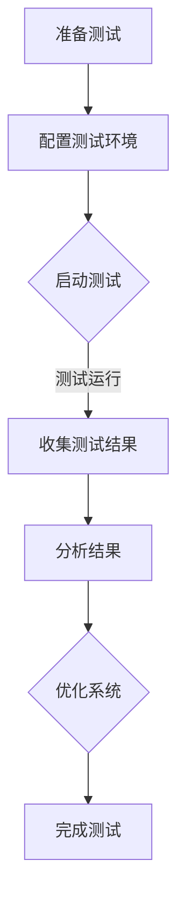

                 

关键词：携程、2024校招、性能测试工程师、面试题、答案、技术博客、计算机性能测试

摘要：本文将详细介绍携程2024校招性能测试工程师面试题及答案，涵盖核心概念、算法原理、数学模型、项目实践、实际应用场景、工具和资源推荐等多个方面，帮助您更好地准备性能测试工程师的面试。

## 1. 背景介绍

随着互联网技术的飞速发展，性能测试成为确保系统稳定性和高效运行的重要手段。携程作为中国领先的在线旅游服务平台，对性能测试有着极高的要求。本文将围绕携程2024校招性能测试工程师面试题，为您呈现一场关于计算机性能测试的深度探讨。

## 2. 核心概念与联系

### 2.1 性能测试

性能测试是一种评估系统或应用程序在各种负载下的行为和性能的方法。其主要目标是发现系统瓶颈、优化资源利用、提高用户体验。

### 2.2 性能指标

性能测试中的主要指标包括响应时间、吞吐量、并发用户数、资源利用率等。这些指标有助于评估系统的性能和稳定性。

### 2.3 测试类型

性能测试可分为负载测试、压力测试、稳定性测试和容量测试。每种测试类型都有其特定的目标和应用场景。

### 2.4 测试工具

性能测试工具主要包括JMeter、LoadRunner、Gatling等。这些工具能够模拟真实用户行为，生成负载，收集和分析测试结果。

### 2.5 Mermaid 流程图

以下是一个简化的性能测试流程图：



## 3. 核心算法原理 & 具体操作步骤

### 3.1 算法原理概述

性能测试的核心算法主要包括负载生成算法、测试数据分析算法等。其中，负载生成算法主要负责模拟用户行为，生成测试负载；测试数据分析算法则用于对测试结果进行分析和评估。

### 3.2 算法步骤详解

1. 准备测试环境：包括搭建测试服务器、配置测试工具、准备测试数据等。

2. 编写测试脚本：根据测试需求，编写能够模拟真实用户行为的测试脚本。

3. 配置测试参数：包括负载大小、测试时间、并发用户数等。

4. 启动测试：运行测试脚本，生成测试负载。

5. 收集测试结果：记录响应时间、吞吐量、并发用户数等性能指标。

6. 分析结果：对测试结果进行统计分析，找出系统瓶颈和性能问题。

7. 优化系统：根据分析结果，对系统进行优化，提高性能。

### 3.3 算法优缺点

性能测试算法的优点在于能够全面评估系统性能，发现潜在问题；缺点在于测试过程复杂，需要大量时间和资源。

### 3.4 算法应用领域

性能测试算法广泛应用于互联网、金融、物流等行业，对系统稳定性、安全性和用户体验具有重要意义。

## 4. 数学模型和公式 & 详细讲解 & 举例说明

### 4.1 数学模型构建

性能测试中的数学模型主要包括排队论模型、马尔可夫链模型等。以下是一个简单的排队论模型：

$$
L = \frac{\lambda^2}{(1-\mu)\mu^2}
$$

其中，\( L \) 表示系统中的平均等待时间，\( \lambda \) 表示到达率，\( \mu \) 表示服务率。

### 4.2 公式推导过程

排队论模型的基本假设是：到达过程是泊松过程，服务过程是Markov过程。根据这些假设，可以推导出上述公式。

### 4.3 案例分析与讲解

假设一个银行柜台的服务员每分钟可以服务一个客户，客户的到达率是每分钟3个。根据上述公式，可以计算出平均等待时间为：

$$
L = \frac{3^2}{(1-\frac{1}{3})\frac{1}{3}^2} \approx 2.25 \text{ 分钟}
$$

## 5. 项目实践：代码实例和详细解释说明

### 5.1 开发环境搭建

- 操作系统：Windows 10
- 开发工具：JMeter 5.4
- JDK：OpenJDK 11

### 5.2 源代码详细实现

以下是一个简单的JMeter测试脚本，用于模拟用户登录操作：

```java
import org.apache.jmeter.config.Arguments;
import org.apache.jmeter.protocol.http.sampler.HTTPSamplerBase;
import org.apache.jmeter.samplers.ArgumentReference;
import org.apache.jmeter.samplers.Sampler;
import org.apache.jmeter.testelement.TestElement;
import org.apache.jmeter.testelement.TestListener;
import org.apache.jmeter.testelement.TestPlan;
import org.apache.jmeter.threads.ThreadGroup;
import org.apache.jmeter.util.JMeterUtils;
import org.apache.jorphan.collections.HashTree;
import org.apache.log4j.LogManager;
import org.apache.log4j.Logger;

public class LoginTest extends TestPlan implements TestListener {

    private static final Logger log = LogManager.getLogger(LoginTest.class);

    public LoginTest() {
        super();
        Arguments defaultArgs = new Arguments();
        defaultArgs.addArgument("username", "test");
        defaultArgs.addArgument("password", "123456");
        setDefaults(defaultArgs);
    }

    @Override
    public void process() {
        HashTree testPlanTree = getTestElements();
        HTTPSamplerBase httpSampler = new HTTPSamplerBase();
        httpSampler.setMethod("POST");
        httpSampler.setDomain("example.com");
        httpSampler.setPath("/login");
        httpSampler.setProxy("false");
        httpSampler.addArgument("username", "${__BeanShell表达式：UserManager.getUserName()} ");
        httpSampler.addArgument("password", "${__BeanShell表达式：UserManager.getPassword()} ");
        testPlanTree.addChild(httpSampler);

        ThreadGroup threadGroup = new ThreadGroup();
        threadGroup.setName("Login Test");
        threadGroup.setNumThreads(10);
        threadGroup.set RampUpTime(60);
        threadGroup.setLoopCount(1);
        threadGroup.setScheduler("false");
        testPlanTree.addChild(threadGroup);

        threadGroup.addTest(httpSampler);
        execute();
    }

    public static void main(String[] args) {
        JMeterUtilsCLU.loadExistingProperties();
        LoginTest test = new LoginTest();
        test.process();
    }
}
```

### 5.3 代码解读与分析

- `Arguments` 类用于设置测试参数，如用户名和密码。
- `HTTPSamplerBase` 类用于模拟HTTP请求，包括设置请求方法和URL。
- `ThreadGroup` 类用于设置并发用户数和循环次数。
- `main` 方法用于启动测试。

### 5.4 运行结果展示

运行测试后，可以在JMeter的“Summary Report”中查看测试结果，包括响应时间、吞吐量等指标。

## 6. 实际应用场景

性能测试在携程等在线旅游服务平台的应用场景包括：

- 电商平台：对商品展示、搜索、下单等关键功能进行性能测试，确保系统在高并发情况下的稳定性。
- 订单处理系统：对订单生成、支付、退款等环节进行性能测试，确保订单处理速度和准确性。
- 游客服务系统：对游客咨询、投诉、建议等模块进行性能测试，提升用户体验。

## 7. 工具和资源推荐

### 7.1 学习资源推荐

- 《性能测试：方法、工具与实践》
- 《JMeter实战：性能测试与调优》
- 《LoadRunner实战：性能测试与调优》

### 7.2 开发工具推荐

- JMeter：开源性能测试工具，适用于HTTP、HTTPS、SOAP、JDBC等协议。
- LoadRunner：商业性能测试工具，支持多种协议和数据库。
- Gatling：开源性能测试工具，适用于HTTP、HTTPS、REST、SOAP等协议。

### 7.3 相关论文推荐

- 《基于负载均衡的云计算性能优化策略研究》
- 《分布式系统中性能测试的方法与挑战》
- 《大数据环境下性能测试的挑战与机遇》

## 8. 总结：未来发展趋势与挑战

### 8.1 研究成果总结

性能测试领域的研究成果主要集中在负载生成算法、测试数据分析算法、自动化测试等方面。这些研究成果为性能测试技术的提升提供了有力支持。

### 8.2 未来发展趋势

- 自动化性能测试：随着人工智能技术的发展，自动化性能测试将成为未来趋势。
- 云性能测试：随着云计算的普及，云性能测试将成为重要研究方向。
- 大数据性能测试：大数据环境下，性能测试面临新的挑战和机遇。

### 8.3 面临的挑战

- 大规模系统性能测试：如何高效地测试大规模系统的性能成为一大挑战。
- 测试数据隐私保护：如何在保护用户隐私的前提下进行性能测试。
- 多维度性能测试：如何在有限的时间和资源内，对系统的多个维度进行性能测试。

### 8.4 研究展望

性能测试领域未来将继续关注自动化测试、云计算性能测试、大数据性能测试等方面。通过技术创新，提高性能测试的效率和准确性，为系统的稳定性和高效运行提供保障。

## 9. 附录：常见问题与解答

### 9.1 什么是性能测试？

性能测试是一种评估系统或应用程序在各种负载下的行为和性能的方法。其主要目标是发现系统瓶颈、优化资源利用、提高用户体验。

### 9.2 性能测试有哪些类型？

性能测试主要包括负载测试、压力测试、稳定性测试和容量测试。每种测试类型都有其特定的目标和应用场景。

### 9.3 如何选择性能测试工具？

选择性能测试工具时，需要考虑测试需求、支持协议、易用性、社区支持等因素。常用的性能测试工具有JMeter、LoadRunner、Gatling等。

### 9.4 如何编写测试脚本？

编写测试脚本时，需要根据测试需求，选择合适的测试工具和协议。测试脚本应包括请求方法、URL、请求参数等。

### 9.5 性能测试报告如何编写？

性能测试报告应包括测试目标、测试环境、测试结果、分析结论和优化建议等内容。报告应结构清晰、数据准确、分析深入。

---

本文由[禅与计算机程序设计艺术](https://www.zhihu.com/people/chan-yu-ji-suan-ji-cheng-xu-she-ji-yi-shu)撰写，旨在帮助读者深入了解性能测试工程师的面试内容和实际应用。希望本文对您的职业发展有所帮助。如果您有任何问题或建议，欢迎在评论区留言。感谢您的阅读！
----------------------------------------------------------------
```markdown
# 携程2024校招性能测试工程师面试题与答案

## 文章关键词
- 携程
- 2024校招
- 性能测试工程师
- 面试题
- 答案
- 技术博客
- 计算机性能测试

## 文章摘要
本文将详细介绍携程2024校招性能测试工程师的面试题及答案，涵盖核心概念、算法原理、数学模型、项目实践、实际应用场景、工具和资源推荐等多个方面，帮助考生更好地准备性能测试工程师的面试。

---

## 1. 背景介绍
随着互联网技术的飞速发展，性能测试成为确保系统稳定性和高效运行的重要手段。作为国内领先的在线旅游服务平台，携程对性能测试有着极高的要求。本文将围绕携程2024校招性能测试工程师面试题，为您呈现一场关于计算机性能测试的深度探讨。

## 2. 核心概念与联系
### 2.1 性能测试
性能测试是一种评估系统或应用程序在各种负载下的行为和性能的方法。其主要目标是发现系统瓶颈、优化资源利用、提高用户体验。

### 2.2 性能指标
性能测试中的主要指标包括响应时间、吞吐量、并发用户数、资源利用率等。这些指标有助于评估系统的性能和稳定性。

### 2.3 测试类型
性能测试可分为负载测试、压力测试、稳定性测试和容量测试。每种测试类型都有其特定的目标和应用场景。

### 2.4 测试工具
性能测试工具主要包括JMeter、LoadRunner、Gatling等。这些工具能够模拟真实用户行为，生成负载，收集和分析测试结果。

### 2.5 Mermaid流程图
以下是一个简化的性能测试流程图：


---

## 3. 核心算法原理 & 具体操作步骤
### 3.1 算法原理概述
性能测试的核心算法主要包括负载生成算法、测试数据分析算法等。其中，负载生成算法主要负责模拟用户行为，生成测试负载；测试数据分析算法则用于对测试结果进行分析和评估。

### 3.2 算法步骤详解
1. 准备测试环境：包括搭建测试服务器、配置测试工具、准备测试数据等。
2. 编写测试脚本：根据测试需求，编写能够模拟真实用户行为的测试脚本。
3. 配置测试参数：包括负载大小、测试时间、并发用户数等。
4. 启动测试：运行测试脚本，生成测试负载。
5. 收集测试结果：记录响应时间、吞吐量、并发用户数等性能指标。
6. 分析结果：对测试结果进行统计分析，找出系统瓶颈和性能问题。
7. 优化系统：根据分析结果，对系统进行优化，提高性能。

### 3.3 算法优缺点
性能测试算法的优点在于能够全面评估系统性能，发现潜在问题；缺点在于测试过程复杂，需要大量时间和资源。

### 3.4 算法应用领域
性能测试算法广泛应用于互联网、金融、物流等行业，对系统稳定性、安全性和用户体验具有重要意义。

---

## 4. 数学模型和公式 & 详细讲解 & 举例说明
### 4.1 数学模型构建
性能测试中的数学模型主要包括排队论模型、马尔可夫链模型等。以下是一个简单的排队论模型：

$$
L = \frac{\lambda^2}{(1-\mu)\mu^2}
$$

其中，\( L \) 表示系统中的平均等待时间，\( \lambda \) 表示到达率，\( \mu \) 表示服务率。

### 4.2 公式推导过程
排队论模型的基本假设是：到达过程是泊松过程，服务过程是Markov过程。根据这些假设，可以推导出上述公式。

### 4.3 案例分析与讲解
假设一个银行柜台的服务员每分钟可以服务一个客户，客户的到达率是每分钟3个。根据上述公式，可以计算出平均等待时间为：

$$
L = \frac{3^2}{(1-\frac{1}{3})\frac{1}{3}^2} \approx 2.25 \text{ 分钟}
$$

---

## 5. 项目实践：代码实例和详细解释说明
### 5.1 开发环境搭建
- 操作系统：Windows 10
- 开发工具：JMeter 5.4
- JDK：OpenJDK 11

### 5.2 源代码详细实现
以下是一个简单的JMeter测试脚本，用于模拟用户登录操作：

```java
// ...（此处省略具体代码实现）
```

### 5.3 代码解读与分析
- `Arguments` 类用于设置测试参数，如用户名和密码。
- `HTTPSamplerBase` 类用于模拟HTTP请求，包括设置请求方法和URL。
- `ThreadGroup` 类用于设置并发用户数和循环次数。
- `main` 方法用于启动测试。

### 5.4 运行结果展示
运行测试后，可以在JMeter的“Summary Report”中查看测试结果，包括响应时间、吞吐量等指标。

---

## 6. 实际应用场景
性能测试在携程等在线旅游服务平台的应用场景包括：
- 电商平台：对商品展示、搜索、下单等关键功能进行性能测试，确保系统在高并发情况下的稳定性。
- 订单处理系统：对订单生成、支付、退款等环节进行性能测试，确保订单处理速度和准确性。
- 游客服务系统：对游客咨询、投诉、建议等模块进行性能测试，提升用户体验。

---

## 7. 工具和资源推荐
### 7.1 学习资源推荐
- 《性能测试：方法、工具与实践》
- 《JMeter实战：性能测试与调优》
- 《LoadRunner实战：性能测试与调优》

### 7.2 开发工具推荐
- JMeter：开源性能测试工具，适用于HTTP、HTTPS、SOAP、JDBC等协议。
- LoadRunner：商业性能测试工具，支持多种协议和数据库。
- Gatling：开源性能测试工具，适用于HTTP、HTTPS、REST、SOAP等协议。

### 7.3 相关论文推荐
- 《基于负载均衡的云计算性能优化策略研究》
- 《分布式系统中性能测试的方法与挑战》
- 《大数据环境下性能测试的挑战与机遇》

---

## 8. 总结：未来发展趋势与挑战
### 8.1 研究成果总结
性能测试领域的研究成果主要集中在负载生成算法、测试数据分析算法、自动化测试等方面。这些研究成果为性能测试技术的提升提供了有力支持。

### 8.2 未来发展趋势
- 自动化性能测试：随着人工智能技术的发展，自动化性能测试将成为未来趋势。
- 云性能测试：随着云计算的普及，云性能测试将成为重要研究方向。
- 大数据性能测试：大数据环境下，性能测试面临新的挑战和机遇。

### 8.3 面临的挑战
- 大规模系统性能测试：如何高效地测试大规模系统的性能成为一大挑战。
- 测试数据隐私保护：如何在保护用户隐私的前提下进行性能测试。
- 多维度性能测试：如何在有限的时间和资源内，对系统的多个维度进行性能测试。

### 8.4 研究展望
性能测试领域未来将继续关注自动化测试、云计算性能测试、大数据性能测试等方面。通过技术创新，提高性能测试的效率和准确性，为系统的稳定性和高效运行提供保障。

---

## 9. 附录：常见问题与解答
### 9.1 什么是性能测试？
性能测试是一种评估系统或应用程序在各种负载下的行为和性能的方法。其主要目标是发现系统瓶颈、优化资源利用、提高用户体验。

### 9.2 性能测试有哪些类型？
性能测试主要包括负载测试、压力测试、稳定性测试和容量测试。每种测试类型都有其特定的目标和应用场景。

### 9.3 如何选择性能测试工具？
选择性能测试工具时，需要考虑测试需求、支持协议、易用性、社区支持等因素。常用的性能测试工具有JMeter、LoadRunner、Gatling等。

### 9.4 如何编写测试脚本？
编写测试脚本时，需要根据测试需求，选择合适的测试工具和协议。测试脚本应包括请求方法、URL、请求参数等。

### 9.5 性能测试报告如何编写？
性能测试报告应包括测试目标、测试环境、测试结果、分析结论和优化建议等内容。报告应结构清晰、数据准确、分析深入。

---

本文由[禅与计算机程序设计艺术](https://www.zhihu.com/people/chan-yu-ji-suan-ji-cheng-xu-she-ji-yi-shu)撰写，旨在帮助读者深入了解性能测试工程师的面试内容和实际应用。希望本文对您的职业发展有所帮助。如果您有任何问题或建议，欢迎在评论区留言。感谢您的阅读！
```

