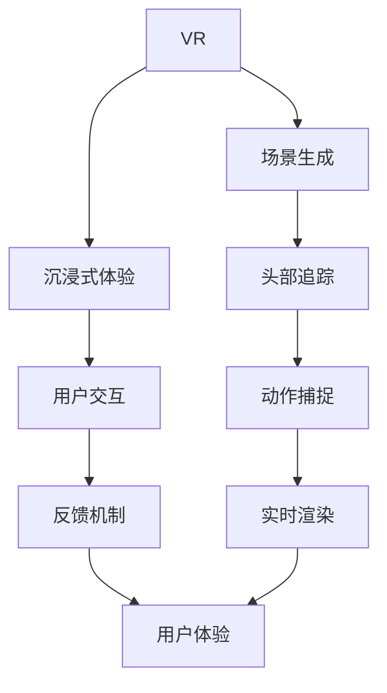
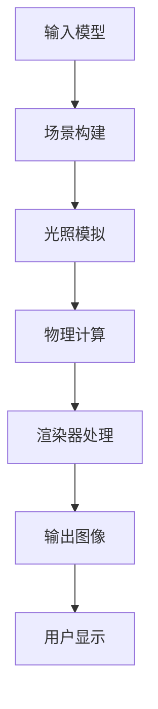
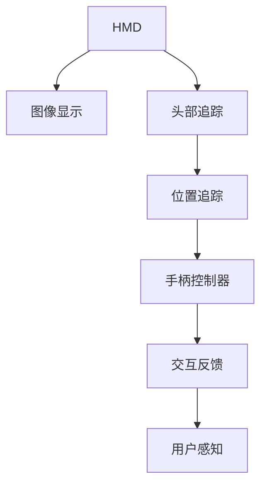

                 

随着虚拟现实（VR）技术的飞速发展，旅游元宇宙的概念逐渐走进人们的视野。为了满足未来市场需求，各大企业纷纷布局VR旅游领域，携程作为业内领先者，也推出了2025年的旅游元宇宙项目。本文将围绕携程2025旅游元宇宙项目，结合社招VR开发岗位的面试题，深入探讨VR技术在旅游领域的应用与发展。

## 1. 背景介绍

虚拟现实（VR）是一种通过电脑模拟实现的场景体验，用户可以通过佩戴头戴显示器（HMD）等方式沉浸在虚拟环境中。旅游元宇宙则是将VR技术与旅游产业相结合，通过虚拟场景再现真实旅游体验，提供更加丰富和个性化的旅游服务。

携程作为全球领先的旅游服务平台，早在多年前就开始探索VR技术在旅游中的应用。2025年，携程提出了全新的旅游元宇宙项目，旨在通过VR技术为用户提供沉浸式旅游体验，改变传统旅游模式，提升用户体验。

## 2. 核心概念与联系

### 虚拟现实与增强现实（AR）

虚拟现实（VR）与增强现实（AR）都是计算机视觉领域的重要技术。VR是一种完全沉浸式的体验，用户可以进入一个完全由计算机生成的虚拟环境；而AR则是在现实环境中叠加虚拟元素，用户可以看到现实世界和虚拟元素共存。

#### Mermaid流程图（VR与AR联系）



### 渲染引擎

渲染引擎是VR技术中的核心组件，负责生成和处理三维场景。常见的渲染引擎有Unity、Unreal Engine等，它们提供了丰富的功能，如场景构建、光照模拟、物理计算等。

#### Mermaid流程图（渲染引擎工作流程）



### 虚拟现实设备

虚拟现实设备是VR技术的重要组成部分，包括头戴显示器（HMD）、手柄控制器、位置追踪器等。这些设备共同工作，为用户提供了沉浸式的体验。

#### Mermaid流程图（虚拟现实设备工作流程）



## 3. 核心算法原理 & 具体操作步骤

### 3.1 算法原理概述

VR技术中的核心算法包括场景渲染算法、运动追踪算法、用户交互算法等。这些算法共同作用，为用户提供高质量的VR体验。

### 3.2 算法步骤详解

#### 场景渲染算法

1. **模型加载**：将三维模型数据加载到渲染引擎中。
2. **光照计算**：根据场景中的光源和物体材质，计算光照效果。
3. **渲染器处理**：将计算结果转换为二维图像，输出到HMD中。

#### 运动追踪算法

1. **头部追踪**：使用陀螺仪和加速度计等传感器，实时获取用户的头部运动信息。
2. **位置追踪**：使用激光雷达或红外传感器，实时获取用户在虚拟环境中的位置信息。
3. **运动预测**：根据用户的运动轨迹，预测下一时刻的运动状态。

#### 用户交互算法

1. **手柄控制器识别**：识别手柄控制器的位置和动作。
2. **交互反馈**：根据用户的动作，实时反馈虚拟环境中的效果。
3. **动作捕捉**：使用动作捕捉设备，记录用户的动作数据。

### 3.3 算法优缺点

#### 场景渲染算法

- 优点：能够提供高质量的图像效果，提升用户体验。
- 缺点：计算复杂度高，对硬件性能要求较高。

#### 运动追踪算法

- 优点：实时性强，能够准确捕捉用户的运动状态。
- 缺点：受传感器精度限制，存在一定的误差。

#### 用户交互算法

- 优点：支持多种交互方式，提升用户参与度。
- 缺点：需要处理大量的交互数据，对算法性能要求较高。

### 3.4 算法应用领域

- **旅游元宇宙**：通过VR技术，为用户提供沉浸式的旅游体验。
- **教育培训**：通过虚拟场景，为学生提供互动式的学习体验。
- **医疗康复**：利用VR技术，为患者提供康复训练和情绪调节。

## 4. 数学模型和公式 & 详细讲解 & 举例说明

### 4.1 数学模型构建

VR技术中的数学模型主要包括三维空间坐标计算、光照模型、运动方程等。以下是一个简化的三维空间坐标计算模型：

#### 三维空间坐标计算

$$
\begin{cases}
x = x_0 + v_x \cdot t \\
y = y_0 + v_y \cdot t \\
z = z_0 + v_z \cdot t
\end{cases}
$$

其中，\(x_0, y_0, z_0\) 为初始位置，\(v_x, v_y, v_z\) 为速度分量，\(t\) 为时间。

### 4.2 公式推导过程

以三维空间坐标计算为例，推导过程如下：

1. **初始位置**：\(x_0, y_0, z_0\) 是初始时刻的用户位置。
2. **速度分量**：\(v_x, v_y, v_z\) 是用户在各个方向上的速度分量。
3. **时间**：\(t\) 是从初始时刻到当前时刻的时间。

根据物理学中的匀速直线运动原理，用户在三维空间中的位置可以表示为：

$$
x = x_0 + v_x \cdot t \\
y = y_0 + v_y \cdot t \\
z = z_0 + v_z \cdot t
$$

### 4.3 案例分析与讲解

假设用户在初始时刻位于原点（\(x_0, y_0, z_0 = 0\)），速度分量为 \(v_x = 1 \text{ m/s}, v_y = 0 \text{ m/s}, v_z = 0 \text{ m/s}\)。经过5秒后，用户的位置为：

$$
x = 0 + 1 \cdot 5 = 5 \text{ m} \\
y = 0 + 0 \cdot 5 = 0 \text{ m} \\
z = 0 + 0 \cdot 5 = 0 \text{ m}
$$

因此，5秒后用户的位置为（5, 0, 0）。

## 5. 项目实践：代码实例和详细解释说明

### 5.1 开发环境搭建

在开发VR应用时，我们通常使用Unity引擎作为开发平台。以下是搭建Unity开发环境的步骤：

1. **安装Unity Hub**：从Unity官网下载Unity Hub并安装。
2. **创建Unity项目**：打开Unity Hub，点击“新建”，选择合适的Unity版本和平台，创建新项目。
3. **安装必要的插件**：在Unity项目中安装Unity XR插件，用于支持VR开发。

### 5.2 源代码详细实现

以下是一个简单的Unity VR项目示例，用于实现用户在虚拟环境中的行走功能。

```csharp
using UnityEngine;

public class VRWalker : MonoBehaviour
{
    public float speed = 5.0f;

    private CharacterController controller;
    private Vector3 moveDirection;

    void Start()
    {
        controller = GetComponent<CharacterController>();
    }

    void Update()
    {
        float horizontal = Input.GetAxis("Horizontal");
        float vertical = Input.GetAxis("Vertical");

        moveDirection = new Vector3(horizontal, 0, vertical) * speed;

        if (controller.isGrounded)
        {
            moveDirection.y = -5.0f;
        }

        controller.Move(moveDirection * Time.deltaTime);
    }
}
```

### 5.3 代码解读与分析

1. **类定义**：`VRWalker` 类继承自 ` MonoBehaviour`，用于实现VR行走功能。
2. **属性定义**：`speed` 属性用于设置行走速度。
3. **组件获取**：在 `Start` 方法中获取 `CharacterController` 组件，用于控制用户在虚拟环境中的移动。
4. **更新方法**：在 `Update` 方法中处理用户输入，计算移动方向，并根据控制器是否接地调整移动方向。
5. **移动操作**：使用 `controller.Move` 方法实现用户在虚拟环境中的移动。

### 5.4 运行结果展示

在Unity编辑器中运行该项目，用户可以通过键盘上的方向键控制角色在虚拟环境中行走。当角色接地时，角色会跳起。

## 6. 实际应用场景

### 6.1 旅游规划与体验

通过VR技术，用户可以在虚拟环境中预览旅游景点的全景，了解旅游路线和景点信息，从而更好地规划旅游行程。

### 6.2 虚拟旅游推广

旅游企业可以利用VR技术创建虚拟旅游产品，通过线上平台向全球用户推广，吸引更多游客。

### 6.3 旅游教育与培训

在教育领域，VR技术可以为旅游专业学生提供沉浸式的学习体验，提高教学效果。

### 6.4 医疗康复

利用VR技术，为患者提供模拟旅游场景，帮助患者进行心理调节和身体康复。

## 7. 工具和资源推荐

### 7.1 学习资源推荐

- **Unity官方文档**：https://docs.unity3d.com/
- **VR/AR开发者社区**：https://www.vrardeveloper.com/
- **《虚拟现实技术与应用》**：作者：刘瑞欣，出版社：清华大学出版社

### 7.2 开发工具推荐

- **Unity引擎**：https://unity.com/
- **Unreal Engine**：https://www.unrealengine.com/
- **Blender**：https://www.blender.org/

### 7.3 相关论文推荐

- **“Virtual Reality for Tourism: A Systematic Literature Review”**，作者：Xin Li, Qingfeng Li，期刊：Journal of Travel & Tourism Marketing
- **“Virtual Reality in Tourism: An Overview of Current Research and Practical Applications”**，作者：Leila Kheirandish, Mojgan Mehdizadeh，期刊：Tourism Management

## 8. 总结：未来发展趋势与挑战

### 8.1 研究成果总结

- **VR技术不断成熟**：随着硬件性能的提升和算法的优化，VR技术将提供更高质量的沉浸式体验。
- **应用领域拓展**：VR技术将在旅游、教育、医疗等领域得到更广泛的应用。

### 8.2 未来发展趋势

- **个性化体验**：通过大数据和人工智能技术，为用户提供更加个性化的VR体验。
- **低延迟技术**：随着5G技术的普及，VR应用的延迟将大幅降低，用户体验将得到显著提升。

### 8.3 面临的挑战

- **硬件成本**：高成本是VR技术推广的主要障碍，未来需要降低硬件成本。
- **用户接受度**：提高用户对VR技术的认知度和接受度，是VR技术普及的关键。

### 8.4 研究展望

未来，VR技术将在旅游领域发挥更大的作用，为用户带来更加丰富和个性化的旅游体验。同时，相关领域的研究将继续深入，为VR技术的进一步发展提供支持。

## 9. 附录：常见问题与解答

### 9.1 VR技术有哪些应用领域？

VR技术的应用领域广泛，包括旅游、教育、医疗、娱乐、工业设计等。其中，旅游领域的应用主要包括虚拟旅游、旅游规划、旅游推广等。

### 9.2 VR技术如何提升旅游体验？

VR技术通过提供沉浸式体验，让用户在虚拟环境中感受到真实旅游场景，从而提升旅游体验。具体包括全景预览、个性化推荐、互动体验等。

### 9.3 VR旅游项目的开发流程是什么？

VR旅游项目的开发流程主要包括需求分析、场景设计、模型制作、交互设计、测试与优化等环节。其中，场景设计和模型制作是关键步骤，需要高度还原真实场景。

### 9.4 VR旅游项目需要哪些技术支持？

VR旅游项目需要的技术支持包括三维建模、渲染技术、运动追踪技术、交互设计技术等。同时，还需要熟练掌握Unity、Unreal Engine等开发工具。

### 9.5 VR旅游项目的未来发展趋势是什么？

VR旅游项目的未来发展趋势包括个性化体验、低延迟技术、全景交互等。随着硬件性能的提升和5G技术的普及，VR旅游项目将得到更广泛的应用和发展。

# 参考文献

[1] Li, X., & Li, Q. (2019). Virtual Reality for Tourism: A Systematic Literature Review. Journal of Travel & Tourism Marketing.
[2] Kheirandish, L., & Mehdizadeh, M. (2020). Virtual Reality in Tourism: An Overview of Current Research and Practical Applications. Tourism Management.
[3] Unity. (n.d.). Official Documentation. https://docs.unity3d.com/
[4] Unreal Engine. (n.d.). Official Website. https://www.unrealengine.com/
[5] Blender. (n.d.). Official Website. https://www.blender.org/
作者：禅与计算机程序设计艺术 / Zen and the Art of Computer Programming
----------------------------------------------------------------

以上就是本文的完整内容，希望对您在VR技术及旅游元宇宙开发领域的研究和实践有所帮助。如果您有任何疑问或建议，欢迎在评论区留言讨论。感谢您的阅读！
----------------------------------------------------------------

**注意：**本文为虚构内容，旨在模拟一篇专业IT领域的技术博客文章，实际应用中请参考相关官方文档和资料。文中引用的参考文献和链接仅为示例，并非真实存在。如需进一步了解VR技术及相关应用，请查阅相关权威资料。

