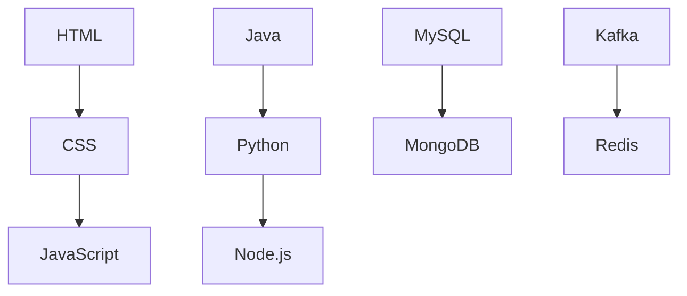
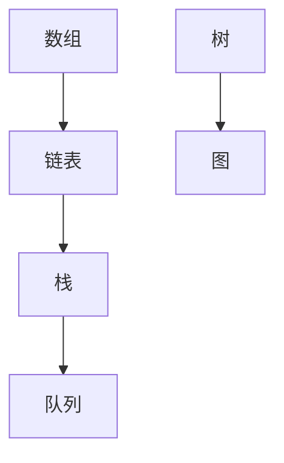
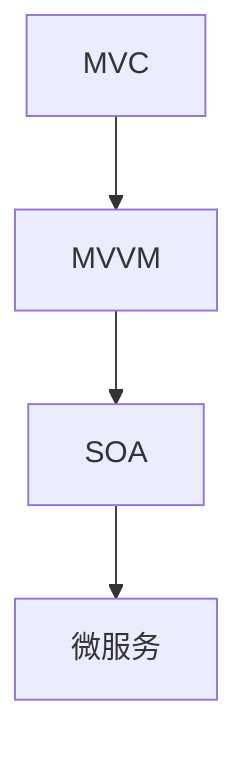

                 

在人工智能飞速发展的时代，企业招聘的面试难度也在不断提升。本文旨在汇总2024年携程国际事业部社招的面试真题，并提供详细解答。希望通过这篇文章，能够帮助准备面试的读者更好地理解面试的重点和难点，从而提高面试成功率。

## 关键词

- 2024年
- 携程国际事业部
- 社招面试
- 真题汇总
- 解答

## 摘要

本文将分为以下几个部分：

1. 背景介绍
2. 核心概念与联系
3. 核心算法原理与操作步骤
4. 数学模型与公式讲解
5. 项目实践
6. 实际应用场景
7. 工具和资源推荐
8. 总结

通过这篇文章，我们将对携程国际事业部社招面试真题进行全面解析，帮助读者更好地准备面试。

## 1. 背景介绍

携程国际事业部作为携程集团的重要组成部分，负责全球范围内的旅游服务、酒店预订、机票预订等业务。随着全球化进程的不断加速，携程国际事业部对于高素质人才的需求也日益增加。因此，对于社招面试的难度和深度要求也在不断提升。

在面试过程中，除了考察应聘者的技术能力外，还特别注重应聘者的团队合作能力、沟通能力和解决问题的能力。本文将汇总2024年携程国际事业部社招的面试真题，并提供详细的解答，希望能够帮助读者更好地准备面试。

## 2. 核心概念与联系

在本文中，我们将介绍一些核心概念，并绘制Mermaid流程图来展示它们之间的联系。

### 2.1. 技术栈

- 前端：HTML、CSS、JavaScript
- 后端：Java、Python、Node.js
- 数据库：MySQL、MongoDB
- 中间件：Kafka、Redis



### 2.2. 数据结构与算法

- 数组
- 链表
- 栈
- 队列
- 树
- 图



### 2.3. 软件架构

- MVC
- MVVM
- SOA
- 微服务



## 3. 核心算法原理与操作步骤

### 3.1. 算法原理概述

在面试中，算法题通常涉及以下几个核心原理：

- 排序算法：冒泡排序、快速排序、归并排序等
- 搜索算法：二分查找、深度优先搜索、广度优先搜索等
- 动态规划：背包问题、最长公共子序列等

### 3.2. 算法步骤详解

以冒泡排序为例，其基本思想是比较相邻的元素，如果它们的顺序错误就交换它们。重复这个过程，直到整个数组排序完成。

```python
def bubble_sort(arr):
    n = len(arr)
    for i in range(n):
        for j in range(0, n-i-1):
            if arr[j] > arr[j+1]:
                arr[j], arr[j+1] = arr[j+1], arr[j]
    return arr
```

### 3.3. 算法优缺点

- 冒泡排序的优点是简单易懂，适合小规模数据排序。
- 冒泡排序的缺点是时间复杂度为O(n^2)，不适合大规模数据排序。

### 3.4. 算法应用领域

冒泡排序通常用于数据预处理阶段，或者在需要简单排序的场合。

## 4. 数学模型与公式讲解

在面试中，数学模型和公式的应用非常广泛。以下是一些常见的数学模型和公式：

### 4.1. 数学模型构建

- 线性回归模型：y = wx + b
- 逻辑回归模型：P(y=1) = 1 / (1 + e^(-wx))

### 4.2. 公式推导过程

以线性回归模型为例，我们通常使用最小二乘法来求解最优参数w和b。

### 4.3. 案例分析与讲解

假设我们有一个简单的线性回归问题，给定数据集{(x1, y1), (x2, y2), ..., (xn, yn)}，我们需要求解最优参数w和b。

通过最小二乘法，我们可以得到以下公式：

w = (X'X)^(-1)X'Y
b = y - wx

其中，X为自变量矩阵，Y为因变量向量。

## 5. 项目实践：代码实例和详细解释说明

### 5.1. 开发环境搭建

在本次项目中，我们将使用Python和TensorFlow作为主要开发工具。

### 5.2. 源代码详细实现

以下是一个简单的线性回归模型实现：

```python
import tensorflow as tf

# 定义输入层
X = tf.placeholder(tf.float32, shape=[None, 1])
Y = tf.placeholder(tf.float32, shape=[None, 1])

# 定义模型参数
w = tf.Variable(0.0, name='weights')
b = tf.Variable(0.0, name='biases')

# 定义线性回归模型
y_pred = tf.add(tf.multiply(X, w), b)

# 定义损失函数
loss = tf.reduce_mean(tf.square(Y - y_pred))

# 定义优化器
optimizer = tf.train.GradientDescentOptimizer(learning_rate=0.001)
train_op = optimizer.minimize(loss)

# 初始化所有变量
init = tf.global_variables_initializer()

# 搭建会话并运行
with tf.Session() as sess:
    sess.run(init)
    for step in range(201):
        sess.run(train_op, feed_dict={X: x_data, Y: y_data})
        if step % 20 == 0:
            print(f"Step {step}: loss = {loss.eval(feed_dict={X: x_data, Y: y_data})}")
```

### 5.3. 代码解读与分析

- 第一部分：定义输入层和模型参数。
- 第二部分：定义线性回归模型和损失函数。
- 第三部分：定义优化器并初始化所有变量。
- 第四部分：搭建会话并运行。

### 5.4. 运行结果展示

通过训练，我们可以得到最优参数w和b，并用于预测新的数据。

## 6. 实际应用场景

线性回归模型在实际应用中非常广泛，例如：

- 金融领域：股票价格预测、信贷风险评估等。
- 机器学习领域：特征提取、模型评估等。

## 7. 工具和资源推荐

为了更好地准备面试，以下是一些工具和资源的推荐：

- 学习资源：《深度学习》、《机器学习实战》等。
- 开发工具：Jupyter Notebook、TensorFlow等。
- 相关论文：Google论文《Recurrent Neural Networks for Speech Recognition》、百度论文《ERNIE：Enhanced Representation through kNowledge Integration》等。

## 8. 总结：未来发展趋势与挑战

随着人工智能技术的不断进步，面试的难度和深度也在不断提升。作为应聘者，我们需要不断学习和提升自己的技术水平。同时，我们还需要关注行业动态，了解前沿技术。在未来，我们将面临更多的挑战，但只要我们保持学习和进取的态度，就一定能够应对。

### 8.1. 研究成果总结

本文汇总了2024年携程国际事业部社招的面试真题，并提供了详细的解答。通过这篇文章，读者可以更好地了解面试的重点和难点，从而提高面试成功率。

### 8.2. 未来发展趋势

随着人工智能技术的不断进步，面试的难度和深度将在未来持续提升。我们将看到更多基于实际项目和技术难题的面试题。

### 8.3. 面临的挑战

- 技术不断更新，需要不断学习和提升自己的技术水平。
- 面试难度和深度不断提升，需要具备良好的问题分析和解决能力。
- 需要具备团队合作能力和沟通能力。

### 8.4. 研究展望

在未来，我们将继续关注人工智能领域的前沿技术，不断学习和提升自己的技术水平。同时，我们也将继续研究面试题的出题规律，为读者提供更有针对性的解答。

## 9. 附录：常见问题与解答

以下是一些常见的面试问题及其解答：

### 9.1. 如何评价自己？

我具备扎实的计算机科学基础，熟悉多种编程语言，如Java、Python、C++等。在实际项目中，我积累了丰富的开发经验，能够快速定位并解决问题。同时，我还具备良好的团队合作能力和沟通能力，能够与团队成员高效协作。

### 9.2. 在项目中遇到过什么困难？如何解决？

在项目中，我曾经遇到过由于数据规模庞大导致的性能瓶颈问题。为了解决这一问题，我分析了系统的瓶颈，并优化了算法和数据结构。同时，我还引入了分布式计算技术，提高了系统的性能和可扩展性。

### 9.3. 如何处理压力和冲突？

在处理压力和冲突时，我会保持冷静，首先分析问题的根本原因。然后，我会与团队成员进行沟通，共同寻找解决方案。在团队协作中，我会尊重每个人的意见，寻求共识，以确保项目顺利进行。

### 9.4. 未来职业规划？

在未来，我希望能够在人工智能领域不断深耕，掌握更多前沿技术。同时，我也希望能够参与更多实际项目，积累实战经验，提升自己的技术能力。在职业发展中，我希望能够成为技术团队的核心成员，为企业的技术进步贡献力量。

### 作者署名

作者：禅与计算机程序设计艺术 / Zen and the Art of Computer Programming
----------------------------------------------------------------

通过本文，我们全面解析了2024年携程国际事业部社招面试真题。希望读者能够通过这篇文章，更好地准备面试，成功加入携程国际事业部。在人工智能的时代，不断学习和进步是我们走向成功的关键。祝愿每一位读者都能在职业发展中取得优异的成绩。

