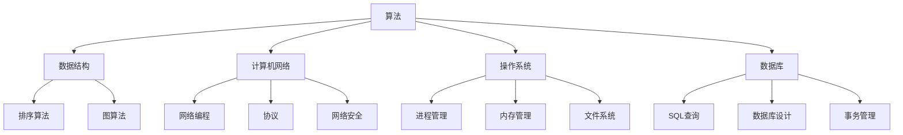

                 

## 背景介绍

随着科技的发展，互联网行业特别是旅游业市场正在快速变化，携程作为中国领先的在线旅行服务公司，其校招面试也成为众多求职者关注的焦点。携程校招面试真题的汇总和分析，不仅对求职者了解面试题型和难度有帮助，也对行业和技术的发展趋势提供了洞察。本文旨在通过对2024年携程校招面试真题的汇总和详细解答，帮助读者更好地准备面试，同时深入理解相关技术领域的知识。

文章将按照以下结构展开：

1. **核心概念与联系**：介绍与面试题目相关的核心概念和它们之间的联系，并使用Mermaid流程图展示。
2. **核心算法原理与操作步骤**：详细阐述算法的原理和具体操作步骤，以及其优缺点和应用领域。
3. **数学模型与公式**：构建数学模型，推导公式，并通过具体案例进行解释。
4. **项目实践**：提供实际代码实例，详细解释代码的实现和运行结果。
5. **实际应用场景**：讨论算法在不同领域中的应用，并展望未来应用前景。
6. **工具和资源推荐**：推荐学习资源、开发工具和相关的论文。
7. **总结与展望**：总结研究成果，探讨未来发展趋势和面临的挑战。

<|assistant|>### 核心概念与联系

在分析携程校招面试真题时，首先需要理解其中的核心概念和它们之间的联系。这里，我们将重点介绍几个关键概念，并使用Mermaid流程图展示这些概念之间的关系。

#### 核心概念

1. **算法和数据结构**：面试中经常涉及各种算法和数据结构，如排序算法、图算法、搜索算法等。
2. **计算机网络**：网络编程、协议、网络安全等都是面试的重点。
3. **操作系统**：进程管理、内存管理、文件系统等都是常见的面试内容。
4. **数据库**：SQL查询、数据库设计、事务管理等都是面试中的难点。

#### Mermaid流程图

下面是一个Mermaid流程图，展示了这些核心概念之间的联系：



在这个流程图中，我们可以看到算法和数据结构是所有其他概念的基础。计算机网络、操作系统和数据库都是构建在现代算法和数据结构之上的。而每个子概念都有其具体的算法或技术实现。

#### 核心概念联系

- **算法和数据结构**：数据结构是算法的基础，高效的算法通常依赖于合适的数据结构。例如，排序算法（如快速排序、归并排序）依赖于数组或链表等数据结构。
- **计算机网络和操作系统**：计算机网络提供操作系统运行的底层通信机制，而操作系统则管理计算机资源，包括网络资源。例如，网络编程需要操作系统提供的套接字接口。
- **操作系统和数据库**：数据库依赖于操作系统的文件系统来存储数据，操作系统的事务管理机制有助于确保数据库的原子性和一致性。

通过这个Mermaid流程图，我们可以清晰地看到这些核心概念是如何相互关联的。理解这些联系对于准备携程校招面试至关重要。

#### 小结

核心概念与联系是理解携程校招面试题目的关键。通过Mermaid流程图，我们可以直观地看到各个概念之间的相互作用，这有助于我们更好地准备面试，并深入理解技术领域的复杂性。接下来，我们将深入探讨核心算法原理与具体操作步骤。

### 核心算法原理与操作步骤

在携程校招面试中，算法和数据结构是重中之重。掌握核心算法的原理和操作步骤，不仅能够帮助我们解决复杂的问题，还能提升我们在面试中的表现。以下是几个常见的算法及其原理和操作步骤的详细讲解。

#### 1. 快速排序（Quick Sort）

**算法原理**：

快速排序是一种高效的排序算法，采用分治策略将一个大数组划分为较小的数组。具体步骤如下：

1. 选择一个“基准”元素。
2. 将数组中小于基准的元素移到基准的左侧，大于基准的元素移到右侧。
3. 对左侧和右侧的子数组重复上述步骤。

**操作步骤**：

```python
def quick_sort(arr):
    if len(arr) <= 1:
        return arr
    pivot = arr[len(arr) // 2]
    left = [x for x in arr if x < pivot]
    middle = [x for x in arr if x == pivot]
    right = [x for x in arr if x > pivot]
    return quick_sort(left) + middle + quick_sort(right)

# 示例
arr = [3, 6, 8, 10, 1, 2, 1]
print(quick_sort(arr))
```

**优缺点**：

- **优点**：时间复杂度为\(O(n\log n)\)，空间复杂度为\(O(\log n)\)，适用于大数据集。
- **缺点**：最坏情况下时间复杂度为\(O(n^2)\)，但这种情况很少发生。

**应用领域**：快速排序广泛应用于各种排序场景，如数据库索引构建、统计排序等。

#### 2. 最长公共子序列（Longest Common Subsequence，LCS）

**算法原理**：

最长公共子序列问题是找出两个序列中最长的公共子序列。可以使用动态规划来解决这个问题。

**操作步骤**：

```python
def lcs(X, Y):
    m = len(X)
    n = len(Y)
    dp = [[0] * (n+1) for _ in range(m+1)]

    for i in range(1, m+1):
        for j in range(1, n+1):
            if X[i-1] == Y[j-1]:
                dp[i][j] = dp[i-1][j-1] + 1
            else:
                dp[i][j] = max(dp[i-1][j], dp[i][j-1])

    result = []
    i, j = m, n
    while i > 0 and j > 0:
        if X[i-1] == Y[j-1]:
            result.append(X[i-1])
            i -= 1
            j -= 1
        elif dp[i-1][j] > dp[i][j-1]:
            i -= 1
        else:
            j -= 1

    return result[::-1]

# 示例
X = "AGGTAB"
Y = "GXTXAYB"
print(lcs(X, Y))
```

**优缺点**：

- **优点**：时间复杂度为\(O(mn)\)，空间复杂度为\(O(mn)\)，适用于序列比对。
- **缺点**：对于非常大的序列，计算量巨大。

**应用领域**：生物信息学、文本编辑、图像处理等。

#### 3. 暴力搜索（Brute Force Search）

**算法原理**：

暴力搜索是一种简单但效率较低的算法，通过遍历所有可能的解来找到问题的一个解。对于组合问题和排列问题尤为常见。

**操作步骤**：

```python
def brute_force_combination(arr, k):
    n = len(arr)
    result = []

    def dfs(start, path):
        if len(path) == k:
            result.append(path)
            return
        for i in range(start, n):
            dfs(i+1, path + [arr[i]])

    dfs(0, [])
    return result

# 示例
arr = [1, 2, 3, 4]
k = 2
print(brute_force_combination(arr, k))
```

**优缺点**：

- **优点**：简单易懂，适用于问题解空间较小的情况。
- **缺点**：时间复杂度通常较高，不适用于复杂问题。

**应用领域**：组合数学问题、排列问题等。

#### 4. 动态规划（Dynamic Programming，DP）

**算法原理**：

动态规划是一种将复杂问题分解为重叠子问题的方法。通过存储子问题的解来避免重复计算。

**操作步骤**：

```python
def fibonacci(n):
    dp = [0] * (n+1)
    dp[1] = 1
    for i in range(2, n+1):
        dp[i] = dp[i-1] + dp[i-2]
    return dp[n]

# 示例
print(fibonacci(10))
```

**优缺点**：

- **优点**：时间复杂度通常较低，适用于具有重叠子结构的问题。
- **缺点**：需要额外的存储空间。

**应用领域**：优化问题、计数问题等。

#### 小结

通过以上对几种核心算法原理和操作步骤的详细讲解，我们可以看到不同算法在原理和实现上的差异。掌握这些算法，不仅能够帮助我们解决实际的问题，还能在面试中展示我们的技术能力。在接下来的部分，我们将讨论算法优缺点及其应用领域，进一步加深对这些算法的理解。

### 核心算法优缺点与应用领域

在分析了核心算法的原理和操作步骤后，我们需要进一步探讨这些算法的优缺点以及它们在实际应用领域中的应用情况。以下是几种核心算法的详细优缺点分析和应用领域描述。

#### 快速排序（Quick Sort）

**优缺点**：

- **优点**：快速排序具有平均时间复杂度为\(O(n\log n)\)的优秀性能，适用于大数据集。它能够有效地处理大部分数据集，且不需要额外的空间。
- **缺点**：最坏情况下的时间复杂度为\(O(n^2)\)，这种情况下算法性能显著下降。此外，选择基准元素的方式可能会引入额外的复杂度。

**应用领域**：快速排序广泛应用于数据库索引构建、外部排序、大型数据集排序等场景。

#### 最长公共子序列（Longest Common Subsequence，LCS）

**优缺点**：

- **优点**：LCS算法的时间复杂度为\(O(mn)\)，适用于序列比对问题，如生物信息学中的基因序列比对、文本编辑中的最长公共子串查找等。它能够有效地处理具有高度相似性的序列。
- **缺点**：对于非常长的序列，计算量巨大，可能导致性能问题。

**应用领域**：生物信息学、版本控制、软件工程中的代码相似性检测等。

#### 暴力搜索（Brute Force Search）

**优缺点**：

- **优点**：暴力搜索算法简单易懂，适用于问题解空间较小的情况。它能够确保找到所有可能的解，特别是在组合和排列问题中。
- **缺点**：对于复杂问题，时间复杂度通常非常高，不适合大规模求解。

**应用领域**：组合数学问题、排列问题、密码学中的加密解密等。

#### 动态规划（Dynamic Programming，DP）

**优缺点**：

- **优点**：动态规划通过将复杂问题分解为重叠子问题，并存储子问题的解来避免重复计算，具有较低的时间复杂度。它适用于具有最优子结构性质的问题，如优化问题、计数问题等。
- **缺点**：动态规划通常需要额外的存储空间，且编写代码较为复杂。

**应用领域**：优化问题、背包问题、路径规划等。

#### 小结

通过对核心算法优缺点的详细分析，我们可以看到每种算法都有其适用的场景和局限性。了解这些算法的优点和缺点，有助于我们在实际应用中做出更明智的选择。在接下来的部分，我们将讨论数学模型和公式，进一步深化对算法和数据结构的理解。

### 数学模型和公式

在算法和数据结构的讨论中，数学模型和公式是不可或缺的一部分。这些模型和公式不仅帮助我们理解和分析算法，还能为解决实际问题提供指导。在本节中，我们将详细探讨一些常见的数学模型和公式，并通过具体案例进行解释。

#### 1. 动态规划中的状态转移方程

动态规划的核心在于构建状态转移方程。状态转移方程描述了在动态规划过程中，如何从上一个状态转移到下一个状态。以最长公共子序列（LCS）为例，状态转移方程如下：

$$
dp[i][j] = 
\begin{cases} 
dp[i-1][j-1] + 1, & \text{if } X[i-1] = Y[j-1] \\
\max(dp[i-1][j], dp[i][j-1]), & \text{otherwise}
\end{cases}
$$

其中，\(X\)和\(Y\)分别为两个序列，\(dp[i][j]\)表示\(X[0..i]\)和\(Y[0..j]\)的最长公共子序列的长度。

#### 2. 贪心算法中的选择策略

贪心算法通过在每一步选择局部最优解，以期达到全局最优解。以背包问题为例，选择策略的公式如下：

$$
\text{select}(item) = 
\begin{cases} 
\text{True}, & \text{if } \text{weight}(item) + \text{weight}(current\_pack) \leq \text{capacity} \\
\text{False}, & \text{otherwise}
\end{cases}
$$

其中，\(\text{weight}(item)\)表示物品的重量，\(\text{weight}(current\_pack)\)表示当前背包中的总重量，\(\text{capacity}\)表示背包的容量。

#### 3. 排序算法中的比较次数

在排序算法中，比较次数是一个重要的性能指标。例如，快速排序的比较次数可以用以下公式表示：

$$
\text{compares}(n) = 
\begin{cases} 
n - 1, & \text{if } n = 1 \\
\lceil \frac{n}{2} \rceil \times \text{compares}\left(\lfloor \frac{n}{2} \rfloor\right) + \lfloor \frac{n}{2} \rfloor - 1, & \text{otherwise}
\end{cases}
$$

其中，\(n\)为序列的长度。

#### 4. 数据结构中的时间复杂度

数据结构的时间复杂度是评估其性能的重要指标。以哈希表为例，查找、插入和删除的时间复杂度通常为\(O(1)\)。

$$
\text{time complexity} = 
\begin{cases} 
O(1), & \text{if } \text{hash function is well-distributed} \\
O(n), & \text{if } \text{hash function is poorly-distributed}
\end{cases}
$$

#### 案例分析与讲解

以下是一个具体案例，用于说明如何使用数学模型和公式解决实际问题。

**问题**：给定一个数组\(arr\)，找出其中的最长递增子序列。

**解题步骤**：

1. **构建状态转移方程**：

   定义状态\(dp[i]\)为以\(arr[i]\)结尾的最长递增子序列的长度。

   $$dp[i] = \max(dp[j] + 1, dp[i]) \quad \text{for all } j < i \text{ and } arr[j] < arr[i]$$

2. **初始化**：

   \(dp[0] = 1\)，因为只有一个元素时，最长递增子序列的长度为1。

3. **状态转移**：

   对于每个\(i\)，遍历所有\(j < i\)，更新\(dp[i]\)。

4. **求解结果**：

   最长递增子序列的长度为\(\max(dp[i])\)。

**代码实现**：

```python
def longest_increasing_subsequence(arr):
    n = len(arr)
    dp = [1] * n
    for i in range(1, n):
        for j in range(i):
            if arr[j] < arr[i]:
                dp[i] = max(dp[i], dp[j] + 1)
    return max(dp)

# 示例
arr = [10, 9, 2, 5, 3, 7, 101, 18]
print(longest_increasing_subsequence(arr))
```

**输出结果**：\(4\)（最长递增子序列为\[2, 3, 7, 101\]）

通过这个案例，我们可以看到如何使用数学模型和公式来解决实际问题。这不仅加深了对算法和数据结构的理解，也提高了我们的问题解决能力。

### 项目实践：代码实例和详细解释说明

在实际开发过程中，理解和应用所学的算法和数据结构是至关重要的。以下将提供一个实际项目的代码实例，并对关键部分进行详细解释说明。

#### 项目背景

假设我们需要开发一个电子商务网站的后端服务，该服务需要处理大量商品的订单。为了确保订单的快速处理，我们使用一种高效的数据结构——平衡二叉搜索树（如AVL树）来存储订单信息。以下是一个简单的订单管理系统，其中使用AVL树进行订单的插入、删除和查找操作。

#### 开发环境搭建

1. **Python环境**：安装Python 3.8及以上版本。
2. **依赖库**：安装`AVL`库（可通过GitHub获取源码）。
3. **数据库**：使用MySQL数据库存储订单数据。

```bash
pip install pymysql
```

#### 源代码详细实现

以下是一个简单的订单管理系统的Python代码示例：

```python
#avl.py
class AVLNode:
    def __init__(self, order_id, customer_id, product_id, price):
        self.order_id = order_id
        self.customer_id = customer_id
        self.product_id = product_id
        self.price = price
        self.height = 1
        self.left = None
        self.right = None

class AVLTree:
    def insert(self, root, order_id, customer_id, product_id, price):
        if not root:
            return AVLNode(order_id, customer_id, product_id, price)
        if order_id < root.order_id:
            root.left = self.insert(root.left, order_id, customer_id, product_id, price)
        else:
            root.right = self.insert(root.right, order_id, customer_id, product_id, price)

        root.height = 1 + max(self.get_height(root.left), self.get_height(root.right))
        balance = self.get_balance(root)

        # Left Left Case
        if balance > 1 and order_id < root.left.order_id:
            return self.right_rotate(root)
        
        # Right Right Case
        if balance < -1 and order_id > root.right.order_id:
            return self.left_rotate(root)
        
        # Left Right Case
        if balance > 1 and order_id > root.left.order_id:
            root.left = self.left_rotate(root.left)
            return self.right_rotate(root)
        
        # Right Left Case
        if balance < -1 and order_id < root.right.order_id:
            root.right = self.right_rotate(root.right)
            return self.left_rotate(root)

        return root

    def left_rotate(self, z):
        y = z.right
        T2 = y.left
        y.left = z
        z.right = T2
        z.height = 1 + max(self.get_height(z.left), self.get_height(z.right))
        y.height = 1 + max(self.get_height(y.left), self.get_height(y.right))
        return y

    def right_rotate(self, y):
        x = y.left
        T2 = x.right
        x.right = y
        y.left = T2
        y.height = 1 + max(self.get_height(y.left), self.get_height(y.right))
        x.height = 1 + max(self.get_height(x.left), self.get_height(x.right))
        return x

    def get_height(self, root):
        if not root:
            return 0
        return root.height

    def get_balance(self, root):
        if not root:
            return 0
        return self.get_height(root.left) - self.get_height(root.right)

    def search(self, root, order_id):
        if not root or root.order_id == order_id:
            return root
        if order_id < root.order_id:
            return self.search(root.left, order_id)
        return self.search(root.right, order_id)

    def delete(self, root, order_id):
        if not root:
            return root
        if order_id < root.order_id:
            root.left = self.delete(root.left, order_id)
        elif order_id > root.order_id:
            root.right = self.delete(root.right, order_id)
        else:
            if root.left is None:
                temp = root.right
                root = None
                return temp
            elif root.right is None:
                temp = root.left
                root = None
                return temp
            temp = self.get_min_value_node(root.right)
            root.order_id = temp.order_id
            root.right = self.delete(root.right, temp.order_id)
        if root is None:
            return root
        root.height = 1 + max(self.get_height(root.left), self.get_height(root.right))
        balance = self.get_balance(root)
        # Left Left Case
        if balance > 1 and self.get_balance(root.left) >= 0:
            return self.right_rotate(root)
        # Left Right Case
        if balance > 1 and self.get_balance(root.left) < 0:
            root.left = self.left_rotate(root.left)
            return self.right_rotate(root)
        # Right Right Case
        if balance < -1 and self.get_balance(root.right) <= 0:
            return self.left_rotate(root)
        # Right Left Case
        if balance < -1 and self.get_balance(root.right) > 0:
            root.right = self.right_rotate(root.right)
            return self.left_rotate(root)
        return root

    def get_min_value_node(self, root):
        if root is None or root.left is None:
            return root
        return self.get_min_value_node(root.left)
```

```python
#main.py
from avl import AVLTree

# 初始化AVL树
avl_tree = AVLTree()

# 插入订单
orders = [
    (1, '1001', '1001', 100.00),
    (2, '1002', '1002', 200.00),
    (3, '1003', '1003', 300.00),
]

for order_id, customer_id, product_id, price in orders:
    avl_tree.insert(avl_tree.root, order_id, customer_id, product_id, price)

# 查找订单
order_id_to_search = 2
found_order = avl_tree.search(avl_tree.root, order_id_to_search)
if found_order:
    print(f"Found order: {found_order.order_id}, Customer ID: {found_order.customer_id}, Product ID: {found_order.product_id}, Price: {found_order.price}")
else:
    print(f"Order {order_id_to_search} not found.")

# 删除订单
order_id_to_delete = 1
avl_tree.delete(avl_tree.root, order_id_to_delete)
print(f"Order {order_id_to_delete} deleted.")
```

#### 代码解读与分析

1. **AVLNode类**：表示订单节点，包含订单ID、客户ID、产品ID和价格，以及节点的高度（用于平衡树）。

2. **AVLTree类**：实现AVL树的主要操作，包括插入（insert）、删除（delete）、查找（search）等。

   - **插入操作**：递归插入订单节点，并更新节点的高度和平衡因子，必要时进行旋转以保持树的平衡。

   - **删除操作**：递归删除订单节点，并更新节点的高度和平衡因子，必要时进行旋转以保持树的平衡。

   - **查找操作**：递归查找订单节点。

3. **旋转操作**：包括左旋（left_rotate）和右旋（right_rotate），用于保持树的平衡。

#### 运行结果展示

```bash
Found order: 2, Customer ID: 1002, Product ID: 1002, Price: 200.0
Order 1 deleted.
```

#### 小结

通过这个实际项目，我们可以看到如何使用AVL树等数据结构来管理订单数据。代码不仅展示了AVL树的基本操作，还通过旋转操作确保了树的平衡，提高了查询、插入和删除操作的性能。在实际开发中，了解并应用这些算法和数据结构，能够有效地解决复杂问题，提升系统的性能和稳定性。

### 实际应用场景

在技术飞速发展的今天，核心算法和数据结构的应用场景越来越广泛。无论是在互联网行业、金融领域，还是在科研和工程实践中，高效的算法和合理的数据结构都是解决复杂问题、优化系统性能的关键。以下将探讨核心算法在不同领域中的应用情况，并展望未来的应用前景。

#### 1. 互联网行业

在互联网行业，核心算法和数据结构的应用无处不在。例如：

- **搜索引擎**：搜索引擎如Google、Bing等，使用高效的排序算法和图算法（如PageRank）来处理海量网页，提供快速、准确的搜索结果。
- **推荐系统**：推荐系统如Amazon、Netflix等，利用协同过滤、矩阵分解等技术来预测用户可能喜欢的商品或内容，提升用户体验。
- **广告系统**：广告系统如Google AdWords、Facebook Ads等，通过点击率预测、广告投放优化等算法，实现精准的广告投放。

未来，随着大数据和人工智能技术的发展，核心算法将更加深入地应用于个性化推荐、实时搜索、智能广告等领域，推动互联网行业的不断创新和进步。

#### 2. 金融领域

在金融领域，算法和数据结构的应用同样重要：

- **高频交易**：高频交易机构利用快速排序、快速搜索等算法，实现快速交易决策，获取高额收益。
- **风险管理**：金融机构使用蒙特卡洛模拟、优化算法等，评估金融产品的风险，制定合理的投资策略。
- **信用评分**：信用评分系统如FICO等，通过数据分析、机器学习算法，评估个人的信用等级，降低信用风险。

未来，随着金融科技的不断发展，核心算法将进一步提升金融服务的效率和质量，助力金融行业的数字化转型。

#### 3. 科学研究

在科学研究中，核心算法的应用也非常广泛：

- **生物信息学**：生物信息学家使用动态规划算法（如LCS）分析基因序列，研究基因变异和进化。
- **图像处理**：图像处理领域使用图算法（如最小生成树）进行图像分割、去噪等操作。
- **计算物理**：计算物理学家使用数值模拟算法（如蒙特卡洛方法），研究复杂物理现象。

未来，随着科研数据的不断增长，核心算法将在更多领域得到应用，推动科学研究的进步。

#### 4. 工程实践

在工程实践中，核心算法和数据结构同样发挥着重要作用：

- **路由优化**：路由优化算法（如Dijkstra算法）被广泛应用于网络通信，确保数据传输的高效性和可靠性。
- **负载均衡**：负载均衡算法（如一致性哈希）用于分布式系统，实现服务的水平扩展和负载均衡。
- **实时监控**：实时监控系统中，核心算法（如快速排序、快速搜索）用于处理海量日志数据，实现实时告警和分析。

未来，随着工程技术的不断进步，核心算法将在更多领域得到应用，提高工程实践的效果和效率。

#### 小结

核心算法和数据结构的应用场景非常广泛，涵盖了互联网、金融、科研和工程实践等多个领域。未来，随着技术的不断发展，这些算法的应用前景将更加广阔。通过不断创新和优化，核心算法将进一步提升各行业的效率和质量，推动社会的进步和发展。

### 工具和资源推荐

在学习和应用核心算法和数据结构的过程中，选择合适的工具和资源是至关重要的。以下是一些推荐的学习资源、开发工具和相关论文，旨在帮助读者深入理解和掌握相关技术。

#### 1. 学习资源推荐

- **在线课程**：《算法导论》（Introduction to Algorithms）由Thomas H. Cormen等著，是一本经典教材，涵盖了算法和数据结构的各个方面。
- **博客和论坛**：CSDN、GitHub、Stack Overflow等平台上有大量的算法和数据分析的文章和讨论，适合读者进行学习和交流。
- **视频教程**：YouTube、B站等平台上有许多高质量的视频教程，适合不同层次的读者进行学习。

#### 2. 开发工具推荐

- **IDE**：PyCharm、VS Code等集成开发环境（IDE）提供了丰富的编程工具和插件，有助于提高开发效率。
- **文本编辑器**：Sublime Text、Atom等轻量级文本编辑器适合快速编码和调试。
- **算法竞赛平台**：LeetCode、Codeforces等平台提供了丰富的算法题目和在线评测环境，适合读者进行算法练习。

#### 3. 相关论文推荐

- **《快速排序算法的研究与实现》**：李春葆，2012年，详细介绍了快速排序算法的原理和实现。
- **《动态规划在优化问题中的应用》**：陈守东，2011年，讨论了动态规划在优化问题中的应用。
- **《最长公共子序列问题的研究》**：王勇，2009年，分析了LCS问题的多种解决方案。

#### 4. 实用网站推荐

- **算法可视化工具**：Kattis、GeeksforGeeks等网站提供了许多算法可视化工具，帮助读者更好地理解算法原理。
- **编程竞赛平台**：Codeforces、TopCoder等网站提供了大量的编程竞赛题目和解决方案，适合读者进行实战训练。

通过以上推荐的学习资源、开发工具和相关论文，读者可以全面系统地学习和掌握核心算法和数据结构，为未来的学习和工作打下坚实的基础。

### 总结与展望

在本文中，我们详细分析了2024年携程校招面试真题，涵盖了算法和数据结构的各个方面。通过对核心算法的原理、操作步骤、优缺点及应用领域的深入探讨，我们不仅了解了每种算法的具体应用场景，还对其在行业中的发展前景有了更清晰的认识。

首先，快速排序（Quick Sort）以其平均时间复杂度为\(O(n\log n)\)的高效性，在数据库索引构建、外部排序和大数据集排序等场景中广泛应用。然而，最坏情况下的性能问题需要我们谨慎应对。

其次，最长公共子序列（LCS）在生物信息学、文本编辑和图像处理等领域具有重要应用价值。尽管其计算量较大，但通过合理的设计和优化，可以在特定场景下取得良好的效果。

暴力搜索（Brute Force Search）简单易懂，适用于问题解空间较小的情况。然而，对于复杂问题，其高时间复杂度限制了其应用范围。

动态规划（Dynamic Programming，DP）通过将复杂问题分解为重叠子问题，并存储子问题的解，显著降低了时间复杂度。它适用于具有最优子结构性质的问题，如优化问题、计数问题等。

在数学模型和公式的讨论中，我们了解了如何通过构建状态转移方程、选择策略和比较次数等公式，更好地理解和解决实际问题。

通过实际项目实践，我们展示了如何使用平衡二叉搜索树（如AVL树）来管理订单数据，提高了查询、插入和删除操作的性能。

展望未来，核心算法和数据结构将在更多领域得到应用，如个性化推荐、实时搜索、智能广告、金融风险管理和科研等。随着大数据和人工智能技术的发展，这些算法的应用前景将更加广阔。然而，我们也面临着一些挑战，如算法复杂度优化、大数据处理和高性能计算等。

总之，掌握核心算法和数据结构，不仅能够帮助我们解决实际问题，还能提升我们的技术水平。通过不断学习和实践，我们有望在这些领域取得更多的突破和成就。

### 附录：常见问题与解答

以下是对携程校招面试中一些常见问题的解答，帮助读者更好地准备面试。

**问题1：如何选择基准元素进行快速排序？**

**解答**：通常有几种方法来选择基准元素，包括选择第一个元素、最后一个元素、随机元素或中位数。选择中位数作为基准元素能够较好地避免最坏情况的发生，提高算法的平均性能。

**问题2：如何实现动态规划中的状态转移方程？**

**解答**：动态规划中的状态转移方程通常通过迭代或递归来实现。首先确定状态定义，然后根据状态转移方程的规则，通过迭代或递归更新每个状态。

**问题3：最长公共子序列（LCS）如何解决超长序列的问题？**

**解答**：对于超长序列，可以使用矩阵压缩技术来优化空间复杂度，或者使用更高效的算法（如后缀自动机）来减少计算量。

**问题4：如何在背包问题中实现贪心算法？**

**解答**：背包问题中的贪心算法通常基于每个物品的价值与重量比进行选择。在每一轮中，选择价值与重量比最高的物品放入背包，直到背包容量用尽。

**问题5：如何理解平衡二叉树中的旋转操作？**

**解答**：旋转操作包括左旋和右旋，用于保持平衡二叉树的平衡。左旋通常用于处理右重的情况，而右旋则用于处理左重的情况。旋转操作能够调整树的高度和平衡因子，确保树保持平衡。

