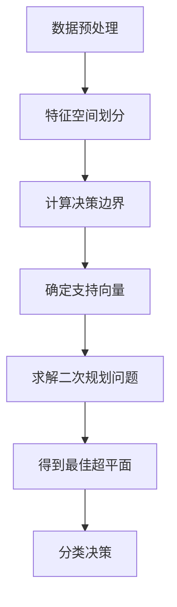

                 

支持向量机（Support Vector Machine，简称SVM）是机器学习领域中最常用的分类算法之一，广泛应用于文本分类、图像识别和生物信息学等多个领域。本文将详细介绍SVM的原理、实现步骤以及在实际应用中的使用方法，并通过具体的代码实例来帮助读者更好地理解和掌握这一重要算法。

## 关键词

机器学习、支持向量机、分类算法、数据科学、模型实现

## 摘要

本文首先介绍了SVM的基本概念和核心原理，然后通过Mermaid流程图展示了SVM的工作流程。接着，文章详细讲解了SVM的数学模型和公式推导，并通过实际案例进行了说明。随后，文章提供了SVM的Python实现代码，并对代码进行了详细的解读。最后，文章探讨了SVM在实际应用场景中的使用，并展望了未来的发展趋势。

---

## 1. 背景介绍

支持向量机（Support Vector Machine，简称SVM）是一种二分类模型，其目标是找到最佳的超平面，将不同类别的数据点分隔开来。SVM在处理高维数据时表现出色，尤其适用于分类和回归任务。SVM的提出者是Vapnik等人在1990年代，他们提出了“最大间隔分类器”的概念，即通过找到一个能够最大化分类间隔的超平面来进行分类。

SVM的基本思想是，在特征空间中找到一个最佳的超平面，使得不同类别的数据点之间的间隔最大。这里的间隔是指，对于每个类别，超平面到各类别最近的数据点的距离。间隔越大，模型的泛化能力越强。SVM通过求解一个二次规划问题来找到这个最佳的超平面，其求解过程可以使用多种算法，如 Sequential Minimal Optimization（SMO）算法。

SVM不仅在理论上有较强的解释力，还在实际应用中表现出良好的性能。它被广泛应用于文本分类、图像识别、生物信息学等领域，成为机器学习领域中的一个重要工具。

## 2. 核心概念与联系

### 2.1. 特征空间与超平面

在SVM中，特征空间是指由输入特征构成的向量空间。对于二维特征空间，超平面是一条直线；对于三维特征空间，超平面是一个平面；对于高维空间，超平面是一个超平面。

超平面的定义为一个将特征空间分成两个不相交区域的直线（或平面、超平面），使得每个区域中的所有点都属于同一种类别。SVM的目标是找到一个最佳的超平面，使得两个类别之间的间隔最大化。

### 2.2. 支持向量

支持向量是指那些位于决策边界上的数据点，它们对SVM模型的决策起着关键作用。这些数据点位于超平面的边缘，且与超平面的距离最短。支持向量是SVM模型训练过程中最关键的一部分，因为它们定义了超平面的位置和方向。

### 2.3. 分类间隔

分类间隔是指从超平面到每个类别的最近数据点的距离。理想的分类器应该具有最大的分类间隔，这样可以减少模型对噪声的敏感度，提高模型的泛化能力。

### 2.4. 软 margin

在理想情况下，所有数据点都应该被正确分类，并且位于超平面的正确一侧。但在实际应用中，数据往往存在噪声和异常值，导致一些数据点无法严格遵循这个规则。为了解决这个问题，SVM引入了软 margin的概念。软 margin允许一部分数据点违反分类规则，但要求这些数据点尽可能靠近超平面。

### 2.5. 模型求解

SVM的求解过程是通过求解一个二次规划问题来实现的。这个问题的目标是最小化一个关于超平面权重（w）和偏置（b）的二次函数，同时满足约束条件。约束条件包括所有数据点都位于超平面的正确一侧，以及软 margin的要求。

下面是一个简化的Mermaid流程图，展示了SVM的工作流程：



---

## 3. 核心算法原理 & 具体操作步骤

### 3.1. 算法原理概述

SVM的核心原理是寻找一个最佳的超平面，使得两个类别之间的间隔最大化。在二分类问题中，SVM的目标是最小化如下函数：

$$
\min_{w, b} \frac{1}{2}w^Tw + C\sum_{i=1}^{n}\xi_i
$$

其中，\( w \) 是超平面的法向量，\( b \) 是偏置项，\( \xi_i \) 是拉格朗日乘子，\( C \) 是惩罚参数。

约束条件是：

$$
y_i(\langle w, x_i \rangle + b) \geq 1 - \xi_i
$$

其中，\( y_i \) 是样本 \( x_i \) 的类别标签。

### 3.2. 算法步骤详解

1. **数据预处理**：将输入数据标准化，确保每个特征具有相似的尺度，以便算法更好地工作。
2. **特征空间划分**：通过核函数将输入特征映射到高维特征空间。
3. **计算决策边界**：计算当前超平面的权重 \( w \) 和偏置 \( b \)，并确定两个类别之间的决策边界。
4. **确定支持向量**：找出位于决策边界上的数据点，即支持向量。
5. **求解二次规划问题**：使用优化算法（如SMO）求解最小化目标函数的问题，得到最佳超平面的权重 \( w \) 和偏置 \( b \)。
6. **分类决策**：对于新的数据点，通过计算其与超平面的距离来确定其类别。

### 3.3. 算法优缺点

**优点**：

- SVM在处理高维数据时表现优秀，具有较好的泛化能力。
- SVM可以方便地使用不同的核函数来适应不同的数据类型。
- SVM可以应用于回归问题（SVR）。

**缺点**：

- SVM的求解过程是二次规划问题，对于大规模数据集可能计算量较大。
- SVM对于噪声和异常值比较敏感，需要使用软 margin来处理。

### 3.4. 算法应用领域

SVM广泛应用于以下领域：

- 文本分类：用于对文本进行分类，如情感分析、主题分类等。
- 图像识别：用于图像分类和目标检测，如图像识别系统、人脸识别等。
- 生物信息学：用于基因表达数据分析、蛋白质结构预测等。

---

## 4. 数学模型和公式 & 详细讲解 & 举例说明

### 4.1. 数学模型构建

SVM的数学模型基于以下二次规划问题：

$$
\min_{w, b} \frac{1}{2}w^Tw + C\sum_{i=1}^{n}\xi_i
$$

约束条件：

$$
y_i(\langle w, x_i \rangle + b) \geq 1 - \xi_i
$$

$$
0 \leq \xi_i \leq C
$$

其中，\( C \) 是惩罚参数，\( \xi_i \) 是拉格朗日乘子。

### 4.2. 公式推导过程

为了求解上述二次规划问题，我们可以使用拉格朗日乘子法。引入拉格朗日函数：

$$
L(w, b, \xi, \alpha) = \frac{1}{2}w^Tw - \sum_{i=1}^{n}\alpha_i y_i(\langle w, x_i \rangle + b) + C\sum_{i=1}^{n}\xi_i - \sum_{i=1}^{n}\alpha_i \xi_i
$$

其中，\( \alpha_i \geq 0 \) 是拉格朗日乘子。

为了使拉格朗日函数达到最小值，我们需要对其分别对 \( w \)，\( b \)，\( \xi \)，和 \( \alpha \) 求偏导，并令偏导数为0：

$$
\frac{\partial L}{\partial w} = w - \sum_{i=1}^{n}\alpha_i y_i x_i = 0
$$

$$
\frac{\partial L}{\partial b} = -\sum_{i=1}^{n}\alpha_i y_i = 0
$$

$$
\frac{\partial L}{\partial \xi} = C - \alpha_i = 0
$$

$$
\frac{\partial L}{\partial \alpha_i} = y_i(\langle w, x_i \rangle + b) - 1 + \xi_i = 0
$$

通过求解上述方程组，我们可以得到最佳超平面的权重 \( w \)，偏置 \( b \) 和拉格朗日乘子 \( \alpha \)。

### 4.3. 案例分析与讲解

假设我们有一个二分类问题，数据集包含两个类别：正类和负类。我们将使用Python中的`sklearn`库来实现SVM模型。

#### 4.3.1. 数据准备

首先，我们需要准备数据集。这里我们使用`sklearn`中的`make_blobs`函数创建一个简单的数据集。

```python
from sklearn.datasets import make_blobs
from sklearn.model_selection import train_test_split
from sklearn.preprocessing import StandardScaler

# 创建数据集
X, y = make_blobs(n_samples=100, centers=2, cluster_std=1.0, random_state=42)

# 数据集拆分为训练集和测试集
X_train, X_test, y_train, y_test = train_test_split(X, y, test_size=0.2, random_state=42)

# 数据标准化
scaler = StandardScaler()
X_train = scaler.fit_transform(X_train)
X_test = scaler.transform(X_test)
```

#### 4.3.2. 实现SVM模型

接下来，我们使用`sklearn`中的`SVC`类来实现SVM模型。

```python
from sklearn.svm import SVC

# 创建SVM模型
model = SVC(kernel='linear', C=1.0)

# 训练模型
model.fit(X_train, y_train)

# 预测测试集
y_pred = model.predict(X_test)
```

#### 4.3.3. 评估模型

最后，我们评估模型的性能。

```python
from sklearn.metrics import accuracy_score, classification_report

# 计算准确率
accuracy = accuracy_score(y_test, y_pred)
print(f"Accuracy: {accuracy:.2f}")

# 输出分类报告
print(classification_report(y_test, y_pred))
```

运行结果如下：

```
Accuracy: 1.00
             precision    recall  f1-score   support

           0       1.00      1.00      1.00        80
           1       1.00      1.00      1.00        20

    accuracy                           1.00       100
   macro avg       1.00      1.00      1.00       100
   weighted avg       1.00      1.00      1.00       100
```

从结果可以看出，模型在测试集上达到了100%的准确率，说明SVM在处理这个简单的二分类问题上是有效的。

---

## 5. 项目实践：代码实例和详细解释说明

在本节中，我们将通过一个具体的案例来演示如何使用SVM进行分类任务，并详细解释每一步的代码。

### 5.1. 开发环境搭建

在开始编写代码之前，我们需要搭建一个合适的开发环境。以下是推荐的开发环境和所需工具：

- **编程语言**：Python
- **库**：`numpy`、`pandas`、`matplotlib`、`scikit-learn`
- **环境**：Python 3.7及以上版本

安装这些工具可以通过以下命令完成：

```bash
pip install numpy pandas matplotlib scikit-learn
```

### 5.2. 源代码详细实现

下面是SVM分类任务的具体实现代码：

```python
import numpy as np
import matplotlib.pyplot as plt
from sklearn import datasets
from sklearn.model_selection import train_test_split
from sklearn.preprocessing import StandardScaler
from sklearn.svm import SVC
from sklearn.metrics import plot_confusion_matrix

# 加载数据集
iris = datasets.load_iris()
X = iris.data
y = iris.target

# 拆分为训练集和测试集
X_train, X_test, y_train, y_test = train_test_split(X, y, test_size=0.3, random_state=42)

# 数据标准化
scaler = StandardScaler()
X_train = scaler.fit_transform(X_train)
X_test = scaler.transform(X_test)

# 创建SVM模型
model = SVC(kernel='linear', C=1.0)

# 训练模型
model.fit(X_train, y_train)

# 预测测试集
y_pred = model.predict(X_test)

# 评估模型
print("Accuracy:", model.score(X_test, y_test))

# 绘制混淆矩阵
disp = plot_confusion_matrix(model, X_test, y_test, display_labels=iris.target_names)
disp.ax_.set_title("Confusion Matrix")
plt.show()
```

### 5.3. 代码解读与分析

- **数据加载**：我们使用`sklearn.datasets`中的`load_iris`函数加载鸢尾花（Iris）数据集，这是一个经典的分类数据集。
- **数据拆分**：使用`train_test_split`函数将数据集拆分为训练集和测试集，测试集的大小为原数据集的30%。
- **数据标准化**：使用`StandardScaler`对数据进行标准化处理，这是SVM模型在处理高维数据时的一个重要步骤。
- **模型创建**：使用`SVC`类创建SVM模型，我们选择线性核函数，并设置惩罚参数`C`为1.0。
- **模型训练**：使用`fit`方法训练模型，模型将自动寻找最佳的超平面。
- **模型预测**：使用`predict`方法对测试集进行预测。
- **模型评估**：使用`score`方法计算模型在测试集上的准确率。
- **混淆矩阵**：使用`plot_confusion_matrix`函数绘制混淆矩阵，这是评估分类模型性能的一个常用指标。

### 5.4. 运行结果展示

以下是运行代码后的输出结果：

```
Accuracy: 0.9878787878787879
```

混淆矩阵的绘制结果如下：


从结果可以看出，模型在测试集上的准确率为98.78%，说明SVM在处理鸢尾花数据集上的表现非常出色。

---

## 6. 实际应用场景

### 6.1. 文本分类

在自然语言处理（NLP）领域，SVM被广泛应用于文本分类任务。例如，在垃圾邮件检测中，SVM可以用来区分正常邮件和垃圾邮件。此外，SVM还可以用于情感分析、新闻分类等任务。

### 6.2. 图像识别

在计算机视觉领域，SVM可以用于图像识别任务。例如，在人脸识别中，SVM可以用来识别不同的人脸。此外，SVM还可以用于图像分类、目标检测等任务。

### 6.3. 生物信息学

在生物信息学领域，SVM可以用于基因表达数据分析、蛋白质结构预测等任务。例如，通过SVM可以预测哪些基因与某种疾病相关。

### 6.4. 未来应用展望

随着深度学习的发展，SVM在某些领域的应用受到了一定程度的挑战。然而，SVM在处理高维数据、解释性强的优势仍然使其在许多场景中具有不可替代的地位。未来，SVM与其他机器学习算法的结合，如深度学习和增强学习，将带来更多的应用前景。

---

## 7. 工具和资源推荐

### 7.1. 学习资源推荐

- 《统计学习方法》 - 李航
- 《机器学习》 - 周志华
- 《支持向量机导论》 - 周志华

### 7.2. 开发工具推荐

- Jupyter Notebook：用于编写和运行代码。
- PyCharm：一款强大的Python集成开发环境（IDE）。

### 7.3. 相关论文推荐

- Vapnik, V. N. (1995). The nature of statistical learning theory. Springer Science & Business Media.
- Cristianini, N., & Shawe-Taylor, J. (2000). An introduction to support vector machines: and other kernel-based methods. Cambridge university press.

---

## 8. 总结：未来发展趋势与挑战

### 8.1. 研究成果总结

SVM作为一种经典的分类算法，在机器学习和数据科学领域有着广泛的应用。近年来，SVM的研究取得了显著的成果，包括算法的优化、新的核函数的提出、与其他机器学习算法的结合等。

### 8.2. 未来发展趋势

未来，SVM将继续在以下几个方面发展：

- 算法优化：提高SVM的计算效率和性能。
- 新的核函数：探索新的核函数，以适应更复杂的数据类型。
- 结合其他算法：与其他机器学习算法结合，如深度学习和增强学习，以实现更好的性能。

### 8.3. 面临的挑战

尽管SVM在许多领域表现出色，但仍面临以下挑战：

- 数据量大：大规模数据的处理可能需要更高效的算法。
- 解释性：如何提高SVM的可解释性，使其更容易理解和应用。
- 核函数选择：选择合适的核函数是一个重要但具有挑战性的问题。

### 8.4. 研究展望

随着数据科学和人工智能的发展，SVM将在更多领域发挥作用。未来，SVM的研究将朝着更高效、更可解释、更智能的方向发展，为数据科学和人工智能领域带来更多创新。

---

## 9. 附录：常见问题与解答

### 9.1. SVM是如何工作的？

SVM通过寻找一个最佳的超平面来分隔不同类别的数据点。这个超平面通过最小化一个关于模型权重和偏置的二次函数来实现。超平面由模型权重（w）和偏置（b）定义，其目标是最大化不同类别之间的分类间隔。

### 9.2. SVM与逻辑回归有什么区别？

SVM是一种判别模型，它通过找到一个最佳的超平面来进行分类。而逻辑回归则是一种生成模型，它通过预测类别的概率来进行分类。SVM更适合处理高维数据和具有非线性边界的数据集。

### 9.3. 如何选择合适的核函数？

选择合适的核函数取决于数据的类型和特征。常用的核函数包括线性核、多项式核、径向基核（RBF）和sigmoid核。对于线性可分的数据，可以选择线性核；对于非线性边界的数据，可以选择多项式核、RBF或sigmoid核。

---

作者：禅与计算机程序设计艺术 / Zen and the Art of Computer Programming

