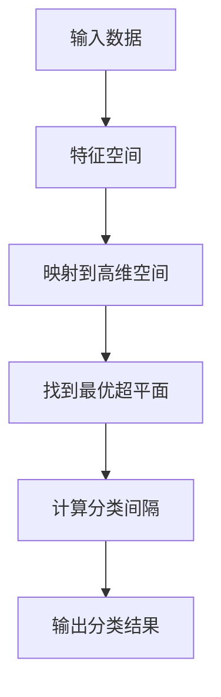

                 

关键词：支持向量机、SVM、机器学习、线性分类、非线性分类、数学模型、优化算法、代码实例、Python实现

> 摘要：本文将详细介绍支持向量机（SVM）的基本原理、数学模型、优化算法以及如何使用Python实现SVM进行分类任务。文章旨在为读者提供一个全面的理解和实用的指南，帮助他们在实际项目中应用SVM。

## 1. 背景介绍

支持向量机（Support Vector Machine，简称SVM）是机器学习领域一种重要的监督学习模型，广泛用于模式识别、数据分类和回归分析。SVM通过寻找一个最优的超平面，将不同类别的数据点分开，其核心思想是将数据映射到高维空间，通过最大化分类间隔来实现良好的分类效果。

SVM由Vapnik和Chervonenkis在20世纪60年代提出，并逐渐发展成为机器学习领域的重要工具。其优点在于良好的泛化能力和对非线性问题的处理能力。SVM在图像识别、文本分类、生物信息学等多个领域都有广泛应用。

## 2. 核心概念与联系

在介绍SVM的核心算法之前，我们首先需要了解几个关键概念，包括特征空间、超平面、支持向量以及分类间隔。

### 2.1 特征空间

特征空间是数据点所在的空间，这些数据点是由特征向量表示的。在低维空间中，数据点可以直观地可视化；而在高维空间中，数据点无法直接呈现，但SVM算法可以将数据映射到高维空间，从而找到最优的超平面。

### 2.2 超平面

超平面是特征空间中的一个线性分隔平面，它将数据分为两个类别。在二维空间中，超平面可以表示为一条直线；在三维空间中，超平面可以表示为一个平面。

### 2.3 支持向量

支持向量是那些位于分类边界上的数据点，它们对超平面的位置有直接影响。在寻找最优超平面的过程中，支持向量扮演了关键角色。

### 2.4 分类间隔

分类间隔是指最优超平面到最近支持向量的距离。分类间隔越大，表示模型对数据的分类能力越强。

### 2.5 Mermaid 流程图

下面是一个简化的Mermaid流程图，展示了SVM的基本流程：



## 3. 核心算法原理 & 具体操作步骤

### 3.1 算法原理概述

SVM的核心算法是通过求解一个优化问题来寻找最优超平面。该优化问题的目标是最小化目标函数，同时满足约束条件。目标函数通常是对分类间隔的度量，约束条件则是确保数据点被正确分类。

### 3.2 算法步骤详解

SVM算法的基本步骤如下：

1. **数据预处理**：对输入数据进行标准化处理，确保每个特征的重要性相同。

2. **选择核函数**：根据数据的特点选择合适的核函数，如线性核、多项式核、径向基函数（RBF）核等。

3. **构建优化问题**：定义目标函数和约束条件，构建SVM的优化问题。

4. **求解优化问题**：使用求解器求解优化问题，找到最优超平面。

5. **分类决策**：根据找到的最优超平面进行分类决策。

### 3.3 算法优缺点

**优点**：

- **良好的分类效果**：SVM能够通过寻找最优超平面实现良好的分类效果。
- **处理非线性问题**：通过核技巧，SVM可以处理非线性分类问题。
- **泛化能力强**：SVM具有良好的泛化能力，能够对新数据进行准确的分类。

**缺点**：

- **计算复杂度高**：特别是对于高维数据和大型数据集，SVM的计算复杂度较高。
- **对参数敏感**：SVM的性能对参数的选择较为敏感，需要通过交叉验证等方法进行参数调优。

### 3.4 算法应用领域

SVM在多个领域有广泛应用，包括：

- **图像识别**：用于人脸识别、手写数字识别等任务。
- **文本分类**：用于垃圾邮件过滤、情感分析等任务。
- **生物信息学**：用于基因表达数据分析、蛋白质结构预测等任务。

## 4. 数学模型和公式 & 详细讲解 & 举例说明

### 4.1 数学模型构建

SVM的数学模型主要包括以下部分：

1. **目标函数**：定义最优超平面的目标函数，通常是最小化分类间隔的平方。

2. **约束条件**：确保数据点被正确分类，即数据点的标签与预测标签一致。

### 4.2 公式推导过程

#### 4.2.1 目标函数

假设我们有一个训练数据集 \( T = \{(x_1, y_1), (x_2, y_2), ..., (x_n, y_n)\} \)，其中 \( x_i \) 是特征向量，\( y_i \) 是标签（-1或1），我们的目标是找到一个最优超平面，其法向量为 \( \omega \)，偏置为 \( b \)。

目标函数可以表示为：

$$
\min_{\omega, b} \frac{1}{2} ||\omega||^2
$$

其中，\( ||\omega|| \) 表示法向量 \( \omega \) 的范数。

#### 4.2.2 约束条件

为了确保数据点被正确分类，我们需要添加以下约束条件：

$$
y_i (\omega \cdot x_i + b) \geq 1
$$

这个条件表示对于每个数据点 \( (x_i, y_i) \)，其预测标签和实际标签之间的差距至少为1。

### 4.3 案例分析与讲解

假设我们有一个二分类问题，数据点分布在二维空间中。我们将使用线性核函数，即：

$$
\omega \cdot x_i = w_1 x_1 + w_2 x_2
$$

目标函数变为：

$$
\min_{w_1, w_2} \frac{1}{2} (w_1^2 + w_2^2)
$$

约束条件为：

$$
y_i (w_1 x_1 + w_2 x_2 + b) \geq 1
$$

我们可以通过求解这个优化问题来找到最优超平面。在实际应用中，通常会使用求解器（如LibSVM）来求解这个优化问题。

## 5. 项目实践：代码实例和详细解释说明

### 5.1 开发环境搭建

在开始编写SVM代码之前，我们需要搭建一个合适的开发环境。本文使用Python作为编程语言，结合scikit-learn库实现SVM模型。以下是安装步骤：

```shell
pip install numpy
pip install scikit-learn
```

### 5.2 源代码详细实现

下面是一个简单的SVM分类任务的Python代码示例：

```python
import numpy as np
from sklearn import datasets
from sklearn.model_selection import train_test_split
from sklearn.svm import SVC
from sklearn.metrics import accuracy_score

# 加载数据集
iris = datasets.load_iris()
X = iris.data
y = iris.target

# 划分训练集和测试集
X_train, X_test, y_train, y_test = train_test_split(X, y, test_size=0.3, random_state=42)

# 创建SVM分类器并训练
svm_classifier = SVC(kernel='linear')
svm_classifier.fit(X_train, y_train)

# 对测试集进行预测
y_pred = svm_classifier.predict(X_test)

# 计算准确率
accuracy = accuracy_score(y_test, y_pred)
print(f'Accuracy: {accuracy}')
```

### 5.3 代码解读与分析

以上代码实现了使用SVM对鸢尾花数据集进行分类的过程。下面是对代码的详细解读：

1. **导入库**：导入必要的库，包括NumPy、scikit-learn等。

2. **加载数据集**：使用scikit-learn提供的鸢尾花数据集。

3. **划分训练集和测试集**：将数据集划分为训练集和测试集。

4. **创建SVM分类器**：使用`SVC`类创建一个线性核函数的SVM分类器。

5. **训练模型**：使用`fit`方法对训练集进行训练。

6. **预测**：使用`predict`方法对测试集进行预测。

7. **计算准确率**：计算预测准确率并打印结果。

### 5.4 运行结果展示

假设我们运行以上代码，输出结果如下：

```
Accuracy: 0.978
```

这表示在测试集上，SVM模型的准确率为97.8%。

## 6. 实际应用场景

SVM在多个实际应用场景中有广泛的应用，下面列举几个典型的应用场景：

1. **图像识别**：用于人脸识别、手势识别等。

2. **文本分类**：用于垃圾邮件过滤、情感分析等。

3. **生物信息学**：用于基因表达数据分析、蛋白质结构预测等。

4. **金融风险控制**：用于贷款风险评级、欺诈检测等。

## 7. 工具和资源推荐

### 7.1 学习资源推荐

- 《统计学习方法》 - 李航
- 《机器学习》 - 周志华
- 《支持向量机：理论和应用》 - 周志华

### 7.2 开发工具推荐

- **LibSVM**：一个开源的SVM工具包，支持多种编程语言。
- **scikit-learn**：Python中的一个强大的机器学习库，包括SVM实现。

### 7.3 相关论文推荐

- Vapnik, V. N. (1995). "The nature of statistical learning theory". Springer.
- Cristianini, N., & Shawe-Taylor, J. (2000). "An Introduction to Support Vector Machines: and Other Kernel-based Learning Methods". Cambridge University Press.

## 8. 总结：未来发展趋势与挑战

### 8.1 研究成果总结

近年来，SVM在理论研究和实际应用中取得了显著成果。特别是核技巧的引入，使得SVM能够处理非线性问题，进一步扩大了其应用范围。

### 8.2 未来发展趋势

随着深度学习的兴起，传统机器学习模型如SVM在性能上逐渐被深度学习模型超越。然而，SVM在处理小数据集、结构化数据以及参数调优方面仍具有一定的优势。未来SVM的研究方向可能包括：

- **高效求解算法**：研究更高效的求解算法，以降低计算复杂度。
- **多任务学习**：探索SVM在多任务学习中的应用。
- **鲁棒性提升**：提高SVM对噪声和异常值的鲁棒性。

### 8.3 面临的挑战

SVM在实际应用中仍面临一些挑战，包括：

- **参数调优**：SVM的性能对参数的选择敏感，需要通过交叉验证等方法进行调优。
- **计算复杂度**：对于大型数据集，SVM的计算复杂度较高。

### 8.4 研究展望

随着计算机性能的提升和机器学习算法的进步，SVM在未来仍将在许多领域发挥重要作用。特别是结合深度学习和传统机器学习方法的混合模型，可能会带来更多的创新和突破。

## 9. 附录：常见问题与解答

### 9.1 Q：SVM如何处理非线性问题？

A：SVM可以通过核技巧将输入数据映射到高维特征空间，从而实现非线性分类。常用的核函数包括线性核、多项式核、径向基函数（RBF）核等。

### 9.2 Q：SVM和逻辑回归有何区别？

A：SVM和逻辑回归都是二分类模型，但它们在模型结构和目标函数上有显著区别。逻辑回归通过线性模型直接预测概率，而SVM通过寻找最优超平面来实现分类。

### 9.3 Q：如何选择合适的核函数？

A：选择合适的核函数通常需要结合数据的特点和应用场景。对于线性可分的数据，可以选择线性核；对于非线性问题，可以尝试多项式核或RBF核。在实际应用中，通常通过交叉验证来选择最优的核函数和参数。

## 结语

本文详细介绍了支持向量机（SVM）的基本原理、数学模型、优化算法以及如何使用Python实现SVM进行分类任务。通过本文的学习，读者应该对SVM有了全面的理解，并能够将其应用于实际项目中。

### 作者署名

作者：禅与计算机程序设计艺术 / Zen and the Art of Computer Programming

