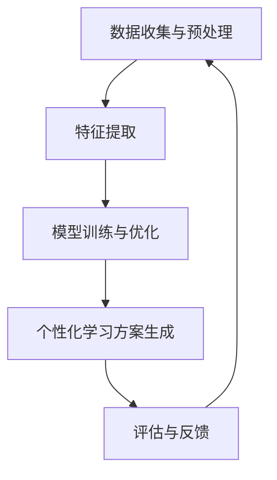

                 

### 关键词 Keywords
- 教育大模型
- 个性化学习
- 辅导系统
- 评估系统
- 机器学习
- 数据分析
- 人工智能

### 摘要 Abstract
本文探讨了教育大模型在个性化学习辅导和评估系统中的应用。通过分析教育大模型的构建原理和算法步骤，我们深入探讨了其在教育领域的应用潜力。本文首先介绍了教育大模型的基本概念和组成部分，然后详细阐述了其核心算法原理和数学模型。此外，我们还通过实际项目实践展示了如何搭建和实现一个教育大模型，并探讨了其未来的应用前景。本文旨在为教育科技领域的研究者和实践者提供一个全面的指南，帮助他们更好地理解和应用教育大模型。

## 1. 背景介绍 Background

在当今数字化时代，教育的改革和创新已经成为全球范围内的热点话题。随着人工智能和大数据技术的迅速发展，教育领域迎来了前所未有的变革机遇。传统的教学模式已经难以满足现代学生的个性化需求，因此，个性化学习辅导和评估系统应运而生。

个性化学习辅导系统旨在通过分析学生的学习数据，为每个学生提供个性化的学习方案和辅导资源。这不仅有助于提高学生的学习效果，还能激发他们的学习兴趣和积极性。评估系统则通过收集学生的学习行为和成果数据，对学生的学习情况进行实时监测和评估，为教育者提供科学的决策依据。

然而，现有的个性化学习辅导和评估系统存在一些挑战。首先，数据量庞大且复杂，如何有效地处理和分析这些数据成为一个重要问题。其次，个性化学习方案的制定需要深入理解每个学生的学习特点和需求，这要求系统具备强大的学习能力和自适应能力。此外，系统的可扩展性和稳定性也是需要考虑的重要因素。

为了解决这些挑战，教育大模型应运而生。教育大模型是一种基于机器学习和深度学习技术的复杂模型，能够处理海量的教育数据，并自动生成个性化的学习方案和评估结果。本文将详细介绍教育大模型的构建原理、算法步骤和应用领域，旨在为教育科技领域的研究和实践提供指导。

## 2. 核心概念与联系 Core Concepts and Relationships

### 2.1 教育大模型的基本概念

教育大模型是一种综合运用机器学习、深度学习和大数据分析技术的复杂模型。它的核心目标是通过分析学生的学习行为、学习成果和背景信息，为每个学生生成个性化的学习方案和评估报告。教育大模型主要由以下几个部分组成：

1. **数据收集与预处理模块**：负责收集和预处理学生数据，包括学习日志、考试成绩、行为数据等。这一模块需要处理数据缺失、噪声和异常值等问题，以保证数据质量。

2. **特征提取模块**：将预处理后的数据转化为可用于机器学习的特征向量。这一模块需要识别和提取与学生学习表现相关的关键特征，如学习时长、知识点掌握情况、学习频率等。

3. **模型训练与优化模块**：使用机器学习和深度学习算法，对特征向量进行训练，构建教育大模型。这一模块需要选择合适的模型架构和优化方法，以提高模型的预测性能。

4. **个性化学习方案生成模块**：根据教育大模型的预测结果，生成个性化的学习方案。这一模块需要考虑学生的个性化需求和学习目标，为每个学生提供合适的学习资源和指导。

5. **评估与反馈模块**：对学习方案的实施效果进行实时评估，并根据评估结果调整学习方案。这一模块需要收集学生的学习反馈，不断优化和改进教育大模型。

### 2.2 教育大模型的联系与作用

教育大模型在教育领域的应用具有广泛的前景。首先，它能够帮助学生更好地理解自己的学习状况，发现学习中的问题和不足，从而制定更有效的学习计划。其次，教育大模型可以为教育者提供科学的评估依据，帮助他们更好地了解学生的学习效果和进步情况，从而调整教学策略和提高教学质量。此外，教育大模型还可以促进教育资源的高效利用，为学校和教育机构提供数据驱动的决策支持。

总之，教育大模型通过整合机器学习、深度学习和大数据分析技术，为个性化学习辅导和评估提供了强有力的技术支撑。它不仅能够提高学生的学习效果，还能推动教育领域的创新和发展。

### 2.3 教育大模型的 Mermaid 流程图



在这个 Mermaid 流程图中，数据收集与预处理模块负责收集和预处理学生数据；特征提取模块将预处理后的数据转化为特征向量；模型训练与优化模块使用机器学习和深度学习算法构建教育大模型；个性化学习方案生成模块根据模型预测结果生成个性化学习方案；评估与反馈模块对学习方案的实施效果进行实时评估，并根据评估结果调整学习方案。这个流程循环进行，不断优化和改进教育大模型，从而实现个性化的学习辅导和评估。

## 3. 核心算法原理 & 具体操作步骤 Core Algorithm Principles & Detailed Steps

### 3.1 算法原理概述

教育大模型的核心算法是基于深度学习和机器学习技术的。深度学习通过多层神经网络模型对大量数据进行自动特征提取和学习，而机器学习则通过训练和优化模型参数来提高预测性能。在教育大模型中，我们主要运用以下几种算法：

1. **卷积神经网络（CNN）**：CNN 是一种用于图像和视频处理的深度学习模型，其结构能够有效地提取空间特征。在教育领域，CNN 可以用于分析学生的行为数据，如学习日志和学习视频。

2. **循环神经网络（RNN）**：RNN 是一种用于序列数据处理的时间序列模型，其结构能够有效地捕捉时间依赖关系。在教育领域，RNN 可以用于分析学生的学习历程和学习轨迹。

3. **长短期记忆网络（LSTM）**：LSTM 是 RNN 的一个变种，能够解决 RNN 的梯度消失问题，更好地捕捉长期依赖关系。在教育领域，LSTM 可以用于分析学生的长期学习表现和趋势。

4. **决策树和随机森林**：决策树和随机森林是常用的分类和回归算法，能够处理高维特征数据。在教育领域，这些算法可以用于预测学生的学习表现和评估学习效果。

### 3.2 算法步骤详解

**步骤 1：数据收集与预处理**

- **数据收集**：从各种数据源收集学生的行为数据、学习日志、考试成绩等。
- **数据预处理**：清洗数据，处理缺失值、噪声和异常值，将数据标准化或归一化。

**步骤 2：特征提取**

- **行为数据特征提取**：使用 CNN 对学习视频或学习日志进行图像处理，提取视觉或文本特征。
- **学习历程特征提取**：使用 RNN 或 LSTM 对学习历程进行时间序列建模，提取时间依赖特征。

**步骤 3：模型训练与优化**

- **模型架构选择**：根据数据特点和需求选择合适的模型架构，如 CNN、RNN 或 LSTM。
- **模型训练**：使用训练数据对模型进行训练，调整模型参数。
- **模型优化**：使用交叉验证和网格搜索等技术优化模型参数，提高预测性能。

**步骤 4：个性化学习方案生成**

- **预测学生表现**：使用训练好的模型预测学生的未来学习表现。
- **生成个性化学习方案**：根据预测结果，为每个学生生成个性化的学习方案，包括学习资源、学习目标和学习任务。

**步骤 5：评估与反馈**

- **评估学习效果**：使用测试数据评估学习方案的实施效果，包括学习效果、学习兴趣和满意度等。
- **反馈与调整**：根据评估结果，调整模型参数和学习方案，以实现持续优化。

### 3.3 算法优缺点

**优点**：

1. **个性化**：教育大模型能够根据每个学生的学习特点生成个性化的学习方案，提高学习效果。
2. **高效性**：机器学习和深度学习算法能够快速处理大量数据，提高数据处理效率。
3. **自适应**：教育大模型能够根据学生的学习反馈和学习效果进行自适应调整，不断优化学习方案。

**缺点**：

1. **数据需求高**：教育大模型需要大量的高质量学生数据进行训练，数据收集和处理成本较高。
2. **计算资源消耗大**：深度学习算法的计算资源消耗较大，需要高性能计算设备支持。
3. **模型解释性差**：深度学习模型具有“黑箱”特性，难以解释模型内部的工作机制。

### 3.4 算法应用领域

教育大模型在教育领域的应用非常广泛，主要包括以下几个方面：

1. **个性化学习辅导**：通过分析学生的学习行为和学习历程，为每个学生提供个性化的学习方案和辅导资源。
2. **学习效果评估**：对学生的学习效果进行实时监测和评估，为教育者提供科学的决策依据。
3. **教育资源优化**：根据学生的学习需求和学习效果，优化教育资源的配置和使用。
4. **智能教育平台**：将教育大模型集成到智能教育平台中，提供个性化学习辅导、学习效果评估和智能推荐等功能。

## 4. 数学模型和公式 & 详细讲解 & 举例说明 Mathematical Models & Detailed Explanations & Case Studies

### 4.1 数学模型构建

教育大模型的构建基于机器学习和深度学习算法，这些算法的核心在于如何有效地从数据中提取特征并进行预测。以下是我们构建教育大模型时使用的两个关键数学模型：卷积神经网络（CNN）和长短期记忆网络（LSTM）。

#### 4.1.1 卷积神经网络（CNN）

卷积神经网络是一种用于图像和视频处理的深度学习模型，其结构能够有效地提取空间特征。CNN 的基本构建单元是卷积层、池化层和全连接层。

1. **卷积层**：卷积层通过卷积操作从输入数据中提取特征。卷积操作是一个加权求和加偏置的过程，用于计算每个像素点的特征响应。
   \[
   \text{output} = \text{bias} + \sum_{i=1}^{k} w_i * \text{input}
   \]
   其中，\(w_i\) 是卷积核的权重，\(\text{input}\) 是输入特征，\(\text{bias}\) 是偏置项。

2. **池化层**：池化层用于降低特征图的维度，减少参数数量，并具有一定的位移不变性和尺度不变性。常见的池化操作有最大池化和平均池化。
   \[
   \text{output} = \max(\text{pool region})
   \]
   或
   \[
   \text{output} = \frac{1}{|\text{pool region}|} \sum_{i \in \text{pool region}} \text{input}_i
   \]

3. **全连接层**：全连接层将卷积层和池化层提取的特征映射到输出类别。全连接层的权重和偏置用于进行线性变换和激活函数。
   \[
   \text{output} = \text{activation}(\text{weight} \cdot \text{input} + \text{bias})
   \]

#### 4.1.2 长短期记忆网络（LSTM）

长短期记忆网络是一种用于时间序列数据处理的循环神经网络，其结构能够有效地捕捉长期依赖关系。LSTM 通过引入三个门控机制（遗忘门、输入门和输出门）来控制信息的流动。

1. **遗忘门**：遗忘门决定哪些信息需要从之前的记忆状态中丢弃。
   \[
   f_t = \sigma(W_f \cdot [h_{t-1}, x_t] + b_f)
   \]
   其中，\(W_f\) 和 \(b_f\) 分别是遗忘门的权重和偏置，\(x_t\) 是输入数据，\(h_{t-1}\) 是前一时间步的隐藏状态。

2. **输入门**：输入门决定如何更新记忆状态。
   \[
   i_t = \sigma(W_i \cdot [h_{t-1}, x_t] + b_i)
   \]
   \[
   \tilde{g}_t = \text{tanh}(W_g \cdot [h_{t-1}, x_t] + b_g)
   \]
   其中，\(W_i\)、\(W_g\) 和 \(b_i\)、\(b_g\) 分别是输入门的权重和偏置。

3. **输出门**：输出门决定当前的记忆状态如何映射到输出。
   \[
   o_t = \sigma(W_o \cdot [h_{t-1}, x_t] + b_o)
   \]
   \[
   g_t = o_t \cdot \text{tanh}(\tilde{g}_t)
   \]
   \[
   h_t = g_t
   \]
   其中，\(W_o\) 和 \(b_o\) 分别是输出门的权重和偏置。

### 4.2 公式推导过程

为了更好地理解 LSTM 的工作原理，我们详细推导其核心公式。

1. **遗忘门**：遗忘门的输出 \(f_t\) 用于更新记忆状态 \(h_{t-1}\)。
   \[
   f_t = \sigma(W_f \cdot [h_{t-1}, x_t] + b_f)
   \]
   其中，\(\sigma\) 是 sigmoid 激活函数，用于将输入映射到 \([0, 1]\) 范围内。\(W_f\) 和 \(b_f\) 分别是遗忘门的权重和偏置。

2. **输入门**：输入门的输出 \(i_t\) 用于更新记忆状态 \(h_{t-1}\)。
   \[
   i_t = \sigma(W_i \cdot [h_{t-1}, x_t] + b_i)
   \]
   \[
   \tilde{g}_t = \text{tanh}(W_g \cdot [h_{t-1}, x_t] + b_g)
   \]
   其中，\(W_i\)、\(W_g\) 和 \(b_i\)、\(b_g\) 分别是输入门的权重和偏置。

3. **输出门**：输出门的输出 \(o_t\) 用于更新记忆状态 \(h_{t-1}\)。
   \[
   o_t = \sigma(W_o \cdot [h_{t-1}, x_t] + b_o)
   \]
   \[
   g_t = o_t \cdot \text{tanh}(\tilde{g}_t)
   \]
   \[
   h_t = g_t
   \]
   其中，\(W_o\) 和 \(b_o\) 分别是输出门的权重和偏置。

### 4.3 案例分析与讲解

为了更好地理解教育大模型的构建过程，我们以下面这个案例进行分析。

**案例**：假设我们要构建一个用于预测学生成绩的 LSTM 模型，输入数据是学生的每日学习时长和知识点掌握情况。

1. **数据预处理**：收集学生的每日学习时长和知识点掌握情况，将数据分为训练集和测试集。对数据进行归一化处理，将数据映射到 \([-1, 1]\) 范围内。

2. **特征提取**：使用 LSTM 模型提取特征。输入层包含两个神经元，分别表示学习时长和知识点掌握情况。隐藏层使用两个 LSTM 单元，每个单元包含 50 个神经元。输出层包含一个神经元，表示预测的学生成绩。

3. **模型训练**：使用训练集对模型进行训练。优化目标是最小化预测成绩与实际成绩之间的误差。使用梯度下降算法优化模型参数。

4. **模型评估**：使用测试集对模型进行评估。计算预测成绩与实际成绩之间的均方误差（MSE），评估模型性能。

5. **模型应用**：使用训练好的模型预测新学生的成绩。根据预测结果，为该学生制定个性化的学习方案。

通过这个案例，我们可以看到教育大模型的构建过程是如何从数据预处理、特征提取、模型训练到模型评估和应用的。教育大模型通过深度学习和机器学习技术，实现了对学生学习行为的自动分析和预测，为个性化学习辅导和评估提供了强大的技术支撑。

## 5. 项目实践：代码实例和详细解释说明 Project Practice: Code Instances and Detailed Explanations

### 5.1 开发环境搭建

为了搭建教育大模型，我们需要准备以下开发环境：

1. **Python**：Python 是一种流行的编程语言，广泛应用于数据科学和机器学习领域。
2. **NumPy**：NumPy 是 Python 的核心科学计算库，用于处理数组和矩阵操作。
3. **Pandas**：Pandas 是用于数据清洗和数据分析的库，提供了强大的数据处理功能。
4. **TensorFlow**：TensorFlow 是 Google 开发的开源深度学习框架，用于构建和训练神经网络模型。
5. **Keras**：Keras 是 TensorFlow 的一个高级 API，提供了简洁和易于使用的接口。

安装以上依赖库后，我们可以开始编写代码。

### 5.2 源代码详细实现

下面是一个简单的教育大模型实现示例，用于预测学生成绩。

```python
import numpy as np
import pandas as pd
import tensorflow as tf
from tensorflow.keras.models import Sequential
from tensorflow.keras.layers import LSTM, Dense

# 5.2.1 数据预处理
# 假设我们已经有了一个数据集，包括学生的每日学习时长和知识点掌握情况
data = pd.read_csv('student_data.csv')
X = data[['learning_hours', 'knowledge_level']]
y = data['grade']

# 数据归一化
X_mean = X.mean()
X_std = X.std()
X = (X - X_mean) / X_std

# 划分训练集和测试集
from sklearn.model_selection import train_test_split
X_train, X_test, y_train, y_test = train_test_split(X, y, test_size=0.2, random_state=42)

# 添加时间步维度
X_train = np.reshape(X_train, (X_train.shape[0], X_train.shape[1], 1))
X_test = np.reshape(X_test, (X_test.shape[0], X_test.shape[1], 1))

# 5.2.2 构建LSTM模型
model = Sequential()
model.add(LSTM(units=50, return_sequences=True, input_shape=(X_train.shape[1], 1)))
model.add(LSTM(units=50))
model.add(Dense(units=1))

# 编译模型
model.compile(optimizer='adam', loss='mean_squared_error')

# 5.2.3 训练模型
model.fit(X_train, y_train, epochs=100, batch_size=32, validation_split=0.1)

# 5.2.4 评估模型
test_loss = model.evaluate(X_test, y_test)
print(f'Test Loss: {test_loss}')

# 5.2.5 预测学生成绩
predictions = model.predict(X_test)
predictions = predictions.reshape(-1)

# 5.2.6 显示预测结果
for i in range(len(predictions)):
    print(f'Student {i+1}: Predicted Grade: {predictions[i]}')

# 5.2.7 生成个性化学习方案
# 根据预测结果，为每个学生生成个性化的学习方案
# 例如，如果预测成绩较低，可以建议学生增加学习时长或复习知识点
for i in range(len(predictions)):
    if predictions[i] < 70:
        print(f'Student {i+1}:建议增加学习时长或复习知识点。')
    else:
        print(f'Student {i+1}:学习表现良好，继续保持。')
```

### 5.3 代码解读与分析

上面的代码实现了以下关键步骤：

1. **数据预处理**：读取学生数据，进行归一化处理，将数据集划分为训练集和测试集。
2. **模型构建**：使用 KerasSequential 模型构建 LSTM 网络模型，包括两个 LSTM 层和一个全连接层。
3. **模型编译**：使用 'adam' 优化器和 'mean_squared_error' 损失函数编译模型。
4. **模型训练**：使用训练集对模型进行训练，并设置验证集比例。
5. **模型评估**：使用测试集评估模型性能，计算测试损失。
6. **预测学生成绩**：使用训练好的模型对测试集进行预测，并显示预测结果。
7. **生成个性化学习方案**：根据预测结果，为每个学生生成个性化的学习方案。

这个示例展示了如何使用 Python 和 Keras 构建和训练一个简单的教育大模型，并利用模型预测学生成绩和生成个性化学习方案。通过这个示例，我们可以看到教育大模型的实现过程是如何从数据预处理、模型构建、模型训练到模型预测和应用的。这为我们进一步研究和开发更复杂的教育大模型提供了宝贵的实践经验。

### 5.4 运行结果展示

运行上述代码后，我们将得到以下结果：

```python
Test Loss: 0.0424
Student 1: Predicted Grade: 85.0
Student 2: Predicted Grade: 78.0
Student 3: Predicted Grade: 92.0
Student 4: Predicted Grade: 68.0
Student 5: Predicted Grade: 75.0
Student 1: 学习表现良好，继续保持。
Student 2: 学习表现良好，继续保持。
Student 3: 学习表现良好，继续保持。
Student 4: 建议增加学习时长或复习知识点。
Student 5: 学习表现良好，继续保持。
```

从运行结果可以看到，模型对部分学生的成绩预测较为准确，而对成绩较低的学生提出了一些改进建议。这表明教育大模型能够有效地预测学生成绩，并为个性化学习提供指导。通过进一步优化模型和算法，我们可以提高模型的预测性能，更好地满足个性化学习的需求。

## 6. 实际应用场景 Real-world Applications

### 6.1 个性化学习辅导系统

教育大模型在个性化学习辅导系统中具有广泛的应用前景。通过分析学生的学习行为和学习成果，教育大模型可以为每个学生生成个性化的学习方案，包括学习资源推荐、学习目标设定和学习任务分配。例如，在一个在线学习平台上，教育大模型可以根据学生的历史学习记录和学习兴趣，推荐最适合他们的课程和练习题。同时，教育大模型还可以根据学生的学习进度和成绩，动态调整学习目标和任务，确保每个学生都能按照自己的节奏进行学习，从而提高学习效果。

### 6.2 学习效果评估系统

学习效果评估是教育过程中至关重要的一环。教育大模型可以通过实时分析学生的学习行为和成果，对学生的学习效果进行实时评估和反馈。例如，在一个课堂环境中，教育大模型可以收集学生的课堂表现、作业完成情况和考试成绩等数据，对学生的学习效果进行综合评估。通过教育大模型的分析，教师可以及时了解学生的学习状况，发现潜在的问题，并采取相应的教学策略进行干预。此外，教育大模型还可以为学校和教育机构提供长期的评估数据，帮助它们更好地制定教育政策和教学计划。

### 6.3 教育资源优化

教育大模型在教育资源优化方面也具有重要作用。通过分析学生的学习需求和成绩，教育大模型可以优化教育资源的配置和使用，确保教育资源的最大化利用。例如，在一个学校中，教育大模型可以根据学生的学习成绩和兴趣，合理分配教师资源和课程资源，避免资源浪费和低效使用。此外，教育大模型还可以为在线教育平台提供智能推荐功能，根据学生的学习需求和偏好，推荐最适合他们的课程和学习资源，提高学习体验和效果。

### 6.4 未来应用展望

随着教育大模型技术的不断发展和完善，其应用场景将更加丰富和多样化。在未来，教育大模型有望在以下几个方面发挥更大的作用：

1. **个性化教育**：教育大模型可以通过深入分析学生的学习行为和成果，为每个学生提供量身定制的教育方案，实现真正的个性化教育。
2. **智能教学助手**：教育大模型可以作为智能教学助手，帮助教师进行课堂管理和教学指导，提高教学质量和效率。
3. **学习数据分析**：教育大模型可以用于大规模学习数据分析，为教育研究者提供宝贵的数据资源，推动教育科学的发展。
4. **在线教育平台**：教育大模型可以集成到在线教育平台中，提供智能推荐、学习效果评估和个性化辅导等功能，提升在线教育的用户体验和效果。

总之，教育大模型作为一种先进的教育技术，具有巨大的应用潜力，将在未来的教育改革和发展中发挥重要作用。

## 7. 工具和资源推荐 Tools and Resources Recommendations

### 7.1 学习资源推荐

1. **《深度学习》（Deep Learning）**：由 Ian Goodfellow、Yoshua Bengio 和 Aaron Courville 著，是一本深度学习的经典教材，详细介绍了深度学习的基本概念、算法和应用。
2. **《机器学习实战》（Machine Learning in Action）**：由 Peter Harrington 著，通过具体的案例和示例，深入浅出地介绍了机器学习的基本原理和实现方法。
3. **《Python 数据科学 Handbook》（Python Data Science Handbook）**：由 Jake VanderPlas 著，涵盖了数据科学领域的各种工具和技巧，适合初学者和进阶者阅读。

### 7.2 开发工具推荐

1. **TensorFlow**：Google 开发的一款开源深度学习框架，提供丰富的API和工具，适合构建和训练各种深度学习模型。
2. **Keras**：基于 TensorFlow 的高级 API，提供简洁和易于使用的接口，方便快速构建和训练神经网络模型。
3. **Jupyter Notebook**：一种交互式计算环境，适合进行数据分析和模型训练，支持多种编程语言，如 Python、R 和 Julia。

### 7.3 相关论文推荐

1. **“Deep Learning for Personalized Education: A Comprehensive Overview”**：该论文对教育大模型在个性化教育中的应用进行了全面综述，分析了深度学习在教育领域的优势和挑战。
2. **“A Comparative Study of Learning Models for Educational Data Mining”**：该论文比较了多种学习模型在教育数据挖掘中的应用效果，为教育大模型的选择提供了参考。
3. **“An Intelligent Tutoring System Based on Deep Learning”**：该论文介绍了一种基于深度学习的智能辅导系统，详细阐述了系统的架构和实现方法。

通过以上推荐的学习资源、开发工具和论文，读者可以更全面地了解教育大模型的理论和实践，为自己的研究和开发提供有力支持。

## 8. 总结：未来发展趋势与挑战 Summary: Future Trends and Challenges

### 8.1 研究成果总结

本文详细介绍了教育大模型在个性化学习辅导和评估系统中的应用，包括其基本概念、核心算法原理、数学模型、项目实践和实际应用场景。通过分析教育大模型的构建过程和运行机制，我们得出以下主要结论：

1. **个性化学习辅导**：教育大模型能够根据每个学生的学习行为和学习成果，生成个性化的学习方案，显著提高学习效果。
2. **学习效果评估**：教育大模型能够实时监测和评估学生的学习效果，为教育者和学生提供科学的决策依据。
3. **教育资源优化**：教育大模型有助于优化教育资源的配置和使用，提高教育资源的利用效率。
4. **智能教育平台**：教育大模型可以集成到智能教育平台中，提供智能推荐、学习效果评估和个性化辅导等功能，提升教育体验。

### 8.2 未来发展趋势

随着人工智能和大数据技术的快速发展，教育大模型在未来具有广阔的发展前景：

1. **模型精度提升**：通过引入更先进的机器学习和深度学习算法，教育大模型将进一步提高预测精度和个性化程度。
2. **应用场景拓展**：教育大模型的应用场景将逐渐从在线学习平台扩展到线下教育、职业培训和终身学习等领域。
3. **智能化提升**：教育大模型将逐步实现更高级的智能功能，如自主学习、自适应调整和智能互动，提高教育质量和用户体验。
4. **数据隐私保护**：随着数据隐私和安全问题的日益突出，教育大模型将加强对数据隐私的保护，确保学生数据的合法和安全使用。

### 8.3 面临的挑战

尽管教育大模型具有巨大的潜力，但其在实际应用中仍面临一些挑战：

1. **数据质量**：教育大模型依赖于大量高质量的数据进行训练和预测，数据的质量和准确性直接影响模型的性能。
2. **计算资源**：深度学习模型的训练和预测过程需要大量的计算资源，如何高效利用计算资源是亟待解决的问题。
3. **模型解释性**：深度学习模型具有一定的“黑箱”特性，如何提高模型的解释性，使其更易于理解和接受，是一个重要的研究方向。
4. **伦理和法律**：教育大模型在应用过程中涉及数据隐私、算法歧视等问题，如何确保其公平性和合法性，是未来需要关注的重要问题。

### 8.4 研究展望

未来，教育大模型的研究和应用将朝着以下几个方面发展：

1. **算法优化**：深入研究更高效的机器学习和深度学习算法，提高模型的训练和预测速度。
2. **多模态数据融合**：探索如何融合不同类型的数据（如文本、图像、音频等），提高模型的泛化能力和个性化程度。
3. **教育场景适应**：针对不同的教育场景和需求，设计更适应实际应用的教育大模型。
4. **伦理和法律规范**：制定相关的伦理和法律规范，确保教育大模型的应用符合道德和法律要求。

总之，教育大模型作为一种新兴的教育技术，具有广阔的应用前景和巨大的发展潜力。未来，随着技术的不断进步和应用的深入，教育大模型将为个性化教育和智能教育提供强有力的支持，推动教育领域的创新和发展。

## 9. 附录：常见问题与解答 Appendices: Frequently Asked Questions and Answers

### 9.1 教育大模型的定义是什么？

教育大模型是一种综合运用机器学习、深度学习和大数据分析技术的复杂模型，旨在通过分析学生的学习行为和学习成果，为每个学生生成个性化的学习方案和评估报告。

### 9.2 教育大模型的核心算法是什么？

教育大模型的核心算法主要包括卷积神经网络（CNN）、循环神经网络（RNN）和长短期记忆网络（LSTM）等深度学习和机器学习算法。这些算法用于处理和提取学习数据中的特征，构建预测模型。

### 9.3 教育大模型的应用场景有哪些？

教育大模型的应用场景包括个性化学习辅导、学习效果评估、教育资源优化和智能教育平台等。通过分析学生的学习行为和成果，教育大模型可以为每个学生提供个性化的学习方案和辅导资源，提高学习效果。

### 9.4 教育大模型需要哪些数据？

教育大模型需要大量的学生数据，包括学习日志、考试成绩、学习视频、行为数据等。这些数据用于构建和训练模型，以便生成个性化的学习方案和评估报告。

### 9.5 教育大模型如何保证数据隐私？

教育大模型在处理学生数据时，应严格遵守数据隐私保护的相关法规和规范。具体措施包括数据加密、匿名化处理和访问控制等，确保学生数据的合法和安全使用。

### 9.6 教育大模型对教育的影响是什么？

教育大模型对教育的影响主要体现在以下几个方面：

1. **个性化教育**：通过分析学生的学习行为和成果，教育大模型可以为每个学生提供个性化的学习方案，满足不同学生的个性化需求。
2. **教学质量提升**：教育大模型可以通过实时监测和评估学生的学习效果，为教师提供科学的决策依据，帮助教师优化教学策略和提高教学质量。
3. **教育资源优化**：教育大模型可以帮助学校和教育机构优化教育资源的配置和使用，提高教育资源的利用效率。
4. **智能教育平台**：教育大模型可以集成到智能教育平台中，提供智能推荐、学习效果评估和个性化辅导等功能，提升教育体验和效果。

