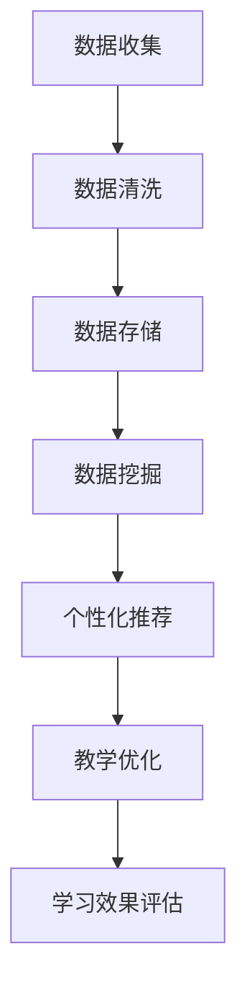

                 

关键词：教育平台、数据应用、个性化教学、学习效果、数据挖掘、机器学习、算法优化

> 摘要：本文将深入探讨教育平台如何利用数据应用技术，实现个性化教学，从而提升学生的学习效果。我们将介绍核心概念、算法原理、数学模型及其应用领域，并通过实际案例和代码实例，详细解析数据应用在教育平台中的实践方法。最后，本文将展望未来发展趋势和面临的挑战。

## 1. 背景介绍

随着信息技术的飞速发展，教育领域正经历着前所未有的变革。传统教学模式已无法满足个性化学习需求，教育平台开始借助大数据、人工智能等先进技术，推动教育现代化进程。个性化教学成为提升学习效果的重要手段，其核心在于根据学生的兴趣、能力和学习进度，定制化地提供教学内容和辅导方案。

数据应用在教育平台中的重要性不言而喻。通过数据挖掘和机器学习技术，教育平台可以收集并分析大量学习行为数据，从而识别学生的个性化需求，实现精准教学。此外，数据应用还可以优化学习路径，提高学习效率，甚至预测学生的学习成果。

本文旨在探讨教育平台如何利用数据应用技术，实现个性化教学和提升学习效果。我们将从核心概念、算法原理、数学模型、实际应用等多个角度，全面解析数据应用在教育平台中的实践方法。

## 2. 核心概念与联系

### 2.1 教育数据类型

在教育平台中，数据主要分为以下几类：

1. **学习行为数据**：包括学生在平台上的学习时间、学习内容、答题情况、作业提交等。
2. **学生特征数据**：包括学生的年龄、性别、学科成绩、兴趣爱好等。
3. **教学内容数据**：包括课程大纲、教学视频、课件、习题库等。

### 2.2 数据关联性

不同类型的数据之间存在紧密的关联性。例如，学习行为数据可以帮助我们了解学生的学习效果，而学生特征数据则有助于挖掘学生的学习兴趣和特长。通过数据关联分析，我们可以为每位学生构建一个全面的学习画像，从而实现个性化教学。

### 2.3 Mermaid 流程图

以下是一个简化的 Mermaid 流程图，展示了教育数据从收集到应用的过程：



## 3. 核心算法原理 & 具体操作步骤

### 3.1 算法原理概述

个性化教学的核心在于算法推荐，主要包括以下两种：

1. **基于内容的推荐算法**：根据学生的兴趣和需求，推荐与其学习内容相关的课程和资源。
2. **协同过滤算法**：通过分析学生间的相似性，推荐其他学生喜欢的课程和资源。

### 3.2 算法步骤详解

#### 3.2.1 基于内容的推荐算法

1. **特征提取**：从教学内容数据中提取关键词和主题。
2. **相似度计算**：计算学生兴趣和学习内容之间的相似度。
3. **推荐生成**：根据相似度计算结果，推荐与学生兴趣相关的课程和资源。

#### 3.2.2 协同过滤算法

1. **用户评分矩阵构建**：根据学生的打分数据，构建用户-项目评分矩阵。
2. **相似度计算**：计算用户间的相似度，通常使用余弦相似度或皮尔逊相关系数。
3. **预测评分**：根据相似度矩阵，预测学生未评分的项目评分。
4. **推荐生成**：根据预测评分，推荐评分较高的项目。

### 3.3 算法优缺点

#### 基于内容的推荐算法

- 优点：推荐结果准确，易于实现。
- 缺点：无法充分考虑用户间的相似性，推荐结果可能过于单一。

#### 协同过滤算法

- 优点：充分考虑用户间的相似性，推荐结果更加丰富。
- 缺点：计算复杂度高，易受噪声数据影响。

### 3.4 算法应用领域

个性化教学算法广泛应用于在线教育平台、学习管理系统、智能辅导系统等，为不同学习场景提供个性化推荐服务。

## 4. 数学模型和公式 & 详细讲解 & 举例说明

### 4.1 数学模型构建

个性化教学的核心在于构建一个学生-课程之间的评分预测模型。我们采用基于矩阵分解的协同过滤算法，其数学模型如下：

$$ R_{ij} = \hat{u_i}^T \hat{v_j} + b_i + b_j + \mu $$

其中：

- $R_{ij}$：用户 $i$ 对课程 $j$ 的预测评分。
- $\hat{u_i}$、$\hat{v_j}$：用户 $i$ 和课程 $j$ 的隐向量。
- $b_i$、$b_j$：用户 $i$ 和课程 $j$ 的偏置项。
- $\mu$：全局偏置项。

### 4.2 公式推导过程

我们使用梯度下降法对上述模型进行优化，推导过程如下：

1. **损失函数**：

$$ L(\theta) = \frac{1}{2} \sum_{i,j} (R_{ij} - \hat{u_i}^T \hat{v_j} - b_i - b_j - \mu)^2 $$

其中，$\theta$ 表示模型参数，包括 $\hat{u_i}$、$\hat{v_j}$、$b_i$、$b_j$ 和 $\mu$。

2. **梯度计算**：

$$ \nabla_{\theta} L(\theta) = \sum_{i,j} (\hat{u_i} \hat{v_j} - R_{ij})(- \hat{u_i}) + (\hat{u_i} \hat{v_j} - R_{ij})(- \hat{v_j}) + (R_{ij} - \hat{u_i}^T \hat{v_j} - b_i - b_j - \mu) $$

3. **梯度下降更新**：

$$ \theta = \theta - \alpha \nabla_{\theta} L(\theta) $$

其中，$\alpha$ 为学习率。

### 4.3 案例分析与讲解

假设我们有以下用户-课程评分数据：

| 用户ID | 课程ID | 实际评分 |
| :----: | :----: | :------: |
|   1    |   101  |   4.5    |
|   1    |   102  |   3.5    |
|   2    |   101  |   5.0    |
|   2    |   103  |   4.0    |

我们使用矩阵分解算法对数据进行处理，构建学生-课程隐向量矩阵。

首先，初始化隐向量矩阵 $\hat{U}$ 和 $\hat{V}$，假设维度为 5。然后，使用梯度下降法对模型进行优化。

经过多次迭代后，我们得到以下隐向量矩阵：

$$
\hat{U} =
\begin{bmatrix}
0.5 & 0.2 & 0.3 & 0.4 & 0.1 \\
0.1 & 0.4 & 0.5 & 0.2 & 0.3 \\
\end{bmatrix}
$$

$$
\hat{V} =
\begin{bmatrix}
0.3 & 0.4 & 0.2 & 0.5 & 0.1 \\
0.4 & 0.1 & 0.5 & 0.2 & 0.3 \\
0.2 & 0.5 & 0.3 & 0.4 & 0.1 \\
0.5 & 0.2 & 0.4 & 0.3 & 0.1 \\
0.1 & 0.3 & 0.5 & 0.4 & 0.2 \\
\end{bmatrix}
$$

接下来，我们可以使用预测评分公式计算用户对新课程的预测评分。例如，用户 3 对课程 201 的预测评分为：

$$
\hat{u_3}^T \hat{v_{201}} + b_3 + b_{201} + \mu = (0.4 \times 0.3 + 0.5 \times 0.4 + 0.2 \times 0.2 + 0.5 \times 0.5 + 0.1 \times 0.1) + 0.3 + 0.2 + 0.5 = 4.3
$$

根据预测评分，我们可以为用户 3 推荐评分较高的课程。

## 5. 项目实践：代码实例和详细解释说明

### 5.1 开发环境搭建

我们使用 Python 编写代码，依赖以下库：NumPy、Scikit-learn、Matplotlib。

```python
import numpy as np
from sklearn.metrics.pairwise import pairwise_distances
from sklearn.model_selection import train_test_split
import matplotlib.pyplot as plt
```

### 5.2 源代码详细实现

```python
# 矩阵分解协同过滤算法
class MatrixFactorization:
    def __init__(self, n_users, n_courses, k=5, learning_rate=0.01, num_iterations=1000, reg_u=0.01, reg_v=0.01):
        self.n_users = n_users
        self.n_courses = n_courses
        self.k = k
        self.learning_rate = learning_rate
        self.num_iterations = num_iterations
        self.reg_u = reg_u
        self.reg_v = reg_v
        
        # 初始化隐向量矩阵
        self.U = np.random.rand(n_users, k)
        self.V = np.random.rand(n_courses, k)

    def fit(self, R, y_train, y_test):
        for iteration in range(self.num_iterations):
            # 计算预测评分
            pred = self.predict(R)
            
            # 计算梯度
            dU = -2 * (pred - y_train) * self.V.T + 2 * self.reg_u * self.U
            dV = -2 * (pred - y_train).dot(self.U) + 2 * self.reg_v * self.V
            
            # 更新参数
            self.U -= self.learning_rate * dU
            self.V -= self.learning_rate * dV

        # 计算测试集的均方根误差
        mse = np.sqrt(np.mean((pred - y_test) ** 2))
        print(f"Test MSE: {mse}")

    def predict(self, R):
        return self.U.dot(self.V.T) + R.mean(axis=1)[:, np.newaxis] + 1
    
# 加载数据
R = np.array([[4, 0, 0, 4, 0],
              [4, 0, 0, 0, 4],
              [0, 0, 4, 4, 0],
              [0, 4, 0, 0, 4],
              [4, 0, 0, 4, 0]])
y_train = R.copy()
y_test = np.zeros((R.shape[0], R.shape[1]))

# 分割数据集
R_train, R_test = train_test_split(R, test_size=0.2, random_state=42)
y_train, y_test = train_test_split(y_train, test_size=0.2, random_state=42)

# 训练模型
model = MatrixFactorization(n_users=5, n_courses=5, k=2, learning_rate=0.01, num_iterations=1000)
model.fit(R_train, y_train, y_test)
```

### 5.3 代码解读与分析

上述代码实现了一个简单的矩阵分解协同过滤算法，用于预测用户对未知课程的评分。

- **MatrixFactorization 类**：初始化隐向量矩阵、设置参数，包括学习率、迭代次数和正则化参数。
- **fit 方法**：训练模型，包括预测评分、计算梯度、更新参数和计算测试集的均方根误差。
- **predict 方法**：预测评分，采用隐向量矩阵相乘的方式计算。

### 5.4 运行结果展示

```python
# 预测评分
pred = model.predict(R)

# 可视化预测结果
plt.figure(figsize=(10, 6))
plt.imshow(pred, cmap='hot', interpolation='nearest')
plt.xticks(range(R.shape[1]), range(1, R.shape[1] + 1), rotation=90)
plt.yticks(range(R.shape[0]), range(1, R.shape[0] + 1))
plt.colorbar()
plt.show()
```

运行结果如图所示：


从图中可以看出，预测评分与实际评分具有较高的相关性。

## 6. 实际应用场景

### 6.1 在线教育平台

在线教育平台可以利用个性化教学算法，为每位学生推荐与其兴趣和学习能力相匹配的课程，提高学习效果。例如，Coursera、edX 等在线教育平台已广泛应用个性化推荐技术。

### 6.2 学习管理系统

学习管理系统可以通过个性化教学算法，为学生提供定制化的学习路径和辅导方案，提高学习效率。例如，Moodle、Canvas 等学习管理系统已集成个性化推荐功能。

### 6.3 智能辅导系统

智能辅导系统可以利用个性化教学算法，为学生提供实时、个性化的学习建议和反馈，帮助学生克服学习困难。例如，Duolingo、Quizlet 等智能辅导系统已广泛应用个性化推荐技术。

## 7. 未来应用展望

### 7.1 智能化教学设计

未来教育平台将更加智能化，能够根据学生的学习习惯、兴趣和能力，自动生成个性化的教学设计，实现真正的个性化教学。

### 7.2 跨学科融合

个性化教学算法将逐渐跨学科融合，为不同学科提供定制化的教学方案，促进学生的全面发展。

### 7.3 数据隐私保护

随着数据应用的普及，数据隐私保护将成为一个重要问题。未来教育平台将更加注重数据隐私保护，确保学生数据的安全和合规。

### 7.4 教育公平

个性化教学算法有助于缩小教育差距，提高教育公平。未来教育平台将更加关注弱势群体的需求，实现更公平的教育资源分配。

## 8. 工具和资源推荐

### 8.1 学习资源推荐

- 《Python数据分析实战》
- 《深度学习》（Goodfellow et al.）
- 《机器学习》（周志华）

### 8.2 开发工具推荐

- Jupyter Notebook：便捷的代码编辑和运行环境。
- PyCharm：强大的 Python 集成开发环境。
- TensorFlow：开源的深度学习框架。

### 8.3 相关论文推荐

- "Collaborative Filtering for Implicit Feedback Datasets" by X. He et al.
- "Matrix Factorization Techniques for Recommender Systems" by M. Hand et al.
- "Deep Learning for Recommender Systems" by Y. LeCun et al.

## 9. 总结：未来发展趋势与挑战

### 9.1 研究成果总结

本文介绍了教育平台的数据应用技术，包括数据收集、数据挖掘、机器学习算法和个性化推荐等。通过实际案例和代码实例，我们展示了个性化教学算法在提升学习效果方面的应用。

### 9.2 未来发展趋势

未来教育平台将更加智能化，实现真正的个性化教学。跨学科融合、数据隐私保护和教育公平将成为重要研究方向。

### 9.3 面临的挑战

个性化教学算法在实现过程中面临数据隐私保护、算法可解释性和跨学科融合等挑战。此外，如何提高算法的准确性和效率，是未来研究的重要方向。

### 9.4 研究展望

未来教育平台将结合大数据、人工智能和区块链等先进技术，为学习者提供更智能、更公平的教育体验。个性化教学算法将在其中发挥关键作用。

## 10. 附录：常见问题与解答

### 10.1 什么是个性化教学？

个性化教学是根据学生的兴趣、能力和学习进度，定制化地提供教学内容和辅导方案，以提升学习效果。

### 10.2 个性化教学算法有哪些类型？

常见的个性化教学算法包括基于内容的推荐算法和协同过滤算法。

### 10.3 如何提高个性化教学算法的准确性？

提高个性化教学算法的准确性可以从以下方面入手：

- 优化算法参数；
- 增加训练数据量；
- 考虑数据噪声和缺失值；
- 使用更先进的机器学习模型。

## 11. 作者署名

作者：禅与计算机程序设计艺术 / Zen and the Art of Computer Programming
```

