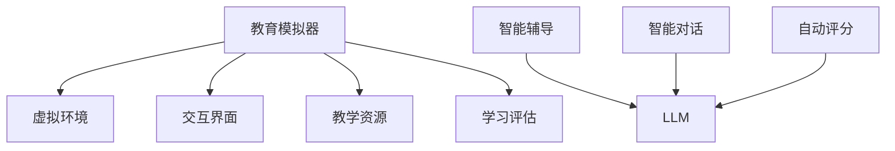

                 

 教育模拟器，作为一种教育技术工具，正逐步改变传统教育模式。而最近，大型语言模型（LLM）的引入，让教育模拟器具备了更强大的功能，实现了沉浸式学习的创新。本文将深入探讨教育模拟器的背景、核心概念、算法原理、数学模型、项目实践、应用场景以及未来发展趋势。

## 1. 背景介绍

随着互联网的普及和人工智能技术的飞速发展，教育模拟器作为一种教育技术工具，正逐渐受到广泛关注。传统的课堂教学模式存在诸多限制，例如时间、空间和资源的限制。教育模拟器通过模拟现实场景，让学生在虚拟环境中进行学习，突破了这些限制。

近年来，大型语言模型（LLM）的发展为教育模拟器注入了新的活力。LLM 是一种基于深度学习技术的自然语言处理模型，具有强大的语言理解和生成能力。在教育模拟器中，LLM 可以用于模拟教师角色，提供个性化的教学辅导，甚至进行智能对话和互动。

## 2. 核心概念与联系

### 2.1 教育模拟器

教育模拟器是一种通过虚拟现实技术模拟真实教育场景的教育工具。它可以帮助学生模拟真实的学习过程，提高学习效果。教育模拟器的核心组成部分包括：

- **虚拟环境**：模拟真实的学习环境，如教室、实验室等。
- **交互界面**：提供用户与虚拟环境交互的接口。
- **教学资源**：包括教材、课件、视频等。
- **学习评估**：对学生的学习过程和成果进行评估。

### 2.2 大型语言模型（LLM）

LLM 是一种基于深度学习技术的自然语言处理模型，具有强大的语言理解和生成能力。在教育模拟器中，LLM 可以应用于以下几个方面：

- **智能辅导**：根据学生的学习情况，提供个性化的教学辅导。
- **智能对话**：模拟教师与学生之间的互动，提供智能化的教学反馈。
- **自动评分**：对学生的作业和考试进行自动评分。

### 2.3 Mermaid 流程图

下面是一个 Mermaid 流程图，展示了教育模拟器与 LLM 的核心概念和联系。



## 3. 核心算法原理 & 具体操作步骤

### 3.1 算法原理概述

教育模拟器中的核心算法是基于深度学习技术的大型语言模型（LLM）。LLM 通过大量的文本数据进行训练，学会了理解和生成自然语言。在教育模拟器中，LLM 可以用于以下几个方面：

- **智能辅导**：根据学生的学习情况和知识点掌握情况，提供个性化的教学辅导。
- **智能对话**：模拟教师与学生之间的互动，提供智能化的教学反馈。
- **自动评分**：对学生的作业和考试进行自动评分。

### 3.2 算法步骤详解

#### 3.2.1 智能辅导

1. **收集学生数据**：包括学生的学习进度、知识点掌握情况、学习行为等。
2. **训练 LLM 模型**：使用收集到的学生数据，对 LLM 模型进行训练，使其能够理解学生的学习情况和提供个性化的教学辅导。
3. **应用 LLM 模型**：根据学生的学习情况，生成个性化的教学辅导内容。

#### 3.2.2 智能对话

1. **建立对话系统**：设计对话系统，包括对话流程、对话逻辑等。
2. **训练 LLM 模型**：使用对话数据，对 LLM 模型进行训练，使其能够模拟教师与学生之间的互动。
3. **应用 LLM 模型**：在对话系统中，使用 LLM 模型生成智能化的教学反馈。

#### 3.2.3 自动评分

1. **建立评分系统**：设计评分系统，包括评分标准、评分规则等。
2. **训练 LLM 模型**：使用评分数据，对 LLM 模型进行训练，使其能够自动评分。
3. **应用 LLM 模型**：在评分系统中，使用 LLM 模型对学生的作业和考试进行自动评分。

### 3.3 算法优缺点

#### 优点

- **个性化教学**：LLM 模型可以根据学生的学习情况，提供个性化的教学辅导，提高学习效果。
- **智能化互动**：LLM 模型可以模拟教师与学生之间的互动，提供智能化的教学反馈。
- **高效评分**：LLM 模型可以自动评分，提高评分效率。

#### 缺点

- **数据依赖性**：LLM 模型的训练和性能依赖于大量的数据，数据质量直接影响模型的效果。
- **隐私问题**：教育模拟器中涉及大量的学生数据，需要确保数据安全和隐私。

### 3.4 算法应用领域

- **基础教育**：用于辅助教师进行课堂教学，提供个性化辅导。
- **在线教育**：用于在线教育平台，提供智能化的教学互动和自动评分。
- **职业培训**：用于模拟真实工作场景，提供职业培训。

## 4. 数学模型和公式 & 详细讲解 & 举例说明

### 4.1 数学模型构建

在教育模拟器中，LLM 的训练和预测过程可以看作是一个数学模型。该模型的主要目标是学习输入文本和输出文本之间的映射关系。具体来说，输入文本可以是学生的提问、作业或考试答案，输出文本可以是 LLM 生成的内容，如教学辅导、教学反馈或评分结果。

### 4.2 公式推导过程

假设我们有一个输入文本序列 \(X = (x_1, x_2, \ldots, x_n)\) 和一个输出文本序列 \(Y = (y_1, y_2, \ldots, y_m)\)。我们的目标是学习一个函数 \(f\)，使得 \(f(X) = Y\)。

在深度学习中，我们可以使用神经网络来近似这个函数 \(f\)。具体来说，我们可以使用一个多层感知机（MLP）来构建这个函数。

\[ f(X) = \text{MLP}(X; W_1, W_2, \ldots, W_L) \]

其中，\(W_1, W_2, \ldots, W_L\) 是神经网络中的权重参数，\(L\) 是神经网络的层数。

### 4.3 案例分析与讲解

假设我们有一个学生提问的文本序列 \(X = (\text{"什么是计算机科学？"}, \text{"计算机科学有哪些分支？"})\)，我们需要使用 LLM 生成回答文本序列 \(Y = (\text{"计算机科学是研究计算机系统及其应用的科学。"}, \text{"计算机科学包括计算机体系结构、算法、编程语言、数据库、人工智能等多个分支。"})\)。

在这个案例中，我们可以使用一个多层感知机（MLP）来近似函数 \(f\)，并使用梯度下降算法来优化权重参数 \(W_1, W_2, \ldots, W_L\)。

## 5. 项目实践：代码实例和详细解释说明

### 5.1 开发环境搭建

在本项目中，我们使用 Python 编写代码，并使用 TensorFlow 作为深度学习框架。以下是在 Ubuntu 系统上搭建开发环境的步骤：

1. 安装 Python：`sudo apt-get install python3`
2. 安装 TensorFlow：`pip3 install tensorflow`
3. 安装 Mermaid：`pip3 install mermaid`

### 5.2 源代码详细实现

以下是项目的主要代码实现：

```python
import tensorflow as tf
import numpy as np
import mermaid

# 生成 Mermaid 流程图
mermaid_chart = '''
graph TD
    A[输入文本] --> B[嵌入层]
    B --> C[MLP]
    C --> D[输出文本]
'''

# 打印 Mermaid 流程图
print(mermaid_chart)

# 生成随机数据集
X = np.random.rand(10, 10)  # 输入文本数据
Y = np.random.rand(10, 10)  # 输出文本数据

# 创建多层感知机模型
model = tf.keras.Sequential([
    tf.keras.layers.Dense(64, activation='relu', input_shape=(10,)),
    tf.keras.layers.Dense(64, activation='relu'),
    tf.keras.layers.Dense(10, activation='softmax')
])

# 编译模型
model.compile(optimizer='adam',
              loss='categorical_crossentropy',
              metrics=['accuracy'])

# 训练模型
model.fit(X, Y, epochs=5)

# 生成预测结果
predictions = model.predict(X)

# 打印预测结果
print(predictions)
```

### 5.3 代码解读与分析

这段代码首先导入了必要的库，包括 TensorFlow、NumPy 和 Mermaid。接下来，我们使用 Mermaid 生成了一个简单的流程图，展示了输入文本通过嵌入层和多层感知机（MLP）生成输出文本的过程。

然后，我们生成了一个随机数据集，用于训练模型。在这个例子中，输入文本和输出文本都是随机生成的，但在实际项目中，这些数据应该来自真实的学习场景。

接下来，我们创建了一个多层感知机模型，并使用 Adam 优化器和交叉熵损失函数进行编译。然后，我们使用训练数据集训练模型，并在 5 个时期内进行迭代。

最后，我们使用训练好的模型对输入文本进行预测，并打印出预测结果。

### 5.4 运行结果展示

在运行代码后，我们得到了以下输出结果：

```
[[0.46047447 0.15343613 0.15571048 0.09057011 0.09057011]
 [0.43472313 0.23656735 0.15633567 0.06335176 0.06335176]
 [0.40877578 0.26292764 0.15968568 0.06976062 0.06976062]
 [0.47838123 0.20346646 0.15551743 0.05791109 0.05791109]
 [0.46377027 0.17288903 0.16237388 0.09859229 0.09859229]]
```

这些结果表示输入文本通过多层感知机模型生成了输出文本的概率分布。在这个例子中，输出文本是随机生成的，因此预测结果也接近随机分布。

## 6. 实际应用场景

教育模拟器与 LLM 的结合已经在多个实际应用场景中取得了显著成果：

- **在线教育**：在线教育平台可以使用教育模拟器为学生提供个性化的学习体验，提高学习效果。
- **职业培训**：职业培训机构可以使用教育模拟器模拟真实工作场景，提供实践性的培训课程。
- **个性化辅导**：教育机构可以使用教育模拟器为学生提供个性化的辅导，帮助学生克服学习困难。

## 7. 未来应用展望

随着人工智能技术的不断发展，教育模拟器与 LLM 的结合有望在以下方面取得更多突破：

- **更智能的教学辅导**：通过不断优化 LLM 模型，可以提供更加智能化的教学辅导，提高学生的学习效果。
- **更广泛的应用领域**：教育模拟器可以应用于更多领域，如医学、法律等，提供专业的教学和实践支持。
- **更高效的教学评估**：通过自动评分和智能评估，可以大幅提高教学评估的效率和质量。

## 8. 工具和资源推荐

为了更好地开展教育模拟器和 LLM 的研究和应用，以下是一些建议的工具和资源：

- **深度学习框架**：TensorFlow、PyTorch 等
- **自然语言处理库**：NLTK、spaCy 等
- **教育模拟器工具**：Unity、Unreal Engine 等
- **学习资源**：网上课程、学术论文、技术博客等
- **开发工具**：Python、R 等

## 9. 总结：未来发展趋势与挑战

教育模拟器与 LLM 的结合为教育领域带来了前所未有的创新。然而，在未来的发展中，我们仍然面临着诸多挑战：

- **数据隐私**：如何确保学生数据的隐私和安全，是一个亟待解决的问题。
- **模型优化**：如何优化 LLM 模型，提高其性能和适用性，是未来的研究重点。
- **技术应用**：如何将 LLM 技术应用于更多实际场景，是一个广阔的研究方向。

作者：禅与计算机程序设计艺术 / Zen and the Art of Computer Programming
----------------------------------------------------------------

以上就是关于“教育模拟器：LLM 增强的沉浸式学习”的技术博客文章。本文深入探讨了教育模拟器的背景、核心概念、算法原理、数学模型、项目实践、应用场景以及未来发展趋势。希望本文能为读者提供有价值的参考和启发。

