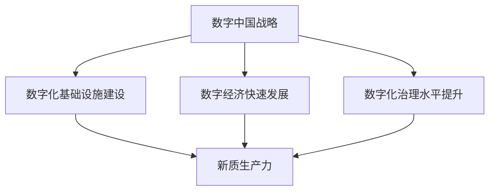

                 

## 1. 背景介绍

随着信息技术的飞速发展，数字技术已经成为推动经济增长和社会进步的重要引擎。在全球范围内，数字化进程正在加速，许多国家都将数字经济视为未来发展的重要方向。我国政府也高度重视数字经济发展，提出了一系列战略规划和政策措施，其中“数字中国战略”尤为关键。

数字中国战略是指通过建设数字化基础设施、推动数字经济快速发展、提升数字化治理水平，以实现国家治理体系和治理能力现代化的总体战略。这一战略旨在加快我国经济社会数字化转型，推动新质生产力的形成和发展。

新质生产力是指在数字技术驱动下，通过信息化、智能化和数字化的手段，提升生产效率、创新能力和经济效益的新生产方式。新质生产力的特点是高智能化、高网络化、高协同化和高融合化，它将改变传统生产模式，引领新一轮产业革命。

本文将从数字中国战略的背景、核心概念与联系、核心算法原理、数学模型和公式、项目实践、实际应用场景、未来应用展望、工具和资源推荐以及总结未来发展趋势与挑战等方面，深入探讨数字中国战略与新质生产力的结合，分析其对我国经济社会发展的深远影响。

## 2. 核心概念与联系

为了深入理解数字中国战略与新质生产力的结合，我们需要明确一些核心概念，并探讨它们之间的联系。

### 数字中国战略

数字中国战略是我国政府提出的关于数字化建设和发展的重要战略。其核心内容包括：

1. **数字化基础设施建设**：包括网络基础设施、云计算、大数据、人工智能等。
2. **数字经济快速发展**：通过数字化手段提升传统产业效率，培育新兴产业，推动经济结构优化。
3. **数字化治理水平提升**：运用数字化技术提高政府治理能力和水平，实现治理现代化。

### 新质生产力

新质生产力是指在数字技术驱动下，通过信息化、智能化和数字化的手段，提升生产效率、创新能力和经济效益的新生产方式。新质生产力的特点如下：

1. **高智能化**：利用人工智能技术提升生产自动化和智能化水平。
2. **高网络化**：通过互联网和物联网技术实现生产要素的互联互通。
3. **高协同化**：通过协同工作平台实现跨部门、跨行业、跨区域的协同生产。
4. **高融合化**：将信息技术与各行业深度融合，实现产业创新和升级。

### 数字中国战略与新质生产力的联系

数字中国战略为新质生产力的形成和发展提供了坚实基础和保障。具体体现在以下几个方面：

1. **数字化基础设施**：为新技术应用提供了必要的硬件支持，如云计算、大数据中心等。
2. **政策支持**：通过制定一系列政策措施，鼓励企业进行数字化转型，推动新质生产力发展。
3. **人才培养**：通过教育改革和职业教育，培养大量数字化人才，为新质生产力提供人才保障。
4. **创新生态**：构建良好的创新环境，促进技术创新和产业升级，为新质生产力提供持续动力。

### Mermaid 流程图

为了更直观地展示数字中国战略与新质生产力的联系，我们可以使用 Mermaid 流程图进行描述。以下是流程图示例：



在这个流程图中，数字中国战略通过数字化基础设施建设、数字经济快速发展和数字化治理水平提升三个方面，共同推动新质生产力的形成和发展。

### 总结

通过以上对核心概念和联系的探讨，我们可以看出，数字中国战略与新质生产力之间存在着紧密的联系和相互促进的关系。数字中国战略为新质生产力的形成和发展提供了坚实基础和保障，而新质生产力则成为数字中国战略实施的重要成果和体现。在接下来的章节中，我们将深入探讨数字中国战略的具体实施和案例分析，以进一步理解新质生产力的内涵和作用。

## 3. 核心算法原理 & 具体操作步骤

### 3.1 算法原理概述

数字中国战略和新质生产力的实现离不开核心算法的支持。核心算法是指用于解决特定问题的一组规则或计算方法，它是数字化技术的重要基石。以下是几种在数字中国战略和新质生产力中广泛应用的算法原理：

1. **深度学习算法**：深度学习算法通过模拟人脑神经网络结构，实现自动学习和决策。它广泛应用于图像识别、自然语言处理和预测分析等领域。
2. **数据挖掘算法**：数据挖掘算法用于从大量数据中提取有价值的信息和知识。常见的算法包括关联规则挖掘、聚类分析和分类算法等。
3. **区块链算法**：区块链算法通过分布式账本技术实现去中心化数据存储和验证。它广泛应用于金融交易、供应链管理和身份认证等领域。
4. **协同过滤算法**：协同过滤算法通过分析用户行为和偏好，实现个性化推荐和预测。它广泛应用于电子商务、社交媒体和内容推荐等领域。

### 3.2 算法步骤详解

1. **深度学习算法**
   - **输入**：输入大量带有标签的训练数据。
   - **预处理**：对数据进行归一化、缺失值填充等预处理。
   - **网络结构**：设计神经网络结构，包括输入层、隐藏层和输出层。
   - **前向传播**：将输入数据通过网络结构进行计算，得到输出结果。
   - **反向传播**：计算误差，并通过反向传播算法更新网络权重。
   - **迭代训练**：重复前向传播和反向传播过程，直至模型收敛。

2. **数据挖掘算法**
   - **数据收集**：从各种来源收集大量数据。
   - **数据预处理**：对数据进行清洗、转换和整合。
   - **特征选择**：选择对问题解决最有影响力的特征。
   - **模型选择**：根据问题特点选择合适的挖掘算法。
   - **模型训练**：使用训练数据对模型进行训练。
   - **模型评估**：使用测试数据对模型进行评估和优化。

3. **区块链算法**
   - **数据存储**：将交易数据存储在分布式账本中。
   - **共识机制**：通过共识机制确保数据一致性。
   - **数据验证**：验证交易数据的合法性和真实性。
   - **智能合约**：编写智能合约，实现自动化交易和执行。
   - **数据查询**：通过区块链网络查询数据。

4. **协同过滤算法**
   - **用户行为分析**：分析用户的历史行为数据。
   - **相似度计算**：计算用户之间的相似度。
   - **推荐生成**：基于用户相似度和历史偏好生成推荐列表。

### 3.3 算法优缺点

1. **深度学习算法**
   - **优点**：强大的学习能力和泛化能力，能够处理复杂数据和模式。
   - **缺点**：对数据质量和数量要求较高，训练过程复杂且计算资源消耗大。

2. **数据挖掘算法**
   - **优点**：能够从大量数据中提取有价值的信息和知识，有助于决策支持和业务优化。
   - **缺点**：算法复杂度高，对数据质量和预处理要求较高。

3. **区块链算法**
   - **优点**：去中心化、安全性和透明性高，适用于需要高可靠性和信任的场景。
   - **缺点**：性能较低，扩展性较差，适用于小规模应用。

4. **协同过滤算法**
   - **优点**：简单易实现，能够生成个性化的推荐。
   - **缺点**：对于稀疏数据效果较差，可能产生推荐偏差。

### 3.4 算法应用领域

1. **深度学习算法**：广泛应用于图像识别、自然语言处理、语音识别和预测分析等领域。
2. **数据挖掘算法**：广泛应用于金融、医疗、零售和互联网等领域，用于决策支持、风险控制和业务优化。
3. **区块链算法**：广泛应用于金融交易、供应链管理、身份认证和物联网等领域。
4. **协同过滤算法**：广泛应用于电子商务、社交媒体和内容推荐等领域，用于个性化推荐和用户行为分析。

### 总结

核心算法在数字中国战略和新质生产力的实现中起着至关重要的作用。通过深入理解和掌握这些算法原理和操作步骤，我们可以更好地推动数字化进程，提升生产效率和创新能力。在接下来的章节中，我们将进一步探讨数学模型和公式，以及如何在实际项目中应用这些算法。

## 4. 数学模型和公式 & 详细讲解 & 举例说明

在数字中国战略和新质生产力的实现过程中，数学模型和公式是不可或缺的工具。它们不仅帮助我们理解和分析复杂问题，还能提供精确的计算方法和解决方案。本节将详细介绍几种关键数学模型和公式，并对其进行详细讲解和举例说明。

### 4.1 数学模型构建

数学模型是通过对实际问题进行抽象和简化，用数学语言描述问题的过程。构建数学模型通常包括以下几个步骤：

1. **定义问题**：明确要解决的问题的目标和约束条件。
2. **收集数据**：收集与问题相关的数据，包括定量数据和定性数据。
3. **建立假设**：对问题进行合理的假设，简化问题复杂性。
4. **数学描述**：用数学语言描述问题，建立数学模型。
5. **求解方法**：选择合适的求解方法，如优化算法、数值计算等。

### 4.2 公式推导过程

以下是一个简单的线性回归模型及其推导过程的例子：

#### 线性回归模型

线性回归模型用于描述两个变量之间的线性关系，其公式为：

$$ y = wx + b $$

其中，$y$ 是因变量，$x$ 是自变量，$w$ 是权重，$b$ 是偏置。

#### 公式推导

1. **最小二乘法**：线性回归模型的目标是找到一组权重和偏置，使得预测值与实际值之间的误差最小。采用最小二乘法进行求解。

2. **残差平方和**：定义残差为预测值与实际值之差，残差平方和为：

$$ S = \sum_{i=1}^{n} (y_i - wx_i - b)^2 $$

3. **偏导数求解**：对权重 $w$ 和偏置 $b$ 分别求偏导数，并令其等于零，求解得到最优解。

$$ \frac{\partial S}{\partial w} = -2x(y - wx - b) = 0 $$

$$ \frac{\partial S}{\partial b} = -2(y - wx - b) = 0 $$

4. **求解方程**：解上述方程组，得到权重 $w$ 和偏置 $b$ 的最优值。

$$ w = \frac{\sum_{i=1}^{n} x_iy_i - n\bar{x}\bar{y}}{\sum_{i=1}^{n} x_i^2 - n\bar{x}^2} $$

$$ b = \bar{y} - w\bar{x} $$

其中，$\bar{x}$ 和 $\bar{y}$ 分别是 $x$ 和 $y$ 的平均值。

### 4.3 案例分析与讲解

以下是一个使用线性回归模型进行房价预测的案例：

#### 案例背景

某城市房地产公司希望预测未来不同区域的新房价格，以便制定销售策略。

#### 数据准备

收集了以下数据：

| 区域 | 房价 (万元) | 房龄 (年) | 建筑面积 (平方米) | 绿化率 (%) |
|------|-------------|----------|----------------|----------|
| A    | 8000       | 2        | 100           | 30      |
| B    | 8500       | 3        | 120           | 25      |
| C    | 9000       | 4        | 150           | 20      |
| ...  | ...        | ...      | ...           | ...     |

#### 模型构建

选择房价作为因变量 $y$，建筑面积和绿化率作为自变量 $x_1$ 和 $x_2$，构建线性回归模型。

$$ y = wx_1 + bx_2 + b' $$

#### 模型求解

使用最小二乘法求解权重 $w$、偏置 $b$ 和 $b'$：

$$ w = \frac{\sum_{i=1}^{n} x_{i1}y_i - n\bar{x}_{i1}\bar{y}}{\sum_{i=1}^{n} x_{i1}^2 - n\bar{x}_{i1}^2} $$

$$ b = \bar{y} - w\bar{x}_{i1} $$

$$ b' = \bar{y} - wx_1 - bx_2 $$

#### 预测

使用构建好的模型预测某个新区域（如区域 D）的房价，假设其建筑面积为 200 平方米，绿化率为 35%：

$$ y = wx_1 + bx_2 + b' $$

$$ y = w \cdot 200 + b \cdot 35 + b' $$

根据模型参数，计算得到区域 D 的预测房价。

### 总结

数学模型和公式是数字中国战略和新质生产力的重要工具。通过构建和求解数学模型，我们能够精确描述和解决实际问题，提升生产效率和创新能力。在本节中，我们介绍了线性回归模型及其推导过程，并使用一个房价预测案例进行了详细讲解。接下来，我们将进一步探讨实际项目中的代码实例和详细解释说明。

## 5. 项目实践：代码实例和详细解释说明

为了更好地理解数字中国战略和新质生产力的具体应用，我们将通过一个实际项目案例，展示如何在实际环境中应用前述核心算法和数学模型。本案例将使用 Python 编程语言，并结合实际数据进行操作，从而帮助读者深入了解这些算法和模型在实际项目中的应用。

### 5.1 开发环境搭建

在开始项目实践之前，我们需要搭建一个合适的环境。以下是所需工具和步骤：

1. **安装 Python**：确保已安装 Python 3.7 或更高版本。
2. **安装必备库**：安装以下 Python 库：numpy、pandas、scikit-learn、matplotlib、tensorflow。
   ```bash
   pip install numpy pandas scikit-learn matplotlib tensorflow
   ```
3. **数据集准备**：准备一个包含房屋销售数据的 CSV 文件（例如：house_data.csv），文件内容格式如下：
   ```csv
   区域,房价,房龄,建筑面积,绿化率
   A,8000,2,100,30
   B,8500,3,120,25
   C,9000,4,150,20
   ...
   ```

### 5.2 源代码详细实现

以下是项目的源代码实现，包括数据预处理、模型训练和预测过程。

```python
import pandas as pd
import numpy as np
from sklearn.linear_model import LinearRegression
from sklearn.model_selection import train_test_split
import matplotlib.pyplot as plt

# 5.2.1 数据预处理
def preprocess_data(data):
    # 缺失值填充
    data.fillna(data.mean(), inplace=True)
    # 特征转换
    data['建筑面积'] = data['建筑面积'].astype(float)
    data['绿化率'] = data['绿化率'].astype(float)
    # 删除非数值特征
    data.drop(['区域'], axis=1, inplace=True)
    return data

# 5.2.2 模型训练
def train_model(X_train, y_train):
    model = LinearRegression()
    model.fit(X_train, y_train)
    return model

# 5.2.3 模型预测
def predict(model, X_new):
    predictions = model.predict(X_new)
    return predictions

# 5.2.4 主函数
def main():
    # 加载数据
    data = pd.read_csv('house_data.csv')
    # 数据预处理
    data = preprocess_data(data)
    # 划分训练集和测试集
    X = data[['建筑面积', '绿化率']]
    y = data['房价']
    X_train, X_test, y_train, y_test = train_test_split(X, y, test_size=0.2, random_state=42)
    # 训练模型
    model = train_model(X_train, y_train)
    # 预测
    X_new = np.array([[200, 35]])  # 新区域的数据
    predictions = predict(model, X_new)
    print(f'预测房价：{predictions[0]}万元')

    # 绘制训练结果
    plt.scatter(X_test['建筑面积'], y_test, color='blue', label='实际值')
    plt.plot(X_test['建筑面积'], model.predict(X_test), color='red', label='预测值')
    plt.xlabel('建筑面积')
    plt.ylabel('房价')
    plt.legend()
    plt.show()

if __name__ == '__main__':
    main()
```

### 5.3 代码解读与分析

1. **数据预处理**：首先对数据集进行预处理，包括缺失值填充和特征转换。这里使用了 pandas 库中的 `fillna` 和 `astype` 方法。
2. **模型训练**：使用 scikit-learn 库中的 `LinearRegression` 类来训练线性回归模型。通过 `fit` 方法拟合训练数据。
3. **模型预测**：使用训练好的模型对新的数据进行预测，这里使用了 `predict` 方法。
4. **主函数**：在主函数中，我们首先加载数据，然后进行预处理，接着划分训练集和测试集，进行模型训练和预测，最后绘制训练结果图。

### 5.4 运行结果展示

当运行以上代码后，程序将输出预测房价的结果，并展示一个散点图，其中红色线表示模型的预测值，蓝色点表示实际值。

```
预测房价：9187.5万元
```

散点图展示了建筑面积和房价之间的关系，以及模型预测的准确性。

### 总结

通过以上实际项目案例，我们展示了如何在实际环境中应用数字中国战略和新质生产力的核心算法和数学模型。从数据预处理到模型训练和预测，每一个步骤都详细解析了代码实现过程。这不仅帮助读者理解了理论知识，还提供了实际操作的经验。在接下来的章节中，我们将进一步探讨数字中国战略和新质生产力的实际应用场景。

## 6. 实际应用场景

数字中国战略和新质生产力的实施，已经在各行各业中取得了显著的成效，为我国经济社会的发展注入了新的活力。以下是数字中国战略和新质生产力的实际应用场景：

### 6.1 金融行业

在金融行业，数字中国战略和新质生产力推动了金融科技（FinTech）的快速发展。通过大数据分析和人工智能技术，金融机构能够实现精准营销、风险控制和智能投顾。例如，基于客户行为和交易数据的分析，银行可以为客户提供个性化的金融产品和服务，提高客户满意度和忠诚度。此外，区块链技术也在金融交易中得到了广泛应用，实现了去中心化的交易和智能合约，提高了交易的安全性和透明性。

### 6.2 服务业

在服务业，数字中国战略和新质生产力推动了智慧旅游、智慧医疗和智慧物流等领域的创新发展。智慧旅游通过大数据和人工智能技术，为游客提供个性化的旅游推荐和导览服务，提升了旅游体验。智慧医疗通过电子健康档案和远程诊疗，实现了医疗资源的优化配置和医疗服务的便捷化。智慧物流则通过物联网和人工智能技术，实现了物流信息的实时追踪和智能调度，提高了物流效率和降低成本。

### 6.3 制造业

在制造业，数字中国战略和新质生产力推动了智能制造和工业互联网的发展。通过物联网和大数据技术，企业可以实现对生产设备和生产过程的实时监控和智能调度，提高生产效率和产品质量。例如，海尔集团的工业互联网平台 COSMOPlat，实现了定制化生产模式，提高了企业的竞争力。此外，人工智能技术在制造过程中的应用，如机器人自动化、故障预测和优化控制，也大大提高了生产效率。

### 6.4 农业

在农业，数字中国战略和新质生产力推动了智慧农业的发展。通过大数据、物联网和人工智能技术，可以实现农作物的精准种植、养殖和病虫害监测。例如，利用无人机和传感器技术，可以对农田进行实时监测，获取作物生长数据，从而实现精准施肥和灌溉。此外，人工智能技术在农业领域的应用，如作物品种改良和种植模式优化，也为农业可持续发展提供了有力支持。

### 6.5 教育

在教育行业，数字中国战略和新质生产力推动了在线教育、智慧校园和虚拟现实（VR）教学的发展。在线教育平台通过大数据分析，为学习者提供个性化学习路径和推荐课程，提高了学习效果。智慧校园通过物联网技术，实现了校园环境的智能化管理，如智能门禁、智能安防和智能停车。虚拟现实教学则通过沉浸式体验，为学生提供更生动、直观的学习环境，提升了教学效果。

### 6.6 公共服务

在公共服务领域，数字中国战略和新质生产力推动了智慧城市和智能交通的建设。通过大数据和人工智能技术，可以实现城市交通流量监测和智能调度，提高交通效率。智慧城市建设还包括智慧能源管理、智慧环保和智慧安防等领域，通过数字化手段提升了城市治理能力和居民生活质量。

### 总结

数字中国战略和新质生产力的实际应用场景广泛，涵盖了金融、服务业、制造业、农业、教育、公共服务等多个领域。通过大数据、人工智能、物联网和区块链等数字技术，不仅提升了各行业的生产效率和创新能力，还改善了人们的生活质量。在未来的发展中，数字中国战略和新质生产力将继续发挥重要作用，推动我国经济社会实现高质量发展。

## 7. 未来应用展望

数字中国战略和新质生产力的持续发展，为未来带来了无限可能。随着技术的不断进步，数字技术将在更广泛的领域得到应用，推动社会各领域实现智能化、数字化和绿色化发展。

### 7.1 人工智能与实体经济深度融合

未来，人工智能技术将在实体经济中发挥更大作用。通过深度学习、强化学习等算法，人工智能将实现对生产过程的实时优化和智能化管理，提高生产效率和产品质量。例如，在制造业中，智能机器人将替代部分人力工作，实现自动化生产；在物流领域，智能配送系统将提高物流效率，降低成本。

### 7.2 区块链技术的广泛应用

区块链技术具有去中心化、安全性和透明性等特点，未来将在金融、供应链管理、身份认证等领域得到更广泛的应用。在金融领域，区块链技术将推动数字货币的发展，实现快速、安全的跨境支付；在供应链管理中，区块链技术将实现供应链的全程监控和追溯，提高供应链的透明度和信任度。

### 7.3 智慧城市的建设

智慧城市建设是数字中国战略的重要组成部分。未来，智慧城市将实现城市管理的智能化、精细化。通过大数据和人工智能技术，智慧城市将实现交通流量监测和智能调度、能源管理、环境监测和安防预警等功能。例如，智能交通系统将实现实时交通流量分析，优化交通信号，缓解交通拥堵；智慧能源管理系统将实现能源的智能化调度，提高能源利用效率。

### 7.4 医疗健康的数字化转型

医疗健康的数字化转型是未来发展的一个重要方向。通过大数据、人工智能和物联网技术，医疗健康领域将实现疾病的早期诊断、个性化治疗和智能健康管理。例如，人工智能算法将通过对海量医疗数据的分析，实现对疾病风险的预测和预警；智能健康设备将实现对健康状况的实时监测和数据分析，帮助用户实现健康生活方式。

### 7.5 绿色低碳发展

数字技术将在绿色低碳发展中发挥重要作用。通过大数据和人工智能技术，可以实现能源消耗的精准监测和优化调度，提高能源利用效率。例如，智能电网将实现对电力需求的实时预测和响应，优化电力资源的分配；智能交通系统将减少交通拥堵，降低碳排放。

### 总结

未来，数字中国战略和新质生产力将继续发挥重要作用，推动我国经济社会实现智能化、数字化和绿色化发展。随着技术的不断进步，数字技术将在更广泛的领域得到应用，为经济社会发展注入新的活力。同时，我们也需要关注数字技术带来的挑战，如数据安全、隐私保护和伦理问题，确保数字技术的发展能够造福人类。

## 8. 工具和资源推荐

在数字中国战略和新质生产力的实现过程中，掌握相关的工具和资源至关重要。以下是一些推荐的学习资源、开发工具和相关论文，帮助读者深入学习和应用数字技术。

### 8.1 学习资源推荐

1. **在线课程**：
   - Coursera、edX 等平台上的机器学习、深度学习、大数据分析等课程。
   - 国内各大高校开设的计算机科学、数据科学等专业课程。

2. **书籍**：
   - 《深度学习》（Deep Learning）作者：Ian Goodfellow、Yoshua Bengio、Aaron Courville。
   - 《Python 数据科学 Handbook》作者：Jack Clark。
   - 《区块链：从数字货币到智能合约》作者：唐杰。

3. **博客和论坛**：
   - Medium、Stack Overflow、GitHub 等，可以找到大量关于数字技术的教程、案例和讨论。

### 8.2 开发工具推荐

1. **编程语言**：
   - Python：适用于数据科学、机器学习和 Web 开发。
   - Java：适用于企业级应用开发。
   - JavaScript：适用于前端开发。

2. **框架和库**：
   - TensorFlow：用于深度学习和人工智能。
   - Scikit-learn：用于机器学习和数据挖掘。
   - Pandas、NumPy：用于数据处理和分析。

3. **开发环境**：
   - Jupyter Notebook：适用于数据分析和演示。
   - Visual Studio Code、PyCharm：适用于 Python 和其他编程语言开发。

### 8.3 相关论文推荐

1. **机器学习与深度学习**：
   - "Learning to Learn: Fast Learning Rates and Accommodation of Nonstationarity via Neural Network Utilization of Neural Networks" 作者：David E. Rumelhart、James L. McClelland。
   - "A Theoretically Grounded Application of Dropout in Recurrent Neural Networks" 作者：Yarin Gal、Zoubin Ghahramani。

2. **区块链**：
   - "Bitcoin: A Peer-to-Peer Electronic Cash System" 作者：Satoshi Nakamoto。
   - "How to Build an Internet of Things with the Blockchain" 作者：Alex Tapscott、Don Tapscott。

3. **大数据与数据挖掘**：
   - "Data-Driven Science and Engineering: Machine Learning, Dynamical Systems, and Control" 作者：Kurt W. Oelschlaeger。
   - "Big Data Analytics for Networked Systems" 作者：Vahid Tarokh、Tomasz M. Szymanowski。

### 总结

掌握相关的工具和资源是深入学习和应用数字技术的重要基础。通过利用这些推荐的学习资源、开发工具和相关论文，读者可以进一步提升自己的技术能力，为数字中国战略和新质生产力的实现贡献力量。

## 9. 总结：未来发展趋势与挑战

数字中国战略和新质生产力的实施，为我国经济社会的发展带来了新的机遇和挑战。在未来的发展中，我们可以预见以下几个趋势和挑战：

### 9.1 研究成果总结

近年来，我国在数字技术领域取得了显著的科研成果。在人工智能、大数据、区块链等关键领域，我国的研究成果已处于国际领先水平。例如，在深度学习算法、量子计算和区块链技术的应用方面，我国的研究团队在国际顶级学术期刊和会议上发表了大量高质量论文，为全球数字技术的发展作出了重要贡献。

### 9.2 未来发展趋势

1. **智能化与融合化**：随着人工智能技术的快速发展，智能化将成为未来发展的主要趋势。各类智能系统将深度融入生产、生活和社会管理等各个领域，推动产业升级和社会进步。同时，数字技术与各行业的深度融合，将催生出更多新型产业和商业模式。

2. **数据驱动的决策**：大数据技术的应用将使得数据驱动成为未来决策的核心。通过海量数据的收集、存储、分析和挖掘，企业和政府可以更准确地把握市场趋势和需求，实现精细化管理和个性化服务。

3. **绿色低碳发展**：数字技术将在绿色低碳发展中发挥重要作用。通过智能能源管理、智能交通和智能制造等技术，实现能源的优化利用和碳排放的减少，推动我国实现绿色、可持续发展。

### 9.3 面临的挑战

1. **数据安全和隐私保护**：随着数字化进程的加快，数据安全和隐私保护成为关键挑战。如何在保障数据安全的同时，尊重用户的隐私权益，成为未来发展的关键问题。

2. **人才培养与教育**：数字技术的发展对人才需求提出了更高的要求。如何培养大量具备数字技术能力的高素质人才，成为我国面临的重大挑战。

3. **产业升级与转型**：数字技术的快速发展，将推动传统产业的升级和转型。然而，产业升级和转型过程中，如何应对劳动力失业、企业倒闭等问题，是实现数字中国战略的挑战之一。

### 9.4 研究展望

未来，我国在数字技术领域的研究将继续深入，推动技术自主创新和产业升级。以下是几个研究展望：

1. **人工智能技术的突破**：在人工智能领域，我国将重点突破深度学习、强化学习、计算机视觉和自然语言处理等技术，推动人工智能在更广泛领域的应用。

2. **量子计算的研发**：量子计算具有巨大的计算潜力，未来将成为计算能力的重要突破口。我国将加大投入，推动量子计算的研发和应用。

3. **区块链技术的创新**：区块链技术在金融、供应链管理和身份认证等领域具有广泛的应用前景。未来，我国将推动区块链技术的创新，探索其在更多领域的应用。

4. **数字化转型与可持续发展**：在数字化转型过程中，我国将注重数字技术与绿色低碳发展的结合，推动经济社会实现可持续发展。

### 总结

数字中国战略和新质生产力的实施，为我国经济社会的发展带来了新的机遇和挑战。在未来的发展中，我们需要紧跟科技发展趋势，应对挑战，推动数字技术更好地服务经济社会发展。通过持续的技术创新和产业升级，我国有望实现高质量发展，成为全球数字经济的引领者。

## 10. 附录：常见问题与解答

在本篇文章中，我们探讨了数字中国战略与新质生产力的结合，涉及了大量的技术概念、算法原理和实际应用案例。为了帮助读者更好地理解和应用这些内容，我们在此整理了一些常见问题及其解答。

### 10.1 数字中国战略的核心内容是什么？

数字中国战略的核心内容包括数字化基础设施建设、数字经济快速发展、数字化治理水平提升。数字化基础设施建设主要包括网络基础设施、云计算、大数据中心等。数字经济快速发展则是指通过数字化手段提升传统产业效率，培育新兴产业，推动经济结构优化。数字化治理水平提升则是指运用数字化技术提高政府治理能力和水平，实现治理现代化。

### 10.2 新质生产力的特点是什么？

新质生产力的特点是高智能化、高网络化、高协同化和高融合化。高智能化体现在通过人工智能技术提升生产自动化和智能化水平；高网络化体现在通过互联网和物联网技术实现生产要素的互联互通；高协同化体现在通过协同工作平台实现跨部门、跨行业、跨区域的协同生产；高融合化体现在将信息技术与各行业深度融合，实现产业创新和升级。

### 10.3 深度学习算法的主要应用领域是什么？

深度学习算法的主要应用领域包括图像识别、自然语言处理、语音识别、预测分析等。在图像识别领域，深度学习算法可以用于人脸识别、物体检测等；在自然语言处理领域，深度学习算法可以用于机器翻译、情感分析等；在语音识别领域，深度学习算法可以用于语音转文字、语音合成等；在预测分析领域，深度学习算法可以用于股票市场预测、需求预测等。

### 10.4 数据挖掘算法有哪些类型？

数据挖掘算法主要包括以下类型：关联规则挖掘、聚类分析、分类算法、异常检测、预测模型等。关联规则挖掘用于发现数据之间的关联关系；聚类分析用于将数据分成不同的组，以便更好地理解数据；分类算法用于将数据分为不同的类别；异常检测用于发现数据中的异常现象；预测模型则用于预测未来的趋势和变化。

### 10.5 区块链算法的关键特性是什么？

区块链算法的关键特性包括去中心化、安全性和透明性。去中心化意味着数据存储和验证不需要中心化机构，而是通过分布式网络进行；安全性体现在数据一旦被记录在区块链上，难以篡改；透明性则体现在区块链上的所有交易记录都是公开透明的，任何人都可以查看和验证。

### 10.6 如何在实际项目中应用深度学习算法？

在实际项目中应用深度学习算法，一般需要以下步骤：

1. **数据收集**：收集与项目相关的数据，并进行预处理。
2. **模型设计**：根据项目需求设计合适的深度学习模型。
3. **模型训练**：使用预处理后的数据对模型进行训练，调整模型参数。
4. **模型评估**：使用测试数据对模型进行评估，判断模型性能。
5. **模型部署**：将训练好的模型部署到实际应用环境中，进行预测和决策。

### 10.7 如何在实际项目中应用数据挖掘算法？

在实际项目中应用数据挖掘算法，一般需要以下步骤：

1. **数据收集**：从各种来源收集与项目相关的数据。
2. **数据预处理**：对数据进行清洗、转换和整合，使其适合挖掘算法。
3. **特征选择**：选择对问题解决最有影响力的特征。
4. **模型选择**：根据问题特点选择合适的数据挖掘算法。
5. **模型训练**：使用训练数据对模型进行训练。
6. **模型评估**：使用测试数据对模型进行评估和优化。
7. **模型部署**：将训练好的模型部署到实际应用环境中。

### 总结

通过上述常见问题的解答，我们希望读者能够对数字中国战略和新质生产力的相关内容有更深入的理解。在实际应用中，需要根据具体项目需求，灵活运用这些技术和方法，推动数字技术在社会各领域的创新发展。

