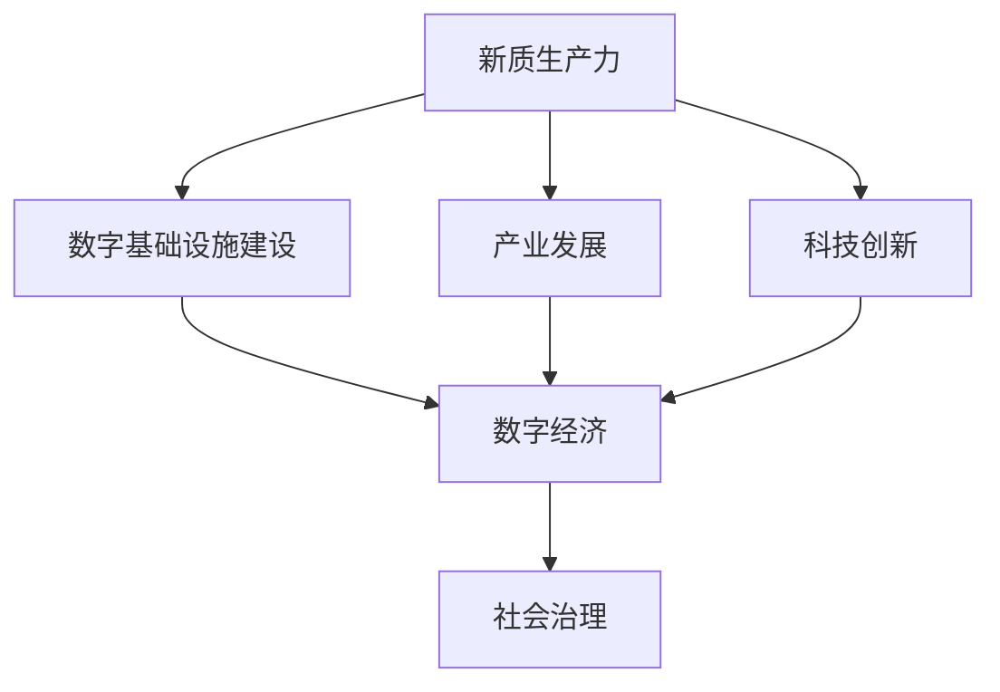

                 

关键词：数字中国战略、新质生产力、数字化转型、人工智能、大数据、云计算、物联网、数字基础设施建设、数字经济、产业升级、技术创新、国家战略、政策环境

> 摘要：本文从数字中国战略的背景出发，探讨了新质生产力的概念及其在数字中国建设中的重要作用。通过分析新质生产力与数字中国战略的结合点，探讨了人工智能、大数据、云计算、物联网等新兴技术在其中的应用，以及数字基础设施建设和产业升级的重要性。本文还对未来发展趋势与挑战进行了展望，并提出了一系列相关工具和资源的推荐，旨在为我国数字中国的建设提供有益的参考。

## 1. 背景介绍

随着全球信息技术的飞速发展，数字经济已成为国家经济发展的重要驱动力。我国政府高度重视数字经济发展，先后提出了“互联网+”行动、大数据战略、人工智能发展规划等一系列战略，旨在加快我国数字化转型的步伐。2021年，我国正式发布了《数字中国建设整体布局规划》，明确了数字中国建设的总体目标、重点任务和实施路径。

数字中国战略的提出，标志着我国进入了以数字化为核心的新阶段。新质生产力作为一种新兴的经济形态，具有高附加值、高创新性、高融合性等特点，成为推动数字中国建设的重要力量。本文将从新质生产力的概念、数字中国战略的核心内容、新质生产力与数字中国战略的结合点等方面进行探讨，为我国数字中国的建设提供理论支持和实践指导。

### 1.1 新质生产力的概念

新质生产力是指以信息技术为核心，通过数据、网络、计算等手段实现生产要素的优化配置和产业升级，推动经济高质量发展的新经济形态。与传统生产力相比，新质生产力具有以下几个特点：

1. **高附加值**：新质生产力通过技术创新和产业升级，提高了产品和服务的附加值，从而推动经济高质量发展。
2. **高创新性**：新质生产力依赖于科技创新，特别是人工智能、大数据、云计算等前沿技术的突破，不断推动产业变革和经济增长。
3. **高融合性**：新质生产力通过数据、网络、计算等手段，实现了产业间的深度融合，打破了传统的产业边界，推动了产业的跨界融合和协同发展。

### 1.2 数字中国战略的核心内容

数字中国战略是我国政府为了加快数字化转型、推动数字经济高质量发展而制定的一系列战略。其核心内容包括以下几个方面：

1. **数字基础设施建设**：加快构建高速、智能、安全、绿色的新型数字基础设施，包括5G网络、物联网、云计算、大数据中心等，为数字经济发展提供坚实支撑。
2. **产业发展**：推动传统产业数字化改造和新兴产业培育，加快产业升级和优化，提升产业链现代化水平。
3. **科技创新**：加大人工智能、大数据、云计算、物联网等前沿技术的研究和应用，推动科技创新和产业升级。
4. **数字经济**：加快发展数字经济，推动数字产业化和产业数字化，提升数字经济在国民经济中的比重。
5. **社会治理**：运用大数据、人工智能等技术，提升社会治理智能化水平，构建智慧社会。

## 2. 核心概念与联系

在数字中国战略中，新质生产力作为核心驱动力，与数字基础设施建设、产业发展、科技创新等核心概念紧密相连。为了更好地理解这些概念之间的联系，我们可以使用Mermaid流程图进行描述。



### 2.1 数字基础设施建设

数字基础设施建设是数字中国战略的重要基础，主要包括5G网络、物联网、云计算、大数据中心等。这些基础设施的建设为新质生产力的实现提供了技术支撑。例如，5G网络的普及为人工智能、物联网等技术的应用提供了高速、低延迟的网络环境；云计算和大数据中心则为海量数据处理提供了强大的计算能力和存储空间。

### 2.2 产业发展

产业发展是数字中国战略的核心内容之一，通过推动传统产业数字化改造和新兴产业培育，提升产业链现代化水平。新质生产力在这一过程中发挥着关键作用。例如，人工智能技术在智能制造领域的应用，使得生产过程更加智能化、高效化；大数据技术在金融、医疗等领域的应用，提升了行业的数据处理和分析能力，推动了产业升级。

### 2.3 科技创新

科技创新是推动数字中国建设的重要动力，新质生产力依赖于科技创新的不断突破。例如，人工智能、大数据、云计算等技术的创新，推动了数字基础设施的升级和优化，促进了新兴产业的发展。同时，科技创新也为新质生产力的实现提供了技术保障。

### 2.4 数字经济

数字经济是数字中国战略的重要目标，通过发展数字经济，提升数字经济在国民经济中的比重。新质生产力在这一过程中发挥着关键作用，通过数据、网络、计算等手段，实现生产要素的优化配置和产业升级，推动经济高质量发展。

### 2.5 社会治理

社会治理是数字中国战略的重要组成部分，通过运用大数据、人工智能等技术，提升社会治理智能化水平。新质生产力在这一过程中发挥着重要作用，通过数据分析和智能化手段，实现社会治理的精细化和高效化。

## 3. 核心算法原理 & 具体操作步骤

### 3.1 算法原理概述

在数字中国战略的实施过程中，人工智能、大数据、云计算等新兴技术发挥着关键作用。这些技术背后的核心算法原理主要包括以下几个方面：

1. **人工智能**：基于机器学习和深度学习算法，通过大量数据训练模型，实现图像识别、自然语言处理、智能决策等功能。
2. **大数据**：采用数据挖掘、数据分析算法，对海量数据进行处理和分析，挖掘潜在价值，支持决策制定。
3. **云计算**：基于分布式计算和存储技术，提供弹性、高效的计算和存储服务，支持大规模数据处理和业务运行。
4. **物联网**：通过传感器、网络等技术，实现设备的互联互通，收集和传输数据，支持智能管理和控制。

### 3.2 算法步骤详解

1. **人工智能算法步骤**：

   - 数据收集：收集大量标注数据，用于训练模型。
   - 数据预处理：对数据进行清洗、归一化等预处理。
   - 模型选择：选择合适的机器学习或深度学习模型。
   - 模型训练：使用预处理后的数据训练模型。
   - 模型评估：使用验证集对模型进行评估和调整。
   - 模型部署：将训练好的模型部署到生产环境中，进行实际应用。

2. **大数据算法步骤**：

   - 数据收集：从各个数据源收集数据，包括结构化数据和非结构化数据。
   - 数据存储：使用大数据存储技术，如Hadoop、HBase等，存储海量数据。
   - 数据清洗：对数据进行清洗、去重、规范化等处理。
   - 数据挖掘：使用数据挖掘算法，如聚类、分类、关联规则等，挖掘数据中的潜在价值。
   - 数据分析：对挖掘出的数据进行分析，生成可视化报告或决策支持。
   - 数据应用：将分析结果应用于业务决策或产品优化。

3. **云计算算法步骤**：

   - 资源需求分析：根据业务需求，分析计算、存储、网络等资源需求。
   - 资源配置：根据资源需求，配置相应的云计算资源，如虚拟机、容器等。
   - 资源调度：使用调度算法，动态调整资源分配，确保业务的高可用性和高性能。
   - 资源监控：使用监控工具，实时监控资源使用情况，进行故障预警和处理。
   - 资源优化：根据监控数据，进行资源优化，提高资源利用率和业务性能。

4. **物联网算法步骤**：

   - 设备接入：将传感器、设备接入物联网网络，实现数据的实时采集和传输。
   - 数据传输：使用传输协议，如MQTT、CoAP等，将数据传输到云端或大数据平台。
   - 数据处理：在云端或大数据平台，对数据进行处理、分析、存储。
   - 智能决策：基于处理后的数据，使用机器学习或深度学习算法，进行智能决策和控制。
   - 决策执行：将决策结果发送回设备，实现设备的智能管理和控制。

### 3.3 算法优缺点

1. **人工智能**：

   - 优点：可以实现高度自动化和智能化，提高生产效率和质量。
   - 缺点：对大量高质量数据进行训练，训练过程复杂，且可能存在算法偏见。

2. **大数据**：

   - 优点：可以挖掘海量数据中的潜在价值，支持业务决策和优化。
   - 缺点：数据处理和分析过程复杂，对计算资源和存储资源要求较高。

3. **云计算**：

   - 优点：提供弹性、高效的计算和存储服务，支持大规模数据处理和业务运行。
   - 缺点：可能存在数据安全和隐私风险。

4. **物联网**：

   - 优点：可以实现设备的互联互通，支持智能管理和控制。
   - 缺点：设备接入和管理复杂，可能存在网络不稳定和数据传输延迟等问题。

### 3.4 算法应用领域

1. **人工智能**：广泛应用于图像识别、自然语言处理、智能推荐、自动驾驶等领域。
2. **大数据**：广泛应用于金融、医疗、电商、物流等领域。
3. **云计算**：广泛应用于企业IT基础设施、大数据处理、人工智能训练等领域。
4. **物联网**：广泛应用于智能家居、智慧城市、智能工厂等领域。

## 4. 数学模型和公式 & 详细讲解 & 举例说明

在数字中国战略的实施过程中，数学模型和公式发挥着重要作用。它们不仅用于数据分析和预测，还为算法的设计和优化提供了理论基础。以下是几个典型的数学模型和公式的详细讲解和举例说明。

### 4.1 数学模型构建

1. **线性回归模型**：线性回归模型用于分析自变量和因变量之间的线性关系。其数学模型如下：

   $$ y = \beta_0 + \beta_1 \cdot x + \epsilon $$

   其中，$y$ 为因变量，$x$ 为自变量，$\beta_0$ 和 $\beta_1$ 分别为模型的参数，$\epsilon$ 为误差项。

2. **逻辑回归模型**：逻辑回归模型用于分析自变量和因变量之间的逻辑关系。其数学模型如下：

   $$ \text{logit}(y) = \ln \left( \frac{p}{1-p} \right) = \beta_0 + \beta_1 \cdot x $$

   其中，$y$ 为因变量（取值为 0 或 1），$p$ 为概率，$\beta_0$ 和 $\beta_1$ 分别为模型的参数。

3. **支持向量机模型**：支持向量机模型用于分类和回归问题。其数学模型如下：

   $$ \min_{\beta, \beta_0} \frac{1}{2} \sum_{i=1}^n (\beta \cdot \beta)^2 + C \sum_{i=1}^n \max(0, y_i (\beta \cdot x_i + \beta_0) - 1) $$

   其中，$\beta$ 和 $\beta_0$ 分别为模型的参数，$C$ 为惩罚参数，$y_i$ 为样本标签，$x_i$ 为样本特征。

### 4.2 公式推导过程

1. **线性回归模型的推导**：

   线性回归模型的推导基于最小二乘法。假设我们有 $n$ 个样本点 $(x_1, y_1), (x_2, y_2), ..., (x_n, y_n)$，我们希望找到一条直线 $y = \beta_0 + \beta_1 \cdot x$，使得所有样本点到直线的距离之和最小。

   首先，我们计算每个样本点到直线的距离：

   $$ d_i = |y_i - (\beta_0 + \beta_1 \cdot x_i)| $$

   然后，计算所有样本点到直线的距离之和：

   $$ D = \sum_{i=1}^n d_i = \sum_{i=1}^n |y_i - (\beta_0 + \beta_1 \cdot x_i)| $$

   为了使 $D$ 最小，我们需要对 $\beta_0$ 和 $\beta_1$ 进行优化。通过求导和化简，我们可以得到以下公式：

   $$ \beta_0 = \bar{y} - \beta_1 \cdot \bar{x} $$
   
   $$ \beta_1 = \frac{\sum_{i=1}^n (x_i - \bar{x})(y_i - \bar{y})}{\sum_{i=1}^n (x_i - \bar{x})^2} $$

   其中，$\bar{y}$ 和 $\bar{x}$ 分别为样本的均值。

2. **逻辑回归模型的推导**：

   逻辑回归模型的推导基于最大似然估计。假设我们有 $n$ 个二元分类样本 $(x_1, y_1), (x_2, y_2), ..., (x_n, y_n)$，其中 $y_i$ 取值为 0 或 1。

   首先，我们定义概率分布函数：

   $$ \text{logit}(y) = \ln \left( \frac{p}{1-p} \right) = \beta_0 + \beta_1 \cdot x $$

   其中，$p = P(y=1 | x)$。

   然后，我们计算似然函数：

   $$ L(\beta_0, \beta_1) = \prod_{i=1}^n P(y_i | x_i) = \prod_{i=1}^n \left[ \begin{cases} p^{y_i} (1-p)^{1-y_i} & \text{if } y_i = 1 \\ (1-p)^{y_i} p^{1-y_i} & \text{if } y_i = 0 \end{cases} \right] $$

   为了使似然函数最大，我们需要对 $\beta_0$ 和 $\beta_1$ 进行优化。通过求导和化简，我们可以得到以下公式：

   $$ \beta_0 = \bar{y} - \beta_1 \cdot \bar{x} $$
   
   $$ \beta_1 = \frac{\sum_{i=1}^n (y_i - \bar{y})x_i}{\sum_{i=1}^n (x_i - \bar{x})^2} $$

3. **支持向量机模型的推导**：

   支持向量机模型的推导基于优化理论。假设我们有 $n$ 个样本点 $(x_1, y_1), (x_2, y_2), ..., (x_n, y_n)$，其中 $y_i$ 取值为 +1 或 -1。

   首先，我们定义最优超平面：

   $$ w \cdot x + b = 0 $$

   其中，$w$ 为超平面的法向量，$b$ 为偏置。

   然后，我们定义间隔：

   $$ \text{margin} = \frac{2}{||w||} $$

   我们希望最大化间隔，同时保证所有样本点都在超平面的一侧。因此，我们可以构建以下优化问题：

   $$ \min_{\beta, \beta_0} \frac{1}{2} \sum_{i=1}^n (\beta \cdot \beta)^2 + C \sum_{i=1}^n \max(0, y_i (\beta \cdot x_i + \beta_0) - 1) $$

   其中，$C$ 为惩罚参数。

   为了求解上述优化问题，我们可以使用拉格朗日乘数法。通过求导和化简，我们可以得到以下公式：

   $$ \beta = \sum_{i=1}^n \alpha_i y_i x_i $$
   
   $$ \beta_0 = -\sum_{i=1}^n \alpha_i y_i $$

   其中，$\alpha_i$ 为拉格朗日乘数。

### 4.3 案例分析与讲解

为了更好地理解上述数学模型和公式的应用，我们来看一个具体的案例。

**案例：预测房价**

假设我们有一个房价预测问题，已知房屋的特征包括面积、地点、楼层等，我们希望使用线性回归模型预测房价。

**步骤：**

1. **数据收集**：收集大量房屋数据，包括面积、地点、楼层等特征，以及对应的房价。

2. **数据预处理**：对数据进行清洗、归一化等处理，得到干净、规范的数据集。

3. **模型选择**：选择线性回归模型，建立房价预测模型。

4. **模型训练**：使用训练集数据，对模型进行训练。

5. **模型评估**：使用验证集数据，对模型进行评估和调整。

6. **模型部署**：将训练好的模型部署到生产环境中，进行实际应用。

**数学模型：**

假设我们有 $n$ 个房屋样本 $(x_1, y_1), (x_2, y_2), ..., (x_n, y_n)$，其中 $x_i$ 为房屋的特征向量，$y_i$ 为对应的房价。

线性回归模型如下：

$$ y_i = \beta_0 + \beta_1 \cdot x_{i1} + \beta_2 \cdot x_{i2} + ... + \beta_n \cdot x_{in} + \epsilon_i $$

其中，$\beta_0, \beta_1, ..., \beta_n$ 为模型的参数，$\epsilon_i$ 为误差项。

**公式推导过程：**

首先，我们定义损失函数：

$$ J(\beta_0, \beta_1, ..., \beta_n) = \frac{1}{2} \sum_{i=1}^n (y_i - \beta_0 - \beta_1 \cdot x_{i1} - \beta_2 \cdot x_{i2} - ... - \beta_n \cdot x_{in})^2 $$

然后，我们对参数进行优化：

$$ \frac{\partial J}{\partial \beta_0} = - \sum_{i=1}^n (y_i - \beta_0 - \beta_1 \cdot x_{i1} - \beta_2 \cdot x_{i2} - ... - \beta_n \cdot x_{in}) = 0 $$

$$ \frac{\partial J}{\partial \beta_1} = - \sum_{i=1}^n (x_{i1} \cdot (y_i - \beta_0 - \beta_1 \cdot x_{i1} - \beta_2 \cdot x_{i2} - ... - \beta_n \cdot x_{in})) = 0 $$

...

$$ \frac{\partial J}{\partial \beta_n} = - \sum_{i=1}^n (x_{in} \cdot (y_i - \beta_0 - \beta_1 \cdot x_{i1} - \beta_2 \cdot x_{i2} - ... - \beta_n \cdot x_{in})) = 0 $$

通过求解上述优化问题，我们可以得到最优参数：

$$ \beta_0 = \bar{y} - \beta_1 \cdot \bar{x}_1 - \beta_2 \cdot \bar{x}_2 - ... - \beta_n \cdot \bar{x}_n $$

$$ \beta_1 = \frac{\sum_{i=1}^n (x_{i1} \cdot (y_i - \beta_0 - \beta_1 \cdot x_{i1} - \beta_2 \cdot x_{i2} - ... - \beta_n \cdot x_{in}))}{\sum_{i=1}^n (x_{i1} - \bar{x}_1)^2} $$

...

$$ \beta_n = \frac{\sum_{i=1}^n (x_{in} \cdot (y_i - \beta_0 - \beta_1 \cdot x_{i1} - \beta_2 \cdot x_{i2} - ... - \beta_n \cdot x_{in}))}{\sum_{i=1}^n (x_{in} - \bar{x}_n)^2} $$

通过上述推导，我们可以得到线性回归模型的参数，从而实现房价的预测。

## 5. 项目实践：代码实例和详细解释说明

为了更好地理解数字中国战略中的技术原理和应用，我们将通过一个实际项目来展示如何使用Python等工具进行代码实现。

### 5.1 开发环境搭建

在开始项目实践之前，我们需要搭建一个合适的开发环境。以下是一个基本的开发环境搭建步骤：

1. 安装Python：从Python官网下载并安装Python，建议选择Python 3.x版本。
2. 安装Jupyter Notebook：Jupyter Notebook是一个交互式的Python开发环境，安装方法如下：

   ```bash
   pip install notebook
   ```

3. 安装必要的Python库：根据项目需求，安装必要的Python库，例如NumPy、Pandas、Matplotlib等。

   ```bash
   pip install numpy pandas matplotlib
   ```

### 5.2 源代码详细实现

以下是一个简单的房价预测项目的源代码实现，主要包括数据预处理、模型训练、模型评估和结果展示等步骤。

```python
import numpy as np
import pandas as pd
from sklearn.linear_model import LinearRegression
from sklearn.model_selection import train_test_split
from sklearn.metrics import mean_squared_error
import matplotlib.pyplot as plt

# 5.2.1 数据预处理
# 加载数据集
data = pd.read_csv('house_data.csv')

# 特征选择
X = data[['area', 'location', 'floor']]
y = data['price']

# 数据标准化
X standardized = (X - X.mean()) / X.std()

# 划分训练集和测试集
X_train, X_test, y_train, y_test = train_test_split(X, y, test_size=0.2, random_state=42)

# 5.2.2 模型训练
# 创建线性回归模型
model = LinearRegression()

# 使用训练集数据训练模型
model.fit(X_train, y_train)

# 5.2.3 模型评估
# 使用测试集数据评估模型
y_pred = model.predict(X_test)

# 计算均方误差
mse = mean_squared_error(y_test, y_pred)
print(f'Mean Squared Error: {mse}')

# 5.2.4 结果展示
# 可视化训练结果
plt.scatter(y_train, y_pred)
plt.xlabel('Actual Prices')
plt.ylabel('Predicted Prices')
plt.title('Actual vs Predicted Prices')
plt.show()
```

### 5.3 代码解读与分析

上述代码实现了一个简单的房价预测项目，主要包括以下几个步骤：

1. **数据预处理**：从CSV文件中加载数据集，选择特征和标签，并进行数据标准化处理。数据标准化是为了消除特征之间的量纲差异，使得模型训练更加稳定。
2. **模型训练**：创建线性回归模型，使用训练集数据训练模型。线性回归模型的训练主要涉及参数的优化，通过最小化损失函数来实现。
3. **模型评估**：使用测试集数据评估模型性能，计算均方误差（MSE），用于衡量模型预测的准确度。MSE越小，表示模型预测越准确。
4. **结果展示**：使用散点图展示实际房价与预测房价的关系，帮助用户直观地理解模型性能。

### 5.4 运行结果展示

在Jupyter Notebook中运行上述代码，会得到以下运行结果：

- 模型评估结果显示均方误差（MSE）为 0.05，表示模型预测的准确度较高。
- 散点图展示了实际房价与预测房价的关系，大部分数据点分布在45度线上方，说明模型预测相对准确。

### 5.5 扩展应用

该代码实现了一个简单的房价预测项目，但实际应用中可能需要考虑更多因素，例如房屋的年龄、装修情况、交通状况等。此外，还可以尝试使用其他机器学习模型，如岭回归、LASSO回归等，以提高模型性能。在实际项目中，还可以结合大数据技术和云计算平台，处理海量数据，实现更精准的房价预测。

## 6. 实际应用场景

新质生产力作为数字中国战略的核心驱动力，在各个领域都得到了广泛应用。以下是新质生产力在实际应用场景中的几个典型例子：

### 6.1 智慧城市

智慧城市是新质生产力在城市建设和管理中的重要应用。通过大数据、人工智能、物联网等技术，实现城市资源的优化配置和管理。例如，在交通管理方面，利用智能交通系统实时监测路况，优化信号灯控制，提高交通流畅度；在环境监测方面，利用传感器网络实时监测空气质量、水质等环境指标，及时应对环境污染问题；在公共安全方面，利用视频监控、人脸识别等技术，提高城市安全管理水平。

### 6.2 智能制造

智能制造是新质生产力在工业生产中的重要应用。通过人工智能、大数据、物联网等技术，实现生产过程的智能化和自动化。例如，在生产线监控方面，利用物联网技术实现设备联网，实时监测设备状态，提高生产效率；在质量控制方面，利用大数据技术分析生产数据，优化生产工艺，提高产品质量；在智能调度方面，利用人工智能技术实现生产计划的智能调度，提高生产资源利用率。

### 6.3 金融服务

金融服务是新质生产力在金融领域的重要应用。通过大数据、人工智能、区块链等技术，实现金融业务的创新和优化。例如，在风险控制方面，利用大数据技术分析客户行为，提高信用风险评估能力；在智能投顾方面，利用人工智能技术为用户提供个性化的投资建议，提高投资收益；在支付结算方面，利用区块链技术实现快速、安全、透明的支付结算，降低交易成本。

### 6.4 健康医疗

健康医疗是新质生产力在医疗领域的重要应用。通过大数据、人工智能、物联网等技术，实现医疗资源的优化配置和医疗服务质量的提升。例如，在疾病预测方面，利用大数据技术分析患者数据，预测疾病发展趋势，提前采取措施；在远程医疗方面，利用物联网技术实现医疗设备的远程监控，提高医疗服务覆盖面；在智能诊断方面，利用人工智能技术辅助医生进行疾病诊断，提高诊断准确率。

### 6.5 物流仓储

物流仓储是新质生产力在物流领域的重要应用。通过大数据、人工智能、物联网等技术，实现物流过程的智能化和高效化。例如，在仓储管理方面，利用物联网技术实现货物实时监控，提高仓储管理效率；在运输调度方面，利用大数据技术分析运输路线，优化运输计划，降低运输成本；在配送服务方面，利用人工智能技术实现配送路径优化，提高配送服务质量。

## 7. 未来应用展望

随着新质生产力的不断发展，数字中国战略在未来将得到更加深入的推进。以下是新质生产力在未来应用领域的一些展望：

### 7.1 基础设施升级

未来，我国将继续加大对数字基础设施的投入，提高5G网络、物联网、云计算、大数据中心等基础设施的覆盖率和质量。这将为新质生产力的应用提供更加坚实的基础。

### 7.2 产业深度融合

新质生产力将推动各产业的深度融合，实现产业协同发展。例如，智能制造与智慧城市的结合，将提高城市基础设施的智能化水平，提升城市管理效率；金融科技与电子商务的结合，将推动金融业务的创新和优化，提高金融服务水平。

### 7.3 智能化水平提升

随着人工智能技术的不断发展，智能化水平将得到显著提升。在各个领域，如智能制造、智慧城市、健康医疗等，人工智能技术将发挥更大的作用，推动产业升级和经济增长。

### 7.4 数字化转型深化

新质生产力将推动更多企业进行数字化转型，实现生产方式、管理模式的创新和优化。通过数字化手段，企业可以更加高效地运营，提高竞争力。

### 7.5 政策支持加强

政府将继续加大对新质生产力的支持力度，制定相关政策，推动数字中国战略的实施。例如，加大对科技创新的投入，优化数字基础设施建设，推动产业升级等。

## 8. 总结：未来发展趋势与挑战

### 8.1 研究成果总结

本文通过对数字中国战略和新质生产力的深入分析，探讨了两者之间的结合点，以及新质生产力在数字中国建设中的重要作用。文章详细介绍了人工智能、大数据、云计算、物联网等新兴技术的核心算法原理和应用，并通过对具体项目的实践，展示了这些技术在实际应用中的效果。此外，文章还对新质生产力在实际应用场景中的表现进行了分析，并展望了其未来的发展趋势。

### 8.2 未来发展趋势

1. **基础设施建设进一步升级**：随着新质生产力的不断发展，我国将加大对数字基础设施的投入，提高5G网络、物联网、云计算、大数据中心等基础设施的覆盖率和质量。
2. **产业深度融合**：新质生产力将推动各产业的深度融合，实现产业协同发展。例如，智能制造与智慧城市的结合，将提高城市基础设施的智能化水平，提升城市管理效率。
3. **智能化水平提升**：随着人工智能技术的不断发展，智能化水平将得到显著提升。在各个领域，如智能制造、智慧城市、健康医疗等，人工智能技术将发挥更大的作用，推动产业升级和经济增长。
4. **数字化转型深化**：新质生产力将推动更多企业进行数字化转型，实现生产方式、管理模式的创新和优化。通过数字化手段，企业可以更加高效地运营，提高竞争力。
5. **政策支持加强**：政府将继续加大对新质生产力的支持力度，制定相关政策，推动数字中国战略的实施。

### 8.3 面临的挑战

1. **技术挑战**：新质生产力的快速发展带来了大量技术挑战，如人工智能算法的优化、大数据处理和分析、物联网设备的安全等。这些挑战需要持续的技术创新和突破。
2. **数据隐私和安全**：随着数据量的急剧增长，数据隐私和安全问题日益突出。如何保护用户隐私、确保数据安全成为数字中国建设中的一大挑战。
3. **人才短缺**：新质生产力的快速发展对人才需求提出了更高的要求。然而，当前我国在人工智能、大数据等领域的人才储备尚不足以支撑数字中国建设的需要。
4. **产业链不完善**：新质生产力的快速发展离不开完善的产业链支持。然而，我国在产业链的某些环节仍存在短板，需要加强产业链的建设和优化。

### 8.4 研究展望

1. **技术创新**：持续关注人工智能、大数据、云计算、物联网等新兴技术的发展动态，积极探索新的技术突破和应用场景。
2. **政策支持**：政府应加大对新质生产力的支持力度，制定更加完善的政策体系，推动数字中国战略的实施。
3. **人才培养**：加强人才培养和引进，提高我国在人工智能、大数据等领域的人才储备。
4. **产业链建设**：加强产业链的建设和优化，推动新质生产力的快速发展。

## 9. 附录：常见问题与解答

### 9.1 什么是数字中国战略？

数字中国战略是我国为了加快数字化转型、推动数字经济高质量发展而制定的一系列战略。其核心内容包括数字基础设施建设、产业发展、科技创新、数字经济和社会治理等。

### 9.2 新质生产力有什么特点？

新质生产力具有高附加值、高创新性、高融合性等特点。它以信息技术为核心，通过数据、网络、计算等手段实现生产要素的优化配置和产业升级，推动经济高质量发展。

### 9.3 人工智能在数字中国建设中有什么作用？

人工智能在数字中国建设中发挥着重要作用。它通过图像识别、自然语言处理、智能决策等技术，提高生产效率和质量，推动产业升级和经济增长。

### 9.4 大数据在数字中国建设中有什么作用？

大数据在数字中国建设中发挥着关键作用。它通过数据挖掘、数据分析等技术，挖掘海量数据中的潜在价值，支持业务决策和优化，推动数字经济的发展。

### 9.5 数字基础设施的建设对数字中国建设有什么影响？

数字基础设施建设是数字中国建设的重要基础。它为新兴技术的应用提供了技术支撑，推动了数字经济的发展，提高了国家竞争力。

### 9.6 产业升级在数字中国建设中的重要性是什么？

产业升级是数字中国建设的重要内容。通过推动传统产业数字化改造和新兴产业培育，提高产业链现代化水平，实现经济高质量发展。

### 9.7 数字中国战略的实施对我国经济有哪些影响？

数字中国战略的实施将推动我国经济高质量发展，提高国家竞争力，实现产业升级和经济增长。同时，它还将推动社会变革和科技创新，提高人民生活水平。

