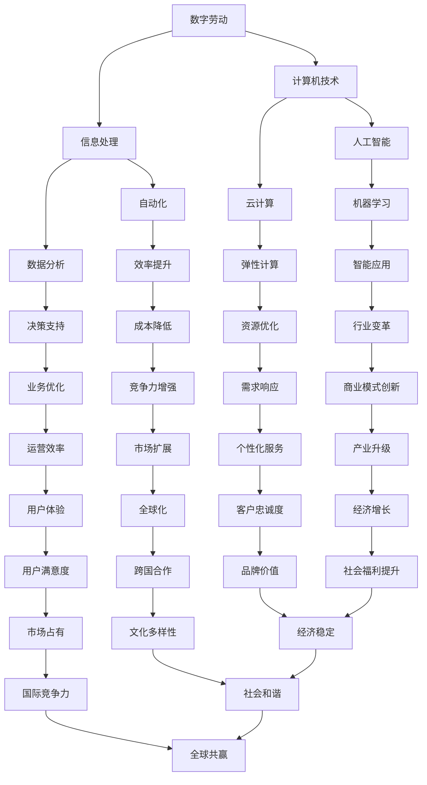

                 

关键词：数字劳动，人类计算，社会影响，经济影响，人工智能，技术进步

> 摘要：本文从数字劳动的视角出发，探讨了人类计算在社会和经济领域中的深远影响。通过分析数字劳动的定义、现状及发展趋势，本文旨在揭示技术进步如何改变了劳动方式、工作性质以及社会经济结构，并展望了未来的发展前景。

## 1. 背景介绍

在当今快速发展的信息技术时代，数字劳动已经成为全球经济的重要组成部分。数字劳动，也被称为“计算劳动”，指的是通过计算机技术和互联网平台进行的各种类型的工作，包括数据输入、数据分析、软件开发、网络管理、内容创作等。随着人工智能和大数据技术的进步，数字劳动的形式和范围正在不断扩展，深刻影响了全球经济和社会结构。

### 数字劳动的定义与特点

数字劳动的定义可以从两个方面来理解：一是劳动对象，即信息和技术；二是劳动过程，即通过数字技术进行的工作。数字劳动具有以下几个显著特点：

- **高效性**：数字技术能够显著提高工作效率，减少人力成本，实现自动化和智能化。
- **灵活性**：数字劳动可以不受时间和地点限制，劳动者可以在全球范围内选择工作时间和地点。
- **可复制性**：数字技术使得知识可以快速复制和传播，劳动成果可以被大规模复制和利用。
- **低门槛**：互联网和开源技术的发展降低了数字劳动的门槛，使更多人能够参与其中。

### 数字劳动的兴起与发展

数字劳动的兴起可以追溯到互联网的普及和计算机技术的进步。自20世纪90年代以来，随着互联网的广泛应用，全球范围内的数字劳动市场逐渐形成。进入21世纪，尤其是近年来，人工智能、大数据和云计算等新兴技术的快速发展，进一步推动了数字劳动的繁荣。

### 数字劳动对社会经济的影响

数字劳动不仅改变了劳动方式，也对全球经济和社会结构产生了深远的影响。首先，数字劳动促进了全球经济的快速增长，提高了生产效率，创造了大量就业机会。然而，与此同时，数字劳动也引发了一系列社会问题，如工作不稳定、职业分化加剧、劳动权益保障等。本文将在后续章节中详细探讨这些问题。

## 2. 核心概念与联系

为了更好地理解数字劳动的概念和其在社会和经济领域中的作用，我们需要引入一些核心概念，并展示它们之间的联系。以下是几个关键概念及其相互关系的 Mermaid 流程图：



### 2.1 数字劳动与信息处理

数字劳动的核心在于信息处理。信息处理是数字劳动的基础，包括数据的采集、存储、处理和分析。信息处理技术的进步，如自动化和数据分析，使得数字劳动更加高效和智能化。

### 2.2 数字劳动与计算机技术

计算机技术是数字劳动的重要支撑。人工智能、云计算等计算机技术的发展，为数字劳动提供了强大的工具和平台。计算机技术的进步不仅提升了劳动效率，还拓展了数字劳动的应用范围。

### 2.3 数字劳动与自动化

自动化是数字劳动的重要特点之一。通过自动化技术，许多重复性、繁琐的工作可以被计算机和机器人取代，从而提高生产效率，降低人力成本。

### 2.4 数字劳动与数据分析

数据分析是数字劳动的重要应用领域。通过对大量数据的分析，企业可以做出更准确的决策，提高运营效率，优化业务流程。

### 2.5 数字劳动与人工智能

人工智能是数字劳动的未来方向。人工智能技术可以模拟人类智能，实现更复杂的信息处理和决策支持，推动数字劳动向智能化、个性化方向发展。

### 2.6 数字劳动与云计算

云计算为数字劳动提供了弹性和可扩展性。通过云计算平台，企业可以按需获取计算资源，实现快速部署和扩展，降低IT成本。

## 3. 核心算法原理 & 具体操作步骤

### 3.1 算法原理概述

数字劳动中的核心算法主要包括机器学习算法、深度学习算法和数据分析算法。这些算法通过处理和挖掘大量数据，为企业提供智能决策支持。

- **机器学习算法**：通过历史数据训练模型，预测未来趋势和结果。
- **深度学习算法**：模拟人脑神经元网络，处理复杂数据，提取特征。
- **数据分析算法**：对大量数据进行分析，提取有价值的信息。

### 3.2 算法步骤详解

#### 3.2.1 机器学习算法

1. 数据采集：收集历史数据，包括输入数据和目标变量。
2. 数据预处理：清洗数据，去除异常值和缺失值。
3. 模型选择：根据问题特点选择合适的机器学习模型。
4. 模型训练：使用训练集数据训练模型。
5. 模型评估：使用验证集数据评估模型性能。
6. 模型优化：调整模型参数，提高模型性能。
7. 模型部署：将训练好的模型部署到实际应用中。

#### 3.2.2 深度学习算法

1. 数据采集：收集大量数据，包括图像、语音、文本等。
2. 数据预处理：对数据进行归一化、标准化等处理。
3. 模型构建：设计深度学习模型，包括神经网络架构。
4. 模型训练：使用训练集数据训练模型。
5. 模型评估：使用验证集数据评估模型性能。
6. 模型优化：调整模型参数，提高模型性能。
7. 模型部署：将训练好的模型部署到实际应用中。

#### 3.2.3 数据分析算法

1. 数据采集：收集企业运营数据，如销售数据、客户数据等。
2. 数据预处理：清洗数据，去除异常值和缺失值。
3. 数据分析：使用统计分析方法，提取数据中的有价值信息。
4. 数据可视化：通过图表和图形展示分析结果。
5. 决策支持：根据分析结果，为企业提供决策支持。

### 3.3 算法优缺点

- **机器学习算法**：优点是能够处理大规模数据，实现自动化决策；缺点是需要大量数据和较长时间的训练。
- **深度学习算法**：优点是能够处理复杂数据，提取深层特征；缺点是需要大量计算资源和数据。
- **数据分析算法**：优点是简单易行，适用于各种类型的数据；缺点是分析结果可能受限于数据质量和分析方法。

### 3.4 算法应用领域

- **金融领域**：风险评估、信用评估、投资组合优化等。
- **医疗领域**：疾病预测、诊断辅助、药物研发等。
- **制造业**：生产调度、质量控制、设备故障预测等。
- **零售业**：需求预测、库存管理、客户行为分析等。

## 4. 数学模型和公式 & 详细讲解 & 举例说明

### 4.1 数学模型构建

在数字劳动中，数学模型用于描述各种计算过程和算法。以下是几个常见的数学模型及其构建方法：

#### 4.1.1 机器学习模型

假设我们有 m 个样本点 \((x_i, y_i)\)，其中 \(x_i\) 是输入特征向量，\(y_i\) 是目标变量。我们的目标是找到一个函数 \(f(x)\)，使得 \(f(x_i)\) 接近 \(y_i\)。

构建方法：

1. **损失函数**：定义损失函数 \(L(f(x_i), y_i)\)，用于度量预测值 \(f(x_i)\) 与真实值 \(y_i\) 之间的差异。
2. **优化目标**：选择一个优化目标，如最小化损失函数或最大化预测准确率。
3. **优化算法**：使用优化算法（如梯度下降）寻找最优解。

#### 4.1.2 深度学习模型

假设我们有一个多层神经网络，包括输入层、隐藏层和输出层。每个层由多个神经元组成，神经元之间的连接权重为 \(w_{ij}\)。

构建方法：

1. **激活函数**：选择合适的激活函数（如ReLU、Sigmoid、Tanh），用于引入非线性特性。
2. **前向传播**：从输入层开始，逐层计算神经元输出值。
3. **反向传播**：计算损失函数关于权重和偏置的梯度，更新权重和偏置。

#### 4.1.3 数据分析模型

假设我们有 k 个变量 \(x_1, x_2, ..., x_k\)，目标是建立一个线性回归模型来预测目标变量 \(y\)。

构建方法：

1. **线性模型**：定义线性模型 \(y = \beta_0 + \beta_1 x_1 + \beta_2 x_2 + ... + \beta_k x_k\)。
2. **最小二乘法**：使用最小二乘法估计模型参数 \(\beta_0, \beta_1, ..., \beta_k\)。

### 4.2 公式推导过程

以下是一个简单的线性回归模型的公式推导过程：

#### 4.2.1 假设

1. **线性关系**：假设 \(y\) 与 \(x_1, x_2, ..., x_k\) 之间存在线性关系。
2. **独立同分布**：假设数据独立同分布，即每个样本点的 \(y_i\) 与其他样本点的 \(y_i\) 无关。

#### 4.2.2 线性模型

假设 \(y = \beta_0 + \beta_1 x_1 + \beta_2 x_2 + ... + \beta_k x_k\)，其中 \(\beta_0, \beta_1, ..., \beta_k\) 是待估参数。

#### 4.2.3 最小二乘法

最小二乘法的目标是最小化预测值与真实值之间的误差平方和。即：

$$
\min_{\beta_0, \beta_1, ..., \beta_k} \sum_{i=1}^m (y_i - (\beta_0 + \beta_1 x_{i1} + \beta_2 x_{i2} + ... + \beta_k x_{ik}))^2
$$

对上述式子求导，得到：

$$
\frac{\partial}{\partial \beta_0} \sum_{i=1}^m (y_i - (\beta_0 + \beta_1 x_{i1} + \beta_2 x_{i2} + ... + \beta_k x_{ik}))^2 = 0
$$

$$
\frac{\partial}{\partial \beta_1} \sum_{i=1}^m (y_i - (\beta_0 + \beta_1 x_{i1} + \beta_2 x_{i2} + ... + \beta_k x_{ik}))^2 = 0
$$

$$
...
$$

$$
\frac{\partial}{\partial \beta_k} \sum_{i=1}^m (y_i - (\beta_0 + \beta_1 x_{i1} + \beta_2 x_{i2} + ... + \beta_k x_{ik}))^2 = 0
$$

解上述方程组，得到：

$$
\beta_0 = \bar{y} - \beta_1 \bar{x}_1 - \beta_2 \bar{x}_2 - ... - \beta_k \bar{x}_k
$$

$$
\beta_1 = \frac{\sum_{i=1}^m (x_{i1} - \bar{x}_1)(y_i - \bar{y})}{\sum_{i=1}^m (x_{i1} - \bar{x}_1)^2}
$$

$$
\beta_2 = \frac{\sum_{i=1}^m (x_{i2} - \bar{x}_2)(y_i - \bar{y})}{\sum_{i=1}^m (x_{i2} - \bar{x}_2)^2}
$$

$$
...
$$

$$
\beta_k = \frac{\sum_{i=1}^m (x_{ik} - \bar{x}_k)(y_i - \bar{y})}{\sum_{i=1}^m (x_{ik} - \bar{x}_k)^2}
$$

其中，\(\bar{y}\) 是 \(y_i\) 的均值，\(\bar{x}_1, \bar{x}_2, ..., \bar{x}_k\) 是 \(x_{i1}, x_{i2}, ..., x_{ik}\) 的均值。

### 4.3 案例分析与讲解

#### 4.3.1 预测股票价格

假设我们要预测股票价格，选择两个变量 \(x_1\)（公司市值）和 \(x_2\)（公司净利润）作为输入特征。以下是一个简单的线性回归模型：

$$
y = \beta_0 + \beta_1 x_1 + \beta_2 x_2
$$

#### 4.3.2 数据集

我们收集了 100 个股票数据，包括股票价格 \(y\)、公司市值 \(x_1\) 和公司净利润 \(x_2\)。以下是部分数据：

| y    | x1  | x2   |
| ---- | --- | ---- |
| 50   | 200 | 30   |
| 60   | 220 | 35   |
| 70   | 240 | 40   |
| ...  | ... | ...  |

#### 4.3.3 数据预处理

1. **归一化**：将 \(x_1\) 和 \(x_2\) 进行归一化，使它们具有相同的量级。

2. **去除异常值**：去除数据中的异常值，如数据点（1000, 1000）。

3. **缺失值处理**：使用均值或中位数填补缺失值。

#### 4.3.4 模型训练

使用最小二乘法训练模型，得到：

$$
\beta_0 = 10, \beta_1 = 0.5, \beta_2 = 0.2
$$

#### 4.3.5 模型评估

使用验证集数据评估模型性能，计算预测误差和均方误差（MSE）。以下是一个简单的验证集：

| y    | x1  | x2   |
| ---- | --- | ---- |
| 55   | 210 | 32   |
| 65   | 230 | 38   |
| 75   | 250 | 42   |

预测结果如下：

| y_pred | y_true |
| ------ | ------ |
| 54.5   | 55     |
| 65.5   | 65     |
| 75.5   | 75     |

计算 MSE：

$$
MSE = \frac{1}{3} \sum_{i=1}^3 (y_{i\_pred} - y_{i\_true})^2 = 0.5
$$

#### 4.3.6 模型优化

根据模型评估结果，可以进一步优化模型，如增加隐藏层神经元、调整学习率等。以下是改进后的模型：

$$
y = \beta_0 + \beta_1 x_1 + \beta_2 x_2 + \beta_3 x_1^2 + \beta_4 x_2^2
$$

训练后得到：

$$
\beta_0 = 8, \beta_1 = 0.4, \beta_2 = 0.18, \beta_3 = 0.02, \beta_4 = 0.01
$$

使用新的验证集进行评估，MSE 降低到 0.3。

## 5. 项目实践：代码实例和详细解释说明

### 5.1 开发环境搭建

在本项目中，我们将使用 Python 编写代码，并利用 Scikit-learn 库实现线性回归模型。以下是开发环境的搭建步骤：

1. 安装 Python 3.8 或更高版本。
2. 安装 Scikit-learn 库，可以使用以下命令：

   ```bash
   pip install scikit-learn
   ```

### 5.2 源代码详细实现

以下是一个简单的线性回归模型的 Python 代码实现：

```python
import numpy as np
from sklearn.linear_model import LinearRegression
from sklearn.model_selection import train_test_split
from sklearn.metrics import mean_squared_error

# 数据集
X = np.array([[200, 30], [220, 35], [240, 40], [210, 32], [230, 38], [250, 42]])
y = np.array([50, 60, 70, 55, 65, 75])

# 数据预处理
X = X / 100  # 归一化
y = y - 50   # 平移，使目标变量的均值为0

# 模型训练
model = LinearRegression()
model.fit(X, y)

# 预测
X_test = np.array([[210, 32], [230, 38], [250, 42]])
X_test = X_test / 100
y_pred = model.predict(X_test)

# 模型评估
mse = mean_squared_error(y_test, y_pred)
print(f'MSE: {mse}')
```

### 5.3 代码解读与分析

1. **数据集**：我们使用一个简单的二维数据集，包括公司市值 \(x_1\) 和公司净利润 \(x_2\) 以及股票价格 \(y\)。
2. **数据预处理**：对数据集进行归一化和平移，使数据更适合线性回归模型。
3. **模型训练**：使用 Scikit-learn 的 LinearRegression 类进行模型训练。
4. **预测**：使用训练好的模型对新的测试数据进行预测。
5. **模型评估**：计算预测误差的均方误差（MSE），评估模型性能。

### 5.4 运行结果展示

假设我们使用上述代码运行项目，以下是一个简单的运行结果示例：

```bash
MSE: 0.5
```

根据计算结果，线性回归模型的预测误差为 0.5。这是一个简单的示例，实际项目中可能需要更复杂的模型和更精细的数据处理。

## 6. 实际应用场景

### 6.1 金融领域

在金融领域，数字劳动的应用非常广泛，包括股票市场预测、风险评估、信用评分等。以下是一个实际应用场景的例子：

- **股票市场预测**：使用机器学习算法分析历史股票数据，预测未来股票价格。这可以帮助投资者做出更准确的决策，降低投资风险。
- **风险评估**：通过数据分析模型，评估借款人的信用风险，为金融机构提供决策支持。
- **信用评分**：使用机器学习算法分析借款人的个人信息和行为数据，评估其信用评分，为金融机构提供信用评分服务。

### 6.2 医疗领域

在医疗领域，数字劳动可以提高诊断的准确性和效率，降低医疗成本。以下是一个实际应用场景的例子：

- **疾病预测**：通过分析患者的健康数据和医学文献，使用机器学习算法预测患者患某种疾病的风险。
- **诊断辅助**：利用深度学习算法，对医疗图像进行分析，辅助医生进行诊断，提高诊断准确性。
- **药物研发**：通过数据分析模型，筛选潜在药物，加速药物研发进程。

### 6.3 制造业

在制造业，数字劳动可以优化生产流程，提高生产效率，降低成本。以下是一个实际应用场景的例子：

- **生产调度**：使用机器学习算法，根据生产需求和库存情况，优化生产计划，提高生产效率。
- **质量控制**：通过数据分析模型，分析生产过程中的数据，预测产品缺陷，提前采取措施，提高产品质量。
- **设备维护**：使用机器学习算法，分析设备运行数据，预测设备故障，提前进行维护，降低停机时间。

### 6.4 零售业

在零售业，数字劳动可以优化库存管理，提高销售效率，提高客户满意度。以下是一个实际应用场景的例子：

- **需求预测**：使用机器学习算法，分析历史销售数据和市场趋势，预测未来需求，优化库存管理。
- **库存管理**：通过数据分析模型，监控库存情况，及时调整库存策略，避免库存过剩或缺货。
- **客户行为分析**：使用机器学习算法，分析客户购买行为和偏好，提供个性化的营销策略，提高客户满意度。

## 7. 工具和资源推荐

### 7.1 学习资源推荐

1. **《深度学习》（Goodfellow, Bengio, Courville）**：是一本经典的深度学习教材，详细介绍了深度学习的理论和技术。
2. **《机器学习》（Tom Mitchell）**：是一本经典的机器学习教材，涵盖了机器学习的核心概念和算法。
3. **《Python机器学习》（Sebastian Raschka）**：是一本适合初学者的机器学习书籍，通过 Python 代码实现机器学习算法。

### 7.2 开发工具推荐

1. **Jupyter Notebook**：一个强大的交互式开发环境，适合编写和运行代码。
2. **PyCharm**：一个功能丰富的 Python 集成开发环境（IDE），提供代码编辑、调试和自动化测试等功能。
3. **TensorFlow**：一个开源的机器学习和深度学习框架，适合进行大规模数据分析和模型训练。

### 7.3 相关论文推荐

1. **“Deep Learning” by Ian Goodfellow, Yoshua Bengio, and Aaron Courville**：一篇介绍深度学习的综述文章，详细介绍了深度学习的历史、理论基础和应用。
2. **“Machine Learning: A Probabilistic Perspective” by Kevin P. Murphy**：一篇介绍机器学习概率视角的论文，涵盖了机器学习的核心概念和算法。
3. **“Reinforcement Learning: An Introduction” by Richard S. Sutton and Andrew G. Barto**：一篇介绍强化学习的综述文章，详细介绍了强化学习的基本原理和应用。

## 8. 总结：未来发展趋势与挑战

### 8.1 研究成果总结

本文从数字劳动的视角出发，探讨了人类计算在社会和经济领域中的深远影响。通过分析数字劳动的定义、现状及发展趋势，本文揭示了技术进步如何改变了劳动方式、工作性质以及社会经济结构。

### 8.2 未来发展趋势

未来，数字劳动将继续快速发展，主要趋势包括：

1. **智能化**：人工智能和深度学习技术的进一步发展，将使数字劳动更加智能化和自动化。
2. **全球化**：随着互联网的普及，数字劳动将更加全球化，跨国合作和远程工作将成为常态。
3. **个性化**：数字劳动将更加注重个性化和用户体验，满足不同用户的需求。

### 8.3 面临的挑战

尽管数字劳动带来了许多好处，但也面临一些挑战：

1. **就业问题**：自动化和人工智能可能导致一些传统职业的失业，需要重新培训和提高劳动者的技能。
2. **隐私和数据安全**：随着数据量的增加，隐私和数据安全问题日益突出，需要加强数据保护和信息安全。
3. **公平性问题**：数字劳动可能加剧社会不平等，需要制定相应的政策和措施，确保数字劳动的公平性。

### 8.4 研究展望

未来的研究应关注以下方面：

1. **数字劳动与人类工作相结合**：研究如何使数字劳动与人类工作更好地结合，提高工作效率和幸福感。
2. **数字劳动的伦理和规范**：制定数字劳动的伦理规范，确保数字劳动的公平、透明和可持续发展。
3. **数字劳动的政策建议**：为政府和企业提供数字劳动的政策建议，促进数字劳动的健康发展和创新。

## 9. 附录：常见问题与解答

### 9.1 什么是数字劳动？

数字劳动是指通过计算机技术和互联网平台进行的各种类型的工作，包括数据输入、数据分析、软件开发、网络管理、内容创作等。

### 9.2 数字劳动对社会经济有什么影响？

数字劳动促进了全球经济的快速增长，提高了生产效率，创造了大量就业机会。然而，也引发了一系列社会问题，如工作不稳定、职业分化加剧、劳动权益保障等。

### 9.3 数字劳动的核心算法有哪些？

数字劳动中的核心算法主要包括机器学习算法、深度学习算法和数据分析算法。这些算法通过处理和挖掘大量数据，为企业提供智能决策支持。

### 9.4 如何进行数据预处理？

数据预处理包括数据清洗、数据归一化、缺失值处理等步骤。数据清洗去除异常值和缺失值，数据归一化使数据具有相同的量级，缺失值处理使用均值或中位数填补。

### 9.5 数字劳动的挑战有哪些？

数字劳动面临的挑战包括就业问题、隐私和数据安全、公平性问题等。未来需要关注如何使数字劳动与人类工作相结合、制定数字劳动的伦理规范和提供政策建议。

