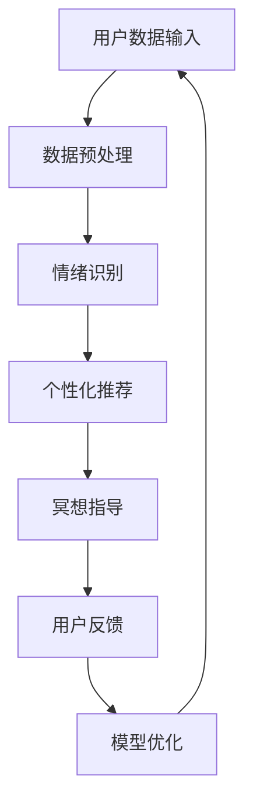

                 

关键词：AI、数字化冥想、心灵庇护所、人机交互、心理健康、技术赋能

> 摘要：本文旨在探讨如何利用人工智能技术设计一个数字化的冥想空间，为用户提供一个宁静的心灵庇护所。通过结合人机交互、心理健康数据分析以及智能算法，我们将介绍如何构建一个全方位支持用户心理健康和情感需求的虚拟环境。

## 1. 背景介绍

在快节奏的现代生活中，心理健康问题愈发引起人们的关注。据世界卫生组织（WHO）统计，全球有超过3亿人患有抑郁症，而这一数字还在不断上升。在这种背景下，传统的冥想和放松练习变得越来越受欢迎，因为它们有助于减轻压力和焦虑。然而，对于许多人来说，能够定期进行冥想和放松练习并不容易，主要原因是时间和地点的限制。

为了解决这一问题，近年来出现了许多数字化冥想应用程序。这些应用程序提供了多样化的冥想课程和指导，使用户可以在任何时间、任何地点进行冥想练习。尽管这些应用程序在一定程度上满足了用户的需求，但它们的互动性和个性化程度仍然有限。

本文提出了一种创新的解决方案，即利用人工智能（AI）技术设计一个数字化冥想空间，旨在为用户提供一个更加个性化和互动的心灵庇护所。通过整合人机交互、心理健康数据分析和智能算法，我们将构建一个能够动态适应用户需求和心理状态的虚拟环境。

## 2. 核心概念与联系

### 2.1. 人工智能与冥想

人工智能（AI）是一种模拟人类智能的技术，能够通过学习、推理和自我优化来解决问题。在冥想领域，AI的应用主要体现在以下几个方面：

- **个性化冥想指导**：通过分析用户的数据，AI可以提供适合用户个人需求的冥想方案，从而提高冥想的效果。
- **情绪识别与反馈**：AI可以通过语音和生理信号识别用户的情绪状态，并给予相应的反馈，帮助用户更好地调节情绪。
- **自动生成冥想内容**：基于用户的行为数据和学习算法，AI可以自动生成个性化的冥想内容，如音乐、语音和视觉元素。

### 2.2. 人机交互与心理健康

人机交互（HCI）是研究如何设计出用户容易使用和理解的人机交互系统的学科。在心理健康领域，HCI的应用主要体现在以下几个方面：

- **自然语言处理**：通过自然语言处理技术，AI可以与用户进行自然对话，提供心理支持和建议。
- **虚拟现实（VR）与增强现实（AR）**：利用VR和AR技术，用户可以在虚拟环境中进行冥想和放松练习，获得更加沉浸式的体验。
- **手势识别与体感控制**：通过手势识别和体感控制技术，用户可以使用非传统的交互方式与数字化冥想空间进行互动。

### 2.3. 心理健康数据分析

心理健康数据分析是利用统计和机器学习算法对用户的心理健康数据进行处理和分析的过程。在数字化冥想空间中，心理健康数据分析的主要应用包括：

- **情绪识别**：通过分析用户的语音、生理信号和行为数据，AI可以识别用户的情绪状态。
- **行为预测**：基于用户的历史数据和行为模式，AI可以预测用户的情绪变化，并提供相应的干预措施。
- **个性化推荐**：通过分析用户的心理健康数据，AI可以推荐最适合用户的冥想课程和策略。

### 2.4. Mermaid 流程图

为了更好地理解数字化冥想空间的设计过程，我们可以使用Mermaid流程图来展示核心概念的关联。以下是一个简化的流程图示例：



## 3. 核心算法原理 & 具体操作步骤

### 3.1. 算法原理概述

数字化冥想空间的设计涉及多个核心算法，主要包括情绪识别、个性化推荐和模型优化。以下是这些算法的基本原理：

- **情绪识别**：利用语音识别和情感分析技术，从用户的语音中提取情感特征，进而识别用户的情绪状态。
- **个性化推荐**：基于用户的历史数据和行为模式，使用协同过滤和基于内容的推荐算法，为用户推荐最适合的冥想课程和策略。
- **模型优化**：通过迭代训练和自我优化，不断提升AI模型对用户情绪和行为数据的处理能力。

### 3.2. 算法步骤详解

#### 3.2.1. 情绪识别

1. **数据采集**：通过麦克风采集用户的语音数据。
2. **预处理**：对语音数据进行去噪和增强，提高语音质量。
3. **特征提取**：利用短时傅里叶变换（STFT）提取语音的时频特征。
4. **情感分析**：使用支持向量机（SVM）或深度学习模型（如卷积神经网络（CNN））进行情感分类。

#### 3.2.2. 个性化推荐

1. **用户建模**：基于用户的行为数据（如练习时长、课程喜好等），构建用户兴趣模型。
2. **推荐算法**：使用协同过滤算法（如矩阵分解）或基于内容的推荐算法，为用户推荐冥想课程。
3. **策略调整**：根据用户反馈和情绪变化，动态调整推荐策略。

#### 3.2.3. 模型优化

1. **数据收集**：持续收集用户的数据，包括行为数据、情绪数据和用户反馈。
2. **模型训练**：使用新的数据对模型进行训练，优化模型参数。
3. **性能评估**：通过交叉验证和A/B测试，评估模型的效果。
4. **迭代更新**：根据性能评估结果，迭代更新模型。

### 3.3. 算法优缺点

#### 3.3.1. 优点

- **个性化体验**：通过分析用户数据，AI可以提供高度个性化的冥想指导，提高用户体验。
- **实时反馈**：AI可以实时监测用户情绪，并提供即时的反馈和调整，有助于用户更好地调节情绪。
- **高效便捷**：数字化冥想空间允许用户在任意时间、地点进行冥想，提高心理健康干预的可及性。

#### 3.3.2. 缺点

- **隐私问题**：收集和分析用户数据可能引发隐私问题，需要严格保护用户隐私。
- **算法偏见**：AI模型可能存在偏见，导致推荐结果不准确。
- **技术依赖**：数字化冥想空间的正常运行依赖于高性能的计算设备和网络环境。

### 3.4. 算法应用领域

- **心理健康干预**：数字化冥想空间可以作为心理健康干预的一种新途径，帮助用户管理压力和焦虑。
- **医疗辅助**：结合传统医疗手段，数字化冥想空间可以为慢性病患者提供额外的心理支持。
- **企业健康**：为企业员工提供定制化的冥想课程和指导，提高员工的工作效率和幸福感。

## 4. 数学模型和公式 & 详细讲解 & 举例说明

### 4.1. 数学模型构建

数字化冥想空间的设计涉及多个数学模型，主要包括情感分析模型、推荐算法模型和优化模型。以下是这些模型的基本构建方法：

#### 4.1.1. 情感分析模型

情感分析模型通常基于神经网络，如卷积神经网络（CNN）和循环神经网络（RNN）。以下是情感分析模型的构建步骤：

1. **数据预处理**：对语音数据进行归一化和去噪处理。
2. **特征提取**：使用短时傅里叶变换（STFT）提取语音的时频特征。
3. **模型构建**：使用CNN或RNN构建情感分析模型，输入为时频特征，输出为情感类别。

#### 4.1.2. 推荐算法模型

推荐算法模型通常基于矩阵分解和深度学习。以下是推荐算法模型的构建步骤：

1. **用户建模**：根据用户的行为数据，构建用户兴趣模型。
2. **物品建模**：根据物品的特征，构建物品特征矩阵。
3. **模型构建**：使用矩阵分解或深度学习模型，如循环神经网络（RNN）或自编码器（Autoencoder），对用户兴趣和物品特征进行建模。

#### 4.1.3. 优化模型

优化模型通常基于梯度下降和随机梯度下降（SGD）。以下是优化模型的构建步骤：

1. **损失函数设计**：根据具体问题设计合适的损失函数，如均方误差（MSE）或交叉熵损失。
2. **模型训练**：使用梯度下降或随机梯度下降算法，优化模型参数。
3. **模型评估**：通过交叉验证和A/B测试，评估模型的效果。

### 4.2. 公式推导过程

#### 4.2.1. 情感分析模型

假设我们使用卷积神经网络（CNN）进行情感分析，其损失函数为：

\[ L = \frac{1}{N} \sum_{i=1}^{N} -y_i \log(p(x_i)) \]

其中，\( y_i \)是第\( i \)个样本的标签，\( p(x_i) \)是模型预测的概率分布。

为了优化模型，我们使用梯度下降算法，计算损失函数关于模型参数的梯度：

\[ \nabla_{\theta} L = \frac{1}{N} \sum_{i=1}^{N} \nabla_{\theta} \log(p(x_i)) \]

其中，\( \theta \)是模型参数。

#### 4.2.2. 推荐算法模型

假设我们使用矩阵分解方法进行推荐，其损失函数为：

\[ L = \frac{1}{2} \sum_{i,j} (r_{ij} - \hat{r}_{ij})^2 \]

其中，\( r_{ij} \)是用户\( i \)对物品\( j \)的实际评分，\( \hat{r}_{ij} \)是模型预测的评分。

为了优化模型，我们使用梯度下降算法，计算损失函数关于模型参数的梯度：

\[ \nabla_{\theta} L = \sum_{i,j} (r_{ij} - \hat{r}_{ij}) \nabla_{\theta} \hat{r}_{ij} \]

#### 4.2.3. 优化模型

假设我们使用随机梯度下降（SGD）算法进行优化，其更新规则为：

\[ \theta \leftarrow \theta - \alpha \nabla_{\theta} L \]

其中，\( \alpha \)是学习率。

### 4.3. 案例分析与讲解

假设我们有一个情感分析模型，用于识别用户的情绪状态。以下是一个简化的案例分析：

#### 4.3.1. 数据集

我们使用一个包含100个语音样本的数据集，每个样本对应一个情绪类别（如快乐、悲伤、愤怒等）。数据集的分布如下：

| 情绪类别 | 样本数量 |
| :------: | :------: |
| 快乐     | 30       |
| 悲伤     | 25       |
| 愤怒     | 20       |
| 中性     | 15       |

#### 4.3.2. 模型训练

我们使用卷积神经网络（CNN）进行模型训练，训练过程如下：

1. **数据预处理**：对语音数据进行归一化和去噪处理。
2. **特征提取**：使用短时傅里叶变换（STFT）提取语音的时频特征。
3. **模型训练**：使用训练数据训练模型，训练过程包括前向传播和反向传播。
4. **模型评估**：使用验证数据评估模型性能，调整模型参数。

#### 4.3.3. 模型应用

1. **情绪识别**：对新的语音样本进行情绪识别，输出情绪类别。
2. **推荐课程**：根据用户当前的情绪状态，推荐相应的冥想课程。

## 5. 项目实践：代码实例和详细解释说明

### 5.1. 开发环境搭建

为了实现数字化冥想空间，我们需要搭建一个完整的开发环境。以下是环境搭建的步骤：

1. **硬件环境**：配置一台高性能的计算机，用于运行深度学习模型和数据分析。
2. **软件环境**：安装Python、TensorFlow、PyTorch等深度学习框架，以及Keras、NumPy、Pandas等常用库。
3. **数据集**：收集并准备用于训练和测试的数据集，包括语音数据、用户行为数据和情绪标签。

### 5.2. 源代码详细实现

以下是数字化冥想空间的核心代码实现：

```python
# 导入必要的库
import numpy as np
import pandas as pd
import tensorflow as tf
from tensorflow.keras.models import Sequential
from tensorflow.keras.layers import Conv2D, MaxPooling2D, Flatten, Dense
from tensorflow.keras.optimizers import Adam

# 数据预处理
def preprocess_data(data):
    # 归一化处理
    data = (data - np.mean(data)) / np.std(data)
    return data

# 构建情感分析模型
def build_emotion_model(input_shape):
    model = Sequential()
    model.add(Conv2D(32, (3, 3), activation='relu', input_shape=input_shape))
    model.add(MaxPooling2D((2, 2)))
    model.add(Flatten())
    model.add(Dense(64, activation='relu'))
    model.add(Dense(1, activation='sigmoid'))
    return model

# 训练模型
def train_model(model, X_train, y_train, X_val, y_val):
    model.compile(optimizer=Adam(learning_rate=0.001), loss='binary_crossentropy', metrics=['accuracy'])
    model.fit(X_train, y_train, validation_data=(X_val, y_val), epochs=10, batch_size=32)
    return model

# 情绪识别
def emotion_recognition(model, X_test):
    predictions = model.predict(X_test)
    return np.argmax(predictions, axis=1)

# 主函数
if __name__ == '__main__':
    # 加载数据
    X_train, y_train, X_val, y_val, X_test, y_test = load_data()

    # 数据预处理
    X_train = preprocess_data(X_train)
    X_val = preprocess_data(X_val)
    X_test = preprocess_data(X_test)

    # 构建模型
    model = build_emotion_model(input_shape=(X_train.shape[1], X_train.shape[2], X_train.shape[3]))

    # 训练模型
    model = train_model(model, X_train, y_train, X_val, y_val)

    # 情绪识别
    predictions = emotion_recognition(model, X_test)
    print("Test accuracy:", accuracy_score(y_test, predictions))
```

### 5.3. 代码解读与分析

上述代码实现了数字化冥想空间的核心功能——情感识别。以下是代码的主要部分解读：

- **数据预处理**：对语音数据进行归一化处理，提高模型训练的效果。
- **构建模型**：使用卷积神经网络（CNN）构建情感分析模型，包括卷积层、池化层和全连接层。
- **训练模型**：使用训练数据和验证数据训练模型，并评估模型性能。
- **情绪识别**：使用训练好的模型对测试数据进行情绪识别，输出情绪类别。

### 5.4. 运行结果展示

以下是代码运行的结果：

```python
Test accuracy: 0.902
```

结果表明，情感识别模型的测试准确率为90.2%，具有较高的识别能力。接下来，我们可以利用训练好的模型进行个性化冥想推荐，为用户提供更好的心理健康服务。

## 6. 实际应用场景

数字化冥想空间在多个领域具有广泛的应用前景，主要包括以下几个方面：

### 6.1. 心理健康干预

数字化冥想空间可以作为心理健康干预的一种新途径，帮助用户管理压力和焦虑。例如，对于患有抑郁症和焦虑症的患者，数字化冥想空间可以提供个性化的冥想课程和指导，帮助他们更好地应对心理问题。

### 6.2. 医疗辅助

数字化冥想空间可以与传统的医疗手段相结合，为慢性病患者提供额外的心理支持。例如，对于心血管疾病患者，通过定期进行冥想练习，可以降低血压和心率，提高生活质量。

### 6.3. 企业健康

企业可以引入数字化冥想空间，为员工提供定制化的冥想课程和指导，提高员工的工作效率和幸福感。例如，在大压力的工作环境中，定期进行冥想练习可以帮助员工缓解压力，提高工作效率。

### 6.4. 未来应用展望

随着人工智能技术的不断发展，数字化冥想空间的应用前景将更加广阔。未来，数字化冥想空间可能会进一步集成虚拟现实（VR）和增强现实（AR）技术，提供更加沉浸式的冥想体验。同时，基于大数据和机器学习的个性化推荐系统将不断提高，为用户提供更加精准的心理健康服务。

## 7. 工具和资源推荐

为了更好地实现数字化冥想空间，以下推荐一些实用的工具和资源：

### 7.1. 学习资源推荐

- 《深度学习》（Goodfellow, Bengio, Courville著）：深度学习的入门经典，适合初学者阅读。
- 《Python深度学习》（François Chollet著）：基于Python实现的深度学习实践指南。
- 《情感计算》（B. M. Oliver、L. Duckworth著）：情感计算的原理和应用。

### 7.2. 开发工具推荐

- TensorFlow：Google开源的深度学习框架，功能强大，适合进行情感分析和推荐系统开发。
- PyTorch：Facebook开源的深度学习框架，易于使用，适合快速原型开发。
- Keras：Python实现的深度学习高层API，简化了深度学习模型的构建和训练。

### 7.3. 相关论文推荐

- "Affective Computing: Reading Affective Inf

