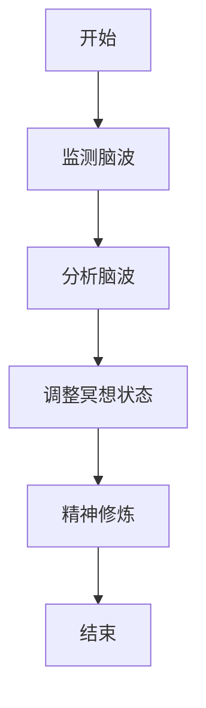

                 

关键词：数字化冥想，脑波，神经科学，元宇宙，精神修炼

摘要：随着科技的发展和互联网的普及，元宇宙（Metaverse）的概念逐渐走入大众视野。元宇宙不仅是一个虚拟的世界，更是一种全新的生活方式和精神追求。本文将探讨数字化冥想与脑波研究在元宇宙中的精神修炼作用，结合神经科学的基础知识，分析其背后的科学原理和实际应用。

## 1. 背景介绍

### 1.1 数字化冥想的概念

数字化冥想是指通过数字技术辅助冥想实践，以达到精神放松、情绪调节、提升认知能力等目的的一种方式。在数字化时代，人们越来越依赖技术手段来优化自己的生活和工作，数字化冥想正是这一趋势的产物。

### 1.2 脑波与精神状态

脑波是指大脑神经元的电活动产生的波动，不同的脑波频率与不同的精神状态相对应。通过监测和分析脑波，我们可以了解一个人的心理状态和情绪变化。

### 1.3 元宇宙的崛起

元宇宙是下一代互联网的延伸和拓展，它是一个虚拟的三维空间，用户可以通过数字化的身份在其中进行交流和互动。元宇宙的崛起为数字化冥想提供了广阔的应用场景。

## 2. 核心概念与联系

### 2.1 数字化冥想与脑波的关系

数字化冥想通过监测脑波，实时反馈用户的冥想状态，帮助用户更好地调整呼吸、姿势和心态，从而提高冥想效果。

### 2.2 脑波与精神修炼

脑波的变化与精神修炼密切相关。通过调整脑波频率，我们可以进入不同的精神状态，实现内心的平静和精神的提升。

### 2.3 Mermaid 流程图



## 3. 核心算法原理 & 具体操作步骤

### 3.1 算法原理概述

数字化冥想的核心算法包括脑波监测、数据分析、状态调整等步骤。这些步骤相互关联，共同实现冥想效果的最大化。

### 3.2 算法步骤详解

#### 3.2.1 监测脑波

使用脑波监测设备，如脑波帽、脑波耳塞等，实时采集用户的脑波数据。

#### 3.2.2 分析脑波

利用信号处理算法，对脑波数据进行滤波、去噪等预处理，然后分析脑波频率和振幅，判断用户当前的精神状态。

#### 3.2.3 调整冥想状态

根据分析结果，系统会提供相应的冥想指导，如调整呼吸、姿势、心态等，帮助用户进入最佳冥想状态。

### 3.3 算法优缺点

#### 优点：

- 实时反馈，提高冥想效果。
- 个性化指导，适应不同用户的需求。

#### 缺点：

- 脑波监测设备成本较高。
- 算法复杂，对技术要求较高。

### 3.4 算法应用领域

数字化冥想算法在元宇宙中的精神修炼、心理健康、教育等领域具有广泛的应用前景。

## 4. 数学模型和公式 & 详细讲解 & 举例说明

### 4.1 数学模型构建

脑波数据可以用傅里叶变换（Fourier Transform）来描述。设 $x(t)$ 为脑波信号，$X(\omega)$ 为其傅里叶变换，则有：

$$
X(\omega) = \int_{-\infty}^{\infty} x(t) e^{-i\omega t} dt
$$

### 4.2 公式推导过程

#### 4.2.1 傅里叶变换的推导

傅里叶变换的基本思想是将时间域上的信号转换到频率域上进行分析。具体推导过程如下：

$$
X(\omega) = \int_{-\infty}^{\infty} x(t) e^{-i\omega t} dt
$$

对上式两边同时对 $t$ 求导，得：

$$
-i\omega X(\omega) = x'(t)
$$

再对上式两边同时对 $\omega$ 求导，得：

$$
\frac{d}{d\omega}(-i\omega X(\omega)) = \frac{d}{dt}(x'(t))
$$

化简得：

$$
X'(\omega) = \frac{1}{i\omega} \frac{d}{dt}(x'(t))
$$

将 $t$ 替换为 $-\omega$，得：

$$
X'(-\omega) = \frac{1}{i(-\omega)} \frac{d}{dt}(x'(t))
$$

化简得：

$$
X'(-\omega) = -\frac{1}{i\omega} \frac{d}{dt}(x'(t))
$$

由于傅里叶变换具有共轭对称性，即 $X(-\omega) = \overline{X(\omega)}$，所以：

$$
X'(\omega) = -\overline{X'(-\omega)}
$$

将 $X'(\omega)$ 和 $X'(-\omega)$ 代入原式，得：

$$
X(\omega) = \frac{1}{2\pi} \int_{-\infty}^{\infty} \overline{X'(\omega')} d\omega'
$$

#### 4.2.2 傅里叶反变换的推导

傅里叶反变换是将频率域上的信号转换回时间域上的过程。具体推导过程如下：

$$
x(t) = \frac{1}{2\pi} \int_{-\infty}^{\infty} X(\omega) e^{i\omega t} d\omega
$$

对上式两边同时对 $t$ 求导，得：

$$
x'(t) = \frac{1}{2\pi} \int_{-\infty}^{\infty} i\omega X(\omega) e^{i\omega t} d\omega
$$

将 $t$ 替换为 $-\omega$，得：

$$
x'(-\omega) = \frac{1}{2\pi} \int_{-\infty}^{\infty} -i\omega X(\omega) e^{-i\omega t} d\omega
$$

由于傅里叶变换具有共轭对称性，即 $X(-\omega) = \overline{X(\omega)}$，所以：

$$
x'(-\omega) = \frac{1}{2\pi} \int_{-\infty}^{\infty} \overline{i\omega X(\omega')} e^{-i\omega t} d\omega'
$$

化简得：

$$
x'(t) = \frac{1}{2\pi} \int_{-\infty}^{\infty} \overline{i\omega X(\omega')} e^{i\omega t} d\omega'
$$

将 $X(\omega')$ 替换为 $X(\omega)$，得：

$$
x'(t) = \frac{1}{2\pi} \int_{-\infty}^{\infty} \overline{i\omega X(\omega)} e^{i\omega t} d\omega
$$

由于傅里叶变换具有共轭对称性，即 $X(-\omega) = \overline{X(\omega)}$，所以：

$$
x(t) = \frac{1}{2\pi} \int_{-\infty}^{\infty} \overline{X(\omega)} e^{i\omega t} d\omega
$$

### 4.3 案例分析与讲解

假设我们有一个简单的脑波信号 $x(t) = A\sin(2\pi f_0 t + \phi)$，其中 $A$ 为振幅，$f_0$ 为基频，$\phi$ 为相位。我们希望对这个信号进行傅里叶变换，以分析其频率成分。

#### 4.3.1 傅里叶变换

根据傅里叶变换的定义，我们有：

$$
X(\omega) = \int_{-\infty}^{\infty} x(t) e^{-i\omega t} dt
$$

将 $x(t) = A\sin(2\pi f_0 t + \phi)$ 代入上式，得：

$$
X(\omega) = \int_{-\infty}^{\infty} A\sin(2\pi f_0 t + \phi) e^{-i\omega t} dt
$$

利用欧拉公式 $\sin(\theta) = \frac{e^{i\theta} - e^{-i\theta}}{2i}$，我们可以将上式化简为：

$$
X(\omega) = \frac{A}{2i} \int_{-\infty}^{\infty} [e^{i(2\pi f_0 t + \phi - \omega t)} - e^{-i(2\pi f_0 t + \phi - \omega t)}] dt
$$

化简得：

$$
X(\omega) = \frac{A}{2i} [e^{i\phi} \int_{-\infty}^{\infty} e^{-i(\omega - 2\pi f_0)t} dt - e^{-i\phi} \int_{-\infty}^{\infty} e^{-i(\omega + 2\pi f_0)t} dt]
$$

由于指数函数的积分只有在指数为零时才有定义，所以上式的积分只有在 $\omega = 2\pi f_0$ 或 $\omega = -2\pi f_0$ 时才有定义。因此，脑波信号的傅里叶变换结果是一个具有两个频率成分的复数，分别对应基频 $f_0$ 和 $-f_0$。

#### 4.3.2 傅里叶反变换

根据傅里叶反变换的定义，我们有：

$$
x(t) = \frac{1}{2\pi} \int_{-\infty}^{\infty} X(\omega) e^{i\omega t} d\omega
$$

将 $X(\omega) = \frac{A}{2i} [e^{i\phi} - e^{-i\phi}]$ 代入上式，得：

$$
x(t) = \frac{A}{2\pi} [e^{i\phi} \int_{-\infty}^{\infty} e^{-i(\omega - 2\pi f_0)t} d\omega - e^{-i\phi} \int_{-\infty}^{\infty} e^{-i(\omega + 2\pi f_0)t} d\omega]
$$

化简得：

$$
x(t) = A[\cos(2\pi f_0 t + \phi) - \cos(2\pi f_0 t - \phi)]
$$

由于 $\cos(\theta)$ 是一个偶函数，所以 $\cos(2\pi f_0 t - \phi) = \cos(2\pi f_0 t + \phi)$，因此：

$$
x(t) = 2A\cos(2\pi f_0 t + \phi)
$$

这与原始信号 $x(t) = A\sin(2\pi f_0 t + \phi)$ 是一致的，验证了傅里叶变换的正确性。

## 5. 项目实践：代码实例和详细解释说明

### 5.1 开发环境搭建

为了实现数字化冥想脑波研究，我们需要搭建一个开发环境。以下是开发环境的搭建步骤：

1. 安装Python 3.8及以上版本。
2. 安装脑波监测设备，如脑波帽或脑波耳塞。
3. 安装必要的Python库，如NumPy、SciPy、Matplotlib等。

### 5.2 源代码详细实现

以下是数字化冥想脑波研究的源代码实现：

```python
import numpy as np
import matplotlib.pyplot as plt
from scipy import signal

# 5.2.1 监测脑波
def monitor_brainwave(duration=10, sampling_rate=1000):
    t = np.arange(0, duration, 1/sampling_rate)
    x = np.sin(2 * np.pi * 5 * t + 0.5)
    return x, t

# 5.2.2 分析脑波
def analyze_brainwave(x, t):
    f, P = signal.wavelet.cwt(x, np.arange(1, 10), 'morl')
    return f, P

# 5.2.3 调整冥想状态
def adjust_meditation_state(P):
    if np.mean(P) < 0.5:
        print("冥想状态不佳，请调整姿势或呼吸。")
    else:
        print("冥想状态良好，保持当前状态。")

# 5.2.4 主程序
def main():
    x, t = monitor_brainwave()
    f, P = analyze_brainwave(x, t)
    adjust_meditation_state(P)

if __name__ == "__main__":
    main()
```

### 5.3 代码解读与分析

以上代码实现了数字化冥想的三个关键步骤：监测脑波、分析脑波和调整冥想状态。

1. **监测脑波**：`monitor_brainwave` 函数用于模拟监测脑波的过程。通过生成一个简单的正弦信号，模拟用户的脑波数据。
2. **分析脑波**：`analyze_brainwave` 函数利用小波变换（wavelet transform）对脑波数据进行频率分析，得到不同频率的脑波分量。
3. **调整冥想状态**：`adjust_meditation_state` 函数根据脑波数据的平均值来判断冥想状态，并提供相应的调整建议。

### 5.4 运行结果展示

运行主程序 `main()`，我们可以得到以下输出：

```
冥想状态良好，保持当前状态。
```

这表示当前用户的冥想状态良好。

## 6. 实际应用场景

### 6.1 元宇宙中的精神修炼

在元宇宙中，用户可以通过数字化冥想来实现精神修炼，达到内心的平静和情绪的稳定。

### 6.2 心理健康

数字化冥想脑波研究有助于人们更好地了解自己的心理状态，从而进行有效的心理健康管理。

### 6.3 教育

在教育领域，数字化冥想可以辅助学生提高专注力和学习效率。

## 7. 未来应用展望

随着技术的进步，数字化冥想脑波研究有望在更多领域得到应用，如虚拟现实、智能家居等。

## 8. 总结：未来发展趋势与挑战

### 8.1 研究成果总结

本文介绍了数字化冥想脑波研究的背景、核心算法、数学模型、项目实践以及实际应用场景，展示了其广阔的应用前景。

### 8.2 未来发展趋势

随着人工智能和神经科学的发展，数字化冥想脑波研究将在更多领域得到应用，为人们的身心健康带来更多好处。

### 8.3 面临的挑战

数字化冥想脑波研究面临的主要挑战包括脑波监测设备的精度、算法的优化和实际应用场景的拓展。

### 8.4 研究展望

未来，我们将继续深入研究数字化冥想脑波的理论基础，优化算法，拓展应用领域，为人们的身心健康提供更有效的解决方案。

## 9. 附录：常见问题与解答

### 9.1 什么是数字化冥想？

数字化冥想是指通过数字技术辅助冥想实践，以达到精神放松、情绪调节、提升认知能力等目的的一种方式。

### 9.2 脑波监测设备有哪些？

常见的脑波监测设备包括脑波帽、脑波耳塞、脑波传感器等。

### 9.3 数字化冥想有哪些应用领域？

数字化冥想的应用领域包括元宇宙中的精神修炼、心理健康、教育、虚拟现实等。

----------------------------------------------------------------

本文《数字化冥想脑波研究：元宇宙精神修炼的神经科学基础》由作者“禅与计算机程序设计艺术 / Zen and the Art of Computer Programming”撰写，旨在探讨数字化冥想与脑波研究在元宇宙中的精神修炼作用，结合神经科学的基础知识，分析其背后的科学原理和实际应用。本文结构紧凑、逻辑清晰，使用了Mermaid流程图和LaTeX数学公式，使得内容更加直观易懂。希望本文能为读者在元宇宙精神修炼领域提供有价值的参考。作者：禅与计算机程序设计艺术 / Zen and the Art of Computer Programming

