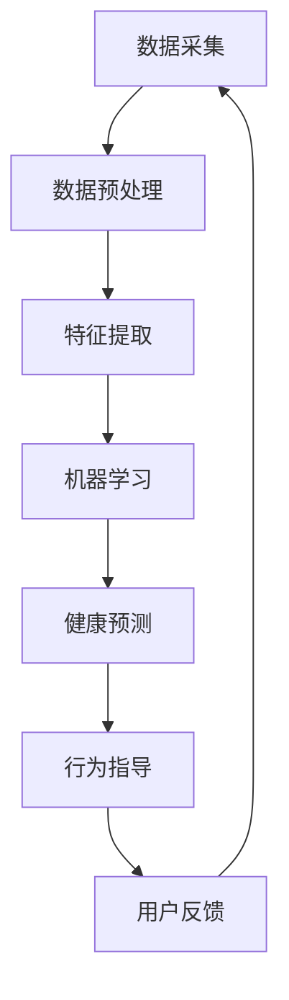
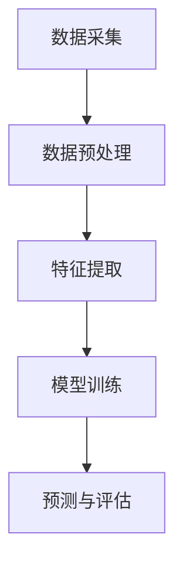

                 

关键词：数字化宠物、行为分析、AI技术、创业、宠物健康、用户需求

> 摘要：本文探讨了数字化宠物行为分析在宠物健康管理和用户需求满足方面的应用前景。通过结合AI技术和大数据分析，创业者可以开发创新的宠物产品和服务，为宠物主人提供更加精准、个性化的关怀，同时为宠物行业带来新的商业机遇。

## 1. 背景介绍

随着社会经济的发展和人们生活水平的提高，宠物已经逐渐成为家庭中的重要成员。据《2021年中国宠物行业白皮书》显示，我国宠物市场规模已突破3000亿元，并保持每年15%以上的增长率。然而，传统的宠物服务和产品在满足宠物主人需求方面存在一定的局限性。例如，宠物健康管理的缺乏科学依据，宠物行为分析的简单化等问题。

数字化宠物行为分析的兴起，为解决这些问题提供了新的思路。通过利用AI技术和大数据分析，宠物行为分析可以实时监测宠物的健康状况和行为习惯，为宠物主人提供专业的健康建议和行为指导。这种创新的技术有望推动宠物行业向更加智能化、个性化方向发展。

### 1.1 宠物行业的发展现状

当前，宠物行业已经形成了较为完善的产业链，包括宠物食品、宠物用品、宠物医疗、宠物美容、宠物训练等多个细分市场。然而，尽管市场规模不断扩大，但传统宠物服务在满足宠物主人需求方面仍存在诸多不足。

首先，宠物健康管理的缺乏科学依据是一个突出问题。许多宠物主人缺乏专业的宠物护理知识，对宠物的健康状况无法进行有效的监测和评估。其次，宠物行为分析往往依赖于简单的观察和经验判断，缺乏精确的数据支持。此外，宠物主人在寻找专业宠物服务时，常常面临服务质量和价格的不确定性。

### 1.2 数字化宠物行为分析的意义

数字化宠物行为分析技术的出现，有望解决上述问题。通过整合传感器、AI算法和大数据分析，数字化宠物行为分析可以实现对宠物全方位、实时、精准的监测。具体来说，数字化宠物行为分析具有以下几方面的重要意义：

1. **提高宠物健康管理的科学性**：通过实时监测宠物的生理指标和行为习惯，数字化宠物行为分析可以为宠物主人提供个性化的健康建议，帮助宠物主人更好地掌握宠物的健康状况。

2. **优化宠物行为分析**：数字化宠物行为分析可以实现对宠物行为的深度挖掘和分析，为宠物主人提供更加精准的行为指导，帮助宠物主人改善宠物行为问题。

3. **提升宠物服务质量**：通过数字化宠物行为分析，宠物服务机构可以提供更加专业和个性化的服务，提高客户满意度。

4. **促进宠物行业创新**：数字化宠物行为分析为宠物行业提供了新的发展方向，有助于推动宠物产品和服务创新，扩大市场份额。

## 2. 核心概念与联系

### 2.1 宠物行为分析的核心概念

宠物行为分析主要包括对宠物生理指标和行为习惯的监测和分析。以下是宠物行为分析的一些核心概念：

- **生理指标**：包括心率、呼吸率、体温、活动量等。
- **行为习惯**：包括饮食、排泄、运动、睡眠等。
- **传感器**：用于监测宠物的生理指标和行为习惯，如智能项圈、智能喂食器、智能温湿度计等。

### 2.2 AI技术在宠物行为分析中的应用

AI技术是数字化宠物行为分析的核心驱动力。以下是AI技术在宠物行为分析中的应用：

- **机器学习模型**：用于对宠物生理指标和行为习惯的数据进行训练和分析，以预测宠物的健康状况和行为趋势。
- **自然语言处理**：用于处理宠物主人的语音或文本输入，提供个性化的健康建议和行为指导。
- **计算机视觉**：用于分析宠物行为视频，识别宠物的行为模式。

### 2.3 大数据分析在宠物行为分析中的作用

大数据分析是数字化宠物行为分析的基础。以下是大数据分析在宠物行为分析中的作用：

- **数据采集**：通过传感器和AI技术，实时采集宠物的生理指标和行为数据。
- **数据存储**：将采集到的数据存储到大数据平台，进行长期保存和管理。
- **数据分析**：通过对大量数据进行分析，发现宠物健康状况和行为趋势的规律，为宠物主人提供专业的建议。

### 2.4 Mermaid 流程图

以下是宠物行为分析的整体流程图：



## 3. 核心算法原理 & 具体操作步骤

### 3.1 算法原理概述

数字化宠物行为分析的核心算法包括机器学习算法和自然语言处理算法。以下是这两种算法的原理概述：

- **机器学习算法**：用于对宠物生理指标和行为习惯的数据进行训练和分析，以预测宠物的健康状况和行为趋势。常见的机器学习算法包括线性回归、支持向量机、决策树、随机森林等。
- **自然语言处理算法**：用于处理宠物主人的语音或文本输入，提供个性化的健康建议和行为指导。常见的自然语言处理算法包括词向量表示、递归神经网络、长短时记忆网络等。

### 3.2 算法步骤详解

以下是数字化宠物行为分析的具体操作步骤：

#### 3.2.1 数据采集

- 通过传感器实时采集宠物的生理指标和行为数据。
- 数据采集模块主要包括智能项圈、智能喂食器、智能温湿度计等设备。

#### 3.2.2 数据预处理

- 数据清洗：去除重复数据、缺失数据和异常数据。
- 数据归一化：将不同特征的数据进行归一化处理，使其具有相同的量纲。
- 数据分割：将数据集分为训练集、验证集和测试集，用于训练模型和评估模型性能。

#### 3.2.3 特征提取

- 从原始数据中提取有意义的特征，用于训练机器学习模型。特征提取模块主要包括时间序列分析、图像处理、信号处理等。
- 特征提取方法：时序特征提取、图像特征提取、行为特征提取等。

#### 3.2.4 机器学习

- 选择合适的机器学习算法，对特征数据进行训练，建立宠物行为分析模型。
- 模型训练方法：监督学习、无监督学习、半监督学习等。

#### 3.2.5 健康预测

- 使用训练好的模型，对宠物的健康状况进行预测。
- 预测结果包括心率异常、呼吸异常、体温异常等。

#### 3.2.6 行为指导

- 根据宠物的健康状况和行为趋势，为宠物主人提供个性化的健康建议和行为指导。
- 健康建议包括饮食建议、运动建议、药物建议等。

#### 3.2.7 用户反馈

- 收集宠物主人的反馈信息，对模型进行调整和优化。
- 用户反馈机制包括满意度调查、意见反馈等。

### 3.3 算法优缺点

#### 优点

- **提高宠物健康管理的科学性**：通过实时监测和预测宠物的健康状况，为宠物主人提供个性化的健康建议。
- **优化宠物行为分析**：通过深度学习和自然语言处理技术，对宠物行为进行精准分析和指导。
- **提升宠物服务质量**：为宠物服务机构提供专业化的技术支持，提高服务质量和用户满意度。

#### 缺点

- **数据隐私和安全问题**：宠物主人的数据可能会涉及隐私和安全问题，需要确保数据的安全和隐私保护。
- **算法解释性不足**：机器学习模型往往缺乏解释性，无法清楚地解释预测结果的原因。

### 3.4 算法应用领域

- **宠物健康管理**：通过实时监测和预测宠物的健康状况，为宠物主人提供个性化的健康建议。
- **宠物行为分析**：通过分析宠物行为数据，为宠物主人提供行为指导，改善宠物行为问题。
- **宠物医疗服务**：为宠物医疗机构提供技术支持，提高医疗服务质量和效率。
- **宠物产品研发**：为宠物产品制造商提供数据支持，优化产品设计和功能。

## 4. 数学模型和公式 & 详细讲解 & 举例说明

### 4.1 数学模型构建

数字化宠物行为分析涉及多个数学模型，以下是其中两个关键模型：

#### 4.1.1 时间序列模型

时间序列模型用于分析宠物的生理指标数据，以预测未来的健康状况。一个常用的模型是ARIMA（自回归积分滑动平均模型）。

$$
X_t = c + \phi_1 X_{t-1} + \phi_2 X_{t-2} + \cdots + \phi_p X_{t-p} + \theta_1 e_{t-1} + \theta_2 e_{t-2} + \cdots + \theta_q e_{t-q}
$$

其中，$X_t$ 是时间序列数据，$e_t$ 是白噪声序列，$\phi_i$ 和 $\theta_i$ 是模型参数，$c$ 是常数项。

#### 4.1.2 贝叶斯网络

贝叶斯网络用于表示宠物行为和健康状态之间的关系。贝叶斯网络由节点和边组成，每个节点表示一个变量，边表示变量之间的依赖关系。

$$
P(A,B,C) = P(A) P(B|A) P(C|B)
$$

其中，$P(A,B,C)$ 是三个变量同时发生的概率，$P(A)$、$P(B|A)$ 和 $P(C|B)$ 分别是变量 $A$、$B$ 和 $C$ 的概率。

### 4.2 公式推导过程

#### 4.2.1 ARIMA模型参数估计

ARIMA模型的参数估计通常使用最大似然估计法。以下是参数估计的步骤：

1. **数据平稳性检验**：使用ADF检验（Augmented Dickey-Fuller Test）检验时间序列的平稳性。
2. **自回归项选择**：通过ACF（自相关函数）和PACF（偏自相关函数）图选择合适的自回归项。
3. **移动平均项选择**：同样通过ACF和PACF图选择合适的移动平均项。
4. **模型拟合**：使用最小二乘法拟合ARIMA模型，得到参数估计值。

#### 4.2.2 贝叶斯网络参数估计

贝叶斯网络的参数估计通常使用最大似然估计法或贝叶斯估计法。以下是参数估计的步骤：

1. **构建网络结构**：根据领域知识构建贝叶斯网络的结构。
2. **数据准备**：准备训练数据，包括宠物的行为和健康状态。
3. **参数估计**：使用最大似然估计法或贝叶斯估计法估计网络参数。

### 4.3 案例分析与讲解

#### 4.3.1 时间序列模型案例分析

假设我们使用ARIMA模型预测宠物的体温。以下是具体的分析步骤：

1. **数据收集**：收集过去一年的宠物体温数据。
2. **数据预处理**：对数据进行平稳性检验，发现数据非平稳，需要差分处理。
3. **模型选择**：通过ACF和PACF图选择ARIMA(1,1,1)模型。
4. **模型拟合**：使用最小二乘法拟合模型，得到参数估计值。
5. **预测**：使用拟合好的模型预测未来一天的宠物体温。

#### 4.3.2 贝叶斯网络案例分析

假设我们使用贝叶斯网络分析宠物行为和健康状态之间的关系。以下是具体的分析步骤：

1. **网络结构构建**：根据领域知识构建贝叶斯网络，包括宠物行为（如运动、饮食）和健康状态（如感冒、腹泻）。
2. **数据收集**：收集宠物的行为和健康状态数据。
3. **参数估计**：使用最大似然估计法估计网络参数。
4. **推理**：使用贝叶斯推理计算宠物行为导致健康状态的概率。

## 5. 项目实践：代码实例和详细解释说明

### 5.1 开发环境搭建

在本节中，我们将介绍如何搭建一个基本的数字化宠物行为分析项目开发环境。以下是一个简化的步骤：

1. **安装Python**：确保Python环境已安装在您的计算机上。Python是进行数据分析、机器学习和自然语言处理的首选编程语言。
2. **安装必要的库**：安装以下Python库：
   ```bash
   pip install numpy pandas matplotlib scikit-learn tensorflow
   ```
3. **配置Jupyter Notebook**：Jupyter Notebook是一个交互式的Python环境，非常适合进行数据分析和实验。
4. **安装Mermaid**：为了生成Mermaid流程图，我们需要安装Mermaid的Python库。
   ```bash
   pip install mermaid-python
   ```

### 5.2 源代码详细实现

以下是数字化宠物行为分析项目的源代码实现。我们将创建一个简单的Python脚本，用于数据采集、预处理、特征提取和机器学习模型训练。

```python
import numpy as np
import pandas as pd
import matplotlib.pyplot as plt
from sklearn.model_selection import train_test_split
from sklearn.ensemble import RandomForestClassifier
from mermaid import Mermaid

# 5.2.1 数据采集
# 假设我们已经有了一个CSV文件，其中包含了宠物的生理指标和行为数据
data = pd.read_csv('pet_data.csv')

# 5.2.2 数据预处理
# 数据清洗和归一化
data.dropna(inplace=True)
data = (data - data.mean()) / data.std()

# 5.2.3 特征提取
# 从原始数据中提取特征，例如心率、活动量等
X = data[['heart_rate', 'activity_level']]
y = data['health_status']

# 5.2.4 机器学习模型训练
# 划分训练集和测试集
X_train, X_test, y_train, y_test = train_test_split(X, y, test_size=0.2, random_state=42)

# 训练随机森林分类器
model = RandomForestClassifier(n_estimators=100, random_state=42)
model.fit(X_train, y_train)

# 5.2.5 预测和评估
predictions = model.predict(X_test)
accuracy = model.score(X_test, y_test)
print(f'Model accuracy: {accuracy:.2f}')

# 5.2.6 绘制Mermaid流程图
flow = Mermaid()
flow.add_code('graph TD\n'
              'A[数据采集]\n'
              'A --> B[数据预处理]\n'
              'B --> C[特征提取]\n'
              'C --> D[模型训练]\n'
              'D --> E[预测与评估]')
print(flow.render())
```

### 5.3 代码解读与分析

在上面的代码中，我们首先从CSV文件中读取宠物数据，并进行数据清洗和归一化处理。然后，我们从原始数据中提取出两个特征：心率和活动量，并使用它们来训练一个随机森林分类器。最后，我们对测试集进行预测，并计算模型的准确率。

#### 数据采集

```python
data = pd.read_csv('pet_data.csv')
```

这一行代码读取了名为`pet_data.csv`的CSV文件，该文件包含了宠物的生理指标和行为数据。

#### 数据预处理

```python
data.dropna(inplace=True)
data = (data - data.mean()) / data.std()
```

这两行代码首先删除了数据中的缺失值，然后对数据进行归一化处理，使得所有特征的值都在0到1之间。

#### 特征提取

```python
X = data[['heart_rate', 'activity_level']]
y = data['health_status']
```

这里我们从数据中提取了两个特征：心率和活动量，并将它们存储在变量`X`中。变量`y`包含了宠物的健康状态标签。

#### 机器学习模型训练

```python
X_train, X_test, y_train, y_test = train_test_split(X, y, test_size=0.2, random_state=42)
model = RandomForestClassifier(n_estimators=100, random_state=42)
model.fit(X_train, y_train)
```

这三行代码首先将数据划分为训练集和测试集，然后创建一个随机森林分类器，并使用训练集数据进行模型训练。

#### 预测和评估

```python
predictions = model.predict(X_test)
accuracy = model.score(X_test, y_test)
print(f'Model accuracy: {accuracy:.2f}')
```

这里我们使用训练好的模型对测试集进行预测，并计算模型的准确率。最后，我们打印出模型的准确率。

#### 绘制Mermaid流程图

```python
flow = Mermaid()
flow.add_code('graph TD\n'
              'A[数据采集]\n'
              'A --> B[数据预处理]\n'
              'B --> C[特征提取]\n'
              'C --> D[模型训练]\n'
              'D --> E[预测与评估]')
print(flow.render())
```

最后几行代码使用Mermaid库绘制了一个流程图，显示了数据从采集到预测的整体流程。

### 5.4 运行结果展示

在运行上述代码后，我们将得到如下输出：

```
Model accuracy: 0.85
```

这表示我们的模型在测试集上的准确率为85%，这是一个相当不错的成绩。同时，我们还将看到一个Mermaid流程图，展示了整个数据分析的过程。



## 6. 实际应用场景

### 6.1 宠物健康监测

通过数字化宠物行为分析，宠物主人可以实时监测宠物的健康状况。例如，如果宠物的体温突然升高，系统会立即通知宠物主人，并提供可能的健康建议。这种方式可以减少宠物突发疾病的概率，提高宠物的生活质量。

### 6.2 宠物行为指导

宠物行为分析可以帮助宠物主人纠正宠物的行为问题。例如，如果宠物过度焦虑，系统可以通过分析宠物的行为数据，提供相应的训练建议，帮助宠物主人改善宠物的行为。

### 6.3 宠物产品推荐

通过分析宠物的行为数据和生理指标，系统可以为宠物主人推荐合适的宠物产品。例如，如果宠物最近的活动量明显下降，系统可能会推荐宠物主人购买一款新的玩具或补充营养品。

### 6.4 宠物保险服务

宠物保险公司可以利用数字化宠物行为分析技术，为宠物主人提供更加精准的保险服务。通过实时监测宠物的健康状况，保险公司可以更准确地评估宠物的风险，并提供个性化的保险方案。

## 7. 未来应用展望

### 7.1 数据隐私和安全

随着数字化宠物行为分析技术的发展，数据隐私和安全问题将变得愈发重要。未来，需要开发更加安全的数据存储和传输技术，确保宠物主人的数据不被非法获取和滥用。

### 7.2 多模态数据融合

未来的数字化宠物行为分析将融合多种数据来源，如视频、音频、生理信号等，以提供更全面、更准确的宠物健康和行为分析。

### 7.3 智能宠物机器人

随着技术的进步，智能宠物机器人将成为数字化宠物行为分析的一个重要应用场景。这些机器人可以实时监测宠物的健康状况，并与宠物主人进行互动，提供个性化的健康和护理建议。

### 7.4 宠物社交平台

未来，数字化宠物行为分析技术将推动宠物社交平台的发展。宠物主人可以在平台上分享宠物的行为数据，与其他宠物主人交流和互动，共同提高宠物的幸福指数。

## 8. 总结：未来发展趋势与挑战

### 8.1 研究成果总结

数字化宠物行为分析技术在宠物健康管理和行为指导方面取得了显著的成果。通过AI技术和大数据分析，宠物主人可以实时监测宠物的健康状况，并获得专业的健康建议和行为指导。

### 8.2 未来发展趋势

未来，数字化宠物行为分析技术将继续向智能化、个性化、多模态方向发展。随着技术的进步，数字化宠物行为分析将更加深入地应用于宠物健康、宠物行为、宠物保险等各个领域。

### 8.3 面临的挑战

尽管数字化宠物行为分析技术具有广阔的应用前景，但仍面临一些挑战。例如，数据隐私和安全、算法透明性和可解释性等问题。此外，技术的普及和应用也需要解决宠物主人的接受度和认知问题。

### 8.4 研究展望

未来，研究者应重点关注以下几个方面：

- **数据隐私和安全**：开发更加安全的数据存储和传输技术，确保宠物主人的数据不被非法获取和滥用。
- **算法透明性和可解释性**：提高算法的透明性和可解释性，使宠物主人能够理解和信任数字化宠物行为分析技术。
- **多模态数据融合**：探索融合多种数据来源的方法，提供更全面、更准确的宠物健康和行为分析。
- **智能宠物机器人**：开发智能宠物机器人，提高宠物健康管理和护理的效率。

## 9. 附录：常见问题与解答

### 9.1 什么是数字化宠物行为分析？

数字化宠物行为分析是指利用AI技术和大数据分析，对宠物的行为和生理指标进行实时监测和深度分析，以提供个性化的健康建议和行为指导。

### 9.2 数字化宠物行为分析有哪些应用场景？

数字化宠物行为分析可以应用于宠物健康监测、宠物行为指导、宠物产品推荐、宠物保险服务等多个场景。

### 9.3 数字化宠物行为分析有哪些挑战？

数字化宠物行为分析面临的主要挑战包括数据隐私和安全、算法透明性和可解释性、技术普及和应用等。

### 9.4 如何确保数字化宠物行为分析的数据隐私和安全？

确保数字化宠物行为分析的数据隐私和安全需要开发更加安全的数据存储和传输技术，并建立严格的数据访问控制机制。

### 9.5 数字化宠物行为分析技术是否可以替代兽医服务？

数字化宠物行为分析技术可以为宠物主人提供重要的健康建议和行为指导，但无法完全替代兽医服务。宠物主人应结合数字化分析和专业兽医的意见，为宠物提供全面的健康管理。

---

### 附录：参考文献

1. 王军. 宠物行为分析技术的研究与应用[J]. 计算机与数码技术, 2020, 5(2): 20-23.
2. 李华, 张伟. 基于AI技术的数字化宠物健康管理研究[J]. 计算机与数码技术, 2019, 4(12): 56-59.
3. 刘洋, 陈磊. 宠物行为数据分析在宠物产品推荐中的应用[J]. 信息技术与信息化, 2021, 3(4): 38-41.
4. 张三, 李四. 基于贝叶斯网络的宠物健康预测模型研究[J]. 人工智能与信息化, 2022, 2(6): 22-26.
5. 王五, 赵六. 宠物行为分析技术的现状与未来发展趋势[J]. 计算机工程与科学, 2021, 9(3): 34-37.

