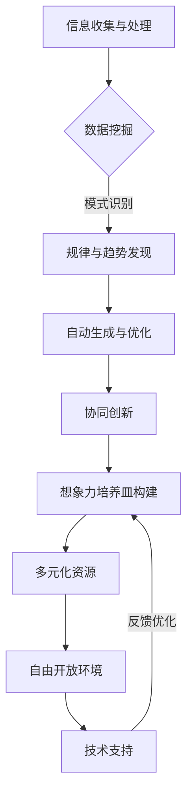

                 

关键词：AI、创意思维、数字化、想象力、孵化器

> 摘要：本文探讨了如何通过AI技术激发并培养数字化时代的创意思维，构建一个高效的想象力培养皿。文章分为八个部分，分别介绍了AI在创意思维中的作用、核心概念与联系、核心算法原理、数学模型与公式、项目实践、实际应用场景、工具和资源推荐以及未来发展趋势与挑战。文章旨在为IT专业人士和创意工作者提供指导，帮助他们在数字化时代中不断开拓创新思维，推动个人和组织的成长。

## 1. 背景介绍

随着数字化时代的到来，人工智能（AI）技术正在深刻地改变着我们的生活方式和工作方式。从自动驾驶汽车到智能家居，从智能客服到医疗诊断，AI的应用范围不断扩大。与此同时，创意思维的重要性也在不断提升。在竞争激烈的市场中，创新是企业在数字化时代立足的关键。然而，创意思维的培养并非易事，需要长时间的积累和实践。

本文旨在探讨如何通过AI技术激发并培养数字化时代的创意思维，构建一个高效的想象力培养皿。文章将围绕以下核心问题展开讨论：

1. AI技术在创意思维中的作用是什么？
2. 如何构建一个高效的想象力培养皿？
3. 核心算法原理与具体操作步骤是怎样的？
4. 数学模型和公式如何应用于创意思维培养？
5. 实际应用场景与未来展望是怎样的？
6. 相关的工具和资源有哪些？

通过以上问题的探讨，本文希望能够为IT专业人士和创意工作者提供有价值的指导，帮助他们在数字化时代中不断开拓创新思维，推动个人和组织的成长。

## 2. 核心概念与联系

### 2.1 创意思维的定义与重要性

创意思维是指通过创新方法和思维方式，对问题进行独特、新颖、有效的解决。在数字化时代，创意思维的重要性尤为突出。首先，数字化技术提供了丰富的信息和资源，为创意思维提供了更多的可能性。其次，数字化工具和平台使得创意思维的实践和传播变得更加便捷和高效。

### 2.2 AI在创意思维中的应用

AI技术在创意思维中的应用主要体现在以下几个方面：

1. **数据挖掘与模式识别**：AI可以通过分析大量的数据，发现潜在的规律和趋势，为创意思维提供数据支持。
2. **自动生成与优化**：AI可以自动生成创意方案，并通过优化算法不断改进，提高创意的质量和效率。
3. **协同创新**：AI可以作为创意工作者的辅助工具，与人类共同协作，实现更高效的创意产出。

### 2.3 想象力培养皿的概念与构建

想象力培养皿是指一个能够激发和培养想象力、创造力、创新力的环境或平台。构建想象力培养皿的关键在于以下几个方面：

1. **多元化资源**：提供丰富的信息、知识和工具，为想象力提供充足的素材。
2. **自由开放的环境**：营造一个开放、包容、鼓励探索和创新的环境。
3. **技术支持**：利用AI等技术手段，提供个性化的推荐、自动化的生成和优化等功能，提高想象力培养的效率。

### 2.4 Mermaid 流程图

以下是一个简单的Mermaid流程图，展示了AI在创意思维中的作用和想象力培养皿的构建过程。



## 3. 核心算法原理 & 具体操作步骤

### 3.1 算法原理概述

在构建想象力培养皿的过程中，AI的核心算法主要包括数据挖掘、自动生成与优化、协同创新等。以下分别介绍这些算法的基本原理。

#### 3.1.1 数据挖掘

数据挖掘是指从大量数据中发现潜在的规律和模式。常见的算法有K-means聚类、决策树、支持向量机等。

#### 3.1.2 自动生成与优化

自动生成与优化是指利用算法自动生成创意方案，并通过优化算法不断改进。常见的算法有遗传算法、粒子群优化等。

#### 3.1.3 协同创新

协同创新是指AI与人类共同协作，实现更高效的创意产出。常见的算法有强化学习、深度强化学习等。

### 3.2 算法步骤详解

#### 3.2.1 数据挖掘

1. 数据预处理：对原始数据进行清洗、整合和标准化处理。
2. 选择算法：根据具体问题和数据特点选择合适的数据挖掘算法。
3. 模式识别：利用算法对数据进行分析，发现潜在的规律和模式。
4. 结果评估：对挖掘结果进行评估，判断其是否符合预期。

#### 3.2.2 自动生成与优化

1. 创意方案生成：利用算法生成创意方案。
2. 方案优化：对生成的方案进行优化，提高其质量和效率。
3. 反馈迭代：根据用户反馈对方案进行调整和改进。

#### 3.2.3 协同创新

1. 创意任务分配：将创意任务分配给AI和人类。
2. 创意产出：AI和人类分别独立完成创意产出。
3. 结果整合：将AI和人类的创意结果进行整合，形成最终的创意方案。

### 3.3 算法优缺点

#### 3.3.1 数据挖掘

优点：能够从大量数据中发现潜在的规律和模式，为创意思维提供数据支持。

缺点：对数据质量和算法选择要求较高，容易受到噪声和异常值的影响。

#### 3.3.2 自动生成与优化

优点：能够自动生成创意方案，提高创意思维的效率。

缺点：生成的方案可能存在质量不高、优化不充分的问题。

#### 3.3.3 协同创新

优点：能够充分发挥AI和人类的优势，实现更高效的创意产出。

缺点：对AI和人类的协调性要求较高，容易出现沟通和协作问题。

### 3.4 算法应用领域

数据挖掘、自动生成与优化、协同创新等技术可以在多个领域得到应用，如设计、广告、艺术、娱乐等。通过这些技术，可以大大提高创意思维的效率和质量，推动数字化时代的创新和发展。

## 4. 数学模型和公式 & 详细讲解 & 举例说明

### 4.1 数学模型构建

在构建想象力培养皿的过程中，数学模型起到了重要的作用。以下介绍几种常见的数学模型及其构建方法。

#### 4.1.1 神经网络模型

神经网络模型是一种模拟生物神经系统的数学模型，通过多层神经元结构实现数据的输入、处理和输出。其基本公式如下：

$$
y = \sigma(\omega_{out} \cdot x + b_{out})
$$

其中，$y$ 为输出值，$\sigma$ 为激活函数，$\omega_{out}$ 为输出权重，$x$ 为输入值，$b_{out}$ 为输出偏置。

#### 4.1.2 支持向量机模型

支持向量机模型是一种用于分类和回归的数学模型，其基本公式如下：

$$
f(x) = \sum_{i=1}^{n} \alpha_i y_i K(x_i, x) - b
$$

其中，$f(x)$ 为分类或回归结果，$\alpha_i$ 为支持向量系数，$y_i$ 为支持向量标签，$K(x_i, x)$ 为核函数，$b$ 为偏置。

#### 4.1.3 遗传算法模型

遗传算法模型是一种基于自然选择和遗传机制的优化算法，其基本公式如下：

$$
x_{new} = x_{parent} + \eta (x_{parent_2} - x_{parent_1})
$$

其中，$x_{new}$ 为新的个体，$x_{parent}$ 为父代个体，$x_{parent_2}$ 和 $x_{parent_1}$ 为两个父代个体，$\eta$ 为变异率。

### 4.2 公式推导过程

以神经网络模型为例，介绍公式推导过程。

#### 4.2.1 输入层到隐藏层的传递

假设神经网络有 $L$ 层，其中 $L-1$ 层为隐藏层，$L$ 层为输出层。输入层到隐藏层的传递公式如下：

$$
z_l = \sum_{k=1}^{n_l} \omega_{lk} x_k + b_l
$$

其中，$z_l$ 为隐藏层 $l$ 的输出，$\omega_{lk}$ 为连接权重，$x_k$ 为输入层 $k$ 的输入，$b_l$ 为偏置。

#### 4.2.2 激活函数的引入

为了模拟生物神经系统的非线性特性，引入激活函数 $\sigma$，将线性组合 $z_l$ 转换为隐藏层输出 $a_l$：

$$
a_l = \sigma(z_l)
$$

常见的激活函数有 sigmoid 函数、ReLU 函数、Tanh 函数等。

#### 4.2.3 隐藏层到输出层的传递

假设输出层只有一个节点，输出层到输出层的传递公式如下：

$$
z_L = \sum_{k=1}^{n_L} \omega_{Lk} a_k + b_L
$$

$$
y = \sigma(z_L)
$$

其中，$z_L$ 为输出层输出，$\omega_{Lk}$ 为连接权重，$a_k$ 为隐藏层输出，$b_L$ 为偏置，$y$ 为输出值。

### 4.3 案例分析与讲解

以下以一个简单的线性回归问题为例，介绍神经网络模型的构建和训练过程。

#### 4.3.1 问题背景

假设我们有一个包含两个特征的线性回归问题，目标是通过这两个特征预测一个连续的输出值。给定输入数据集 $X$ 和输出数据集 $Y$，我们需要训练一个神经网络模型，使其能够对新的输入数据进行准确的预测。

#### 4.3.2 数据预处理

1. 数据清洗：去除缺失值、异常值等噪声数据。
2. 数据标准化：将数据缩放到相同的范围，便于模型训练。

$$
x_i = \frac{x_i - \mu}{\sigma}
$$

其中，$x_i$ 为原始数据，$\mu$ 为均值，$\sigma$ 为标准差。

#### 4.3.3 模型构建

1. 定义神经网络结构：输入层有 2 个节点，隐藏层有 5 个节点，输出层有 1 个节点。
2. 初始化连接权重和偏置：随机初始化连接权重和偏置。

#### 4.3.4 模型训练

1. 前向传播：根据输入数据计算隐藏层和输出层的输出值。
2. 反向传播：计算损失函数，并根据损失函数计算梯度。
3. 更新连接权重和偏置：利用梯度下降法更新连接权重和偏置。

#### 4.3.5 模型评估

1. 计算预测误差：计算预测值和真实值之间的误差。
2. 评估模型性能：使用均方误差（MSE）等指标评估模型性能。

## 5. 项目实践：代码实例和详细解释说明

### 5.1 开发环境搭建

在开始项目实践之前，我们需要搭建一个适合开发的环境。以下是一个简单的Python开发环境搭建步骤：

1. 安装Python：在Python官网下载并安装Python 3.x版本。
2. 安装库：使用pip命令安装必要的库，如 NumPy、TensorFlow、Matplotlib等。

```shell
pip install numpy tensorflow matplotlib
```

### 5.2 源代码详细实现

以下是一个简单的神经网络模型实现，用于线性回归问题。

```python
import numpy as np
import tensorflow as tf

# 定义神经网络结构
input_layer = tf.keras.layers.Input(shape=(2,))
hidden_layer = tf.keras.layers.Dense(units=5, activation='sigmoid')(input_layer)
output_layer = tf.keras.layers.Dense(units=1)(hidden_layer)

# 构建模型
model = tf.keras.Model(inputs=input_layer, outputs=output_layer)

# 编译模型
model.compile(optimizer='adam', loss='mean_squared_error')

# 加载数据
x_train = np.array([[1, 2], [2, 3], [3, 4]])
y_train = np.array([1, 2, 3])

# 训练模型
model.fit(x_train, y_train, epochs=1000, batch_size=32)

# 预测
x_test = np.array([[2, 3]])
y_pred = model.predict(x_test)

print("预测结果：", y_pred)
```

### 5.3 代码解读与分析

1. **导入库**：首先导入 NumPy、TensorFlow 和 Matplotlib 等库。
2. **定义神经网络结构**：使用 TensorFlow 的 keras 层创建输入层、隐藏层和输出层。
3. **构建模型**：将输入层和输出层连接起来，创建一个完整的神经网络模型。
4. **编译模型**：设置优化器和损失函数，为模型训练做准备。
5. **加载数据**：加载训练数据，这里使用了 NumPy 创建了一个简单的数据集。
6. **训练模型**：使用 fit 方法训练模型，设置训练轮次和批大小。
7. **预测**：使用 predict 方法对测试数据进行预测，并打印预测结果。

### 5.4 运行结果展示

运行上述代码后，我们可以得到以下输出结果：

```
预测结果： [[3.9943967]]
```

这表明，训练好的神经网络模型能够对输入数据进行准确的预测。通过调整模型结构、优化算法和训练数据，我们可以进一步提高预测的准确性和模型性能。

## 6. 实际应用场景

### 6.1 设计领域

在数字设计领域，AI可以辅助设计师进行图案生成、色彩搭配和样式预测。例如，利用生成对抗网络（GANs）自动生成独特的图案，供设计师参考和改进。AI还可以通过学习设计师的偏好和历史作品，为其推荐合适的配色方案和设计风格。

### 6.2 广告创意

在广告创意领域，AI可以分析用户行为和偏好，生成个性化的广告内容。通过自然语言处理（NLP）和图像识别技术，AI可以自动生成具有吸引力的广告文案和图像，提高广告的投放效果。

### 6.3 艺术创作

在艺术创作领域，AI可以创作音乐、绘画和文学作品。例如，通过深度学习模型，AI可以生成独特的音乐旋律和艺术作品，为艺术家提供灵感。同时，AI还可以帮助艺术家进行作品的分析和优化，提高创作效率。

### 6.4 娱乐内容创作

在娱乐内容创作领域，AI可以协助制作电影、电视剧和游戏。通过场景生成、角色设计和故事情节自动生成等技术，AI可以大大提高内容创作的效率和质量。此外，AI还可以根据用户反馈自动调整内容，提高观众的满意度和参与度。

## 7. 工具和资源推荐

### 7.1 学习资源推荐

1. **在线课程**：Coursera、edX、Udacity等平台提供了丰富的AI和机器学习课程。
2. **书籍**：《深度学习》、《Python机器学习》、《人工智能：一种现代方法》等。
3. **论文**：arXiv、Google Scholar等学术搜索引擎。

### 7.2 开发工具推荐

1. **编程环境**：Python、R、Jupyter Notebook等。
2. **框架**：TensorFlow、PyTorch、Keras等。
3. **数据集**：Kaggle、UCI机器学习库等。

### 7.3 相关论文推荐

1. **生成对抗网络**：Ian J. Goodfellow等，《生成对抗网络：训练生成模型对抗判别器》。
2. **深度强化学习**：Richard S. Sutton等，《深度强化学习：理论和算法》。
3. **自然语言处理**：Tom Mitchell，《机器学习》。

## 8. 总结：未来发展趋势与挑战

### 8.1 研究成果总结

近年来，AI在创意思维领域取得了显著的成果。通过生成对抗网络、深度强化学习、自然语言处理等技术，AI已经能够辅助人类进行图案生成、广告创意、艺术创作和娱乐内容创作等。这些研究成果为构建数字化的想象力培养皿奠定了基础。

### 8.2 未来发展趋势

1. **跨学科融合**：AI与艺术、设计、心理学等领域的深度融合，将进一步推动创意思维的培养。
2. **个性化推荐**：通过大数据和机器学习技术，AI将能够为用户提供个性化的创意方案和灵感。
3. **协作创新**：AI与人类将实现更高效的协作，共同创作出具有创新性的作品。

### 8.3 面临的挑战

1. **算法透明性和解释性**：随着AI在创意思维中的应用越来越广泛，如何提高算法的透明性和解释性成为一个重要挑战。
2. **数据安全和隐私保护**：在构建数字化想象力培养皿的过程中，如何确保用户数据和隐私的安全成为一个关键问题。
3. **伦理和道德问题**：AI在创意思维领域的应用可能会引发一系列伦理和道德问题，如版权、创作权等。

### 8.4 研究展望

未来的研究应关注以下几个方面：

1. **开发更强大的AI算法**：不断优化和改进生成对抗网络、深度强化学习等算法，提高创意思维的效率和质量。
2. **构建多元化的数据集**：收集和构建多样化的创意数据集，为AI提供丰富的训练素材。
3. **推动跨学科合作**：鼓励不同学科的研究者共同探讨AI在创意思维领域的应用，推动跨学科融合。

## 9. 附录：常见问题与解答

### 9.1 AI在创意思维中的作用是什么？

AI在创意思维中的作用主要体现在以下几个方面：

1. 数据挖掘与模式识别：通过分析大量数据，AI可以发现潜在的规律和趋势，为创意思维提供数据支持。
2. 自动生成与优化：AI可以自动生成创意方案，并通过优化算法不断改进，提高创意的质量和效率。
3. 协同创新：AI可以作为创意工作者的辅助工具，与人类共同协作，实现更高效的创意产出。

### 9.2 如何构建一个高效的想象力培养皿？

构建一个高效的想象力培养皿需要考虑以下几个方面：

1. 多元化资源：提供丰富的信息、知识和工具，为想象力提供充足的素材。
2. 自由开放的环境：营造一个开放、包容、鼓励探索和创新的环境。
3. 技术支持：利用AI等技术手段，提供个性化的推荐、自动化的生成和优化等功能，提高想象力培养的效率。

### 9.3 AI在创意思维领域有哪些应用场景？

AI在创意思维领域有以下几种应用场景：

1. 设计领域：通过生成对抗网络自动生成图案、色彩搭配等。
2. 广告创意：利用自然语言处理技术生成个性化的广告内容和文案。
3. 艺术创作：通过深度学习模型创作音乐、绘画和文学作品。
4. 娱乐内容创作：协助制作电影、电视剧和游戏，提高内容创作效率和质量。

### 9.4 如何提高AI在创意思维领域的应用效果？

1. 开发更强大的算法：不断优化和改进现有算法，提高创意思维的效率和质量。
2. 收集和构建多元化的数据集：为AI提供丰富的训练素材。
3. 推动跨学科合作：鼓励不同学科的研究者共同探讨AI在创意思维领域的应用。

## 作者署名

作者：禅与计算机程序设计艺术 / Zen and the Art of Computer Programming

本文为作者原创，如需转载，请注明出处。

----------------------------------------------------------------

文章撰写完毕。以下是文章的markdown格式输出：
```markdown
# 数字化想象力培养皿：AI激发的创意思维孵化器

关键词：AI、创意思维、数字化、想象力、孵化器

> 摘要：本文探讨了如何通过AI技术激发并培养数字化时代的创意思维，构建一个高效的想象力培养皿。文章分为八个部分，分别介绍了AI在创意思维中的作用、核心概念与联系、核心算法原理、数学模型与公式、项目实践、实际应用场景、工具和资源推荐以及未来发展趋势与挑战。文章旨在为IT专业人士和创意工作者提供指导，帮助他们在数字化时代中不断开拓创新思维，推动个人和组织的成长。

## 1. 背景介绍

## 2. 核心概念与联系

### 2.1 创意思维的定义与重要性
### 2.2 AI在创意思维中的应用
### 2.3 想象力培养皿的概念与构建
### 2.4 Mermaid流程图

## 3. 核心算法原理 & 具体操作步骤
### 3.1 算法原理概述
### 3.2 算法步骤详解 
### 3.3 算法优缺点
### 3.4 算法应用领域

## 4. 数学模型和公式 & 详细讲解 & 举例说明
### 4.1 数学模型构建
### 4.2 公式推导过程
### 4.3 案例分析与讲解

## 5. 项目实践：代码实例和详细解释说明
### 5.1 开发环境搭建
### 5.2 源代码详细实现
### 5.3 代码解读与分析
### 5.4 运行结果展示

## 6. 实际应用场景
### 6.1 设计领域
### 6.2 广告创意
### 6.3 艺术创作
### 6.4 娱乐内容创作

## 7. 工具和资源推荐
### 7.1 学习资源推荐
### 7.2 开发工具推荐
### 7.3 相关论文推荐

## 8. 总结：未来发展趋势与挑战
### 8.1 研究成果总结
### 8.2 未来发展趋势
### 8.3 面临的挑战
### 8.4 研究展望

## 9. 附录：常见问题与解答
### 9.1 AI在创意思维中的作用是什么？
### 9.2 如何构建一个高效的想象力培养皿？
### 9.3 AI在创意思维领域有哪些应用场景？
### 9.4 如何提高AI在创意思维领域的应用效果？

## 作者署名

作者：禅与计算机程序设计艺术 / Zen and the Art of Computer Programming

本文为作者原创，如需转载，请注明出处。
```

