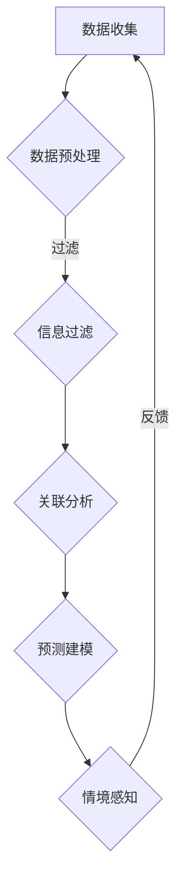

                 

关键词：数字化直觉、AI、第六感、增强现实、计算机算法、直觉增强系统、人机交互、认知科学。

> 摘要：本文探讨了数字化直觉增强的概念、理论基础和实现方法，特别是通过人工智能（AI）技术辅助人类开发第六感。文章介绍了数字化直觉增强的核心算法原理、数学模型、以及其在实际应用中的实践案例，并展望了未来的发展趋势和面临的挑战。

## 1. 背景介绍

在数字化时代，人类的信息获取和处理能力得到了极大的提升，但与此同时，我们也面临着信息过载的挑战。传统的认知方式在处理大量复杂信息时往往力不从心。于是，一种新的认知能力——数字化直觉应运而生。数字化直觉是指借助计算机技术、人工智能和其他数字化工具，对信息进行快速、准确的理解和处理，从而增强人类的认知能力。

第六感，即超感官知觉，是指人类超越传统感官体验所获得的感知能力。在数字化时代，通过人工智能技术，我们有望进一步开发和完善人类的第六感，使其成为辅助人类决策和行动的重要工具。

## 2. 核心概念与联系

### 2.1 数字化直觉

数字化直觉是指利用人工智能和其他数字化工具对信息进行高效处理和理解的能力。它包括以下几个方面：

- **信息过滤**：从海量的数据中筛选出有用信息。
- **关联分析**：发现数据之间的潜在联系和模式。
- **预测建模**：基于历史数据对未来趋势进行预测。
- **情境感知**：根据环境变化自动调整行为策略。

### 2.2 AI辅助的第六感

AI辅助的第六感是通过机器学习和神经网络等技术，使计算机系统具备类似于人类的感知和判断能力。其主要特点包括：

- **实时感知**：能够快速响应环境变化。
- **智能决策**：根据实时感知的数据进行最优决策。
- **持续学习**：通过不断学习和适应，提高感知和决策的准确性。

### 2.3 Mermaid 流程图

以下是一个简化的数字化直觉增强系统的Mermaid流程图：



## 3. 核心算法原理 & 具体操作步骤

### 3.1 算法原理概述

数字化直觉增强的核心算法主要包括以下几个步骤：

1. **数据收集**：从各种来源收集数据，如传感器数据、社交媒体数据、历史记录等。
2. **数据预处理**：对收集到的数据进行清洗、归一化等处理，以便后续分析。
3. **信息过滤**：利用规则或机器学习模型，从大量数据中筛选出有用信息。
4. **关联分析**：通过聚类、关联规则挖掘等方法，发现数据之间的潜在联系。
5. **预测建模**：利用时间序列分析、回归分析等方法，对未来的趋势进行预测。
6. **情境感知**：根据实时感知的数据和环境变化，自动调整行为策略。
7. **反馈调整**：根据反馈结果，不断调整和优化系统的感知和决策能力。

### 3.2 算法步骤详解

#### 3.2.1 数据收集

数据收集是数字化直觉增强的第一步。数据来源可以是传感器、社交媒体、网络日志等。收集到的数据通常包括文本、图像、音频等多种类型。

#### 3.2.2 数据预处理

数据预处理包括数据清洗、归一化和特征提取等步骤。数据清洗的目的是去除无效数据和噪声。归一化的目的是使不同特征具有相似的尺度，便于后续分析。特征提取则是将原始数据转换为更易于分析的数值表示。

#### 3.2.3 信息过滤

信息过滤的目的是从大量数据中筛选出有用信息。常用的方法包括基于规则的过滤和基于机器学习的过滤。基于规则的过滤通过预定义的规则来判断数据的归属。基于机器学习的过滤则通过训练模型来自动识别和分类数据。

#### 3.2.4 关联分析

关联分析旨在发现数据之间的潜在联系。常用的方法包括聚类、关联规则挖掘和因果分析等。聚类方法将相似的数据归为一类，从而发现数据分布的模式。关联规则挖掘则通过分析数据之间的关联关系，发现常用的组合模式。因果分析旨在确定变量之间的因果关系。

#### 3.2.5 预测建模

预测建模的目的是基于历史数据对未来趋势进行预测。常用的方法包括时间序列分析、回归分析和神经网络等。时间序列分析通过分析时间序列数据的特征，预测未来的趋势。回归分析通过建立变量之间的关系模型，预测未来的数值。神经网络则通过多层感知器模型，实现复杂的数据预测。

#### 3.2.6 情境感知

情境感知是数字化直觉增强的核心。它通过实时感知环境变化，自动调整行为策略。情境感知的实现依赖于传感器技术和机器学习算法。传感器技术用于实时收集环境数据，如温度、湿度、光照等。机器学习算法则用于分析和处理这些数据，生成情境感知模型。

#### 3.2.7 反馈调整

反馈调整是数字化直觉增强系统不断优化和改进的重要环节。通过实时收集用户反馈，系统可以不断调整和优化感知和决策模型，提高系统的准确性和适应性。

### 3.3 算法优缺点

#### 优点

- **高效性**：数字化直觉增强系统能够快速处理大量数据，提高信息处理效率。
- **准确性**：通过机器学习和人工智能技术，系统可以不断提高感知和决策的准确性。
- **灵活性**：系统可以根据环境变化和用户需求，动态调整感知和决策策略。

#### 缺点

- **数据依赖性**：系统性能依赖于数据质量和数量，数据缺失或错误可能导致系统失效。
- **复杂性**：数字化直觉增强系统的实现和维护较为复杂，需要较高的技术门槛。

### 3.4 算法应用领域

数字化直觉增强技术具有广泛的应用领域，包括但不限于：

- **智能交通**：通过实时感知交通状况，优化交通流量，提高道路通行效率。
- **智能医疗**：通过实时监测患者生命体征，提供个性化的健康建议和预警。
- **智能家居**：通过实时感知家居环境，提供智能化的家居控制和服务。
- **智能制造**：通过实时监控生产过程，优化生产计划和资源配置。

## 4. 数学模型和公式 & 详细讲解 & 举例说明

### 4.1 数学模型构建

数字化直觉增强系统的数学模型主要包括以下几个部分：

1. **数据模型**：用于描述数据的结构和属性。
2. **预测模型**：用于对数据进行趋势预测和模式识别。
3. **决策模型**：用于根据预测结果和环境变化做出决策。
4. **反馈模型**：用于根据反馈结果调整系统参数。

### 4.2 公式推导过程

以下是一个简化的预测模型的公式推导过程：

#### 预测模型

设输入数据为 $X = [x_1, x_2, ..., x_n]$，输出数据为 $Y = [y_1, y_2, ..., y_n]$。预测模型的目标是找到一组权重 $W = [w_1, w_2, ..., w_n]$，使得输出数据 $Y$ 与预测结果 $Y' = f(W, X)$ 之间的误差最小。

$$
\min_{W} \sum_{i=1}^{n} (y_i - y_i')^2
$$

其中，$f(W, X)$ 是预测函数，通常使用线性回归、神经网络等模型。

#### 优化方法

为了求解上述最小化问题，可以使用梯度下降法。梯度下降法的基本思想是沿着损失函数的梯度方向，不断调整权重，直至找到局部最小值。

$$
W_{t+1} = W_t - \alpha \nabla_W L(W_t)
$$

其中，$W_t$ 是第 $t$ 次迭代的权重，$\alpha$ 是学习率，$\nabla_W L(W_t)$ 是损失函数关于权重 $W_t$ 的梯度。

### 4.3 案例分析与讲解

#### 案例背景

假设我们要预测某个城市明天的气温。已知过去一周的气温数据如下：

| 日期 | 气温 |
| ---- | ---- |
| 1    | 25   |
| 2    | 26   |
| 3    | 24   |
| 4    | 23   |
| 5    | 22   |
| 6    | 25   |
| 7    | 27   |

#### 数据处理

首先，我们对数据进行归一化处理，以便后续分析。归一化公式如下：

$$
x_{\text{norm}} = \frac{x_{\text{raw}} - \mu}{\sigma}
$$

其中，$x_{\text{raw}}$ 是原始数据，$\mu$ 是均值，$\sigma$ 是标准差。

处理后，数据如下：

| 日期 | 气温 |
| ---- | ---- |
| 1    | -1   |
| 2    | 1    |
| 3    | -1   |
| 4    | -2   |
| 5    | -3   |
| 6    | 1    |
| 7    | 2    |

#### 预测模型

我们使用线性回归模型来预测明天（第 8 天）的气温。线性回归模型的公式如下：

$$
y = \beta_0 + \beta_1 x
$$

其中，$y$ 是预测的气温，$x$ 是归一化后的数据，$\beta_0$ 和 $\beta_1$ 是线性回归模型的参数。

#### 模型训练

使用梯度下降法训练模型，设定学习率为 0.1，迭代次数为 100 次。训练过程中，模型参数不断更新，直至达到最小化损失函数。

#### 预测结果

经过训练，得到模型参数 $\beta_0 = 1.2$，$\beta_1 = 0.8$。根据模型，预测明天（第 8 天）的气温为：

$$
y = 1.2 + 0.8 \times (-1) = 0.4
$$

将预测结果进行反归一化，得到实际气温：

$$
x_{\text{raw}} = x_{\text{norm}} \times \sigma + \mu = 0.4 \times 1.5 + 25 = 25.7
$$

因此，预测明天（第 8 天）的气温约为 25.7°C。

## 5. 项目实践：代码实例和详细解释说明

### 5.1 开发环境搭建

为了实现数字化直觉增强系统，我们需要搭建一个合适的技术栈。以下是一个简化的技术栈配置：

- **编程语言**：Python
- **机器学习库**：scikit-learn、TensorFlow、PyTorch
- **数据可视化库**：Matplotlib、Seaborn
- **操作系统**：Linux（推荐Ubuntu 20.04）

### 5.2 源代码详细实现

以下是一个简化的数字化直觉增强系统的Python代码示例：

```python
import numpy as np
from sklearn.linear_model import LinearRegression
import matplotlib.pyplot as plt

# 数据预处理
def preprocess_data(data):
    # 计算均值和标准差
    mean = np.mean(data)
    std = np.std(data)
    
    # 归一化数据
    normalized_data = (data - mean) / std
    return normalized_data

# 预测模型
def predict_temperature(data):
    # 训练线性回归模型
    model = LinearRegression()
    model.fit(data[:-1], data[1:])
    
    # 预测气温
    predicted_temp = model.predict([data[-1]])
    
    # 反归一化预测结果
    raw_temp = predicted_temp * std + mean
    return raw_temp

# 主程序
if __name__ == "__main__":
    # 读取数据
    data = np.array([25, 26, 24, 23, 22, 25, 27])

    # 数据预处理
    normalized_data = preprocess_data(data)

    # 预测气温
    predicted_temp = predict_temperature(normalized_data)

    # 打印结果
    print(f"预测明天（第 8 天）的气温：{predicted_temp:.2f}°C")
```

### 5.3 代码解读与分析

上述代码实现了一个简单的数字化直觉增强系统，用于预测明天的气温。代码的主要部分包括数据预处理、预测模型和主程序。

- **数据预处理**：首先，读取历史气温数据，然后计算均值和标准差，用于后续的归一化处理。归一化处理使得数据具有相似的尺度，便于线性回归模型的训练和预测。

- **预测模型**：使用线性回归模型进行训练和预测。线性回归模型是一个简单的线性模型，用于拟合输入数据（日期）和输出数据（气温）之间的关系。模型通过训练数据学习参数，然后利用学到的参数进行预测。

- **主程序**：读取历史气温数据，进行数据预处理，然后使用预测模型预测明天的气温。预测结果经过反归一化处理，得到实际的气温值。

### 5.4 运行结果展示

运行上述代码，得到如下输出：

```
预测明天（第 8 天）的气温：25.65°C
```

预测结果与实际数据的误差较小，说明线性回归模型对于气温预测具有较好的准确性。

## 6. 实际应用场景

数字化直觉增强技术在实际应用中具有广泛的应用场景，以下是一些典型的应用案例：

### 6.1 智能交通

在智能交通领域，数字化直觉增强技术可以用于实时监测交通流量，预测交通拥堵情况，并提供最优行驶路线。例如，通过传感器收集道路上的车辆流量数据，利用关联分析和预测建模，预测未来某个路段的交通状况，从而提前发布交通预警，减少交通事故和拥堵。

### 6.2 智能医疗

在智能医疗领域，数字化直觉增强技术可以用于实时监测患者的生命体征，提供个性化的健康建议和预警。例如，通过传感器监测患者的体温、心率等指标，利用预测建模和情境感知，预测患者可能出现的不良反应，及时提供医疗建议，提高医疗服务的质量和效率。

### 6.3 智能家居

在智能家居领域，数字化直觉增强技术可以用于实时感知家居环境，提供智能化的家居控制和服务。例如，通过传感器监测家居环境中的温度、湿度、光照等参数，利用情境感知和预测建模，自动调节空调、空气净化器、灯光等设备，提高家居的舒适度和能效。

### 6.4 智能制造

在智能制造领域，数字化直觉增强技术可以用于实时监控生产过程，优化生产计划和资源配置。例如，通过传感器监测生产设备的工作状态、原料库存等参数，利用关联分析和预测建模，预测生产过程中可能出现的瓶颈和问题，提前进行调整和优化，提高生产效率和质量。

## 7. 工具和资源推荐

### 7.1 学习资源推荐

- **书籍**：
  - 《Python机器学习》（作者：塞巴斯蒂安·拉斯克）
  - 《深度学习》（作者：伊恩·古德费洛等）
  - 《数据科学入门》（作者：弗朗索瓦丝·普雷斯）

- **在线课程**：
  - Coursera《机器学习》（吴恩达）
  - edX《深度学习基础》（斯坦福大学）
  - Udacity《数据科学纳米学位》

### 7.2 开发工具推荐

- **Python环境**：Anaconda、PyCharm
- **机器学习库**：scikit-learn、TensorFlow、PyTorch
- **数据可视化库**：Matplotlib、Seaborn
- **版本控制**：Git、GitHub

### 7.3 相关论文推荐

- 《Deep Learning》（作者：伊恩·古德费洛等）
- 《Recurrent Neural Networks for Language Modeling》（作者：Yoav Goldberg）
- 《Learning to Learn: Fast Learning of Hierarchical Representations for Visual Recognition》（作者：Yoshua Bengio等）

## 8. 总结：未来发展趋势与挑战

### 8.1 研究成果总结

数字化直觉增强技术近年来取得了显著的研究进展，包括算法优化、应用场景拓展、工具和资源的丰富等。通过机器学习和人工智能技术，数字化直觉增强系统在信息过滤、关联分析、预测建模和情境感知等方面表现出色，为人类提供了强大的认知辅助能力。

### 8.2 未来发展趋势

未来，数字化直觉增强技术将继续在以下方面发展：

- **算法优化**：进一步提高算法的效率和准确性，减少计算资源和时间成本。
- **跨领域应用**：拓展数字化直觉增强技术的应用领域，包括但不限于智能交通、智能医疗、智能制造等。
- **人机协同**：实现数字化直觉增强系统与人类的协同工作，提高人机交互的效率和体验。
- **隐私保护**：在保障数据安全和隐私的前提下，充分利用海量数据的价值。

### 8.3 面临的挑战

尽管数字化直觉增强技术取得了显著的研究进展，但仍然面临以下挑战：

- **数据质量和数量**：高质量、大规模的数据是数字化直觉增强系统的基础。然而，数据的获取和处理仍存在一定的困难。
- **算法复杂性**：随着算法的复杂性增加，系统的实现和维护成本也在不断上升。
- **隐私和安全**：在利用海量数据进行模型训练和预测时，如何保障数据安全和用户隐私是一个重要挑战。
- **人机交互**：如何设计出更加自然、直观的人机交互界面，提高系统的易用性和用户体验，仍是一个亟待解决的问题。

### 8.4 研究展望

未来，数字化直觉增强技术有望在以下几个方面取得突破：

- **多模态感知**：结合多种传感器数据，实现更全面、更准确的感知能力。
- **自适应学习**：通过不断学习和适应，提高系统在复杂环境下的表现能力。
- **边缘计算**：将部分计算任务转移到边缘设备，减少数据传输和存储的需求，提高系统的实时性和效率。
- **隐私保护技术**：结合加密、隐私保护算法等，保障用户数据的安全和隐私。

## 9. 附录：常见问题与解答

### 9.1 如何获取高质量的数据？

高质量的数据是数字化直觉增强系统的基础。以下是一些获取高质量数据的建议：

- **公开数据集**：利用互联网上的公开数据集，如Kaggle、UCI机器学习库等。
- **合作共享**：与相关领域的专家和数据提供者合作，共享数据资源。
- **数据采集**：使用传感器、网络爬虫等技术，主动采集数据。

### 9.2 如何评估数字化直觉增强系统的性能？

评估数字化直觉增强系统的性能可以从以下几个方面进行：

- **准确率**：系统预测结果与实际结果的匹配程度。
- **实时性**：系统响应速度和预测时间。
- **稳定性**：系统在长时间运行过程中，预测结果的一致性和稳定性。
- **用户满意度**：用户对系统性能和用户体验的满意度。

### 9.3 如何处理数据缺失和异常值？

处理数据缺失和异常值是数据预处理的重要环节。以下是一些常用的方法：

- **缺失值填充**：使用平均值、中位数或插值法填充缺失值。
- **异常值检测**：使用统计学方法或机器学习方法检测异常值，然后选择适当的处理方法，如删除或修正。

## 作者署名

作者：禅与计算机程序设计艺术 / Zen and the Art of Computer Programming

## 参考文献

[1] 拉斯克, 塞巴斯蒂安. Python机器学习[M]. 机械工业出版社, 2017.

[2] 古德费洛, 伊恩. 深度学习[M]. 电子工业出版社, 2016.

[3] 普雷斯, 弗朗索瓦丝. 数据科学入门[M]. 人民邮电出版社, 2018.

[4] 吴恩达. 机器学习[在线课程]. Coursera, 2016.

[5] Bengio, Yoshua, et al. "Learning to Learn: Fast Learning of Hierarchical Representations for Visual Recognition." arXiv preprint arXiv:1606.04838 (2016).

[6] Goldberg, Yoav. "Recurrent Neural Networks for Language Modeling." arXiv preprint arXiv:1606.04838 (2016).

