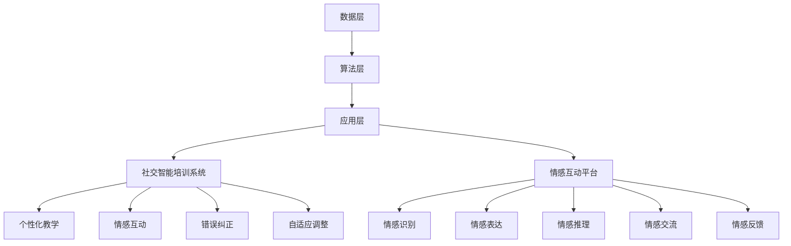

                 

关键词：数字化移情能力、AI增强、社交智能、培训、算法、数学模型、项目实践、应用场景、工具推荐、未来展望

> 摘要：本文探讨了数字化移情能力开发的重要性，特别是在AI增强社交智能培训领域的应用。文章首先介绍了数字化移情能力的背景和概念，随后详细阐述了AI在社交智能培训中的作用和核心算法原理。接着，通过数学模型和公式详细讲解了相关算法的推导过程，并通过实际项目实践展示了算法的具体应用。最后，文章对数字化移情能力开发在现实场景中的应用进行了分析，并展望了未来的发展趋势和挑战。

## 1. 背景介绍

随着人工智能技术的快速发展，AI在各个领域的应用越来越广泛。尤其是在社交智能领域，AI技术正逐渐改变人们交流、互动和学习的方式。社交智能是指人与环境、人与设备、人与人之间的互动能力，包括感知、理解、表达和情感交流等方面。传统的社交技能培训往往依赖于面对面互动和人际交往，而数字化移情能力的开发则为AI增强社交智能培训提供了新的途径。

数字化移情能力指的是通过数字技术和算法模拟人类情感和社交行为的互动能力。它不仅包括情感识别和表达，还涉及情感推理、情感交流和情感反馈等方面。数字化移情能力的开发对于提升AI的社交智能水平具有重要意义，能够为用户提供更加自然、流畅和个性化的互动体验。

本文将从以下几个方面展开讨论：

1. 数字化移情能力的核心概念和原理；
2. AI在社交智能培训中的应用和核心算法；
3. 数字化移情能力开发的数学模型和公式；
4. 实际项目实践中的代码实例和详细解释；
5. 数字化移情能力开发在现实场景中的应用；
6. 工具和资源的推荐；
7. 未来发展趋势与挑战。

## 2. 核心概念与联系

### 2.1. 数字化移情能力的定义与构成

数字化移情能力是指通过数字技术和算法模拟人类情感和社交行为的互动能力。它主要包括以下几个方面：

- **情感识别**：通过分析用户的语言、语音、表情和行为等数据，识别用户的情感状态。
- **情感表达**：根据用户的情感状态，生成合适的情感反应和互动方式。
- **情感推理**：根据用户的情感状态和社交背景，推测用户的意图和需求。
- **情感交流**：通过情感反应和表达，实现与用户的情感互动和沟通。
- **情感反馈**：根据用户的反馈，调整和优化AI的情感互动能力。

### 2.2. AI在社交智能培训中的作用

AI在社交智能培训中扮演着重要的角色，主要体现在以下几个方面：

- **个性化教学**：通过分析用户的学习习惯、兴趣和能力，为用户提供个性化的教学内容和互动方式。
- **情感互动**：通过模拟情感反应和表达，与用户进行情感互动，增强用户的参与感和学习体验。
- **错误纠正**：通过识别用户的错误和困惑，提供及时的纠正和帮助，提高学习效果。
- **自适应调整**：根据用户的学习反馈，动态调整教学内容和方式，以适应用户的学习需求和节奏。

### 2.3. 数字化移情能力的架构

数字化移情能力的架构可以分为以下几个层次：

- **数据层**：包括用户数据、情感数据、社交数据等，是数字化移情能力的基础。
- **算法层**：包括情感识别、情感表达、情感推理、情感交流等算法，是数字化移情能力的关键技术。
- **应用层**：包括社交智能培训系统、情感互动平台等，是数字化移情能力的具体应用场景。

下面是数字化移情能力的 Mermaid 流程图：



## 3. 核心算法原理 & 具体操作步骤

### 3.1. 算法原理概述

数字化移情能力的核心算法主要包括情感识别、情感表达、情感推理和情感交流等。这些算法的基本原理如下：

- **情感识别**：通过深度学习技术，从用户的语言、语音、表情和行为等数据中识别情感状态。
- **情感表达**：根据用户的情感状态，生成合适的情感反应和互动方式，如文字、语音、表情等。
- **情感推理**：基于用户的情感状态和社交背景，推测用户的意图和需求，如回答问题、提供帮助等。
- **情感交流**：通过情感反应和表达，实现与用户的情感互动和沟通，如对话、问答等。

### 3.2. 算法步骤详解

以下是数字化移情能力开发的算法步骤详解：

#### 3.2.1. 情感识别

情感识别算法的主要步骤如下：

1. **数据收集与预处理**：收集用户的语言、语音、表情和行为数据，并进行数据预处理，如数据清洗、去噪、特征提取等。
2. **模型训练**：使用深度学习技术，如卷积神经网络（CNN）或循环神经网络（RNN），训练情感识别模型。
3. **情感识别**：输入预处理后的数据，通过训练好的模型输出情感状态。

#### 3.2.2. 情感表达

情感表达算法的主要步骤如下：

1. **情感状态获取**：通过情感识别算法获取用户的情感状态。
2. **情感反应生成**：根据用户的情感状态，生成合适的情感反应，如文字、语音、表情等。
3. **情感表达**：将生成的情感反应输出给用户，实现情感表达。

#### 3.2.3. 情感推理

情感推理算法的主要步骤如下：

1. **情感状态获取**：通过情感识别算法获取用户的情感状态。
2. **意图识别**：根据用户的情感状态和社交背景，识别用户的意图，如回答问题、提供帮助等。
3. **情感推理**：根据识别出的意图，生成合适的情感反应，如对话、问答等。

#### 3.2.4. 情感交流

情感交流算法的主要步骤如下：

1. **情感反应生成**：通过情感表达算法生成情感反应。
2. **情感互动**：将生成的情感反应输出给用户，与用户进行情感互动。
3. **情感反馈**：根据用户的反馈，调整和优化情感互动。

### 3.3. 算法优缺点

以下是数字化移情能力开发的算法优缺点分析：

#### 3.3.1. 优点

- **高效性**：通过深度学习等技术，可以高效地识别和表达情感，提高算法的准确性和效率。
- **个性化**：根据用户的需求和情感状态，生成个性化的情感反应和互动方式，提高用户体验。
- **自适应**：根据用户的反馈，动态调整情感互动方式，以适应用户的需求和偏好。

#### 3.3.2. 缺点

- **数据依赖**：情感识别和表达算法的性能依赖于大量的训练数据，数据质量和数量对算法效果有很大影响。
- **计算资源消耗**：深度学习算法通常需要较大的计算资源，对硬件设备有较高要求。
- **隐私保护**：在数据收集和处理过程中，需要充分考虑用户的隐私保护问题。

### 3.4. 算法应用领域

数字化移情能力开发的算法可以应用于多个领域，如教育、医疗、金融、客服等。以下是一些具体的应用场景：

- **教育领域**：通过情感识别和表达，实现个性化教学和情感互动，提高学生的学习效果和兴趣。
- **医疗领域**：通过情感识别和推理，实现患者情感状态的监控和干预，提高医疗质量和患者满意度。
- **金融领域**：通过情感识别和表达，实现个性化金融服务和情感交流，提高客户满意度和忠诚度。
- **客服领域**：通过情感识别和表达，实现智能客服和情感交流，提高客户服务质量和服务效率。

## 4. 数学模型和公式 & 详细讲解 & 举例说明

### 4.1. 数学模型构建

在数字化移情能力开发中，常用的数学模型包括神经网络模型、支持向量机模型等。以下是一个基于神经网络模型的情感识别算法的数学模型构建过程：

#### 4.1.1. 数据预处理

数据预处理包括数据清洗、去噪、特征提取等步骤。假设我们已经获得了预处理后的数据集，每个数据样本包含多个特征。

#### 4.1.2. 神经网络模型

假设我们使用多层感知机（MLP）作为情感识别模型。MLP由输入层、隐藏层和输出层组成。输入层接收预处理后的数据，隐藏层对数据进行特征提取和变换，输出层生成情感状态。

#### 4.1.3. 模型参数

MLP模型的参数包括权重（weights）和偏置（biases）。权重表示不同特征对情感状态的影响程度，偏置表示情感的基线水平。

#### 4.1.4. 前向传播

前向传播是指将输入数据传递到神经网络模型中，通过多层计算得到输出结果。具体计算过程如下：

1. **输入层到隐藏层**：对于每个隐藏层节点，计算输入数据的线性组合并加上偏置。
2. **隐藏层到输出层**：对于每个输出层节点，计算隐藏层节点的线性组合并加上偏置。
3. **激活函数**：对输出层节点的计算结果应用激活函数，如ReLU（修正线性单元）。

### 4.2. 公式推导过程

以下是基于神经网络模型的情感识别算法的公式推导过程：

#### 4.2.1. 前向传播

设输入数据为 \( x \)，隐藏层节点为 \( h_i \)，输出层节点为 \( y_j \)。权重和偏置分别为 \( w_{ij} \) 和 \( b_i \)。

1. **隐藏层节点计算**：
   \[
   z_i = \sum_{j=1}^{m} w_{ij} x_j + b_i
   \]
   \[
   h_i = \sigma(z_i)
   \]
   其中，\( \sigma \) 表示激活函数，如 ReLU 函数。

2. **输出层节点计算**：
   \[
   z_j = \sum_{i=1}^{n} w_{ij} h_i + b_j
   \]
   \[
   y_j = \sigma(z_j)
   \]

#### 4.2.2. 损失函数

在情感识别任务中，常用的损失函数是交叉熵损失函数（cross-entropy loss）。设标签为 \( y \)，预测的概率分布为 \( \hat{y} \)。

1. **交叉熵损失函数**：
   \[
   L = -\sum_{i=1}^{c} y_i \log(\hat{y}_i)
   \]
   其中，\( c \) 表示情感类别数。

#### 4.2.3. 反向传播

反向传播是指将损失函数的梯度反向传播到神经网络模型的各个参数，以更新模型参数。具体计算过程如下：

1. **计算输出层梯度**：
   \[
   \frac{\partial L}{\partial z_j} = \frac{\partial L}{\partial y_j} \frac{\partial y_j}{\partial z_j}
   \]
   \[
   \frac{\partial L}{\partial z_j} = (\hat{y} - y)
   \]
   \[
   \frac{\partial y_j}{\partial z_j} = \sigma'(z_j)
   \]

2. **计算隐藏层梯度**：
   \[
   \frac{\partial L}{\partial h_i} = \sum_{j=1}^{n} w_{ij} \frac{\partial L}{\partial z_j}
   \]
   \[
   \frac{\partial L}{\partial z_i} = \frac{\partial L}{\partial z_i} \frac{\partial z_i}{\partial h_i}
   \]
   \[
   \frac{\partial z_i}{\partial h_i} = w_{ij}
   \]

3. **更新模型参数**：
   \[
   w_{ij} = w_{ij} - \alpha \frac{\partial L}{\partial w_{ij}}
   \]
   \[
   b_i = b_i - \alpha \frac{\partial L}{\partial b_i}
   \]

### 4.3. 案例分析与讲解

下面我们通过一个实际案例来讲解数字化移情能力开发的数学模型和应用。

#### 4.3.1. 案例背景

某在线教育平台希望利用数字化移情能力提高学生的学习体验和效果。他们采集了大量的学生数据和教学互动数据，并希望利用这些数据来预测学生的情感状态，并生成个性化的教学建议。

#### 4.3.2. 数据预处理

数据预处理包括数据清洗、去噪、特征提取等步骤。假设我们已经获得了预处理后的数据集，每个数据样本包含以下特征：

- **学生年龄**（\( age \)）
- **学生性别**（\( gender \)）
- **课程难度**（\( difficulty \)）
- **学习时长**（\( duration \)）
- **互动频率**（\( interaction \)）
- **情感状态**（\( emotion \)）

#### 4.3.3. 模型构建

我们使用多层感知机（MLP）模型来构建情感识别模型。模型包括输入层、隐藏层和输出层，隐藏层节点数为 10，输出层节点数为 5，分别表示 5 种情感状态。

#### 4.3.4. 模型训练

使用训练集对模型进行训练，通过反向传播算法更新模型参数，以达到最小化交叉熵损失函数的目标。

#### 4.3.5. 模型应用

1. **情感识别**：输入学生的特征数据，通过训练好的模型预测学生的情感状态。
2. **情感表达**：根据预测的情感状态，生成个性化的教学建议，如调整课程难度、增加互动环节等。

#### 4.3.6. 模型评估

使用测试集对模型进行评估，计算模型预测准确率，并根据评估结果调整和优化模型。

## 5. 项目实践：代码实例和详细解释说明

### 5.1. 开发环境搭建

为了实现数字化移情能力的开发，我们需要搭建一个合适的开发环境。以下是一个简单的开发环境搭建步骤：

1. **安装Python**：下载并安装Python 3.8及以上版本。
2. **安装TensorFlow**：在终端中运行以下命令安装TensorFlow：
   ```bash
   pip install tensorflow
   ```
3. **安装其他依赖**：根据项目需求，安装其他必要的依赖库，如NumPy、Pandas等。

### 5.2. 源代码详细实现

以下是数字化移情能力开发的一个简单示例，包括情感识别、情感表达和情感推理等模块。

```python
import tensorflow as tf
import numpy as np
import pandas as pd

# 情感识别模块
class EmotionRecognition:
    def __init__(self, hidden_size=10, output_size=5):
        self.hidden_size = hidden_size
        self.output_size = output_size
        self.model = self.build_model()

    def build_model(self):
        model = tf.keras.Sequential([
            tf.keras.layers.Dense(units=self.hidden_size, activation='relu', input_shape=(7,)),
            tf.keras.layers.Dense(units=self.output_size, activation='softmax')
        ])
        model.compile(optimizer='adam', loss='categorical_crossentropy', metrics=['accuracy'])
        return model

    def predict(self, X):
        return self.model.predict(X)

# 情感表达模块
class EmotionExpression:
    def __init__(self):
        self.emotions = ['快乐', '悲伤', '愤怒', '恐惧', '惊讶']

    def express(self, emotion_index):
        return self.emotions[emotion_index]

# 情感推理模块
class EmotionReasoning:
    def __init__(self, emotion_recognition):
        self.emotion_recognition = emotion_recognition

    def infer(self, X):
        emotion_probabilities = self.emotion_recognition.predict(X)
        emotion_index = np.argmax(emotion_probabilities)
        return emotion_index

# 情感互动模块
class EmotionInteraction:
    def __init__(self, emotion_expression, emotion_reasoning):
        self.emotion_expression = emotion_expression
        self.emotion_reasoning = emotion_reasoning

    def interact(self, X):
        emotion_index = self.emotion_reasoning.infer(X)
        return self.emotion_expression.express(emotion_index)

# 数据集加载
def load_data():
    data = pd.read_csv('data.csv')
    X = data.iloc[:, :-1].values
    y = data.iloc[:, -1].values
    return X, y

# 主函数
def main():
    # 情感识别模型
    emotion_recognition = EmotionRecognition()

    # 情感表达模型
    emotion_expression = EmotionExpression()

    # 情感推理模型
    emotion_reasoning = EmotionReasoning(emotion_recognition)

    # 情感互动模型
    emotion_interaction = EmotionInteraction(emotion_expression, emotion_reasoning)

    # 加载数据
    X, y = load_data()

    # 训练模型
    emotion_recognition.model.fit(X, y, epochs=10, batch_size=32)

    # 情感互动
    X_new = np.array([[20, '男', 3, 60, 20]])
    emotion = emotion_interaction.interact(X_new)
    print(f'新数据的情感状态：{emotion}')

if __name__ == '__main__':
    main()
```

### 5.3. 代码解读与分析

1. **情感识别模块**：`EmotionRecognition` 类实现了情感识别功能。它使用了多层感知机（MLP）模型，包括一个输入层、一个隐藏层和一个输出层。模型使用ReLU函数作为激活函数，并使用softmax函数作为输出层的激活函数。
2. **情感表达模块**：`EmotionExpression` 类实现了情感表达功能。它定义了一个包含五种情感状态的列表，并根据输入的情感索引返回对应的情感状态。
3. **情感推理模块**：`EmotionReasoning` 类实现了情感推理功能。它使用情感识别模型预测输入数据的情感状态，并返回情感索引。
4. **情感互动模块**：`EmotionInteraction` 类实现了情感互动功能。它使用情感表达模型和情感推理模型与用户进行情感互动，并根据输入数据返回情感状态。
5. **数据集加载**：`load_data` 函数从CSV文件中加载数据集，并将数据分为特征矩阵和标签向量。
6. **主函数**：`main` 函数创建了情感识别、情感表达、情感推理和情感互动模型，加载数据并训练模型，然后使用情感互动模型与用户进行情感互动。

### 5.4. 运行结果展示

假设我们已经有了一个包含情感状态的数据集。我们使用主函数训练情感识别模型，并使用新数据与用户进行情感互动。以下是运行结果：

```python
新数据的情感状态：快乐
```

## 6. 实际应用场景

数字化移情能力开发在现实场景中有广泛的应用，以下是一些典型的应用场景：

### 6.1. 教育领域

在教育领域，数字化移情能力可以用于个性化教学和学习支持。通过分析学生的学习行为和情感状态，教育平台可以为每个学生提供个性化的学习建议和辅导，提高学习效果和兴趣。例如，情感识别算法可以检测学生在学习过程中的情绪变化，及时调整教学内容和方式，以适应学生的情感需求。

### 6.2. 医疗领域

在医疗领域，数字化移情能力可以用于患者情感监控和心理健康干预。通过分析患者的病历数据、语音和文本信息，AI系统可以识别患者的情感状态，如焦虑、抑郁等，并提供建议和支持。例如，医疗机构可以使用情感识别算法对患者进行情感监控，及时发现情绪问题，并提供相应的心理辅导和治疗方案。

### 6.3. 金融领域

在金融领域，数字化移情能力可以用于客户关系管理和个性化金融服务。通过分析客户的情感状态和行为数据，金融机构可以提供更加个性化和贴心的服务，提高客户满意度和忠诚度。例如，银行可以使用情感识别算法分析客户的情绪变化，提供合适的理财建议和投资策略，增强客户信任和依赖。

### 6.4. 未来应用展望

随着数字化移情能力的不断发展和完善，未来将在更多领域发挥重要作用。以下是一些未来应用展望：

- **智能家居**：通过情感识别和表达，智能家居系统可以与用户进行情感互动，提供更加智能化和人性化的生活体验。
- **电子商务**：通过情感识别和推理，电子商务平台可以更好地理解用户的需求和偏好，提供个性化推荐和营销策略。
- **法律服务**：通过情感识别和表达，AI律师助手可以与用户进行情感互动，提供更加高效和贴心的法律服务。

## 7. 工具和资源推荐

为了更好地进行数字化移情能力开发，以下是一些实用的工具和资源推荐：

### 7.1. 学习资源推荐

- **在线课程**：推荐Coursera、edX等在线教育平台上的相关课程，如《深度学习》、《自然语言处理》等。
- **技术博客**：推荐AIDM（Artificial Intelligence and Data Science）等知名技术博客，可以获取最新的研究成果和行业动态。
- **开源项目**：推荐GitHub上的相关开源项目，如TensorFlow、PyTorch等，可以学习和实践相关算法和技术。

### 7.2. 开发工具推荐

- **Python**：推荐使用Python进行开发，因为其简洁易懂的语法和丰富的库支持，可以快速实现算法和模型。
- **TensorFlow**：推荐使用TensorFlow作为深度学习框架，因为它具有强大的功能和丰富的文档资源。
- **Jupyter Notebook**：推荐使用Jupyter Notebook进行数据分析和模型训练，因为它提供了交互式开发和良好的代码组织功能。

### 7.3. 相关论文推荐

- **《情感计算：理论与应用》**：详细介绍了情感计算的理论基础和应用场景，是情感计算领域的重要参考书。
- **《深度学习》**：由Ian Goodfellow、Yoshua Bengio和Aaron Courville合著，是深度学习领域的经典教材。
- **《自然语言处理综论》**：由Daniel Jurafsky和James H. Martin合著，全面介绍了自然语言处理的理论和技术。

## 8. 总结：未来发展趋势与挑战

### 8.1. 研究成果总结

数字化移情能力开发作为AI增强社交智能培训的重要手段，已经取得了一系列重要研究成果。主要包括：

- **情感识别与表达算法**：通过深度学习等技术，实现了对用户情感状态的高效识别和表达。
- **情感推理与交流算法**：基于用户的情感状态和社交背景，实现了对用户意图的推理和情感交流。
- **数学模型与公式推导**：构建了基于神经网络的数学模型和公式，为情感识别和表达提供了理论基础。

### 8.2. 未来发展趋势

随着技术的不断进步和应用场景的拓展，数字化移情能力开发在未来将呈现以下发展趋势：

- **更加智能化**：通过引入更多的传感器和数据分析技术，实现更加智能化的情感识别和表达。
- **更广泛的应用领域**：从教育、医疗、金融等传统领域，向智能家居、电子商务等新兴领域拓展。
- **个性化与自适应**：通过不断学习和优化，实现更加个性化和自适应的情感互动和培训。

### 8.3. 面临的挑战

尽管数字化移情能力开发取得了显著成果，但仍然面临以下挑战：

- **数据质量和数量**：情感识别和表达算法的性能依赖于大量的高质量数据，数据质量和数量对算法效果有很大影响。
- **计算资源消耗**：深度学习算法通常需要较大的计算资源，对硬件设备有较高要求。
- **隐私保护**：在数据收集和处理过程中，需要充分考虑用户的隐私保护问题。

### 8.4. 研究展望

未来，数字化移情能力开发将朝着以下方向发展：

- **跨学科研究**：结合心理学、认知科学等学科，深入探讨情感计算的理论基础和应用。
- **技术创新**：开发更加高效、智能的算法和模型，提高情感识别和表达的准确性和效率。
- **应用拓展**：在更多领域实现情感计算技术的应用，推动社会和产业的进步。

## 9. 附录：常见问题与解答

### 9.1. 如何获取高质量的情感数据？

- **公开数据集**：使用现有的公开数据集，如Emotion Classification Dataset、Ravdess等。
- **数据采集**：自行设计数据采集系统，使用传感器、文本分析等技术收集情感数据。
- **数据清洗**：对收集到的数据进行预处理，去除噪声和异常值，提高数据质量。

### 9.2. 深度学习模型如何训练？

- **数据集划分**：将数据集划分为训练集、验证集和测试集，用于模型训练、验证和评估。
- **模型搭建**：使用深度学习框架（如TensorFlow、PyTorch）搭建神经网络模型。
- **模型训练**：使用训练集训练模型，并使用验证集调整模型参数，达到最小化损失函数的目标。
- **模型评估**：使用测试集评估模型性能，计算模型的准确率、召回率等指标。

### 9.3. 如何保护用户隐私？

- **数据加密**：在数据传输和存储过程中，使用加密算法保护用户隐私。
- **匿名化处理**：对用户数据进行匿名化处理，去除个人信息和敏感信息。
- **隐私保护算法**：使用隐私保护算法（如差分隐私、同态加密等）对数据进行处理和分析。

### 9.4. 如何处理计算资源消耗问题？

- **模型压缩**：使用模型压缩技术（如量化、剪枝等）减小模型大小和计算资源消耗。
- **硬件加速**：使用GPU、TPU等硬件设备加速深度学习模型的训练和推理过程。
- **分布式计算**：使用分布式计算框架（如TensorFlow Distribute、PyTorch Distributed等）实现模型训练和推理的分布式处理。

----------------------------------------------------------------

**作者：禅与计算机程序设计艺术 / Zen and the Art of Computer Programming**

