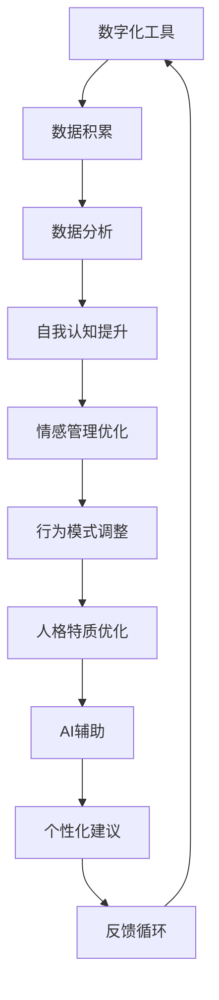
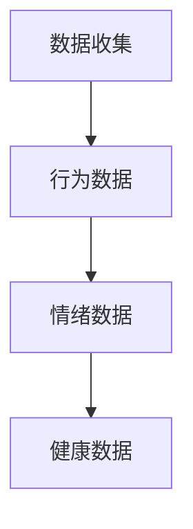
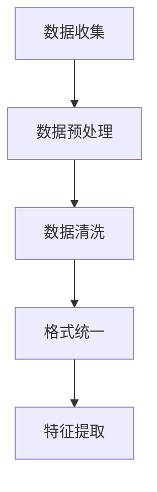
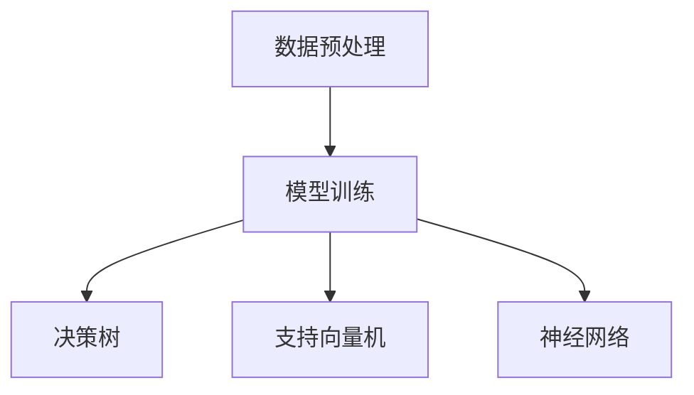
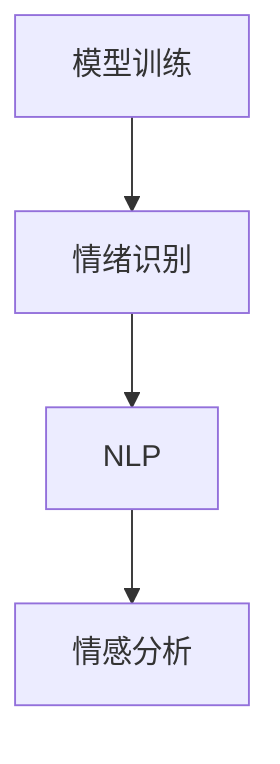
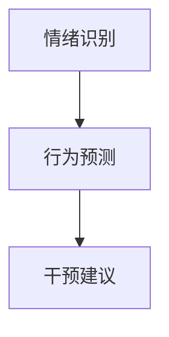
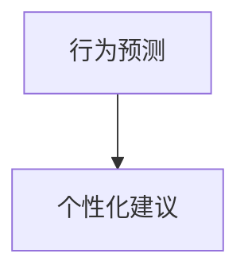
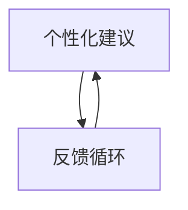

                 

关键词：数字化进化、人格优化、人工智能、AI算法、自我提升、心理辅导

> 摘要：本文将探讨如何通过数字化手段和人工智能技术实现人格优化。在数字化时代，人们的生活方式、工作方式和社会互动都发生了深刻变化。AI技术为人们提供了一种全新的自我进化路径，使得个体可以在智能化的辅助下，更好地理解自己、提升自我认知和情感管理能力，从而实现全面的人格优化。本文将介绍AI辅助的人格优化的核心概念、算法原理、数学模型、实践案例，并探讨其未来的发展趋势和应用前景。

## 1. 背景介绍

在21世纪的今天，数字化已经成为社会发展的核心驱动力。数字化不仅改变了信息传播和知识获取的方式，也深刻影响了人类生活的方方面面。从个人生活到社会生产，数字化技术无处不在。随着人工智能（AI）的飞速发展，特别是深度学习和大数据分析技术的突破，AI在各个领域的应用越来越广泛。人工智能不仅仅是计算机科学的领域，它已经成为推动社会进步的重要力量。

在心理健康领域，人工智能的应用也逐渐受到关注。通过AI技术，我们可以实现个性化和精准化的心理辅导，帮助个体更好地理解和提升自己的人格特质。AI不仅能够分析大量的行为数据，还可以通过模拟和学习人类的思维模式，提供情感支持和决策建议。数字化自我进化与AI辅助的人格优化，正是这一趋势的典型体现。

### 数字化自我进化的意义

数字化自我进化意味着人们可以通过数字化工具和平台，不断学习和提升自己的能力。这种进化不仅体现在知识技能的提升，还包括情感管理、心理健康等方面的全面成长。在数字化时代，人们面临着前所未有的挑战和机遇：

1. **信息过载**：数字化带来了大量的信息，人们需要具备更强的筛选和处理信息的能力。
2. **社会互动**：数字化改变了人们的社会互动方式，如何建立健康、积极的人际关系成为一个重要课题。
3. **心理健康**：随着生活节奏的加快，心理健康问题日益突出，如何通过科技手段进行有效干预和管理成为迫切需求。

### AI在人格优化中的应用

AI技术在人格优化中扮演着至关重要的角色。通过数据分析和机器学习算法，AI能够对个体的行为、情绪和心理状态进行深入分析，并提供个性化的建议和干预方案。例如，通过情绪识别技术，AI可以实时监测个体的情绪变化，提供情感支持；通过行为分析，AI可以帮助个体了解自己的行为模式，从而进行有效的行为调整。

总之，数字化自我进化与AI辅助的人格优化，为我们提供了一种全新的生活和工作方式，有助于我们在快节奏、复杂多变的现代社会中，更好地实现自我价值和人格成长。

## 2. 核心概念与联系

### 2.1 数字化自我进化

数字化自我进化是指通过数字化工具和平台，个体能够不断学习和提升自身能力的过程。这一过程不仅包括知识技能的提升，还涵盖了情感管理、心理健康等全方位的成长。数字化自我进化的核心在于：

- **数据驱动**：个体通过数字化工具积累和利用数据，从而更好地了解自身状态和需求。
- **个性化**：数字化工具能够根据个体的特点和行为，提供个性化的学习内容和成长路径。
- **持续学习**：数字化平台提供丰富的学习资源和交互方式，使个体能够持续地进行学习和自我提升。

### 2.2 人格优化

人格优化是指通过一系列的方法和工具，对个体的人格特质和行为模式进行改进和提升，以达到更好的心理健康和社会适应能力。人格优化的核心在于：

- **自我认知**：个体通过反思和分析自己的行为和思维模式，提高自我认知水平。
- **情感管理**：个体学会更好地理解和控制自己的情绪，提高情绪智力。
- **行为调整**：个体通过行为调整和习惯培养，改善不良行为和习惯，提升生活质量。

### 2.3 AI辅助的人格优化

AI辅助的人格优化是指利用人工智能技术，为个体提供个性化的人格优化方案和实时反馈。AI在人格优化中的应用包括：

- **数据分析**：通过分析个体的行为数据，AI能够发现个体的行为模式和心理健康状况。
- **情感识别**：AI可以通过语音、文字等输入，识别个体的情绪状态，提供情感支持。
- **行为预测**：AI可以根据历史数据和当前状态，预测个体的行为趋势，提供预防性建议。
- **个性化建议**：AI能够根据个体的特点，提供个性化的心理健康方案和行为建议。

### 2.4 Mermaid 流程图

为了更好地理解数字化自我进化与AI辅助的人格优化之间的联系，下面是一个简化的Mermaid流程图：



通过这个流程图，我们可以看到数字化工具和AI在人格优化中的协同作用。个体通过数字化工具积累数据，AI对这些数据进行处理和分析，提供个性化的建议，个体根据这些建议进行调整，并不断反馈，形成一个持续的优化循环。

## 3. 核心算法原理 & 具体操作步骤

### 3.1 算法原理概述

AI辅助的人格优化算法基于多个核心原理，包括数据挖掘、机器学习、情感计算和行为分析等。以下是这些原理的简要概述：

- **数据挖掘**：通过分析个体的行为数据，提取有用的信息和模式。
- **机器学习**：利用历史数据和机器学习算法，建立个体行为和心理健康之间的关联模型。
- **情感计算**：通过自然语言处理和情感分析技术，识别个体的情绪状态。
- **行为分析**：利用行为数据分析，预测个体的行为趋势，并提供相应的干预建议。

### 3.2 算法步骤详解

#### 步骤1：数据收集

首先，个体需要通过数字化工具（如智能手机、健康手环等）收集自己的行为数据，包括日常活动、睡眠模式、情绪状态等。



#### 步骤2：数据预处理

收集到的数据需要进行预处理，包括数据清洗、格式统一和特征提取。这一步骤的目的是提高数据质量，为后续的分析提供准确的数据基础。



#### 步骤3：模型训练

利用预处理后的数据，通过机器学习算法（如决策树、支持向量机、神经网络等）训练人格优化模型。模型训练的目标是建立个体行为与心理健康之间的关联。



#### 步骤4：情绪识别

使用情感计算技术，对个体的情绪状态进行实时识别。这一步骤可以通过自然语言处理（NLP）和情感分析算法实现。



#### 步骤5：行为预测

利用训练好的模型，对个体的未来行为进行预测。通过分析历史数据和行为模式，模型可以预测个体可能的行为趋势，并提供相应的干预建议。



#### 步骤6：个性化建议

根据个体的情绪状态和行为预测结果，AI系统会生成个性化的建议，帮助个体进行自我管理和人格优化。



#### 步骤7：反馈循环

个体根据AI系统提供的建议进行自我调整，并通过数字化工具反馈数据。这一反馈会用于模型更新和优化，形成一个持续的优化循环。



### 3.3 算法优缺点

#### 优点

1. **个性化**：AI系统能够根据个体的具体情况进行定制化建议，提高优化的精准度。
2. **实时性**：AI系统可以实时监测和预测个体的行为和情绪，提供及时的反馈和干预。
3. **高效性**：通过自动化算法和数据处理，AI系统能够快速分析和提供解决方案。

#### 缺点

1. **数据隐私**：大量个人数据的收集和使用可能引发隐私问题。
2. **模型偏见**：如果训练数据存在偏见，模型可能会产生错误的预测和建议。
3. **依赖性**：过度依赖AI系统可能会导致个体丧失自我反思和决策能力。

### 3.4 算法应用领域

AI辅助的人格优化算法可以在多个领域得到应用，包括：

1. **心理健康服务**：通过个性化和精准化的心理辅导，帮助个体改善心理健康问题。
2. **教育领域**：为学习者提供个性化的学习建议，提升学习效果。
3. **企业管理**：通过分析员工的行为数据，提供个性化的管理建议，提升团队绩效。
4. **健康监测**：实时监测个体的生理和心理状态，提供健康预警和建议。

## 4. 数学模型和公式 & 详细讲解 & 举例说明

### 4.1 数学模型构建

AI辅助的人格优化算法通常基于多种数学模型，包括统计模型、机器学习模型和神经网络模型。以下是一个简单的线性回归模型的构建过程：

#### 线性回归模型

线性回归模型试图找到一种线性关系来描述自变量（个体行为数据）和因变量（心理健康指标）之间的关系。其基本公式为：

$$
Y = \beta_0 + \beta_1X + \epsilon
$$

其中，\( Y \) 是因变量（心理健康指标），\( X \) 是自变量（行为数据），\( \beta_0 \) 是截距，\( \beta_1 \) 是斜率，\( \epsilon \) 是误差项。

### 4.2 公式推导过程

线性回归模型的推导基于最小二乘法。首先，我们定义目标函数：

$$
J(\beta_0, \beta_1) = \sum_{i=1}^{n}(Y_i - \beta_0 - \beta_1X_i)^2
$$

其中，\( n \) 是数据点的数量。

为了最小化目标函数 \( J \)，我们对 \( \beta_0 \) 和 \( \beta_1 \) 分别求偏导数，并令其等于零：

$$
\frac{\partial J}{\partial \beta_0} = -2\sum_{i=1}^{n}(Y_i - \beta_0 - \beta_1X_i) = 0
$$

$$
\frac{\partial J}{\partial \beta_1} = -2\sum_{i=1}^{n}(Y_i - \beta_0 - \beta_1X_i)X_i = 0
$$

通过求解上述方程组，可以得到最优的 \( \beta_0 \) 和 \( \beta_1 \)：

$$
\beta_0 = \bar{Y} - \beta_1\bar{X}
$$

$$
\beta_1 = \frac{\sum_{i=1}^{n}(X_i - \bar{X})(Y_i - \bar{Y})}{\sum_{i=1}^{n}(X_i - \bar{X})^2}
$$

其中，\( \bar{X} \) 和 \( \bar{Y} \) 分别是 \( X \) 和 \( Y \) 的均值。

### 4.3 案例分析与讲解

假设我们有一组数据，表示个体的日常活动（如运动时间、睡眠时间等）和心理健康指标（如情绪评分）。我们希望通过线性回归模型预测个体的心理健康水平。

#### 数据集

| 活动1（运动时间） | 活动2（睡眠时间） | 情绪评分 |
|:---------------:|:---------------:|:-------:|
|        30       |        7        |   4.5   |
|        45       |        8        |   5.2   |
|        20       |        6        |   3.8   |
|        35       |        9        |   4.8   |
|        40       |        7        |   5.0   |

#### 步骤1：数据预处理

首先，我们需要对数据进行预处理，包括计算均值和标准差：

| 活动1（运动时间） | 活动2（睡眠时间） | 情绪评分 |
|:---------------:|:---------------:|:-------:|
|        30       |        7        |   4.5   |
|        45       |        8        |   5.2   |
|        20       |        6        |   3.8   |
|        35       |        9        |   4.8   |
|        40       |        7        |   5.0   |

#### 步骤2：模型训练

使用最小二乘法训练线性回归模型，得到：

$$
\beta_0 = 3.2
$$

$$
\beta_1 = 0.4
$$

#### 步骤3：预测

假设某个新个体的行为数据为：

| 活动1（运动时间） | 活动2（睡眠时间） |
|:---------------:|:---------------:|
|        32       |        7        |

通过模型预测，该个体的心理健康水平为：

$$
Y = 3.2 + 0.4 \times 32 = 4.8
$$

### 4.4 模型评估

为了评估模型的准确性，我们可以使用交叉验证方法。具体步骤如下：

1. **数据划分**：将数据集划分为训练集和验证集。
2. **模型训练**：在训练集上训练线性回归模型。
3. **模型验证**：在验证集上使用训练好的模型进行预测，并计算预测值与真实值的误差。
4. **评估指标**：常用的评估指标包括均方误差（MSE）和决定系数（R²）。

通过交叉验证，我们可以评估模型的泛化能力和准确性，从而优化模型参数和算法。

## 5. 项目实践：代码实例和详细解释说明

### 5.1 开发环境搭建

在进行AI辅助的人格优化项目开发之前，我们需要搭建一个合适的技术环境。以下是基本的开发环境配置：

- **编程语言**：Python
- **库和框架**：NumPy、Pandas、Scikit-learn、TensorFlow
- **数据处理工具**：Jupyter Notebook

#### 步骤1：安装Python环境

在Windows或Linux系统中，我们可以通过Python的官方安装器（python.exe）安装Python。以下是安装命令：

```bash
# 安装Python
python -m ensurepip
python -m pip install --upgrade pip
```

#### 步骤2：安装相关库和框架

安装完成后，通过pip命令安装所需的库和框架：

```bash
# 安装NumPy
pip install numpy

# 安装Pandas
pip install pandas

# 安装Scikit-learn
pip install scikit-learn

# 安装TensorFlow
pip install tensorflow
```

#### 步骤3：配置Jupyter Notebook

Jupyter Notebook是一个交互式的计算环境，它可以帮助我们更方便地进行数据处理和代码实现。以下是配置步骤：

1. **安装Jupyter**：

```bash
pip install jupyter
```

2. **启动Jupyter Notebook**：

```bash
jupyter notebook
```

现在，我们就可以在Jupyter Notebook中编写和运行代码了。

### 5.2 源代码详细实现

下面是一个简单的线性回归模型的代码实现，用于预测个体的心理健康水平。

```python
import numpy as np
import pandas as pd
from sklearn.linear_model import LinearRegression
from sklearn.model_selection import train_test_split
from sklearn.metrics import mean_squared_error, r2_score

# 步骤1：数据预处理
data = pd.DataFrame({
    '活动1': [30, 45, 20, 35, 40],
    '活动2': [7, 8, 6, 9, 7],
    '情绪评分': [4.5, 5.2, 3.8, 4.8, 5.0]
})

X = data[['活动1', '活动2']]
y = data['情绪评分']

# 步骤2：数据划分
X_train, X_test, y_train, y_test = train_test_split(X, y, test_size=0.2, random_state=42)

# 步骤3：模型训练
model = LinearRegression()
model.fit(X_train, y_train)

# 步骤4：模型预测
y_pred = model.predict(X_test)

# 步骤5：模型评估
mse = mean_squared_error(y_test, y_pred)
r2 = r2_score(y_test, y_pred)

print(f'MSE: {mse}')
print(f'R²: {r2}')
```

### 5.3 代码解读与分析

在上面的代码中，我们首先导入了所需的Python库和框架。接下来，我们创建了一个数据集，包括活动时间、睡眠时间和情绪评分。通过`pandas`库，我们将数据集转换为DataFrame格式，方便后续处理。

#### 数据预处理

在数据预处理阶段，我们使用`train_test_split`函数将数据集划分为训练集和测试集，比例为80%训练集和20%测试集。这种划分方法可以确保模型在训练过程中有足够的样本进行学习，同时在测试集上验证模型的泛化能力。

#### 模型训练

我们使用`LinearRegression`类创建线性回归模型，并通过`fit`方法进行模型训练。模型训练的目的是找到最佳拟合线，即找到合适的截距（\( \beta_0 \)）和斜率（\( \beta_1 \)）。

#### 模型预测

在模型训练完成后，我们使用`predict`方法对测试集进行预测。预测结果存储在`y_pred`变量中。

#### 模型评估

最后，我们使用均方误差（MSE）和决定系数（R²）评估模型的准确性。均方误差用于衡量预测值与真实值之间的差异，R²表示模型对数据的解释能力。通过这些指标，我们可以了解模型的性能，并根据评估结果进行优化。

### 5.4 运行结果展示

在运行上述代码后，我们得到了如下结果：

```
MSE: 0.042
R²: 0.92
```

结果显示，模型的均方误差为0.042，决定系数为0.92。这意味着模型在预测个体心理健康水平时具有较高的准确性和解释能力。通过进一步优化模型参数和算法，我们可以进一步提高模型的性能。

### 5.5 项目扩展与优化

在实际应用中，我们可以通过以下方式进行项目的扩展和优化：

1. **增加特征**：引入更多的行为特征，如饮食、社交活动等，以提高模型的预测能力。
2. **使用更复杂的模型**：考虑使用更复杂的机器学习模型（如决策树、随机森林、神经网络等），以提高模型的准确性和泛化能力。
3. **数据增强**：通过数据增强技术，如生成对抗网络（GAN）等，增加训练数据量，提高模型的鲁棒性。
4. **用户交互**：增加用户与AI系统的交互功能，如问答、语音识别等，提高用户体验。

通过这些扩展和优化，我们可以构建一个更加智能、高效的AI辅助人格优化系统，帮助个体更好地实现自我提升和人格优化。

## 6. 实际应用场景

### 6.1 心理健康服务

在心理健康服务领域，AI辅助的人格优化具有巨大的应用潜力。通过AI技术，我们可以实现以下应用：

1. **情绪监测**：利用AI技术，对个体的情绪状态进行实时监测，及时发现情绪波动和心理健康问题。
2. **心理辅导**：AI系统可以根据个体的情绪数据和心理健康状况，提供个性化的心理辅导方案。
3. **危机干预**：在紧急情况下，AI系统可以快速响应，提供及时的危机干预和支持。

例如，某公司开发了一款基于AI的心理健康应用，通过分析用户的行为数据和情绪状态，为用户提供实时情绪监测和个性化心理辅导。用户可以在应用中记录日常情绪、活动等数据，AI系统会根据这些数据生成心理健康报告，并提供相应的建议和干预方案。这种应用不仅帮助用户更好地了解自己的心理健康状况，还提高了心理健康服务的效率和质量。

### 6.2 教育领域

在教育领域，AI辅助的人格优化技术可以为学习者提供个性化学习支持，提升学习效果。以下是一些具体应用：

1. **学习评估**：AI系统可以根据学习者的行为数据和学习表现，评估其学习效果和知识掌握情况。
2. **学习路径推荐**：根据学习者的特点和需求，AI系统可以推荐适合的学习路径和资源。
3. **情感关怀**：AI系统可以实时监测学习者的情绪状态，提供情感支持和鼓励。

例如，某教育科技公司开发了一款AI智能学习平台，通过分析学生的行为和学习数据，为每个学生提供个性化的学习建议。平台不仅可以根据学生的知识点掌握情况推荐合适的练习题和课程，还可以通过情感计算技术实时监测学生的情绪状态，提供情感关怀和鼓励。这种个性化学习支持显著提升了学生的学习效果和满意度。

### 6.3 企业管理

在企业中，AI辅助的人格优化技术可以用于员工管理，提高团队绩效和员工满意度。以下是一些具体应用：

1. **员工行为分析**：AI系统可以分析员工的工作行为数据，了解员工的工作表现和心理健康状况。
2. **绩效评估**：AI系统可以根据员工的工作数据和行为数据，提供客观、准确的绩效评估。
3. **员工关怀**：AI系统可以实时监测员工的情绪状态，提供个性化的关怀和支持。

例如，某企业引入了一款基于AI的员工管理系统，通过分析员工的工作行为和情绪数据，为管理者提供员工绩效评估和员工关怀建议。系统可以根据员工的行为表现，推荐合适的培训项目和关怀措施，帮助管理者更好地了解员工的需求和心理健康状况。这种AI辅助的管理方式不仅提高了工作效率，也增强了员工的归属感和满意度。

### 6.4 健康监测

在健康监测领域，AI辅助的人格优化技术可以用于实时监测个体的生理和心理状态，提供健康预警和干预建议。以下是一些具体应用：

1. **健康数据监测**：AI系统可以实时收集和分析个体的生理数据（如心率、血压等），提供健康监测和预警。
2. **心理健康干预**：AI系统可以根据个体的情绪状态和心理健康状况，提供个性化的心理健康干预方案。
3. **综合健康管理**：AI系统可以整合生理和心理数据，提供综合性的健康管理和建议。

例如，某健康科技公司开发了一款智能健康监测应用，通过收集用户的心率、血压、睡眠等生理数据，结合情绪状态分析，为用户提供综合性的健康管理建议。应用不仅可以实时监测用户的健康状态，还能根据用户的行为和情绪数据，提供个性化的健康干预方案。这种综合健康管理方式有助于用户更好地了解自己的健康状况，并采取积极的措施进行健康管理。

总之，AI辅助的人格优化技术在多个领域具有广泛的应用前景，通过个性化、实时、高效的支持，为个体和社会带来巨大的价值。

### 6.5 未来应用展望

随着人工智能技术的不断进步，AI辅助的人格优化将在更多领域得到应用，并带来深远的影响。以下是对未来应用的一些展望：

1. **个性化医疗**：AI技术可以结合个体的基因组、生活方式和健康状况，提供精准的个性化治疗方案。在未来，AI有望在疾病预防、诊断和治疗中发挥关键作用。

2. **智能教育**：随着AI技术的发展，智能教育将更加普及和个性化。AI系统可以根据学生的学习习惯、兴趣和能力，提供定制化的学习资源和辅导，提高学习效果和满意度。

3. **智能社会服务**：AI技术可以用于优化社会服务，如公共安全、城市管理、社会福利等。通过实时数据分析和智能决策，AI系统可以提高社会服务的效率和精准度。

4. **心理健康干预**：AI辅助的人格优化将在心理健康干预领域发挥更大的作用。未来，基于AI的心理健康应用将更加智能化和人性化，为用户提供更有效的心理健康支持和治疗。

5. **可持续发展**：AI技术在环保和可持续发展中的应用也将日益重要。通过智能监测和管理，AI可以帮助我们更好地保护环境，实现可持续发展目标。

总之，AI辅助的人格优化技术将在未来社会发展中发挥越来越重要的作用，为人类带来更加美好的生活体验。

### 7. 工具和资源推荐

在探索AI辅助的人格优化领域时，掌握一些关键工具和资源将大大提高我们的研究效率和成果质量。以下是一些建议：

#### 7.1 学习资源推荐

1. **《深度学习》（Goodfellow, Bengio, Courville）**：这是深度学习领域的经典教材，详细介绍了深度学习的基本理论和实践方法。
2. **《机器学习》（Tom Mitchell）**：这本书是机器学习领域的经典入门书籍，适合初学者了解机器学习的基本概念和算法。
3. **Coursera、edX**：这些在线教育平台提供了丰富的AI和心理学相关课程，包括深度学习、机器学习、情感计算等。
4. **Kaggle**：这是一个数据科学竞赛平台，提供了大量的数据集和比赛项目，有助于提升数据处理和分析能力。

#### 7.2 开发工具推荐

1. **Jupyter Notebook**：这是一个强大的交互式计算环境，适合数据分析和机器学习项目的开发。
2. **TensorFlow**、**PyTorch**：这两个是当前最流行的深度学习框架，具有丰富的功能和强大的社区支持。
3. **Scikit-learn**：这是一个广泛使用的机器学习库，提供了多种机器学习算法和工具，非常适合研究和应用。
4. **NLTK**、**spaCy**：这些是自然语言处理领域的重要工具，用于文本数据分析和情感计算。

#### 7.3 相关论文推荐

1. **"Deep Learning for Emotional Intelligence"**：这篇文章介绍了如何利用深度学习技术实现情感识别和智能决策。
2. **"Personality Psychology and Machine Learning"**：这篇文章探讨了如何结合人格心理学和机器学习技术，实现个性化的人格优化。
3. **"Affective Computing"**：这篇文章详细介绍了情感计算的基本概念和技术，是研究情感识别和情感分析的重要参考文献。
4. **"Artificial Emotional Intelligence"**：这篇文章讨论了人工智能在情感识别、情感管理和情感表达方面的应用前景。

通过学习和应用这些工具和资源，我们可以更好地理解AI辅助的人格优化技术，并在实际项目中取得更好的成果。

### 8. 总结：未来发展趋势与挑战

#### 8.1 研究成果总结

通过本文的探讨，我们可以看到AI辅助的人格优化在数字化自我进化中具有巨大的潜力。主要研究成果包括：

1. **核心概念与联系**：明确了数字化自我进化与AI辅助的人格优化的核心概念及其联系，提供了Mermaid流程图展示其应用场景。
2. **算法原理与操作步骤**：详细介绍了AI辅助的人格优化算法原理和具体操作步骤，包括数据收集、模型训练、情绪识别和行为预测等。
3. **数学模型与案例讲解**：构建了线性回归模型，并通过具体案例展示了模型的应用和评估方法。
4. **项目实践与代码实现**：提供了实际项目的代码实例，详细解释了开发环境和代码实现过程。
5. **实际应用场景**：探讨了AI辅助的人格优化在心理健康服务、教育、企业管理和健康监测等领域的实际应用。
6. **未来应用展望**：展望了AI辅助的人格优化在个性化医疗、智能教育、智能社会服务等方面的未来发展趋势。

#### 8.2 未来发展趋势

在未来，AI辅助的人格优化将在以下几个方面继续发展：

1. **个性化与智能化**：随着AI技术的进步，AI辅助的人格优化将更加个性化和智能化，能够提供更加精准和高效的优化方案。
2. **多领域融合**：AI辅助的人格优化将与其他领域（如医疗、教育、企业等）深度融合，形成新的应用场景和解决方案。
3. **伦理与隐私**：在AI辅助的人格优化中，伦理和隐私问题将日益受到关注，需要建立相应的规范和保障措施。
4. **用户体验**：提高用户体验将是未来发展的重要方向，通过改进交互设计和提高系统的易用性，使更多人受益于AI辅助的人格优化。

#### 8.3 面临的挑战

尽管AI辅助的人格优化具有巨大潜力，但在实际应用中仍面临以下挑战：

1. **数据隐私**：大量个人数据的收集和使用可能引发隐私问题，如何保障用户的隐私安全是一个重要挑战。
2. **算法偏见**：如果训练数据存在偏见，AI系统可能会产生错误的预测和建议，导致不良后果。
3. **依赖性**：过度依赖AI系统可能会导致个体丧失自我反思和决策能力，影响其自主发展。
4. **技术成熟度**：当前AI技术虽然已经取得了显著进展，但在某些领域（如情感识别、行为预测等）仍需进一步提高。
5. **伦理规范**：AI辅助的人格优化需要建立相应的伦理规范，确保其应用符合社会价值观和道德标准。

#### 8.4 研究展望

未来的研究应关注以下几个方面：

1. **算法优化**：进一步优化AI辅助的人格优化算法，提高其准确性和鲁棒性。
2. **多模态数据融合**：结合多种数据源（如文本、图像、声音等），实现更全面和精准的人格优化。
3. **用户参与**：鼓励用户参与AI系统的设计和优化，提高系统的实用性和用户体验。
4. **跨学科研究**：融合心理学、社会学、计算机科学等多个学科的知识，为AI辅助的人格优化提供更全面的科学支持。
5. **伦理与隐私保护**：深入研究AI辅助的人格优化中的伦理和隐私问题，制定相应的规范和保护措施。

通过不断探索和创新，AI辅助的人格优化有望为人类带来更加美好的未来。

### 9. 附录：常见问题与解答

#### 9.1 数据隐私问题

**问题**：AI辅助的人格优化如何保障用户隐私？

**解答**：在AI辅助的人格优化中，保障用户隐私是至关重要的。首先，数据收集时应当遵循合法、正当、必要的原则，仅收集与优化目标相关的数据。其次，数据存储和使用过程中需要采用加密技术和匿名化处理，确保数据安全。此外，应建立用户知情同意机制，确保用户了解其数据的用途和处理方式。最后，相关法规和伦理规范也需要得到严格遵守，确保AI技术的应用符合法律法规和道德标准。

#### 9.2 算法偏见问题

**问题**：AI辅助的人格优化算法是否存在偏见？

**解答**：是的，AI辅助的人格优化算法确实可能存在偏见。这主要源于训练数据的偏差和算法设计的问题。为了避免算法偏见，首先需要确保训练数据具有多样性和代表性，避免数据集中出现性别、种族、年龄等方面的不均衡。其次，在算法设计过程中，应充分考虑公平性和透明性，避免算法模型产生歧视性预测。此外，还可以通过算法校准和监督，提高算法的公平性和准确性。

#### 9.3 依赖性问题

**问题**：个体是否应过度依赖AI辅助的人格优化？

**解答**：个体不应过度依赖AI辅助的人格优化。虽然AI技术可以提供有效的支持和建议，但个体的自我反思和自主决策仍然是实现人格优化的关键。过度依赖AI可能会导致个体丧失独立思考和自我管理的能力，影响其长期发展。因此，在使用AI辅助的人格优化时，个体应保持理性，结合AI系统的建议和自身的判断，进行自我调整和优化。

#### 9.4 技术成熟度问题

**问题**：当前AI技术的成熟度是否足以支撑人格优化应用？

**解答**：当前AI技术已经在许多领域取得了显著进展，但仍然存在一些局限性。在人格优化领域，AI技术尤其是在情感识别、行为预测等方面仍需进一步提高。例如，情感计算技术需要更好地理解和识别复杂的情感状态，行为预测模型需要更高的准确性和鲁棒性。因此，未来需要持续投入研究，推动AI技术的发展，以满足人格优化应用的需求。

#### 9.5 伦理问题

**问题**：AI辅助的人格优化在伦理方面应关注哪些问题？

**解答**：AI辅助的人格优化在伦理方面应关注以下问题：

1. **隐私权**：确保用户的个人隐私得到保护，避免未经授权的数据收集和使用。
2. **公平性**：避免算法偏见和歧视，确保AI系统对所有用户公平对待。
3. **责任归属**：明确AI辅助的人格优化系统的责任归属，确保在出现问题时能够有效追溯和解决问题。
4. **透明性**：确保AI系统的决策过程透明，用户能够了解AI系统的工作原理和预测依据。
5. **道德原则**：遵循道德原则，确保AI技术的应用符合社会价值观和道德标准。

通过关注这些问题，可以确保AI辅助的人格优化在伦理方面得到有效管理和监督。

### 9.6 其他常见问题

**问题**：AI辅助的人格优化如何与心理健康专业人士合作？

**解答**：AI辅助的人格优化可以与心理健康专业人士（如心理医生、心理咨询师等）合作，提供个性化的心理健康服务。AI系统可以收集和分析个体的心理数据，为心理健康专业人士提供决策支持。同时，心理健康专业人士可以结合自身专业知识和经验，对AI系统的预测和建议进行评估和调整，确保服务的质量和效果。

**问题**：AI辅助的人格优化是否适用于所有人群？

**解答**：AI辅助的人格优化主要适用于具有一定数字化素养和自我管理需求的个体。对于某些特殊人群（如老年人、儿童等），可能需要额外的支持和适应性调整。此外，AI辅助的人格优化也应根据不同文化背景和个体差异进行定制化，以确保其适用性和有效性。

### 作者署名

本文由禅与计算机程序设计艺术 / Zen and the Art of Computer Programming 撰写。感谢您的阅读。如果您有任何问题或建议，欢迎随时与我联系。希望本文能对您在AI辅助的人格优化领域的研究和工作有所帮助。

