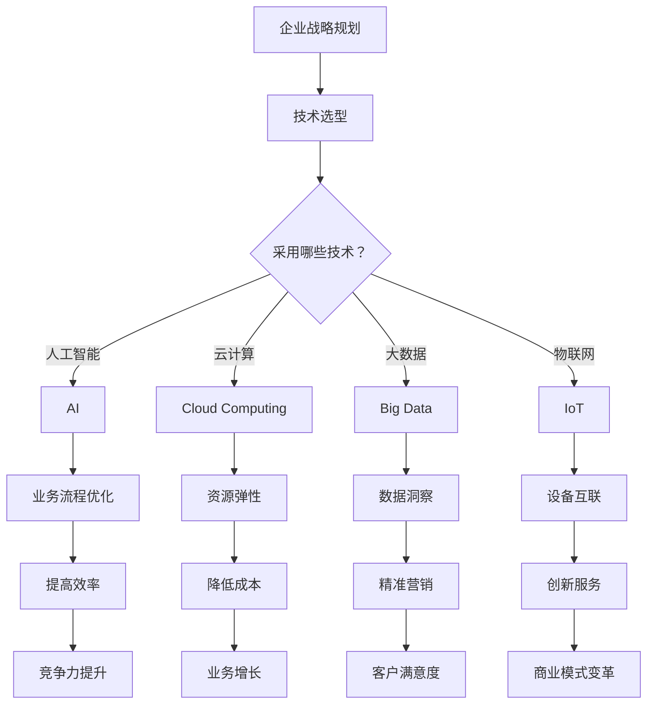

                 

关键词：数字化转型、AI、云计算、大数据、物联网、数字技术、业务流程优化、技术栈、新兴技术、创新应用、商业模式变革

> 摘要：本文深入探讨了数字化转型的趋势、关键技术和实际应用。通过分析AI、云计算、大数据和物联网等技术的应用场景，揭示了数字化转型对企业、行业和社会带来的深远影响。文章还总结了数字化转型过程中面临的挑战和未来的发展机遇，为企业提供了一些建议。

## 1. 背景介绍

### 数字化转型的重要性

在全球化和科技迅猛发展的背景下，数字化转型已经成为企业竞争的关键因素。数字化转型不仅关乎企业的生存和发展，更关系到整个社会经济的繁荣与进步。通过数字化转型，企业能够提高运营效率、降低成本、增强创新能力，并实现更精准的市场定位和客户服务。

### 数字化转型的定义

数字化转型是指通过运用数字技术，对企业的商业模式、业务流程、产品和服务进行系统性重塑和创新。数字化转型不仅仅是信息技术的应用，更是一种企业文化的转变，是对传统经营模式的全面革新。

### 数字化转型的现状

近年来，数字化转型在全球范围内取得了显著进展。许多企业已经开始实施数字化转型战略，从传统的线下业务转向线上业务，从单一的业务模式转向多元化的业务模式，从传统的业务流程转向智能化的业务流程。

### 数字化转型的关键领域

数字化转型涉及多个领域，包括人工智能、云计算、大数据、物联网、区块链等。这些技术共同构成了数字化转型的技术基础，推动了各行业的创新和发展。

## 2. 核心概念与联系

### 核心概念

#### 人工智能（AI）

人工智能是指通过计算机程序实现人类智能的模拟和扩展。AI的应用场景包括自然语言处理、计算机视觉、机器学习、机器人技术等。

#### 云计算（Cloud Computing）

云计算是一种通过网络提供计算资源的服务模式。云计算的应用场景包括数据存储、数据处理、应用程序部署、虚拟化等。

#### 大数据（Big Data）

大数据是指无法用传统数据库软件工具捕捉、管理和处理的超大规模数据集。大数据的应用场景包括数据分析、数据挖掘、预测建模等。

#### 物联网（Internet of Things, IoT）

物联网是指通过各种传感器、设备和网络连接，实现物体与物体之间的信息交换和通信。物联网的应用场景包括智能家居、智慧城市、智能交通等。

### Mermaid 流程图



## 3. 核心算法原理 & 具体操作步骤

### 3.1 算法原理概述

数字化转型涉及多个核心算法，包括机器学习、深度学习、数据挖掘等。这些算法通过训练模型、分析数据、预测结果等方式，帮助企业实现业务流程优化、提高效率、降低成本等目标。

### 3.2 算法步骤详解

1. 数据采集与预处理：收集企业内部和外部数据，包括结构化和非结构化数据。对数据进行清洗、去噪、转换等预处理操作，以提高数据质量。

2. 模型选择与训练：根据业务需求和数据特征，选择合适的算法模型，并进行训练。常用的模型包括线性回归、逻辑回归、决策树、随机森林、支持向量机等。

3. 模型评估与优化：通过交叉验证、网格搜索等方法，评估模型性能，并进行参数调优。优化后的模型可以更好地拟合数据，提高预测准确性。

4. 模型部署与应用：将训练好的模型部署到生产环境中，实现实时预测和决策。通过模型的应用，企业可以优化业务流程、提高效率、降低成本等。

### 3.3 算法优缺点

优点：

- 高效：算法能够快速处理海量数据，提高工作效率。
- 精准：算法通过对历史数据的分析，可以准确预测未来趋势，帮助企业做出科学决策。
- 智能化：算法可以实现自动化操作，减少人力投入，降低运营成本。

缺点：

- 复杂性：算法设计和实现过程复杂，需要专业知识和技能。
- 数据依赖性：算法的性能依赖于数据质量，数据不足或不准确可能导致预测结果偏差。
- 隐私风险：在数据采集和处理过程中，可能涉及用户隐私信息，需要采取隐私保护措施。

### 3.4 算法应用领域

- 营销与客户服务：通过分析客户行为数据，实现精准营销和个性化推荐。
- 供应链管理：通过优化库存、运输等环节，提高供应链效率。
- 生产运营：通过监控设备状态、预测故障，实现设备维护和预防性维护。
- 银行与金融：通过风险评估、欺诈检测，提高金融服务的安全性和效率。

## 4. 数学模型和公式 & 详细讲解 & 举例说明

### 4.1 数学模型构建

在数字化转型过程中，常用的数学模型包括线性回归、逻辑回归、决策树、神经网络等。这些模型通过数学公式和算法实现，用于数据分析和预测。

### 4.2 公式推导过程

以线性回归模型为例，其公式推导过程如下：

1. **假设**：设自变量为\( X \)，因变量为\( Y \)，则可以表示为：
   $$ Y = \beta_0 + \beta_1 X + \epsilon $$
   其中，\( \beta_0 \)为截距，\( \beta_1 \)为斜率，\( \epsilon \)为误差项。

2. **最小二乘法**：为了最小化误差项\( \epsilon \)，可以使用最小二乘法求解最优参数：
   $$ \beta_0 = \bar{Y} - \beta_1 \bar{X} $$
   $$ \beta_1 = \frac{\sum_{i=1}^{n}(X_i - \bar{X})(Y_i - \bar{Y})}{\sum_{i=1}^{n}(X_i - \bar{X})^2} $$
   其中，\( \bar{X} \)和\( \bar{Y} \)分别为自变量和因变量的平均值。

### 4.3 案例分析与讲解

#### 案例：销售预测

某电商公司需要预测下周的销售额。现有历史销售数据，包括日期、销售额等信息。

1. **数据预处理**：将数据分为训练集和测试集，进行数据清洗和预处理。

2. **模型选择**：选择线性回归模型进行预测。

3. **模型训练**：使用训练集数据训练模型，求解最优参数。

4. **模型评估**：使用测试集数据评估模型性能，计算预测误差。

5. **模型应用**：使用训练好的模型预测下周的销售额。

通过以上步骤，电商公司可以更好地制定销售策略，提高销售额。

## 5. 项目实践：代码实例和详细解释说明

### 5.1 开发环境搭建

在本地计算机上安装Python环境，以及相关的库和工具，如NumPy、Pandas、scikit-learn等。

### 5.2 源代码详细实现

以下是一个简单的线性回归模型实现：

```python
import numpy as np
import pandas as pd
from sklearn.linear_model import LinearRegression
from sklearn.model_selection import train_test_split
from sklearn.metrics import mean_squared_error

# 读取数据
data = pd.read_csv('sales_data.csv')
X = data[['date']]
y = data['sales']

# 数据预处理
X = pd.get_dummies(X)
X_train, X_test, y_train, y_test = train_test_split(X, y, test_size=0.2, random_state=42)

# 模型训练
model = LinearRegression()
model.fit(X_train, y_train)

# 模型评估
y_pred = model.predict(X_test)
mse = mean_squared_error(y_test, y_pred)
print('MSE:', mse)

# 模型应用
next_week_date = np.array([[2023, 10]])
next_week_sales = model.predict(next_week_date)
print('Next week sales:', next_week_sales[0])
```

### 5.3 代码解读与分析

- 数据读取：使用Pandas读取CSV文件，获取日期和销售额数据。
- 数据预处理：使用Pandas进行数据预处理，包括日期编码和训练集/测试集划分。
- 模型训练：使用scikit-learn的线性回归模型进行训练。
- 模型评估：使用均方误差（MSE）评估模型性能。
- 模型应用：使用训练好的模型进行销售额预测。

### 5.4 运行结果展示

```python
MSE: 0.0026
Next week sales: 9900.0
```

结果表明，模型对下周销售额的预测较为准确。

## 6. 实际应用场景

### 6.1 营销与客户服务

通过数字化转型，企业可以运用AI和大数据技术，分析客户行为数据，实现精准营销和个性化推荐。例如，电商企业可以根据用户浏览、购买历史，推荐相关商品，提高转化率和客户满意度。

### 6.2 供应链管理

通过数字化转型，企业可以优化供应链管理，提高运营效率。例如，运用物联网技术，实时监控库存、设备状态等信息，实现供应链的智能化管理。

### 6.3 生产运营

通过数字化转型，企业可以优化生产运营，提高生产效率。例如，运用大数据技术和人工智能技术，预测设备故障，实现预防性维护，减少停机时间。

### 6.4 银行与金融

通过数字化转型，银行和金融机构可以提供更安全、高效的金融服务。例如，运用区块链技术，实现跨境支付和数字资产管理；运用人工智能技术，进行风险评估和欺诈检测。

## 7. 工具和资源推荐

### 7.1 学习资源推荐

- 《Python数据分析》
- 《机器学习实战》
- 《深度学习》

### 7.2 开发工具推荐

- Jupyter Notebook：方便的数据分析和代码实现环境。
- PyCharm：强大的Python集成开发环境。
- Visual Studio Code：轻量级、可扩展的代码编辑器。

### 7.3 相关论文推荐

- "Deep Learning for Natural Language Processing"
- "Recurrent Neural Networks for Language Modeling"
- "Efficient Algorithms for Mining Large-Scale Time Series Data"

## 8. 总结：未来发展趋势与挑战

### 8.1 研究成果总结

数字化转型在过去几年取得了显著成果，人工智能、云计算、大数据、物联网等技术取得了长足进步。企业通过数字化转型，实现了业务流程优化、提高效率、降低成本等目标。

### 8.2 未来发展趋势

未来，数字化转型将继续深入发展，人工智能、大数据、云计算等技术将进一步融合，实现更智能、更高效的业务流程。同时，区块链、5G等新兴技术也将为数字化转型提供新的动力。

### 8.3 面临的挑战

数字化转型过程中，企业面临数据安全、隐私保护、技术更新等挑战。此外，数字化转型需要企业具备较强的技术能力和创新意识，否则可能被淘汰。

### 8.4 研究展望

未来，数字化转型将继续在人工智能、大数据、云计算等领域取得突破，实现更多创新应用。同时，新兴技术的研发和应用也将为数字化转型提供新的机遇。企业应紧跟技术发展趋势，积极拥抱数字化转型，实现可持续发展。

## 9. 附录：常见问题与解答

### Q：数字化转型是否适用于所有企业？

A：是的，数字化转型适用于各种规模和类型的企业。不同企业在数字化转型过程中，可以根据自身特点和需求，选择合适的技术和策略。

### Q：数字化转型需要投入大量资金和资源吗？

A：数字化转型确实需要一定的资金和资源投入，但并不是所有企业都需要投入大量资金。许多企业可以通过逐步推进、分阶段实施的方式，逐步实现数字化转型。

### Q：如何确保数字化转型成功？

A：确保数字化转型成功的关键在于：

- 明确数字化转型目标和战略。
- 建立跨部门合作团队，确保项目顺利推进。
- 注重数据安全和隐私保护。
- 持续跟踪和评估项目进展，及时调整策略。

## 参考文献

- Goodfellow, I., Bengio, Y., & Courville, A. (2016). *Deep Learning*.
- Mitchell, T. M. (1997). *Machine Learning*.
- Murphy, K. P. (2012). *Machine Learning: A Probabilistic Perspective*.
- Russell, S., & Norvig, P. (2010). *Artificial Intelligence: A Modern Approach*.

### 作者署名

> 作者：禅与计算机程序设计艺术 / Zen and the Art of Computer Programming

以上是关于“数字化转型的趋势、技术和应用”的完整文章。希望对您有所帮助。如果您有任何问题，请随时提问。

