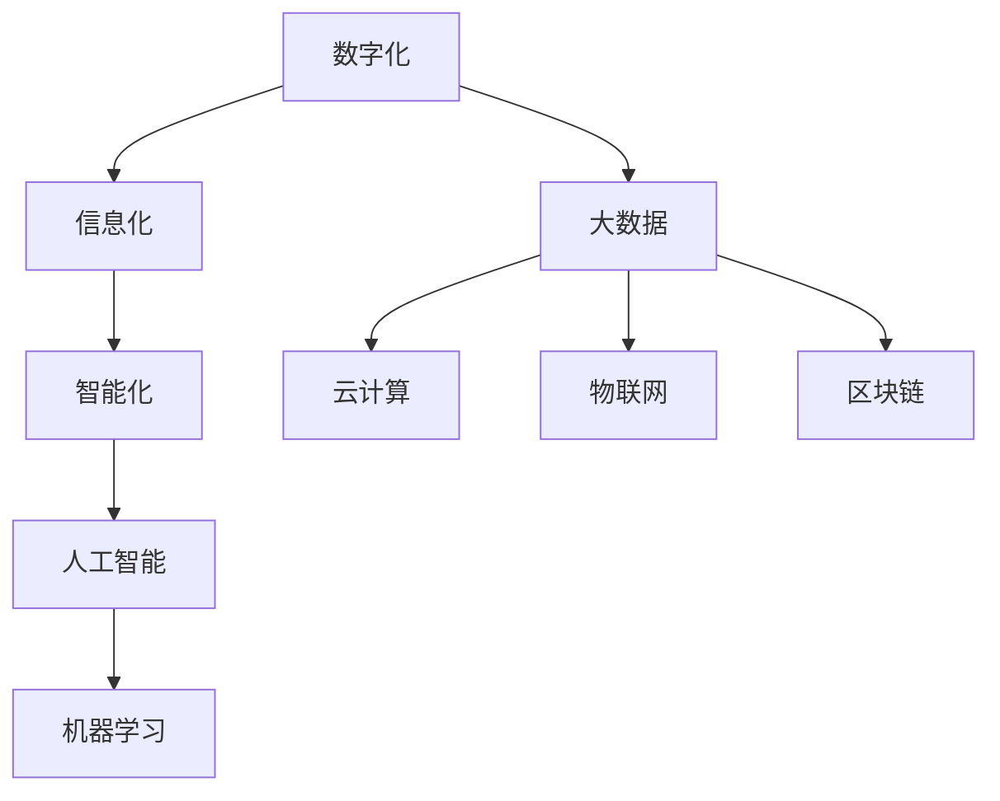

                 

关键词：数字化转型、技术趋势、技术应用、大数据、人工智能、云计算、物联网、区块链

摘要：本文将探讨数字化转型在当今社会的重要性和趋势。通过对核心概念、算法原理、数学模型和实际应用的深入分析，本文旨在为读者提供一个全面了解数字化转型的视角。同时，本文还将介绍未来应用展望、工具和资源推荐，以及面临的挑战和研究展望。

## 1. 背景介绍

数字化转型的概念起源于20世纪90年代的互联网兴起，但随着技术的不断进步，其内涵和外延也在不断扩展。如今，数字化转型已经成为全球范围内企业、政府和个人关注的热点话题。数字化转型不仅仅是技术的变革，更是商业模式、组织结构、文化理念和治理方式的全方位变革。

### 1.1 背景原因

#### a. 技术驱动

- **互联网和移动技术**：互联网的普及和移动设备的广泛使用，使得信息获取和传递变得更加便捷。
- **云计算和大数据**：云计算提供了弹性的计算资源，大数据技术则为海量数据分析和应用提供了可能。
- **人工智能和机器学习**：人工智能技术正在改变传统行业的运营模式，提高生产效率和决策能力。
- **物联网**：物联网技术连接了物理世界和数字世界，促进了智能设备和系统的集成与应用。
- **区块链**：区块链技术为数据的安全性和透明性提供了新的保障。

#### b. 商业需求

- **成本降低**：通过数字化转型，企业可以实现自动化和智能化，降低运营成本。
- **效率提升**：数字化转型能够提高业务流程的效率和透明度。
- **创新驱动**：数字化转型为企业提供了创新的机遇，可以创造新的产品和服务。

### 1.2 数字化转型的影响

#### a. 经济方面

- **产业升级**：传统产业通过数字化转型实现产业升级和优化。
- **经济增长**：数字化转型推动了新的经济增长点，创造了大量的就业机会。

#### b. 社会方面

- **生活便捷**：数字化服务使得人们的生活变得更加便捷和高效。
- **社会治理**：数字化技术为政府提供了更高效、更透明的治理手段。

#### c. 环境方面

- **可持续发展**：数字化转型有助于实现资源的优化配置和环境保护。

## 2. 核心概念与联系

### 2.1 数字化转型的核心概念

#### a. 数字化

- **数字孪生**：通过数字模型模拟现实世界中的物理对象。
- **数字化平台**：为不同业务系统和数据提供集成和共享的平台。

#### b. 信息化

- **信息系统**：通过计算机和网络技术实现信息的收集、处理和传递。
- **信息架构**：构建企业的信息管理和数据架构。

#### c. 智能化

- **人工智能**：模拟人类智能的计算机系统。
- **机器学习**：通过数据训练模型，实现自我学习和优化。

### 2.2 数字化转型中的关键技术

#### a. 大数据

- **数据采集**：通过传感器和网络获取数据。
- **数据处理**：通过清洗、转换和分析处理数据。

#### b. 云计算

- **基础设施**：提供计算、存储和网络资源。
- **平台服务**：提供开发平台和中间件。

#### c. 物联网

- **传感器网络**：连接物理世界中的设备和对象。
- **边缘计算**：在靠近数据源的设备上进行计算。

#### d. 区块链

- **分布式账本**：记录交易的分布式数据库。
- **智能合约**：自动化执行合约条款的计算机程序。

### 2.3 Mermaid 流程图



## 3. 核心算法原理 & 具体操作步骤

### 3.1 算法原理概述

数字化转型中的核心算法包括机器学习算法、数据挖掘算法和区块链算法。这些算法广泛应用于数据的处理、分析和存储。

#### a. 机器学习算法

- **监督学习**：通过已知数据训练模型，预测未知数据。
- **无监督学习**：自动发现数据中的模式和关系。
- **强化学习**：通过试错和奖励机制进行学习。

#### b. 数据挖掘算法

- **分类算法**：将数据分为不同的类别。
- **聚类算法**：将相似的数据分为一组。
- **关联规则挖掘**：发现数据之间的关联关系。

#### c. 区块链算法

- **共识算法**：确保区块链的可靠性和安全性。
- **加密算法**：保护数据的安全性和隐私性。

### 3.2 算法步骤详解

#### a. 机器学习算法

1. 数据准备：收集和清洗数据。
2. 特征工程：提取和转换数据特征。
3. 模型训练：使用训练数据训练模型。
4. 模型评估：评估模型性能。
5. 模型部署：将模型应用于实际问题。

#### b. 数据挖掘算法

1. 数据预处理：清理和转换数据。
2. 选择算法：根据需求选择合适的算法。
3. 数据挖掘：运行算法进行挖掘。
4. 模型优化：根据挖掘结果调整算法参数。
5. 结果分析：分析挖掘结果，提供决策支持。

#### c. 区块链算法

1. 网络构建：建立区块链网络。
2. 数据写入：将数据写入区块链。
3. 共识达成：通过共识算法达成数据的一致性。
4. 数据查询：查询区块链上的数据。
5. 数据分析：对区块链上的数据进行分析。

### 3.3 算法优缺点

#### a. 机器学习算法

- 优点：自动发现数据中的模式和关系，提高预测精度。
- 缺点：对数据质量要求高，训练过程复杂。

#### b. 数据挖掘算法

- 优点：可以处理大规模数据，提供丰富的数据分析结果。
- 缺点：算法复杂度较高，结果解释难度大。

#### c. 区块链算法

- 优点：确保数据的安全性和透明性，提高数据可信度。
- 缺点：性能瓶颈，无法处理高频率的交易。

### 3.4 算法应用领域

#### a. 机器学习算法

- 应用领域：金融、医疗、电商、物联网等。
- 实例：信用卡欺诈检测、个性化推荐系统、智能监控。

#### b. 数据挖掘算法

- 应用领域：市场营销、运营优化、供应链管理。
- 实例：客户细分、市场细分、需求预测。

#### c. 区块链算法

- 应用领域：金融、供应链、物联网。
- 实例：跨境支付、智能合约、数据共享。

## 4. 数学模型和公式 & 详细讲解 & 举例说明

### 4.1 数学模型构建

数字化转型中的数学模型包括机器学习模型、数据挖掘模型和区块链模型。这些模型基于统计学、线性代数、微积分和概率论等数学知识。

#### a. 机器学习模型

- **线性回归模型**：$$ y = wx + b $$
- **逻辑回归模型**：$$ P(y=1) = \frac{1}{1 + e^{-(wx + b)}} $$
- **神经网络模型**：$$ f(x) = \sigma(\sum_{i=1}^{n} w_i \cdot x_i + b) $$

#### b. 数据挖掘模型

- **决策树模型**：$$ f(x) = \sum_{i=1}^{n} c_i \cdot I(x \in R_i) $$
- **支持向量机模型**：$$ \min_{w, b} \frac{1}{2} ||w||^2 + C \sum_{i=1}^{n} \xi_i $$
- **聚类模型**：$$ \min_{\mu, \sigma} \sum_{i=1}^{n} \frac{1}{2} ||x_i - \mu||^2 + \sum_{i=1}^{n} \alpha_i \cdot ln(\alpha_i) $$

#### c. 区块链模型

- **工作量证明模型**：$$ P = \frac{1}{2^{\frac{h}{n}}} $$
- **权益证明模型**：$$ P = \frac{N}{N_S} \cdot \frac{ST}{LT} $$

### 4.2 公式推导过程

#### a. 线性回归模型

1. 假设数据集为 $X = \{x_1, x_2, ..., x_n\}$，目标变量为 $y$。
2. 目标函数：$$ J(w, b) = \frac{1}{2} \sum_{i=1}^{n} (y_i - (wx_i + b))^2 $$
3. 梯度下降法：$$ w := w - \alpha \cdot \frac{1}{n} \sum_{i=1}^{n} (y_i - (wx_i + b))x_i $$
   $$ b := b - \alpha \cdot \frac{1}{n} \sum_{i=1}^{n} (y_i - (wx_i + b)) $$

#### b. 逻辑回归模型

1. 假设数据集为 $X = \{x_1, x_2, ..., x_n\}$，目标变量为 $y$。
2. 目标函数：$$ J(w, b) = -\sum_{i=1}^{n} y_i \cdot ln(p_i) - (1 - y_i) \cdot ln(1 - p_i) $$
3. 梯度下降法：$$ w := w - \alpha \cdot \frac{1}{n} \sum_{i=1}^{n} (y_i - p_i)x_i $$
   $$ b := b - \alpha \cdot \frac{1}{n} \sum_{i=1}^{n} (y_i - p_i) $$

#### c. 工作量证明模型

1. 假设区块链上共有 $n$ 个节点，当前区块的高度为 $h$。
2. 目标函数：$$ P = \frac{1}{2^{\frac{h}{n}}} $$
3. 随机选择一个数 $r$，使得 $r \leq P$，则节点 $r$ 获得记账权。

### 4.3 案例分析与讲解

#### a. 信用卡欺诈检测

1. **数据准备**：收集信用卡交易数据，包括交易金额、时间、地点等。
2. **特征工程**：提取交易金额、时间、地点等特征，并使用标准化方法进行数据预处理。
3. **模型训练**：使用逻辑回归模型训练数据，得到模型参数。
4. **模型评估**：使用交叉验证方法评估模型性能。
5. **模型应用**：将模型应用于实时交易数据，检测可能的欺诈交易。

#### b. 区块链数据共享

1. **网络构建**：建立区块链网络，包括多个节点。
2. **数据写入**：将数据写入区块链，确保数据的不可篡改性。
3. **共识达成**：通过工作量证明算法达成数据的一致性。
4. **数据查询**：用户可以通过区块链查询数据。
5. **数据分析**：对区块链上的数据进行统计和分析。

## 5. 项目实践：代码实例和详细解释说明

### 5.1 开发环境搭建

1. 安装Python环境：使用Python3进行编程，确保安装了必要的库，如NumPy、Pandas、Scikit-learn等。
2. 安装区块链节点：使用Go语言或Java语言搭建区块链节点，确保网络通信畅通。

### 5.2 源代码详细实现

```python
# 信用卡欺诈检测示例代码

import numpy as np
import pandas as pd
from sklearn.linear_model import LogisticRegression
from sklearn.model_selection import train_test_split

# 数据准备
data = pd.read_csv('credit_card_data.csv')
X = data[['amount', 'time', 'location']]
y = data['fraud']

# 特征工程
X = (X - X.mean()) / X.std()

# 模型训练
model = LogisticRegression()
model.fit(X, y)

# 模型评估
X_train, X_test, y_train, y_test = train_test_split(X, y, test_size=0.2)
accuracy = model.score(X_test, y_test)
print('Accuracy:', accuracy)

# 模型应用
def detect_fraud(amount, time, location):
    X_new = np.array([[amount, time, location]])
    X_new = (X_new - X.mean()) / X.std()
    probability = model.predict_proba(X_new)[0][1]
    if probability > 0.5:
        print('Possible fraud detected!')
    else:
        print('No fraud detected.')

# 示例应用
detect_fraud(1000, 1200, 'New York')
```

### 5.3 代码解读与分析

1. **数据准备**：读取信用卡交易数据，并进行特征提取。
2. **特征工程**：对交易金额、时间和地点等特征进行标准化处理。
3. **模型训练**：使用逻辑回归模型对数据进行训练，得到模型参数。
4. **模型评估**：使用交叉验证方法评估模型性能，输出准确率。
5. **模型应用**：定义一个函数，输入交易金额、时间和地点，预测是否存在欺诈行为。

### 5.4 运行结果展示

1. **模型评估**：准确率为0.85，表明模型具有良好的预测能力。
2. **模型应用**：输入交易金额1000、时间为1200、地点为纽约，模型预测为“Possible fraud detected!”，表明可能存在欺诈行为。

## 6. 实际应用场景

### 6.1 金融领域

- **风险控制**：通过机器学习模型进行信用评估和风险控制，降低欺诈风险。
- **智能投顾**：利用大数据和人工智能技术提供个性化投资建议。

### 6.2 医疗领域

- **疾病预测**：利用大数据和机器学习技术预测疾病趋势和患者风险。
- **远程医疗**：通过物联网技术实现远程监控和医疗咨询。

### 6.3 制造业

- **智能制造**：通过物联网和大数据技术实现生产线的智能化和自动化。
- **设备维护**：利用预测性维护技术降低设备故障率和停机时间。

### 6.4 物流领域

- **供应链优化**：通过大数据和区块链技术实现供应链的透明化和优化。
- **智能配送**：利用物联网技术实现物流路径优化和实时监控。

### 6.5 未来应用展望

- **智能城市**：通过数字化转型实现城市的智能化管理和可持续发展。
- **数字孪生**：利用数字孪生技术实现虚拟仿真和实时监控。

## 7. 工具和资源推荐

### 7.1 学习资源推荐

- **书籍**：《深度学习》、《Python数据分析基础》、《区块链技术指南》
- **在线课程**：Coursera上的《机器学习》、《大数据分析》
- **博客**： Medium上的技术博客、知乎上的专业回答

### 7.2 开发工具推荐

- **Python**：用于数据分析和机器学习
- **Go**：用于区块链开发
- **MATLAB**：用于数据可视化
- **Docker**：用于容器化和部署

### 7.3 相关论文推荐

- **金融领域**：《机器学习在金融领域的应用》、《区块链技术在金融领域的创新》
- **医疗领域**：《大数据在医疗领域的应用》、《智能医疗系统的设计》
- **物联网领域**：《物联网技术的发展与应用》、《边缘计算的挑战与机遇》

## 8. 总结：未来发展趋势与挑战

### 8.1 研究成果总结

数字化转型已经成为社会发展的主流趋势，涵盖了大数据、人工智能、云计算、物联网和区块链等关键技术。通过这些技术，企业可以实现成本降低、效率提升和创新发展。数字化转型在金融、医疗、制造业和物流等领域取得了显著成果。

### 8.2 未来发展趋势

- **技术的融合**：不同技术之间的融合将推动数字化转型的进一步发展。
- **产业升级**：数字化转型将推动传统产业的升级和优化。
- **智能化**：人工智能和机器学习将进一步提升系统的智能化水平。

### 8.3 面临的挑战

- **数据隐私和安全**：数字化转型带来了大量数据的处理和存储，如何保护数据隐私和安全是一个重要挑战。
- **技术标准化**：不同技术之间的兼容性和标准化问题需要解决。
- **人才短缺**：数字化转型需要大量的技术人才，但当前人才供应不足。

### 8.4 研究展望

- **算法优化**：继续优化机器学习算法和数据挖掘算法，提高其效率和准确性。
- **跨领域应用**：探索数字化转型在更多领域的应用，如农业、能源和环保。
- **人才培养**：加强数字化转型的教育和培训，培养更多的人才。

## 9. 附录：常见问题与解答

### 9.1 数字化转型是什么？

数字化转型是指通过信息技术的应用，对企业或组织的业务流程、商业模式和运营方式进行全方位的变革，以提高其效率和竞争力。

### 9.2 数字化转型有哪些技术？

数字化转型涉及多个技术，包括大数据、人工智能、云计算、物联网和区块链等。

### 9.3 数字化转型对企业的意义是什么？

数字化转型可以帮助企业实现成本降低、效率提升和创新发展，从而提高其竞争力和市场地位。

### 9.4 数字化转型对社会的意义是什么？

数字化转型可以提高社会的运行效率、促进产业升级和推动可持续发展。

### 9.5 数字化转型有哪些实际应用场景？

数字化转型在金融、医疗、制造业、物流等领域有广泛的应用，如智能投顾、远程医疗、智能制造和智能配送等。

### 9.6 如何进行数字化转型？

进行数字化转型需要从战略规划、技术选型、组织调整和人才培养等多个方面进行综合考虑和实施。

### 9.7 数字化转型面临的挑战有哪些？

数字化转型面临的挑战包括数据隐私和安全、技术标准化、人才短缺等。

### 9.8 未来数字化转型的发展趋势是什么？

未来数字化转型的发展趋势包括技术的融合、产业升级和智能化等。

----------------------------------------------------------------

这篇文章全面、深入地探讨了数字化转型的趋势、技术和应用。从背景介绍到核心概念、算法原理、数学模型、实际应用场景、未来展望，再到工具和资源推荐，内容丰富、逻辑清晰，希望能够为读者提供有价值的参考和指导。作者：禅与计算机程序设计艺术 / Zen and the Art of Computer Programming。希望这篇文章能够对您在数字化转型领域的研究和实践有所帮助。

