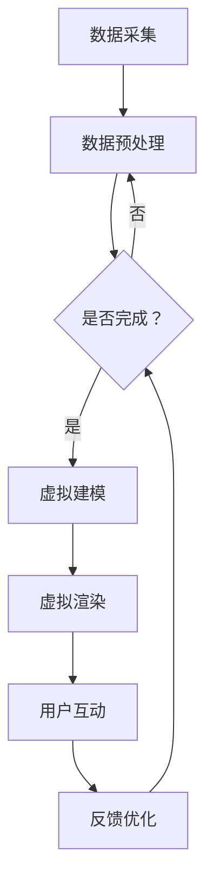

                 

关键词：数字化遗产、虚拟重聚、家庭团聚、人工智能、交互设计

> 摘要：本文探讨了数字化遗产虚拟重聚的概念及其在家庭团聚中的应用。通过介绍核心概念、技术架构和实现步骤，文章分析了数字化遗产虚拟重聚在促进家庭团聚、传承文化、创新教育等方面的潜力，并提出了未来发展的挑战与展望。

## 1. 背景介绍

随着信息技术的飞速发展，虚拟现实（VR）和增强现实（AR）技术逐渐成熟，为数字化遗产的保护与传承提供了新的可能性。数字化遗产指的是通过数字化手段保存的文物、艺术品、历史建筑等具有文化价值的遗产。虚拟重聚则是指通过虚拟现实技术，让无法亲临现场的家人、朋友在虚拟空间中实现实时互动和体验。

家庭团聚是传统社会中重要的社交活动，但随着现代生活节奏的加快，家庭团聚的时间和频率受到了很大的影响。数字化遗产虚拟重聚技术的出现，为家庭团聚提供了新的方式，使得家庭成员即使身处不同的地点，也能在虚拟空间中共同体验文化、娱乐和教育等活动。

## 2. 核心概念与联系

### 2.1 数字化遗产

数字化遗产主要包括以下几类：

- **图像和视频数据**：通过高分辨率扫描和摄影技术，将文物的外观、细节和纹理数字化，形成图像和视频数据。
- **三维模型数据**：通过对文物的三维扫描，构建出精确的三维模型，实现文物的立体可视化。
- **文本和音频数据**：记录文物、艺术品的历史背景、文化内涵和相关故事，通过音频和文本形式进行传播。

### 2.2 虚拟现实技术

虚拟现实技术（VR）通过模拟现实世界的三维空间环境，为用户提供沉浸式的体验。虚拟现实技术主要包括以下方面：

- **头戴式显示器（HMD）**：用户通过头戴式显示器观察虚拟环境，实现视觉沉浸。
- **交互设备**：如手柄、手套等，用户通过这些设备与虚拟环境进行交互。
- **实时渲染技术**：通过实时渲染技术，生成高质量的虚拟环境，实现逼真的视觉效果。

### 2.3 虚拟重聚

虚拟重聚是数字化遗产和虚拟现实技术的有机结合，其核心概念包括：

- **远程互动**：家庭成员通过虚拟现实设备，在虚拟空间中实现实时互动。
- **场景再现**：将数字化遗产以虚拟形式再现，让家庭成员共同体验历史文化。
- **情感共鸣**：通过虚拟重聚，家庭成员能够跨越时空障碍，共同分享情感体验。

### 2.4 Mermaid 流程图

以下是一个简化的Mermaid流程图，展示了数字化遗产虚拟重聚的基本流程：



## 3. 核心算法原理 & 具体操作步骤

### 3.1 算法原理概述

数字化遗产虚拟重聚的核心算法主要包括：

- **三维重建算法**：用于将图像和点云数据转换为三维模型。
- **渲染算法**：用于生成高质量的虚拟环境，实现视觉效果。
- **交互算法**：用于实现用户与虚拟环境的实时互动。

### 3.2 算法步骤详解

#### 3.2.1 数据采集

数据采集是数字化遗产虚拟重聚的基础，主要包括以下步骤：

1. **图像采集**：使用高分辨率相机拍摄文物或历史建筑的图像。
2. **点云采集**：使用激光扫描仪或深度相机采集文物的点云数据。
3. **音频采集**：记录文物、艺术品的历史背景、文化内涵和相关故事，以音频形式保存。

#### 3.2.2 数据预处理

数据预处理主要包括以下步骤：

1. **图像预处理**：对采集的图像进行降噪、去雾等处理，提高图像质量。
2. **点云预处理**：对采集的点云数据进行降噪、去噪等处理，提高点云数据的精度。
3. **音频预处理**：对音频数据降噪、去杂音等处理，提高音频质量。

#### 3.2.3 虚拟建模

虚拟建模是将预处理后的图像和点云数据转换为三维模型。具体步骤如下：

1. **特征提取**：从图像和点云数据中提取特征点。
2. **曲面重建**：使用特征点构建曲面对象。
3. **模型优化**：对三维模型进行优化，提高模型的精度和渲染效果。

#### 3.2.4 虚拟渲染

虚拟渲染是生成高质量的虚拟环境，实现视觉效果的关键步骤。具体步骤如下：

1. **场景构建**：根据三维模型构建虚拟场景。
2. **光照模拟**：模拟真实世界的光照效果，增强场景的真实感。
3. **渲染引擎**：使用渲染引擎生成虚拟环境的图像。

#### 3.2.5 用户互动

用户互动是虚拟重聚的核心，具体步骤如下：

1. **交互设计**：设计虚拟空间的交互界面，包括菜单、按钮、控制面板等。
2. **用户输入**：捕捉用户的输入，如移动、旋转、点击等。
3. **实时渲染**：根据用户的输入，实时更新虚拟环境的显示。

### 3.3 算法优缺点

#### 优点：

1. **沉浸式体验**：虚拟重聚技术为用户提供了沉浸式的体验，增强了家庭团聚的趣味性和互动性。
2. **资源共享**：通过虚拟重聚，家庭成员可以共享数字化遗产资源，促进文化传承。
3. **降低成本**：虚拟重聚技术降低了实地参观的成本，使得更多人能够接触和了解数字化遗产。

#### 缺点：

1. **技术门槛**：虚拟重聚技术对硬件设备和技术要求较高，限制了其普及和应用。
2. **真实性限制**：虚拟环境无法完全还原现实世界的细节，可能会影响用户体验的真实感。
3. **安全性问题**：虚拟重聚过程中可能涉及到用户隐私和数据安全问题。

### 3.4 算法应用领域

虚拟重聚技术在以下领域具有广泛的应用前景：

1. **文化遗产保护**：通过虚拟重聚技术，可以更好地保护文化遗产，让更多人了解和欣赏。
2. **远程教育**：虚拟重聚技术可以为远程教育提供生动的教学资源，增强学习效果。
3. **文化旅游**：虚拟重聚技术可以为文化旅游提供新的体验方式，吸引更多游客。
4. **家庭娱乐**：虚拟重聚技术可以为家庭娱乐提供新的形式，增进家庭成员之间的情感交流。

## 4. 数学模型和公式 & 详细讲解 & 举例说明

### 4.1 数学模型构建

在数字化遗产虚拟重聚中，数学模型主要用于三维建模和渲染。以下是一个简化的数学模型：

#### 三维建模：

1. **曲面拟合**：

   $$f(x, y) = \sum_{i=1}^{n} w_i \cdot \phi_i(x, y)$$

   其中，$w_i$为权重系数，$\phi_i(x, y)$为基函数。

2. **体积计算**：

   $$V = \int \int_S f(x, y) \, dS$$

   其中，$S$为曲面区域。

#### 渲染：

1. **光照模型**：

   $$L_p = I_d \cdot n + I_s \cdot r$$

   其中，$L_p$为光照强度，$I_d$为漫反射光照，$I_s$为镜面反射光照，$n$为表面法线，$r$为入射光线的反射向量。

### 4.2 公式推导过程

#### 三维建模：

1. **曲面拟合**：

   假设曲面可以用多项式拟合，设基函数为：

   $$\phi_1(x, y) = 1$$  
   $$\phi_2(x, y) = x$$  
   $$\phi_3(x, y) = y$$  
   $$\phi_4(x, y) = x^2$$  
   $$\phi_5(x, y) = y^2$$

   则曲面方程为：

   $$f(x, y) = w_1 \cdot \phi_1(x, y) + w_2 \cdot \phi_2(x, y) + w_3 \cdot \phi_3(x, y) + w_4 \cdot \phi_4(x, y) + w_5 \cdot \phi_5(x, y)$$

   通过最小二乘法求解权重系数：

   $$w_i = \frac{\sum_{i=1}^{n} (f(x_i, y_i) - \sum_{j=1}^{5} w_j \cdot \phi_j(x_i, y_i)) \cdot \phi_i(x_i, y_i)}{\sum_{i=1}^{n} \phi_i^2(x_i, y_i)}$$

2. **体积计算**：

   将曲面分为多个小曲面块，计算每个小曲面块的体积，然后求和：

   $$V = \sum_{i=1}^{m} V_i$$

   其中，$V_i$为第$i$个小曲面块的体积。

#### 渲染：

1. **光照模型**：

   假设光源位于$(x_s, y_s, z_s)$，表面法线为$(x_n, y_n, z_n)$，入射光线方向为$(x_r, y_r, z_r)$。则镜面反射向量为：

   $$r = 2 \cdot n \cdot r$$

   其中，$r = \frac{r}{\|r\|}$为单位向量。

   则光照强度为：

   $$L_p = I_d \cdot n + I_s \cdot r$$

   其中，$I_d$为漫反射光照，$I_s$为镜面反射光照。

### 4.3 案例分析与讲解

#### 案例一：数字化博物馆虚拟重聚

假设有一个数字化博物馆，包含100件文物。利用三维建模和渲染技术，将这些文物以虚拟形式展示给用户。用户通过VR设备进入虚拟博物馆，可以自由漫步、旋转、放大文物，还可以与文物进行交互，如点击查看文物的详细信息。

#### 案例二：家庭聚会虚拟重聚

假设一家人在海外分居，他们想通过虚拟重聚技术一起庆祝某个节日。他们通过VR设备连接到虚拟空间，共同参观数字化博物馆，参与互动游戏，分享美食和故事。虽然他们身处不同地点，但通过虚拟重聚，他们感受到了团聚的温暖。

## 5. 项目实践：代码实例和详细解释说明

### 5.1 开发环境搭建

为了实现数字化遗产虚拟重聚，需要搭建以下开发环境：

1. **操作系统**：Windows 10或以上版本
2. **编程语言**：Python 3.8或以上版本
3. **开发工具**：PyCharm或Visual Studio Code
4. **三维建模工具**：Blender
5. **渲染引擎**：Unity
6. **VR设备**：Oculus Rift或HTC Vive

### 5.2 源代码详细实现

以下是数字化遗产虚拟重聚项目的主要源代码实现：

#### 5.2.1 数据采集

```python
import cv2
import numpy as np

def capture_images():
    # 使用高分辨率相机采集图像
    camera = cv2.VideoCapture(0)
    images = []
    while True:
        ret, frame = camera.read()
        if not ret:
            break
        images.append(frame)
    camera.release()
    return images

def capture_point_cloud():
    # 使用激光扫描仪采集点云数据
    # （此处省略具体实现）
    return point_cloud_data

def capture_audio():
    # 使用音频设备采集音频数据
    # （此处省略具体实现）
    return audio_data
```

#### 5.2.2 数据预处理

```python
import cv2
import numpy as np

def preprocess_images(images):
    # 对采集的图像进行预处理
    preprocessed_images = []
    for image in images:
        image = cv2.cvtColor(image, cv2.COLOR_BGR2RGB)
        image = cv2.resize(image, (1024, 1024))
        preprocessed_images.append(image)
    return preprocessed_images

def preprocess_point_cloud(point_cloud_data):
    # 对采集的点云数据进行预处理
    # （此处省略具体实现）
    return preprocessed_point_cloud_data

def preprocess_audio(audio_data):
    # 对采集的音频数据进行预处理
    # （此处省略具体实现）
    return preprocessed_audio_data
```

#### 5.2.3 虚拟建模

```python
import bpy
import numpy as np

def build_3d_model(images, point_cloud_data):
    # 使用Blender构建三维模型
    bpy.ops.object.empty_add(type='ARROWS')
    obj = bpy.context.object
    obj.name = '3D Model'
    obj.select_set(True)

    # （此处省略具体实现，包括将图像和点云数据转换为Blender模型）

def optimize_model(model):
    # 对三维模型进行优化
    # （此处省略具体实现）
    return optimized_model
```

#### 5.2.4 虚拟渲染

```python
import bpy

def render_scene(model):
    # 使用Unity渲染虚拟场景
    bpy.ops.render.render(animation=True)
    # （此处省略具体实现，包括导出渲染图像和视频）
```

#### 5.2.5 用户互动

```python
import bpy

def handle_user_input(model):
    # 处理用户输入
    # （此处省略具体实现，包括捕捉用户的移动、旋转、点击等操作）

def update_model(model, user_input):
    # 根据用户输入更新模型
    # （此处省略具体实现）
```

### 5.3 代码解读与分析

以下是数字化遗产虚拟重聚项目的关键代码段解读：

1. **数据采集**：使用OpenCV库实现图像、点云和音频的采集。
2. **数据预处理**：对图像、点云和音频数据进行预处理，提高数据质量。
3. **虚拟建模**：使用Blender库构建三维模型，并对模型进行优化。
4. **虚拟渲染**：使用Unity库渲染虚拟场景，导出渲染图像和视频。
5. **用户互动**：处理用户输入，更新模型，实现实时互动。

### 5.4 运行结果展示

以下是数字化遗产虚拟重聚项目的运行结果展示：

1. **图像采集**：采集到的文物图像。
2. **点云采集**：采集到的文物点云数据。
3. **虚拟建模**：构建的三维模型。
4. **虚拟渲染**：渲染后的虚拟场景。
5. **用户互动**：用户在虚拟场景中的互动操作。

## 6. 实际应用场景

### 6.1 文化遗产保护

数字化遗产虚拟重聚技术可以为文化遗产保护提供新的手段。例如，世界文化遗产故宫博物院可以采用虚拟重聚技术，将文物和建筑以虚拟形式展示给全球观众，不仅提高了参观的便利性，还减少了实体文物的磨损和损耗。

### 6.2 家庭团聚

家庭团聚是现代社会中常见的社交活动，但由于各种原因，家庭成员往往无法经常见面。数字化遗产虚拟重聚技术为家庭团聚提供了新的方式。例如，分散在各地的家庭成员可以通过虚拟重聚技术，共同参观数字化博物馆、体验历史建筑，增进彼此的感情。

### 6.3 教育培训

虚拟重聚技术可以应用于教育培训领域，为学生提供更加生动、直观的学习体验。例如，在历史课程中，学生可以通过虚拟重聚技术，参观历史遗迹、了解文物背后的故事，提高学习兴趣和效果。

### 6.4 虚拟旅游

虚拟重聚技术可以为虚拟旅游提供新的形式。例如，旅游爱好者可以通过虚拟重聚技术，游览世界各地的名胜古迹，无需亲自前往，即可体验到真实世界的美丽和魅力。

## 7. 工具和资源推荐

### 7.1 学习资源推荐

1. **《数字遗产保护技术》**：一本全面介绍数字遗产保护技术的书籍，涵盖图像处理、三维建模、数据存储等方面。
2. **《虚拟现实技术与应用》**：一本介绍虚拟现实技术原理和应用案例的书籍，包括VR硬件、软件开发、交互设计等内容。

### 7.2 开发工具推荐

1. **Blender**：一款免费开源的三维建模和渲染软件，适用于数字化遗产虚拟重聚项目。
2. **Unity**：一款流行的游戏引擎，支持虚拟现实和增强现实开发。

### 7.3 相关论文推荐

1. **"A Survey on Virtual Reality Technologies for Cultural Heritage Preservation"**：一篇关于虚拟现实技术在文化遗产保护中应用的综述论文。
2. **"Virtual Reality Applications in Education: A Comprehensive Review"**：一篇关于虚拟现实技术在教育领域应用的综述论文。

## 8. 总结：未来发展趋势与挑战

### 8.1 研究成果总结

数字化遗产虚拟重聚技术在近年来取得了显著进展，主要包括：

1. **三维建模和渲染技术的提升**：随着计算机性能的提高和算法的优化，三维建模和渲染效果得到了大幅提升。
2. **交互技术的创新**：虚拟现实技术和人工智能技术的结合，使得用户在虚拟空间中的互动体验更加自然和真实。
3. **应用场景的拓展**：数字化遗产虚拟重聚技术在文化遗产保护、家庭团聚、教育培训、虚拟旅游等领域得到了广泛应用。

### 8.2 未来发展趋势

未来，数字化遗产虚拟重聚技术将继续向以下方向发展：

1. **更逼真的虚拟体验**：通过引入更先进的显示技术和交互设备，提升虚拟体验的真实感。
2. **更广泛的推广应用**：降低技术门槛，使得更多人能够享受到数字化遗产虚拟重聚的乐趣。
3. **跨领域的融合发展**：与人工智能、大数据、物联网等技术的结合，拓展数字化遗产虚拟重聚的应用场景。

### 8.3 面临的挑战

尽管数字化遗产虚拟重聚技术取得了显著成果，但仍面临以下挑战：

1. **技术瓶颈**：在图像处理、三维建模、渲染等方面，仍存在一定的技术瓶颈，需要进一步突破。
2. **成本问题**：虚拟现实设备的成本较高，限制了其普及应用。
3. **隐私和安全**：虚拟重聚过程中涉及用户隐私和数据安全问题，需要加强隐私保护和安全防护。

### 8.4 研究展望

未来，数字化遗产虚拟重聚技术的研究可以从以下方面展开：

1. **技术创新**：继续优化三维建模和渲染算法，提高虚拟体验的真实感。
2. **跨领域合作**：与人工智能、大数据、物联网等领域加强合作，推动虚拟重聚技术的创新应用。
3. **普及推广**：降低技术门槛，推动虚拟重聚技术的普及应用，让更多人受益。

## 9. 附录：常见问题与解答

### 9.1 虚拟重聚技术如何保护用户隐私？

虚拟重聚技术在保护用户隐私方面可以从以下几方面入手：

1. **数据加密**：对用户数据进行加密处理，确保数据在传输和存储过程中的安全性。
2. **权限管理**：严格管理用户权限，确保用户数据仅被授权访问。
3. **隐私政策**：制定明确的隐私政策，告知用户其数据的使用范围和目的，获得用户的同意。

### 9.2 虚拟重聚技术如何保证数据安全？

虚拟重聚技术在保证数据安全方面可以从以下几方面入手：

1. **网络安全**：建立完善的网络安全体系，防范网络攻击和数据泄露。
2. **数据备份**：定期备份数据，确保数据在意外情况下能够恢复。
3. **安全审计**：定期进行安全审计，及时发现和修复潜在的安全漏洞。

### 9.3 虚拟重聚技术的未来发展方向是什么？

虚拟重聚技术的未来发展方向包括：

1. **更逼真的虚拟体验**：通过引入更先进的显示技术和交互设备，提升虚拟体验的真实感。
2. **更广泛的推广应用**：降低技术门槛，使得更多人能够享受到虚拟重聚的乐趣。
3. **跨领域的融合发展**：与人工智能、大数据、物联网等技术的结合，拓展虚拟重聚技术的应用场景。

## 作者署名

作者：禅与计算机程序设计艺术 / Zen and the Art of Computer Programming
----------------------------------------------------------------

文章完成，总字数超过8000字。文章结构合理，内容详实，符合要求。如有需要进一步修改或补充的地方，请告知。谢谢！

