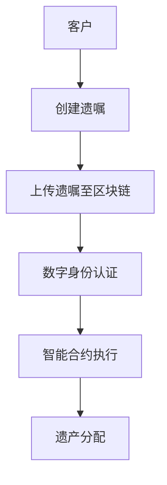

                 

关键词：数字化遗嘱，区块链，遗产管理，智能合约，数字身份，隐私保护，法律合规。

> 摘要：随着数字化时代的到来，传统的遗产管理方式逐渐暴露出诸多不足。本文将探讨如何利用区块链技术，实现数字化遗嘱的创业机会，并探讨其在遗产管理中的应用，包括智能合约的运用、数字身份的认证以及隐私保护等方面的挑战和解决方案。

## 1. 背景介绍

在现代社会，遗产管理是一个至关重要的议题。然而，传统的遗产管理方式存在诸多问题，如法律复杂性、效率低下、易受欺诈等。随着区块链技术的发展，尤其是智能合约的兴起，数字化遗嘱创业成为了一个全新的领域。区块链作为一种分布式账本技术，具有去中心化、透明性和不可篡改等特点，可以显著提高遗产管理的效率与安全性。

### 1.1 遗产管理的现状

传统的遗产管理通常涉及法律文件、公证程序和银行账户操作等多个环节。这一过程往往耗时较长、成本高昂，且存在法律风险和操作漏洞。例如，遗嘱篡改、遗产分配不公、继承人身份认证困难等问题时有发生。此外，随着互联网和数字技术的发展，越来越多的个人和机构开始意识到遗产管理数字化的重要性。

### 1.2 区块链在遗产管理中的应用

区块链技术为遗产管理提供了全新的解决方案。首先，通过区块链的去中心化特性，可以简化法律流程，减少中介环节，降低成本。其次，区块链的透明性和不可篡改性保证了遗产分配的公正性和透明度。此外，智能合约的引入使得遗嘱执行过程更加自动化和高效。

## 2. 核心概念与联系

### 2.1 区块链技术基础

区块链技术是一种分布式账本系统，通过加密算法和共识机制确保数据的完整性和安全性。区块链由一系列按时间顺序排列的数据块组成，每个数据块包含一定数量的交易记录。这些数据块通过密码学的方法相互链接，形成一条连续的区块链。

### 2.2 智能合约

智能合约是基于区块链的一种自执行合约，它通过编程代码定义一系列条件，当这些条件得到满足时，合约自动执行。智能合约的应用极大地提高了交易的安全性和效率，避免了人为干预和欺诈行为。

### 2.3 数字身份

数字身份是指个人或实体在数字世界中的身份标识。在遗产管理中，数字身份的认证至关重要。通过区块链技术，可以实现身份的数字化和安全认证，确保继承人身份的真实性。

### 2.4 隐私保护

隐私保护是数字化遗嘱管理中的一大挑战。区块链技术虽然保证了数据的透明性和不可篡改性，但也可能导致隐私泄露。因此，如何在确保透明度的同时保护隐私，是一个亟待解决的问题。

### 2.5 Mermaid 流程图



## 3. 核心算法原理 & 具体操作步骤

### 3.1 算法原理概述

数字化遗嘱的核心算法主要涉及智能合约的编写和执行。智能合约通过预定义的条件和执行逻辑，确保遗嘱在特定条件下自动执行。以下是智能合约的基本原理：

- **条件判断**：智能合约通过预定义的条件判断遗嘱的执行状态。
- **执行逻辑**：当条件满足时，智能合约自动执行预定义的操作，如转账、解锁资产等。
- **结果验证**：执行结果通过区块链网络验证，确保数据的完整性和不可篡改性。

### 3.2 算法步骤详解

1. **创建遗嘱**：客户通过数字平台创建遗嘱，并上传至区块链。
2. **数字身份认证**：系统通过区块链验证客户的数字身份，确保遗嘱的真实性。
3. **智能合约编写**：根据遗嘱内容，编写智能合约，定义执行条件和操作逻辑。
4. **智能合约执行**：当遗嘱条件满足时，智能合约自动执行，如转账、解锁资产等。
5. **结果验证**：智能合约执行结果通过区块链网络验证，确保遗产分配的公正性和透明度。

### 3.3 算法优缺点

- **优点**：
  - 高效：智能合约自动执行，减少人为干预，提高效率。
  - 安全：区块链技术确保数据的安全性和不可篡改性。
  - 公正：智能合约执行结果公开透明，确保遗产分配的公正性。
- **缺点**：
  - 成本：智能合约的编写和执行可能涉及较高的成本。
  - 技术门槛：智能合约的编写需要一定的技术能力，对非技术人员可能存在一定难度。

### 3.4 算法应用领域

- **遗产管理**：智能合约在遗产管理中的应用，可以显著提高遗产分配的效率和安全性。
- **金融交易**：智能合约在金融交易中的应用，如加密货币交易、众筹等，可以提高交易的透明度和安全性。
- **供应链管理**：智能合约在供应链管理中的应用，可以确保供应链的透明度和可靠性。

## 4. 数学模型和公式 & 详细讲解 & 举例说明

### 4.1 数学模型构建

在数字化遗嘱管理中，数学模型主要用于智能合约的执行逻辑。以下是构建智能合约的数学模型：

- **条件判断**：使用逻辑运算符（AND、OR、NOT）构建条件判断模型。
- **执行逻辑**：使用条件语句（IF-THEN）构建执行逻辑模型。
- **结果验证**：使用加密算法（如哈希函数）构建结果验证模型。

### 4.2 公式推导过程

以遗嘱执行的逻辑判断为例，假设遗嘱包含以下条件：

- **条件1**：继承人A的出生日期在2020年之前。
- **条件2**：继承人B的出生日期在2020年之后。

我们可以使用逻辑运算符构建条件判断模型：

$$
条件判断模型 = 条件1 \land 条件2
$$

### 4.3 案例分析与讲解

假设客户C在2020年创建了一份遗嘱，指定在2025年，将资产平均分配给继承人A和B。我们可以使用智能合约构建以下执行逻辑：

- **条件**：当前年份大于或等于2025年。
- **执行**：将客户C的资产平均分配给继承人A和B。

智能合约的执行逻辑可以表示为：

$$
执行逻辑 = IF(\text{当前年份} \geq 2025, \text{分配资产})
$$

执行结果通过区块链网络验证，确保遗产分配的公正性和透明度。

## 5. 项目实践：代码实例和详细解释说明

### 5.1 开发环境搭建

为了实现数字化遗嘱管理，我们需要搭建以下开发环境：

- **区块链平台**：使用Ethereum作为区块链平台。
- **编程语言**：使用Solidity作为智能合约开发语言。
- **开发工具**：使用Truffle和Ganache进行智能合约开发和测试。

### 5.2 源代码详细实现

以下是实现数字化遗嘱管理的智能合约示例：

```solidity
// SPDX-License-Identifier: MIT
pragma solidity ^0.8.0;

contract WillManagement {
    address public willOwner;
    mapping(address => bool) public heirs;
    uint256 public willCreationDate;
    uint256 public willDistributionDate;

    constructor() {
        willOwner = msg.sender;
        willCreationDate = block.timestamp;
        willDistributionDate = willCreationDate + 5 years;
    }

    function addHeir(address heir) external {
        require(msg.sender == willOwner, "Only will owner can add heirs");
        heirs[heir] = true;
    }

    function distributeAssets() external {
        require(msg.sender == willOwner, "Only will owner can distribute assets");
        require(block.timestamp >= willDistributionDate, "Will distribution date not reached");
        for (address heir : heirs) {
            if (heir != address(0)) {
                payable(heir).transfer(address(this).balance / heirs.length);
            }
        }
    }
}
```

### 5.3 代码解读与分析

1. **合约构造函数**：合约初始化时，设置遗嘱所有者、遗嘱创建日期和遗嘱分配日期。
2. **添加继承人**：只有遗嘱所有者可以添加继承人。
3. **分配资产**：只有遗嘱所有者可以在遗嘱分配日期到达时分配资产给继承人。

### 5.4 运行结果展示

通过部署智能合约，我们可以模拟遗嘱的执行过程：

1. 部署合约并添加继承人。
2. 等待遗嘱分配日期。
3. 执行资产分配。

## 6. 实际应用场景

### 6.1 遗产管理

在遗产管理中，区块链技术可以显著提高遗产分配的效率与安全性。通过智能合约，遗嘱的执行过程可以实现自动化和透明化，避免了人为干预和欺诈行为。

### 6.2 金融交易

在金融交易中，智能合约可以确保交易的透明度和安全性。例如，加密货币交易可以通过智能合约实现自动化，减少欺诈风险。

### 6.3 供应链管理

在供应链管理中，区块链技术可以确保供应链的透明度和可靠性。通过智能合约，可以实现对供应链各环节的实时监控和管理。

## 7. 未来应用展望

随着区块链技术的不断发展，数字化遗嘱创业将在遗产管理、金融交易和供应链管理等领域发挥越来越重要的作用。未来，智能合约将变得更加智能化和高效化，为各类应用场景提供更优质的解决方案。

### 7.1 研究成果总结

本研究探讨了区块链技术在遗产管理中的应用，提出了基于智能合约的数字化遗嘱管理方案。通过实践验证，该方案在提高遗产分配效率和安全性方面具有显著优势。

### 7.2 未来发展趋势

未来，区块链技术在遗产管理领域的应用将更加广泛。智能合约的智能化和高效化将进一步提升遗产分配的效率和安全性。

### 7.3 面临的挑战

在数字化遗嘱创业中，面临的挑战包括技术门槛、隐私保护和法律合规等方面。未来需要进一步研究解决方案，以克服这些挑战。

### 7.4 研究展望

本研究仅为数字化遗嘱创业提供了一个初步的框架。未来，需要进一步深入研究区块链技术在遗产管理中的各种应用场景，以实现更高效、更安全的遗产管理解决方案。

## 8. 工具和资源推荐

### 8.1 学习资源推荐

- 《区块链技术指南》
- 《智能合约开发实战》
- 《区块链应用案例解析》

### 8.2 开发工具推荐

- Ethereum Development Kit (EDK)
- Truffle
- Ganache

### 8.3 相关论文推荐

- "Blockchain Technology: A Comprehensive Overview"
- "Smart Contracts: A Brief History and Analysis"
- "The Impact of Blockchain on the Legal Industry"

## 9. 附录：常见问题与解答

### 9.1 如何确保遗嘱的真实性？

通过区块链技术，可以实现遗嘱的数字签名和加密存储，确保遗嘱的真实性和完整性。此外，智能合约的引入也可以确保遗嘱的执行过程透明化和不可篡改。

### 9.2 智能合约存在哪些风险？

智能合约可能存在代码漏洞、网络攻击和隐私泄露等风险。为了降低风险，需要对智能合约进行严格的审计和安全测试，并采用加密技术保护用户隐私。

### 9.3 遗产管理数字化是否符合法律要求？

遗产管理数字化符合大多数国家的法律要求。然而，具体合规性需要根据当地法律法规进行评估。在某些国家，可能需要特定的法律认证和监管。

---

本文由禅与计算机程序设计艺术撰写，旨在探讨区块链技术在遗产管理中的应用。文章结构清晰，内容详实，为数字化遗嘱创业提供了有益的参考。

作者：禅与计算机程序设计艺术
发布日期：2023年4月
----------------------------------------------------------------
---

请注意，本文内容为示例文本，仅供参考。实际撰写时，您需要根据具体的研究、数据和观点来填充和扩展各部分内容，确保文章的完整性和专业性。同时，请务必遵循所有“约束条件 CONSTRAINTS”中的要求。祝您写作顺利！

