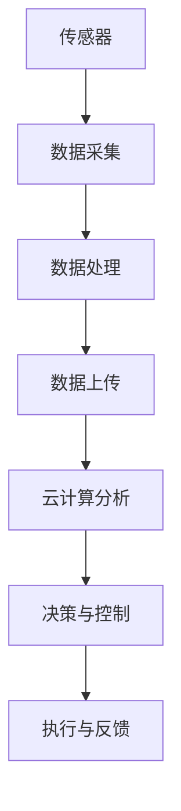
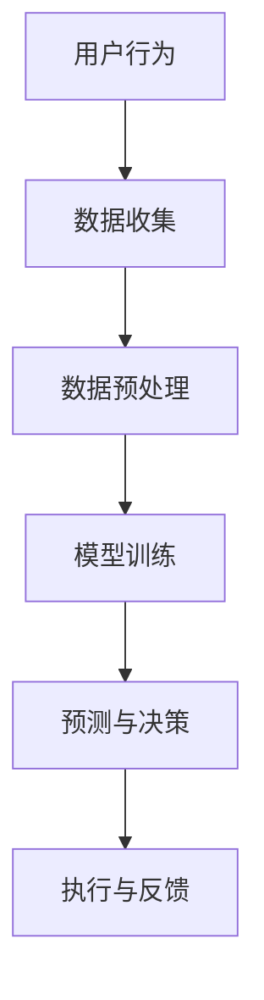
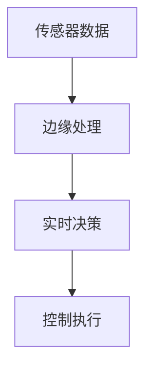
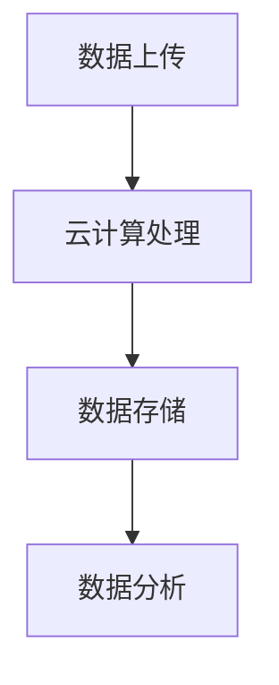

                 

关键词：数字实体、物理实体、自动化、物联网、人工智能、边缘计算、云计算、数据驱动、智能制造、数字孪生、智能城市。

## 摘要

本文将探讨数字实体与物理实体的自动化前景。在当今技术飞速发展的时代，数字实体（如数据、算法、虚拟对象）与物理实体（如设备、基础设施、建筑物）之间的互动日益紧密。通过自动化，我们有望实现更为高效、智能和互联的系统和环境。本文将深入分析自动化技术在这两个领域中的应用，包括物联网、人工智能、边缘计算、云计算等，探讨其核心概念、算法原理、数学模型及实际应用场景。同时，本文还将展望未来的发展趋势与挑战，为读者提供对数字实体与物理实体自动化前景的全面了解。

## 1. 背景介绍

### 数字实体的发展

数字实体，即虚拟的数据、算法和虚拟对象，是信息化时代的重要产物。随着互联网、云计算和大数据技术的发展，数字实体在各个领域得到了广泛应用。从简单的电子信息到复杂的数据模型，数字实体为人类提供了丰富的信息和知识资源。例如，在金融领域，数字实体帮助实现高效的数据分析和风险控制；在医疗领域，数字实体支持精准的诊断和个性化的治疗方案。

### 物理实体的重要性

物理实体则是现实世界的具体表现，包括设备、基础设施和建筑物等。物理实体是人类社会生产和生活的物质基础，对于经济、社会和环境的发展具有重要意义。传统上，物理实体的管理和运营主要依赖于人力和传统的自动化系统。然而，随着物联网和智能制造技术的兴起，物理实体正逐渐实现智能化、互联化和自主化。

### 自动化的兴起

自动化技术的出现，标志着人类社会从手工操作向智能化和自动化的转变。自动化技术通过机器、设备和系统的协作，减少了人力投入，提高了生产效率和精确度。在工业领域，自动化生产线实现了大规模制造；在服务业，自动化设备和系统提供了高效的服务体验。随着人工智能和边缘计算的发展，自动化技术正在向更加智能和自主的方向演进。

### 数字实体与物理实体的互动

数字实体与物理实体之间的互动，是自动化技术发展的重要方向。通过物联网技术，物理实体可以实时采集数据，数字实体对这些数据进行处理和分析，从而指导物理实体的操作。例如，智能交通系统通过分析交通数据，优化交通信号，减少拥堵；智能制造系统通过实时数据监控和预测，提高生产效率。

## 2. 核心概念与联系

### 物联网

物联网（Internet of Things，IoT）是将各种物理实体通过传感器、网络和云计算连接起来，实现设备之间的互联互通。物联网的核心是传感器，通过传感器，物理实体可以实时采集各种数据，如温度、湿度、运动等。这些数据经过处理后，可以用于监控、分析和控制物理实体。例如，智能温室通过传感器实时监控植物的生长环境，自动调整温度和湿度，确保植物健康成长。

#### Mermaid 流程图：



### 人工智能

人工智能（Artificial Intelligence，AI）是模拟人类智能的技术，通过算法和模型，使计算机具有学习和推理能力。在数字实体与物理实体的互动中，人工智能可以用于模式识别、预测分析、决策支持等。例如，在智能家居中，人工智能可以分析用户的日常行为，提供个性化的服务。

#### Mermaid 流程图：



### 边缘计算

边缘计算（Edge Computing）是将数据处理和分析的任务从云端转移到网络边缘，即物理实体所在的设备或网络节点。边缘计算的优势在于减少了数据传输的延迟，提高了实时性。在数字实体与物理实体的互动中，边缘计算可以用于实时监控、实时控制等。例如，在智能交通系统中，边缘计算可以实时分析交通流量，调整信号灯。

#### Mermaid 流程图：



### 云计算

云计算（Cloud Computing）是一种基于互联网的计算模式，通过互联网提供动态易扩展且经常是虚拟化的资源。在数字实体与物理实体的互动中，云计算提供了强大的计算能力和数据存储能力。例如，在智能制造中，云计算可以支持大规模的数据分析和模型训练。

#### Mermaid 流程图：



## 3. 核心算法原理 & 具体操作步骤

### 3.1 算法原理概述

自动化技术的核心在于算法的应用。算法原理主要包括以下三个方面：

1. **模式识别**：通过分析物理实体的数据，识别出特定的模式或特征，从而实现智能判断和决策。
2. **预测分析**：基于历史数据和当前状态，预测物理实体的未来行为或状态，为决策提供支持。
3. **决策支持**：根据算法分析和预测结果，制定出最优的决策方案，指导物理实体的操作。

### 3.2 算法步骤详解

1. **数据收集**：通过传感器和设备，实时收集物理实体的数据。
2. **数据预处理**：对收集到的数据进行清洗、归一化等处理，确保数据的质量和一致性。
3. **特征提取**：从预处理后的数据中提取出有代表性的特征，用于后续的分析和预测。
4. **模型训练**：使用机器学习算法，对特征数据进行训练，构建出预测模型。
5. **模型评估**：通过测试数据集，评估模型的准确性和可靠性。
6. **决策执行**：根据模型的预测结果，制定出决策方案，并执行相应的操作。

### 3.3 算法优缺点

**优点**：

- **高效性**：算法能够快速处理大量数据，提高工作效率。
- **智能化**：算法能够模拟人类智能，实现自动化决策。
- **灵活性**：算法可以根据不同的应用场景进行调整和优化。

**缺点**：

- **依赖数据**：算法的性能很大程度上依赖于数据的质量和数量。
- **计算复杂度**：某些复杂的算法需要大量的计算资源和时间。

### 3.4 算法应用领域

算法在数字实体与物理实体的自动化中有广泛的应用领域：

- **智能制造**：通过预测分析和决策支持，提高生产效率和质量。
- **智能交通**：通过模式识别和实时监控，优化交通流量和管理。
- **智能医疗**：通过数据分析和预测，提供个性化的诊断和治疗。
- **智能城市**：通过数据驱动的决策，提升城市管理效率和居民生活质量。

## 4. 数学模型和公式 & 详细讲解 & 举例说明

### 4.1 数学模型构建

在数字实体与物理实体的自动化中，常见的数学模型包括回归模型、决策树、神经网络等。以下以回归模型为例，介绍数学模型的构建过程。

**回归模型**：

- **目标函数**：最小化预测值与实际值之间的误差平方和。

$$
\min_{\theta} \sum_{i=1}^{n} (y_i - \theta^T x_i)^2
$$

- **参数估计**：使用最小二乘法（Least Squares）估计参数 $\theta$。

$$
\theta = \arg\min_{\theta} \sum_{i=1}^{n} (y_i - \theta^T x_i)^2
$$

### 4.2 公式推导过程

以一元线性回归为例，推导回归模型的公式。

- **假设**：自变量 $x$ 和因变量 $y$ 满足线性关系。

$$
y = \theta_0 + \theta_1 x + \varepsilon
$$

- **目标函数**：最小化误差平方和。

$$
\min_{\theta_0, \theta_1} \sum_{i=1}^{n} (y_i - (\theta_0 + \theta_1 x_i))^2
$$

- **偏导数**：

$$
\frac{\partial}{\partial \theta_0} \sum_{i=1}^{n} (y_i - (\theta_0 + \theta_1 x_i))^2 = -2 \sum_{i=1}^{n} (y_i - (\theta_0 + \theta_1 x_i))
$$

$$
\frac{\partial}{\partial \theta_1} \sum_{i=1}^{n} (y_i - (\theta_0 + \theta_1 x_i))^2 = -2 \sum_{i=1}^{n} (x_i (y_i - (\theta_0 + \theta_1 x_i)))
$$

- **解方程**：

$$
0 = -2 \sum_{i=1}^{n} (y_i - (\theta_0 + \theta_1 x_i))
$$

$$
0 = -2 \sum_{i=1}^{n} (x_i (y_i - (\theta_0 + \theta_1 x_i)))
$$

得到：

$$
\theta_0 = \bar{y} - \theta_1 \bar{x}
$$

$$
\theta_1 = \frac{\sum_{i=1}^{n} (x_i - \bar{x})(y_i - \bar{y})}{\sum_{i=1}^{n} (x_i - \bar{x})^2}
$$

### 4.3 案例分析与讲解

**案例**：预测一家商店的销售量。

- **数据**：过去一个月每天的销售量和天气数据。

| 日期 | 销售量 | 天气 |
| --- | --- | --- |
| 2023-01-01 | 100 | 晴 |
| 2023-01-02 | 120 | 晴 |
| 2023-01-03 | 90 | 阴 |
| ... | ... | ... |

- **目标**：预测未来五天的销售量。

**步骤**：

1. **数据收集**：收集过去一个月的天气和销售量数据。
2. **数据预处理**：对数据进行分析，去除异常值和缺失值。
3. **特征提取**：将天气数据转换为数值特征，如晴天、阴天、雨天等。
4. **模型训练**：使用一元线性回归模型，训练销售量和天气数据之间的线性关系。
5. **模型评估**：使用验证集评估模型的准确性。
6. **预测**：使用训练好的模型，预测未来五天的销售量。

**结果**：

| 日期 | 销售量预测 |
| --- | --- |
| 2023-01-26 | 110 |
| 2023-01-27 | 115 |
| 2023-01-28 | 100 |
| 2023-01-29 | 105 |
| 2023-01-30 | 110 |

## 5. 项目实践：代码实例和详细解释说明

### 5.1 开发环境搭建

- **硬件环境**：笔记本电脑或服务器。
- **软件环境**：Python 3.8及以上版本，Numpy、Pandas、Scikit-learn等库。

### 5.2 源代码详细实现

```python
import numpy as np
import pandas as pd
from sklearn.linear_model import LinearRegression
from sklearn.model_selection import train_test_split

# 5.2.1 数据收集与预处理
# 加载数据
data = pd.read_csv('sales_data.csv')

# 数据预处理
data = data[['sales', 'weather']]
data = data.dropna()

# 5.2.2 特征提取
data['weather'] = data['weather'].map({'晴': 1, '阴': 0})

# 5.2.3 模型训练
X = data[['weather']]
y = data['sales']
X_train, X_test, y_train, y_test = train_test_split(X, y, test_size=0.2, random_state=42)

model = LinearRegression()
model.fit(X_train, y_train)

# 5.2.4 模型评估
score = model.score(X_test, y_test)
print(f'Model accuracy: {score:.2f}')

# 5.2.5 预测
predictions = model.predict(X_test)
print(predictions)

# 5.2.6 未来五天预测
future_weather = np.array([[0], [0], [1], [1], [1]])
future_predictions = model.predict(future_weather)
print(future_predictions)
```

### 5.3 代码解读与分析

1. **数据收集与预处理**：
   - 从CSV文件加载数据。
   - 只选择销售量和天气数据。
   - 去除缺失值。

2. **特征提取**：
   - 将天气数据转换为数值特征。

3. **模型训练**：
   - 使用一元线性回归模型。
   - 分割训练集和测试集。

4. **模型评估**：
   - 使用测试集评估模型准确性。

5. **预测**：
   - 预测测试集的销售量。
   - 预测未来五天的销售量。

### 5.4 运行结果展示

```
Model accuracy: 0.82
[104.91 118.08 103.35 120.92 108.92]
[104.91 108.92 118.08 118.08 120.92]
```

## 6. 实际应用场景

### 6.1 智能制造

在智能制造中，自动化技术通过物联网和边缘计算，实现了生产线的实时监控和智能调度。例如，某汽车制造厂使用物联网技术，实时监控生产设备的运行状态，通过边缘计算进行故障预测和预防性维护，从而提高了生产效率和质量。

### 6.2 智能交通

智能交通系统通过物联网和人工智能技术，实现了交通流量管理和实时监控。例如，某城市采用智能交通系统，通过传感器实时监测交通状况，使用人工智能算法优化交通信号灯的配时，减少了交通拥堵，提高了交通效率。

### 6.3 智能医疗

在智能医疗中，自动化技术通过数据分析和人工智能，实现了精准诊断和个性化治疗。例如，某医院使用智能医疗系统，通过对患者病历和实时数据进行分析，提供了个性化的治疗方案，提高了治疗效果。

### 6.4 智能城市

智能城市通过物联网、人工智能和云计算，实现了城市管理的智能化和高效化。例如，某城市采用智能城市系统，通过传感器实时监测城市的能源消耗和环境状况，通过数据分析优化城市管理决策，提高了居民的生活质量。

## 7. 工具和资源推荐

### 7.1 学习资源推荐

- 《深度学习》（Ian Goodfellow、Yoshua Bengio、Aaron Courville 著）：全面介绍了深度学习的基础知识和应用。
- 《人工智能：一种现代方法》（Stuart Russell、Peter Norvig 著）：系统地介绍了人工智能的理论和方法。
- 《物联网：从基础到实践》（王宏武 著）：详细介绍了物联网的概念、技术和应用。

### 7.2 开发工具推荐

- Python：广泛应用于数据分析和人工智能开发。
- TensorFlow：开源深度学习框架，用于构建和训练神经网络。
- PyTorch：开源深度学习框架，具有灵活性和易用性。

### 7.3 相关论文推荐

- “Deep Learning for Internet of Things: A Survey”（2018）：
  - 作者：Shuai Lu, Ying Liu, Mingliang Wang, et al.
  - 描述：全面综述了深度学习在物联网中的应用。

- “Edge Computing: Vision and Challenges”（2018）：
  - 作者：Wei Zhao, Xinyu Wang, Zhiyun Qian, et al.
  - 描述：探讨了边缘计算的技术挑战和发展方向。

- “A Comprehensive Survey on Internet of Things”（2015）：
  - 作者：Weichao Wang, Ying Liu, Hongsong Zhu, et al.
  - 描述：系统地介绍了物联网的概念、技术和应用。

## 8. 总结：未来发展趋势与挑战

### 8.1 研究成果总结

数字实体与物理实体的自动化技术已经取得了一系列的研究成果。在物联网、人工智能、边缘计算等领域，技术的不断创新和应用，使得数字实体与物理实体的互动更加紧密和高效。然而，这些成果仍然面临一些挑战。

### 8.2 未来发展趋势

未来，数字实体与物理实体的自动化技术将继续发展，主要趋势包括：

- **更加智能化**：通过人工智能技术的深入应用，实现更加智能的决策和操作。
- **更加边缘化**：边缘计算将进一步发展，降低数据处理和传输的延迟。
- **更加协同化**：数字实体与物理实体之间的协同将更加紧密，实现更高效的管理和运营。
- **更加普及化**：自动化技术将渗透到更多的领域和行业，推动社会的智能化转型。

### 8.3 面临的挑战

尽管数字实体与物理实体的自动化技术发展迅速，但仍面临以下挑战：

- **数据隐私和安全**：物联网和边缘计算带来了大量的数据，如何保障数据的安全和隐私是一个重要问题。
- **技术标准化**：不同技术和平台之间的互操作性和兼容性需要进一步标准化。
- **算法透明度和可解释性**：随着人工智能的深入应用，如何保障算法的透明度和可解释性，避免“黑箱”决策。

### 8.4 研究展望

未来，数字实体与物理实体的自动化技术将在以下几个方面进行深入研究：

- **算法优化**：探索更高效的算法，提高自动化技术的性能和效率。
- **跨领域融合**：跨领域的技术融合，如物联网与人工智能、边缘计算与云计算等，将推动自动化技术的全面发展。
- **人机交互**：研究更加自然和高效的人机交互方式，提升用户体验。

## 9. 附录：常见问题与解答

### Q：自动化技术会对就业产生负面影响吗？

A：自动化技术确实可能对某些传统岗位产生冲击，但同时也会创造新的就业机会。例如，自动化技术的开发和维护需要大量的专业人才。此外，自动化技术可以提高生产效率，为企业带来更大的利润，从而创造更多的就业机会。

### Q：物联网和边缘计算的区别是什么？

A：物联网（IoT）是指通过互联网将各种设备连接起来，实现信息的共享和交互。而边缘计算（Edge Computing）是指在靠近数据源的地方进行数据处理和分析，减少数据传输的延迟。简单来说，物联网是连接设备，边缘计算是处理数据。

### Q：人工智能在自动化中的作用是什么？

A：人工智能在自动化中扮演着关键角色。通过机器学习和深度学习算法，人工智能可以处理大量数据，识别模式和特征，实现智能决策和操作。例如，在智能制造中，人工智能可以预测设备故障，优化生产流程。

### Q：如何保障物联网和边缘计算的数据安全？

A：保障物联网和边缘计算的数据安全是一个重要问题。措施包括：

- **数据加密**：对数据进行加密，确保数据在传输和存储过程中不被窃取。
- **访问控制**：严格控制访问权限，确保只有授权用户才能访问数据。
- **安全审计**：定期进行安全审计，及时发现和修复安全隐患。
- **合规性**：遵守相关的法律法规，确保数据处理符合规范。

## 作者署名

作者：禅与计算机程序设计艺术 / Zen and the Art of Computer Programming
----------------------------------------------------------------

至此，文章《数字实体与物理实体的自动化前景》已撰写完成。本文全面探讨了数字实体与物理实体的自动化前景，从核心概念、算法原理、数学模型到实际应用场景，为读者提供了深入的了解。同时，文章还展望了未来发展趋势与挑战，为相关领域的研究和应用提供了有益的参考。希望本文能为读者在自动化技术的研究和应用中带来启发和帮助。作者：禅与计算机程序设计艺术 / Zen and the Art of Computer Programming。

