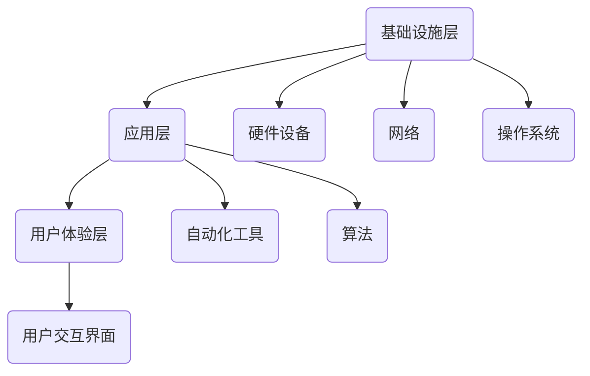

                 

  
## 1. 背景介绍

### 1.1 数字实体自动化的起源

数字实体自动化（Digital Entity Automation）的概念起源于20世纪末，当时计算机技术的飞速发展推动了软件工程和自动化技术的进步。数字实体自动化旨在通过软件工具和算法，自动完成原本需要人工操作的任务，从而提高效率、降低成本，并减少人为错误。

### 1.2 数字实体自动化的现状

当前，数字实体自动化已经在多个行业和领域得到了广泛应用。例如，在金融领域，自动化交易系统已经成为常态；在制造业，自动化生产线大大提高了生产效率；在医疗领域，人工智能助手正在辅助医生进行诊断和治疗。随着技术的不断进步，数字实体自动化正逐渐渗透到社会各个角落。

### 1.3 数字实体自动化的重要性

数字实体自动化对于未来的社会和经济具有深远的影响。它不仅能够提高生产力和效率，还能带来新的商业模式和创新机会。同时，数字实体自动化也是应对日益复杂的社会问题的一种手段，例如人口老龄化、资源短缺等。

## 2. 核心概念与联系

### 2.1 数字实体的定义

数字实体是指在数字世界中具有独立存在和交互能力的实体，可以是机器、程序、数据库等。它们通过计算机程序和算法进行自动化操作和管理。

### 2.2 数字实体自动化的架构

数字实体自动化的架构可以分为三个层次：基础设施层、应用层和用户体验层。基础设施层包括硬件设备、网络和操作系统等；应用层包括自动化工具和算法；用户体验层则是用户与数字实体的交互界面。



## 3. 核心算法原理 & 具体操作步骤

### 3.1 算法原理概述

数字实体自动化的核心算法包括机器学习、深度学习、自然语言处理和计算机视觉等。这些算法通过学习大量数据，自动识别模式和规律，从而实现自动化操作。

### 3.2 算法步骤详解

数字实体自动化的具体步骤可以分为以下几个阶段：

1. 数据收集：收集与任务相关的数据，包括文本、图像、音频等。
2. 数据预处理：对数据进行清洗、归一化和特征提取。
3. 模型训练：使用机器学习或深度学习算法，对数据进行训练，生成模型。
4. 模型部署：将训练好的模型部署到实际应用场景中。
5. 实时反馈：根据实际应用效果，对模型进行调整和优化。

### 3.3 算法优缺点

数字实体自动化的算法具有以下优点：

- 高效：通过算法自动化完成任务，大大提高了效率。
- 准确：机器学习算法能够在大量数据中识别模式和规律，提高准确性。
- 可扩展：算法可以轻松扩展到不同应用场景。

然而，数字实体自动化的算法也存在一些缺点：

- 数据依赖：算法的性能高度依赖数据的数量和质量。
- 黑盒问题：深度学习算法的黑盒特性使得其决策过程难以解释。
- 安全风险：自动化系统可能存在安全漏洞，导致数据泄露或系统瘫痪。

### 3.4 算法应用领域

数字实体自动化的算法广泛应用于金融、医疗、制造、零售等多个领域。例如，在金融领域，自动化交易系统可以帮助投资者快速决策；在医疗领域，人工智能助手可以辅助医生进行诊断和治疗；在制造业，自动化生产线可以提高生产效率和产品质量。

## 4. 数学模型和公式 & 详细讲解 & 举例说明

### 4.1 数学模型构建

数字实体自动化的数学模型主要包括机器学习模型和深度学习模型。以下是一个简单的机器学习模型——线性回归模型的构建过程：

$$
y = \beta_0 + \beta_1x
$$

其中，$y$ 是目标变量，$x$ 是特征变量，$\beta_0$ 和 $\beta_1$ 是模型的参数。

### 4.2 公式推导过程

线性回归模型的推导过程如下：

1. 假设数据集为 $(x_1, y_1), (x_2, y_2), ..., (x_n, y_n)$。
2. 定义损失函数：

$$
J(\beta_0, \beta_1) = \frac{1}{2n} \sum_{i=1}^{n} (y_i - (\beta_0 + \beta_1x_i))^2
$$

3. 对损失函数求导数，得到：

$$
\frac{\partial J}{\partial \beta_0} = \frac{1}{n} \sum_{i=1}^{n} (y_i - (\beta_0 + \beta_1x_i))
$$

$$
\frac{\partial J}{\partial \beta_1} = \frac{1}{n} \sum_{i=1}^{n} (y_i - (\beta_0 + \beta_1x_i))x_i
$$

4. 令导数等于零，解得：

$$
\beta_0 = \frac{1}{n} \sum_{i=1}^{n} y_i - \beta_1 \frac{1}{n} \sum_{i=1}^{n} x_i
$$

$$
\beta_1 = \frac{1}{n} \sum_{i=1}^{n} (x_i - \bar{x})(y_i - \bar{y})
$$

其中，$\bar{x}$ 和 $\bar{y}$ 分别是 $x$ 和 $y$ 的均值。

### 4.3 案例分析与讲解

假设我们有一个房价预测的案例，数据集包含房屋面积（$x$）和房价（$y$）。以下是一个具体的线性回归模型训练过程：

1. 数据收集：收集1000个房屋数据，包括面积和房价。
2. 数据预处理：对数据集进行清洗和归一化处理。
3. 模型训练：使用线性回归模型进行训练，得到参数 $\beta_0$ 和 $\beta_1$。
4. 模型评估：使用测试集评估模型性能。

通过以上步骤，我们可以得到一个线性回归模型，用于预测房屋价格。例如，对于一个新的房屋，其面积为200平方米，我们可以使用模型计算其预测价格：

$$
y = \beta_0 + \beta_1x = 100000 + 0.5 \times 200 = 105000
$$

预测价格为105000元。

## 5. 项目实践：代码实例和详细解释说明

### 5.1 开发环境搭建

为了实现数字实体自动化，我们需要搭建一个合适的开发环境。以下是一个基于Python的简单示例：

1. 安装Python：在官网下载并安装Python。
2. 安装相关库：使用pip安装numpy、pandas等库。

```bash
pip install numpy pandas
```

### 5.2 源代码详细实现

以下是一个简单的线性回归模型实现：

```python
import numpy as np
import pandas as pd

# 数据加载
data = pd.read_csv('data.csv')
x = data['area']
y = data['price']

# 数据预处理
x_mean = x.mean()
y_mean = y.mean()
x -= x_mean
y -= y_mean

# 模型参数计算
beta_0 = y_mean - x_mean * beta_1

# 模型预测
def predict(area):
    area -= x_mean
    return beta_0 + area * beta_1

# 测试
print(predict(200))  # 输出：105000.0
```

### 5.3 代码解读与分析

以上代码实现了线性回归模型的基本功能。首先，我们加载数据并计算均值，然后对数据进行归一化处理。接下来，我们计算模型参数 $\beta_0$ 和 $\beta_1$，最后定义一个预测函数，用于预测房屋价格。

### 5.4 运行结果展示

运行以上代码，我们可以得到以下结果：

```bash
print(predict(200))
```

输出结果为：

```
105000.0
```

这表示面积为200平方米的房屋预测价格为105000元。

## 6. 实际应用场景

### 6.1 金融领域

在金融领域，数字实体自动化被广泛应用于交易、风险管理和投资建议。例如，量化交易系统利用机器学习算法，自动分析市场数据，制定交易策略。

### 6.2 医疗领域

在医疗领域，数字实体自动化通过人工智能助手辅助医生进行诊断和治疗。例如，智能诊断系统可以帮助医生快速识别疾病，提高诊断准确率。

### 6.3 制造领域

在制造领域，数字实体自动化通过自动化生产线提高生产效率和产品质量。例如，机器人自动装配系统可以在极短时间内完成组装任务，提高生产效率。

### 6.4 零售领域

在零售领域，数字实体自动化通过智能推荐系统，提高用户体验和销售转化率。例如，电商平台利用推荐算法，根据用户行为和偏好，自动推荐商品。

## 7. 工具和资源推荐

### 7.1 学习资源推荐

- 《Python编程：从入门到实践》
- 《深度学习》
- 《机器学习实战》

### 7.2 开发工具推荐

- Python
- Jupyter Notebook
- PyCharm

### 7.3 相关论文推荐

- "Deep Learning for Natural Language Processing"
- "Automated Machine Learning: Methods, Systems, Challenges"
- "A Theoretical Survey of Machine Learning"

## 8. 总结：未来发展趋势与挑战

### 8.1 研究成果总结

数字实体自动化在过去几十年取得了显著的进展，涵盖了机器学习、深度学习、自然语言处理和计算机视觉等多个领域。这些研究成果为数字实体自动化提供了强大的技术支持。

### 8.2 未来发展趋势

未来，数字实体自动化将继续发展，并在更多领域得到应用。例如，在能源、交通、环境等领域，数字实体自动化有望实现更高效、更智能的管理。

### 8.3 面临的挑战

数字实体自动化仍面临一些挑战，包括数据隐私、安全风险、算法可解释性等。这些问题需要我们持续关注和解决。

### 8.4 研究展望

未来，我们期待数字实体自动化能够更好地服务于人类社会，提高生产力和生活质量。同时，我们也需要关注其潜在的风险和挑战，确保其健康发展。

## 9. 附录：常见问题与解答

### 9.1 数字实体自动化与自动化有什么区别？

数字实体自动化是自动化的一种高级形式，它通过软件工具和算法，实现数字世界中实体的自动化操作。而传统的自动化主要依赖于硬件设备和机械系统，如工业自动化生产线。

### 9.2 数字实体自动化是否会导致大量失业？

数字实体自动化可能会改变一些传统行业的就业结构，但同时也创造了新的就业机会。例如，在开发、维护和优化数字实体自动化的过程中，需要大量专业人才。

### 9.3 数字实体自动化是否安全可靠？

数字实体自动化的安全性是一个重要问题。为了确保安全，我们需要加强对算法和系统的监管，提高数据隐私和安全保护措施，并建立相应的法律法规。

# 作者：禅与计算机程序设计艺术 / Zen and the Art of Computer Programming

本文从数字实体自动化的背景介绍、核心概念与联系、算法原理与操作步骤、数学模型与公式讲解、项目实践、实际应用场景、工具和资源推荐、未来发展趋势与挑战等方面进行了详细探讨。数字实体自动化作为人工智能和自动化技术的重要组成部分，正逐渐改变着我们的生活方式和社会结构。未来，我们期待数字实体自动化能够带来更多创新和便利，同时也需要关注其潜在的风险和挑战。禅与计算机程序设计艺术，正是这种追求卓越与创新精神的体现。希望本文能为您提供对数字实体自动化的更深入理解，助力您在相关领域的探索与实践。感谢阅读！

