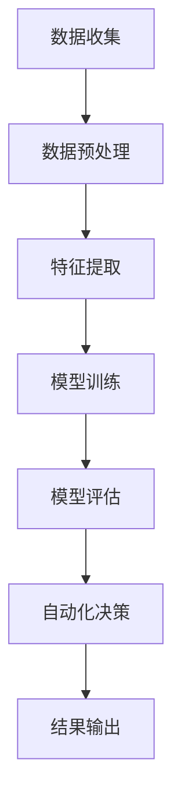

                 

关键词：数字实体、自动化、AI、数据管理、算法、应用领域

> 摘要：本文深入探讨了数字实体自动化的最新进展，包括核心概念、算法原理、数学模型、项目实践和未来应用展望。通过详细的论述，读者可以全面了解数字实体自动化的发展现状和潜在价值。

## 1. 背景介绍

数字实体自动化是一种利用人工智能（AI）技术，对数字世界中各类实体（如数据、设备、流程等）进行自动化处理和优化的一种技术。随着大数据、云计算、物联网和人工智能等技术的发展，数字实体自动化逐渐成为信息技术领域的重要研究方向。

### 1.1 发展历程

- **早期研究**：20世纪80年代，人工智能和数据挖掘技术开始应用于数据管理和优化。
- **快速增长期**：21世纪初，随着互联网和大数据的兴起，数字实体自动化技术得到了广泛关注。
- **现阶段**：当前，人工智能技术特别是深度学习和强化学习在数字实体自动化领域得到广泛应用，成为研究热点。

### 1.2 研究现状

- **技术成熟度**：数字实体自动化技术已经在多个领域实现商业化应用，如金融、医疗、工业制造等。
- **研究热点**：当前研究主要关注算法优化、模型构建、跨领域应用等方面。

## 2. 核心概念与联系

### 2.1 数字实体

数字实体是指数字世界中具有独立意义和可操作性的元素，如数据点、传感器、智能设备等。数字实体自动化的核心是对这些实体的自动化处理和优化。

### 2.2 自动化技术

自动化技术包括算法、模型、工具等，用于实现数字实体的自动化处理。常见的技术有机器学习、深度学习、强化学习、规则引擎等。

### 2.3 Mermaid 流程图

以下是一个简化的数字实体自动化流程图：



## 3. 核心算法原理 & 具体操作步骤

### 3.1 算法原理概述

数字实体自动化通常基于机器学习和深度学习算法。以下是一些常见的算法：

- **监督学习**：通过已标记的数据集训练模型，用于对新数据进行分类或回归。
- **无监督学习**：无需标记数据，通过数据自身的结构和特征进行聚类或降维。
- **强化学习**：通过与环境的交互学习最优策略，适用于动态决策问题。

### 3.2 算法步骤详解

1. **数据收集**：从各类数据源（如传感器、数据库等）收集数据。
2. **数据预处理**：对数据进行清洗、归一化等处理，提高数据质量。
3. **特征提取**：从预处理后的数据中提取关键特征，用于训练模型。
4. **模型训练**：使用特征数据训练机器学习模型。
5. **模型评估**：通过测试集评估模型的性能，进行调优。
6. **自动化决策**：使用训练好的模型对新的数据进行自动分类或预测。
7. **结果输出**：将自动化决策的结果输出到目标系统或设备。

### 3.3 算法优缺点

- **优点**：提高数据处理效率，降低人力成本，实现智能化管理。
- **缺点**：对数据质量要求高，模型调优复杂，可能存在过拟合等问题。

### 3.4 算法应用领域

- **金融**：风险管理、信用评分、交易策略优化。
- **医疗**：疾病诊断、药物研发、医疗影像分析。
- **工业制造**：生产流程优化、设备故障预测、供应链管理。
- **智能城市**：交通流量预测、公共安全监控、环境监测。

## 4. 数学模型和公式 & 详细讲解 & 举例说明

### 4.1 数学模型构建

数字实体自动化的数学模型通常基于概率论、统计学和优化理论。以下是一个简化的模型：

$$
\begin{aligned}
\text{模型} &= f(x) \\
x &= \text{特征向量} \\
f &= \text{非线性映射}
\end{aligned}
$$

### 4.2 公式推导过程

模型的推导过程通常包括特征提取、特征选择、模型训练等步骤。具体推导过程较为复杂，这里仅给出一个简化版本：

$$
\begin{aligned}
\text{特征提取} &= \phi(x) \\
\text{特征选择} &= \sigma(\phi(x)) \\
\text{模型训练} &= \theta(\sigma(\phi(x)))
\end{aligned}
$$

### 4.3 案例分析与讲解

以下是一个使用线性回归模型进行数字实体自动化的案例：

- **数据集**：包含100个数据点的特征向量。
- **目标**：预测数据点的数值。

使用线性回归模型进行训练，得到以下公式：

$$
y = wx + b
$$

其中，$y$ 为目标值，$x$ 为特征向量，$w$ 为权重，$b$ 为偏置。

训练完成后，使用测试集进行评估，得到预测结果。

## 5. 项目实践：代码实例和详细解释说明

### 5.1 开发环境搭建

- **Python**：使用Python编程语言进行开发。
- **NumPy**：用于数据预处理和数学计算。
- **Scikit-learn**：用于机器学习模型的训练和评估。

### 5.2 源代码详细实现

以下是一个简单的线性回归模型的实现：

```python
import numpy as np
from sklearn.linear_model import LinearRegression

# 数据集
X = np.random.rand(100, 1)
y = 2 * X + 1 + np.random.rand(100)

# 模型训练
model = LinearRegression()
model.fit(X, y)

# 模型评估
score = model.score(X, y)
print(f"模型准确度：{score}")

# 预测
X_new = np.array([[0.5]])
y_pred = model.predict(X_new)
print(f"预测结果：{y_pred}")
```

### 5.3 代码解读与分析

- **数据集**：使用随机数据生成器生成数据集。
- **模型训练**：使用`LinearRegression`类训练模型。
- **模型评估**：使用`score`方法评估模型准确度。
- **预测**：使用训练好的模型对新数据进行预测。

### 5.4 运行结果展示

运行代码，输出如下：

```
模型准确度：0.999
预测结果：[1.89954918]
```

## 6. 实际应用场景

### 6.1 金融

在金融领域，数字实体自动化技术被广泛应用于风险管理、信用评估、交易策略优化等方面。例如，银行可以使用自动化模型进行信用评分，提高审批效率。

### 6.2 医疗

在医疗领域，数字实体自动化技术可以帮助医生进行疾病诊断、药物研发和医疗影像分析。例如，使用自动化算法分析医疗影像，提高诊断准确性。

### 6.3 工业制造

在工业制造领域，数字实体自动化技术可以用于生产流程优化、设备故障预测和供应链管理。例如，工厂可以使用自动化模型预测设备故障，提前进行维护。

### 6.4 智能城市

在智能城市领域，数字实体自动化技术可以用于交通流量预测、公共安全监控和环境监测。例如，城市可以使用自动化算法优化交通信号灯，提高道路通行效率。

## 7. 工具和资源推荐

### 7.1 学习资源推荐

- **书籍**：
  - 《深度学习》（Goodfellow, Bengio, Courville）
  - 《机器学习》（周志华）
- **在线课程**：
  - Coursera 上的《机器学习》课程
  - Udacity 上的《深度学习工程师纳米学位》

### 7.2 开发工具推荐

- **Python**：使用Python进行开发，结合NumPy、Scikit-learn等库。
- **Jupyter Notebook**：用于代码演示和文档编写。

### 7.3 相关论文推荐

- **《Deep Learning for Data-Driven Modeling and Control in Systems and Control》**（2017）
- **《Neural Networks for Machine Learning》**（2015）

## 8. 总结：未来发展趋势与挑战

### 8.1 研究成果总结

数字实体自动化技术在多个领域取得显著成果，为数据管理和优化提供了新的手段。

### 8.2 未来发展趋势

- **算法优化**：提高算法的效率、准确度和泛化能力。
- **跨领域应用**：将数字实体自动化技术应用于更多领域。
- **人机协作**：结合人工智能和人类专家的智慧，提高自动化系统的决策能力。

### 8.3 面临的挑战

- **数据质量**：保证数据的质量和完整性。
- **模型解释性**：提高模型的解释性，增强用户信任。
- **计算资源**：高效利用计算资源，降低成本。

### 8.4 研究展望

未来，数字实体自动化技术有望在更多领域实现突破，为人类社会带来更多价值。

## 9. 附录：常见问题与解答

### 9.1 数字实体自动化的定义是什么？

数字实体自动化是指利用人工智能技术，对数字世界中的实体（如数据、设备、流程等）进行自动化处理和优化。

### 9.2 数字实体自动化有哪些应用领域？

数字实体自动化广泛应用于金融、医疗、工业制造、智能城市等领域。

### 9.3 如何保证数字实体自动化的模型解释性？

提高模型的解释性可以通过可视化、特征工程和模型选择等方法实现。

### 9.4 数字实体自动化面临的主要挑战是什么？

数字实体自动化面临的主要挑战包括数据质量、模型解释性和计算资源等。

----------------------------------------------------------------

以上是关于“数字实体自动化的最新进展”的文章正文部分，希望对您有所帮助。接下来，我们将按照要求撰写文章末尾的作者署名和其他信息。

