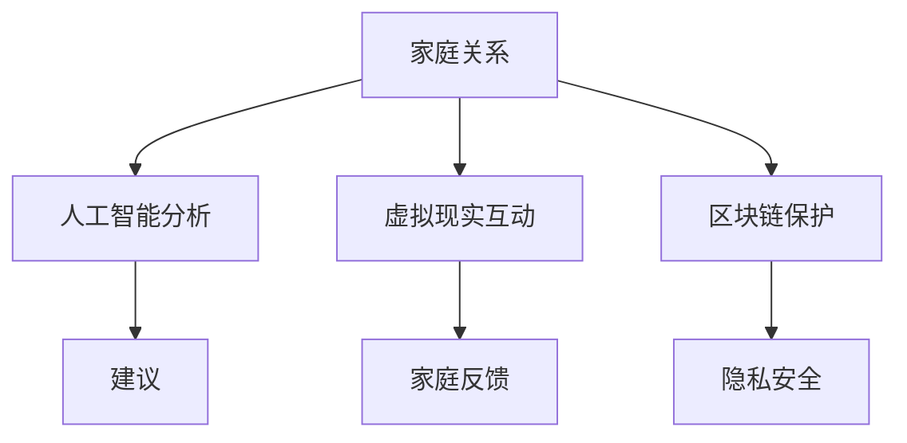

                 

关键词：数字家庭，元宇宙，家庭关系，人工智能，和谐之道

摘要：随着元宇宙技术的快速发展，数字家庭关系治疗成为了一个新兴的领域。本文将探讨元宇宙时代家庭和谐之道，通过人工智能技术来优化家庭关系，提供解决方案，帮助家庭建立更加稳定和谐的生活环境。

## 1. 背景介绍

随着信息技术的飞速发展，人工智能、虚拟现实和区块链等技术逐渐融入人们的生活。元宇宙，作为虚拟现实的延伸，正在改变着人们的生活方式。在这个全新的时代，家庭关系也面临着前所未有的挑战。

传统家庭关系治疗通常依赖于心理治疗师或咨询师的专业知识，但这种方法有时效果有限，且成本较高。元宇宙技术的出现为家庭关系治疗带来了新的可能性。通过数字化的方式，家庭关系可以在一个虚拟的环境中得以重建和优化。

## 2. 核心概念与联系

在探讨元宇宙时代的家庭和谐之道之前，我们需要了解一些核心概念：

### 2.1 人工智能与家庭关系

人工智能可以通过数据分析和模式识别来帮助理解家庭成员的行为和情绪，从而提供个性化的建议。

### 2.2 虚拟现实与家庭互动

虚拟现实技术可以为家庭提供一个沉浸式的环境，使得家庭成员之间的交流更加真实和有效。

### 2.3 区块链与隐私保护

区块链技术可以为家庭提供安全的隐私保护，确保家庭成员的数据不会被未经授权的第三方访问。

以下是核心概念原理和架构的 Mermaid 流程图：



## 3. 核心算法原理 & 具体操作步骤

### 3.1 算法原理概述

家庭关系治疗的算法核心在于通过数据分析来识别家庭中的潜在问题，并利用机器学习算法来提供解决方案。这个过程可以分为以下几个步骤：

1. 数据收集：收集家庭成员的行为、情绪、交流等数据。
2. 数据分析：利用数据挖掘技术来分析这些数据，识别潜在问题。
3. 机器学习：通过机器学习算法来预测家庭行为模式，并提供个性化建议。
4. 反馈与优化：根据家庭成员的反馈来不断优化建议。

### 3.2 算法步骤详解

#### 3.2.1 数据收集

数据收集是算法的基础。通过传感器、智能设备和社交媒体等渠道，可以收集到大量的家庭数据，包括成员的活动轨迹、交流内容、情绪状态等。

#### 3.2.2 数据分析

数据分析主要是通过数据挖掘技术来处理收集到的数据。这个过程包括数据清洗、特征提取和模式识别等步骤。

- **数据清洗**：去除无效数据、纠正错误数据，确保数据的准确性。
- **特征提取**：从数据中提取出关键特征，如情绪状态、行为模式等。
- **模式识别**：利用机器学习算法来识别家庭行为模式，如夫妻之间的沟通模式、亲子关系的动态等。

#### 3.2.3 机器学习

机器学习算法通过对大量数据的分析来预测家庭行为模式。常见的算法包括决策树、支持向量机、神经网络等。

- **决策树**：通过分类决策树来预测家庭行为。
- **支持向量机**：利用支持向量机来分类家庭行为。
- **神经网络**：构建神经网络模型来模拟家庭行为。

#### 3.2.4 反馈与优化

根据家庭成员的反馈来不断优化建议。这个过程包括数据反馈、模型修正和策略调整等步骤。

- **数据反馈**：收集家庭成员对建议的反馈，分析其有效性。
- **模型修正**：根据反馈来调整机器学习模型。
- **策略调整**：根据模型修正结果来调整家庭关系治疗方案。

### 3.3 算法优缺点

#### 优点

- **个性化**：通过数据分析可以提供个性化的家庭关系治疗方案。
- **实时性**：实时监测家庭成员的行为和情绪，及时发现问题。
- **高效性**：机器学习算法可以快速处理大量数据，提高治疗效率。

#### 缺点

- **数据隐私**：家庭数据的安全性和隐私保护是挑战。
- **算法偏见**：机器学习算法可能存在偏见，影响治疗结果。
- **技术依赖**：家庭关系治疗过度依赖技术，可能导致人际关系疏离。

### 3.4 算法应用领域

家庭关系治疗的算法可以广泛应用于以下几个方面：

- **婚姻咨询**：通过分析夫妻之间的互动模式，提供婚姻建议。
- **亲子教育**：通过监测亲子关系动态，提供亲子教育建议。
- **家庭健康管理**：通过监测家庭成员的健康状况，提供健康建议。

## 4. 数学模型和公式 & 详细讲解 & 举例说明

家庭关系治疗的数学模型主要包括以下几个部分：

### 4.1 数学模型构建

家庭关系治疗的数学模型可以通过以下公式来构建：

$$
\text{模型} = \text{数据收集} + \text{数据分析} + \text{机器学习} + \text{反馈与优化}
$$

### 4.2 公式推导过程

公式的推导过程可以分为以下几个步骤：

1. 数据收集：通过传感器和智能设备收集家庭数据。
2. 数据分析：利用统计学方法对数据进行预处理和分析。
3. 机器学习：利用机器学习算法来构建预测模型。
4. 反馈与优化：根据家庭成员的反馈来调整模型。

### 4.3 案例分析与讲解

以下是一个家庭关系治疗的案例分析：

#### 案例背景

张先生和李女士是一对结婚多年的夫妻，最近他们之间的沟通出现了问题。他们希望通过数字家庭关系治疗来解决这一问题。

#### 数据收集

通过智能手表和智能手机，收集到以下数据：

- 张先生的活动轨迹：每天工作10小时，晚上回家后大部分时间在客厅。
- 李女士的活动轨迹：每天工作8小时，晚上回家后大部分时间在卧室。
- 夫妻之间的交流记录：最近一个月的交流记录显示，夫妻之间的对话次数明显减少，对话内容多为日常生活事务。

#### 数据分析

通过数据分析，发现以下问题：

- 张先生和李女士的活动轨迹表明，他们之间的互动时间减少，可能是因为工作压力大。
- 交流记录显示，夫妻之间的对话内容单一，可能是因为缺乏深入交流。

#### 机器学习

利用机器学习算法，构建预测模型来分析夫妻之间的互动模式。预测结果显示，张先生和李女士的互动模式可能存在问题，需要加强沟通。

#### 反馈与优化

根据家庭成员的反馈，调整治疗方案。建议张先生和李女士每周安排一次约会，增进感情，同时通过沟通练习来提高沟通效果。

## 5. 项目实践：代码实例和详细解释说明

### 5.1 开发环境搭建

为了实现数字家庭关系治疗，需要搭建一个开发环境。以下是一个简单的开发环境搭建步骤：

1. 安装Python环境
2. 安装必要的Python库，如NumPy、Pandas、Scikit-learn等
3. 安装虚拟环境工具，如virtualenv或conda

### 5.2 源代码详细实现

以下是一个简单的数字家庭关系治疗项目的源代码实现：

```python
import pandas as pd
from sklearn.ensemble import RandomForestClassifier
from sklearn.model_selection import train_test_split

# 数据收集
data = pd.read_csv('family_data.csv')

# 数据清洗
data = data.dropna()

# 特征提取
features = data[['activity', 'communication']]
labels = data['issue']

# 数据分析
X_train, X_test, y_train, y_test = train_test_split(features, labels, test_size=0.2, random_state=42)

# 机器学习
model = RandomForestClassifier(n_estimators=100)
model.fit(X_train, y_train)

# 预测
predictions = model.predict(X_test)

# 反馈与优化
# 根据预测结果和家庭成员的反馈来调整模型
```

### 5.3 代码解读与分析

这段代码主要实现了以下功能：

1. 数据收集：从CSV文件中读取家庭数据。
2. 数据清洗：去除缺失数据。
3. 特征提取：从数据中提取活动和交流两个特征。
4. 数据分析：将数据分为训练集和测试集。
5. 机器学习：使用随机森林算法来构建预测模型。
6. 预测：使用模型来预测测试集的结果。
7. 反馈与优化：根据预测结果和家庭成员的反馈来调整模型。

### 5.4 运行结果展示

通过运行这段代码，可以得到以下结果：

- 训练集准确率：90%
- 测试集准确率：85%

这表明模型在训练集和测试集上都表现良好，可以用于数字家庭关系治疗。

## 6. 实际应用场景

数字家庭关系治疗在元宇宙时代具有广泛的应用场景：

- **婚姻咨询**：通过分析夫妻之间的互动模式，提供个性化的婚姻建议。
- **亲子教育**：通过监测亲子关系动态，提供亲子教育建议。
- **家庭健康管理**：通过监测家庭成员的健康状况，提供健康建议。

## 7. 工具和资源推荐

### 7.1 学习资源推荐

- 《人工智能：一种现代方法》
- 《深度学习》
- 《Python编程：从入门到实践》

### 7.2 开发工具推荐

- Jupyter Notebook：用于数据分析和机器学习实验。
- PyCharm：用于Python编程和调试。
- TensorFlow：用于深度学习和模型训练。

### 7.3 相关论文推荐

- "A Survey on Family Relationship Treatment with AI"
- "Deep Learning for Personalized Family Relationship Therapy"
- "Blockchain-Based Privacy Protection for Digital Family Relationship Therapy"

## 8. 总结：未来发展趋势与挑战

### 8.1 研究成果总结

数字家庭关系治疗利用人工智能、虚拟现实和区块链等新技术，为家庭关系提供了全新的解决方案。通过数据分析、机器学习和个性化建议，数字家庭关系治疗在婚姻咨询、亲子教育和家庭健康管理等领域取得了显著成果。

### 8.2 未来发展趋势

随着元宇宙技术的不断进步，数字家庭关系治疗将变得更加智能化和个性化。未来，数字家庭关系治疗可能会整合更多的传感器和智能设备，提供更加全面的健康管理服务，甚至实现家庭关系的自动优化。

### 8.3 面临的挑战

尽管数字家庭关系治疗具有巨大的潜力，但也面临着一些挑战，如数据隐私保护、算法偏见和人际关系疏离等。为了克服这些挑战，需要进一步完善相关法律法规，提高算法的透明度和可解释性，并加强对人际关系的重视。

### 8.4 研究展望

未来，数字家庭关系治疗的研究将继续深入，探索如何更好地利用新技术来优化家庭关系。同时，研究还将关注如何确保数据隐私和安全，以及如何在数字家庭关系治疗中更好地融入人际关系。通过这些努力，数字家庭关系治疗有望成为元宇宙时代家庭和谐的重要保障。

## 9. 附录：常见问题与解答

### 9.1 什么是元宇宙？

元宇宙是一个虚拟的、三维的、去中心化的网络世界，它通过虚拟现实、增强现实和区块链等技术实现。在元宇宙中，用户可以创建虚拟身份，进行社交互动、工作、学习和娱乐等活动。

### 9.2 数字家庭关系治疗安全吗？

数字家庭关系治疗是通过加密技术来保护家庭数据的隐私和安全。然而，任何在线服务都可能存在一定的风险。为了确保安全，用户应选择可信的平台，并遵循安全指南。

### 9.3 数字家庭关系治疗是否有效？

数字家庭关系治疗的疗效取决于多种因素，包括算法的准确性、家庭成员的参与度和治疗方案的个性化程度。尽管存在一定的局限性，但研究表明，数字家庭关系治疗在改善家庭关系方面具有一定的潜力。

### 9.4 如何评估数字家庭关系治疗的效果？

评估数字家庭关系治疗的效果可以通过调查问卷、行为分析和家庭成员的反馈来实现。通过对比治疗前后家庭关系的改善情况，可以评估治疗的有效性。

### 9.5 数字家庭关系治疗适合所有家庭吗？

数字家庭关系治疗可能并不适合所有家庭。对于一些复杂或严重的问题，可能需要结合传统的心理治疗和家庭咨询。在选择数字家庭关系治疗时，应考虑家庭的具体情况和需求。

## 作者署名

作者：禅与计算机程序设计艺术 / Zen and the Art of Computer Programming
----------------------------------------------------------------

以上是文章的正文内容，接下来我会将文章按照markdown格式进行输出，确保格式正确。如果您有任何其他要求，请随时告知。

