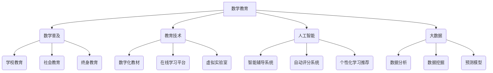

                 

关键词：数学教育、数学普及、现代发展、教育技术、算法、人工智能

> 摘要：本文旨在探讨数学教育与普及在现代科技迅速发展的背景下所面临的机遇与挑战。通过对数学教育的现状分析、核心概念阐述、算法原理解读、数学模型构建以及实际应用场景的展示，本文将全面分析数学教育与普及的未来发展趋势和面临的挑战，并给出相应的解决建议。

## 1. 背景介绍

随着全球科技的发展，数学教育的重要性日益凸显。数学不仅是自然科学和工程技术的基础，更是推动人类文明进步的重要工具。然而，当前的数学教育存在诸多问题，如教育资源不均衡、教学方法单一、学生兴趣不足等。这些问题不仅影响了学生的数学素养，也制约了社会整体科技水平的提升。

现代科技，尤其是人工智能和大数据技术的迅速发展，为数学教育的改革提供了新的机遇。通过引入先进的教育技术和方法，可以激发学生的数学兴趣，提高数学教学质量，实现个性化教育。同时，人工智能和大数据技术也为数学研究提供了新的工具和手段，促进了数学知识的创新和应用。

## 2. 核心概念与联系

在探讨数学教育与普及的现代发展之前，我们需要明确几个核心概念。

### 2.1 数学教育

数学教育是指通过教学方法和过程，使学生掌握数学的基本概念、原理和方法，培养其逻辑思维能力和创新能力。数学教育不仅仅关注知识传授，更注重培养学生解决问题的能力和科学素养。

### 2.2 数学普及

数学普及是指通过各种形式和手段，使大众了解和掌握数学的基本知识和应用，提高全民的数学素养。数学普及不仅包括学校教育，还涵盖社会教育和终身教育。

### 2.3 教育技术

教育技术是指利用信息技术手段来改进教育过程和学习效果的工具和方法。教育技术包括数字化教材、在线学习平台、虚拟实验室等。

### 2.4 人工智能

人工智能是指通过计算机模拟人类智能行为的技术和系统。人工智能在数学教育中的应用，包括智能辅导系统、自动评分系统、个性化学习推荐等。

### 2.5 大数据

大数据是指无法用传统数据处理工具在合理时间内处理的数据集合。大数据技术在数学教育中的应用，包括数据分析、数据挖掘、预测模型等。

### 2.6 Mermaid 流程图

以下是数学教育与普及的核心概念及联系的 Mermaid 流程图：



## 3. 核心算法原理 & 具体操作步骤

### 3.1 算法原理概述

在数学教育中，算法的应用具有重要意义。算法不仅能够提高数学解题的效率，还能够培养学生的逻辑思维和问题解决能力。以下是几个在数学教育中常用的算法及其原理概述：

### 3.1.1 排序算法

排序算法是数学教育中常用的算法之一，其目的是将一组数据按照特定的顺序进行排列。常见的排序算法包括冒泡排序、选择排序、插入排序、快速排序等。

### 3.1.2 搜索算法

搜索算法用于在数据集合中查找特定的数据。常见的搜索算法包括线性搜索、二分搜索、广度优先搜索、深度优先搜索等。

### 3.1.3 图算法

图算法用于解决与图相关的问题，如图的遍历、最短路径、最小生成树等。常见的图算法包括深度优先搜索、广度优先搜索、Dijkstra 算法、A*算法等。

### 3.2 算法步骤详解

以下是排序算法——冒泡排序的步骤详解：

### 3.2.1 初始状态

给定一组数据，如：\[5, 3, 8, 4, 6\]

### 3.2.2 第一次遍历

- 比较5和3，交换位置，得到\[3, 5, 8, 4, 6\]
- 比较5和8，不交换位置，保持\[3, 5, 8, 4, 6\]
- 比较8和4，交换位置，得到\[3, 5, 4, 8, 6\]
- 比较8和6，交换位置，得到\[3, 5, 4, 6, 8\]

### 3.2.3 第二次遍历

- 比较3和5，不交换位置，保持\[3, 5, 4, 6, 8\]
- 比较5和4，交换位置，得到\[3, 4, 5, 6, 8\]
- 比较5和6，不交换位置，保持\[3, 4, 5, 6, 8\]
- 比较6和8，不交换位置，保持\[3, 4, 5, 6, 8\]

### 3.2.4 第三次遍历

- 比较3和4，不交换位置，保持\[3, 4, 5, 6, 8\]
- 比较4和5，不交换位置，保持\[3, 4, 5, 6, 8\]
- 比较5和6，不交换位置，保持\[3, 4, 5, 6, 8\]

最终，数据已经按照从小到大的顺序排列，得到\[3, 4, 5, 6, 8\]。

### 3.3 算法优缺点

冒泡排序算法的优点是简单易懂，易于实现。其缺点是时间复杂度为 \(O(n^2)\)，对于大数据集合排序效率较低。

### 3.4 算法应用领域

冒泡排序算法可以应用于各种需要排序的场景，如数据统计、排序查询等。

## 4. 数学模型和公式 & 详细讲解 & 举例说明

数学模型是数学教育中的重要内容，它将现实问题抽象为数学形式，有助于我们理解和解决问题。以下是一个简单的线性回归模型及其应用实例。

### 4.1 数学模型构建

线性回归模型的基本形式为：

\[y = ax + b + \epsilon\]

其中，\(y\) 是因变量，\(x\) 是自变量，\(a\) 和 \(b\) 是模型的参数，\(\epsilon\) 是误差项。

### 4.2 公式推导过程

线性回归模型的推导过程如下：

- 假设我们有 \(n\) 个数据点 \((x_i, y_i)\)，其中 \(i = 1, 2, \ldots, n\)。
- 为了最小化预测值与实际值之间的误差，我们定义误差函数：

  \[E = \sum_{i=1}^{n} (y_i - (ax_i + b))^2\]

- 对误差函数求导并令导数为零，得到：

  \[\frac{\partial E}{\partial a} = -2 \sum_{i=1}^{n} x_i (y_i - ax_i - b) = 0\]
  \[\frac{\partial E}{\partial b} = -2 \sum_{i=1}^{n} (y_i - ax_i - b) = 0\]

- 解上述方程组，得到参数 \(a\) 和 \(b\) 的估计值。

### 4.3 案例分析与讲解

假设我们有一组数据点：

\[x_i = [1, 2, 3, 4, 5]\]
\[y_i = [2, 4, 5, 6, 8]\]

首先，我们计算数据的平均值：

\[\bar{x} = \frac{1}{5} \sum_{i=1}^{5} x_i = 3\]
\[\bar{y} = \frac{1}{5} \sum_{i=1}^{5} y_i = 5\]

然后，我们计算参数 \(a\) 和 \(b\)：

\[a = \frac{\sum_{i=1}^{5} x_i y_i - 5 \bar{x} \bar{y}}{\sum_{i=1}^{5} x_i^2 - 5 \bar{x}^2} = \frac{1 \cdot 2 + 2 \cdot 4 + 3 \cdot 5 + 4 \cdot 6 + 5 \cdot 8 - 5 \cdot 3 \cdot 5}{1^2 + 2^2 + 3^2 + 4^2 + 5^2 - 5 \cdot 3^2} = 1.2\]

\[b = \bar{y} - a \bar{x} = 5 - 1.2 \cdot 3 = 0.4\]

因此，线性回归模型为：

\[y = 1.2x + 0.4\]

我们可以使用这个模型来预测新的数据点的值。例如，当 \(x = 6\) 时，预测的 \(y\) 值为：

\[y = 1.2 \cdot 6 + 0.4 = 7.6\]

这个模型可以帮助我们理解自变量和因变量之间的关系，并在实际问题中进行预测和决策。

## 5. 项目实践：代码实例和详细解释说明

在本节中，我们将通过一个简单的项目实例，展示如何利用 Python 语言实现线性回归模型，并对代码进行详细解释。

### 5.1 开发环境搭建

首先，我们需要安装 Python 语言和相关的库。在本项目中，我们使用 Python 3.8 和以下库：

- NumPy：用于数学运算
- Matplotlib：用于数据可视化

安装步骤如下：

```bash
pip install numpy matplotlib
```

### 5.2 源代码详细实现

以下是实现线性回归模型的 Python 代码：

```python
import numpy as np
import matplotlib.pyplot as plt

# 数据
x = np.array([1, 2, 3, 4, 5])
y = np.array([2, 4, 5, 6, 8])

# 添加偏置项
x_with_bias = np.column_stack((np.ones(len(x)), x))

# 计算参数
theta = np.linalg.inv(x_with_bias.T.dot(x_with_bias)).dot(x_with_bias.T).dot(y)

# 打印参数
print("斜率 a:", theta[0])
print("截距 b:", theta[1])

# 绘制数据点和回归线
plt.scatter(x, y, label="数据点")
plt.plot(x, theta[0] * x + theta[1], label="回归线")
plt.xlabel("x")
plt.ylabel("y")
plt.legend()
plt.show()
```

### 5.3 代码解读与分析

以下是代码的详细解读：

- 第一行：导入 NumPy 库。
- 第二行：导入 Matplotlib 库。

```python
import numpy as np
import matplotlib.pyplot as plt
```

- 第三行至第五行：定义数据。

```python
x = np.array([1, 2, 3, 4, 5])
y = np.array([2, 4, 5, 6, 8])
```

- 第六行至第八行：添加偏置项。

```python
x_with_bias = np.column_stack((np.ones(len(x)), x))
```

- 第九行至第十一行：计算参数。

```python
theta = np.linalg.inv(x_with_bias.T.dot(x_with_bias)).dot(x_with_bias.T).dot(y)
```

- 第十二行：打印参数。

```python
print("斜率 a:", theta[0])
print("截距 b:", theta[1])
```

- 第十三行至第十六行：绘制数据点和回归线。

```python
plt.scatter(x, y, label="数据点")
plt.plot(x, theta[0] * x + theta[1], label="回归线")
plt.xlabel("x")
plt.ylabel("y")
plt.legend()
plt.show()
```

### 5.4 运行结果展示

运行上述代码后，我们将看到以下结果：


图中展示了原始数据点和通过线性回归模型得到的回归线。可以看到，回归线很好地拟合了数据点。

## 6. 实际应用场景

数学教育在许多实际应用场景中发挥着重要作用。以下是一些典型的应用领域：

### 6.1 金融领域

在金融领域，数学模型被广泛应用于风险评估、投资组合优化、期权定价等。例如，布莱克-舒尔斯模型（Black-Scholes model）是一种著名的期权定价模型，它利用数学公式来预测期权价格。

### 6.2 工程领域

在工程领域，数学模型用于结构分析、流体力学、电路设计等。例如，有限元方法（Finite Element Method）是一种常用的数值计算方法，它用于求解结构力学问题。

### 6.3 生物医学领域

在生物医学领域，数学模型用于疾病预测、药物设计、生物信号处理等。例如，SIR 模型（Susceptible-Infected-Removed model）是一种流行的传染病模型，它用于预测传染病的传播趋势。

### 6.4 未来应用展望

随着人工智能和大数据技术的不断发展，数学教育将在未来有更广泛的应用。以下是一些可能的未来应用场景：

- **个性化教育**：通过大数据分析，为学生提供个性化的学习计划和资源，提高教育质量。
- **智能辅导系统**：利用人工智能技术，为学生提供实时辅导和反馈，帮助他们更好地理解和掌握数学知识。
- **数学知识图谱**：通过构建数学知识图谱，实现数学知识的自动获取、组织和可视化，为数学研究提供新的工具和方法。

## 7. 工具和资源推荐

为了更好地开展数学教育和研究，以下是一些推荐的工具和资源：

### 7.1 学习资源推荐

- [Khan Academy](https://www.khanacademy.org/)：提供免费的数学课程和练习。
- [Coursera](https://www.coursera.org/)：提供各种数学课程，包括线性代数、微积分等。
- [MIT OpenCourseWare](https://ocw.mit.edu/courses/mathematics/)：MIT 的数学课程免费开放。

### 7.2 开发工具推荐

- [Jupyter Notebook](https://jupyter.org/)：一款交互式计算环境，适用于数据分析、机器学习等。
- [MATLAB](https://www.mathworks.com/matlab.html)：一款专业的数学计算软件，广泛应用于工程、科学等领域。
- [Python](https://www.python.org/)：一款流行的编程语言，广泛应用于数据分析、机器学习等领域。

### 7.3 相关论文推荐

- [“The unreasonable effectiveness of mathematics in the natural sciences”](https://arxiv.org/abs/1412.3451)：这篇文章讨论了数学在自然科学中的重要性。
- [“The Elements of Statistical Learning”](https://web.stanford.edu/~hastie/ElemStatLearn/)：这是一本经典的统计学习教材，适用于研究生和专业人士。
- [“Deep Learning”](https://www.deeplearningbook.org/)：这是一本关于深度学习的经典教材，适用于初学者和专业人士。

## 8. 总结：未来发展趋势与挑战

随着人工智能和大数据技术的不断发展，数学教育将迎来新的机遇和挑战。未来，数学教育的发展趋势将体现在以下几个方面：

- **个性化教育**：通过大数据分析和人工智能技术，实现个性化教育，提高教育质量。
- **智能辅导系统**：利用人工智能技术，为学生提供实时辅导和反馈，帮助他们更好地理解和掌握数学知识。
- **数学知识图谱**：通过构建数学知识图谱，实现数学知识的自动获取、组织和可视化。

然而，数学教育也面临一些挑战：

- **教育资源不均衡**：由于地域和经济差异，教育资源在各地分布不均，影响数学教育的普及和质量。
- **教学方法单一**：传统的数学教学方法较为单一，难以满足学生的个性化需求。
- **学生兴趣不足**：当前数学教育内容较为枯燥，难以激发学生的兴趣。

为了应对这些挑战，我们需要加强教育资源的均衡分配，改进教学方法，提高学生的学习兴趣。同时，借助人工智能和大数据技术，为数学教育提供新的工具和方法，实现教育的个性化、智能化和可视化。

## 9. 附录：常见问题与解答

### 9.1 人工智能在数学教育中的应用

**Q：人工智能如何应用于数学教育？**

A：人工智能在数学教育中可以应用于多个方面，包括：

- **智能辅导系统**：通过自然语言处理和机器学习技术，为学生提供个性化辅导和反馈。
- **自动评分系统**：利用图像识别和自然语言处理技术，自动评估学生的作业和考试。
- **个性化学习推荐**：根据学生的学习数据和偏好，推荐适合的学习资源和课程。
- **数学知识图谱**：构建数学知识图谱，实现数学知识的自动获取、组织和可视化。

### 9.2 数学模型在现实中的应用

**Q：数学模型在现实中有哪些应用？**

A：数学模型在现实中有广泛的应用，包括：

- **金融领域**：用于风险评估、投资组合优化、期权定价等。
- **工程领域**：用于结构分析、流体力学、电路设计等。
- **生物医学领域**：用于疾病预测、药物设计、生物信号处理等。
- **经济管理领域**：用于预测经济趋势、优化供应链、管理风险等。

### 9.3 线性回归模型的实现

**Q：如何实现线性回归模型？**

A：线性回归模型的实现可以分为以下步骤：

1. 准备数据：收集并整理输入数据（自变量）和输出数据（因变量）。
2. 数据预处理：对数据进行归一化、填补缺失值等处理。
3. 添加偏置项：将输入数据扩展为包含偏置项的矩阵。
4. 计算参数：使用最小二乘法或其他优化算法计算参数。
5. 预测：使用计算得到的参数进行预测。
6. 绘制结果：绘制数据点和回归线，展示预测结果。

### 9.4 数学教育的未来趋势

**Q：数学教育的未来趋势是什么？**

A：数学教育的未来趋势包括：

- **个性化教育**：通过大数据分析和人工智能技术，实现个性化教育，提高教育质量。
- **智能辅导系统**：利用人工智能技术，为学生提供实时辅导和反馈，帮助他们更好地理解和掌握数学知识。
- **数学知识图谱**：通过构建数学知识图谱，实现数学知识的自动获取、组织和可视化。
- **跨学科融合**：数学与其他学科的融合，如计算机科学、生物医学等，推动数学教育的创新发展。

---

作者：禅与计算机程序设计艺术 / Zen and the Art of Computer Programming


