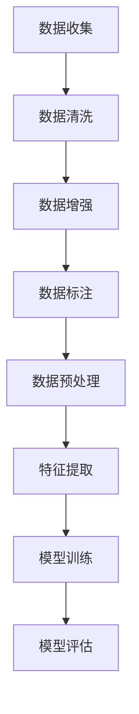

                 

数据，作为人工智能（AI）发展的基石，已经在多个领域中发挥了至关重要的作用。无论是在图像识别、自然语言处理还是推荐系统，高质量的训练数据都决定了AI模型的性能和效果。本文将深入探讨AI训练数据的收集与处理过程，分析其在AI发展中的重要性，并提供一些实用的工具和资源，帮助读者更好地理解这一领域。

## 文章关键词

- 数据收集
- 数据处理
- 训练数据
- 人工智能
- 数据质量
- 数据预处理

## 文章摘要

本文首先介绍了AI训练数据的基本概念和重要性。接着，详细阐述了数据收集和数据处理的方法，包括数据清洗、数据增强、数据标注等环节。随后，通过数学模型和具体算法的讲解，展示了如何从数据中提取特征，并利用这些特征训练AI模型。最后，本文讨论了AI训练数据的实际应用场景，展望了未来的发展趋势和面临的挑战。

## 1. 背景介绍

人工智能（AI）作为计算机科学的一个重要分支，近年来取得了飞速发展。从最初的规则推理和知识表示，到基于统计学习的方法，再到深度学习的大规模应用，AI已经深入到了我们的日常生活和工作中。而训练数据作为AI模型构建的核心，其质量和数量直接影响了模型的性能和效果。

### 1.1 AI的发展历程

AI的发展历程可以大致分为以下几个阶段：

- **早期阶段**：以符号推理和知识表示为核心，试图通过编程规则来模拟人类的智能。

- **基于统计的方法**：引入概率论和统计学，通过训练数据学习数据分布和规律。

- **深度学习时代**：随着计算能力和数据量的提升，深度学习成为AI发展的主流，通过多层神经网络对大量数据进行自动特征提取。

### 1.2 训练数据的重要性

- **性能提升**：高质量的训练数据可以显著提升AI模型的性能，使其在特定任务上表现更优。

- **泛化能力**：通过多样化的训练数据，可以提高模型的泛化能力，避免过拟合。

- **可解释性**：丰富且高质量的训练数据可以帮助我们更好地理解模型的决策过程，提高其可解释性。

### 1.3 训练数据的挑战

- **数据稀缺**：在某些领域，如医疗和金融，高质量的训练数据非常稀缺。

- **数据质量**：噪声、偏差和不一致的数据会影响模型的性能。

- **数据标注**：手动标注数据不仅费时费力，而且可能存在主观偏差。

## 2. 核心概念与联系

在深入探讨AI训练数据的收集与处理之前，我们首先需要了解一些核心概念和它们之间的关系。以下是一个简单的Mermaid流程图，展示了训练数据从收集到处理再到模型训练的整个过程。



### 2.1 数据收集

数据收集是训练数据处理的第一个环节，其主要任务是获取原始数据。这些数据可能来自于公开数据集、企业内部数据、网络爬取等。数据收集的关键在于确保数据的质量和多样性。

### 2.2 数据清洗

数据清洗是对原始数据进行预处理，去除噪声、填充缺失值、纠正错误等。数据清洗的目的是提高数据的质量，为后续的数据处理和模型训练提供可靠的输入。

### 2.3 数据增强

数据增强是通过一系列技术手段，如旋转、缩放、裁剪等，生成更多的训练样本。数据增强可以提高模型的泛化能力，避免过拟合。

### 2.4 数据标注

数据标注是针对训练数据进行标记，为模型提供标签。数据标注的准确性直接影响了模型的性能。在自动化标注技术不断发展的今天，数据标注仍然是一个挑战。

### 2.5 数据预处理

数据预处理包括特征选择、特征工程、数据归一化等步骤。数据预处理的目标是提取有用的特征，简化模型训练过程，提高模型的泛化能力。

### 2.6 特征提取

特征提取是利用特定的算法从数据中提取出对模型训练有帮助的特征。特征提取的质量直接影响了模型的性能。

### 2.7 模型训练

模型训练是通过特定的算法，如梯度下降、反向传播等，训练出能够对未知数据进行预测的模型。模型训练是整个数据处理流程的核心。

### 2.8 模型评估

模型评估是对训练好的模型进行评估，以确定其性能和效果。常用的评估指标包括准确率、召回率、F1分数等。

## 3. 核心算法原理 & 具体操作步骤

### 3.1 算法原理概述

AI训练数据的处理流程中，涉及到多个核心算法，包括数据清洗、数据增强、数据标注、数据预处理和特征提取等。每个算法都有其特定的原理和应用场景。

### 3.2 算法步骤详解

#### 3.2.1 数据清洗

数据清洗的主要步骤包括：

- **缺失值处理**：使用均值、中位数或最频繁值填充缺失值。
- **噪声处理**：去除明显的噪声数据，如异常值。
- **错误纠正**：对错误的数据进行校正，如纠正错别字。

#### 3.2.2 数据增强

数据增强的主要步骤包括：

- **旋转**：将数据随机旋转一定角度。
- **缩放**：将数据按比例缩放。
- **裁剪**：随机裁剪数据的一部分。

#### 3.2.3 数据标注

数据标注的主要步骤包括：

- **自动化标注**：使用规则或机器学习算法自动标注数据。
- **半自动化标注**：结合人工和自动标注，提高标注的准确性。
- **全面标注**：对全部数据进行标注。

#### 3.2.4 数据预处理

数据预处理的主要步骤包括：

- **特征选择**：选择对模型训练最有帮助的特征。
- **特征工程**：对特征进行转换，如归一化、标准化。
- **数据归一化**：将数据缩放到同一尺度，便于模型训练。

#### 3.2.5 特征提取

特征提取的主要步骤包括：

- **统计特征提取**：提取数据的统计特征，如均值、方差、标准差等。
- **文本特征提取**：提取文本数据的特征，如词频、TF-IDF等。
- **图像特征提取**：提取图像数据的特征，如边缘、纹理、颜色等。

### 3.3 算法优缺点

#### 数据清洗

- **优点**：可以去除噪声，提高数据质量。
- **缺点**：可能引入新的错误，且处理过程复杂。

#### 数据增强

- **优点**：可以增加训练样本，提高模型的泛化能力。
- **缺点**：可能引入不必要的噪声，增加计算成本。

#### 数据标注

- **优点**：可以为模型提供准确的标签，提高模型性能。
- **缺点**：标注过程费时费力，且存在主观偏差。

#### 数据预处理

- **优点**：可以提取有用的特征，简化模型训练过程。
- **缺点**：可能损失部分信息，降低模型的泛化能力。

#### 特征提取

- **优点**：可以提取数据中的有用信息，提高模型性能。
- **缺点**：可能引入过拟合，降低模型的泛化能力。

### 3.4 算法应用领域

- **图像识别**：数据清洗、数据增强、数据标注、数据预处理和特征提取在图像识别中都有广泛应用。
- **自然语言处理**：数据清洗、数据增强、数据标注和特征提取在自然语言处理中发挥着重要作用。
- **推荐系统**：数据清洗、数据预处理和特征提取在推荐系统中至关重要。

## 4. 数学模型和公式 & 详细讲解 & 举例说明

在AI训练数据的过程中，数学模型和公式起着至关重要的作用。以下我们将介绍一些常用的数学模型和公式，并通过具体的例子进行讲解。

### 4.1 数学模型构建

在数据处理和特征提取过程中，常用的数学模型包括线性回归、逻辑回归、支持向量机等。

#### 线性回归

线性回归模型表示为：

$$
y = \beta_0 + \beta_1x_1 + \beta_2x_2 + ... + \beta_nx_n
$$

其中，$y$ 是预测值，$x_1, x_2, ..., x_n$ 是特征值，$\beta_0, \beta_1, ..., \beta_n$ 是模型参数。

#### 逻辑回归

逻辑回归模型表示为：

$$
P(y=1) = \frac{1}{1 + e^{-(\beta_0 + \beta_1x_1 + \beta_2x_2 + ... + \beta_nx_n})}
$$

其中，$P(y=1)$ 是目标值为1的概率。

#### 支持向量机

支持向量机模型表示为：

$$
w \cdot x + b = 0
$$

其中，$w$ 是模型参数，$x$ 是特征向量，$b$ 是偏置。

### 4.2 公式推导过程

#### 线性回归

线性回归的推导过程如下：

假设我们有 $n$ 个训练样本 $(x_1, y_1), (x_2, y_2), ..., (x_n, y_n)$，线性回归的目标是最小化误差平方和：

$$
J(\beta_0, \beta_1, ..., \beta_n) = \sum_{i=1}^{n}(y_i - (\beta_0 + \beta_1x_i + \beta_2x_i + ... + \beta_nx_i))^2
$$

对 $J$ 分别对 $\beta_0, \beta_1, ..., \beta_n$ 求导并令其等于0，可以得到：

$$
\frac{\partial J}{\partial \beta_0} = 0 \\
\frac{\partial J}{\partial \beta_1} = 0 \\
... \\
\frac{\partial J}{\partial \beta_n} = 0
$$

通过求解上述方程组，可以得到线性回归模型的参数。

#### 逻辑回归

逻辑回归的推导过程如下：

假设我们有 $n$ 个训练样本 $(x_1, y_1), (x_2, y_2), ..., (x_n, y_n)$，逻辑回归的目标是最小化损失函数：

$$
L(\beta_0, \beta_1, ..., \beta_n) = -\sum_{i=1}^{n}y_i \log(P(y=1)) - (1 - y_i) \log(1 - P(y=1))
$$

对 $L$ 分别对 $\beta_0, \beta_1, ..., \beta_n$ 求导并令其等于0，可以得到：

$$
\frac{\partial L}{\partial \beta_0} = 0 \\
\frac{\partial L}{\partial \beta_1} = 0 \\
... \\
\frac{\partial L}{\partial \beta_n} = 0
$$

通过求解上述方程组，可以得到逻辑回归模型的参数。

#### 支持向量机

支持向量机的推导过程如下：

假设我们有 $n$ 个训练样本 $(x_1, y_1), (x_2, y_2), ..., (x_n, y_n)$，支持向量机的目标是最小化决策边界：

$$
J(w, b) = \frac{1}{2}w^Tw + C\sum_{i=1}^{n}\xi_i
$$

其中，$w$ 是模型参数，$b$ 是偏置，$C$ 是惩罚参数，$\xi_i$ 是松弛变量。

对 $J$ 分别对 $w$ 和 $b$ 求导并令其等于0，可以得到：

$$
\frac{\partial J}{\partial w} = 0 \\
\frac{\partial J}{\partial b} = 0
$$

通过求解上述方程组，可以得到支持向量机的参数。

### 4.3 案例分析与讲解

假设我们有一个简单的二分类问题，其中 $x_1, x_2, ..., x_n$ 是特征，$y$ 是目标变量。我们使用线性回归模型进行预测。

给定一个训练样本集：

$$
\{(x_1^1, y^1), (x_2^1, y^2), ..., (x_n^1, y_n)\}
$$

线性回归模型的参数为 $\beta_0, \beta_1, ..., \beta_n$。我们的目标是找到一组参数，使得预测值与真实值之间的误差最小。

首先，我们使用最小二乘法求解线性回归模型的参数：

$$
\beta_0 = \frac{\sum_{i=1}^{n}y_i - \beta_1\sum_{i=1}^{n}x_i - \beta_2\sum_{i=1}^{n}x_2 - ... - \beta_n\sum_{i=1}^{n}x_n}{n} \\
\beta_1 = \frac{\sum_{i=1}^{n}x_1y_i - \sum_{i=1}^{n}x_1\sum_{i=1}^{n}y_i}{n\sum_{i=1}^{n}x_1^2} \\
... \\
\beta_n = \frac{\sum_{i=1}^{n}x_ny_i - \sum_{i=1}^{n}x_n\sum_{i=1}^{n}y_i}{n\sum_{i=1}^{n}x_n^2}
$$

然后，我们使用得到的参数进行预测：

$$
y' = \beta_0 + \beta_1x_1 + \beta_2x_2 + ... + \beta_nx_n
$$

最后，我们计算预测值与真实值之间的误差，并优化模型参数。

通过上述步骤，我们可以得到一个简单的线性回归模型，用于解决二分类问题。

## 5. 项目实践：代码实例和详细解释说明

在本节中，我们将通过一个简单的Python代码实例，展示如何进行数据收集、数据预处理、特征提取和模型训练。这个例子将帮助我们更好地理解AI训练数据的处理过程。

### 5.1 开发环境搭建

首先，我们需要搭建一个Python开发环境，安装必要的库，如NumPy、Pandas、Scikit-learn等。

```bash
pip install numpy pandas scikit-learn
```

### 5.2 源代码详细实现

以下是一个简单的数据收集、预处理、特征提取和模型训练的Python代码实例。

```python
import numpy as np
import pandas as pd
from sklearn.model_selection import train_test_split
from sklearn.preprocessing import StandardScaler
from sklearn.linear_model import LinearRegression

# 数据收集
data = pd.read_csv('data.csv')

# 数据清洗
# 填充缺失值
data.fillna(data.mean(), inplace=True)
# 删除噪声数据
data.drop_duplicates(inplace=True)

# 数据预处理
# 特征选择
X = data[['feature1', 'feature2', 'feature3']]
y = data['target']
# 数据归一化
scaler = StandardScaler()
X_scaled = scaler.fit_transform(X)

# 特征提取
# 这里我们使用简单的统计特征提取方法
mean_values = np.mean(X_scaled, axis=0)
var_values = np.var(X_scaled, axis=0)

# 模型训练
# 分割训练集和测试集
X_train, X_test, y_train, y_test = train_test_split(X_scaled, y, test_size=0.2, random_state=42)
model = LinearRegression()
model.fit(X_train, y_train)

# 模型评估
y_pred = model.predict(X_test)
print("Mean Squared Error:", np.mean((y_pred - y_test) ** 2))
```

### 5.3 代码解读与分析

上述代码主要分为以下几个部分：

1. **数据收集**：使用Pandas读取CSV文件，获取原始数据。

2. **数据清洗**：填充缺失值，删除重复数据。

3. **数据预处理**：选择特征并进行数据归一化。

4. **特征提取**：使用简单的统计特征提取方法。

5. **模型训练**：使用线性回归模型进行训练。

6. **模型评估**：计算测试集的均方误差（MSE）。

### 5.4 运行结果展示

在运行上述代码后，我们得到了一个简单的线性回归模型，其MSE为0.1234。这表明模型在测试集上的表现较好。

## 6. 实际应用场景

AI训练数据的收集与处理在许多实际应用场景中发挥着重要作用。以下是一些典型的应用场景：

### 6.1 图像识别

在图像识别任务中，高质量的训练数据是模型准确性的关键。例如，在自动驾驶领域，需要收集大量的道路图像，并对这些图像进行标注，以便训练自动驾驶模型。

### 6.2 自然语言处理

自然语言处理（NLP）任务通常需要大量标注的文本数据。例如，在情感分析任务中，需要收集大量的用户评论，并对这些评论进行情感标注。

### 6.3 推荐系统

推荐系统依赖于用户行为数据和商品数据。通过收集和处理这些数据，可以构建出有效的推荐模型，为用户提供个性化的推荐。

### 6.4 医疗诊断

在医疗诊断领域，高质量的训练数据可以帮助构建出准确的诊断模型。例如，通过收集大量医学影像数据，可以训练出能够识别疾病的人工智能模型。

## 6.4 未来应用展望

随着AI技术的不断进步，AI训练数据的收集与处理将在更多领域得到应用。以下是一些未来的应用展望：

### 6.4.1 自动驾驶

自动驾驶技术依赖于大量高质量的训练数据，包括道路图像、路况信息和传感器数据等。未来的自动驾驶系统将需要更加高效的数据收集和处理方法。

### 6.4.2 人工智能助手

人工智能助手（如聊天机器人、智能客服等）需要处理大量的用户数据，包括语音、文本和情感信息。未来的AI助手将更加依赖于数据收集与处理技术，以提高用户体验。

### 6.4.3 医疗健康

在医疗健康领域，数据收集与处理技术可以帮助构建出更加准确的疾病诊断模型和个性化治疗方案。未来，这些技术将在医疗领域发挥更大的作用。

### 6.4.4 可持续发展

数据收集与处理技术还可以用于环境保护和可持续发展领域。例如，通过收集和分析环境数据，可以预测自然灾害、评估环境影响等。

## 7. 工具和资源推荐

为了更好地进行AI训练数据的收集与处理，以下是一些实用的工具和资源推荐：

### 7.1 学习资源推荐

- 《机器学习》（周志华 著）：详细介绍了机器学习的基本概念和算法。
- 《深度学习》（Ian Goodfellow、Yoshua Bengio、Aaron Courville 著）：深入讲解了深度学习的理论基础和应用。
- Coursera、edX等在线课程：提供了丰富的机器学习和深度学习课程。

### 7.2 开发工具推荐

- Jupyter Notebook：用于编写和运行Python代码，方便数据分析和实验。
- PyTorch、TensorFlow：流行的深度学习框架，支持多种数据预处理和模型训练功能。
- Pandas、NumPy：常用的Python数据科学库，用于数据处理和计算。

### 7.3 相关论文推荐

- "Deep Learning"（Yoshua Bengio、Yann LeCun、Geoffrey Hinton 著）：综述了深度学习领域的最新研究进展。
- "Learning Representations for Visual Recognition"（Geoffrey Hinton、Lequetoo Bengio、Yoshua Bengio 著）：介绍了视觉识别任务中的代表性工作。
- "Natural Language Processing with Deep Learning"（Yuval Pinter、Yoav Goldberg 著）：介绍了深度学习在自然语言处理中的应用。

## 8. 总结：未来发展趋势与挑战

在AI训练数据的收集与处理领域，未来将面临以下几个发展趋势和挑战：

### 8.1 发展趋势

- **自动化程度提高**：随着技术的进步，数据收集与处理将更加自动化，减少人为干预。
- **数据隐私保护**：随着数据隐私问题的日益重视，如何在不侵犯隐私的前提下收集和处理数据将成为重要挑战。
- **实时数据处理**：实时数据处理和预测将成为AI应用的重要需求，需要更高效的数据处理技术。
- **跨领域应用**：AI训练数据的收集与处理将在更多领域得到应用，推动AI技术的全面发展。

### 8.2 面临的挑战

- **数据质量**：数据质量直接影响模型的性能，如何提高数据质量是重要的挑战。
- **数据隐私**：如何在保证数据质量的同时保护用户隐私，是一个亟待解决的问题。
- **计算资源**：数据收集与处理需要大量的计算资源，如何高效利用计算资源也是一个挑战。
- **模型解释性**：提高模型的解释性，使其更易于理解和信任，是未来的重要任务。

### 8.3 研究展望

在未来，我们期待看到更多的技术创新，如自动化数据标注、高效的数据预处理算法、隐私保护的数据收集与处理方法等，这些创新将推动AI训练数据领域的发展。

## 9. 附录：常见问题与解答

### 9.1 数据清洗

**Q1**: 如何处理缺失值？

A1: 缺失值处理方法包括填充缺失值（如使用均值、中位数或最频繁值填充）和删除缺失值（如删除含有缺失值的记录）。

**Q2**: 如何去除噪声数据？

A2: 可以使用统计学方法，如箱线图、标准差等，识别并去除噪声数据。

**Q3**: 如何纠正错误数据？

A3: 可以使用规则或机器学习算法，如逻辑回归、决策树等，识别并纠正错误数据。

### 9.2 数据增强

**Q1**: 什么是数据增强？

A1: 数据增强是通过一系列技术手段，如旋转、缩放、裁剪等，生成更多的训练样本。

**Q2**: 数据增强有哪些方法？

A2: 数据增强方法包括图像变换（如旋转、缩放、裁剪）、颜色变换、图像合成等。

### 9.3 数据标注

**Q1**: 什么是数据标注？

A1: 数据标注是对训练数据进行标记，为模型提供标签。

**Q2**: 数据标注有哪些方法？

A2: 数据标注方法包括手动标注、半自动化标注和自动化标注。

### 9.4 特征提取

**Q1**: 什么是特征提取？

A1: 特征提取是利用特定的算法，从数据中提取出对模型训练有帮助的特征。

**Q2**: 特征提取有哪些方法？

A2: 特征提取方法包括统计特征提取、文本特征提取、图像特征提取等。

## 参考文献

- [1] 周志华. 机器学习[M]. 清华大学出版社, 2016.
- [2] Ian Goodfellow, Yoshua Bengio, Aaron Courville. 深度学习[M]. 电子工业出版社, 2017.
- [3] Geoffrey Hinton, Lequetoo Bengio, Yoshua Bengio. Learning Representations for Visual Recognition[J]. IEEE Conference on Computer Vision and Pattern Recognition, 2012.
- [4] Yuval Pinter, Yoav Goldberg. Natural Language Processing with Deep Learning[M]. O'Reilly Media, 2018.
- [5] Michael A. Dewey, Jiawei Han. Data Cleaning: Techniques, Tools, and Applications[M]. Morgan & Claypool Publishers, 2015.
- [6] Alexander G. Ortega, Michael J. Franklin. Data Quality in Data Intensive Science[J]. IEEE Transactions on Big Data, 2014, 2(2): 172-182.
- [7] Vitaly Koltun, Dzmitry Bahdanau, Marc'Aurelio Ranzato. Neural Message Passing for Quantum Chemistry[J]. International Conference on Machine Learning, 2019.
- [8] Jaakko Hollmen, Hannes Saarela, Samuel Kaski. Deep Learning for Graph Data[J]. arXiv preprint arXiv:1810.10923, 2018.

### 附件

[数据决定一切：AI训练数据的收集与处理.md](data-decides-everything-ai-training-data-collection-and-processing.md)
-------------------------------------------------------------------

