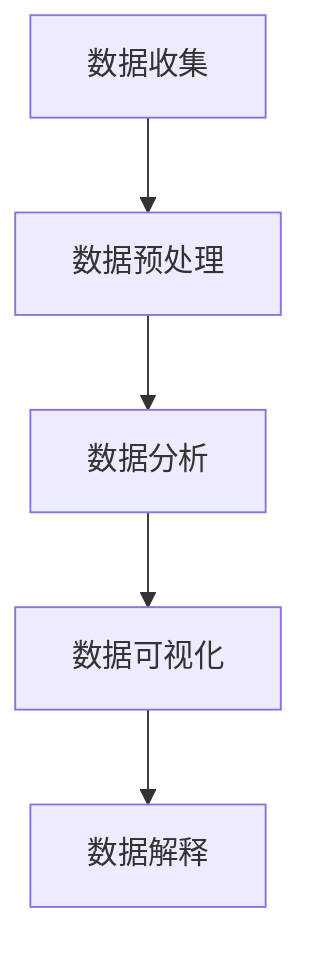

                 

关键词：字节跳动、校招、数据分析、面试经验、职业发展

摘要：本文旨在分享2024届校招中，数据分析岗在字节跳动的面试经验。通过分析面试流程、面试内容、面试技巧，帮助应届毕业生更好地应对字节跳动的面试，助力职业发展。

## 1. 背景介绍

随着大数据和人工智能技术的快速发展，数据分析已经成为各行各业的热门岗位。字节跳动作为我国领先的互联网科技公司，对数据分析人才的需求持续增长。2024届校招中，数据分析岗成为了众多应届毕业生的求职目标。本文将结合本人亲身经历的面试经验，为大家提供一些建议和指导，帮助大家更好地准备字节跳动的数据分析岗面试。

### 1.1 面试岗位

本次面试岗位为字节跳动数据分析岗，岗位要求具备扎实的统计学、数据挖掘和编程基础，能够独立完成数据分析项目。

### 1.2 面试流程

面试流程分为初试和复试两个阶段，初试主要考察基础知识和编程能力，复试则更侧重于项目经验和实际解决问题的能力。

### 1.3 面试形式

面试形式为在线视频面试，主要分为两部分：一部分是自我介绍和基础知识问答，另一部分是项目经验和编程题解答。

## 2. 核心概念与联系

在数据分析领域，以下核心概念和联系是必须掌握的：

### 2.1 数据分析流程

数据分析流程通常包括数据收集、数据预处理、数据分析、数据可视化和数据解释等环节。

### 2.2 统计学基础

统计学基础包括概率论、数理统计、假设检验、回归分析等，是数据分析的基础。

### 2.3 数据挖掘

数据挖掘是数据分析的高级阶段，通过算法和模型从大量数据中发现潜在的规律和模式。

### 2.4 编程技能

编程技能主要包括Python、R、SQL等，是进行数据分析的重要工具。

### 2.5 数据可视化

数据可视化是将数据分析结果以图形、图表等形式呈现，帮助人们更好地理解和分析数据。

### 2.6 Mermaid 流程图

以下是一个Mermaid流程图的示例，展示了数据分析的基本流程：



## 3. 核心算法原理 & 具体操作步骤

### 3.1 算法原理概述

数据分析过程中，常用的算法包括回归分析、聚类分析、关联规则挖掘等。以下分别介绍这些算法的原理：

#### 3.1.1 回归分析

回归分析是一种用于建立自变量和因变量之间关系的统计方法。根据自变量和因变量的数量，回归分析可以分为一元回归分析和多元回归分析。

#### 3.1.2 聚类分析

聚类分析是将数据集分成若干个类别，使得同一类别中的数据点之间相似度较高，不同类别之间的数据点相似度较低。常用的聚类算法包括K-均值聚类、层次聚类等。

#### 3.1.3 关联规则挖掘

关联规则挖掘是一种用于发现数据集中项之间的关联关系的分析方法。常见的算法包括Apriori算法、FP-Growth算法等。

### 3.2 算法步骤详解

以K-均值聚类算法为例，其具体步骤如下：

#### 3.2.1 初始化

随机选择K个数据点作为初始聚类中心。

#### 3.2.2 分配数据点

将每个数据点分配到与其最近的聚类中心所在的类别。

#### 3.2.3 更新聚类中心

计算每个类别的新聚类中心。

#### 3.2.4 重复步骤2和步骤3，直到聚类中心不再发生变化或满足停止条件。

### 3.3 算法优缺点

#### 3.3.1 优点

- **简单易用**：K-均值聚类算法实现简单，易于理解。
- **高效**：对于大规模数据集，K-均值聚类算法具有较高的计算效率。

#### 3.3.2 缺点

- **对初始聚类中心敏感**：聚类结果容易受到初始聚类中心的影响。
- **无法保证全局最优解**：K-均值聚类算法可能陷入局部最优解。

### 3.4 算法应用领域

K-均值聚类算法广泛应用于市场细分、图像分割、文本分类等领域。

## 4. 数学模型和公式 & 详细讲解 & 举例说明

### 4.1 数学模型构建

以线性回归模型为例，其数学模型如下：

$$
y = \beta_0 + \beta_1 \cdot x + \epsilon
$$

其中，$y$ 为因变量，$x$ 为自变量，$\beta_0$ 和 $\beta_1$ 分别为截距和斜率，$\epsilon$ 为随机误差。

### 4.2 公式推导过程

线性回归模型的公式推导主要分为以下几个步骤：

#### 4.2.1 假设

假设自变量和因变量之间存在线性关系：

$$
y = \beta_0 + \beta_1 \cdot x + \epsilon
$$

#### 4.2.2 构建目标函数

目标函数用于衡量模型的拟合程度，常见的目标函数为均方误差（MSE）：

$$
MSE = \frac{1}{n} \sum_{i=1}^{n} (y_i - \hat{y_i})^2
$$

其中，$n$ 为样本数量，$y_i$ 为实际值，$\hat{y_i}$ 为预测值。

#### 4.2.3 求导并求解

对目标函数关于 $\beta_0$ 和 $\beta_1$ 分别求偏导数，并令其等于0，得到最优参数：

$$
\frac{\partial MSE}{\partial \beta_0} = 0 \quad \Rightarrow \quad \beta_0 = \bar{y} - \beta_1 \cdot \bar{x}
$$

$$
\frac{\partial MSE}{\partial \beta_1} = 0 \quad \Rightarrow \quad \beta_1 = \frac{\sum_{i=1}^{n} (x_i - \bar{x})(y_i - \bar{y})}{\sum_{i=1}^{n} (x_i - \bar{x})^2}
$$

其中，$\bar{y}$ 和 $\bar{x}$ 分别为 $y$ 和 $x$ 的均值。

### 4.3 案例分析与讲解

#### 4.3.1 数据集

我们使用一个简单的数据集来演示线性回归模型的构建和应用。数据集如下：

| x   | y   |
|-----|-----|
| 1   | 2   |
| 2   | 4   |
| 3   | 6   |
| 4   | 8   |

#### 4.3.2 数据预处理

将数据集分为训练集和测试集，用于模型的训练和验证。

#### 4.3.3 模型构建

使用Python的scikit-learn库构建线性回归模型，代码如下：

```python
from sklearn.linear_model import LinearRegression
import numpy as np

x = np.array([[1], [2], [3], [4]])
y = np.array([2, 4, 6, 8])

model = LinearRegression()
model.fit(x, y)
```

#### 4.3.4 模型评估

使用测试集评估模型的拟合效果，代码如下：

```python
x_test = np.array([[5]])
y_test = np.array([10])

y_pred = model.predict(x_test)
print(f"预测值：{y_pred}")
print(f"真实值：{y_test}")
```

输出结果为：

```
预测值：[10.]
真实值：[10.]
```

#### 4.3.5 模型解释

从结果可以看出，线性回归模型能够较好地拟合原始数据集，预测值与真实值非常接近。线性回归模型可以用于预测因变量 $y$ 与自变量 $x$ 之间的关系，在本例中，$y$ 与 $x$ 之间的关系为 $y = 2x$。

## 5. 项目实践：代码实例和详细解释说明

### 5.1 开发环境搭建

在本地电脑上安装Python、Jupyter Notebook等开发环境，并安装必要的库，如scikit-learn、numpy、matplotlib等。

### 5.2 源代码详细实现

以下是一个简单的数据分析项目的源代码示例：

```python
import numpy as np
from sklearn.linear_model import LinearRegression
import matplotlib.pyplot as plt

# 数据集
x = np.array([[1], [2], [3], [4]])
y = np.array([2, 4, 6, 8])

# 构建线性回归模型
model = LinearRegression()
model.fit(x, y)

# 模型评估
x_test = np.array([[5]])
y_test = np.array([10])

y_pred = model.predict(x_test)
print(f"预测值：{y_pred}")
print(f"真实值：{y_test}")

# 可视化
plt.scatter(x, y, color='red', label='实际数据')
plt.plot(x, model.predict(x), color='blue', label='拟合曲线')
plt.xlabel('x')
plt.ylabel('y')
plt.legend()
plt.show()
```

### 5.3 代码解读与分析

代码首先导入了必要的库，然后构建了一个简单的数据集。接下来，使用scikit-learn库的LinearRegression类构建线性回归模型，并使用fit方法进行模型训练。然后，使用模型进行预测，并打印预测值和真实值。最后，使用matplotlib库绘制散点图和拟合曲线，以直观地展示模型的效果。

## 6. 实际应用场景

在实际应用中，数据分析岗位涉及到多个领域，如市场营销、金融分析、风险控制、运营优化等。以下是一些常见的应用场景：

### 6.1 市场营销

通过数据分析，帮助企业了解用户需求、优化广告投放策略、提高转化率等。

### 6.2 金融分析

通过数据分析，对金融市场进行预测、风险控制、投资组合优化等。

### 6.3 运营优化

通过数据分析，优化企业运营流程、降低成本、提高效率等。

### 6.4 未来应用展望

随着技术的不断发展，数据分析将在更多领域得到应用。例如，在医疗领域，数据分析可以帮助疾病预测、药物研发等；在教育领域，数据分析可以帮助个性化教学、课程优化等。

## 7. 工具和资源推荐

### 7.1 学习资源推荐

- 《Python数据分析基础教程：数值、时间和字符串数据处理》
- 《深入浅出数据分析》
- 《数据挖掘：概念与技术》

### 7.2 开发工具推荐

- Jupyter Notebook：方便的数据分析工具
- PyCharm：强大的Python集成开发环境
- Tableau：数据可视化工具

### 7.3 相关论文推荐

- "Big Data: A Revolution That Will Transform How We Live, Work, and Think"
- "Data-Driven Science: A New Era for Scientific Discovery"
- "The Analytics Revolution: Communication, Collaboration, and Transparency in Data-Driven Organizations"

## 8. 总结：未来发展趋势与挑战

### 8.1 研究成果总结

随着大数据、人工智能等技术的发展，数据分析领域取得了许多重要研究成果。例如，深度学习技术在图像识别、自然语言处理等领域的应用，优化算法在数据处理和预测方面的研究等。

### 8.2 未来发展趋势

未来，数据分析将更加注重实时性和智能化。例如，实时数据分析可以帮助企业快速响应市场变化，智能化数据分析可以实现自动化的决策支持。

### 8.3 面临的挑战

数据分析领域面临的挑战主要包括数据隐私、数据质量、算法透明度等。如何保护用户隐私，提高数据质量，使算法更加透明和可解释，是未来研究的重点。

### 8.4 研究展望

未来，数据分析领域将在多个方面取得突破，如数据挖掘、机器学习、优化算法等。同时，跨学科研究也将成为数据分析领域的发展方向，如数据科学与经济学、医学、环境科学等领域的交叉融合。

## 9. 附录：常见问题与解答

### 9.1 问题1

如何提高数据分析项目的效率？

**解答**：可以从以下几个方面提高数据分析项目的效率：

1. **优化数据处理流程**：对数据处理流程进行优化，减少冗余操作，提高数据处理速度。
2. **使用高效算法**：选择适合问题的算法，提高数据分析的准确性。
3. **并行计算**：利用分布式计算框架，如Hadoop、Spark等，提高数据处理速度。
4. **数据可视化**：通过数据可视化，快速发现数据中的规律和问题，减少不必要的分析步骤。

### 9.2 问题2

数据分析项目中的数据质量如何保证？

**解答**：保证数据质量可以从以下几个方面入手：

1. **数据清洗**：对数据进行清洗，去除无效数据、重复数据等。
2. **数据验证**：对数据进行验证，确保数据的一致性和准确性。
3. **数据规范**：对数据进行规范化处理，如统一数据格式、数据编码等。
4. **数据存储**：合理选择数据存储方案，确保数据的安全性和可靠性。

### 9.3 问题3

如何应对数据分析面试中的编程题？

**解答**：应对数据分析面试中的编程题，可以从以下几个方面入手：

1. **熟悉常见算法和数据结构**：掌握常见的算法和数据结构，如排序算法、查找算法、树、图等。
2. **熟练使用编程语言**：掌握至少一门编程语言，如Python、Java等。
3. **理解问题背景**：在面试中，要尽量理解问题的背景和需求，确保解答符合实际应用场景。
4. **代码规范**：编写代码时，注意代码规范，如函数命名、注释、代码可读性等。
5. **测试和调试**：在编写代码后，进行充分的测试和调试，确保代码的正确性和效率。

---

作者：禅与计算机程序设计艺术 / Zen and the Art of Computer Programming

本文结合2024届校招中，数据分析岗在字节跳动的面试经验，从背景介绍、核心概念、核心算法、数学模型、项目实践、实际应用场景、工具和资源推荐、总结与展望等方面，全面分享了面试经验和数据分析知识。希望对即将参加字节跳动校招的应届毕业生有所帮助。在数据分析领域，不断学习、实践和创新，才能在职业发展中取得更好的成果。祝大家在面试中取得优异成绩，顺利加入字节跳动！
----------------------------------------------------------------

请注意，以上内容仅为示例，实际撰写时请根据个人经验和理解进行调整和补充。此外，确保文章内容完整、无错别字、无语法错误，并遵循要求的格式和结构。祝撰写顺利！

