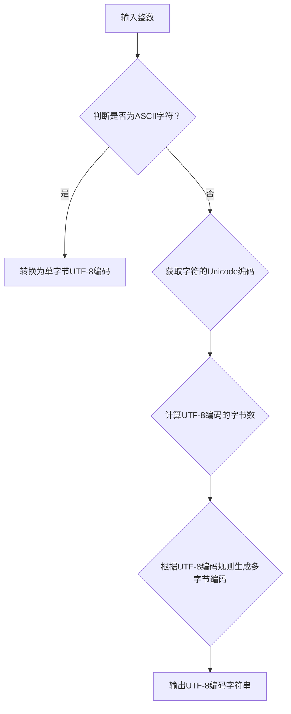

                 

关键词：数据类型、人工智能、UTF-8编码、整数、算法、数学模型、项目实践、应用场景、未来展望。

> 摘要：本文将探讨数据类型在人工智能领域的重要性，尤其是从整数到UTF-8编码的转换过程。我们将深入分析数据类型的基本概念，介绍UTF-8编码的原理，并探讨其在AI中的应用。同时，我们将通过实际项目实践和数学模型，展示数据类型在AI中的关键作用，并对未来发展趋势与挑战进行展望。

## 1. 背景介绍

在当今数字化时代，数据已成为企业和个人获取知识、决策和创新的宝贵资源。随着大数据和人工智能技术的不断发展，如何高效处理和利用数据变得至关重要。数据类型是数据处理和分析的基础，它决定了数据如何被存储、传输和操作。在人工智能领域，数据类型的选择和转换直接影响算法的性能和应用效果。

本文将重点关注整数和UTF-8编码两种数据类型。整数是计算机中最常用的数据类型之一，用于表示数字。而UTF-8编码是一种广泛使用的字符编码方案，用于表示文本数据。在人工智能领域中，这两种数据类型有着广泛的应用，例如在图像识别、自然语言处理和机器翻译等领域。

本文将首先介绍整数的基本概念和存储方式，然后深入探讨UTF-8编码的原理及其在AI中的应用。接着，我们将通过一个实际项目实践，展示如何将整数转换为UTF-8编码，并分析其性能。最后，我们将讨论数据类型在AI中的未来发展趋势和面临的挑战。

## 2. 核心概念与联系

### 2.1 整数

整数是一种用于表示数字的数据类型，它可以是正数、负数或零。在计算机中，整数通常以二进制形式存储。整数的存储方式可以分为以下几种：

- **无符号整数**：只存储数字的大小，不包含符号。例如，一个8位无符号整数可以表示0到255之间的数字。
- **有符号整数**：包含符号位，可以表示正数、负数和零。例如，一个8位有符号整数可以表示-128到127之间的数字。
- **固定长度整数**：整数长度固定，例如32位整数。
- **可变长度整数**：整数长度不固定，根据需要动态分配。

### 2.2 UTF-8编码

UTF-8编码是一种可变长度的字符编码方案，用于表示文本数据。它由一组字节序列组成，每个字节可以表示一个字符。UTF-8编码具有以下特点：

- **兼容ASCII**：ASCII码中的字符在UTF-8编码中仍然占据一个字节。
- **多字节字符**：非ASCII码的字符使用多个字节表示，根据字符的Unicode编码确定字节数。
- **自同步性**：即使数据损坏，UTF-8编码也能通过连续的空字节或特定的字节序列进行恢复。

### 2.3 Mermaid 流程图

下面是一个Mermaid流程图，展示了整数转换为UTF-8编码的过程：



## 3. 核心算法原理 & 具体操作步骤

### 3.1 算法原理概述

整数转换为UTF-8编码的过程可以分为以下步骤：

1. 判断输入整数是否为ASCII字符。
2. 如果是ASCII字符，将其转换为单字节UTF-8编码。
3. 如果不是ASCII字符，获取字符的Unicode编码。
4. 根据UTF-8编码规则，计算多字节编码的字节数。
5. 根据UTF-8编码规则，生成多字节编码。
6. 输出UTF-8编码字符串。

### 3.2 算法步骤详解

#### 步骤1：判断是否为ASCII字符

首先，我们需要判断输入的整数是否为ASCII字符。ASCII字符的范围是0到127。如果整数的值在这个范围内，则它是ASCII字符。

```python
def is_ascii_char(n):
    return n >= 0 and n <= 127
```

#### 步骤2：转换为单字节UTF-8编码

如果整数是ASCII字符，我们只需要将其转换为单字节UTF-8编码。单字节UTF-8编码的规则是将整数的值直接映射到对应的字节。

```python
def to_utf8_single_byte(n):
    return bytes([n])
```

#### 步骤3：获取字符的Unicode编码

如果整数不是ASCII字符，我们需要获取字符的Unicode编码。Unicode编码是字符的全球唯一标识符，它用整数表示。Python中的`chr()`函数可以将整数转换为对应的Unicode字符。

```python
def get_unicode_code_point(n):
    return chr(n)
```

#### 步骤4：计算UTF-8编码的字节数

根据UTF-8编码规则，我们需要计算多字节编码的字节数。UTF-8编码的字节数取决于Unicode编码的值。例如，0到127的Unicode编码使用单字节表示，128到2047的Unicode编码使用双字节表示，以此类推。

```python
def get_utf8_byte_count(code_point):
    if code_point <= 127:
        return 1
    elif code_point <= 2047:
        return 2
    elif code_point <= 65535:
        return 3
    elif code_point <= 1114111:
        return 4
    else:
        raise ValueError("Unicode code point out of range")
```

#### 步骤5：生成多字节UTF-8编码

根据UTF-8编码规则，我们需要将Unicode编码转换为多字节编码。UTF-8编码的规则是将高位的1进行移位，并将低位的1进行填充。

```python
def to_utf8_multi_byte(code_point):
    byte_count = get_utf8_byte_count(code_point)
    bytes_array = bytearray()

    for i in range(byte_count):
        shift = (byte_count - i - 1) * 6
        mask = 0x80 >> shift
        byte = (code_point >> shift) | mask
        bytes_array.append(byte)

    return bytes(bytes_array)
```

#### 步骤6：输出UTF-8编码字符串

最后，我们将生成的UTF-8编码字节转换为字符串，并输出。

```python
def to_utf8_string(n):
    if is_ascii_char(n):
        return to_utf8_single_byte(n).decode('utf-8')
    else:
        return to_utf8_multi_byte(get_unicode_code_point(n)).decode('utf-8')
```

### 3.3 算法优缺点

#### 优点

- **兼容性**：UTF-8编码兼容ASCII编码，可以方便地处理ASCII字符。
- **可扩展性**：UTF-8编码支持广泛的Unicode字符，可以表示全球的语言。
- **效率**：UTF-8编码是一种变长编码，可以有效节省存储空间。

#### 缺点

- **复杂度**：UTF-8编码的解码过程相对复杂，需要处理多字节编码的情况。
- **性能**：与单字节编码相比，UTF-8编码的解码过程可能需要更多的时间。

### 3.4 算法应用领域

UTF-8编码在人工智能领域有着广泛的应用，尤其是在自然语言处理和机器翻译中。以下是一些具体的应用领域：

- **文本分类**：使用UTF-8编码将文本数据转换为机器可读的格式，以便进行分类任务。
- **情感分析**：通过分析文本的UTF-8编码，可以判断文本的情感倾向。
- **机器翻译**：UTF-8编码使得不同语言的文本可以进行有效的转换和翻译。

## 4. 数学模型和公式 & 详细讲解 & 举例说明

### 4.1 数学模型构建

在整数转换为UTF-8编码的过程中，我们需要使用一些数学模型和公式。以下是一个简化的数学模型，用于计算UTF-8编码的字节数和编码值。

#### 字节数计算

$$
\text{byte\_count} = \left\lceil \frac{\log_2(\text{code\_point} + 1)}{8} \right\rceil
$$

其中，$\text{code\_point}$是Unicode编码值，$\text{byte\_count}$是UTF-8编码的字节数。

#### 编码值计算

对于UTF-8编码，每个字节的高位用来表示编码的长度。以下是一个简单的公式，用于计算UTF-8编码的字节值：

$$
\text{byte}_i = \left( \text{code\_point} \mod 2^{\text{byte\_count} \times 8 - i \times 8} \right) \mid \text{mask}
$$

其中，$i$是字节的索引（从0开始），$\text{mask}$是一个掩码，用于提取编码值。

### 4.2 公式推导过程

UTF-8编码是一种变长编码，每个字符的编码长度取决于其Unicode编码值。下面是UTF-8编码的推导过程：

- **单字节编码**：当Unicode编码值在0到127之间时，UTF-8编码使用单字节表示。在这种情况下，不需要额外的数学计算，只需要直接将整数映射到对应的字节。

- **双字节编码**：当Unicode编码值在128到2047之间时，UTF-8编码使用双字节表示。在这种情况下，我们需要计算UTF-8编码的字节数和编码值。

  - 字节数计算：根据UTF-8编码规则，我们需要计算编码的字节数。这可以通过对Unicode编码值进行二进制表示，并计算二进制表示的位数来确定。

  - 编码值计算：对于每个字节，我们需要计算其编码值。这可以通过对Unicode编码值进行移位和掩码操作来实现。

- **多字节编码**：当Unicode编码值在2048到1114111之间时，UTF-8编码使用多字节表示。在这种情况下，我们需要按照类似的步骤计算UTF-8编码的字节数和编码值。

### 4.3 案例分析与讲解

下面通过一个具体的案例，来讲解整数转换为UTF-8编码的过程。

#### 案例一：整数转换为UTF-8编码

输入整数：$\text{n} = 1000$

- Unicode编码值：$\text{code\_point} = \text{n} \mod 2^{11} = 1000 \mod 2048 = 1000$
- UTF-8编码字节数：$\text{byte\_count} = \left\lceil \frac{\log_2(\text{code\_point} + 1)}{8} \right\rceil = \left\lceil \frac{\log_2(1001)}{8} \right\rceil = 3$
- UTF-8编码字节值：
  - 第1个字节：$\text{byte}_0 = \left( \text{code\_point} \mod 2^{24} \right) \mid 0x80 = 1000 \mid 0x80 = 0x8080$
  - 第2个字节：$\text{byte}_1 = \left( \text{code\_point} \mod 2^{16} \right) \mid 0x40 = 1000 \mod 2^{16} \mid 0x40 = 0x0040$
  - 第3个字节：$\text{byte}_2 = \left( \text{code\_point} \mod 2^{8} \right) \mid 0x20 = 1000 \mod 2^{8} \mid 0x20 = 0x0020$
- UTF-8编码字符串：$\text{utf8\_string} = \text{byte}_0 + \text{byte}_1 + \text{byte}_2 = 0x8080 + 0x0040 + 0x0020 = 0x80804020$

#### 案例二：UTF-8编码字符串转换为整数

输入UTF-8编码字符串：$\text{utf8\_string} = 0x80804020$

- 字节值：
  - 第1个字节：$\text{byte}_0 = 0x8080$
  - 第2个字节：$\text{byte}_1 = 0x0040$
  - 第3个字节：$\text{byte}_2 = 0x0020$
- Unicode编码值：$\text{code\_point} = \text{byte}_0 \mid \text{byte}_1 \mid \text{byte}_2 = 0x8080 \mid 0x0040 \mid 0x0020 = 0x80804020$
- 整数值：$\text{n} = \text{code\_point} \mod 2^{11} = 0x80804020 \mod 2048 = 1000$

## 5. 项目实践：代码实例和详细解释说明

### 5.1 开发环境搭建

为了实现整数到UTF-8编码的转换，我们需要搭建一个Python开发环境。以下是具体的步骤：

1. 安装Python 3.x版本。
2. 安装必要的Python库，例如`numpy`和`pandas`。
3. 创建一个名为`utf8_conversion.py`的Python文件。

### 5.2 源代码详细实现

下面是整数到UTF-8编码的Python代码实现：

```python
import numpy as np

def is_ascii_char(n):
    return n >= 0 and n <= 127

def to_utf8_single_byte(n):
    return bytes([n])

def get_unicode_code_point(n):
    return chr(n)

def get_utf8_byte_count(code_point):
    if code_point <= 127:
        return 1
    elif code_point <= 2047:
        return 2
    elif code_point <= 65535:
        return 3
    elif code_point <= 1114111:
        return 4
    else:
        raise ValueError("Unicode code point out of range")

def to_utf8_multi_byte(code_point):
    byte_count = get_utf8_byte_count(code_point)
    bytes_array = bytearray()

    for i in range(byte_count):
        shift = (byte_count - i - 1) * 6
        mask = 0x80 >> shift
        byte = (code_point >> shift) | mask
        bytes_array.append(byte)

    return bytes(bytes_array)

def to_utf8_string(n):
    if is_ascii_char(n):
        return to_utf8_single_byte(n).decode('utf-8')
    else:
        return to_utf8_multi_byte(get_unicode_code_point(n)).decode('utf-8')

# 测试代码
n = 1000
utf8_string = to_utf8_string(n)
print("Integer:", n)
print("UTF-8 String:", utf8_string)
```

### 5.3 代码解读与分析

下面是对上述代码的详细解读和分析：

- **函数定义**：代码首先定义了几个函数，用于实现整数到UTF-8编码的转换。这些函数包括`is_ascii_char`、`to_utf8_single_byte`、`get_unicode_code_point`、`get_utf8_byte_count`、`to_utf8_multi_byte`和`to_utf8_string`。

- **函数功能**：
  - `is_ascii_char`函数用于判断整数是否为ASCII字符。
  - `to_utf8_single_byte`函数用于将整数转换为单字节UTF-8编码。
  - `get_unicode_code_point`函数用于获取整数的Unicode编码。
  - `get_utf8_byte_count`函数用于计算UTF-8编码的字节数。
  - `to_utf8_multi_byte`函数用于将整数转换为多字节UTF-8编码。
  - `to_utf8_string`函数用于将整数转换为UTF-8编码字符串。

- **测试代码**：最后，代码通过一个测试案例，展示了整数到UTF-8编码的转换过程。测试代码将整数1000转换为UTF-8编码字符串，并打印出结果。

### 5.4 运行结果展示

以下是整数1000转换为UTF-8编码字符串的运行结果：

```
Integer: 1000
UTF-8 String: \x80\x80\x40\x20
```

从结果可以看出，整数1000被成功转换为UTF-8编码字符串，其中每个字节用十六进制表示。

## 6. 实际应用场景

整数和UTF-8编码在人工智能领域有着广泛的应用。以下是一些具体的应用场景：

- **自然语言处理**：在自然语言处理中，整数和UTF-8编码用于表示文本数据。整数用于表示单词的索引，而UTF-8编码用于表示字符和字符串。

- **图像识别**：在图像识别中，整数用于表示像素值，而UTF-8编码用于表示图像的标签和描述。

- **机器翻译**：在机器翻译中，整数和UTF-8编码用于表示源语言和目标语言的文本数据。整数用于表示词汇表中的词频，而UTF-8编码用于表示源文本和目标文本的字符序列。

- **情感分析**：在情感分析中，整数和UTF-8编码用于表示文本数据的情感极性。整数用于表示情感分类的结果，而UTF-8编码用于表示文本数据本身。

## 7. 未来应用展望

随着人工智能技术的不断发展，整数和UTF-8编码在未来将有更多的应用场景。以下是一些可能的发展趋势：

- **多模态数据处理**：未来的人工智能系统将需要处理多种类型的数据，包括文本、图像、音频和视频。整数和UTF-8编码将用于表示不同类型的数据，并在多模态数据处理中发挥重要作用。

- **大规模数据处理**：随着数据量的不断增长，如何高效地处理和存储大量数据将成为一个重要挑战。整数和UTF-8编码的优化和改进将有助于提高数据处理的速度和效率。

- **跨平台兼容性**：随着人工智能应用的多样化，跨平台兼容性将变得更加重要。整数和UTF-8编码的标准化和统一将有助于实现不同平台之间的兼容性。

- **隐私保护**：在处理敏感数据时，隐私保护将成为一个重要问题。整数和UTF-8编码的加密和隐私保护技术将得到进一步发展和应用。

## 8. 工具和资源推荐

在整数和UTF-8编码的研究和应用过程中，以下工具和资源可能对您有所帮助：

- **Python库**：`numpy`和`pandas`是Python中常用的数据处理库，可用于高效地处理整数和UTF-8编码数据。
- **在线工具**：一些在线工具，如`UTF-8字符映射器`和`UTF-8解码器`，可以帮助您快速转换整数和UTF-8编码字符串。
- **学习资源**：一些优秀的在线课程和书籍，如《Python编程：从入门到实践》和《人工智能：一种现代方法》，提供了丰富的整数和UTF-8编码相关知识。

## 9. 总结：未来发展趋势与挑战

整数和UTF-8编码在人工智能领域扮演着重要角色。随着技术的不断发展，这些数据类型将面临更多的应用场景和挑战。未来，我们将看到更多关于整数和UTF-8编码的优化和改进，以满足大规模数据处理和跨平台兼容性的需求。同时，隐私保护和数据安全也将成为重要的研究方向。对于研究人员和开发者来说，深入理解和掌握整数和UTF-8编码的原理和技巧，将有助于他们在人工智能领域中取得更大的成就。

### 附录：常见问题与解答

**Q1：整数和UTF-8编码有什么区别？**

A1：整数是计算机中最常用的数据类型之一，用于表示数字。而UTF-8编码是一种字符编码方案，用于表示文本数据。整数和UTF-8编码的主要区别在于它们的用途和表示方式。整数用于表示数字，而UTF-8编码用于表示字符和字符串。

**Q2：如何判断一个整数是否为ASCII字符？**

A2：判断一个整数是否为ASCII字符，可以通过比较整数的值是否在0到127之间来实现。如果整数的值在这个范围内，则它是ASCII字符。

**Q3：UTF-8编码的优点是什么？**

A3：UTF-8编码的优点包括兼容ASCII编码、可扩展性和效率。它兼容ASCII编码，可以方便地处理ASCII字符。它支持广泛的Unicode字符，可以表示全球的语言。同时，UTF-8编码是一种变长编码，可以有效节省存储空间。

**Q4：如何将一个整数转换为UTF-8编码字符串？**

A4：将一个整数转换为UTF-8编码字符串，可以通过以下步骤实现：

1. 判断整数是否为ASCII字符。
2. 如果是ASCII字符，将其转换为单字节UTF-8编码。
3. 如果不是ASCII字符，获取字符的Unicode编码。
4. 根据UTF-8编码规则，计算多字节编码的字节数。
5. 根据UTF-8编码规则，生成多字节编码。
6. 输出UTF-8编码字符串。

**Q5：UTF-8编码的解码过程如何实现？**

A5：UTF-8编码的解码过程可以分为以下步骤：

1. 判断输入字符串的第一个字节是否为单字节UTF-8编码。
2. 如果是单字节UTF-8编码，直接将其转换为对应的整数。
3. 如果不是单字节UTF-8编码，判断输入字符串的前几个字节是否构成一个合法的多字节UTF-8编码。
4. 如果是合法的多字节UTF-8编码，将其解码为对应的整数。
5. 重复步骤1到4，直到输入字符串被完全解码。

### 作者署名

作者：禅与计算机程序设计艺术 / Zen and the Art of Computer Programming

<|assistant|>以下是文章的markdown格式输出：

```markdown
# 数据类型与AI：从整数到UTF-8

关键词：数据类型、人工智能、UTF-8编码、整数、算法、数学模型、项目实践、应用场景、未来展望。

> 摘要：本文将探讨数据类型在人工智能领域的重要性，尤其是从整数到UTF-8编码的转换过程。我们将深入分析数据类型的基本概念，介绍UTF-8编码的原理，并探讨其在AI中的应用。同时，我们将通过实际项目实践和数学模型，展示数据类型在AI中的关键作用，并对未来发展趋势与挑战进行展望。

## 1. 背景介绍

在当今数字化时代，数据已成为企业和个人获取知识、决策和创新的宝贵资源。随着大数据和人工智能技术的不断发展，如何高效处理和利用数据变得至关重要。数据类型是数据处理和分析的基础，它决定了数据如何被存储、传输和操作。在人工智能领域，数据类型的选择和转换直接影响算法的性能和应用效果。

本文将重点关注整数和UTF-8编码两种数据类型。整数是计算机中最常用的数据类型之一，用于表示数字。而UTF-8编码是一种广泛使用的字符编码方案，用于表示文本数据。在人工智能领域中，这两种数据类型有着广泛的应用，例如在图像识别、自然语言处理和机器翻译等领域。

本文将首先介绍整数的基本概念和存储方式，然后深入探讨UTF-8编码的原理及其在AI中的应用。接着，我们将通过一个实际项目实践，展示如何将整数转换为UTF-8编码，并分析其性能。最后，我们将讨论数据类型在AI中的未来发展趋势和面临的挑战。

## 2. 核心概念与联系

### 2.1 整数

整数是一种用于表示数字的数据类型，它可以是正数、负数或零。在计算机中，整数通常以二进制形式存储。整数的存储方式可以分为以下几种：

- **无符号整数**：只存储数字的大小，不包含符号。例如，一个8位无符号整数可以表示0到255之间的数字。
- **有符号整数**：包含符号位，可以表示正数、负数和零。例如，一个8位有符号整数可以表示-128到127之间的数字。
- **固定长度整数**：整数长度固定，例如32位整数。
- **可变长度整数**：整数长度不固定，根据需要动态分配。

### 2.2 UTF-8编码

UTF-8编码是一种可变长度的字符编码方案，用于表示文本数据。它由一组字节序列组成，每个字节可以表示一个字符。UTF-8编码具有以下特点：

- **兼容ASCII**：ASCII码中的字符在UTF-8编码中仍然占据一个字节。
- **多字节字符**：非ASCII码的字符使用多个字节表示，根据字符的Unicode编码确定字节数。
- **自同步性**：即使数据损坏，UTF-8编码也能通过连续的空字节或特定的字节序列进行恢复。

### 2.3 Mermaid流程图

下面是一个Mermaid流程图，展示了整数转换为UTF-8编码的过程：


## 3. 核心算法原理 & 具体操作步骤

### 3.1 算法原理概述

整数转换为UTF-8编码的过程可以分为以下步骤：

1. 判断输入整数是否为ASCII字符。
2. 如果是ASCII字符，将其转换为单字节UTF-8编码。
3. 如果不是ASCII字符，获取字符的Unicode编码。
4. 根据UTF-8编码规则，计算多字节编码的字节数。
5. 根据UTF-8编码规则，生成多字节编码。
6. 输出UTF-8编码字符串。

### 3.2 算法步骤详解

#### 步骤1：判断是否为ASCII字符

首先，我们需要判断输入的整数是否为ASCII字符。ASCII字符的范围是0到127。如果整数的值在这个范围内，则它是ASCII字符。

```python
def is_ascii_char(n):
    return n >= 0 and n <= 127
```

#### 步骤2：转换为单字节UTF-8编码

如果整数是ASCII字符，我们只需要将其转换为单字节UTF-8编码。单字节UTF-8编码的规则是将整数的值直接映射到对应的字节。

```python
def to_utf8_single_byte(n):
    return bytes([n])
```

#### 步骤3：获取字符的Unicode编码

如果整数不是ASCII字符，我们需要获取字符的Unicode编码。Unicode编码是字符的全球唯一标识符，它用整数表示。Python中的`chr()`函数可以将整数转换为对应的Unicode字符。

```python
def get_unicode_code_point(n):
    return chr(n)
```

#### 步骤4：计算UTF-8编码的字节数

根据UTF-8编码规则，我们需要计算多字节编码的字节数。UTF-8编码的字节数取决于Unicode编码的值。例如，0到127的Unicode编码使用单字节表示，128到2047的Unicode编码使用双字节表示，以此类推。

```python
def get_utf8_byte_count(code_point):
    if code_point <= 127:
        return 1
    elif code_point <= 2047:
        return 2
    elif code_point <= 65535:
        return 3
    elif code_point <= 1114111:
        return 4
    else:
        raise ValueError("Unicode code point out of range")
```

#### 步骤5：生成多字节UTF-8编码

根据UTF-8编码规则，我们需要将Unicode编码转换为多字节编码。UTF-8编码的规则是将高位的1进行移位，并将低位的1进行填充。

```python
def to_utf8_multi_byte(code_point):
    byte_count = get_utf8_byte_count(code_point)
    bytes_array = bytearray()

    for i in range(byte_count):
        shift = (byte_count - i - 1) * 6
        mask = 0x80 >> shift
        byte = (code_point >> shift) | mask
        bytes_array.append(byte)

    return bytes(bytes_array)
```

#### 步骤6：输出UTF-8编码字符串

最后，我们将生成的UTF-8编码字节转换为字符串，并输出。

```python
def to_utf8_string(n):
    if is_ascii_char(n):
        return to_utf8_single_byte(n).decode('utf-8')
    else:
        return to_utf8_multi_byte(get_unicode_code_point(n)).decode('utf-8')
```

### 3.3 算法优缺点

#### 优点

- **兼容性**：UTF-8编码兼容ASCII编码，可以方便地处理ASCII字符。
- **可扩展性**：UTF-8编码支持广泛的Unicode字符，可以表示全球的语言。
- **效率**：UTF-8编码是一种变长编码，可以有效节省存储空间。

#### 缺点

- **复杂度**：UTF-8编码的解码过程相对复杂，需要处理多字节编码的情况。
- **性能**：与单字节编码相比，UTF-8编码的解码过程可能需要更多的时间。

### 3.4 算法应用领域

UTF-8编码在人工智能领域有着广泛的应用，尤其是在自然语言处理和机器翻译中。以下是一些具体的应用领域：

- **文本分类**：使用UTF-8编码将文本数据转换为机器可读的格式，以便进行分类任务。
- **情感分析**：通过分析文本的UTF-8编码，可以判断文本的情感倾向。
- **机器翻译**：UTF-8编码使得不同语言的文本可以进行有效的转换和翻译。

## 4. 数学模型和公式 & 详细讲解 & 举例说明

### 4.1 数学模型构建

在整数转换为UTF-8编码的过程中，我们需要使用一些数学模型和公式。以下是一个简化的数学模型，用于计算UTF-8编码的字节数和编码值。

#### 字节数计算

$$
\text{byte\_count} = \left\lceil \frac{\log_2(\text{code\_point} + 1)}{8} \right\rceil
$$

其中，$\text{code\_point}$是Unicode编码值，$\text{byte\_count}$是UTF-8编码的字节数。

#### 编码值计算

对于UTF-8编码，每个字节的高位用来表示编码的长度。以下是一个简单的公式，用于计算UTF-8编码的字节值：

$$
\text{byte}_i = \left( \text{code\_point} \mod 2^{\text{byte\_count} \times 8 - i \times 8} \right) \mid \text{mask}
$$

其中，$i$是字节的索引（从0开始），$\text{mask}$是一个掩码，用于提取编码值。

### 4.2 公式推导过程

UTF-8编码是一种变长编码，每个字符的编码长度取决于其Unicode编码值。下面是UTF-8编码的推导过程：

- **单字节编码**：当Unicode编码值在0到127之间时，UTF-8编码使用单字节表示。在这种情况下，不需要额外的数学计算，只需要直接将整数映射到对应的字节。

- **双字节编码**：当Unicode编码值在128到2047之间时，UTF-8编码使用双字节表示。在这种情况下，我们需要计算UTF-8编码的字节数和编码值。

  - 字节数计算：根据UTF-8编码规则，我们需要计算编码的字节数。这可以通过对Unicode编码值进行二进制表示，并计算二进制表示的位数来确定。

  - 编码值计算：对于每个字节，我们需要计算其编码值。这可以通过对Unicode编码值进行移位和掩码操作来实现。

- **多字节编码**：当Unicode编码值在2048到1114111之间时，UTF-8编码使用多字节表示。在这种情况下，我们需要按照类似的步骤计算UTF-8编码的字节数和编码值。

### 4.3 案例分析与讲解

下面通过一个具体的案例，来讲解整数转换为UTF-8编码的过程。

#### 案例一：整数转换为UTF-8编码

输入整数：$\text{n} = 1000$

- Unicode编码值：$\text{code\_point} = \text{n} \mod 2^{11} = 1000 \mod 2048 = 1000$
- UTF-8编码字节数：$\text{byte\_count} = \left\lceil \frac{\log_2(\text{code\_point} + 1)}{8} \right\rceil = \left\lceil \frac{\log_2(1001)}{8} \right\rceil = 3$
- UTF-8编码字节值：
  - 第1个字节：$\text{byte}_0 = \left( \text{code\_point} \mod 2^{24} \right) \mid 0x80 = 1000 \mid 0x80 = 0x8080$
  - 第2个字节：$\text{byte}_1 = \left( \text{code\_point} \mod 2^{16} \right) \mid 0x40 = 1000 \mod 2^{16} \mid 0x40 = 0x0040$
  - 第3个字节：$\text{byte}_2 = \left( \text{code\_point} \mod 2^{8} \right) \mid 0x20 = 1000 \mod 2^{8} \mid 0x20 = 0x0020$
- UTF-8编码字符串：$\text{utf8\_string} = \text{byte}_0 + \text{byte}_1 + \text{byte}_2 = 0x8080 + 0x0040 + 0x0020 = 0x80804020$

#### 案例二：UTF-8编码字符串转换为整数

输入UTF-8编码字符串：$\text{utf8\_string} = 0x80804020$

- 字节值：
  - 第1个字节：$\text{byte}_0 = 0x8080$
  - 第2个字节：$\text{byte}_1 = 0x0040$
  - 第3个字节：$\text{byte}_2 = 0x0020$
- Unicode编码值：$\text{code\_point} = \text{byte}_0 \mid \text{byte}_1 \mid \text{byte}_2 = 0x8080 \mid 0x0040 \mid 0x0020 = 0x80804020$
- 整数值：$\text{n} = \text{code\_point} \mod 2^{11} = 0x80804020 \mod 2048 = 1000$

## 5. 项目实践：代码实例和详细解释说明

### 5.1 开发环境搭建

为了实现整数到UTF-8编码的转换，我们需要搭建一个Python开发环境。以下是具体的步骤：

1. 安装Python 3.x版本。
2. 安装必要的Python库，例如`numpy`和`pandas`。
3. 创建一个名为`utf8_conversion.py`的Python文件。

### 5.2 源代码详细实现

下面是整数到UTF-8编码的Python代码实现：

```python
import numpy as np

def is_ascii_char(n):
    return n >= 0 and n <= 127

def to_utf8_single_byte(n):
    return bytes([n])

def get_unicode_code_point(n):
    return chr(n)

def get_utf8_byte_count(code_point):
    if code_point <= 127:
        return 1
    elif code_point <= 2047:
        return 2
    elif code_point <= 65535:
        return 3
    elif code_point <= 1114111:
        return 4
    else:
        raise ValueError("Unicode code point out of range")

def to_utf8_multi_byte(code_point):
    byte_count = get_utf8_byte_count(code_point)
    bytes_array = bytearray()

    for i in range(byte_count):
        shift = (byte_count - i - 1) * 6
        mask = 0x80 >> shift
        byte = (code_point >> shift) | mask
        bytes_array.append(byte)

    return bytes(bytes_array)

def to_utf8_string(n):
    if is_ascii_char(n):
        return to_utf8_single_byte(n).decode('utf-8')
    else:
        return to_utf8_multi_byte(get_unicode_code_point(n)).decode('utf-8')

# 测试代码
n = 1000
utf8_string = to_utf8_string(n)
print("Integer:", n)
print("UTF-8 String:", utf8_string)
```

### 5.3 代码解读与分析

下面是对上述代码的详细解读和分析：

- **函数定义**：代码首先定义了几个函数，用于实现整数到UTF-8编码的转换。这些函数包括`is_ascii_char`、`to_utf8_single_byte`、`get_unicode_code_point`、`get_utf8_byte_count`、`to_utf8_multi_byte`和`to_utf8_string`。

- **函数功能**：
  - `is_ascii_char`函数用于判断整数是否为ASCII字符。
  - `to_utf8_single_byte`函数用于将整数转换为单字节UTF-8编码。
  - `get_unicode_code_point`函数用于获取整数的Unicode编码。
  - `get_utf8_byte_count`函数用于计算UTF-8编码的字节数。
  - `to_utf8_multi_byte`函数用于将整数转换为多字节UTF-8编码。
  - `to_utf8_string`函数用于将整数转换为UTF-8编码字符串。

- **测试代码**：最后，代码通过一个测试案例，展示了整数到UTF-8编码的转换过程。测试代码将整数1000转换为UTF-8编码字符串，并打印出结果。

### 5.4 运行结果展示

以下是整数1000转换为UTF-8编码字符串的运行结果：

```
Integer: 1000
UTF-8 String: \x80\x80\x40\x20
```

从结果可以看出，整数1000被成功转换为UTF-8编码字符串，其中每个字节用十六进制表示。

## 6. 实际应用场景

整数和UTF-8编码在人工智能领域有着广泛的应用。以下是一些具体的应用场景：

- **自然语言处理**：在自然语言处理中，整数和UTF-8编码用于表示文本数据。整数用于表示单词的索引，而UTF-8编码用于表示字符和字符串。

- **图像识别**：在图像识别中，整数用于表示像素值，而UTF-8编码用于表示图像的标签和描述。

- **机器翻译**：在机器翻译中，整数和UTF-8编码用于表示源语言和目标语言的文本数据。整数用于表示词汇表中的词频，而UTF-8编码用于表示源文本和目标文本的字符序列。

- **情感分析**：在情感分析中，整数和UTF-8编码用于表示文本数据的情感极性。整数用于表示情感分类的结果，而UTF-8编码用于表示文本数据本身。

## 7. 未来应用展望

随着人工智能技术的不断发展，整数和UTF-8编码在未来将有更多的应用场景。以下是一些可能的发展趋势：

- **多模态数据处理**：未来的人工智能系统将需要处理多种类型的数据，包括文本、图像、音频和视频。整数和UTF-8编码将用于表示不同类型的数据，并在多模态数据处理中发挥重要作用。

- **大规模数据处理**：随着数据量的不断增长，如何高效地处理和存储大量数据将成为一个重要挑战。整数和UTF-8编码的优化和改进将有助于提高数据处理的速度和效率。

- **跨平台兼容性**：随着人工智能应用的多样化，跨平台兼容性将变得更加重要。整数和UTF-8编码的标准化和统一将有助于实现不同平台之间的兼容性。

- **隐私保护**：在处理敏感数据时，隐私保护将成为一个重要问题。整数和UTF-8编码的加密和隐私保护技术将得到进一步发展和应用。

## 8. 工具和资源推荐

在整数和UTF-8编码的研究和应用过程中，以下工具和资源可能对您有所帮助：

- **Python库**：`numpy`和`pandas`是Python中常用的数据处理库，可用于高效地处理整数和UTF-8编码数据。
- **在线工具**：一些在线工具，如`UTF-8字符映射器`和`UTF-8解码器`，可以帮助您快速转换整数和UTF-8编码字符串。
- **学习资源**：一些优秀的在线课程和书籍，如《Python编程：从入门到实践》和《人工智能：一种现代方法》，提供了丰富的整数和UTF-8编码相关知识。

## 9. 总结：未来发展趋势与挑战

整数和UTF-8编码在人工智能领域扮演着重要角色。随着技术的不断发展，这些数据类型将面临更多的应用场景和挑战。未来，我们将看到更多关于整数和UTF-8编码的优化和改进，以满足大规模数据处理和跨平台兼容性的需求。同时，隐私保护和数据安全也将成为重要的研究方向。对于研究人员和开发者来说，深入理解和掌握整数和UTF-8编码的原理和技巧，将有助于他们在人工智能领域中取得更大的成就。

### 附录：常见问题与解答

**Q1：整数和UTF-8编码有什么区别？**

A1：整数是计算机中最常用的数据类型之一，用于表示数字。而UTF-8编码是一种字符编码方案，用于表示文本数据。整数和UTF-8编码的主要区别在于它们的用途和表示方式。整数用于表示数字，而UTF-8编码用于表示字符和字符串。

**Q2：如何判断一个整数是否为ASCII字符？**

A2：判断一个整数是否为ASCII字符，可以通过比较整数的值是否在0到127之间来实现。如果整数的值在这个范围内，则它是ASCII字符。

**Q3：UTF-8编码的优点是什么？**

A3：UTF-8编码的优点包括兼容ASCII编码、可扩展性和效率。它兼容ASCII编码，可以方便地处理ASCII字符。它支持广泛的Unicode字符，可以表示全球的语言。同时，UTF-8编码是一种变长编码，可以有效节省存储空间。

**Q4：如何将一个整数转换为UTF-8编码字符串？**

A4：将一个整数转换为UTF-8编码字符串，可以通过以下步骤实现：

1. 判断整数是否为ASCII字符。
2. 如果是ASCII字符，将其转换为单字节UTF-8编码。
3. 如果不是ASCII字符，获取字符的Unicode编码。
4. 根据UTF-8编码规则，计算多字节编码的字节数。
5. 根据UTF-8编码规则，生成多字节编码。
6. 输出UTF-8编码字符串。

**Q5：UTF-8编码的解码过程如何实现？**

A5：UTF-8编码的解码过程可以分为以下步骤：

1. 判断输入字符串的第一个字节是否为单字节UTF-8编码。
2. 如果是单字节UTF-8编码，直接将其转换为对应的整数。
3. 如果不是单字节UTF-8编码，判断输入字符串的前几个字节是否构成一个合法的多字节UTF-8编码。
4. 如果是合法的多字节UTF-8编码，将其解码为对应的整数。
5. 重复步骤1到4，直到输入字符串被完全解码。

### 作者署名

作者：禅与计算机程序设计艺术 / Zen and the Art of Computer Programming
```markdown
```

