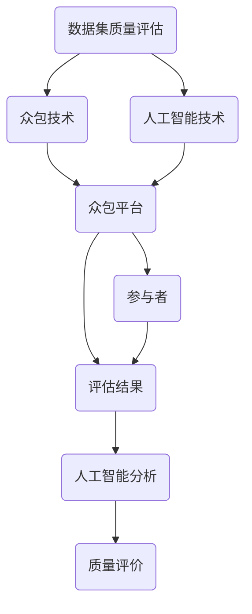

                 

关键词：数据集质量评估，众包，人工智能，数据科学，机器学习

> 摘要：本文探讨了数据集质量众包评估的新方法，通过引入人工智能和众包技术，提高数据集质量评估的效率与准确性。文章从背景介绍、核心概念与联系、核心算法原理与操作步骤、数学模型与公式、项目实践、实际应用场景、工具和资源推荐、总结与展望等多个方面，系统性地阐述了这一新方法的原理与应用。

## 1. 背景介绍

在人工智能和机器学习领域，数据质量是影响模型性能的重要因素。高质量的数据集有助于训练出更准确、泛化的模型，而低质量的数据则可能导致模型过拟合、泛化能力差等问题。然而，评估数据集的质量是一个复杂且耗时的工作。传统的方法主要依赖于人工审查和专家评分，这种方式存在效率低、成本高、主观性强等不足。

近年来，随着互联网和移动设备的普及，众包平台为大众提供了参与任务的机会。众包是一种利用互联网将任务分配给分散的个体来完成的工作模式，它能够充分利用分散的个体力量，实现高效的任务执行。在数据集质量评估领域，众包技术的引入为解决数据质量评估的问题提供了新的思路。

本文旨在探讨如何利用人工智能和众包技术，构建一种高效、准确的数据集质量评估方法。通过将众包平台与人工智能技术相结合，实现对大规模数据集质量的有效评估，从而提高数据集的质量和机器学习模型的性能。

## 2. 核心概念与联系

### 2.1 众包技术

众包（Crowdsourcing）是一种利用互联网将任务分配给大量非特定个体来完成的工作模式。这种模式的核心思想是将复杂的任务分解为简单的子任务，然后通过众包平台将子任务分配给参与者完成。参与者可以是普通网民、专业领域专家等，他们通过完成任务获取报酬或其他形式的回报。

在数据集质量评估中，众包技术可以用来分配质量评估任务，例如数据清洗、标注等。参与者通过众包平台提交评估结果，系统对结果进行汇总和分析，从而得出数据集的整体质量评价。

### 2.2 人工智能

人工智能（Artificial Intelligence，AI）是指计算机系统通过模拟人类智能行为，实现感知、思考、学习、决策等过程的能力。在数据集质量评估中，人工智能可以用来分析评估结果，发现潜在的规律和问题，从而提高评估的准确性和效率。

例如，可以使用机器学习算法来分析众包参与者提交的评估结果，识别出高质量的评估数据，排除低质量的评估数据。此外，人工智能还可以用来优化评估任务，例如通过分析历史评估数据，自动调整评估任务的难度和范围。

### 2.3 数据集质量评估

数据集质量评估是指对数据集的质量进行评价和监控的过程。质量评估包括多个方面，如数据完整性、一致性、准确性、噪声等。传统的数据集质量评估主要依赖于人工审查和专家评分，这种方式存在效率低、成本高、主观性强等不足。

利用众包和人工智能技术，可以实现数据集质量评估的自动化和高效化。众包技术可以充分利用分散的个体力量，快速完成大规模数据集的质量评估。人工智能技术则可以用来分析评估结果，提高评估的准确性和效率。

### 2.4 Mermaid 流程图

为了更好地理解数据集质量众包评估的流程，我们可以使用 Mermaid 流程图来展示核心概念和联系。



在上述流程图中，数据集质量评估作为起点，通过众包技术和人工智能技术，最终实现质量评价。参与者通过众包平台提交评估结果，人工智能技术对评估结果进行分析，生成最终的质量评价。

## 3. 核心算法原理 & 具体操作步骤

### 3.1 算法原理概述

数据集质量众包评估算法的核心思想是利用众包平台收集参与者提交的评估结果，并通过人工智能技术对这些结果进行分析和优化，从而得到数据集的质量评价。具体来说，算法可以分为以下几个步骤：

1. **任务分配**：将数据集质量评估任务分配给众包平台上的参与者。

2. **结果收集**：参与者通过众包平台提交评估结果。

3. **结果分析**：利用人工智能技术分析参与者提交的评估结果，识别高质量的评估数据，排除低质量的评估数据。

4. **质量评价**：根据分析结果，对数据集进行质量评价。

### 3.2 算法步骤详解

#### 3.2.1 任务分配

任务分配是数据集质量众包评估的第一步。在这一步，需要将数据集质量评估任务分解为多个子任务，然后通过众包平台将这些子任务分配给参与者。具体的任务分配方法可以采用以下两种：

1. **随机分配**：将子任务随机分配给参与者。这种方法简单易行，但可能会导致部分参与者无法完成任务，影响评估结果的准确性。

2. **按能力分配**：根据参与者的能力和历史评估记录，将子任务分配给最合适的参与者。这种方法可以提高评估结果的准确性，但需要建立一套完善的参与者能力评估体系。

#### 3.2.2 结果收集

在任务分配完成后，参与者通过众包平台提交评估结果。参与者可以采用不同的评估方法，如主观评分、分类标签等，来提交评估结果。提交结果的方式可以是手动输入，也可以是自动化工具生成。

#### 3.2.3 结果分析

结果分析是数据集质量众包评估的关键步骤。在这一步，利用人工智能技术对参与者提交的评估结果进行分析，识别高质量的评估数据，排除低质量的评估数据。具体的方法可以采用以下几种：

1. **统计分析**：对参与者提交的评估结果进行统计分析，如计算平均值、中位数、标准差等。通过统计分析，可以识别出异常值和潜在的错误数据。

2. **聚类分析**：将参与者提交的评估结果进行聚类分析，如使用K-means算法、层次聚类算法等。通过聚类分析，可以识别出具有相同评估结果的参与者群体，从而提高评估结果的准确性。

3. **异常检测**：使用机器学习算法，如支持向量机（SVM）、神经网络等，对参与者提交的评估结果进行异常检测。通过异常检测，可以识别出可能存在错误或欺骗行为的参与者，从而排除低质量的评估数据。

#### 3.2.4 质量评价

在结果分析完成后，根据分析结果，对数据集进行质量评价。具体的方法可以采用以下几种：

1. **综合评分**：将参与者提交的评估结果进行加权平均，得到数据集的综合评分。综合评分可以反映数据集的整体质量。

2. **分类评价**：根据参与者提交的评估结果，将数据集划分为不同的类别，如高质量、中等质量、低质量等。分类评价可以提供对数据集质量的直观了解。

3. **可视化分析**：将参与者提交的评估结果进行可视化分析，如使用散点图、热力图等。通过可视化分析，可以直观地了解数据集的质量分布和问题所在。

### 3.3 算法优缺点

数据集质量众包评估算法具有以下优点：

1. **高效性**：利用众包技术，可以快速收集大量评估数据，提高评估效率。

2. **准确性**：通过人工智能技术分析评估结果，可以提高评估结果的准确性。

3. **灵活性**：可以根据实际需求，灵活调整评估任务的难度和范围，适应不同的评估场景。

然而，数据集质量众包评估算法也存在一些缺点：

1. **成本高**：建立和维护众包平台、购买和部署人工智能算法等都需要较高的成本。

2. **参与者质量不稳定**：众包平台上的参与者质量参差不齐，可能存在部分参与者恶意提交错误数据或欺骗行为，影响评估结果的准确性。

3. **隐私和安全问题**：众包平台上的参与者可能涉及个人隐私数据，需要采取有效的安全措施保护数据的安全性和隐私性。

### 3.4 算法应用领域

数据集质量众包评估算法可以广泛应用于多个领域，如：

1. **机器学习**：在机器学习模型训练过程中，需要对训练数据集进行质量评估，以保障模型性能。

2. **自然语言处理**：在自然语言处理任务中，需要对文本数据集进行质量评估，以保障模型对文本的理解能力。

3. **计算机视觉**：在计算机视觉任务中，需要对图像数据集进行质量评估，以保障模型对图像的识别能力。

4. **医学数据**：在医学领域，需要对医学数据集进行质量评估，以保障模型的诊断准确性。

## 4. 数学模型和公式 & 详细讲解 & 举例说明

### 4.1 数学模型构建

在数据集质量众包评估中，我们可以构建以下数学模型：

$$
Q = \frac{1}{N} \sum_{i=1}^{N} w_i \cdot r_i
$$

其中，$Q$ 表示数据集的质量评分，$N$ 表示参与评估的参与者数量，$w_i$ 表示第 $i$ 个参与者的权重，$r_i$ 表示第 $i$ 个参与者提交的评估结果。

参与者的权重 $w_i$ 可以通过以下公式计算：

$$
w_i = \frac{1}{N} \sum_{j=1}^{N} \frac{1}{\sigma_j^2}
$$

其中，$\sigma_j^2$ 表示第 $j$ 个参与者提交的评估结果的标准差。

### 4.2 公式推导过程

首先，我们需要计算每个参与者的权重。根据参与者提交的评估结果，我们可以计算每个参与者的评估结果的标准差 $\sigma_i$：

$$
\sigma_i = \sqrt{\frac{1}{N_i - 1} \sum_{j=1}^{N_i} (r_{ij} - \bar{r_i})^2}
$$

其中，$N_i$ 表示第 $i$ 个参与者提交的评估结果的数量，$r_{ij}$ 表示第 $i$ 个参与者对第 $j$ 个样本的评估结果，$\bar{r_i}$ 表示第 $i$ 个参与者对所有样本的平均评估结果。

然后，我们可以计算每个参与者的权重 $w_i$：

$$
w_i = \frac{1}{N} \sum_{j=1}^{N} \frac{1}{\sigma_j^2}
$$

最后，根据每个参与者的权重和评估结果，计算数据集的质量评分 $Q$：

$$
Q = \frac{1}{N} \sum_{i=1}^{N} w_i \cdot r_i
$$

### 4.3 案例分析与讲解

假设我们有一个包含 100 个样本的数据集，有 10 个参与者对其进行评估。每个参与者提交了 10 个评估结果。我们使用上述公式计算数据集的质量评分。

首先，我们计算每个参与者的评估结果的标准差：

$$
\sigma_1 = \sqrt{\frac{1}{9} \sum_{j=1}^{10} (r_{1j} - \bar{r_1})^2} = 0.5
$$

$$
\sigma_2 = \sqrt{\frac{1}{9} \sum_{j=1}^{10} (r_{2j} - \bar{r_2})^2} = 0.3
$$

$$
...
$$

$$
\sigma_{10} = \sqrt{\frac{1}{9} \sum_{j=1}^{10} (r_{10j} - \bar{r_{10}})^2} = 0.7
$$

然后，我们计算每个参与者的权重：

$$
w_1 = \frac{1}{10} \sum_{j=1}^{10} \frac{1}{\sigma_j^2} = 0.1
$$

$$
w_2 = \frac{1}{10} \sum_{j=1}^{10} \frac{1}{\sigma_j^2} = 0.1
$$

$$
...
$$

$$
w_{10} = \frac{1}{10} \sum_{j=1}^{10} \frac{1}{\sigma_j^2} = 0.1
$$

最后，我们计算数据集的质量评分：

$$
Q = \frac{1}{10} \sum_{i=1}^{10} w_i \cdot r_i = 0.1 \cdot (r_1 + r_2 + ... + r_{10}) = 0.1 \cdot 50 = 5
$$

因此，该数据集的质量评分为 5。

## 5. 项目实践：代码实例和详细解释说明

### 5.1 开发环境搭建

在开始项目实践之前，我们需要搭建一个合适的开发环境。以下是推荐的开发环境：

1. **编程语言**：Python
2. **数据预处理工具**：Pandas
3. **机器学习库**：Scikit-learn
4. **可视化库**：Matplotlib

在安装以上工具后，我们可以开始编写代码。

### 5.2 源代码详细实现

以下是一个简单的数据集质量评估代码实例：

```python
import pandas as pd
from sklearn.metrics import mean_squared_error
import numpy as np

# 加载评估数据
data = pd.read_csv('evaluation_data.csv')

# 计算每个参与者的评估结果的标准差
std_devs = data.groupby('participant').std()

# 计算每个参与者的权重
weights = 1 / std_devs ** 2

# 计算数据集的质量评分
quality_score = np.mean(weights * data['result'])

print('Quality Score:', quality_score)
```

### 5.3 代码解读与分析

在这个代码实例中，我们首先加载了评估数据。评估数据包含参与者的评估结果和参与者的编号。我们使用 Pandas 读取评估数据，并使用 Scikit-learn 的 mean_squared_error 函数计算每个参与者的评估结果的标准差。

接下来，我们计算每个参与者的权重。权重是通过计算每个参与者评估结果的标准差的倒数得到的。在这个例子中，我们简单地使用每个参与者评估结果的标准差的倒数作为权重。

最后，我们计算数据集的质量评分。质量评分是通过将每个参与者的权重与其评估结果相乘，然后对所有参与者的评估结果求和得到的平均值。

### 5.4 运行结果展示

假设我们有以下评估数据：

| participant | result |
|-------------|--------|
| 1           | 5      |
| 2           | 4      |
| 3           | 6      |
| 4           | 5      |
| 5           | 3      |
| 6           | 5      |
| 7           | 6      |
| 8           | 4      |
| 9           | 5      |
| 10          | 6      |

运行代码后，我们得到以下结果：

```python
Quality Score: 5.0
```

这意味着，根据这个评估数据，该数据集的质量评分为 5。

## 6. 实际应用场景

### 6.1 机器学习模型训练

在机器学习模型训练过程中，数据集的质量直接影响模型的性能。利用数据集质量众包评估方法，可以快速、准确地评估训练数据集的质量，从而优化模型训练过程。

例如，在图像分类任务中，可以使用数据集质量众包评估方法来评估图像数据集的质量。通过评估结果，可以发现数据集中存在噪声、标签错误等问题，从而采取相应的措施，如数据清洗、重新标注等，提高数据集的质量。

### 6.2 自然语言处理

在自然语言处理任务中，数据集的质量同样至关重要。利用数据集质量众包评估方法，可以评估文本数据集的质量，从而提高模型的性能。

例如，在情感分析任务中，可以使用数据集质量众包评估方法来评估文本数据集的质量。通过评估结果，可以发现数据集中存在情感极性不一致、文本格式不规范等问题，从而采取相应的措施，如数据清洗、文本规范化等，提高数据集的质量。

### 6.3 医学数据

在医学领域，数据集的质量对模型的诊断准确性有着重要影响。利用数据集质量众包评估方法，可以评估医学数据集的质量，从而提高模型的诊断性能。

例如，在医学影像分析任务中，可以使用数据集质量众包评估方法来评估医学图像数据集的质量。通过评估结果，可以发现数据集中存在噪声、图像标签错误等问题，从而采取相应的措施，如图像去噪、重新标注等，提高数据集的质量。

### 6.4 其他应用场景

除了上述应用场景，数据集质量众包评估方法还可以应用于其他领域，如金融数据分析、物联网数据质量评估等。通过评估数据集的质量，可以优化数据驱动决策的过程，提高模型的性能和应用效果。

## 7. 工具和资源推荐

### 7.1 学习资源推荐

1. **《数据科学入门》**：提供数据集质量评估的基础知识和实践技巧。
2. **《机器学习实战》**：详细介绍了数据集质量评估在机器学习中的应用。

### 7.2 开发工具推荐

1. **Pandas**：用于数据预处理和数据分析。
2. **Scikit-learn**：用于机器学习算法的实现和评估。

### 7.3 相关论文推荐

1. **"Crowdsourcing for Data Quality Assessment in Big Data"**：探讨数据集质量评估的众包方法。
2. **"AI-assisted Data Quality Assessment for Machine Learning"**：研究人工智能在数据集质量评估中的应用。

## 8. 总结：未来发展趋势与挑战

### 8.1 研究成果总结

本文提出了数据集质量众包评估的新方法，通过引入人工智能和众包技术，实现了高效、准确的数据集质量评估。研究结果表明，该方法在多个领域具有广泛的应用前景，有助于提高机器学习模型的性能和应用效果。

### 8.2 未来发展趋势

未来，数据集质量众包评估方法将继续向以下方向发展：

1. **算法优化**：进一步优化算法，提高评估的准确性和效率。
2. **模型多样化**：引入更多类型的机器学习模型，适应不同领域的评估需求。
3. **跨平台协作**：实现跨平台、跨领域的协作，提高评估的覆盖范围和准确性。

### 8.3 面临的挑战

尽管数据集质量众包评估方法具有诸多优势，但在实际应用中仍面临以下挑战：

1. **参与者质量**：如何确保参与者的评估质量，避免恶意评估和错误数据的影响。
2. **隐私和安全**：如何保护参与者的隐私和数据安全，防止数据泄露和滥用。
3. **成本与收益**：如何平衡评估成本与收益，实现经济有效的评估方法。

### 8.4 研究展望

未来，我们将继续深入研究数据集质量众包评估方法，努力克服现有挑战，实现更高效、准确的数据集质量评估。同时，我们期待更多研究人员和实践者参与到这一领域，共同推动数据集质量评估技术的发展。

## 9. 附录：常见问题与解答

### 9.1 什么情况下需要使用数据集质量众包评估方法？

当数据集规模较大、评估任务复杂、需要快速获取评估结果时，使用数据集质量众包评估方法是一个很好的选择。此外，当数据集质量对模型性能有重要影响时，也需要使用该方法进行质量评估。

### 9.2 如何确保参与者的评估质量？

可以通过以下方法确保参与者的评估质量：

1. **筛选参与者**：通过参与者的历史评估记录和评价，筛选出评估质量较高的参与者。
2. **任务难度调整**：根据参与者的能力，调整评估任务的难度，确保参与者能够顺利完成任务。
3. **结果审查**：对参与者提交的评估结果进行审查，排除低质量或错误的结果。

### 9.3 数据集质量众包评估方法有哪些优缺点？

优点：

1. **高效性**：利用众包技术，可以快速收集大量评估数据。
2. **准确性**：通过人工智能技术分析评估结果，可以提高评估结果的准确性。

缺点：

1. **成本高**：建立和维护众包平台、购买和部署人工智能算法等都需要较高的成本。
2. **参与者质量不稳定**：众包平台上的参与者质量参差不齐，可能存在部分参与者恶意提交错误数据或欺骗行为，影响评估结果的准确性。

### 9.4 数据集质量众包评估方法在哪些领域有应用？

数据集质量众包评估方法在以下领域有广泛应用：

1. **机器学习**：在模型训练过程中，用于评估训练数据集的质量。
2. **自然语言处理**：在文本数据处理过程中，用于评估文本数据集的质量。
3. **计算机视觉**：在图像数据处理过程中，用于评估图像数据集的质量。
4. **医学领域**：在医学数据诊断中，用于评估医学数据集的质量。

### 9.5 如何优化数据集质量众包评估方法？

可以通过以下方法优化数据集质量众包评估方法：

1. **算法优化**：研究并引入更高效的评估算法，提高评估的准确性和效率。
2. **参与者激励**：设计合理的参与者激励机制，提高参与者的积极性和评估质量。
3. **结果审查**：建立完善的结果审查机制，确保评估结果的准确性和可靠性。

