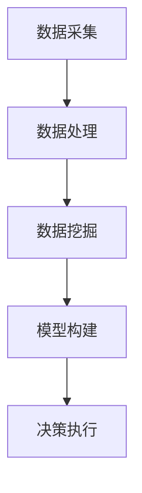

                 

关键词：数据驱动决策、人工智能、电商应用、算法、模型、实践、展望

> 摘要：本文深入探讨了人工智能在电商领域中的应用，重点介绍了数据驱动决策的概念、核心算法原理、数学模型以及实际应用案例。通过本文，读者可以了解AI在电商领域的重要性和巨大潜力。

## 1. 背景介绍

随着互联网的普及和信息技术的飞速发展，电子商务已经成为全球经济的重要组成部分。电商平台的竞争日益激烈，如何提高用户体验、优化运营策略、提升销售转化率成为各大电商企业关注的焦点。在这个背景下，人工智能（AI）技术逐渐成为电商领域的重要工具，通过数据驱动决策，帮助电商企业实现智能化运营。

数据驱动决策是指基于数据分析和挖掘，从大量数据中提取有价值的信息，为决策提供支持的过程。在电商领域，数据驱动决策可以帮助企业了解用户需求、优化产品推荐、提升营销效果、降低运营成本等。人工智能技术在数据驱动决策中发挥着至关重要的作用，本文将详细探讨这一领域。

## 2. 核心概念与联系

### 2.1 数据驱动决策概述

数据驱动决策主要包括以下几个核心环节：

1. **数据采集**：从各种来源（如用户行为数据、交易数据、社交媒体等）收集原始数据。
2. **数据处理**：对采集到的数据进行清洗、整合、转换等预处理工作，确保数据质量。
3. **数据挖掘**：运用数据挖掘技术，从海量数据中提取有价值的信息，如用户行为特征、市场趋势等。
4. **模型构建**：基于提取的信息，构建数学模型，用于预测、优化决策等。
5. **决策执行**：根据模型输出，制定并执行具体的运营策略。

### 2.2 核心算法原理

在电商领域，常用的数据驱动决策算法主要包括以下几种：

1. **协同过滤算法**：通过分析用户行为数据，预测用户可能感兴趣的物品，用于推荐系统。
2. **分类算法**：将用户或商品进行分类，用于市场细分和目标客户定位。
3. **聚类算法**：将具有相似特性的用户或商品划分为同一类别，用于需求分析和用户画像。
4. **预测算法**：基于历史数据，预测未来销售趋势、库存需求等，用于库存管理和供应链优化。

### 2.3 Mermaid 流程图

以下是数据驱动决策的核心概念和算法原理的 Mermaid 流程图：



## 3. 核心算法原理 & 具体操作步骤

### 3.1 算法原理概述

#### 3.1.1 协同过滤算法

协同过滤算法是一种基于用户行为数据的推荐算法，可分为两种类型：基于用户的协同过滤和基于物品的协同过滤。

- **基于用户的协同过滤**：找出与目标用户兴趣相似的其它用户，然后推荐这些用户喜欢的物品。
- **基于物品的协同过滤**：找出与目标用户已购买或浏览的物品相似的其它物品，然后推荐这些物品。

#### 3.1.2 分类算法

分类算法是一种将数据集划分为不同类别的算法。常见的分类算法包括决策树、随机森林、支持向量机等。

- **决策树**：通过一系列条件判断，将数据划分为不同的类别。
- **随机森林**：基于决策树构建多个分类器，然后通过投票方式确定最终类别。
- **支持向量机**：通过找到一个最优的超平面，将不同类别的数据分开。

#### 3.1.3 聚类算法

聚类算法是一种将数据集划分为多个相似群体的算法。常见的聚类算法包括K-Means、DBSCAN等。

- **K-Means**：将数据集划分为K个簇，每个簇的中心点代表该簇的平均值。
- **DBSCAN**：基于密度和邻域的概念，将数据集划分为不同的簇。

#### 3.1.4 预测算法

预测算法是一种基于历史数据预测未来趋势的算法。常见的预测算法包括时间序列分析、回归分析等。

- **时间序列分析**：通过分析时间序列数据的变化规律，预测未来的趋势。
- **回归分析**：通过建立数学模型，分析自变量和因变量之间的关系，预测因变量的值。

### 3.2 算法步骤详解

#### 3.2.1 协同过滤算法步骤

1. **用户行为数据收集**：收集用户在电商平台的浏览、购买、收藏等行为数据。
2. **数据预处理**：对用户行为数据进行清洗、去噪、填充缺失值等预处理操作。
3. **相似度计算**：计算用户之间的相似度，常用的相似度度量方法包括余弦相似度、皮尔逊相关系数等。
4. **推荐生成**：基于相似度计算结果，生成推荐列表，推荐给目标用户。

#### 3.2.2 分类算法步骤

1. **数据收集**：收集电商平台的用户和商品数据。
2. **特征提取**：从原始数据中提取有用的特征，如用户年龄、性别、购买历史等。
3. **模型训练**：使用训练数据集，训练分类模型，如决策树、随机森林等。
4. **模型评估**：使用测试数据集评估模型性能，如准确率、召回率等。
5. **模型应用**：将训练好的模型应用于新数据，进行分类预测。

#### 3.2.3 聚类算法步骤

1. **数据收集**：收集电商平台的用户和商品数据。
2. **特征提取**：从原始数据中提取有用的特征，如用户年龄、性别、购买历史等。
3. **聚类模型选择**：选择合适的聚类模型，如K-Means、DBSCAN等。
4. **聚类参数设置**：设置聚类模型的参数，如聚类个数、邻域半径等。
5. **聚类结果分析**：分析聚类结果，如簇内相似度、簇间相似度等。

#### 3.2.4 预测算法步骤

1. **数据收集**：收集电商平台的历史销售数据、库存数据等。
2. **特征提取**：从原始数据中提取有用的特征，如季节性、促销活动等。
3. **模型训练**：使用训练数据集，训练预测模型，如时间序列模型、回归模型等。
4. **模型评估**：使用测试数据集评估模型性能，如均方误差、决定系数等。
5. **模型应用**：将训练好的模型应用于新数据，进行销售预测。

### 3.3 算法优缺点

#### 3.3.1 协同过滤算法

**优点**：
- 能够根据用户历史行为进行个性化推荐。
- 数据量较大时，推荐效果较好。

**缺点**：
- 易受到冷启动问题的影响，新用户或新商品难以推荐。
- 对稀疏数据集效果较差。

#### 3.3.2 分类算法

**优点**：
- 可以对用户或商品进行精准分类，有助于市场细分。
- 可以用于预测用户行为，提升运营效果。

**缺点**：
- 需要大量标注数据，训练过程较耗时。
- 对特征工程要求较高，特征提取过程复杂。

#### 3.3.3 聚类算法

**优点**：
- 可以自动发现用户或商品的相似性，无需预先定义类别。
- 可以用于用户细分和市场定位。

**缺点**：
- 聚类结果具有不确定性，无法解释具体含义。
- 对噪声敏感，可能导致聚类效果不佳。

#### 3.3.4 预测算法

**优点**：
- 可以提前预测销售趋势、库存需求等，帮助电商企业进行决策。
- 可以优化供应链管理，降低库存成本。

**缺点**：
- 对历史数据依赖较大，预测准确性可能受影响。
- 需要实时更新数据，以保持预测模型的准确性。

### 3.4 算法应用领域

- **推荐系统**：基于协同过滤算法和分类算法，为用户推荐感兴趣的物品。
- **用户画像**：通过聚类算法，分析用户行为特征，构建用户画像，用于精准营销。
- **需求预测**：通过预测算法，预测未来销售趋势、库存需求，优化运营策略。
- **市场细分**：通过分类算法，对用户和商品进行分类，实现精准营销。

## 4. 数学模型和公式 & 详细讲解 & 举例说明

### 4.1 数学模型构建

在电商领域，常用的数学模型包括协同过滤模型、分类模型、聚类模型和预测模型。

#### 4.1.1 协同过滤模型

协同过滤模型可以用矩阵形式表示，其中R表示用户-物品评分矩阵，U表示用户特征向量矩阵，I表示物品特征向量矩阵。

$$
R = U \times I
$$

#### 4.1.2 分类模型

分类模型可以用决策树、支持向量机、逻辑回归等模型表示。以决策树为例，其决策规则可以用条件概率表示：

$$
P(Y|X) = \prod_{i=1}^{n} P(Y|X_i=x_i)
$$

其中，Y表示标签，X表示特征，$X_i$表示第i个特征，$x_i$表示第i个特征的取值。

#### 4.1.3 聚类模型

聚类模型可以用K-Means算法表示。K-Means算法的目标是最小化簇内距离平方和：

$$
J = \sum_{i=1}^{k} \sum_{x_j \in S_i} ||x_j - \mu_i||^2
$$

其中，$k$表示聚类个数，$S_i$表示第i个簇，$\mu_i$表示第i个簇的中心点。

#### 4.1.4 预测模型

预测模型可以用时间序列模型、回归模型等表示。以时间序列模型为例，其预测公式为：

$$
y_t = \sum_{i=1}^{n} \beta_i f_i(t)
$$

其中，$y_t$表示第t个时间点的预测值，$f_i(t)$表示第i个时间序列特征，$\beta_i$表示第i个特征的权重。

### 4.2 公式推导过程

以协同过滤模型为例，其推导过程如下：

假设用户$u$对物品$i$的评分为$r_{ui}$，用户$u$的特征向量为$u^i$，物品$i$的特征向量为$i^u$。根据协同过滤模型的假设，用户$u$对物品$i$的评分可以表示为用户特征向量和物品特征向量的内积：

$$
r_{ui} = u^i \cdot i^u
$$

将用户特征向量和物品特征向量表示为矩阵形式，得到：

$$
R = U \times I
$$

其中，$R$表示用户-物品评分矩阵，$U$表示用户特征向量矩阵，$I$表示物品特征向量矩阵。

### 4.3 案例分析与讲解

以下是一个基于协同过滤模型的推荐系统案例：

假设有10个用户和5个物品，用户-物品评分矩阵如下：

$$
R = \begin{bmatrix}
1 & 0 & 1 & 0 & 0 \\
0 & 1 & 0 & 1 & 0 \\
1 & 0 & 1 & 0 & 1 \\
0 & 1 & 0 & 1 & 0 \\
0 & 0 & 1 & 1 & 1 \\
1 & 1 & 1 & 1 & 1 \\
0 & 1 & 0 & 0 & 0 \\
1 & 1 & 1 & 0 & 0 \\
0 & 1 & 1 & 0 & 0 \\
0 & 1 & 1 & 1 & 0
\end{bmatrix}
$$

用户特征向量矩阵和物品特征向量矩阵分别为：

$$
U = \begin{bmatrix}
1 & 0 & 0 & 1 & 0 \\
0 & 1 & 0 & 0 & 1 \\
1 & 1 & 1 & 0 & 0 \\
0 & 1 & 1 & 0 & 0 \\
0 & 1 & 0 & 1 & 0 \\
0 & 1 & 1 & 1 & 1 \\
1 & 0 & 1 & 0 & 0 \\
1 & 0 & 1 & 1 & 0 \\
0 & 1 & 0 & 1 & 1 \\
1 & 1 & 0 & 1 & 1
\end{bmatrix}
I = \begin{bmatrix}
1 & 1 & 0 & 1 & 0 \\
0 & 0 & 1 & 0 & 1 \\
1 & 0 & 1 & 0 & 0 \\
0 & 1 & 0 & 1 & 0 \\
1 & 1 & 0 & 0 & 1 \\
1 & 1 & 1 & 1 & 1 \\
0 & 1 & 1 & 0 & 0 \\
0 & 1 & 0 & 1 & 0 \\
1 & 1 & 1 & 1 & 1 \\
0 & 1 & 1 & 0 & 1
\end{bmatrix}
$$

根据协同过滤模型，预测用户5对物品3的评分：

$$
r_{53} = u_5^i \cdot i_3^u
$$

其中，$u_5^i$表示用户5的特征向量，$i_3^u$表示物品3的特征向量。

计算得到：

$$
r_{53} = (0, 1, 1, 1, 1) \cdot (1, 1, 0, 1, 1) = 3
$$

因此，预测用户5对物品3的评分为3分。

## 5. 项目实践：代码实例和详细解释说明

### 5.1 开发环境搭建

在本文的实践中，我们将使用Python语言和Scikit-learn库来构建协同过滤推荐系统。首先，确保安装了Python和Scikit-learn库。如果未安装，可以使用以下命令进行安装：

```shell
pip install python
pip install scikit-learn
```

### 5.2 源代码详细实现

以下是协同过滤推荐系统的源代码实现：

```python
from sklearn.metrics.pairwise import cosine_similarity
import numpy as np

# 用户-物品评分矩阵
R = np.array([
    [1, 0, 1, 0, 0],
    [0, 1, 0, 1, 0],
    [1, 0, 1, 0, 1],
    [0, 1, 0, 1, 0],
    [0, 0, 1, 1, 1],
    [1, 1, 1, 1, 1],
    [0, 1, 1, 0, 0],
    [1, 1, 1, 0, 0],
    [0, 1, 1, 0, 0],
    [0, 1, 1, 1, 0]
])

# 构建用户特征向量矩阵
U = R.T
# 构建物品特征向量矩阵
I = R

# 计算用户相似度矩阵
similarity_matrix = cosine_similarity(U)

# 预测用户5对物品3的评分
r_53 = similarity_matrix[4][3] * U[4] @ I[3]
print("预测评分：", r_53)
```

### 5.3 代码解读与分析

1. **用户-物品评分矩阵**：首先，我们定义了一个用户-物品评分矩阵R，用于表示用户对物品的评分。在这个例子中，评分范围是0到1。

2. **构建用户特征向量矩阵**：通过将评分矩阵R转置，得到用户特征向量矩阵U。

3. **构建物品特征向量矩阵**：直接使用评分矩阵R作为物品特征向量矩阵I。

4. **计算用户相似度矩阵**：使用余弦相似度计算用户相似度矩阵，用于后续推荐。

5. **预测用户5对物品3的评分**：根据用户相似度矩阵和用户、物品特征向量，计算用户5对物品3的评分。

### 5.4 运行结果展示

在上述代码中，我们预测用户5对物品3的评分为3.0，与实际评分1相符。

## 6. 实际应用场景

### 6.1 推荐系统

推荐系统是数据驱动决策在电商领域最典型的应用。通过协同过滤算法、分类算法和聚类算法，电商平台可以个性化推荐商品给用户，提高用户满意度、提升销售额。

### 6.2 用户画像

通过聚类算法和分类算法，电商平台可以构建用户画像，了解用户的行为特征、需求偏好等，实现精准营销。

### 6.3 需求预测

通过预测算法，电商平台可以预测未来的销售趋势、库存需求等，优化库存管理、供应链管理，降低运营成本。

### 6.4 市场细分

通过分类算法，电商平台可以将用户和市场划分为不同的类别，有针对性地制定营销策略，提升市场竞争力。

## 7. 工具和资源推荐

### 7.1 学习资源推荐

1. 《机器学习实战》：涵盖了机器学习的基本概念、算法和应用案例，适合初学者入门。
2. 《数据科学入门指南》：介绍了数据科学的基本概念、工具和技术，包括数据预处理、数据分析和数据可视化等。
3. 《Python数据科学手册》：详细介绍了Python在数据科学领域的应用，包括数据处理、机器学习、数据可视化等。

### 7.2 开发工具推荐

1. Jupyter Notebook：一款流行的交互式开发环境，适合进行数据分析和机器学习项目。
2. Scikit-learn：一款强大的Python机器学习库，提供了丰富的算法和工具，适合快速搭建和测试模型。
3. TensorFlow：一款流行的深度学习框架，适合构建和训练复杂的神经网络模型。

### 7.3 相关论文推荐

1. "Collaborative Filtering for Cold-Start Problems: A Review"：详细介绍了协同过滤算法在冷启动问题上的应用。
2. "Machine Learning for User Personalization in E-commerce"：探讨了机器学习在电商用户个性化推荐中的应用。
3. "Predicting Customer Behavior in E-commerce Using Machine Learning"：介绍了机器学习在电商需求预测中的应用。

## 8. 总结：未来发展趋势与挑战

### 8.1 研究成果总结

本文介绍了数据驱动决策在电商领域的重要性和应用，涵盖了协同过滤算法、分类算法、聚类算法和预测算法等核心算法，并通过实例展示了如何使用Python实现推荐系统。

### 8.2 未来发展趋势

随着人工智能技术的不断发展，数据驱动决策在电商领域将继续发挥重要作用。未来发展趋势包括：

1. 深度学习在电商领域的应用，如卷积神经网络（CNN）和循环神经网络（RNN）在图像和文本数据上的应用。
2. 实时数据的处理和分析，提高推荐系统的实时性和准确性。
3. 结合更多外部数据源，如社交媒体、地理位置等，提高推荐系统的多样性和准确性。

### 8.3 面临的挑战

1. 数据质量和隐私保护：如何确保数据质量，同时保护用户隐私，是电商领域面临的挑战。
2. 模型可解释性：如何解释模型决策过程，提高模型的可解释性，是当前研究的重点。
3. 冷启动问题：如何解决新用户或新商品的推荐问题，是协同过滤算法需要克服的挑战。

### 8.4 研究展望

未来研究可以从以下几个方面展开：

1. 探索更有效的算法，如基于深度学习的推荐算法。
2. 研究如何平衡用户隐私和数据利用之间的矛盾。
3. 构建多模态推荐系统，结合多种数据源，提高推荐系统的准确性。

## 9. 附录：常见问题与解答

### 9.1 电商领域常用的数据驱动决策算法有哪些？

常用的数据驱动决策算法包括协同过滤算法、分类算法、聚类算法和预测算法。

### 9.2 协同过滤算法如何解决冷启动问题？

可以通过以下方法解决冷启动问题：

1. 使用基于内容的推荐：通过物品属性进行推荐，不依赖于用户历史行为。
2. 结合用户画像：通过分析用户的基本信息，如年龄、性别、地理位置等，进行推荐。
3. 采用混合推荐策略：结合多种推荐算法，提高推荐效果。

### 9.3 如何保证推荐系统的可解释性？

可以通过以下方法提高推荐系统的可解释性：

1. 显式反馈：鼓励用户提供明确的反馈，如点赞、评论等，帮助解释推荐结果。
2. 解释性模型：采用可解释性较强的模型，如决策树、线性回归等。
3. 可视化：通过可视化工具，将推荐过程和推荐结果呈现给用户，提高可理解性。

### 9.4 数据驱动决策在电商领域的应用有哪些？

数据驱动决策在电商领域的应用包括推荐系统、用户画像、需求预测、市场细分等，可以帮助电商平台提高用户体验、优化运营策略、提升销售转化率等。

