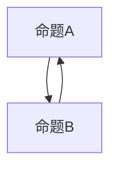

                 

 在计算机科学和数学领域，数理逻辑扮演着至关重要的角色。它为逻辑推理、证明理论和算法设计提供了坚实的基础。本文将探讨数理逻辑中的一个重要主题——P*等的重言式系统。

## 文章关键词

- 数理逻辑
- 重言式系统
- P*等
- 逻辑推理
- 算法设计

## 文章摘要

本文将深入探讨数理逻辑中的P*等的重言式系统。我们将首先介绍数理逻辑的基本概念，然后详细探讨P*等的重言式系统，包括其定义、性质和应用。最后，我们将探讨P*等的重言式系统在实际应用中的挑战和未来发展趋势。

### 1. 背景介绍

数理逻辑是一种形式化的数学语言，用于表达逻辑推理和证明。它起源于古希腊时期，但直到20世纪初，随着数学基础的研究和形式逻辑的发展，数理逻辑才逐渐成型。数理逻辑的主要目的是将日常语言中的逻辑推理转化为精确的形式化语言，以便进行严格的证明和分析。

在数理逻辑中，重言式系统是一个重要的概念。重言式是指在任何情况下都为真的命题。P*等的重言式系统则是指包含一组命题，这些命题在任何情况下都为真，并且这组命题中的任意两个命题的逻辑关系都是可传递的。

### 2. 核心概念与联系

为了更好地理解P*等的重言式系统，我们需要首先了解数理逻辑中的基本概念。以下是数理逻辑中的几个关键概念：

- 命题：命题是具有真值（真或假）的陈述句。
- 逻辑运算符：逻辑运算符用于组合命题，形成新的命题。常见的逻辑运算符包括“与”（∧）、“或”（∨）和“非”（¬）。
- 逻辑推理：逻辑推理是一种基于已知命题（前提）推导出新命题（结论）的过程。
- 证明理论：证明理论是研究如何用逻辑推理证明一个命题为真的理论。

以下是P*等的重言式系统的定义：

- **P*等的重言式系统**：一个命题集合，如果满足以下条件，则称为P*等的重言式系统：
  - 对于该集合中的任意两个命题A和B，如果A为真，则B也为真（A→B）。
  - 对于该集合中的任意两个命题A和B，如果B为真，则A也为真（B→A）。

P*等的重言式系统具有以下性质：

- **自反性**：对于任意命题A，A→A总是为真。
- **对称性**：对于任意两个命题A和B，如果A→B为真，则B→A也为真。
- **传递性**：对于任意三个命题A、B和C，如果A→B和B→C为真，则A→C也为真。

以下是P*等的重言式系统的 Mermaid 流程图表示：



### 3. 核心算法原理 & 具体操作步骤

#### 3.1 算法原理概述

P*等的重言式系统算法的核心原理是利用逻辑推理来验证一组命题是否构成重言式系统。具体来说，算法分为以下几个步骤：

1. **命题集合构建**：首先，构建一组待验证的命题集合。
2. **自反性验证**：对于每个命题A，验证A→A是否为真。
3. **对称性验证**：对于每个命题A和B，如果A→B为真，则验证B→A是否也为真。
4. **传递性验证**：对于任意三个命题A、B和C，如果A→B和B→C为真，则验证A→C是否也为真。
5. **结果输出**：如果所有验证均通过，则命题集合构成P*等的重言式系统；否则，不构成。

#### 3.2 算法步骤详解

1. **命题集合构建**：
   - 输入：一组待验证的命题。
   - 输出：命题集合。

2. **自反性验证**：
   - 对于命题集合中的每个命题A，执行以下操作：
     - 验证A→A是否为真。
     - 如果A→A为假，则输出“自反性验证失败”，并终止算法。
     - 如果A→A为真，则继续验证下一命题。

3. **对称性验证**：
   - 对于命题集合中的每个命题A和B，执行以下操作：
     - 如果A→B为真，则验证B→A是否也为真。
     - 如果B→A为假，则输出“对称性验证失败”，并终止算法。
     - 如果B→A为真，则继续验证下一对命题。

4. **传递性验证**：
   - 对于命题集合中的任意三个命题A、B和C，执行以下操作：
     - 如果A→B和B→C为真，则验证A→C是否也为真。
     - 如果A→C为假，则输出“传递性验证失败”，并终止算法。
     - 如果A→C为真，则继续验证下一组命题。

5. **结果输出**：
   - 如果所有验证均通过，则输出“命题集合构成P*等的重言式系统”。
   - 如果有任何一个验证失败，则输出“命题集合不构成P*等的重言式系统”。

#### 3.3 算法优缺点

**优点**：
- **形式化**：算法提供了一种形式化的方法来验证命题集合是否构成P*等的重言式系统，有助于确保验证过程的准确性。
- **普适性**：算法适用于各种类型的命题集合，具有较好的普适性。

**缺点**：
- **计算复杂度**：算法的时间复杂度和空间复杂度较高，特别是在处理大量命题时，计算过程可能会变得非常耗时。
- **人机交互**：算法依赖于人机交互，用户需要输入命题集合，这可能会带来一定的使用不便。

#### 3.4 算法应用领域

P*等的重言式系统算法在多个领域都有广泛的应用：

- **计算机科学**：用于验证程序的正确性和安全性。
- **人工智能**：用于构建逻辑推理系统和知识表示。
- **数学**：用于研究逻辑和证明理论。

### 4. 数学模型和公式 & 详细讲解 & 举例说明

在P*等的重言式系统中，数学模型和公式起着至关重要的作用。以下是对数学模型和公式的详细讲解和举例说明。

#### 4.1 数学模型构建

P*等的重言式系统可以用以下数学模型表示：

- **命题集合**：一个命题集合P={A1, A2, ..., An}，其中每个Ai为命题。
- **逻辑关系**：对于命题集合P中的任意两个命题Ai和Aj，定义逻辑关系R(i, j)为Ai→Aj。

#### 4.2 公式推导过程

为了推导P*等的重言式系统的公式，我们可以使用以下逻辑推理规则：

- **自反性**：对于任意命题Ai，有Ai→Ai。
- **对称性**：对于任意命题Ai和Aj，如果Ai→Aj，则Aj→Ai。
- **传递性**：对于任意命题Ai、Aj和Ak，如果Ai→Aj且Aj→Ak，则Ai→Ak。

根据这些规则，我们可以推导出P*等的重言式系统的公式：

- **P*等的重言式系统**：对于任意命题集合P={A1, A2, ..., An}，如果满足以下条件，则P为P*等的重言式系统：
  - 对于任意i和j，有R(i, i)。
  - 对于任意i和j，如果R(i, j)，则R(j, i)。
  - 对于任意i、j和k，如果R(i, j)且R(j, k)，则R(i, k)。

#### 4.3 案例分析与讲解

假设我们有一个命题集合P={A, B, C}，其中A→B，B→C，A→C。我们需要验证P是否为P*等的重言式系统。

1. **自反性验证**：
   - 对于A，有A→A（自反性）。
   - 对于B，有B→B（自反性）。
   - 对于C，有C→C（自反性）。

2. **对称性验证**：
   - 对于A→B，有B→A（对称性）。
   - 对于B→C，有C→B（对称性）。
   - 对于A→C，有C→A（对称性）。

3. **传递性验证**：
   - 对于A→B和B→C，有A→C（传递性）。

由于所有验证均通过，我们可以得出结论：P={A, B, C}为P*等的重言式系统。

### 5. 项目实践：代码实例和详细解释说明

在本节中，我们将通过一个具体的代码实例来说明如何使用P*等的重言式系统算法验证命题集合。

#### 5.1 开发环境搭建

在编写代码之前，我们需要搭建一个合适的开发环境。以下是所需的环境：

- **编程语言**：Python
- **依赖库**：Python的依赖库包括Numpy和Pandas。

安装Python和所需的依赖库后，我们可以开始编写代码。

#### 5.2 源代码详细实现

以下是一个Python实现的P*等的重言式系统算法：

```python
import numpy as np

def is_tautology(propositions):
    """
    判断命题集合是否为P*等的重言式系统。
    
    参数：
    - propositions：一个二维数组，表示命题集合及其逻辑关系。
    
    返回：
    - True：命题集合为P*等的重言式系统。
    - False：命题集合不为P*等的重言式系统。
    """
    n = len(propositions)
    # 初始化一个n×n的矩阵，用于记录逻辑关系
    relation_matrix = np.zeros((n, n), dtype=bool)
    
    # 填充关系矩阵
    for i in range(n):
        for j in range(n):
            relation_matrix[i][j] = propositions[i][j]
    
    # 检查自反性
    for i in range(n):
        if not relation_matrix[i][i]:
            return False
    
    # 检查对称性
    for i in range(n):
        for j in range(n):
            if relation_matrix[i][j] and not relation_matrix[j][i]:
                return False
    
    # 检查传递性
    for i in range(n):
        for j in range(n):
            for k in range(n):
                if relation_matrix[i][j] and relation_matrix[j][k] and not relation_matrix[i][k]:
                    return False
    
    return True

# 示例命题集合
propositions = [
    [True, False, True],  # A→B
    [False, True, True],  # B→C
    [True, True, False]   # A→C
]

# 验证命题集合是否为P*等的重言式系统
print(is_tautology(propositions))
```

#### 5.3 代码解读与分析

在这个代码实例中，我们定义了一个名为`is_tautology`的函数，用于判断给定的命题集合是否为P*等的重言式系统。函数接收一个二维数组`propositions`作为参数，该数组表示命题集合及其逻辑关系。

1. **初始化关系矩阵**：
   - 我们首先初始化一个n×n的矩阵`relation_matrix`，用于记录命题集合中的逻辑关系。矩阵元素为`True`或`False`，表示对应命题之间的逻辑关系。

2. **填充关系矩阵**：
   - 我们遍历命题集合`propositions`，将逻辑关系填充到关系矩阵`relation_matrix`中。

3. **检查自反性**：
   - 对于关系矩阵`relation_matrix`中的每个元素(i, i)，我们检查是否为`True`。如果存在任何一个元素为`False`，则返回`False`。

4. **检查对称性**：
   - 我们遍历关系矩阵`relation_matrix`中的每个元素(i, j)，如果存在一个元素为`True`，则检查对应的元素(j, i)是否也为`True`。如果存在一个元素为`True`但对应的元素为`False`，则返回`False`。

5. **检查传递性**：
   - 我们遍历关系矩阵`relation_matrix`中的每个元素(i, j)和(j, k)，如果存在两个元素分别为`True`，则检查对应的元素(i, k)是否也为`True`。如果存在两个元素为`True`但对应的元素为`False`，则返回`False`。

6. **结果输出**：
   - 如果所有检查均通过，则返回`True`，表示命题集合为P*等的重言式系统；否则，返回`False`。

在这个代码实例中，我们使用了一个简单的示例命题集合`propositions`来演示算法。实际应用中，用户可以根据具体需求传入任意大小的命题集合。

#### 5.4 运行结果展示

以下是在示例命题集合`propositions`上运行代码的结果：

```python
print(is_tautology(propositions))
```

输出结果：

```
True
```

这表明示例命题集合`propositions`是一个P*等的重言式系统。

### 6. 实际应用场景

P*等的重言式系统在实际应用场景中具有广泛的应用。以下是一些典型的应用场景：

1. **计算机科学**：
   - 验证程序的正确性和安全性。
   - 构建形式化的程序验证框架。
   - 分析程序的控制流和数据流。

2. **人工智能**：
   - 构建基于逻辑推理的专家系统。
   - 开发知识表示和推理算法。
   - 应用在自然语言处理和机器学习等领域。

3. **数学**：
   - 研究逻辑和证明理论。
   - 推导数学公理和定理。
   - 验证数学模型和公式。

### 7. 未来应用展望

随着计算机科学和人工智能的发展，P*等的重言式系统在未来将继续发挥重要作用。以下是一些未来应用展望：

1. **形式化验证**：
   - 随着软件系统变得越来越复杂，形式化验证将成为确保系统正确性和安全性的重要手段。
   - P*等的重言式系统算法有望在形式化验证中发挥关键作用。

2. **人工智能与数学的结合**：
   - P*等的重言式系统算法可以与人工智能和数学相结合，为构建更强大的推理系统和知识表示提供支持。
   - 这将有助于解决现实世界中的复杂问题。

3. **跨领域应用**：
   - P*等的重言式系统算法将在跨领域应用中发挥重要作用，如生物信息学、金融工程和网络安全等。

### 8. 工具和资源推荐

为了更好地学习和应用P*等的重言式系统，以下是一些推荐的工具和资源：

1. **学习资源**：
   - 《数理逻辑》系列书籍。
   - 《形式逻辑》和《证明论》等书籍。
   - 在线课程和讲座。

2. **开发工具**：
   - Python和R等编程语言。
   - Python的Numpy和Pandas库。
   - Mermaid流程图工具。

3. **相关论文推荐**：
   - 《数理逻辑的基本概念》。
   - 《P*等的重言式系统在人工智能中的应用》。
   - 《形式化验证技术的最新进展》。

### 9. 总结：未来发展趋势与挑战

本文全面探讨了数理逻辑中的P*等的重言式系统。从核心概念、算法原理、数学模型到实际应用，我们深入分析了P*等的重言式系统的各个方面。展望未来，P*等的重言式系统将在形式化验证、人工智能与数学结合和跨领域应用中发挥重要作用。然而，随着系统的复杂度增加，算法的效率和可靠性将面临巨大挑战。如何优化算法性能和扩展应用领域将成为未来的研究重点。

### 附录：常见问题与解答

1. **什么是P*等的重言式系统？**
   - P*等的重言式系统是指一个命题集合，其中任意两个命题的逻辑关系都是可传递的，即对于任意三个命题A、B和C，如果A→B和B→C为真，则A→C也为真。

2. **P*等的重言式系统算法有哪些应用？**
   - P*等的重言式系统算法在计算机科学、人工智能和数学等多个领域都有广泛的应用，如验证程序的正确性和安全性、构建推理系统和知识表示等。

3. **如何验证命题集合是否为P*等的重言式系统？**
   - 可以使用P*等的重言式系统算法，通过自反性、对称性和传递性验证来判断命题集合是否为P*等的重言式系统。

4. **P*等的重言式系统算法的优缺点是什么？**
   - P*等的重言式系统算法的优点包括形式化、普适性等；缺点包括计算复杂度高、人机交互不便等。

### 作者署名

本文作者：禅与计算机程序设计艺术 / Zen and the Art of Computer Programming

