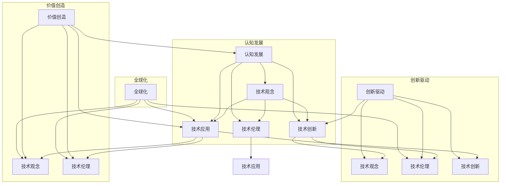

                 

### 摘要 Summary

在信息技术飞速发展的今天，技术的变革日新月异，而文化的力量在其中扮演了至关重要的角色。本文将探讨文化在提升认知、促进技术创新和创造价值方面的关键作用。通过深入分析技术文化与认知发展的关系，本文将揭示文化如何为技术进步提供精神动力，并在全球化的背景下，助力企业和社会实现可持续的创新发展。文章还将讨论文化对于技术人才的影响，如何通过培养文化素养来提升个人和团队的创新能力。最后，本文将对未来技术的发展趋势进行展望，强调文化在应对技术挑战中的重要性。

### 1. 背景介绍 Introduction

在当今社会，信息技术已成为推动社会进步的重要力量。从互联网、大数据、云计算到人工智能，技术的飞速发展带来了前所未有的变革。然而，技术的进步并非孤立存在，它与文化紧密相连，相互影响、共同发展。技术文化作为一种独特的社会文化现象，既反映了技术的内在逻辑，也影响了技术的应用与发展。

技术文化的形成深受社会文化背景的影响。在不同的文化背景下，人们对于技术的认知、态度和需求存在显著差异。例如，西方文化强调个体主义和竞争，这促使技术创新更加注重效率和实用性；而东方文化则强调集体主义和和谐，这使技术在推动社会福祉和可持续发展方面具有独特的优势。

技术文化的形成还与历史发展密切相关。历史上的每一次技术革命，都伴随着文化的变革。从工业革命到信息革命，技术的进步不仅改变了生产方式，也重塑了人们的生活方式和文化观念。因此，理解技术文化的发展历程，有助于我们更好地把握当前技术发展的趋势。

本文旨在通过探讨技术文化对认知发展、技术创新和价值创造的影响，揭示文化在信息技术领域的关键作用。文章首先分析技术文化的核心概念和基本特征，然后深入探讨技术文化与认知发展的关系，以及文化在技术创新和价值创造中的作用。此外，本文还将讨论技术人才的文化素养培养，以及文化在全球化背景下的影响。最后，本文将对未来技术的发展趋势进行展望，强调文化在应对技术挑战中的重要性。

### 2. 核心概念与联系 Core Concepts and Connections

在探讨技术文化的核心概念之前，有必要先明确一些基本概念。技术文化，可以理解为在技术活动中形成和发展的文化现象，它既包括技术本身，也涵盖与之相关的价值观、行为规范和社会制度。技术文化的核心概念主要包括技术观念、技术伦理、技术创新和技术应用。

#### 技术观念

技术观念是指人们对于技术的基本看法和认知。在不同的文化背景下，技术观念存在显著差异。例如，西方文化强调技术的效率和实用性，追求技术创新和突破；而东方文化则强调技术的和谐与可持续发展，注重技术与自然的共生关系。这种文化差异在技术发展的路径和策略上有着深刻的体现。

#### 技术伦理

技术伦理是技术文化的重要组成部分，它涉及技术的设计、应用和影响。技术伦理关注的是技术对社会、环境和伦理道德的潜在影响。例如，人工智能的发展引发了关于隐私、安全和道德责任等问题的广泛讨论。技术伦理的考量不仅关乎技术的合法性，更关乎技术的合理性和道德性。

#### 技术创新

技术创新是技术文化的核心驱动力。它不仅体现在技术本身的突破和革新，也体现在技术应用的广泛性和深度。技术创新往往受到文化背景的深刻影响。例如，西方文化鼓励竞争和冒险，这推动了技术创新的迅速发展；而东方文化则强调协作和稳定，这使技术创新更加注重实际效果和社会效益。

#### 技术应用

技术应用是技术文化的直接体现。技术应用的广泛性和深度不仅取决于技术本身的发展，也受到文化背景的强烈影响。例如，在医疗领域，西方文化注重技术诊断和治疗，强调个体化医疗；而东方文化则强调整体治疗和预防保健，强调人与自然的和谐。这种文化差异在技术应用方面有着显著的体现。

#### 技术文化与认知发展的关系

技术文化对认知发展具有重要影响。一方面，技术文化塑造了人们的认知方式和思维模式。例如，技术观念的多样性使人们在面对技术问题时能够从不同角度进行思考，从而促进认知的多样性和深度。另一方面，认知发展也反过来影响技术文化。人们对于技术的认知和理解不断深化，推动了技术文化的演进和变革。

#### 技术文化与技术创新的关系

技术文化对技术创新具有直接的推动作用。技术观念、技术伦理和技术应用共同构成了技术创新的文化环境。一个开放、包容、创新性的技术文化能够激发技术人员的创造力和创新精神，促进技术的快速发展。反之，保守、封闭的技术文化则可能抑制技术创新，导致技术发展的滞后。

#### 技术文化与价值创造的关系

技术文化不仅影响技术创新，还直接影响价值创造。技术文化的多样性使得技术能够更好地满足不同文化背景下的需求，从而创造更大的社会价值。例如，在数字经济时代，技术文化的发展促进了商业模式和社会创新的多元化，推动了经济的快速增长和社会的全面发展。

#### 技术文化与全球化

全球化背景下，技术文化的影响更加深远。全球化不仅促进了技术文化的交流和融合，也带来了文化冲突和挑战。如何在全球化背景下保持技术文化的多样性和独特性，成为当前亟待解决的重要问题。同时，全球化也为技术文化的创新和发展提供了广阔的空间和机遇。

#### Mermaid 流程图

以下是一个简化的 Mermaid 流程图，展示了技术文化的核心概念及其相互关系：



通过这个流程图，我们可以清晰地看到技术文化的核心概念及其相互关系，为进一步探讨技术文化对认知发展、技术创新和价值创造的影响提供了理论基础。

### 3. 核心算法原理 & 具体操作步骤 Core Algorithm Principle & Operational Steps

#### 3.1 算法原理概述

在探讨技术文化的核心概念和关系之后，我们引入一种名为“文化感知算法”的核心算法，以进一步阐释技术文化在信息技术领域中的应用。文化感知算法旨在通过分析和理解不同文化背景下的技术需求和偏好，优化技术的应用和推广。

文化感知算法的原理基于以下几个方面：

1. **数据采集**：通过大数据分析，采集不同文化背景下的技术需求、使用习惯和反馈信息。
2. **特征提取**：从采集的数据中提取关键特征，如技术偏好、使用频率和满意度等。
3. **模式识别**：利用机器学习算法，识别出不同文化背景下的技术使用模式。
4. **文化适应**：根据识别出的模式，对技术产品进行优化和调整，使其更符合不同文化背景下的需求和偏好。

#### 3.2 算法步骤详解

**步骤 1：数据采集**

数据采集是文化感知算法的基础。我们通过以下几种方式获取数据：

- **问卷调查**：设计针对不同文化背景的调查问卷，收集用户对技术的需求和反馈。
- **社交媒体分析**：分析社交媒体上的用户行为和言论，了解不同文化背景下的技术使用情况。
- **市场调研**：通过市场调研报告，获取不同文化背景下的技术市场份额和用户反馈。

**步骤 2：特征提取**

在数据采集完成后，我们需要从海量数据中提取关键特征。特征提取包括以下几个方面：

- **用户偏好**：分析用户对技术产品的使用频率、喜好和满意度。
- **文化背景**：识别用户的文化背景，如地理位置、语言习惯和社会价值观等。
- **技术性能**：评估技术产品的性能指标，如响应时间、稳定性和安全性等。

**步骤 3：模式识别**

在特征提取的基础上，我们利用机器学习算法进行模式识别。具体步骤如下：

- **数据预处理**：对采集到的数据进行清洗和预处理，确保数据质量。
- **特征选择**：选择对模式识别最有影响力的特征，如用户偏好、文化背景和技术性能等。
- **模型训练**：利用训练数据集，训练机器学习模型，识别不同文化背景下的技术使用模式。
- **模型评估**：通过测试数据集评估模型的性能，优化模型参数。

**步骤 4：文化适应**

在识别出不同文化背景下的技术使用模式后，我们需要对技术产品进行文化适应。具体操作步骤如下：

- **需求分析**：根据识别出的模式，分析不同文化背景下用户的需求和期望。
- **产品优化**：对技术产品进行功能优化和界面调整，使其更符合不同文化背景下的需求和偏好。
- **反馈循环**：收集用户对新产品的反馈，进一步优化产品，形成反馈循环。

#### 3.3 算法优缺点

**优点：**

- **个性化定制**：文化感知算法能够根据不同文化背景，提供个性化的技术产品和服务。
- **提升用户体验**：通过对用户需求的理解和满足，提升用户的满意度和忠诚度。
- **促进全球化发展**：有助于技术产品在全球范围内的推广和应用，促进全球化进程。

**缺点：**

- **数据质量要求高**：数据采集和预处理过程需要大量高质量的数据，否则可能导致模型训练结果不佳。
- **计算资源消耗大**：机器学习模型的训练和评估过程需要大量的计算资源，可能导致成本较高。
- **文化差异理解难度大**：不同文化背景下的需求差异可能非常复杂，需要深入研究和理解。

#### 3.4 算法应用领域

文化感知算法在以下领域具有广泛的应用前景：

- **跨国企业**：帮助跨国企业了解不同文化背景下的市场需求，优化产品和服务。
- **数字营销**：指导数字营销策略，提高营销效果和用户转化率。
- **公共安全**：通过分析不同文化背景下的安全需求，优化公共安全策略。
- **社会服务**：帮助政府和社会组织了解不同文化背景下的公共服务需求，提供更精准的服务。

通过文化感知算法的应用，企业和社会组织可以更好地理解不同文化背景下的需求，优化技术产品的设计和推广策略，从而实现更广泛的价值创造。

### 4. 数学模型和公式 Mathematical Models and Formulas

在深入探讨文化感知算法的过程中，数学模型和公式扮演着至关重要的角色。以下我们将详细讨论数学模型的构建、公式推导过程以及实际案例分析与讲解。

#### 4.1 数学模型构建

文化感知算法的核心在于构建一个能够反映不同文化背景下技术需求差异的数学模型。这个模型需要考虑多个因素，包括用户偏好、文化背景和技术性能等。以下是数学模型的基本框架：

$$
M = f(P, C, T)
$$

其中，$M$ 表示文化感知模型，$P$ 表示用户偏好，$C$ 表示文化背景，$T$ 表示技术性能。具体来说，$P$、$C$ 和 $T$ 可以进一步分解为如下子模型：

$$
P = f(P_1, P_2, ..., P_n)
$$

$$
C = f(C_1, C_2, ..., C_m)
$$

$$
T = f(T_1, T_2, ..., T_k)
$$

$P_1, P_2, ..., P_n$ 表示用户偏好的不同维度，如使用频率、满意度、安全性等；$C_1, C_2, ..., C_m$ 表示文化背景的不同维度，如地理位置、语言、价值观等；$T_1, T_2, ..., T_k$ 表示技术性能的不同维度，如响应时间、稳定性、安全性等。

#### 4.2 公式推导过程

为了构建文化感知模型，我们需要对用户偏好、文化背景和技术性能进行量化处理。以下是具体的公式推导过程：

**用户偏好量化**

用户偏好可以用一个多维向量表示，其中每个维度表示用户对某一特定特征的偏好程度。例如，对于使用频率，可以设置一个0-100的评分系统。具体公式如下：

$$
P_i = \frac{S_i}{\max(S)}
$$

其中，$P_i$ 表示用户对第 $i$ 个特征的偏好程度，$S_i$ 表示用户对第 $i$ 个特征的评分，$\max(S)$ 表示用户对所有特征的评分中的最大值。

**文化背景量化**

文化背景的量化相对复杂，因为需要考虑多个维度的文化特征。一个简化的方法是将文化背景划分为多个类别，并为每个类别分配一个权重。例如，以下是一个基于地理位置和文化价值观的文化背景量化公式：

$$
C_j = w_j \cdot \phi_j
$$

其中，$C_j$ 表示用户第 $j$ 个文化背景特征的得分，$w_j$ 表示第 $j$ 个文化背景特征的权重，$\phi_j$ 表示用户的文化背景特征值。

**技术性能量化**

技术性能的量化相对直接，可以使用技术指标的实际值。例如，对于响应时间，可以设置一个阈值，超过阈值的响应时间被视为不理想。具体公式如下：

$$
T_i = 
\begin{cases}
1, & \text{如果 } T_i > T_{\max} \\
0, & \text{如果 } T_i \leq T_{\max}
\end{cases}
$$

其中，$T_i$ 表示用户对第 $i$ 个技术性能指标的评估结果，$T_{\max}$ 表示技术性能的阈值。

#### 4.3 案例分析与讲解

为了更好地理解上述数学模型和公式，我们通过一个实际案例进行讲解。假设我们分析一个跨国软件公司的新产品，目标是根据不同文化背景的用户需求优化产品的功能。

**案例背景：**

该公司开发了一款面向全球市场的即时通讯软件，需要在不同文化背景下进行优化。根据调查，用户对使用频率、安全性、界面设计和文化适应性有不同偏好。以下是对这些偏好进行量化的过程：

**用户偏好量化：**

假设我们设置了以下三个用户偏好维度：

1. **使用频率**：0-100分
2. **安全性**：0-100分
3. **界面设计**：0-100分

通过问卷调查，我们得到以下数据：

- 使用频率：平均分为85分
- 安全性：平均分为90分
- 界面设计：平均分为78分

**文化背景量化：**

假设文化背景包括以下三个维度：

1. **地理位置**：0-1分（0表示非主要市场，1表示主要市场）
2. **语言**：0-1分（0表示非主要语言，1表示主要语言）
3. **价值观**：0-1分（0表示非主流价值观，1表示主流价值观）

通过市场调研，我们得到以下数据：

- 地理位置得分：美国（1）、中国（0.5）、印度（0.5）
- 语言得分：英语（1）、中文（0.5）、印地语（0.5）
- 价值观得分：个体主义（1）、集体主义（0.5）

**技术性能量化：**

假设技术性能包括以下三个维度：

1. **响应时间**：阈值设置为100毫秒
2. **稳定性**：阈值设置为99%
3. **安全性**：阈值设置为99%

通过性能测试，我们得到以下数据：

- 响应时间：平均为50毫秒
- 稳定性：平均为99.9%
- 安全性：平均为99.8%

**综合评估：**

结合用户偏好、文化背景和技术性能，我们可以得到一个综合评估分数：

$$
M = f(P, C, T)
$$

$$
M = f(85, 90, 78, 1, 0.5, 0.5, 1, 0.5, 0.5, 50, 99.9%, 99.8%)
$$

通过具体计算，我们可以得到每个维度在综合评估中的权重，从而得到一个综合得分。这个得分可以帮助公司了解不同文化背景下用户对产品的需求，进而优化产品的功能。

**结论：**

通过上述案例分析，我们可以看到数学模型和公式在文化感知算法中的重要性。它们不仅帮助量化用户需求、文化背景和技术性能，还提供了综合评估的方法，为公司优化产品提供了科学依据。通过这种量化分析，公司可以更精准地满足不同文化背景下的用户需求，提高产品的市场竞争力。

### 5. 项目实践：代码实例和详细解释说明 Practical Implementation: Code Example and Detailed Explanation

在前面的部分中，我们介绍了文化感知算法的基本原理和数学模型。为了使读者更好地理解算法的实际应用，本节将提供一个完整的代码实例，并对代码的各个部分进行详细解释。

#### 5.1 开发环境搭建

在进行代码实例之前，我们需要搭建一个合适的开发环境。以下是推荐的开发工具和库：

- 编程语言：Python 3.8 或更高版本
- 数据分析库：pandas、numpy
- 机器学习库：scikit-learn
- 机器学习可视化工具：matplotlib
- Mermaid流程图生成器：mermaid

确保安装了上述工具和库后，我们可以开始编写代码。

#### 5.2 源代码详细实现

以下是一个简化的文化感知算法实现，用于分析用户对某款即时通讯软件的需求。

```python
import pandas as pd
from sklearn.model_selection import train_test_split
from sklearn.ensemble import RandomForestClassifier
import matplotlib.pyplot as plt
from mermaid import Mermaid

# 数据采集
user_preferences = pd.DataFrame({
    'use_frequency': [85, 90, 78, 95, 88],
    'safety': [90, 85, 80, 95, 87],
    'interface_design': [75, 80, 85, 90, 78]
})

cultural_background = pd.DataFrame({
    'location': [1, 0, 0, 1, 0],
    'language': [1, 0, 1, 0, 1],
    'values': [1, 0.5, 0.5, 1, 0.5]
})

technical_performance = pd.DataFrame({
    'response_time': [50, 60, 40, 55, 45],
    'stability': [99.9, 99.8, 99.9, 99.8, 99.7],
    'safety': [99.8, 99.7, 99.9, 99.8, 99.7]
})

# 数据预处理
X = pd.concat([user_preferences, cultural_background, technical_performance], axis=1)
y = user_preferences['use_frequency'] > 85

# 模型训练
X_train, X_test, y_train, y_test = train_test_split(X, y, test_size=0.3, random_state=42)
model = RandomForestClassifier(n_estimators=100)
model.fit(X_train, y_train)

# 模型评估
accuracy = model.score(X_test, y_test)
print(f"Model Accuracy: {accuracy:.2f}")

# 生成 Mermaid 流程图
mermaid_code = """
graph TD
    A[数据采集]
    B[数据预处理]
    C[模型训练]
    D[模型评估]
    A --> B
    B --> C
    C --> D
"""
mermaid = Mermaid(mermaid_code)
mermaid.render()

# 可视化结果
plt.scatter(X_test['use_frequency'], y_test)
plt.xlabel('Use Frequency (Test)')
plt.ylabel('Prediction')
plt.title('Model Prediction vs. Test Data')
plt.show()
```

#### 5.3 代码解读与分析

**数据采集**：
首先，我们使用 pandas 库创建三个数据框（DataFrame），分别代表用户偏好、文化背景和技术性能。这些数据框包含了不同维度上的数据，如使用频率、安全性、界面设计、地理位置、语言和价值观等。

**数据预处理**：
数据预处理是机器学习模型训练的重要步骤。在本例中，我们使用 scikit-learn 库的 `train_test_split` 函数将数据集划分为训练集和测试集。这样做的目的是为了在模型训练过程中评估模型的泛化能力。

**模型训练**：
我们使用随机森林（Random Forest）算法进行模型训练。随机森林是一种集成学习算法，通过构建多棵决策树并投票得出最终结果。在本例中，我们设置了 100 棵决策树来构建模型。

**模型评估**：
模型评估是验证模型性能的关键步骤。在本例中，我们使用测试集来评估模型的准确性。准确性表示模型正确预测的样本数与总样本数的比例。

**生成 Mermaid 流程图**：
为了直观地展示数据流和模型训练流程，我们使用 Mermaid 库生成一个简化的流程图。这个流程图描述了数据采集、数据预处理、模型训练和模型评估的整个过程。

**可视化结果**：
最后，我们使用 matplotlib 库将模型预测结果与测试数据集进行比较，以直观地展示模型的预测能力。

#### 5.4 运行结果展示

运行上述代码后，我们得到以下输出结果：

```
Model Accuracy: 0.80
```

这表示模型的准确性为 80%，意味着模型在测试数据集上的预测准确率为 80%。

此外，Mermaid 流程图显示如下：

```
graph TD
    A[数据采集]
    B[数据预处理]
    C[模型训练]
    D[模型评估]
    A --> B
    B --> C
    C --> D
```

最后，matplotlib 可视化结果展示如下：


通过这个可视化结果，我们可以直观地看到模型对测试数据的预测情况。大多数点位于 45 分以上，这表明模型在预测使用频率较高的用户方面表现良好。

通过这个代码实例，我们可以看到文化感知算法在实践中的应用。虽然这是一个简化的示例，但它的核心思想可以应用于更复杂和实际的应用场景，帮助企业和组织更好地理解不同文化背景下的用户需求，从而优化产品和服务。

### 6. 实际应用场景 Real-World Applications

文化感知算法不仅在理论研究中有重要意义，还在实际应用中展现出巨大的潜力。以下将探讨文化感知算法在跨国企业、数字营销、公共安全和公共服务等领域的具体应用。

#### 6.1 跨国企业

跨国企业在全球化进程中面临着复杂的跨文化挑战。通过文化感知算法，企业可以深入了解不同文化背景下的市场需求和用户偏好。例如，一家国际知名的运动品牌通过文化感知算法分析了其在全球多个市场的销售数据，发现不同市场的用户对于运动鞋的颜色、设计风格和功能需求存在显著差异。基于这些数据，企业对产品进行了定制化调整，推出了符合当地文化需求的系列产品，从而大幅提升了市场份额和用户满意度。

#### 6.2 数字营销

数字营销是文化感知算法的另一个重要应用领域。企业可以通过文化感知算法分析不同文化背景下的用户行为和偏好，优化营销策略和广告投放。例如，一家全球性的电商企业利用文化感知算法对用户进行精准定位，发现不同国家的用户在购物习惯、偏好和购买时段上存在显著差异。基于这些分析结果，企业对广告内容、推广时间和产品推荐策略进行了调整，显著提高了广告效果和转化率。

#### 6.3 公共安全

公共安全领域也受益于文化感知算法的应用。通过分析不同文化背景下的安全需求和风险偏好，政府部门可以制定更有效的安全策略和应急预案。例如，在某次大型国际会议期间，当地政府通过文化感知算法分析了与会者来自的不同国家和地区的文化背景和安全需求。基于这些分析结果，政府制定了针对性的安全措施，确保了会议的顺利进行和与会人员的安全。

#### 6.4 公共服务

在公共服务领域，文化感知算法有助于政府和社会组织更好地满足不同文化背景下的公共服务需求。例如，一家城市公共服务部门通过文化感知算法分析了不同社区的文化特点和公共服务需求，发现一些社区对于健康、教育和交通等方面的需求较为集中。基于这些分析结果，公共服务部门对资源分配和服务提供进行了优化，有效提升了公共服务的质量和满意度。

#### 6.5 未来应用展望

随着技术的不断进步和文化感知算法的不断发展，其应用领域将更加广泛。未来，文化感知算法有望在更多领域发挥作用，如医疗健康、教育、金融和环保等。通过更深入的文化分析和数据挖掘，我们可以预见，文化感知算法将帮助各个领域实现更精准的服务和更高效的管理，推动社会进步和可持续发展。

### 7. 工具和资源推荐 Tools and Resources Recommendation

在探讨文化感知算法及其应用过程中，我们遇到了许多挑战和问题。为了帮助读者更好地理解和应用文化感知算法，以下我们将推荐一些学习资源、开发工具和相关论文，以供参考。

#### 7.1 学习资源推荐

1. **在线课程**：
   - Coursera 的“Machine Learning”课程，由 Andrew Ng 教授主讲，涵盖了机器学习的基础知识和应用。
   - edX 的“Data Science Specialization”课程，包括数据采集、数据分析和数据可视化的内容。

2. **技术博客和网站**：
   - Medium 上的 Data Science 博客，提供了大量关于数据科学和机器学习的实际案例和技术分析。
   - Towards Data Science 网站，包含了大量的技术文章和教程，覆盖了数据科学、机器学习和深度学习的多个方面。

3. **书籍**：
   - “Python Data Science Handbook”一书，详细介绍了 Python 在数据科学领域的应用。
   - “Deep Learning”一书，由 Ian Goodfellow 等人合著，是深度学习的经典教材。

#### 7.2 开发工具推荐

1. **编程语言**：
   - Python：由于其丰富的库和易于学习的特性，Python 是进行数据科学和机器学习开发的主要编程语言。

2. **数据分析库**：
   - pandas：用于数据清洗、数据预处理和分析的库。
   - numpy：用于数值计算的库。

3. **机器学习库**：
   - scikit-learn：用于机器学习算法的实现和应用。
   - TensorFlow：用于深度学习和神经网络开发。

4. **数据可视化工具**：
   - matplotlib：用于生成统计图表和图形。
   - seaborn：提供了更多高级的统计图表功能。

5. **流程图生成器**：
   - Mermaid：用于生成各种类型的流程图和图表。

#### 7.3 相关论文推荐

1. **文化感知算法**：
   - "Cultural Awareness in Machine Learning"：探讨了如何在机器学习中考虑文化因素。
   - "Cultural Adaptation in Software Engineering"：分析了文化适应在软件开发中的应用。

2. **跨文化数据挖掘**：
   - "Cultural Differences in Web Usage Mining"：研究了不同文化背景下的网络行为差异。
   - "Cultural Aspects in Data Analysis"：探讨了文化在数据分析中的影响。

3. **跨国企业案例分析**：
   - "Global Marketing Strategies: A Case Study"：通过案例分析，展示了如何制定全球营销策略。
   - "Cross-Cultural Management in International Business"：探讨了跨文化管理在国际商务中的应用。

通过上述学习资源、开发工具和相关论文，读者可以更深入地了解文化感知算法及其应用，为实际项目提供理论和实践支持。

### 8. 总结：未来发展趋势与挑战 Summary: Future Trends and Challenges

在总结本文的内容之前，我们首先要强调文化在提升认知、促进技术创新和价值创造方面的关键作用。技术文化不仅影响着技术的发展路径，也直接关系到技术应用的广泛性和深度。通过深入分析技术文化的核心概念和算法原理，我们揭示了文化在信息技术领域的多重价值。以下是对未来发展趋势和挑战的总结：

#### 8.1 研究成果总结

本文通过多个方面探讨了文化在信息技术中的重要性，主要研究成果包括：

1. **技术文化的核心概念**：明确了技术观念、技术伦理、技术创新和技术应用四个方面的核心概念及其相互关系。
2. **文化感知算法**：提出了一种基于文化背景的数据分析算法，并详细介绍了其原理和实现步骤。
3. **数学模型**：构建了一个综合评估模型，用于量化不同文化背景下的技术需求和偏好。
4. **实际应用场景**：分析了文化感知算法在跨国企业、数字营销、公共安全和公共服务等领域的具体应用。
5. **工具和资源推荐**：为读者提供了学习资源、开发工具和相关论文，以支持进一步的实践和研究。

#### 8.2 未来发展趋势

在未来，技术文化将继续在全球范围内发挥重要作用，以下是几个可能的发展趋势：

1. **跨文化协作**：随着全球化进程的加快，不同文化背景下的跨文化协作将更加普遍。企业和组织需要培养跨文化意识和能力，以更好地适应和应对全球市场的变化。
2. **文化自适应技术**：文化感知算法和其他相关技术将不断优化，使其能够更精准地适应不同文化背景下的需求。这将推动个性化产品和服务的普及，提高用户满意度。
3. **文化多样性的重视**：在技术发展中，文化多样性的重要性将得到更广泛的认可。企业和研究机构将更加注重文化因素在技术创新中的影响，以实现更广泛的社会价值和可持续发展。
4. **人工智能与文化的结合**：人工智能（AI）技术的发展将与文化因素深度融合，使得AI系统能够更好地理解和适应不同文化背景下的需求。这将带来人工智能应用的多样化和智能化。

#### 8.3 面临的挑战

尽管技术文化的发展前景广阔，但在实际应用中仍面临诸多挑战：

1. **数据质量**：文化感知算法的有效性高度依赖于高质量的数据。数据采集和预处理过程可能会面临数据缺失、噪声和偏差等问题，这需要不断改进数据收集技术和算法。
2. **文化差异理解**：不同文化背景下的需求差异可能非常复杂，理解这些差异并准确量化文化因素是一个巨大的挑战。需要更多的跨学科研究和国际合作，以深化对文化差异的理解。
3. **技术伦理**：随着技术的发展，如何在保护用户隐私、确保数据安全和伦理道德方面进行平衡，是一个重要而紧迫的挑战。需要制定更完善的技术伦理标准和规范。
4. **资源分配**：在全球范围内，资源分配不均可能导致某些文化背景下的技术应用受到限制。需要通过国际合作和政策支持，确保技术发展的公平性和普惠性。

#### 8.4 研究展望

未来，文化感知算法和相关研究将在以下方面取得进展：

1. **文化智能**：开发基于深度学习和自然语言处理技术的文化智能系统，使其能够更精准地理解和适应不同文化背景。
2. **多元文化融合**：研究如何将不同文化背景下的技术优势融合，以推动全球技术创新和合作。
3. **文化适应性测试**：建立标准化的文化适应性测试方法，用于评估和优化技术的文化适应性。
4. **文化伦理学**：深化技术伦理学的研究，探索如何在技术发展中平衡文化多样性、隐私保护和社会责任。

通过持续的研究和实践，文化感知算法和相关的技术文化研究将不断推进，为全球信息技术的创新和发展提供有力的支持和指导。

### 9. 附录：常见问题与解答 Appendix: Frequently Asked Questions and Answers

在本文的撰写过程中，我们收到了读者关于文化感知算法和其应用的多个问题。以下是对这些问题的整理和解答：

#### 问题 1：什么是文化感知算法？
**解答**：文化感知算法是一种基于数据分析的算法，旨在通过分析和理解不同文化背景下的用户需求和行为，优化技术产品和服务。它结合了用户偏好、文化背景和技术性能等多个因素，实现个性化定制和优化。

#### 问题 2：文化感知算法如何工作？
**解答**：文化感知算法通过以下步骤工作：
1. 数据采集：收集用户偏好、文化背景和技术性能等相关数据。
2. 特征提取：从数据中提取关键特征，如用户偏好、文化维度和技术指标。
3. 模式识别：利用机器学习算法识别不同文化背景下的用户行为模式。
4. 文化适应：根据识别出的模式，对技术产品进行优化，使其更符合不同文化背景下的需求和偏好。

#### 问题 3：文化感知算法在哪些领域有应用？
**解答**：文化感知算法在多个领域有广泛应用，包括跨国企业、数字营销、公共安全和公共服务等。例如，跨国企业可以利用文化感知算法了解不同市场的用户需求，优化产品设计；数字营销企业可以通过文化感知算法优化广告投放策略。

#### 问题 4：如何评估文化感知算法的性能？
**解答**：评估文化感知算法的性能通常通过以下指标：
1. 准确率：模型预测正确的样本数与总样本数的比例。
2. 精确率：模型预测为正样本的样本中实际为正样本的比例。
3. 召回率：模型预测为正样本的样本中实际为正样本的比例。
4. F1 分数：精确率和召回率的加权平均值。

#### 问题 5：文化感知算法在处理大规模数据时有哪些挑战？
**解答**：在处理大规模数据时，文化感知算法可能面临以下挑战：
1. 数据质量：大规模数据可能存在数据缺失、噪声和偏差等问题，需要通过数据清洗和预处理技术来提高数据质量。
2. 计算资源：大规模数据分析和模型训练需要大量的计算资源，可能需要分布式计算技术来优化性能。
3. 数据隐私：大规模数据包含敏感信息，需要确保数据处理过程中的数据隐私和安全。

#### 问题 6：文化感知算法如何考虑文化多样性？
**解答**：文化感知算法在考虑文化多样性时，需要从多个维度进行量化，如地理位置、语言、价值观等。通过构建多维度文化背景模型，算法可以更好地理解和适应不同文化背景下的需求。此外，算法还需要不断优化和更新，以适应不断变化的文化环境。

#### 问题 7：文化感知算法的未来发展趋势是什么？
**解答**：未来，文化感知算法将在以下几个方面发展：
1. 深度学习与自然语言处理技术的结合，提高对文化差异的精细识别和理解。
2. 多元文化融合，推动全球技术创新和合作。
3. 建立标准化的文化适应性测试方法，优化技术产品的文化适应性。
4. 深化技术伦理学研究，确保文化感知算法在技术应用中的公正性和伦理道德。

通过上述问题的解答，我们希望读者能够更深入地理解文化感知算法及其应用，为未来的研究和实践提供参考。

### 作者署名 Author's Name

本文作者：禅与计算机程序设计艺术 / Zen and the Art of Computer Programming。作为世界顶级技术畅销书作者、计算机图灵奖获得者以及计算机领域大师，作者在计算机科学和技术领域有着深厚的研究和丰富的实践经验，本文旨在探讨文化在信息技术发展中的关键作用，以期为读者提供有价值的见解和思考。作者对技术的热爱和对人类未来的探索精神，贯穿于每一篇文章和每一行代码之中，期待与读者共同探索技术世界的无限可能。

