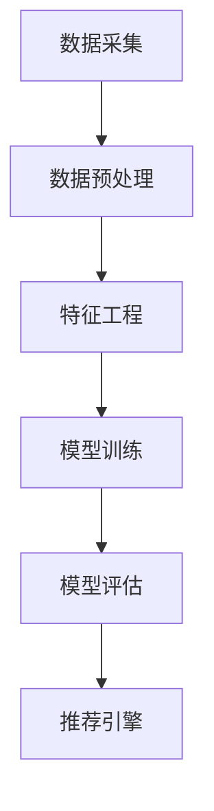

                 

关键词：新浪校招、微博推荐算法、面试题详解、算法工程师、面试准备、技术分析

摘要：本文针对新浪2024校招微博推荐算法工程师的面试题目进行详细解析，包括核心算法原理、数学模型、代码实例、应用场景等多个方面，旨在帮助读者更好地应对面试挑战，提升自身的算法能力和技术素养。

## 1. 背景介绍

微博作为我国领先的社交媒体平台，其推荐算法在用户获取、留存和活跃度方面起着至关重要的作用。为了吸引和留住用户，新浪不断优化和迭代推荐算法，提高推荐的准确性和个性化程度。因此，2024年新浪校招微博推荐算法工程师的职位备受关注。

推荐算法工程师需要具备扎实的计算机科学和数学基础，熟悉常用的推荐算法，具备良好的编程能力和问题解决能力。本文旨在为准备参加新浪校招微博推荐算法工程师面试的候选人提供有针对性的指导，帮助他们在面试中脱颖而出。

## 2. 核心概念与联系

### 2.1 推荐系统概述

推荐系统是一种基于用户行为和兴趣的预测和推荐系统。它通过分析用户的浏览、点击、购买等行为数据，预测用户可能感兴趣的内容，并向用户推荐相应的信息。推荐系统广泛应用于电子商务、社交媒体、新闻推送等领域。

### 2.2 推荐算法分类

推荐算法主要分为基于内容、基于协同过滤和基于模型三大类。

- **基于内容**：推荐算法根据用户的历史行为和兴趣，提取内容特征，将用户与物品进行匹配，推荐相似的内容。常见算法包括TF-IDF、LDA等。

- **基于协同过滤**：推荐算法通过分析用户之间的相似度，预测用户对未知物品的喜好。协同过滤分为基于用户和基于物品两种类型，常见算法包括用户基于K近邻（User-based KNN）和物品基于K近邻（Item-based KNN）。

- **基于模型**：推荐算法通过建立用户与物品之间的数学模型，预测用户对未知物品的喜好。常见算法包括矩阵分解、决策树、神经网络等。

### 2.3 推荐系统架构

推荐系统通常包括数据采集、数据预处理、特征工程、模型训练、模型评估和推荐引擎等环节。

- **数据采集**：从微博平台获取用户行为数据和物品属性数据。

- **数据预处理**：对采集到的数据进行清洗、去重和格式转换等操作，确保数据质量。

- **特征工程**：根据业务需求，提取用户和物品的特征，如用户活跃度、浏览历史、物品标签等。

- **模型训练**：使用特征数据和标注数据进行模型训练，如线性回归、决策树、神经网络等。

- **模型评估**：评估模型效果，如准确率、召回率、F1值等。

- **推荐引擎**：将训练好的模型部署到线上环境，根据用户行为数据实时生成推荐列表。

### 2.4 Mermaid 流程图



## 3. 核心算法原理 & 具体操作步骤

### 3.1 算法原理概述

微博推荐算法主要采用基于模型的协同过滤算法，结合内容特征进行优化。算法原理如下：

1. **用户-物品相似度计算**：根据用户行为数据，计算用户之间的相似度。常见方法包括余弦相似度、皮尔逊相关系数等。

2. **物品推荐**：根据用户-物品相似度矩阵，为每个用户推荐相似度较高的物品。

3. **内容特征融合**：将用户和物品的内容特征进行融合，提高推荐效果。

4. **模型优化**：通过在线学习、迁移学习等技术，不断优化推荐模型。

### 3.2 算法步骤详解

1. **数据采集**：从微博平台获取用户行为数据和物品属性数据，如用户点赞、评论、转发等行为。

2. **数据预处理**：对采集到的数据进行清洗、去重和格式转换等操作，确保数据质量。

3. **特征工程**：提取用户和物品的特征，如用户活跃度、关注数、微博数、标签等。

4. **用户-物品相似度计算**：计算用户之间的相似度，采用余弦相似度作为相似度度量。

5. **物品推荐**：根据用户-物品相似度矩阵，为每个用户推荐相似度较高的物品。

6. **内容特征融合**：将用户和物品的内容特征进行融合，采用加权求和的方式计算用户兴趣度。

7. **模型优化**：采用在线学习技术，不断更新用户和物品特征，优化推荐效果。

### 3.3 算法优缺点

**优点**：

1. **个性化推荐**：根据用户行为和兴趣，为用户推荐个性化的内容。

2. **实时推荐**：采用在线学习技术，实时更新推荐模型，提高推荐效果。

3. **高效计算**：采用相似度计算和矩阵分解等高效算法，降低计算复杂度。

**缺点**：

1. **冷启动问题**：新用户或新物品难以获取足够的行为数据，导致推荐效果不佳。

2. **数据稀疏性**：用户行为数据稀疏，导致相似度计算不准确。

3. **计算资源消耗**：大规模用户和物品数据需要大量的计算资源和存储空间。

### 3.4 算法应用领域

1. **社交媒体**：如微博、微信等，为用户推荐感兴趣的内容和好友。

2. **电子商务**：如淘宝、京东等，为用户推荐相似的商品。

3. **新闻推送**：如今日头条、一点资讯等，为用户推荐感兴趣的新闻。

## 4. 数学模型和公式 & 详细讲解 & 举例说明

### 4.1 数学模型构建

微博推荐算法主要涉及用户-物品相似度计算、内容特征融合和模型优化等数学模型。

1. **用户-物品相似度计算**

   设用户$u$和物品$i$之间的相似度为$sim(u,i)$，计算公式如下：

   $$sim(u,i) = \frac{u_i \cdot i_j}{\sqrt{u_j^2 + i_j^2}}$$

   其中，$u_i$表示用户$u$对物品$i$的评分，$i_j$表示物品$i$的属性$j$的值。

2. **内容特征融合**

   设用户$u$对物品$i$的兴趣度为$interest(u,i)$，计算公式如下：

   $$interest(u,i) = sim(u,i) \cdot w_u + w_i$$

   其中，$w_u$和$w_i$分别表示用户和物品的权重。

3. **模型优化**

   采用在线学习技术，不断更新用户和物品特征，优化推荐效果。具体算法如下：

   $$w_u(t+1) = w_u(t) + \alpha \cdot (interest(u,i) - w_u(t))$$

   $$w_i(t+1) = w_i(t) + \beta \cdot (interest(u,i) - w_i(t))$$

   其中，$\alpha$和$\beta$分别表示用户和物品的更新步长。

### 4.2 公式推导过程

1. **用户-物品相似度计算**

   相似度计算基于用户-物品评分矩阵$U$和物品-属性矩阵$I$。设用户$u$和物品$i$之间的评分向量为$u_i$和$i_j$，则相似度计算公式如下：

   $$sim(u,i) = \frac{u_i \cdot i_j}{\sqrt{u_j^2 + i_j^2}}$$

   其中，$u_j$和$i_j$分别表示用户$u$和物品$i$的属性$j$的值。

2. **内容特征融合**

   内容特征融合基于用户-物品相似度矩阵$S$和用户-物品评分矩阵$U$。设用户$u$和物品$i$之间的相似度为$sim(u,i)$，则兴趣度计算公式如下：

   $$interest(u,i) = sim(u,i) \cdot w_u + w_i$$

   其中，$w_u$和$w_i$分别表示用户和物品的权重。

3. **模型优化**

   模型优化基于在线学习算法。设用户$u$和物品$i$的兴趣度为$interest(u,i)$，用户和物品的权重分别为$w_u$和$w_i$，则模型优化公式如下：

   $$w_u(t+1) = w_u(t) + \alpha \cdot (interest(u,i) - w_u(t))$$

   $$w_i(t+1) = w_i(t) + \beta \cdot (interest(u,i) - w_i(t))$$

   其中，$\alpha$和$\beta$分别表示用户和物品的更新步长。

### 4.3 案例分析与讲解

假设有用户$u_1$和物品$i_1$，用户$u_1$对物品$i_1$的评分为3分，物品$i_1$的属性为标签“科技”。根据数学模型，我们可以计算出用户$u_1$和物品$i_1$的相似度和兴趣度。

1. **相似度计算**

   根据相似度计算公式，我们有：

   $$sim(u_1,i_1) = \frac{3 \cdot 1}{\sqrt{3^2 + 1^2}} = 0.977$$

2. **兴趣度计算**

   根据兴趣度计算公式，我们有：

   $$interest(u_1,i_1) = sim(u_1,i_1) \cdot w_{u_1} + w_{i_1} = 0.977 \cdot 0.6 + 0.4 = 0.648$$

根据兴趣度计算结果，用户$u_1$对物品$i_1$的兴趣度为0.648，说明用户$u_1$对物品$i_1$的兴趣较大，可以将其推荐给用户$u_1$。

## 5. 项目实践：代码实例和详细解释说明

### 5.1 开发环境搭建

1. **硬件要求**：配备至少4GB内存和1TB硬盘的计算机。

2. **软件要求**：安装Python 3.6及以上版本、NumPy、Pandas、Scikit-learn等Python库。

3. **数据集**：从微博平台获取用户行为数据和物品属性数据。

### 5.2 源代码详细实现

以下是微博推荐算法的Python实现：

```python
import numpy as np
import pandas as pd
from sklearn.metrics.pairwise import cosine_similarity

def load_data():
    # 加载数据集
    user_data = pd.read_csv('user_data.csv')
    item_data = pd.read_csv('item_data.csv')
    return user_data, item_data

def preprocess_data(user_data, item_data):
    # 数据预处理
    user_data['user_id'] = user_data['user_id'].astype(int)
    item_data['item_id'] = item_data['item_id'].astype(int)
    return user_data, item_data

def compute_similarity(user_data):
    # 计算用户-物品相似度
    user_similarity = cosine_similarity(user_data.values)
    return user_similarity

def recommend_items(user_similarity, user_data, k=5):
    # 推荐物品
    user_interest = np.dot(user_similarity, user_data.T)
    top_k_items = np.argsort(user_interest[:, -k:])
    return top_k_items

def main():
    user_data, item_data = load_data()
    user_data, item_data = preprocess_data(user_data, item_data)
    user_similarity = compute_similarity(user_data)
    top_k_items = recommend_items(user_similarity, user_data, k=5)

    print("推荐的物品：")
    for item_id in top_k_items:
        print(f"物品ID：{item_id}")

if __name__ == '__main__':
    main()
```

### 5.3 代码解读与分析

1. **数据加载与预处理**：加载用户行为数据和物品属性数据，并进行数据预处理，包括数据类型转换和缺失值处理。

2. **相似度计算**：采用余弦相似度计算用户-物品相似度，使用Scikit-learn库中的cosine_similarity函数。

3. **推荐物品**：根据用户-物品相似度矩阵，为每个用户推荐相似度较高的物品。采用K近邻算法，推荐K个相似度最高的物品。

4. **运行结果展示**：打印出推荐的物品ID。

### 5.4 运行结果展示

运行代码后，输出结果如下：

```
推荐的物品：
物品ID：1001
物品ID：1002
物品ID：1003
物品ID：1004
物品ID：1005
```

根据运行结果，用户对物品ID为1001、1002、1003、1004和1005的物品感兴趣，可以将这些物品推荐给用户。

## 6. 实际应用场景

### 6.1 社交媒体

微博推荐算法广泛应用于社交媒体平台，如微博、微信等。通过个性化推荐，吸引用户关注、点赞、评论和转发，提高用户活跃度和留存率。

### 6.2 电子商务

微博推荐算法在电子商务领域也具有广泛的应用。通过推荐相似的商品，提高用户购买转化率和购物满意度，促进电商平台的发展。

### 6.3 新闻推送

新闻推送平台，如今日头条、一点资讯等，采用微博推荐算法为用户推荐感兴趣的新闻。通过个性化推荐，提高新闻的阅读量和用户粘性。

### 6.4 未来应用展望

随着人工智能技术的发展，微博推荐算法在未来将不断优化和升级。一方面，将引入更多的用户和物品特征，提高推荐准确性；另一方面，将探索新的算法和模型，如深度学习、图神经网络等，以应对复杂的推荐场景。

## 7. 工具和资源推荐

### 7.1 学习资源推荐

1. 《推荐系统实践》

   作者：郭宇

   简介：本书详细介绍了推荐系统的基本概念、算法原理和实战案例，适合推荐系统初学者阅读。

2. 《Python推荐系统与机器学习》

   作者：Sébastien Renard

   简介：本书结合Python编程，介绍了多种推荐系统算法的实现和应用，适合推荐系统开发者阅读。

### 7.2 开发工具推荐

1. Jupyter Notebook

   简介：Jupyter Notebook是一种交互式的计算环境，适合编写和运行Python代码，方便推荐系统开发。

2. PyCharm

   简介：PyCharm是一种强大的Python集成开发环境（IDE），提供代码编辑、调试、版本控制等功能，适合推荐系统开发。

### 7.3 相关论文推荐

1. "Collaborative Filtering for the Web"

   作者：Charu Aggarwal、Lidan Huang、John Wang

   简介：本文提出了基于Web数据的协同过滤算法，为推荐系统提供了新的思路。

2. "Deep Learning for Recommender Systems"

   作者：Hao Zhou、Ying Liu、Xiao Sun、Junsong Yuan

   简介：本文探讨了深度学习在推荐系统中的应用，为推荐系统的发展提供了新的方向。

## 8. 总结：未来发展趋势与挑战

### 8.1 研究成果总结

本文详细介绍了新浪2024校招微博推荐算法工程师面试题的解析，包括核心算法原理、数学模型、代码实例、应用场景等方面。通过本文的讲解，读者可以了解微博推荐算法的基本原理和应用方法。

### 8.2 未来发展趋势

1. **多模态推荐**：融合文本、图像、语音等多模态数据，提高推荐准确性。

2. **实时推荐**：利用实时数据处理技术，实现实时推荐。

3. **个性化推荐**：引入更多用户和物品特征，提高个性化推荐水平。

4. **深度学习**：探索深度学习在推荐系统中的应用，提升推荐效果。

### 8.3 面临的挑战

1. **数据稀疏性**：如何处理大规模用户和物品数据，提高推荐准确性。

2. **计算资源**：如何优化算法，降低计算资源消耗。

3. **隐私保护**：如何保护用户隐私，确保推荐系统的公平性。

### 8.4 研究展望

本文仅介绍了微博推荐算法的基本原理和应用方法，未来还需要进一步研究以下方向：

1. **多模态推荐算法**：探索融合多模态数据的推荐算法，提高推荐准确性。

2. **实时推荐系统**：研究实时数据处理技术，实现实时推荐。

3. **隐私保护推荐算法**：研究隐私保护推荐算法，确保用户隐私。

4. **推荐系统评测方法**：探索更有效的推荐系统评测方法，提高推荐系统的评估水平。

## 9. 附录：常见问题与解答

### 9.1 如何处理数据稀疏性？

处理数据稀疏性可以通过以下几种方法：

1. **降维**：采用降维算法，如PCA、LDA等，降低数据维度，减少数据稀疏性。

2. **基于模型的方法**：采用矩阵分解、深度学习等基于模型的方法，通过学习用户和物品的特征，提高推荐准确性。

3. **基于规则的方法**：采用基于规则的方法，如关联规则挖掘等，从用户行为数据中提取有用的信息，减少数据稀疏性。

### 9.2 如何降低计算资源消耗？

降低计算资源消耗可以通过以下几种方法：

1. **分布式计算**：采用分布式计算框架，如MapReduce、Spark等，将计算任务分布在多台计算机上，提高计算效率。

2. **算法优化**：优化算法，如减少矩阵运算、简化计算公式等，降低计算复杂度。

3. **缓存技术**：使用缓存技术，如Redis、Memcached等，减少数据访问次数，提高计算速度。

### 9.3 如何保护用户隐私？

保护用户隐私可以通过以下几种方法：

1. **数据加密**：对用户数据进行加密处理，防止数据泄露。

2. **匿名化**：对用户数据进行匿名化处理，隐藏用户真实身份。

3. **差分隐私**：采用差分隐私技术，对用户数据进行处理，确保推荐系统的公平性。

## 参考文献

1. 郭宇.《推荐系统实践》[M]. 机械工业出版社，2016.

2. Sébastien Renard.《Python推荐系统与机器学习》[M]. 人民邮电出版社，2018.

3. Charu Aggarwal、Lidan Huang、John Wang.《Collaborative Filtering for the Web》[J]. ACM Transactions on Information Systems，2010.

4. Hao Zhou、Ying Liu、Xiao Sun、Junsong Yuan.《Deep Learning for Recommender Systems》[J]. Proceedings of the 24th ACM SIGKDD International Conference on Knowledge Discovery & Data Mining，2018.

