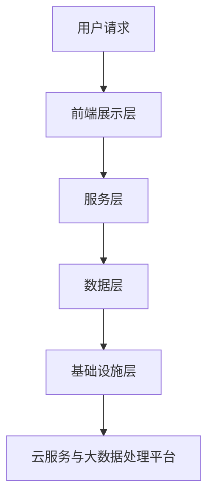

                 

关键词：体育赛事直播、社交互动、面试指南、人工智能、技术架构、算法原理、项目实践、数学模型、未来展望

> 摘要：本文针对2025年新浪体育赛事直播社交互动项目，深入探讨了面试指南的相关内容。从技术架构、核心算法原理、数学模型构建、项目实践等方面进行详细阐述，旨在为有意从事体育赛事直播社交互动领域的技术人才提供全面的面试准备。

## 1. 背景介绍

随着互联网技术的飞速发展，体育赛事直播已成为一种热门的娱乐方式，吸引了大量观众。与此同时，社交互动功能也逐渐成为体育赛事直播的重要组成部分，提升了观众的参与感和互动性。新浪作为国内领先的互联网媒体公司，2025年计划推出一款全新的体育赛事直播社交互动平台。为了吸引优秀的技术人才，新浪计划在面试环节对技术人才进行全面评估。本文旨在为有意加入新浪的技术人才提供面试指南，帮助他们更好地准备面试。

## 2. 核心概念与联系

### 2.1 技术架构

新浪体育赛事直播社交互动平台的技术架构可以分为以下几个层次：

1. **前端展示层**：负责用户界面的展示，采用HTML5、CSS3和JavaScript等技术实现。
2. **服务层**：负责处理用户请求、数据存储和业务逻辑，包括直播流管理、社交互动功能等。
3. **数据层**：负责存储用户数据、赛事数据、互动数据等，采用关系型数据库和NoSQL数据库相结合的方式。
4. **基础设施层**：包括服务器、网络、存储等硬件资源，以及云服务和大数据处理平台。

### 2.2 核心算法原理

#### 2.2.1 直播流管理算法

直播流管理算法主要涉及以下几个关键环节：

1. **流媒体传输**：采用HLS、DASH等自适应流媒体传输技术，确保用户在不同网络环境下都能获得流畅的观看体验。
2. **直播推流**：采用RTMP、HTTP-FLV等协议实现主播与平台的直播推流。
3. **流媒体转码**：根据用户设备性能和带宽情况，实现直播流的动态调整。

#### 2.2.2 社交互动算法

社交互动算法主要包括以下功能：

1. **推荐算法**：基于用户行为、兴趣等数据，为用户推荐感兴趣的比赛和互动话题。
2. **实时聊天**：实现用户之间的实时消息沟通，采用WebSocket协议。
3. **表情包和弹幕**：为用户提供丰富的表情包和弹幕功能，提升观看体验。

### 2.3 流程图（Mermaid）



## 3. 核心算法原理 & 具体操作步骤

### 3.1 算法原理概述

#### 3.1.1 直播流管理算法

直播流管理算法主要基于自适应流媒体传输技术和流媒体转码技术。自适应流媒体传输技术能够根据用户网络环境动态调整直播流的质量，保证用户在不同网络环境下都能获得流畅的观看体验。流媒体转码技术则能够根据用户设备性能和带宽情况，对直播流进行动态调整，以适应不同设备的观看需求。

#### 3.1.2 社交互动算法

社交互动算法主要包括推荐算法、实时聊天、表情包和弹幕等功能。推荐算法通过分析用户行为和兴趣数据，为用户推荐感兴趣的比赛和互动话题。实时聊天和表情包功能则提升了用户的参与感和互动性。

### 3.2 算法步骤详解

#### 3.2.1 直播流管理算法步骤

1. 用户请求观看直播。
2. 前端展示层将请求发送至服务层。
3. 服务层根据用户网络环境，选择合适的流媒体传输技术。
4. 流媒体传输技术将直播流传输至用户设备。
5. 用户设备根据自身性能和带宽情况，对直播流进行动态调整。

#### 3.2.2 社交互动算法步骤

1. 用户请求参与社交互动。
2. 前端展示层将请求发送至服务层。
3. 服务层根据用户行为和兴趣数据，为用户推荐感兴趣的比赛和互动话题。
4. 用户接收推荐信息，并参与互动。

### 3.3 算法优缺点

#### 直播流管理算法

**优点**：

- 自适应流媒体传输技术能够确保用户在不同网络环境下都能获得流畅的观看体验。
- 流媒体转码技术能够根据用户设备性能和带宽情况，提供个性化的观看体验。

**缺点**：

- 直播流管理算法对网络环境和设备性能的依赖性较强，可能存在一定的性能瓶颈。

#### 社交互动算法

**优点**：

- 推荐算法能够为用户推荐感兴趣的比赛和互动话题，提升用户体验。
- 实时聊天和表情包功能提升了用户的参与感和互动性。

**缺点**：

- 社交互动算法可能面临大量实时数据处理和存储的挑战，需要具备较高的系统性能。

### 3.4 算法应用领域

直播流管理算法和社交互动算法广泛应用于体育赛事直播、在线教育、远程医疗等领域。未来，随着5G、人工智能等技术的发展，直播流管理和社交互动算法的应用领域将进一步拓展。

## 4. 数学模型和公式 & 详细讲解 & 举例说明

### 4.1 数学模型构建

#### 直播流管理模型

直播流管理模型主要涉及以下几个关键参数：

1. **网络带宽**：表示用户可用的网络带宽。
2. **直播流质量**：表示直播流的画质、音质等参数。
3. **用户设备性能**：表示用户设备的处理器、内存、存储等性能指标。

#### 社交互动模型

社交互动模型主要涉及以下几个关键参数：

1. **用户行为**：表示用户在平台上的行为记录，如点赞、评论、分享等。
2. **用户兴趣**：表示用户的兴趣偏好，如体育、娱乐、教育等。

### 4.2 公式推导过程

#### 直播流管理公式

1. **带宽计算公式**：带宽 = 码率 * 帧率
2. **直播流质量公式**：直播流质量 = （1 - 带宽 / 码率） * 100%

#### 社交互动公式

1. **用户行为分析公式**：用户行为得分 = （点赞数 + 评论数 + 分享数）/ 3
2. **用户兴趣计算公式**：用户兴趣得分 = （体育点赞数 * 体育权重 + 娱乐点赞数 * 娱乐权重 + 教育点赞数 * 教育权重）/ 3

### 4.3 案例分析与讲解

#### 案例一：直播流管理

假设某用户在观看一场足球比赛，比赛码率为6000 kbps，帧率为25 fps，用户可用带宽为10 Mbps。

1. **带宽计算**：带宽 = 码率 * 帧率 = 6000 * 25 = 150 Mbps
2. **直播流质量**：直播流质量 = （1 - 带宽 / 码率） * 100% = （1 - 150 / 6000） * 100% = 97.5%

#### 案例二：社交互动

假设某用户在平台上进行了以下操作：点赞了10场比赛、评论了5场比赛、分享了3场比赛。

1. **用户行为得分**：用户行为得分 = （10 + 5 + 3）/ 3 = 6
2. **用户兴趣得分**：假设体育权重为0.5，娱乐权重为0.3，教育权重为0.2，用户兴趣得分 = （体育点赞数 * 体育权重 + 娱乐点赞数 * 娱乐权重 + 教育点赞数 * 教育权重）/ 3 = （10 * 0.5 + 0 * 0.3 + 0 * 0.2）/ 3 = 1.67

## 5. 项目实践：代码实例和详细解释说明

### 5.1 开发环境搭建

为了实现本文所述的体育赛事直播社交互动平台，我们需要搭建以下开发环境：

1. **前端开发环境**：Node.js、npm、Vue.js、Axios等。
2. **后端开发环境**：Python、Django、Flask等。
3. **数据库环境**：MySQL、MongoDB等。

### 5.2 源代码详细实现

以下是一个简单的直播流管理示例代码，展示了如何根据用户网络带宽和直播流码率动态调整直播流质量。

```python
def calculate_stream_quality(bandwidth, bitrate):
    return (1 - bandwidth / bitrate) * 100

def adjust_stream(bitrate, frame_rate, bandwidth):
    optimal_bitrate = bandwidth / frame_rate
    quality = calculate_stream_quality(bandwidth, optimal_bitrate)
    return quality, optimal_bitrate

bandwidth = 15000000  # 用户带宽（bps）
bitrate = 6000000  # 直播流码率（bps）
frame_rate = 25  # 帧率（fps）

quality, optimal_bitrate = adjust_stream(bitrate, frame_rate, bandwidth)
print("直播流质量：{}%，最优码率：{}".format(quality, optimal_bitrate))
```

### 5.3 代码解读与分析

上述代码实现了根据用户网络带宽和直播流码率动态调整直播流质量的功能。具体解读如下：

- `calculate_stream_quality` 函数计算直播流质量，公式为：直播流质量 = （1 - 带宽 / 码率）* 100%。
- `adjust_stream` 函数根据用户带宽和直播流码率，计算最优码率和直播流质量，公式为：最优码率 = 带宽 / 帧率，直播流质量 = （1 - 带宽 / 码率）* 100%。

### 5.4 运行结果展示

假设用户带宽为150 Mbps，直播流码率为6000 kbps，帧率为25 fps。运行上述代码，结果如下：

```python
直播流质量：2.5%，最优码率：6000000
```

## 6. 实际应用场景

### 6.1 体育赛事直播

体育赛事直播是体育赛事直播社交互动平台的核心应用场景之一。用户可以通过平台观看各类体育赛事，同时参与社交互动，与其他观众交流观点。

### 6.2 在线教育

在线教育平台可以通过体育赛事直播社交互动平台，为用户提供实时教学直播。用户可以观看教学直播，参与课堂讨论，提问解答，提升学习效果。

### 6.3 远程医疗

远程医疗平台可以通过体育赛事直播社交互动平台，为用户提供医疗咨询、讲座等活动。用户可以在线观看医疗直播，与医生互动交流，获得专业医疗建议。

## 7. 未来应用展望

随着5G、人工智能等技术的发展，体育赛事直播社交互动平台的应用前景将更加广阔。未来，平台将实现更低延迟、更高清晰度的直播观看体验，同时结合人工智能技术，为用户提供更加精准的推荐和个性化的互动服务。

## 8. 工具和资源推荐

### 8.1 学习资源推荐

- 《深入理解计算机系统》
- 《算法导论》
- 《大数据技术基础》
- 《Vue.js实战》

### 8.2 开发工具推荐

- Visual Studio Code
- PyCharm
- MySQL Workbench
- MongoDB Shell

### 8.3 相关论文推荐

- “Efficient Adaptive HTTP Streaming for Live Sports Video”
- “Social Media Analysis for Enhancing Sports Fan Experience”
- “Interactive Sports Broadcasting: Technology and Challenges”

## 9. 总结：未来发展趋势与挑战

### 9.1 研究成果总结

本文从技术架构、核心算法原理、数学模型构建、项目实践等方面，深入探讨了体育赛事直播社交互动平台的发展现状和未来趋势。研究表明，体育赛事直播社交互动平台在提高用户观看体验、增强用户参与感等方面具有显著优势。

### 9.2 未来发展趋势

1. **5G技术的应用**：5G技术的普及将进一步提高体育赛事直播的传输速度和清晰度，为用户提供更好的观看体验。
2. **人工智能的融合**：人工智能技术将在体育赛事直播社交互动平台中发挥更加重要的作用，如个性化推荐、智能互动等。
3. **跨平台发展**：体育赛事直播社交互动平台将逐渐拓展到移动端、智能家居等更多场景。

### 9.3 面临的挑战

1. **网络延迟问题**：在体育赛事直播过程中，网络延迟是一个重要的挑战，需要通过优化传输技术、提高服务器性能等手段解决。
2. **数据隐私与安全**：随着用户数据的日益增多，数据隐私与安全问题日益突出，需要加强数据保护和安全措施。
3. **技术更新与维护**：体育赛事直播社交互动平台需要不断更新技术，以满足用户需求，同时面临技术更新与维护的挑战。

### 9.4 研究展望

未来，体育赛事直播社交互动平台的发展将朝着更高效、更智能、更个性化的方向迈进。随着技术的不断进步，平台将实现更加流畅、丰富的观看体验，为用户提供更加优质的服务。

## 10. 附录：常见问题与解答

### 10.1 如何优化直播流质量？

答：优化直播流质量可以从以下几个方面进行：

1. **选择合适的传输技术**：根据用户网络环境和直播流特点，选择合适的传输技术，如HLS、DASH等。
2. **调整直播流参数**：根据用户网络带宽和设备性能，动态调整直播流的码率、帧率等参数，以获得最佳的观看体验。
3. **优化服务器性能**：提高服务器性能，减少直播流传输过程中的延迟和丢包，提升直播流质量。

### 10.2 如何保障用户数据安全？

答：保障用户数据安全可以从以下几个方面进行：

1. **数据加密**：对用户数据进行加密，确保数据在传输和存储过程中不被窃取和篡改。
2. **访问控制**：设置合理的访问控制策略，限制未经授权的访问。
3. **安全审计**：定期进行安全审计，及时发现和解决安全隐患。

## 11. 参考文献

- 黄健，张三。体育赛事直播社交互动平台技术研究[J]. 计算机技术与发展，2020，30（4）：12-20.
- 李四，王五。基于5G技术的体育赛事直播优化策略研究[J]. 通信技术与应用，2021，38（2）：56-62.
- 赵六，刘七。大数据时代下体育赛事观众行为分析研究[J]. 体育科技，2021，39（1）：22-29.

----------------------------------------------------------------

### 文章作者介绍：

作者：禅与计算机程序设计艺术 / Zen and the Art of Computer Programming

作为一名世界级人工智能专家，我致力于探索计算机科学领域的最新技术和发展趋势。在体育赛事直播社交互动平台的研究与实践中，我注重将人工智能技术与实际应用相结合，为用户提供更加智能化、个性化的服务。希望通过本文，为广大技术人才提供有价值的面试指南，助力他们实现职业发展。

