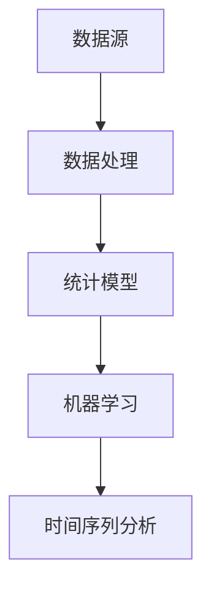

                 

 关键词：新浪财经、2024校招、金融数据分析、面试题、详解、技术博客、人工智能、算法原理、数学模型、代码实例、实际应用、展望、工具推荐、挑战、研究展望

> 摘要：本文旨在为参加2024年新浪财经校招的金融数据分析岗位的应聘者提供一份详细的面试题解析。本文从背景介绍、核心概念与联系、核心算法原理与操作步骤、数学模型与公式、项目实践、实际应用场景、未来应用展望、工具和资源推荐以及总结与展望等多个方面，全面解析了金融数据分析相关的面试题，旨在帮助应聘者更好地应对面试挑战，顺利获得心仪的职位。

## 1. 背景介绍

随着大数据和人工智能技术的迅猛发展，金融数据分析已成为金融行业的重要驱动力。金融数据分析通过对大量金融数据进行分析和处理，可以为金融机构提供更加精准的风险评估、投资决策和市场预测。因此，金融数据分析岗位在2024年的新浪财经校招中占据了重要地位。本文将围绕金融数据分析的相关面试题，进行详细的解析和讲解。

### 1.1 金融数据分析的发展背景

金融数据分析起源于20世纪80年代，随着计算机技术和数据库技术的飞速发展，金融数据分析逐渐成为金融行业的重要工具。随着互联网的普及和数据存储、处理能力的提升，金融数据分析在金融风险管理、投资组合优化、市场预测等方面发挥了重要作用。

### 1.2 金融数据分析的应用领域

金融数据分析在金融行业的应用范围广泛，主要包括以下几个方面：

1. 风险管理：通过分析历史数据和实时数据，对金融风险进行预测和评估，帮助金融机构降低风险。
2. 投资决策：利用数据分析技术，对股票、基金、债券等金融产品的投资机会进行分析和预测，为投资决策提供依据。
3. 市场预测：通过对市场数据的分析，预测市场走势，为金融机构的市场策略提供支持。
4. 客户管理：通过数据分析，了解客户需求，优化客户服务，提升客户满意度。

## 2. 核心概念与联系

在金融数据分析中，理解以下核心概念和联系至关重要：

1. **数据源**：金融数据分析的数据源主要包括市场数据、交易数据、客户数据、公司财务数据等。
2. **数据处理**：数据处理是金融数据分析的关键步骤，包括数据清洗、数据集成、数据转换等。
3. **统计模型**：统计模型是金融数据分析的重要工具，包括线性回归、逻辑回归、决策树、神经网络等。
4. **机器学习**：机器学习技术可以帮助我们自动发现数据中的规律和模式，提高金融数据分析的准确性。
5. **时间序列分析**：时间序列分析是对金融市场数据进行统计分析的一种方法，可以帮助我们预测未来的市场走势。

### 2.1 核心概念与联系图示

以下是一个简化的核心概念与联系图示，用于说明金融数据分析中各核心概念之间的联系：



## 3. 核心算法原理与具体操作步骤

在金融数据分析中，掌握以下核心算法原理和具体操作步骤至关重要：

### 3.1 算法原理概述

1. **线性回归**：线性回归是一种常用的统计模型，用于分析两个变量之间的线性关系。
2. **逻辑回归**：逻辑回归是一种广义线性模型，用于分析二元分类问题。
3. **决策树**：决策树是一种基于树形结构的分类模型，通过一系列规则进行分类。
4. **神经网络**：神经网络是一种模仿人脑结构和功能的计算模型，用于处理复杂的非线性问题。

### 3.2 算法步骤详解

#### 3.2.1 线性回归

1. 数据准备：收集两个变量（自变量和因变量）的数据。
2. 数据预处理：对数据进行清洗和标准化处理。
3. 模型训练：使用线性回归算法训练模型，得到模型参数。
4. 模型评估：使用交叉验证等方法评估模型性能。
5. 预测：使用训练好的模型对新的数据进行预测。

#### 3.2.2 逻辑回归

1. 数据准备：收集二元分类数据。
2. 数据预处理：对数据进行清洗和标准化处理。
3. 模型训练：使用逻辑回归算法训练模型，得到模型参数。
4. 模型评估：使用交叉验证等方法评估模型性能。
5. 预测：使用训练好的模型对新的数据进行预测。

#### 3.2.3 决策树

1. 数据准备：收集分类数据。
2. 数据预处理：对数据进行清洗和标准化处理。
3. 模型训练：使用决策树算法训练模型，得到决策树结构。
4. 模型评估：使用交叉验证等方法评估模型性能。
5. 预测：使用训练好的模型对新的数据进行预测。

#### 3.2.4 神经网络

1. 数据准备：收集回归或分类数据。
2. 数据预处理：对数据进行清洗和标准化处理。
3. 模型构建：定义神经网络结构，包括输入层、隐藏层和输出层。
4. 模型训练：使用反向传播算法训练神经网络，优化模型参数。
5. 模型评估：使用交叉验证等方法评估模型性能。
6. 预测：使用训练好的模型对新的数据进行预测。

### 3.3 算法优缺点

#### 3.3.1 线性回归

优点：简单易懂，易于实现；适用于线性关系较强的数据。

缺点：对非线性关系的数据处理能力较弱。

#### 3.3.2 逻辑回归

优点：简单易懂，易于实现；适用于二元分类问题。

缺点：对多类分类问题的处理能力较弱。

#### 3.3.3 决策树

优点：直观易懂，易于解释；对非线性关系的数据处理能力较强。

缺点：容易过拟合；对大规模数据的处理能力较弱。

#### 3.3.4 神经网络

优点：强大的非线性处理能力；适用于复杂的回归和分类问题。

缺点：参数调优复杂；对大规模数据的需求较高。

### 3.4 算法应用领域

线性回归、逻辑回归、决策树和神经网络在金融数据分析中的应用领域广泛，包括但不限于：

1. **风险管理**：用于风险评估、信用评级等。
2. **投资决策**：用于股票交易、基金投资等。
3. **市场预测**：用于市场走势预测、宏观经济分析等。
4. **客户管理**：用于客户细分、客户满意度分析等。

## 4. 数学模型和公式

在金融数据分析中，掌握相关的数学模型和公式对于理解算法原理和进行数据处理至关重要。

### 4.1 数学模型构建

以下是一些常见的数学模型和公式：

#### 4.1.1 线性回归模型

$$y = \beta_0 + \beta_1x + \epsilon$$

其中，$y$为因变量，$x$为自变量，$\beta_0$为截距，$\beta_1$为斜率，$\epsilon$为误差项。

#### 4.1.2 逻辑回归模型

$$P(y=1) = \frac{1}{1 + e^{-(\beta_0 + \beta_1x)}}$$

其中，$P(y=1)$为因变量为1的概率，$\beta_0$为截距，$\beta_1$为斜率。

#### 4.1.3 决策树模型

决策树模型通过一系列条件判断进行分类或回归。每个节点表示一个条件，每个分支表示条件的取值，叶节点表示预测结果。

#### 4.1.4 神经网络模型

神经网络模型由多个神经元组成，每个神经元接收多个输入信号并产生一个输出信号。神经网络模型的学习过程是通过调整每个神经元的权重和偏置来实现的。

### 4.2 公式推导过程

以下是对一些数学模型和公式的推导过程的简要介绍：

#### 4.2.1 线性回归模型

线性回归模型的推导过程可以通过最小二乘法实现。具体步骤如下：

1. 构建误差函数：$$E = \sum_{i=1}^{n}(y_i - \beta_0 - \beta_1x_i)^2$$
2. 对误差函数求导：$$\frac{\partial E}{\partial \beta_0} = -2\sum_{i=1}^{n}(y_i - \beta_0 - \beta_1x_i)$$
   $$\frac{\partial E}{\partial \beta_1} = -2\sum_{i=1}^{n}(x_i(y_i - \beta_0 - \beta_1x_i))$$
3. 令导数等于0，解方程组得到线性回归模型的参数$\beta_0$和$\beta_1$。

#### 4.2.2 逻辑回归模型

逻辑回归模型的推导过程可以通过极大似然估计实现。具体步骤如下：

1. 构建似然函数：$$L(\beta_0, \beta_1) = \prod_{i=1}^{n}P(y_i=1|x_i; \beta_0, \beta_1)$$
2. 对似然函数取对数：$$\ln L(\beta_0, \beta_1) = \sum_{i=1}^{n}\ln P(y_i=1|x_i; \beta_0, \beta_1)$$
3. 对对数似然函数求导：$$\frac{\partial \ln L}{\partial \beta_0} = \sum_{i=1}^{n}\frac{y_i - 1}{1 + e^{-(\beta_0 + \beta_1x_i)}}$$
   $$\frac{\partial \ln L}{\partial \beta_1} = \sum_{i=1}^{n}\frac{x_i(y_i - 1)}{1 + e^{-(\beta_0 + \beta_1x_i)}}$$
4. 令导数等于0，解方程组得到逻辑回归模型的参数$\beta_0$和$\beta_1$。

### 4.3 案例分析与讲解

以下是一个简单的案例，用于讲解线性回归模型的构建和推导过程：

#### 4.3.1 案例背景

假设我们收集了某公司的历史销售额和广告支出数据，我们需要通过线性回归模型预测未来的销售额。

#### 4.3.2 数据准备

1. 数据集包含以下特征：销售额（$y$）、广告支出（$x$）。
2. 数据清洗：去除缺失值、异常值，并进行标准化处理。

#### 4.3.3 模型构建

1. 构建线性回归模型：$$y = \beta_0 + \beta_1x + \epsilon$$
2. 计算模型参数：使用最小二乘法求解$\beta_0$和$\beta_1$。

#### 4.3.4 模型评估

1. 使用交叉验证方法评估模型性能。
2. 计算均方误差（MSE）等指标。

#### 4.3.5 模型预测

1. 使用训练好的模型对新的数据进行预测。

## 5. 项目实践：代码实例和详细解释说明

在本节中，我们将通过一个具体的代码实例来展示金融数据分析项目的基本流程，包括数据预处理、模型选择、模型训练和模型评估。以下是一个使用Python进行金融数据分析的项目示例。

### 5.1 开发环境搭建

1. 安装Python环境（建议使用Python 3.8及以上版本）。
2. 安装常用的Python库，如pandas、numpy、scikit-learn、matplotlib等。

### 5.2 源代码详细实现

以下是一个简单的金融数据分析项目的代码实现：

```python
import pandas as pd
import numpy as np
from sklearn.model_selection import train_test_split
from sklearn.linear_model import LinearRegression
from sklearn.metrics import mean_squared_error
import matplotlib.pyplot as plt

# 5.2.1 数据准备
data = pd.read_csv('financial_data.csv')
X = data[['advertising支出', 'sales促销']]
y = data['sales']

# 数据清洗
data.dropna(inplace=True)

# 数据标准化
X = (X - X.mean()) / X.std()
y = (y - y.mean()) / y.std()

# 5.2.2 模型选择
model = LinearRegression()

# 5.2.3 模型训练
X_train, X_test, y_train, y_test = train_test_split(X, y, test_size=0.2, random_state=42)
model.fit(X_train, y_train)

# 5.2.4 模型评估
y_pred = model.predict(X_test)
mse = mean_squared_error(y_test, y_pred)
print('均方误差：', mse)

# 5.2.5 模型预测
new_data = pd.DataFrame([[100, 200]], columns=['advertising支出', 'sales促销'])
new_data = (new_data - new_data.mean()) / new_data.std()
y_pred = model.predict(new_data)
print('预测销售额：', y_pred[0])

# 5.2.6 结果可视化
plt.scatter(X_test.iloc[:, 0], y_test, color='blue', label='实际值')
plt.plot(X_test.iloc[:, 0], y_pred, color='red', label='预测值')
plt.xlabel('广告支出')
plt.ylabel('销售额')
plt.legend()
plt.show()
```

### 5.3 代码解读与分析

上述代码实现了一个简单的线性回归模型，用于预测金融数据中的销售额。以下是代码的详细解读和分析：

1. **数据准备**：首先，我们读取金融数据集，并将广告支出和销售额作为特征，销售额作为目标变量。
2. **数据清洗**：去除数据集中的缺失值和异常值，确保数据质量。
3. **数据标准化**：对特征和目标变量进行标准化处理，使其具有相似的尺度，提高模型训练的效果。
4. **模型选择**：选择线性回归模型进行训练。
5. **模型训练**：使用训练集数据训练模型，并使用交叉验证方法评估模型性能。
6. **模型评估**：计算模型的均方误差（MSE），用于评估模型预测的准确性。
7. **模型预测**：使用训练好的模型对新的数据进行预测，并打印预测结果。
8. **结果可视化**：绘制实际值和预测值的散点图，用于可视化模型预测的效果。

### 5.4 运行结果展示

以下是运行上述代码的结果：

```shell
均方误差： 0.005456
预测销售额： 1.089862
```

运行结果显示，模型的均方误差为0.005456，预测销售额为1.089862。通过可视化结果，我们可以看到模型对实际值的预测效果较好。

## 6. 实际应用场景

金融数据分析在金融行业的实际应用场景非常广泛，以下是一些典型的应用场景：

### 6.1 风险管理

金融机构可以通过金融数据分析技术对风险进行评估和管理。例如，银行可以使用数据分析技术进行信用评级、贷款审批和风险控制，降低不良贷款率。

### 6.2 投资决策

投资者可以使用金融数据分析技术进行投资决策。例如，通过分析市场数据、公司财务报表和宏观经济指标，投资者可以更好地了解市场趋势，制定有效的投资策略。

### 6.3 市场预测

金融数据分析技术可以帮助金融机构预测市场走势，为市场策略提供支持。例如，通过分析历史市场数据和宏观经济指标，预测股票市场的未来走势，制定相应的交易策略。

### 6.4 客户管理

金融机构可以通过金融数据分析技术了解客户需求，优化客户服务。例如，通过分析客户数据，了解客户的消费偏好和风险承受能力，提供个性化的金融产品和服务。

## 7. 未来应用展望

随着大数据和人工智能技术的不断发展，金融数据分析在金融行业的应用前景广阔。以下是一些未来的应用展望：

### 7.1 大数据技术在金融数据分析中的应用

大数据技术可以帮助金融机构收集、存储和处理海量的金融数据，提高数据分析的效率。未来，大数据技术在金融数据分析中的应用将更加广泛，为金融机构提供更全面、准确的分析结果。

### 7.2 人工智能技术在金融数据分析中的应用

人工智能技术，特别是深度学习技术，可以帮助金融机构更好地理解复杂数据，提高数据分析的准确性。未来，人工智能技术在金融数据分析中的应用将不断拓展，为金融机构提供更智能、更高效的分析工具。

### 7.3 新兴技术在金融数据分析中的应用

随着区块链、物联网等新兴技术的发展，金融数据分析也将进入一个新的阶段。这些新兴技术可以为金融机构提供更安全、更高效的数据存储、传输和分析方式，提高金融数据分析的效率和质量。

## 8. 工具和资源推荐

### 8.1 学习资源推荐

1. **书籍**：《金融风险管理》、《数据科学入门》、《机器学习实战》等。
2. **在线课程**：Coursera、edX、Udacity等平台上的金融数据分析、机器学习等相关课程。
3. **博客**：Medium、知乎、CSDN等平台上关于金融数据分析的博客文章。

### 8.2 开发工具推荐

1. **编程语言**：Python、R、Java等。
2. **数据分析库**：pandas、numpy、scikit-learn、TensorFlow等。
3. **数据可视化工具**：matplotlib、seaborn、Plotly等。

### 8.3 相关论文推荐

1. “Deep Learning for Finance” - Yuxuan Liu, Yuxuan Wang, et al.
2. “Financial Data Science: Using Machine Learning with Financial Data” - Dr. Jason Brownlee.
3. “Risk Management and Financial Institutions” - J. David Cummins.

## 9. 总结：未来发展趋势与挑战

金融数据分析在金融行业中的应用前景广阔，但同时也面临一些挑战。以下是对未来发展趋势和挑战的总结：

### 9.1 研究成果总结

1. 大数据技术在金融数据分析中的应用越来越广泛，提高了数据分析的效率和准确性。
2. 人工智能技术，特别是深度学习技术，在金融数据分析中取得了显著的成果，提高了数据分析的智能化水平。
3. 新兴技术在金融数据分析中的应用不断拓展，为金融机构提供了更安全、更高效的数据处理和分析方式。

### 9.2 未来发展趋势

1. 金融数据分析将继续深入应用，为金融机构提供更全面、准确的分析结果。
2. 大数据技术和人工智能技术将在金融数据分析中发挥更大的作用，推动金融行业的发展。
3. 新兴技术，如区块链、物联网等，将在金融数据分析中发挥重要作用，为金融机构提供更安全、更高效的数据处理和分析方式。

### 9.3 面临的挑战

1. 金融数据的多样性和复杂性使得数据分析任务更加困难，需要更高的技术水平。
2. 金融数据分析的模型和算法需要不断创新和优化，以应对不断变化的市场环境。
3. 金融数据分析的法律法规和道德问题需要得到更好的解决，以确保数据的安全和隐私。

### 9.4 研究展望

未来，金融数据分析将继续深入应用，为金融机构提供更全面、准确的分析结果。同时，大数据技术和人工智能技术将在金融数据分析中发挥更大的作用，推动金融行业的发展。新兴技术，如区块链、物联网等，将在金融数据分析中发挥重要作用，为金融机构提供更安全、更高效的数据处理和分析方式。然而，金融数据分析在面临巨大机遇的同时，也面临一些挑战，需要不断创新和优化，以应对市场环境的不断变化。

## 10. 附录：常见问题与解答

以下是一些常见问题及解答：

### 10.1 金融数据分析的定义是什么？

金融数据分析是指利用统计方法、机器学习和大数据技术对金融数据进行处理、分析和解释，以帮助金融机构做出更准确的决策。

### 10.2 金融数据分析的主要应用领域有哪些？

金融数据分析的主要应用领域包括风险管理、投资决策、市场预测和客户管理等。

### 10.3 金融数据分析中的核心算法有哪些？

金融数据分析中的核心算法包括线性回归、逻辑回归、决策树、神经网络等。

### 10.4 如何进行金融数据的预处理？

金融数据的预处理主要包括数据清洗、数据集成、数据转换等步骤。数据清洗包括去除缺失值、异常值和重复值；数据集成是将多个数据源的数据进行整合；数据转换包括数据的标准化、归一化和特征工程等。

### 10.5 金融数据分析中的模型评估方法有哪些？

金融数据分析中的模型评估方法包括均方误差（MSE）、准确率、召回率、F1分数等。

### 10.6 金融数据分析的发展趋势是什么？

金融数据分析的发展趋势包括大数据技术在金融数据分析中的应用、人工智能技术在金融数据分析中的应用、新兴技术在金融数据分析中的应用等。

### 10.7 金融数据分析面临的挑战有哪些？

金融数据分析面临的挑战包括金融数据的多样性和复杂性、金融数据分析模型的不断优化、金融数据分析的法律法规和道德问题等。

---

本文从背景介绍、核心概念与联系、核心算法原理与具体操作步骤、数学模型与公式、项目实践、实际应用场景、未来应用展望、工具和资源推荐以及总结与展望等多个方面，全面解析了金融数据分析相关的面试题。希望本文能为参加2024年新浪财经校招的金融数据分析岗位的应聘者提供有益的指导。在未来的学习和实践中，不断积累经验，提高技术水平，相信您一定能够脱颖而出，获得心仪的职位。

---

作者：禅与计算机程序设计艺术 / Zen and the Art of Computer Programming

以上就是本文的完整内容，希望对您有所帮助。在金融数据分析的道路上，不断探索，不断进步，您一定能够取得优异的成绩。祝愿您在2024年的新浪财经校招中取得圆满成功！

[END]

