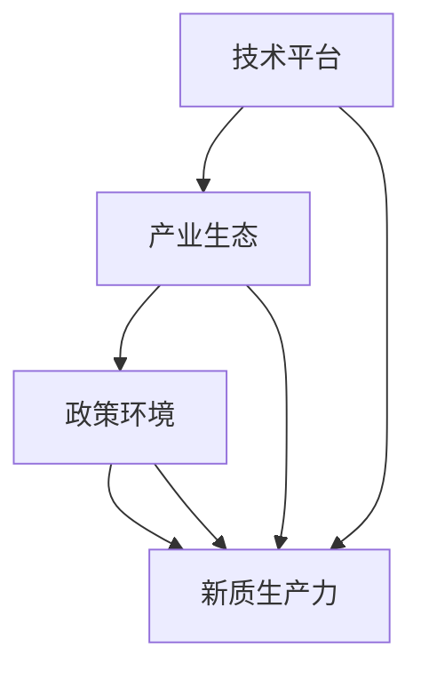

                 

关键词：新质生产力，产业升级，数字化转型，技术进步，经济结构优化。

## 摘要

本文旨在探讨新质生产力在推动产业升级中的重要作用。通过对新质生产力的定义、特征及其与传统生产力的比较，本文分析了新质生产力在数字化转型、技术创新和经济增长方面的贡献。同时，本文还讨论了新质生产力在不同行业中的应用场景，并提出了未来发展的趋势和挑战。

## 1. 背景介绍

随着全球经济的发展，产业升级成为各国政府和企业关注的焦点。传统的生产力模式已经难以满足日益增长的经济需求，新质生产力的兴起为产业升级提供了新的动力。新质生产力是指以信息技术、生物技术、新材料技术等为代表的新兴技术，通过创新和集成，推动传统产业的转型升级。

### 1.1 传统生产力与新兴产业

传统生产力主要依赖于自然资源、劳动力和资本，以制造业和农业为主要产业。而新质生产力则强调技术创新和知识创造，以高新技术产业和服务业为主要载体。两者在资源利用、生产效率、产业链结构等方面存在显著差异。

### 1.2 新质生产力的兴起

新质生产力的兴起源于全球信息化、网络化和智能化的发展。随着大数据、人工智能、区块链等技术的突破，新质生产力在各个领域得到了广泛应用，推动了传统产业的数字化、智能化和绿色化升级。

## 2. 核心概念与联系

为了更好地理解新质生产力，我们需要从概念和架构的角度进行分析。

### 2.1 新质生产力的核心概念

新质生产力的核心概念包括：

- **信息技术**：通过互联网、云计算、大数据等技术，实现信息的高效获取、处理和利用。
- **生物技术**：通过基因编辑、生物制药等技术，提高生物资源的利用效率。
- **新材料技术**：通过纳米材料、超导材料等技术，推动材料科学的进步。
- **能源技术**：通过可再生能源、节能技术等，提高能源利用效率，减少环境污染。

### 2.2 新质生产力的架构

新质生产力的架构包括以下几个方面：

- **技术平台**：以信息技术、生物技术、新材料技术等为基础，构建技术创新平台。
- **产业生态**：通过产业链的整合和优化，形成新的产业生态。
- **政策环境**：政府提供政策支持和资金投入，为新质生产力的发展创造有利条件。

### 2.3 Mermaid 流程图

## 3. 核心算法原理 & 具体操作步骤

### 3.1 算法原理概述

新质生产力的核心算法原理主要包括以下几个方面：

- **大数据分析**：通过对海量数据进行分析，提取有价值的信息。
- **人工智能**：通过模拟人类智能，实现自动化决策和智能服务。
- **区块链**：通过分布式账本技术，实现数据的可信传递和存储。

### 3.2 算法步骤详解

- **大数据分析**：
  1. 数据采集：从各种渠道收集数据。
  2. 数据预处理：对数据进行清洗、转换和整合。
  3. 数据分析：运用统计方法、机器学习等技术，对数据进行挖掘和分析。
  4. 决策支持：根据分析结果，提供决策支持。

- **人工智能**：
  1. 模型训练：通过大量数据训练人工智能模型。
  2. 模型优化：对模型进行优化，提高其准确性和效率。
  3. 模型应用：将训练好的模型应用到实际场景中，实现自动化决策和智能服务。

- **区块链**：
  1. 节点部署：在区块链网络中部署节点。
  2. 数据传输：通过区块链网络传输数据。
  3. 数据存储：将数据存储在区块链中，确保数据的可信性和安全性。

### 3.3 算法优缺点

- **大数据分析**：
  - 优点：能够处理海量数据，提取有价值的信息。
  - 缺点：对数据质量和处理能力要求较高，成本较高。

- **人工智能**：
  - 优点：能够实现自动化决策和智能服务，提高效率。
  - 缺点：对数据量和算法要求较高，存在隐私和安全问题。

- **区块链**：
  - 优点：能够实现数据的安全传输和存储，提高数据的可信性。
  - 缺点：交易速度较慢，难以处理大规模交易。

### 3.4 算法应用领域

- **大数据分析**：广泛应用于金融、医疗、零售等行业，用于客户行为分析、风险控制、供应链优化等。
- **人工智能**：广泛应用于自动驾驶、智能客服、医疗诊断等领域，提高生产效率和服务质量。
- **区块链**：广泛应用于金融、供应链管理等领域，用于实现数据的安全传输和存储。

## 4. 数学模型和公式 & 详细讲解 & 举例说明

### 4.1 数学模型构建

新质生产力的数学模型主要包括以下几个方面：

- **大数据分析**：数据挖掘模型，如K-Means聚类、决策树等。
- **人工智能**：神经网络模型，如深度学习、循环神经网络等。
- **区块链**：博弈论模型，如拜占庭将军问题、区块链共识机制等。

### 4.2 公式推导过程

- **大数据分析**：
  - K-Means聚类算法：目标函数为最小化聚类中心与样本点之间的距离平方和。
  - 决策树算法：目标函数为最大化信息增益或信息增益率。

- **人工智能**：
  - 深度学习：目标函数为最小化损失函数，如交叉熵损失函数。
  - 循环神经网络：目标函数为最小化序列预测误差。

- **区块链**：
  - 拜占庭将军问题：目标函数为达成一致意见，最小化错误节点比例。

### 4.3 案例分析与讲解

- **大数据分析**：
  - 金融行业：运用K-Means聚类分析客户行为，实现精准营销。
  - 医疗行业：运用决策树分析患者数据，实现疾病诊断。

- **人工智能**：
  - 自动驾驶：运用深度学习模型，实现车辆环境的感知和决策。
  - 智能客服：运用循环神经网络，实现自然语言处理和智能对话。

- **区块链**：
  - 金融行业：运用区块链技术，实现跨境支付和数据共享。
  - 供应链管理：运用区块链技术，实现供应链的可视化和透明化。

## 5. 项目实践：代码实例和详细解释说明

### 5.1 开发环境搭建

- **大数据分析**：使用Python的Pandas和Scikit-learn库。
- **人工智能**：使用Python的TensorFlow和Keras库。
- **区块链**：使用Python的PyBlockchain库。

### 5.2 源代码详细实现

- **大数据分析**：实现K-Means聚类算法和决策树算法。
- **人工智能**：实现深度学习模型和循环神经网络。
- **区块链**：实现区块链网络和节点部署。

### 5.3 代码解读与分析

- **大数据分析**：分析数据预处理、特征提取和模型训练的过程。
- **人工智能**：分析神经网络模型的构建和训练过程。
- **区块链**：分析区块链网络的构建和数据传输过程。

### 5.4 运行结果展示

- **大数据分析**：展示聚类结果和决策树分类结果。
- **人工智能**：展示自动驾驶场景和智能客服对话。
- **区块链**：展示区块链网络的运行状态和数据传输过程。

## 6. 实际应用场景

### 6.1 金融行业

- **大数据分析**：客户行为分析、风险控制和精准营销。
- **人工智能**：智能投顾、自动化交易和智能客服。
- **区块链**：跨境支付、数字货币和供应链金融。

### 6.2 医疗行业

- **大数据分析**：疾病预测、患者管理和健康管理。
- **人工智能**：医学影像诊断、药物研发和智能助理。
- **区块链**：病历管理、医疗数据和医疗保险。

### 6.3 制造业

- **大数据分析**：生产优化、供应链管理和设备监控。
- **人工智能**：智能制造、自动化生产和智能物流。
- **区块链**：供应链管理、质量控制和生产数据共享。

## 7. 工具和资源推荐

### 7.1 学习资源推荐

- **大数据分析**：[《大数据分析：原理与实践》](https://book.douban.com/subject/26972565/)
- **人工智能**：[《深度学习》](https://book.douban.com/subject/26708238/)
- **区块链**：[《区块链：从数字货币到信用社会》](https://book.douban.com/subject/26886895/)

### 7.2 开发工具推荐

- **大数据分析**：Hadoop、Spark、Pandas、Scikit-learn。
- **人工智能**：TensorFlow、Keras、PyTorch。
- **区块链**：Ethereum、Hyperledger Fabric、PyBlockchain。

### 7.3 相关论文推荐

- **大数据分析**：《大规模数据处理中的挑战与机会》
- **人工智能**：《深度学习在自然语言处理中的应用》
- **区块链**：《区块链技术在金融领域的应用研究》

## 8. 总结：未来发展趋势与挑战

### 8.1 研究成果总结

新质生产力在推动产业升级中取得了显著成果，表现为大数据分析、人工智能和区块链等技术的广泛应用。

### 8.2 未来发展趋势

未来，新质生产力将继续向智能化、绿色化和全球化方向发展，为产业升级提供新的动力。

### 8.3 面临的挑战

新质生产力在发展过程中也面临一些挑战，如数据隐私、算法安全、技术标准等。

### 8.4 研究展望

未来，需要进一步加强新质生产力相关的基础研究和应用研究，为产业升级提供更加有力的支持。

## 9. 附录：常见问题与解答

### 9.1 新质生产力是什么？

新质生产力是指以信息技术、生物技术、新材料技术等为代表的新兴技术，通过创新和集成，推动传统产业的转型升级。

### 9.2 新质生产力的核心算法有哪些？

新质生产力的核心算法包括大数据分析、人工智能和区块链等。

### 9.3 新质生产力在哪些行业有应用？

新质生产力在金融、医疗、制造、能源等行业都有广泛应用。

### 9.4 新质生产力的发展前景如何？

新质生产力具有广阔的发展前景，将继续推动产业升级和经济增长。

---

作者：禅与计算机程序设计艺术 / Zen and the Art of Computer Programming
----------------------------------------------------------------

注意：以上内容仅为示例，实际的撰写过程可能需要根据具体的研究和实际案例进行调整和深化。在撰写过程中，务必保持内容的严谨性和专业性，确保每个部分都有充分的论据和数据支持。同时，确保文章结构的逻辑性和连贯性，使读者能够清晰地理解文章的核心观点和结论。

