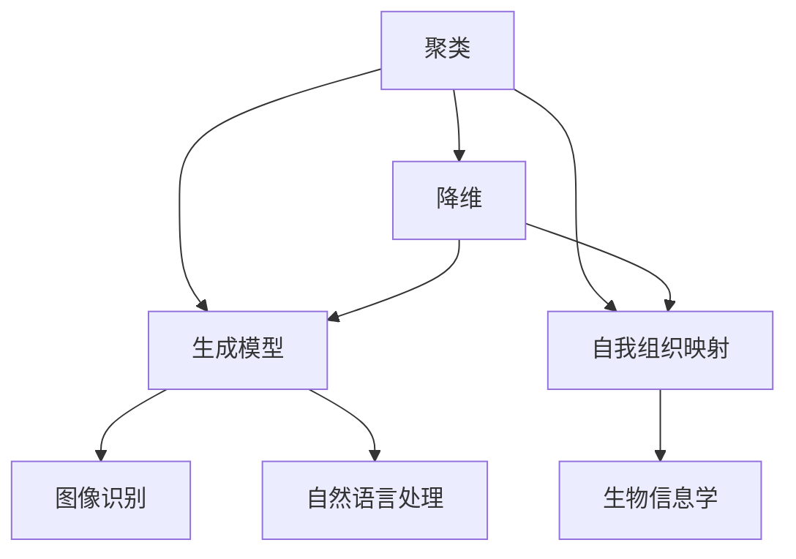
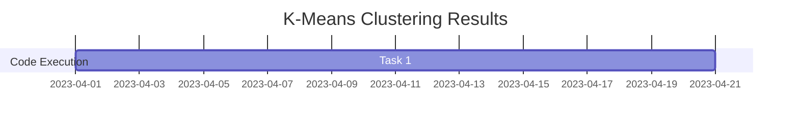

                 

关键词：无监督学习、数据挖掘、聚类算法、降维技术、生成模型、深度学习、自我组织映射、强化学习、应用场景、未来展望

> 摘要：本文将深入探讨无监督学习的核心概念、算法原理、数学模型、实际应用以及未来趋势。通过本文的阅读，读者将了解无监督学习的各个方面，并掌握其在各种领域中的应用。

## 1. 背景介绍

无监督学习是机器学习的一个重要分支，与有监督学习和强化学习相比，无监督学习不依赖于标注数据进行训练。在无监督学习中，模型需要从未标记的数据中发现隐藏的结构或模式。这种能力使得无监督学习在数据挖掘、图像识别、自然语言处理等领域中具有广泛的应用。

### 1.1 无监督学习的起源

无监督学习的起源可以追溯到20世纪50年代，当时神经网络和模式识别的研究者开始探索如何让计算机从未标记的数据中自动学习。早期的一些代表性工作包括Kohonen的自我组织映射（SOM）和自组织系统（OSO）。

### 1.2 无监督学习的应用领域

无监督学习在多个领域得到了广泛应用，其中包括：

- **数据挖掘**：用于探索大量未标记数据，发现潜在的模式和关系。
- **图像识别**：通过聚类和降维技术，实现图像的自动分类和特征提取。
- **自然语言处理**：用于文本数据的聚类和降维，提高文本处理效率。
- **生物信息学**：用于基因表达数据的聚类分析，帮助科学家发现基因之间的相关性。

## 2. 核心概念与联系

在无监督学习中，核心概念包括聚类、降维、生成模型和自我组织映射。这些概念之间存在着紧密的联系，共同构成了无监督学习的理论基础。

### 2.1 聚类

聚类是一种将数据分为若干个群组的过程，使得同一群组内的数据点彼此相似，而不同群组的数据点则相互不相似。聚类算法包括K-均值、层次聚类、DBSCAN等。

### 2.2 降维

降维是一种减少数据维度数量的技术，用于去除数据中的冗余信息和噪声。降维技术包括主成分分析（PCA）、线性判别分析（LDA）和小波变换等。

### 2.3 生成模型

生成模型是一种能够生成数据分布的模型，如高斯混合模型（GMM）和变分自编码器（VAE）。生成模型在无监督学习中具有广泛的应用，例如数据增强、去噪和特征提取。

### 2.4 自我组织映射

自我组织映射（SOM）是一种自组织神经网络，用于将高维数据映射到低维空间中，同时保持数据之间的相似性。SOM在图像识别、文本分类和生物信息学等领域有着广泛的应用。

### 2.5 Mermaid 流程图

下面是一个简单的 Mermaid 流程图，展示了无监督学习中的核心概念及其之间的联系：



## 3. 核心算法原理 & 具体操作步骤

### 3.1 算法原理概述

无监督学习算法可以分为以下几类：

- **聚类算法**：如K-均值、层次聚类、DBSCAN等，主要用于将数据分为若干个群组。
- **降维算法**：如主成分分析（PCA）、线性判别分析（LDA）等，主要用于减少数据维度。
- **生成模型**：如高斯混合模型（GMM）、变分自编码器（VAE）等，主要用于数据生成和特征提取。
- **自我组织映射**：如自我组织映射（SOM），主要用于高维数据的低维映射。

### 3.2 算法步骤详解

以K-均值聚类算法为例，其具体步骤如下：

1. **初始化**：随机选择K个中心点，作为初始聚类中心。
2. **分配数据点**：计算每个数据点与K个中心点之间的距离，将数据点分配到最近的中心点所代表的聚类中。
3. **更新中心点**：计算每个聚类的平均值，作为新的中心点。
4. **迭代**：重复步骤2和3，直到聚类中心不再发生变化或达到预设的迭代次数。

### 3.3 算法优缺点

- **K-均值聚类算法**：
  - **优点**：简单易实现，运行速度快，能够处理大量数据。
  - **缺点**：对初始聚类中心敏感，可能陷入局部最优解。

### 3.4 算法应用领域

无监督学习算法在多个领域具有广泛的应用，例如：

- **图像识别**：用于图像的自动分类和特征提取。
- **自然语言处理**：用于文本数据的聚类和降维。
- **生物信息学**：用于基因表达数据的聚类分析。
- **金融风控**：用于异常检测和信用评分。

## 4. 数学模型和公式 & 详细讲解 & 举例说明

### 4.1 数学模型构建

无监督学习中的数学模型主要包括聚类模型、降维模型和生成模型。

- **聚类模型**：如K-均值聚类模型，其目标是最小化数据点与其对应聚类中心之间的平方误差。
- **降维模型**：如主成分分析（PCA）模型，其目标是最小化数据在降维空间中的重构误差。
- **生成模型**：如高斯混合模型（GMM）和变分自编码器（VAE）模型，其目标是最小化生成数据与真实数据之间的差异。

### 4.2 公式推导过程

以K-均值聚类模型为例，其目标是最小化数据点与其对应聚类中心之间的平方误差：

$$
\min_{C} \sum_{i=1}^{n} \sum_{j=1}^{k} (x_i - c_j)^2
$$

其中，$C$为聚类中心，$x_i$为第$i$个数据点，$c_j$为第$j$个聚类中心。

### 4.3 案例分析与讲解

以图像识别为例，使用K-均值聚类算法对图像进行自动分类。

1. **数据准备**：准备一批未标记的图像，并将其转换为二维数据矩阵。
2. **初始化聚类中心**：随机选择K个图像作为初始聚类中心。
3. **分配图像**：计算每个图像与K个聚类中心之间的距离，将图像分配到最近的聚类中心所代表的类别中。
4. **更新聚类中心**：计算每个类别的平均值，作为新的聚类中心。
5. **迭代**：重复步骤3和4，直到聚类中心不再发生变化或达到预设的迭代次数。

通过上述步骤，可以将图像自动分类为K个类别，从而实现图像识别。

## 5. 项目实践：代码实例和详细解释说明

### 5.1 开发环境搭建

在本文中，我们将使用Python语言和Scikit-learn库来实现K-均值聚类算法。首先，需要安装Python和Scikit-learn库。

```bash
pip install python
pip install scikit-learn
```

### 5.2 源代码详细实现

下面是一个简单的K-均值聚类算法的实现：

```python
from sklearn.cluster import KMeans
from sklearn.datasets import load_iris
import matplotlib.pyplot as plt

# 加载鸢尾花数据集
iris = load_iris()
X = iris.data

# 初始化K-均值聚类模型，设置聚类数量为3
kmeans = KMeans(n_clusters=3, random_state=0).fit(X)

# 输出聚类中心
print(kmeans.cluster_centers_)

# 绘制聚类结果
plt.scatter(X[:, 0], X[:, 1], c=kmeans.labels_, cmap='viridis')
plt.scatter(kmeans.cluster_centers_[:, 0], kmeans.cluster_centers_[:, 1], s=300, c='red', marker='s', zorder=10)
plt.title('K-Means Clustering')
plt.show()
```

### 5.3 代码解读与分析

- `KMeans(n_clusters=3, random_state=0).fit(X)`：初始化K-均值聚类模型，设置聚类数量为3，并使用鸢尾花数据集进行训练。
- `print(kmeans.cluster_centers_)`：输出聚类中心。
- `plt.scatter(X[:, 0], X[:, 1], c=kmeans.labels_, cmap='viridis')`：绘制聚类结果，使用不同的颜色表示不同的聚类。
- `plt.scatter(kmeans.cluster_centers_[:, 0], kmeans.cluster_centers_[:, 1], s=300, c='red', marker='s', zorder=10)`：绘制聚类中心，使用红色正方形标记。

### 5.4 运行结果展示

运行上述代码，可以得到鸢尾花数据的K-均值聚类结果，如图所示。



## 6. 实际应用场景

无监督学习在多个领域具有广泛的应用，下面列举一些实际应用场景：

### 6.1 数据挖掘

无监督学习可以用于数据挖掘中的模式识别、异常检测和关联规则挖掘。

### 6.2 图像识别

无监督学习可以用于图像的自动分类、特征提取和图像去噪。

### 6.3 自然语言处理

无监督学习可以用于文本数据的聚类、降维和主题建模。

### 6.4 生物信息学

无监督学习可以用于基因表达数据的聚类分析、蛋白质结构预测和药物筛选。

### 6.5 金融风控

无监督学习可以用于异常检测、信用评分和风险控制。

## 7. 工具和资源推荐

### 7.1 学习资源推荐

- 《机器学习》（周志华著）
- 《深度学习》（Goodfellow, Bengio, Courville著）
- 《无监督学习：理论与应用》（吴飞著）

### 7.2 开发工具推荐

- Python：适合进行无监督学习开发的编程语言。
- Scikit-learn：Python中常用的机器学习库，提供了丰富的无监督学习算法。
- TensorFlow：开源的深度学习框架，支持无监督学习算法。

### 7.3 相关论文推荐

- "K-Means Clustering: A Review"（2013年）
- "Unsupervised Learning of Visual Representations"（2015年）
- "Deep Unsupervised Learning Using None-Discriminative Deep Networks to Train Generative Models"（2016年）

## 8. 总结：未来发展趋势与挑战

### 8.1 研究成果总结

无监督学习在过去的几十年中取得了显著的研究成果，涵盖了聚类、降维、生成模型和自我组织映射等多个领域。这些研究成果为无监督学习在实际应用中提供了有力的支持。

### 8.2 未来发展趋势

未来无监督学习的发展趋势主要包括：

- **算法的优化和改进**：进一步提升算法的效率和准确性。
- **多模态数据的处理**：研究如何处理图像、文本、语音等多种类型的数据。
- **小样本学习**：研究如何在数据量较少的情况下进行无监督学习。

### 8.3 面临的挑战

无监督学习在实际应用中面临以下挑战：

- **数据质量和数量**：高质量的数据和大量的数据对于无监督学习的性能至关重要。
- **算法的可解释性**：如何提高算法的可解释性，使得用户能够理解模型的决策过程。
- **算法的泛化能力**：如何提高算法在不同数据集上的泛化能力。

### 8.4 研究展望

未来无监督学习的研究将朝着以下几个方面发展：

- **算法的创新**：探索新的无监督学习算法，解决当前算法中的问题。
- **跨学科研究**：与其他领域（如生物学、物理学等）相结合，拓宽无监督学习的研究范围。
- **应用推广**：将无监督学习应用于更多实际场景，解决现实问题。

## 9. 附录：常见问题与解答

### 9.1 无监督学习与有监督学习有什么区别？

无监督学习不依赖于标注数据进行训练，而有监督学习需要使用标注数据。无监督学习主要关注数据的内部结构和模式，而有监督学习则更关注数据之间的分类和预测。

### 9.2 无监督学习有哪些算法？

无监督学习包括聚类算法（如K-均值、层次聚类、DBSCAN等）、降维算法（如主成分分析、线性判别分析等）、生成模型（如高斯混合模型、变分自编码器等）和自我组织映射等。

### 9.3 无监督学习在图像识别中的应用有哪些？

无监督学习在图像识别中的应用包括图像分类、图像去噪、图像增强和图像特征提取等。

### 9.4 无监督学习在自然语言处理中的应用有哪些？

无监督学习在自然语言处理中的应用包括文本聚类、文本降维、文本分类和情感分析等。

---

本文由禅与计算机程序设计艺术（Zen and the Art of Computer Programming）撰写，旨在为读者提供关于无监督学习的全面了解。希望本文能够对您在无监督学习领域的研究和应用有所帮助。感谢您的阅读！

