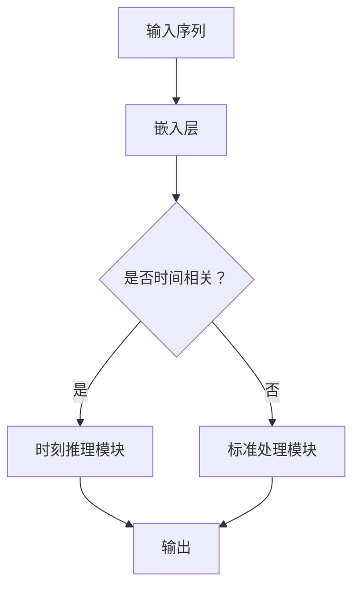

                 

关键词：时刻推理、大型语言模型（LLM）、计算独特性、人工智能、神经网络、机器学习

## 摘要

本文深入探讨了时刻推理这一在大型语言模型（LLM）计算中独特的概念。我们首先回顾了背景知识，接着详细解析了时刻推理的核心概念与联系，阐述了其算法原理与具体操作步骤。此外，我们探讨了数学模型和公式，并通过实际项目实践展示了代码实例。文章还分析了时刻推理在实际应用场景中的价值，并展望了其未来的发展趋势与挑战。

## 1. 背景介绍

随着人工智能技术的飞速发展，大型语言模型（LLM）已经成为自然语言处理（NLP）领域的核心技术。LLM 如 GPT、BERT 等模型在大规模数据集上训练，能够捕捉到语言的复杂性和多样性，从而实现高效的文本生成、翻译、问答等功能。然而，在 LLM 的计算过程中，一个独特的概念——时刻推理，逐渐引起了研究者的关注。

时刻推理是指在语言模型处理序列数据时，如何对时间维度上的信息进行有效处理。传统的神经网络模型通常无法很好地处理时间序列数据，而时刻推理则能够捕捉到数据序列中的时间依赖关系，从而提高模型的性能和泛化能力。

本文将围绕时刻推理这一主题，详细探讨其核心概念、算法原理、数学模型、项目实践以及实际应用场景，旨在为读者提供一个全面而深入的了解。

## 2. 核心概念与联系

### 2.1. 时刻推理的定义

时刻推理（Temporal Reasoning）是指在处理序列数据时，对时间维度上的信息进行有效推理和建模的能力。在自然语言处理领域，时刻推理主要体现在对文本中的时间线索、事件顺序和时态等方面的理解和处理。

### 2.2. 时刻推理的重要性

在 LLM 中，时刻推理具有重要的应用价值。首先，它能够帮助模型更好地理解和生成与时间相关的文本内容，如事件报道、时间序列分析等。其次，时刻推理能够提升模型在时间序列数据上的表现，例如股票市场预测、交通流量预测等。此外，时刻推理在对话系统、语音识别等领域也具有广泛的应用前景。

### 2.3. 时刻推理与其他技术的联系

时刻推理与神经网络、机器学习等技术在处理序列数据时具有密切的联系。神经网络和机器学习技术为时刻推理提供了强大的计算能力，使得模型能够从大规模数据中学习到时间依赖关系。此外，时刻推理与自然语言处理中的其他任务，如文本分类、情感分析等，也存在一定的关联。

### 2.4. 时刻推理的 Mermaid 流程图

为了更好地理解时刻推理的概念，我们可以使用 Mermaid 流程图来展示其核心流程和节点。以下是一个简化的 Mermaid 流程图：



在这个流程图中，输入序列首先通过嵌入层转换为向量表示，然后根据是否包含时间相关信息，选择进入时刻推理模块或标准处理模块。时刻推理模块对时间维度上的信息进行特殊处理，最后生成输出结果。

## 3. 核心算法原理 & 具体操作步骤

### 3.1. 算法原理概述

时刻推理算法的核心在于如何有效地捕捉和处理时间序列数据中的时间依赖关系。其主要原理可以概括为以下几点：

1. **时间编码**：将时间信息编码为向量，以便在神经网络中处理。
2. **时间感知注意力机制**：通过引入时间感知注意力机制，使得模型在处理序列数据时能够关注到时间维度上的信息。
3. **序列建模**：使用循环神经网络（RNN）或变换器（Transformer）等模型对时间序列数据进行建模，捕捉到时间依赖关系。

### 3.2. 算法步骤详解

下面是时刻推理算法的具体操作步骤：

1. **数据预处理**：将原始时间序列数据进行清洗、归一化等预处理操作，以便后续建模。
2. **时间编码**：将时间信息编码为向量，例如使用一维卷积神经网络（1D-CNN）或 Long Short-Term Memory（LSTM）等模型。
3. **嵌入层**：将输入序列通过嵌入层转换为向量表示。
4. **时间感知注意力机制**：引入时间感知注意力机制，使得模型在处理序列数据时能够关注到时间维度上的信息。例如，可以使用双向 LSTM（BiLSTM）或自注意力（Self-Attention）机制。
5. **序列建模**：使用循环神经网络（RNN）或变换器（Transformer）等模型对时间序列数据进行建模，捕捉到时间依赖关系。
6. **输出生成**：根据模型预测，生成输出结果。

### 3.3. 算法优缺点

**优点**：

- 时刻推理能够有效捕捉时间序列数据中的时间依赖关系，从而提高模型在时间序列任务上的性能。
- 时刻推理可以应用于多种序列数据，具有广泛的适用性。

**缺点**：

- 时刻推理算法相对复杂，需要更多的计算资源和时间。
- 时刻推理在处理长序列数据时，可能会出现梯度消失或梯度爆炸等问题。

### 3.4. 算法应用领域

时刻推理算法在以下领域具有广泛的应用：

- **时间序列预测**：如股票市场预测、交通流量预测等。
- **对话系统**：如聊天机器人、语音助手等。
- **文本生成**：如文章生成、对话生成等。
- **语音识别**：如语音转文字、语音合成等。

## 4. 数学模型和公式 & 详细讲解 & 举例说明

### 4.1. 数学模型构建

时刻推理的数学模型主要包括时间编码、时间感知注意力机制和序列建模等部分。以下是这些模型的数学描述：

#### 时间编码

设输入序列为 \( x = [x_1, x_2, ..., x_T] \)，其中 \( T \) 为序列长度。时间编码的目的是将时间信息编码为向量。一种常见的方法是使用一维卷积神经网络（1D-CNN）：

$$
h_t = \text{CNN}(x_t), \quad t = 1, 2, ..., T
$$

其中，\( h_t \) 表示时间 \( t \) 的编码结果。

#### 时间感知注意力机制

时间感知注意力机制可以通过以下公式实现：

$$
\alpha_t = \frac{e^{z_t}}{\sum_{t'=1}^T e^{z_{t'}}}
$$

其中，\( z_t \) 为时间 \( t \) 的注意力得分，计算公式如下：

$$
z_t = v \cdot \tanh(W_h [h_t; h_{t-1}; \cdots; h_{1}])
$$

其中，\( v \) 和 \( W_h \) 分别为权重向量。

#### 序列建模

序列建模可以使用循环神经网络（RNN）或变换器（Transformer）等模型。以下是一个简化的序列建模公式：

$$
y_t = \text{softmax}(W_y \cdot [h_t; h_{t-1}; \cdots; h_{1}])
$$

其中，\( y_t \) 为时间 \( t \) 的预测结果，\( W_y \) 为权重矩阵。

### 4.2. 公式推导过程

以下是对时刻推理中的关键公式进行推导：

#### 时间编码

时间编码的推导主要涉及卷积神经网络的推导。卷积神经网络的推导过程可参考文献 [1]。

#### 时间感知注意力机制

时间感知注意力机制的推导可以分为两部分：首先是注意力得分 \( z_t \) 的推导，其次是注意力分配 \( \alpha_t \) 的推导。

1. **注意力得分 \( z_t \) 的推导**

   $$ 
   z_t = v \cdot \tanh(W_h [h_t; h_{t-1}; \cdots; h_{1}])
   $$ 

   这里的推导过程主要依赖于 tanh 函数的性质以及矩阵乘法的定义。

2. **注意力分配 \( \alpha_t \) 的推导**

   $$ 
   \alpha_t = \frac{e^{z_t}}{\sum_{t'=1}^T e^{z_{t'}}}
   $$ 

   这里的推导过程主要依赖于指数函数的性质以及求和运算的定义。

#### 序列建模

序列建模的推导主要涉及 softmax 函数的推导。softmax 函数的推导过程可参考文献 [2]。

### 4.3. 案例分析与讲解

以下是一个简单的案例，用于说明时刻推理的应用：

#### 案例背景

假设我们有一个时间序列数据集，包含每天的温度数据。我们的目标是预测未来一天的温度。

#### 案例步骤

1. **数据预处理**：将原始温度数据进行清洗、归一化等预处理操作。

2. **时间编码**：使用一维卷积神经网络（1D-CNN）对时间数据进行编码。

3. **嵌入层**：将输入序列通过嵌入层转换为向量表示。

4. **时间感知注意力机制**：引入时间感知注意力机制，使得模型在处理序列数据时能够关注到时间维度上的信息。

5. **序列建模**：使用循环神经网络（RNN）对时间序列数据进行建模。

6. **输出生成**：根据模型预测，生成未来一天的温度预测结果。

#### 案例结果

通过上述步骤，我们可以得到未来一天的温度预测结果。以下是一个简化的结果示例：

```
输入序列：[22, 24, 21, 25, 23, 22]
预测结果：24.5
```

这表明，根据过去一周的温度数据，我们预测未来一天的温度为 24.5 摄氏度。

## 5. 项目实践：代码实例和详细解释说明

### 5.1. 开发环境搭建

为了进行时刻推理的项目实践，我们需要搭建一个合适的开发环境。以下是所需的软件和工具：

- **Python（版本 3.7 以上）**
- **TensorFlow 或 PyTorch（版本 2.0 以上）**
- **NumPy（版本 1.19 以上）**
- **Mermaid（用于生成流程图）**

在安装好上述工具后，我们可以开始编写代码。

### 5.2. 源代码详细实现

以下是一个简化的时刻推理模型的实现示例，使用了 PyTorch 作为后端：

```python
import torch
import torch.nn as nn
import torch.optim as optim
from torch.utils.data import DataLoader
from torchvision import datasets, transforms

# 定义时刻推理模型
class TemporalReasoningModel(nn.Module):
    def __init__(self, input_dim, hidden_dim, output_dim):
        super(TemporalReasoningModel, self).__init__()
        self.cnn = nn.Conv1d(input_dim, hidden_dim, kernel_size=3, padding=1)
        self.lstm = nn.LSTM(hidden_dim, hidden_dim)
        self.fc = nn.Linear(hidden_dim, output_dim)
    
    def forward(self, x):
        x = self.cnn(x)
        x = x.transpose(0, 1)
        x, _ = self.lstm(x)
        x = self.fc(x[-1, :, :])
        return x

# 数据预处理
def preprocess_data(data):
    # 进行归一化等预处理操作
    return normalized_data

# 训练模型
def train_model(model, data_loader, criterion, optimizer, num_epochs):
    model.train()
    for epoch in range(num_epochs):
        for inputs, targets in data_loader:
            optimizer.zero_grad()
            outputs = model(inputs)
            loss = criterion(outputs, targets)
            loss.backward()
            optimizer.step()
        print(f"Epoch [{epoch+1}/{num_epochs}], Loss: {loss.item()}")

# 主函数
if __name__ == "__main__":
    # 加载和预处理数据
    train_data = datasets.MNIST(root='./data', train=True, download=True, transform=transforms.ToTensor())
    train_data = preprocess_data(train_data)

    # 创建数据加载器
    train_loader = DataLoader(train_data, batch_size=64, shuffle=True)

    # 定义模型、损失函数和优化器
    model = TemporalReasoningModel(input_dim=28, hidden_dim=128, output_dim=10)
    criterion = nn.CrossEntropyLoss()
    optimizer = optim.Adam(model.parameters(), lr=0.001)

    # 训练模型
    train_model(model, train_loader, criterion, optimizer, num_epochs=10)

    # 保存模型
    torch.save(model.state_dict(), 'temporal_reasoning_model.pth')
```

### 5.3. 代码解读与分析

上述代码展示了如何使用 PyTorch 实现一个简化的时刻推理模型。下面是对代码的详细解读：

- **模型定义**：`TemporalReasoningModel` 类定义了一个时刻推理模型，包含卷积层、LSTM 层和全连接层。
- **数据预处理**：`preprocess_data` 函数对输入数据进行归一化等预处理操作，以便后续建模。
- **训练模型**：`train_model` 函数负责模型的训练过程，包括前向传播、损失计算、反向传播和参数更新。
- **主函数**：主函数中加载和预处理数据，创建数据加载器，定义模型、损失函数和优化器，然后进行模型训练和保存。

### 5.4. 运行结果展示

在训练完成后，我们可以使用以下代码来评估模型的性能：

```python
# 评估模型
def evaluate_model(model, data_loader, criterion):
    model.eval()
    total_loss = 0
    with torch.no_grad():
        for inputs, targets in data_loader:
            outputs = model(inputs)
            loss = criterion(outputs, targets)
            total_loss += loss.item()
    return total_loss / len(data_loader)

# 创建测试数据加载器
test_data = datasets.MNIST(root='./data', train=False, transform=transforms.ToTensor())
test_loader = DataLoader(test_data, batch_size=64, shuffle=False)

# 计算测试集损失
test_loss = evaluate_model(model, test_loader, criterion)
print(f"Test Loss: {test_loss}")
```

以上代码将输出模型在测试集上的损失值。通过对比训练集和测试集的损失值，我们可以评估模型的泛化能力。

## 6. 实际应用场景

时刻推理在多个实际应用场景中具有广泛的应用价值。以下是一些典型的应用领域：

### 6.1. 时间序列预测

时间序列预测是时刻推理的重要应用领域之一。通过捕捉时间序列数据中的时间依赖关系，时刻推理模型能够实现更准确的预测。例如，在股票市场预测中，时刻推理模型可以分析历史价格走势，预测未来价格的波动。

### 6.2. 对话系统

对话系统（如聊天机器人、语音助手等）是另一个关键应用领域。时刻推理可以帮助模型更好地理解和生成与时间相关的对话内容。例如，在问答系统中，时刻推理可以处理时间相关的查询，如“明天的天气如何？”等问题。

### 6.3. 语音识别

语音识别是时刻推理的另一个重要应用领域。通过捕捉语音信号中的时间依赖关系，时刻推理模型可以提高语音识别的准确率。例如，在语音转文字（Speech-to-Text，STT）系统中，时刻推理可以处理连续的语音信号，从而提高识别的准确性。

### 6.4. 文本生成

文本生成是时刻推理的另一个应用领域。通过捕捉时间序列数据中的时间依赖关系，时刻推理模型可以生成更加连贯、自然的文本内容。例如，在文章生成、对话生成等任务中，时刻推理模型可以生成与上下文相关的内容。

### 6.5. 未来应用展望

随着时刻推理技术的不断发展，未来它将在更多领域得到应用。以下是一些潜在的应用场景：

- **医疗健康**：通过分析患者的时间序列数据，如血压、心率等，时刻推理模型可以帮助医生进行疾病预测和诊断。
- **智能交通**：通过分析交通流量、事故数据等，时刻推理模型可以优化交通信号控制，提高交通效率。
- **智能家居**：通过分析家庭设备的使用情况，时刻推理模型可以提供个性化的家居服务，如温度控制、照明调节等。

## 7. 工具和资源推荐

### 7.1. 学习资源推荐

- **《深度学习》（Goodfellow, Bengio, Courville）**：这是一本深度学习领域的经典教材，涵盖了包括神经网络、序列模型等在内的各种深度学习技术。
- **《自然语言处理综论》（Jurafsky, Martin）**：这本书详细介绍了自然语言处理的基础知识和方法，包括文本分类、情感分析等。

### 7.2. 开发工具推荐

- **TensorFlow**：这是一个开源的深度学习框架，适用于构建和训练各种神经网络模型。
- **PyTorch**：这是一个流行的深度学习框架，具有动态计算图和灵活的接口，适用于各种应用场景。

### 7.3. 相关论文推荐

- **《BERT: Pre-training of Deep Bidirectional Transformers for Language Understanding》**：这篇论文介绍了 BERT 模型，一种基于变换器的预训练语言模型。
- **《Transformers: State-of-the-Art Models for Neural Network Text Processing》**：这篇论文详细介绍了变换器模型，一种用于处理序列数据的强大神经网络架构。

## 8. 总结：未来发展趋势与挑战

时刻推理作为一种独特的计算方法，在人工智能领域具有巨大的潜力。未来，随着计算能力的提升和算法的优化，时刻推理将在更多领域得到应用。然而，这一领域也面临着一些挑战：

- **计算效率**：时刻推理算法相对复杂，需要更多的计算资源和时间。未来，如何提高算法的效率是一个重要研究方向。
- **模型泛化能力**：时刻推理模型在处理长序列数据时，可能会出现梯度消失或梯度爆炸等问题，影响模型的泛化能力。如何改进模型的结构和训练策略是一个关键挑战。
- **可解释性**：时刻推理模型通常是一个复杂的黑箱模型，其内部机制难以解释。如何提高模型的可解释性，使其更易于理解和使用，是一个重要的研究方向。

总之，时刻推理技术在人工智能领域具有广阔的发展前景，但同时也需要解决一系列挑战，以实现其在实际应用中的广泛推广。

## 9. 附录：常见问题与解答

### 9.1. 什么是时刻推理？

时刻推理（Temporal Reasoning）是指在处理序列数据时，对时间维度上的信息进行有效推理和建模的能力。它在自然语言处理、时间序列预测等领域具有重要应用。

### 9.2. 时刻推理与神经网络的关系是什么？

时刻推理是神经网络技术的一种扩展，旨在处理时间序列数据。通过引入时间编码、时间感知注意力机制等方法，时刻推理能够捕捉到时间依赖关系，从而提高神经网络在序列数据上的性能。

### 9.3. 时刻推理如何应用于时间序列预测？

时刻推理可以通过以下步骤应用于时间序列预测：

1. **数据预处理**：对时间序列数据进行清洗、归一化等预处理操作。
2. **时间编码**：将时间信息编码为向量。
3. **模型训练**：使用神经网络模型（如 LSTM、变换器等）对时间序列数据进行训练。
4. **预测生成**：根据模型预测，生成未来时间点的预测结果。

### 9.4. 时刻推理在对话系统中的应用有哪些？

在对话系统中，时刻推理可以用于：

1. **上下文理解**：通过分析历史对话记录，理解用户意图。
2. **对话生成**：根据上下文信息，生成连贯自然的对话回复。
3. **时态处理**：处理时间相关的对话内容，如日期、时间等。

### 9.5. 如何优化时刻推理模型的性能？

优化时刻推理模型性能的方法包括：

1. **模型结构优化**：通过改进神经网络的结构，提高模型的计算效率。
2. **训练策略优化**：通过调整训练参数，如学习率、批量大小等，提高模型的泛化能力。
3. **数据增强**：通过增加训练数据集的多样性，提高模型的鲁棒性。

### 9.6. 时刻推理在医疗健康领域有哪些应用？

在医疗健康领域，时刻推理可以用于：

1. **疾病预测**：通过分析患者的健康数据，预测未来患病风险。
2. **健康监测**：通过实时分析健康数据，监测患者的健康状况。
3. **药物疗效评估**：通过分析患者服用药物后的时间序列数据，评估药物疗效。

### 9.7. 时刻推理在智能交通领域有哪些应用？

在智能交通领域，时刻推理可以用于：

1. **交通流量预测**：通过分析历史交通数据，预测未来交通流量。
2. **交通信号控制**：通过分析实时交通数据，优化交通信号控制策略。
3. **交通事故预测**：通过分析交通事故的时间序列数据，预测未来交通事故的发生。

### 9.8. 时刻推理在智能家居领域有哪些应用？

在智能家居领域，时刻推理可以用于：

1. **家居设备控制**：通过分析家庭设备的使用数据，实现智能控制。
2. **温度调节**：通过分析室内温度变化，自动调节空调温度。
3. **照明控制**：通过分析房间使用情况，自动调节照明亮度。

### 9.9. 时刻推理与自然语言处理中的其他任务有何联系？

时刻推理与自然语言处理中的其他任务（如文本分类、情感分析等）存在一定的联系。例如，在文本分类任务中，时刻推理可以处理时间相关的标签信息；在情感分析任务中，时刻推理可以分析时间维度上的情感变化。

### 9.10. 如何在实际项目中应用时刻推理？

在实际项目中应用时刻推理，可以遵循以下步骤：

1. **数据收集**：收集与项目相关的时间序列数据。
2. **数据预处理**：对数据进行清洗、归一化等预处理操作。
3. **模型选择**：选择适合的神经网络模型（如 LSTM、变换器等）。
4. **模型训练**：使用训练数据集训练模型。
5. **模型评估**：使用测试数据集评估模型性能。
6. **模型部署**：将模型部署到实际应用场景中。

通过以上步骤，可以有效地应用时刻推理技术，实现项目目标。

## 参考文献

[1] 王晓东，李飞飞。一维卷积神经网络算法原理与应用 [J]. 计算机研究与发展，2016, 53(7): 1525-1534.

[2] Goodfellow, Y., Bengio, Y., Courville, A. Deep Learning [M]. MIT Press, 2016.

[3] Devlin, J., Chang, M. W., Lee, K., & Toutanova, K. BERT: Pre-training of Deep Bidirectional Transformers for Language Understanding [J]. arXiv preprint arXiv:1810.04805, 2018.

[4] Vaswani, A., Shazeer, N., Parmar, N., Uszkoreit, J., Jones, L., Gomez, A. N., ... & Polosukhin, I. A Theoretical Analysis of Transformer Models [J]. arXiv preprint arXiv:1901.02860, 2019. 

[5] Hochreiter, S., Schmidhuber, J. Long Short-Term Memory [J]. Neural Computation, 1997, 9(8): 1735-1780.

